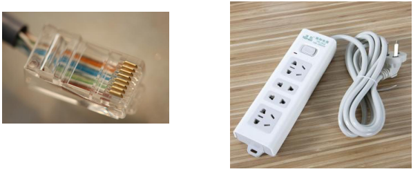

# 物理层

**概览：**

**[:question: 物理层基本概念](#物理层基本概念)**  
**[:question: 通信的一些基本概念](#通信的一些基本概念)**  
**[:question: 奈奎斯特定理与香农定理](#奈奎斯特定理与香农定理)**  
**[:question: 编码与调制](#编码与调制)**  
**[:question: 三种交换技术](#交换技术)**  
**[:question: 传输介质与传输设备](#传输介质与传输设备)**  

## 物理层基本概念

物理层解决如何在连接各种计算机的传输媒体上传输数据比特流，而不是指具体的传输媒体。  
物理层主要任务：确定与传输媒体接口有关的一些特性。（定义标准）

### 物理层接口特性

- 机械特性：定义物理连接的特性，规定物理连接时所采用的规格、接口形状、引线数目、引脚数量和排列情况

- 电器特性：规定传输二进制位时，线路上信号的电压范围、阻抗匹配、传输速率和距离限制等
- 功能特性：指某条线上出现的某一电平表示何种意义，接口部件的信号线的用途
- 规程特性：定义各条物理线路的工作规程和时序关系

## 通信的一些基本概念

- 数据：传送信息的实体
- 信号：数据的电气或电磁表现，是数据在传输过程中的存在形式。分为数字信号和模拟信号
- 传输方式
  - 串行传输：一个一个的比特按照时间顺序传输
  - 并行传输：多个比特通过多条通信信道同时传输
- 码元：一个固定时长的信号波形（数字脉冲）表示一个K进制数字，代表不同离散数值的基本波形，这个时长内的信号称为K进制码元，该时长成为码元宽度
- 信源：产生和发送数据的源头
- 信宿：接收数据的终点
- 信道：发送端信源发送的信息经过变换成合适的信号后在信道上传输到信宿，是信号的传输媒介
  - 按传输形式分为：传送模拟信号的模拟信道、传输数字信号的数字信道
  - 按传输介质分为：无线信道、有线信道
- 通信交互方式
  - 单工通信：只有一个方向的通信，没有反方向的交互（无线电广播、电视广播）
  - 半双工通信：通信双方都可以发送或者接收信息，但是任何一方不能同时发送和接收信息（需要两条信道）
  - 全双工通信：通信双方可以同时发送和接收信息，需要两条信道
- 速率
  - 数据的传输速率：单位时间内传输的数据量
  - 码元传输速率（码元速率、波形速率）：单位时间内数字通信系统所传输的码元个数（单位是波特）
  - 信息传输速率（信息速率、比特率）：表示单位时间内数字通信系统传输的二进制码元个数（比特数），单位是比特/秒

## 奈奎斯特定理与香农定理

### 奈奎斯特定理

理想低通（没有噪声，带宽有限）的信道中，极限码元的传输速率为2W波特（W是理想低通信道的带宽，单位HZ)  
理想低通信道下的极限数据传输速率=$2Wlog_{2}{V}$单位是b/s

结论：

- 任何信道中，码元的传输速率是有上限的
- 信道的频带越宽，就可以用更高的速率进行码元的有效传输
- 奈氏准则给出了码元传输速率的限制，但是没有给出信息传输速率的限制（即一个码元可以对应多少个二进制位给出的限制）

### 香农定理

带宽受限且高斯白噪声干扰的信道的极限数据传输率  
信道的极限传输速率=$Wlog_{2}{(1+S/N)}$，单位为b/s  
  > W为信道的带宽；S为信道所传输信号的平均功率；N为信道内部的高斯噪声功率  
  > S/N为信号的平均功率和噪声的平均功率之比

结论：

- 信道的带宽或者信道中的信噪比越大，信息的极限传输速率越高
- 对一定的传输带宽和一定的信噪比，信息传输速率上限是确定的
- 只要信息的传输速率低于信道的极限传输速率，就能找到某种方法来实现无差错的传输
- 香农定理得出的极限信息传输速率，实际信道的传输速率要比他低很多

## 编码与调制

### 概念

调制：数据变换为模拟信号的过程  
编码：数据变化为数字信号的过程

### 数字编码为数字信号

数字数据编码用于基带传输中，在不改变数字信号频率的情况下，直接传输数字信号

- 非归零编码
  - 用两个电压表示两个二进制数字，低电平为0，高电平为1
  - 优点：容易实现
  - 缺点：无法使得双方同步，没有检错功能
- 曼彻斯特编码
  - 将一个码元分为两个相等的间隔，前一个间隔为高电平后一个间隔为低电平表示1，码元0的方向相反
  - 优点：可以尽心双方的同步
  - 缺点：占用的频带宽度是原始基带宽度的两倍
  - 以太网使用的就是曼彻斯特编码
- 差分曼彻斯特编码
  - 若码元为1，前半个码元的电平与上一个码元的后半个码元的电平相同；若码元为0则相反
  - 优点：可以实现自同步，抗干扰性好
  - 主要只用在局域网传输
- 4B/5B编码
  - 将发送的数据量每4位作为一组，然后按照4B/5B编码规则将其转换为相应的5位码
  - 5位码共有32种组合，但是只是其中的16种对应16种不同的4位码，其他的16种作为控制码（帧的开始和结束，线路的状态信息等）或保留

### 数字数据调制为模拟信号

- 幅移键控（ASK）
  - 通过改变载波信号的振幅来表示数字信号1和0，载波的频率和相位不发生变化
  - 比较容易实现，抗干扰能力强
- 频移键控（FSK）
  - 通过改变载波信号的频率来表示数字信号1和0，载波的振幅和相位不发生变化
  - 容易实现，抗干扰能力强，应用广泛
- 相移键控（PSK)
  - 通过改变载波信号的相位来表示数字信号1和0，载波的振幅和频率不发生改变
  - 有分为绝对调相和相对调相
- 正交振幅调制（QAM）
  - 频率相同的前提下，将ASK与PSK结合起来，形成叠加信号
  - 设波特率位B，采用m个相位，每个相位有n种振幅，该QAM技术的数据传输率R为？

### 模拟数据编码为数字信号

- 采样
  - 对模拟信号进行周期性扫描，把时间上连续的信号变成时间上离散的信号
  - 采样频率大于等于模拟数据的频带带宽（最高变化率）的两倍
- 量化
  - 把采用取得的电平幅值按照一定的分级标度，转化为对应的数字值并取整数，这样就把连续的电平幅值转化为离散的数字量
  - 采样和量化的实质就是分割和转换
- 编码
  - 把量化的结果转化为与之对应的二进制编码

### 模拟数据调制为模拟信号

- 需要较高的频率
- 使用频分复用技术，充分利用带宽资源
- 电话局和本地局交换机采用模拟信号传输模拟数据的编码方式
- 模拟的声音数据是加载到模拟的载波信号中传输的

## 三种交换技术

### 电路交换

- 数据传输前，先建立起一条专用（双方独占）的物理通信路径
- 直通方式传输数据
- 电路交换技术的三个阶段
  - 建立连接
  - 数据传输
  - 释放连接
- 优点：
  - 通信时延小：通信线路双方专用，传输时延非常小
  - 有序传输：双方通信时按发送顺序发送数据，不存在失序问题
  - 没有冲突：不同的通信双方有着不同的信道
  - 适用范围广：可以传输模拟信号，也可以传输数字信号
  - 实时性强：双方的物理通路一旦建立，双方就可以随时通信
  - 控制简单：电路交换的交换设备（交换机等）及控制均比较简单
- 缺点：
  - 建立连接时间长：电路交换的平均连接建立时间对计算机通信来说时间较长
  - 线路独占：使用效率较低，只能供通信双方使用
  - 灵活性差：只要通信双方的任何一点出现故障，就必须重新建立连接
  - 难以规格化：数据的不同类型，不同规格，不同速率的终端很难相互进行通信，也难以在通信过程中进行差错控制
  - 无数据存储能力，难以平滑通信量

### 报文交换

- 数据交换的单位是报文，报文携带有目的地址、源地址等信息
- 报文交换的时候使用存储转发方式
- 优点
  - 无需建立连接：不需要建立专用线路，随时可以发送报文，不存在建立时延
  - 动态分配线路：当发送方把报文交给交换设备时，交换设备先存储整个报文，然后选择一条合适的空闲线路，将报文发送出去
  - 提高线路的可靠性：如果某条传输路径发生故障，那么可重新选择另一条路径传输数据，因此提高了传输的可靠性
  - 提供多目标服务：一个报文可以同时发送给多个目的地址
- 缺点
  - 数据进入交换节点后要经过存储、转发，所以存在转发时延（包括接收报文，校验正确性，排队，发送时间等）
  - 报文交换对报文的大小没有限制，所以网络结点要有较大的缓存恐惧
- 报文现在很少使用，多使用分组交换方式代替

### 分组交换

- 采用存储转发方式，限制了每次传送的数据块的大小上限，把大的数据块划分为合理的小数据块，再加上一些必要的控制信息（源地址、目的地址、编号信息），构成分组
- 网络结点根据控制信息把分组送到下一结点，下一结点收到分组后暂时保存并排队等待传输，根据分组控制信息选择它的下一个结点，直到目的结点
- 采用存储转发方式
- 优点
  - 没有建立时延：不需要为通信双方预先建立一条专用的通信线路，不存在连接建立时延，用户可随时发送分组
  - 线路利用率高：通信双方不是固定占有一条通信线路，而是在不同的时间一段一段地部分占有这条物理通路
  - 简化了存储管理（相对于报文交换）：因为分组的长度固定，相应的缓冲区大小也固定，在交换结点中存储器的管理通常被简化为对缓冲区的管理，相对比较容易
  - 加速传输：分组是逐个传输的，可以使后一个分组的存储操作与前一个分组的转发操作并行，这种流水线方式减少了报文的传输时间；传输一个分组所需的缓冲区比传输一次报文所需的缓冲区小，这样因缓冲区不足而等待发送的概率以及时间也会少
  - 减少了出错概率和重发数据量：分组较短，出错概率较小，重发的数据量也就减少，提高了可靠性，也减少了传输时延
- 缺点
  - 存在传输时延
  - 需要额外的信息量：每个小数据块都要加上源地址、目的地址和分组编号信息
  - 当分组交换采用数据包服务时，会出现失序，丢失或重复分组，到达目的地后要对分组进行排序工作

### 数据报服务

- 网络层提供无连接服务。发送方可随时发送分组
- 每个分组有着完整的目的地址
- 每个分组独立的进行路由选择和转发
- 不能保证分组的有序到达
- 不保证可靠通信，可靠性由用户来保证
- 出故障的节点丢失分组，其他分组路径选择不发生变化可以正常传输
- 由用户主机进行流量控制，不保证数据报的可靠性
- 分组在交换节点存储转发时，需要排队等候处理，这会带来一定的时延。当通过交换结点的通信量较大或网络发生拥塞时，这种时延会大大增加，交换结点还可以根据情况丢弃部分分组
- 网络具有冗余路径，当某一交换结点或一段链路出现故障时，可相应地更新转发表，寻找另一条路径转发分组，对故障的适应能力强
- 适用于突发性通信，不利于长报文、会话式通信

### 虚电路方式

- 必须建立连接
- 仅在建立连接阶段使用，每个分组使用长度较短的虚电路号
- 属于同一条虚电路的分组按照同一个路由转发
- 保证分组的有序到达
- 可靠性由网络保证
- 所有经过故障节点的虚电路都不能正常工作
- 可由分组交换网负责，也可以由用户主句负责

### 通信方式

- 单工通信：只有一个方向的通信，没有反方向的交互，仅需要一条信道
- 半双工通信：通信双方都可以发送或者接收信息，但是任何一方不能同时发送和接收信息（需要两条信道）
- 全双工通信：通信双方可以同时发送和接收信息，需要两条信道

### 串行传输&并行传输

- 串行传输
  - 将表示一个字符的8位二进制数按由低位到高位的顺序依次发送
  - 速度慢，费用低，适合远距离
- 并行传输
  - 将表示一个字符的8位二进制数同事通过8条信道发送
  - 用户计算机内部数据传输
  - 速度快，费用高，适合近距离

### 同步传输&异步传输

- 同步传输
  - 数据的传送是以一个数据区块为单位，因此同步传输又称为区块传输
  - 在传送数据时，需先送出1个或多个同步字符，再送出整批的数据
- 异步传输
  - 将比特分成小组传送，小组可以说8位的1个字符或更长。发送方可以在任何时刻发送这些比特分组，而接收方不知道它们会在什么时候到达
  - 传送数据时，加一个字符起始位和一个字符终止位

## 传输介质与传输设备

### 传输介质

#### 物理接口的特性

- 机械特性：主要定义物理连接的边界点，即插接装置。规定物理连接时所采用的规格、引线的数目、引脚的数量和排列情况等
- 电气特性：规定传输二进制位时，线路上信号的电压高地、阻抗匹配、传输速率和距离限制等
- 功能特性：指明某条线上出现的某一电平的电压表示何种意义，接口部件的信号线（数据线、控制线、定时线等）的用途
- 规程特性：主要定义各物理线路的工作规程和时序关系
- 接口标准：EIA RS-232-C、ADSL、SONET/SDH

#### 传输介质

- 双绞线
  - 最常用的古老传输介质，由两根采用一定规则并排绞合的相互绝缘的铜导线组成，绞合可以减少对相邻导线的电磁干扰
  - 屏蔽双绞线（STP）：在双绞线的外面加上一个由金属丝编织成的屏蔽层
  - 非屏蔽双绞线（UTP）：无屏蔽层
  - 优点：价格便宜、使用范围广
  - 使用范围：局域网、传统电话网、模拟传输和数字传输
  - 传输距离：几千米到数十千米
  - 距离过大：模拟传输使用放大器放大衰减信号、数字传输使用中继器将失真的信号整形
- 同轴电缆
  - 由内导体、绝缘层、网状编织屏蔽层和塑料外层构成
  - 50欧姆同轴电缆：主要传输基带数字信号
  - 75欧姆同轴电缆：主要传送宽带信号、主要用于有限电视系统
  - 优点：良好的抗干扰特性、广泛用于传输较高速率的数据、传输距离更远
  - 缺点：价格相对双绞线贵
- 光纤
  - 利用光导纤维传递光脉冲
  - 利用光的全反射原理在光纤中不断的传输
  - 多模光纤：从不同入射的多束光线在一条光纤中传输
  - 单模光纤：光纤的直径减小到仅一个光波长度时，光纤就像一根波导那样，可使光线一直向前传播，而不会产生多次反射
  - 优点：
    - 传输损耗小，中继距离长，对远距离传输特别经济
    - 抗雷电和电磁干扰性能好
    - 无串音干扰，保密性好，也不易被窃听或截取数据
    - 体积小，重量轻
- 无线传输介质
  - 无线电波
    - 无线电波具有较强得穿透能力，可以传输很长距离，所以它被广泛应用于通信领域
    - 无线电波信号像所有方向散播，因此有效距离范围内得接收设备无需对准某个方向，就可与无线电波发射者进行通信连接，简化了通信连接
  - 微波、红外线和激光
    - 相同点：需要发送方和接收方之间存在一条视线通路，具有很强得方向性，都沿直线传播，有时统称三者位视线介质
    - 不同点
      - 红外通信和激光通信要把传输的信号分别转换为各自得信号格式，即红外光信号和激光信号，再直接在空间中传播
      - 微波通信得频率高，频段范围宽，载波频率通常位2~40GHZ，因而通信信道容量大
      - 微波通信得信号是沿直线传播的，因此在地面的传播距离有限，超过一定距离后就要用中继站来接力
  - 卫星通信
    - 卫星通信利用地球同步卫星作为中继来转发微波信号，可以克服地面微波通信距离得限制
    - 优点：通信容量大、距离远、覆盖广
    - 缺点：端到端传播时延长，一般为250~270ms

### 传输设备

#### 中继器

- 功能：将数字信号整形并放大再转发出去，消除信号的失真和衰减
- 原理：信号再生
- 优点：局域网环境下扩大网络规模最简单、最廉价的互联设备
- 缺点：
  - 不能够连接具有两个不同速率的局域网
  - 中继器出现故障，相邻的两个网段都会产生影响
- 限制：5-4-3规则，互相串联的中继器的个数不能超过4个，4个中继器串联的5段通信介质中只有3段可以挂接计算机，其余两段只能用作扩展通信范围的链路段
- 与放大器对比：1.放大器放大的是模拟信号；2.原理是将衰减信号放大而不是再生

#### 集线器（HUB）

- 功能：实质是一个多端口的中继器，可以对信号进行整形再生；收到信号后，就将信号从其他端口发出；如果有多端口输入，输出时就会发生冲突，数据都无效
- 优点：扩大网络的传输范围
- 缺点：
  - 不具有定向传输能力
  - 只能工作在半双工状态下
  - Hub每个端口连接的网络部分是同一个网络的不同网段
  - 不能分割冲突域
  - 多台主机同时交互时，会使其工作效率降低
