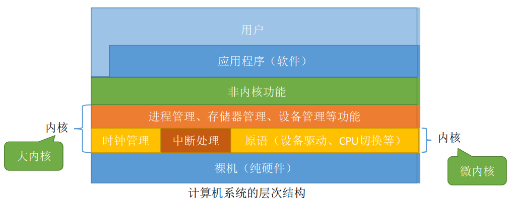
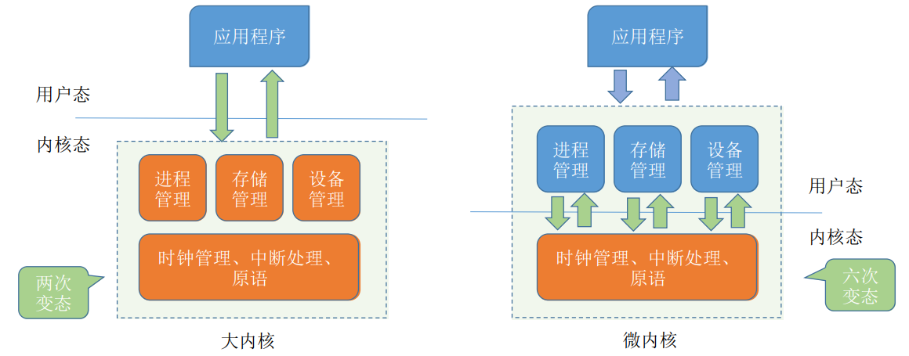

# 概述

**概览：**

**[:question: 操作系统的基本概念](#基本概念)**  
**[:question: 操作系统的发展与分类](#发展与分类)**  
**[:question: 操作系统的运行环境](#运行环境)**  
**[:question: 大内核与微内核](#大内核与微内核)**

## 基本概念

### 操作系统的定义

操作系统是控制和管理整个计算机系统的硬件与软件资源、合理地组合和调度计算机的工作与资源、为用户和其他软件提供方便接口与环境的程序集合

### 操作系统的特征

操作系统的基本特征有：并发、共享、虚拟、异步

#### 并发

并发是指两个或多个事件在同一时间间隔内发生。这些时间宏观上是同时发生的，但微观上是交替发生的

并发使得系统具有处理和调度多个程序同时执行的能力  
操作系统的并发是通过分时实现的

注意：

- 并发是指在一个时间段、并行是指在同一个时刻；并行是指系统具有同时执行或操作
- 单核 CPU 同一时刻只能执行一个程序，各个程序可以并行地执行；多核 CPU 同一时刻可以同时执行多个程序，多个程序可以并行的执行

#### 共享

共享即资源共享，是指系统中的资源可供内存中多个并发执行的进程共同使用

- 互斥共享：同一时刻只能供一个进程对资源进行方向，这种资源称作临界资源或独占资源。例如打印机、磁带等
- 同时共享：一段时间内允许多个进程对资源进行访问。例如磁盘设备、重入编码写的文件等

并发和共享互为存在条件  
并发性是指计算机系统中同时存在着多个运行着的程序  
共享性是指系统中的资源可供内存中多个并发执行的进程共同使用

#### 虚拟

一个物理上的实体变为若干逻辑上的对应物，这种技术也被称为虚拟技术

- 时分复用技术-虚拟处理器：采用多道程序并发的方式，让每个终端用户感觉到有多个处理器
- 空分复用技术-虚拟存储器：将物理存储变为虚拟存储器，逻辑上扩充存储器用量
- 也可以将一台 IO 设备虚拟为多台逻辑上的 IO 设备，并允许每个用户占用一台逻辑上的 IO 设备

#### 异步

多道程序走走停停，进程以不可预知的速度向前推进

### 操作系统的目标和功能

#### 管理功能

| 处理机管理                                                                                                                     | 存储器管理                                                                                   | 文件管理                                                                                     | 设备管理                                                                                          |
| ------------------------------------------------------------------------------------------------------------------------------ | -------------------------------------------------------------------------------------------- | -------------------------------------------------------------------------------------------- | ------------------------------------------------------------------------------------------------- |
| 管理处理机的分配与允许，解决冲突问题，可以理解为对进程的管理   进程管理：进程控制、进程同步、进程通信、死锁处理、处理及调度 | 为了提高多道程序允许效率，方便用户使用   内存分配、地址映射、内存保护、内存共享和内容扩充 | 操作系统负责管理文件的系统称为文件系统   文件存储空间的管理、目录管理、文件读写管理和保护 | 完成用户的 IO 请求，方便用户使用设备，提高设备的利用率  缓冲管理、设备分配、设备处理、虚拟设备 |

#### 接口功能

- 命令接口
  - 联机控制方式：交互式命令接口，适用于分时或实时系统，就像人与机器对话一样
  - 脱机控制方式：又称批处理系统，提交一组作业，系统进行处理，用户不能干预作业的运行
- 程序接口：有一组系统调用的命令组成（也称作系统调用或广义指令），例如 GUI（图像用户界面）

#### 操作系统用作扩充机器

操作系统提供了资源管理功能和方便用户使用的各种服务功能，将机器改造为功能更强的机器  
覆盖了软件的机器称为扩充机器，又称之为虚拟机

#### 封装思想

操作系统把一些丑陋的硬件功能封装成简单易用的服务，使用户能更方便地使用计算机，用户无需关心底层硬件地原理，只需要对操作系统发出命令即可

## 发展与分类

手工阶段->批处理阶段->分时操作系统->实时操作系统->分布式计算系统->个人操作系统

### 手工阶段

程序的装入、运行和结果的输出都需要人为干涉  
缺点：资源利用率低、CPU 利用不充分

### 批处理阶段

为了解决人机矛盾以及 CPU 和 IO 设备之间速度不匹配的矛盾

|      | 单道批处理系统                                                                                             | 多道批处理系统                                                                                                                                |
| ---- | ---------------------------------------------------------------------------------------------------------- | --------------------------------------------------------------------------------------------------------------------------------------------- |
| 概念 | 内存中始终保存一道作业                                                                                     | 允许多个进程在 CPU 中交替运行，程序共享各种硬件和软件资源                                                                                     |
| 特点 | 自动性：一批作业自动执行不需要人工干预   顺序性：各道作业依次执行   单道性：仅有一道程序执行         | 多道：计算机中同时存放多道相互独立的程序   宏观上并行：多道程序都会开始运行，但没有运行完毕  微观上串行：多道程序轮流占有 CPU，较低执行 |
| 优点 | 缓解了一定程度的人机速度矛盾，资源利用率有所提升                                                           | 资源利用率高、多道程序并发执行，共享计算机资源、CPU 和其他资源更能保持"忙碌"状态，系统吞吐量增大                                              |
| 缺点 | 高速 CPU 大量时间在等待 IO 设备的完成  内存中仅能有一道程序运行，只有该程序运行结束后才能调入下一道程序 | 设计复杂，要考虑各种资源调度问题   响应时间过长，没有人机交互功能                                                                          |

### 分时操作系统

将处理器运行时间划分为时间片，将时间片分配给不同作业/用户从而占用处理机

优点：

- 同时性：允许多个终端用户使用同一台计算机
- 交互性：方便进行人机对话，采用人机对话方式控制程序运行
- 独立性：多个用户彼此之间独立的操作，互不干扰
- 及时性：用户请求能在很短时间内获得响应

缺点：不能优先处理一些紧急任务。操作系统对各个用户/作业都是完全公平的，循环地为每个用户/作业服务一个时间片，不区分任务的紧急性

### 实时操作系统

保证在规定时间内完成某项任务

特点：

- 及时性：规定时间内完成规定任务
- 可靠性：输出的结果正确，系统运行时确保稳定

### 分布式计算机系统

网络操作系统将多个计算机有机的结合在一起；任意两台计算机之间没有主从之分，互相交换信息，并行工作，协同完成

### 个人操作系统

广泛应用于文字处理、电子表格、游戏等，方便个人使用。如 Windows、MacOS

## 运行环境

### 程序运行

程序运行的过程就是 CPU 执行一条一条机器指令的过程

在 CPU 设计和生产的时候就划分了特权指令和非特权指令，因此 CPU 执行一条指令前就你判断出其类型

### 操作系统的运行机制

- CPU 执行的两种性质程序
  - 操作系统的内核程序：是系统的管理者，既可以执行特权指令、也可以执行非特权指令，运行在核心态
  - 用户自编的应用程序：为了保证系统能安全运行，普通应用程序只能执行非特权指令，允许在用户态
- 操作系统内核  
  内核是操作系统最基本、最核心的部分。实现操作系统内核的功能的那些恒旭就是内核程序
  - 时钟管理：操作系统对用户提供标准时间，根据时钟对进程进行管理，实现进程切换
  - 中断机制：初衷是为了提高多道程序运行环境中的 CPU 里用户；保护和恢复中断现场的信息，转移控制权到相关程序
  - 原语：是一种特殊的程序
    - 处于系统的最底层，最接近硬件
    - 运行具有原子性，只能一气呵成
    - 系统控制的数据结构及处理
      - 进程管理：进程状态管理、进程调度和分派、创建和撤销进程控制块
      - 存储器管理：存储器的空间分配和回收、内存信息保护程序、代码对换程序
      - 设备管理：缓冲区管理、设备分配和回收
      

### 用户态与内核态

CPU 中有一个寄存器叫程序状态寄存器（PSW），其中有个二进制位，1 表示内核态，0 表示用户态

- 处于内核态时，说明此时正在运行的是内核程序，此时可以执行特权指令和非特权指令
- 处于用户态是，说明此时正在运行的是应用程序，此时只能执行非特权指令

内核态=核心态=管态；用户态=目态

内核态于用户态的切换

- 内核态->用户态：执行一条特权指令：修改 PSW 的标志位为用户态，这个动作意味着操作系统将主动让出 CPU 使用权
- 用户态->内核态：由中断引发，硬件自动完成变态过程，触发中断信号因为这操作系统将强行夺回 CPU 的使用权

### 中断与异常

- 为了进行核心态和用户态两种状态切换，引入了中断机制
  - 核心态和可以执行用户态无法执行的特权指令
  - 访管指令是在用户态使用，将用户态转换为核心态，所以访管指令不是特权指令
- 中断是操作系统内核夺回 CPU 使用权的唯一途径
- 中断（外中断）  
  与当前执行的指令无关，中断信号来源于 CPU 外部  
  每条指令执行结束时，CPU 都会例行检查是否有外中断信号
  - IO 中断：输入输出设备发来的中断信号。如输入输出任务完成时
  - 时钟中断：由时钟部件发来的中断信号
- 异常（内中断）  
  与当前执行的指令有关，中断信号来源于 CPU 内部
  - 陷进、陷入（trap）：由陷入指令引发，是应用程序故意引发的，执行陷入后，用户态转为核心态
  - 故障（fault）：由错误条件引起的，可能呗内核程序修复。内核程序修复故障后会把 CPU 使用权还给应用程序，让它继续执行下去。如：缺页故障
  - 终止（abort）：由致命错误引起，内核程序无法修复该错误，因此一般不再将 CPU 使用权还给引发终止的应用程序，而是直接终止该应用程序。如：非法操作码、除零、地址越界、算数溢出

### 系统调用

系统调用是操作系统提供给应用程序使用的接口，可以理解为一种可供应用程序调用的特殊函数，应用程序可通过系统调用来请求获得操作系统内核的服务

凡是与共享资源有关的操作（如存储分配、IO 操作、文件管理等），都必须通过系统调用的方式向操作系统内核提出服务请求，由操作系统内核代为完成。这也可以保证系统的稳定性和安全性，防止用户进行非法操作

- 设备管理：完成设备的请求或释放，设备启动等功能
- 文件管理：完成文件的读、写、创建和删除功能
- 进程控制：完成进程的创建、撤销、阻塞以及唤醒功能
- 进程通信：完成进程之间的消息传递和信号传送功能
- 内存管理：完成内存的分配、回收以及获取作业占用内存区大小及始址等功能

系统调用的过程：传递系统调用参数 -> 执行陷入指令（用户态）-> 执行相应的内核请求程序处理系统调用（核心态）-> 返回应用程序

## 大内核与微内核

|      | 大内核                                                                           | 微内核                                                                                                                                                                                                     |
| ---- | -------------------------------------------------------------------------------- | ---------------------------------------------------------------------------------------------------------------------------------------------------------------------------------------------------------- |
| 概念 | 将操作系统的主要功能模块进行集中，从而用以提高性能的系统服务                     | 背景：随着计算机系统结构的不断发展，操作系统提供的服务越来越多，接口形式越来越复杂   将内核中的最基本的功能（如：进程管理）保留在内核，将不需要在核心态执行的功能转移到用户态执行，降低内核设计的复杂性 |
| 优点 | 各个管理模块之间共享信息，能够有效利用相互之间的有效特性，所以有着巨大的性能优势 | 有效的分离内核与服务、服务与服务、使得他们之间的接口更加的清晰，维护的代价大大降低  各部分可以独立的优化和演进                                                                                          |
| 缺点 | 层次交互关系复杂，层次接口难以定义，层次之间界限模糊                             | 性能问题，需要频繁的在核心态与用户态之间进行切换                                                                                                                                                           |

