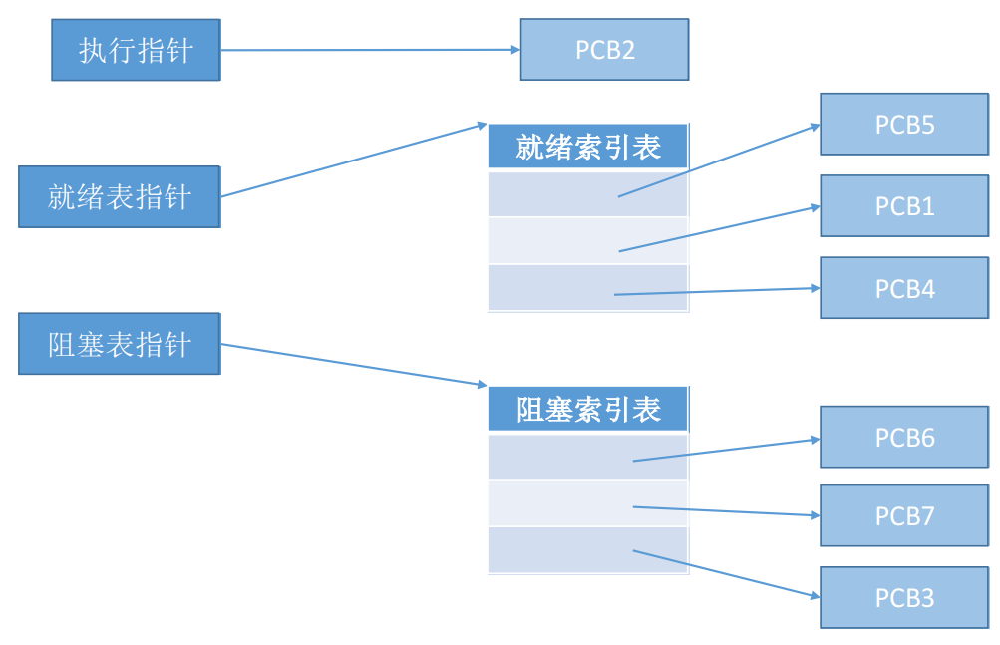
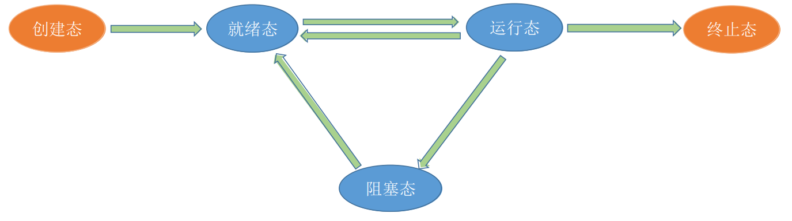
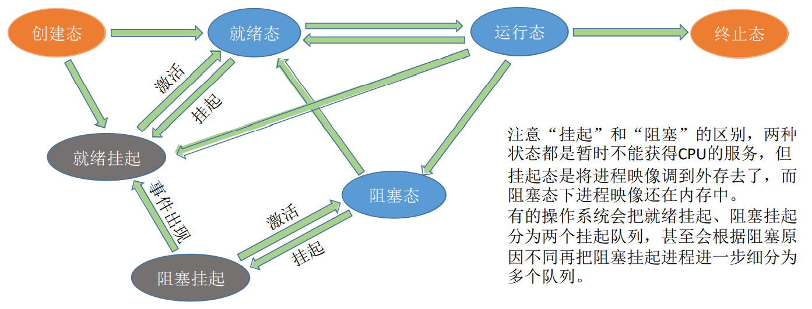
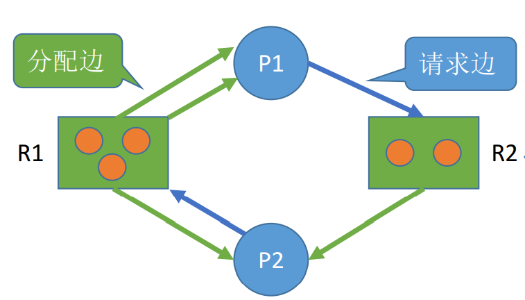

# 进程管理

**概览：**

**[:question: 进程与线程](#进程与线程)**  
**[:question: 处理机调度](#处理机调度)**  
**[:question: 进程与进程互斥同步](#进程同步与进程互斥)**  
**[:question: 死锁](#死锁)**

## 进程与线程

### 进程的概念和特征

#### 进程的概念

为了更好地描述和控制程序的并发执行，实现操作系统的并发性和共享性，从而引入了进程

进程的一些典型定义：

- 进程是程序的一次执行过程
- 进程是一次程序及其数据在处理机上顺序执行时所发生的活动
- 进程是具有独立功能的程序在一个数据集合上运行的过程，是资源分配和调度的独立单位（没有引入线程）

#### 进程的组成

进程主要由三部分组成：

- PCB（Process Control Block，即进程控制块）
- 程序段：能被进程调度程序调度到 CPU 执行的程序代码段（指令序列）
- 数据段：运行过程中产生的各种数据（如：程序中定义的变量）

其中 PCB 是给操作系统用的，程序段和数据段是给进程自己用的

##### PCB

操作系统是进程的管理者，它要怎么区分各个进程？  
当进程被创建时，操作系统会为该进程分配一个唯一的、不重复的 ID 号，即 PID（Process ID，进程 ID）

操作系统需要对各个并发运行的进程进行管理，但凡管理时所需要的信息，都会放在 PCB 这个数据结构中  
PCB 是进程存在的唯一标志，当进程被创建时，操作系统为其创建 PCB，当进程结束时，会回收其 PCB

PCB 包含的信息如下：

- 进程描述信息：进程标识符 PID（标志进程）、用户标识符 UID（进程归属的用户，主要为共享和保护服务）
- 进控制和管理信息
  - 进程当前状态：描述进程状态信息，就绪态/阻塞态...
  - 进程优先级：描述进程抢占处理机优先级
  - 代码运行入口地址
  - 程序的外存地址
  - 进入内存时间
  - 处理机占用时间
  - 信号量使用
- 资源分配清单
  - 用以说明有关内存地址空间或虚拟地址空间状况，所打开的文件的列表和所使用的输入/输出设备信息
  - 代码段指针、数据段指针、堆栈段指针、文件描述符、键盘、鼠标
- 处理机相关信息
  - 处理机中各寄存器的值（用于实现进程切换）。如：通用寄存器值、地址寄存器值、控制寄存器值、标志寄存器值、状态字

#### 进程的特征

- 动态性：动态性是进程最基本特性，进程有着创建、活动、暂停、终止等过程，具有生命周期
- 并发性：多个进程实体同时存在内存中，引入进程的目的就是为了程序与其他程序并发执行
- 独立性：进程实体是一个能独立运行，独立获得资源和独立接受调度的基本单位（没有建立 PCB 的程序，都不能作为一个独立单位参与运行）
- 结构性：每个进程都配置一个 PCB 对其进行描述
- 异步性：各进程按各自独立的、不可预知的速度向前推进，操作系要提供“进程同步机制”来解决异步问题

### 进程的组织

在一个系统中，通常有数十、数百乃至数千个 PCB，为了能对他们加以有效的管理，应该用适当的方式把这些 PCB 组织起来

进程的组织方式有：

- 链接方式：按照进程状态将 PCB 分为多个队列，操作系统持有指向各个队列的指针（如执行指针、就绪队列指针、阻塞队列指针）
- 索引方式：根据进程状态的不同，建立几张索引表，操作系统持有指向各个索引表的指针
  <div align="left"></div>

### 进程的状态与转换

#### 状态

- 创建态：进程正在被创建，尚未进入就绪态  
  这个阶段操作系统会为进程分配资源、初始化 PCB
- 就绪态：进程已处于准备运行状态  
  处于就绪态的进程已经具备运行条件，但由于没有空闲 CPU，就暂时不能运行
- 运行态：进程在处理机上运行
- 阻塞态：又称等待态，进程正在等待某个事件而暂停运行（如等待某种系统资源的分配，或者等待其他进程的响应）
- 终止态：进程正在从系统中消失（包括正常结束或者异常终止）  
  一个进程可以执行 exit 系统调用，请求操作系统终止该进程。此时该进程会进入“终止态”，操作系统会让该进程下 CPU，并回收内存空间等资源，最后还要回收该进程的 PCB。当终止进程工作完成后，这个进程就彻底消失了

其中`运行态`、`就绪态`、`阻塞态`是三种基本状态，进程的整个生命周期中，大部分时间都处于三种基本状态

#### 相互转换

<div align="left"></div>

- 就绪态 -> 运行态：进程被调度时，处于就绪的进程获得处理机进入运行态
- 运行态 -> 就绪态：处于运行态的进程时间片用完，让出处理机进入就绪态
- 运行态 -> 阻塞态：进程请求处理机外的其他资源，此时运行态进入阻塞态（系统调用请求操作系统提供服务，这是一种特殊的、由运行用户态程序调用操作系统内核过程的形式）
- 阻塞态 -> 就绪态：进程等待其他资源的获得，如 IO 资源、或者中断结束

注意：不能由阻塞态直接转换为运行态，也不能由就绪态直接转换为阻塞态。这是因为进入阻塞态是进程主动请求的，必然需要进程在运行时才能发出这种请求

### 进程控制

进程控制就是要实现进程状态的转换  
进程控制要用“原语”实现，如果不用“原语”实现，就有可能导致操作系统中的某些关键数据结构信息不统一的情况，这会影响操作系统进行别的管理工作

如何实现原语的“原子性”？  
原语的执行具有原子性，即执行过程只能一气呵成，期间不允许被中断。可以用“关中断指令”和“开中断指令”这两个特权指令实现原子性

进程控制相关的原语包括：进程的创建、进程的终止、进程的阻塞、进程的唤醒、进程的切换  
无论哪个进程原语，要做的无非三类事情：

1. 更新 PCB 中的信息
2. 将 PCB 插入合适的队列
3. 分配/回收资源

#### 进程的创建

创建原语：

- 分配进程标识号，申请 PCB（PCB 是有限的）
- 为进程分配资源，为程序和数据以及用户栈分配必要的内存空间
- 初始化 PCB，包括初始化标志信息、初始化处理机的状态信息、初始化处理机控制信息、设置进程的优先级
- 若进程就绪队列可以接纳新进程，进程就进入就绪态

引起进程创建的事件：

- 用户登录：分时系统中，用户登录成功，系统会为其建立一个新的进程
- 作业调度：多道批处理系统中，有新的作业放入内存时，会为其建立一个新的进程
- 提供服务：用户向操作系统提出某些请求时，会新建一个进程处理该请求
- 应用请求：由用户进程主动请求创建一个子进程

#### 进程的终止

撤销原语：

- 根据被终止进程的标识符，检索 PCB，读取进程状态
- 若进程处于运行态，终止运行，剥夺处理机
- 终止进程之下的子进程
- 该进程拥有的全部资源还给父进程或操作系统
- 将 PCB 从队列中删除

引起进程终止的事件：

- 正常结束：进程任务以及完成并准备退出运行
- 异常结束：进程运行中，出现了某些异常事件，导致程序法继续运行（存储区越界、保护错、非法指令、特权指令错、IO 故障等）
- 外界干预：进程应外界请求终止运行

#### 进程的阻塞

运行态 -> 阻塞态

阻塞原语：

- 找到要被阻塞进程标识号对应的 PCB
- 保护进程运行现场，将其状态转换为阻塞态，暂时停止进程运行
- 将 PCB 插入相应事件的等待队列

引起进程阻塞的事件：

- 需要等待系统分配某种资源
- 需要等待相互合作的其他进程完成工作

#### 进程的唤醒

阻塞态 -> 就绪态  
唤醒是被相互有联系的其他进程进行唤醒

唤醒原语：

- 找到等待队列中进程相应的 PCB
- 将其从等待队列中移除，置其状态为就绪态
- 将 PCB 插入就绪队列，等待被调度

引起进程唤醒的事件：

- 等待事件发生（因何事阻塞，就应由何事唤醒）

#### 进程的切换

进程切换是在内核态下完成的

切换原语：

- 保存处理机上下文，包括程序计数器和其他寄存器，将信息存入 PCB
- 把进程的 PCB 移入相应的队列，如就绪。在某时间阻塞等队列
- 选择另一个进程执行，更新其 PCB
- 根据 PCB 恢复新进程所需的运行环境

引起进程切换的事件：

- 当前进程时间片到
- 有更高优先级的进程到达
- 当前进程主动阻塞
- 当前进程终止

### 进程的通信

进程通信就是指进程之间的信息交换  
进程是分配系统资源的单位（包括内存地址空间），因此各进程拥有的内存地址空间相互独立。为了保证安全，一个进程不能直接访问另一个进程的地址空间。但是进程之间的信息交换又是必须实现的，为了保证进程间的安全通信，操作系统提供了共享存储、消息传递、管道通信三种方式

#### 共享存储

共享存储是让进程通信之间存在一块可以被直接访问的共享空间  
操作系统只负责为通信进程提供可共享使用的存储空间和同步互斥工具，数据交换则由用户自己安排读/写指令完成）

- 低级方式：基于数据结构共享，比如共享空间里只能放一个长度为 10 的数组。这种共享方式速度慢、限制多
- 高级方式：基于存储区共享，在内存中画出一块共享存储区，数据的形式、存放位置都由进程控制，而不是操作系统。相比之下，这种方式速度更快

#### 消息传递

进程间的数据交换是以格式化的消息为单位的，进程通过系统提供的发送消息和接收消息的两个原语进行数据交换

- 直接通信方式：发送进程直接发送消息给接收进程，并将它挂在接收进程的消息缓冲队列上，接收进程从消息缓冲队列中取得消息
- 间接通信方式：发送进程把消息发送给某个中间实体，接收进程从中间实体获得消息，例如电子邮件系统

#### 管道通信

管道是指用于连接读写进程的一个共享文件，又名 pipe 文件。其实就是在内存中开辟一个大小固定的缓冲区

- 半双工通信，不可以同时读写。若要实现双向同时通信，则需要设置两个管道
- 各进程要互斥地访问管道
- 发送进程以字符流形式将大量数据送入写管道，接收进程从管道中接收数据。当管道写满时，写进程的 write()系统调用将被阻塞，等待读进程将数据取走；当读进程将数据全部取走后，管道变空，此时读进程的 read()系统调用将被阻塞
- 如果没写满，就不允许读。如果没读空，就不允许写
- 数据一旦被读出，就从管道中被抛弃，这就意味着读进程最多只能有一个，否则可能会有读错数据的情况

### 线程概念和多线程模型

#### 线程的概念

线程是一个基本的 CPU 执行单元，也是程序执行流的最小单位  
引入线程后，不仅是进程之间可以并发，进程内的各线程之间也可以并发，从而减小程序在并发执行时所付出的时空开销，提高操作系统的并发性能  
引入线程后，进程只作为除 CPU 之外的系统资源的分配单元，线程作为处理机的分配单元

#### 线程 VS 进程

- 调度：传统中进程是资源和独立调度的基本单位，引入线程后，线程是独立调度的基本单位，进程是资源的基本单位
- 拥有资源：进程是资源分配的基本单位
- 并发性：引入线程后，进程可以并发执行，多个线程之间也可以并发执行，提高了系统的吞吐量
- 系统开销：同一进程的线程切换比进程切换开销小得多
- 地址空间和其他资源：进程的地址空间之间相互独立，统一进程的各线程之间共享进程的资源，某进程的线程对其他进程不可见
- 通信方面
  - 进程间通信需要进程同步和互斥手段的辅助，保证数据的一致性
  - 线程间可以直接读/写进程程序段来进行通信

#### 线程属性

- 不拥有系统资源，拥有唯一标识符（线程 ID）和线程控制块（TCB）
- 不同的线程可以执行相同的程序，同一个服务程序被不同用户调用时，操作系统将为其创建为不同线程
- 同一进程的线程共享该进程拥有的全部资源
- 线程是处理机的独立调度单位
- 线程也有生命周期，阻塞、就绪、运行等状态
- 多 CPU 计算机中，各个线程可占用不同的 CPU
- 每个线程都有一个线程 ID、线程控制块 TCB
- 切换同进程内的线程，不会引起进程切换，系统开销很小
- 切换不同进程中的线程，会引起进程切换，系统开销较大
- 由于共享内存地址空间，同一进程中的线程间通信甚至无需系统干预

#### 线程的实现方式

- 用户级线程
  - 用户级线程由应用程序通过线程库实现，所有的线程管理工作都由应用程序负责（包括线程的切换）
  - 用户级线程中，线程切换可以在用户态下即可完成，无需操作系干预
  - 在用户看来是有多个线程，但是操作系统内核看来，并意识不到线程的存在
  - 优点：用户级线程的切换在用户空间即可完成，不需要切换到核心态，线程管理的系统开销小，效率高
  - 缺点：当一个用户级线程被阻塞后，整个进程都会被阻塞，并发度不高。多个线程不可在多核处理机上并行运行
- 内核级线程
  - 线程的管理工作全部由内核完成
  - 线程调度、切换等工作都由内核负责，因此内核级线程的切换必然需要在核心态下才能完成
  - 操作系统会为每个内核级线程建立相应的 TCB（Thread Control Block，线程控制块），通过 TCB 对线程进行管理
  - 优点：当一个线程被阻塞后，别的线程还可以继续执行，并发能力强。多线程可在多核处理机上并行执行
  - 缺点：一个用户进程会占用多个内核级线程，线程切换由操作系统内核完成，需要切换到核心态，因此线程管理的成本高，开销大

#### 多线程模型

在支持内核级线程的系统中，根据用户级线程和内核级线程的映射关系，可以划分为几种多线程模型

- 多对一
  - 经多个用户级线程映射到一个内核级线程，线程管理在用户空间完成，用户及线程对操作系统不可见
  - 优点：线程管理是在用户空间进行的，不需要切换到核心态，线程管理的系统开销小，效率高
  - 缺点：一个线程阻塞，整个进程都会被阻塞，多个线程不能并行运行在多处理机上
- 一对一
  - 一个用户级线程映射到一个内核级线程上
  - 优点：当一个线程被阻塞后，别的线程还可以继续执行，并发能力强。多线程可在多核处理机上并行执行
  - 缺点：一个用户进程会占用多个内核级线程，线程切换由操作系统内核完成，需要切换到核心态，因此线程管理的成本高、开销大
- 多对多
  - 多个线程映射到多个内核线程上
  - 结合上述两种，既可以提高并发性，又适当的降低了开销

## 处理机调度

处理机调度就是合理对进程进行处理机分配

### 调度的三个层次

- 调度的层次
  - 作业调度（高级调度）：从按一定的原则从辅存中作业后备队选择一个作业送入内存，并创建进程。每个作业只调入一次，调出一次。作业调入时会建立 PCB，调出时才撤销 PCB
  - 中级调度（内存调度）：内存不够时，将暂时不能运行的进程调至外存，进程进入挂起状态；或者将已经具备运行条件的挂起状态的进程调入内存。一个进程可能会被多次调出、调入内存，因此中级调度发生的频率比高级调度更高
  - 进程调度（低级调度）：按照某种策略或方法从就绪队列中选取一个进程，将处理机分配给它。进程调度最基本的调度、频率很高（一般几十毫秒一次）
- 三级调度的联系
  - 作业调度为进程活动做准备，进程调度使进程正常活动起来，内存调度将暂时不能运行的进程挂起，内存调度处于作业调度和进程调度之间
  - 作业调度次数少，内存调度次数略多，进程调度频率最高
  - 进程调度是最基本的，不可或缺的

暂时调到外存等待的进程状态为挂起状态（suspend）  
挂起态又可以进一步细分为就绪挂起、阻塞挂起两种状态  
“挂起”和“阻塞”区别：两种状态都是暂时不能获得 CPU 的服务，但挂起态是将进程映像调到外存去了

<div align="left"></div>

### 进程调度的时机、切换与过程

- 进程不能切换的情况
  - 处理中断过程中。中断处理过程复杂，与硬件密切相关，很难做到在中断处理过程中进行进程切换
  - 进程在操作系统内核程序临界区时
  - 在原子操作过程中
- 进程需要切换情况
  - 当前运行的进程主动放弃处理机
    - 进程正常终止
    - 运行过程中发生异常而终止
    - 进程主动请求阻塞（如等待 I/O）
  - 当前运行的进程被动放弃处理机
    - 分给进程的时间片用完
    - 有更紧急的事需要处理（如 I/O 中断）
    - 有更高优先级的进程进入就绪队列

临界资源：一个时间段内只允许一个进程使用的资源。各进程需要互斥地访问临界资源  
临界区：访问临界资源的那段代码  
内核程序临界区：一般是用来访问某种内核数据结构的，比如进程的就绪队列

内核程序临界区访问的临界资源如果不尽快释放的话，极有可能影响到操作系统内核的其他管理工作。因此在访问内核程序临界区期间不能进行调度和切换  
普通临界区访问的临界资源不会直接影响操作系统内核的管理工作。因此在访问普通临界区时可以进行调度与切换

进程切换的过程主要完成了对原来运行进程各种数据的保存、对新的进程各种数据的恢复（如 PC、PSW 各种寄存器等信息）  
进程切换是有代价的，因此如果过于频繁的进行进程调度、切换，必然会使整个系统的效率降低，使系统大部分时间都花在进程切换上，而真正用户只需进程的时间减少

### 进程的调度方式

- 非剥夺调度方式
  - 如果将处理机分配给一个更高优先级的进程，必须要等待当前占用处理机的进程释放后才能将处理机分配给更高优先级进程
  - 实现简单、开销小、适合大多数批处理系统
  - 不适用于分时系统和大多数实时系统
- 剥夺调度方式
  - 如果有更高优先级进程请求处理机，暂停正在执行的进程，将处理机分配给更高级进程
  - 提高系统吞吐率和响应效率
  - 适合于分时系统、实时系统

### 调度算法的评价指标

- CPU 利用率：指 CPU“忙碌”的时间占总时间的比例
- 系统吞吐量：单位时间内 CPU 完成作业的数量，调度算法和方式会对吞吐量造成较大影响
- 周转时间：作业提交到作业完成时间
  - 周转时间 = 作业完成时间 - 作业提交时间
  - 平均周转时间 = 总周转时间/N 个作业
  - 带权周转时间 = 作业周转时间/作业实际运行时间
  - 平均带权周转时间 = 总带权周转时间/N 个作业
- 等待时间：作业等待处理机的时间之和。衡量一个算法优劣，只需要简单的考察等待时间
- 响应时间：从用户提交请求到系统首次产生响应所用的时间

### 典型调度算法

#### 先来先服务（FCFS）First Come First Server

- 算法思想：主要从“公平”角度考虑
- 算法规则：按照作业/进程到达的先后顺序进行服务
- 适用调度层次：作业调度、进程调度
- 是否可抢占：非抢占式
- 优缺点：
  - 优点：公平、算法简单、对长作业有利，有利于 CPU 密集型作业
  - 缺点：效率低，带权周转时间很大，不利于短作业
- 是否会导致饥饿：不会

#### 短作业优先（SJF）Shortest Job First

- 算法思想：追求最少的平均等待时间、最少的平均周转时间、最少的平均平均带权周转时间
- 算法规则：最短的作业/进程优先得到服务（“最短”是指要求服务的时间最短）
- 适用调度层次：作业调度、进程调度（短进程优先 SPF，Shortest Process First）
- 是否可抢占：SJF 和 SPF 都是非抢占式
- 优缺点：
  - 优点：“最短的”平均等待时间、平均周转时间
  - 缺点：不公平。对短作业有利，长作业不利。作业/进程的运行时间由用户提供，并不一定真实，不一定能做到真正的短作业优先
- 是否会导致饥饿：会。如果源源不断的有短作业/进程到来，可能使长作业/进程长时间得不到服务，产生“饥饿”现象。如果一直得不到服务，则称为“饿死”

#### 高响应比优先（HRRN）Highest Response Ration Next

- 算法思想：要综合考虑作业/进程的等待时间和要求服务的时间
- 算法规则：每次调度时先计算各个作业/进程的响应比，选择响应比最高的作业/进程为其服务  
  响应比 = （等待时间+要求服务时间）/要求服务时间=1+等待时间/要求服务时间
- 适用调度层次：作业调度、进程调度
- 是否是抢占式：非抢占式
- 优缺点：综合考虑了等待时间和运行时间，等待时间相同时，要求服务时间短的优先（SJF 的优点），要求服务时间相同时，等待时间长的优先（FCFS 的优点）  
  对于长作业来说，随着等待时间变久，其响应比也会越来越大，从而避免了长作业饥饿问题
- 是否会导致饥饿：不会

#### 时间片轮转（RR）Round-Robin

- 算法思想：公平地、轮流地为各个进程服务，让每个进程在一定时间间隔内都可以得到响应
- 算法规则：按照各进程到达就绪队列的顺序，轮流让各个进程执行一个时间片。若进程未在一个时间内执行完，则剥夺处理机，将进程重新放到就绪队列队尾重新排队
- 适用调度层次：进程调度
- 是否可抢占：抢占式。若进程未能在时间片内运行完，将被强行剥夺处理机使用权，因此属于抢占式
- 优缺点：
  - 优点：公平，响应快，适用于分时操作系统
  - 缺点：优于高频率的进程切换，因此有一定的开销；不区分任务的紧急程度
- 是否会导致饥饿：不会
- 时间片选择很重要，过大就变成了先来先服务，过短又变成了短作业优先

#### 优先级调度算法

- 算法思想：随着计算机地发展，特别是实时操作系统的出现，越来越多的应用场景需要根据任务的紧急程度来决定处理顺序
- 算法规则： 每个作业/进程有各自的优先级，调度时选择优先级最高的作业/进程
- 适用调度层次： 作业调度、进程调度
- 是否可抢占：抢占式、非抢占式都有
  - 抢占式：就绪队列变化时，检查是否会抢占；或者当前进程主动放弃处理机时发生调度。每次调度时选择当前已到达且优先级最高的进程
  - 非抢占式：当前进程主动放弃处理机时进行调度，每次调度时选择当前已到达且优先级最高的进程
- 优缺点：
  - 优点：用优先级区分紧急程度、重要程度，适用于实时操作系统。可灵活地调整对各种作业/进程的偏好程度
  - 缺点：若源源不断地有高优先级进程到来，则可能导致饥饿
- 是否会导致饥饿：会
- 优先级分类
  - 静态优先级：进程创建后无法对优先级进行修改
  - 动态优先级：可以根据进程运行状态，对进程优先级进行动态调整
- 优先级设置原则
  - 系统进程 > 用户进程
  - 交互型进程 > 非交互型进程
  - I/O 进程 > 计算型进程

#### 多级反馈队列调度算法

- 算法思想：其他调度算法地折中权衡
- 算法规则：
  - 设置多级就绪队列，各级队列优先级从高到低，时间片从小到大
  - 新进程到达时先进入第 1 级队列，按 FCFS 原则排队等待被分配时间片，若用完时间片进程还未结束，则进程进入下一级队列队尾。如果此时已经是最下级队列，则重新放回该队列队尾
  - 只有第 k 级队列为空时，才会为 k+1 级队头的进程分配时间片
- 适用调度层次：进程调度
- 是否可抢占：抢占式算法。在 k 级队列的进程运行过程中，若更上级的队列中进入了一个新进程，由于新进程处于优先级更高的队列中，因此新进程会抢占处理机，原来运行的进程放回 k 级队列队尾
- 优缺点：对各类型进程相对公平（FCFS 优点）；每个新到达的进程都可以很快就得到响应（RR 优点）；短进程只用较少的时间就可完成（SPF 优点）；不必实现估计进程的运行时间（避免用户作假）；可灵活地调整对各类进程地偏好程度，比如 CPU 密集型进程、I/O 密集型进程
- 是否会导致饥饿：是

## 进程同步与进程互斥

### 基本概念

- 同步：也称直接制约关系，它是指为了完成某种任务而建立的多个进程，这些进程因为需要在某些位置上协调它们的工作次序而产生的制约关系
- 互斥：也称间接制约关系，它是指当一个进程访问临界资源的时候，另一个进程不能访问该临界资源；当前进程访问临界资源结束后，另一个进程才能去访问临界资源
- 临界资源
  - 定义：一次只允许一个进程使用的资源（打印机，特殊变量，数据）
  - 临界资源的互斥访问逻辑上分为如下四部分：
    - 进入区：检查进程是是否可以进入临界区，若可以进入，则应设置正在访问临界资源的标志
    - 临界区：访问临界资源的代码段
    - 退出区：将正在访问临界区的标志清除。进入区与退出区是负责实现互斥的代码段
    - 剩余区：代码中的其余部分

为了实现对临界资源的互斥访问，需要遵循以下原则：

- 空闲让进：临界区空闲时，可以允许一个请求进入临界区的进程立即进入临界区
- 忙则等待：已有进程进入临界区，其他试图进入临界区的进程必须等待
- 有限等待：对于请求访问临界区的进程，在有限时间内进入临界区（保证不会饥饿）
- 让权等待：进程不能进入临界区的时候，应当立即释放处理机，防止进程忙等待

### 实现临界区互斥的基本方法

#### 软件实现方法

##### 单标志法

算法思想：两个进程在访问完临界区后会把使用临界区的权限转交给另一个进程。也就是说每个进程进入临界区的权限只能被另一个进程赋予，使两个进程交替进入临界区

```cpp
int turn = 0;  // turn 表示当前允许进入临界区的进程号 （turn背后含义表达“谦让”）

P0进程：                    P1进程：
while (turn != 0);         while (turn != 1);   // 进入区
critical section;          critical section;    // 临界区
turn = 1;                  turn = 0;            // 退出区
remainder section;         remainder section;   // 剩余区

turn的初始值为0；即刚开始只允许P0进入临界区。若P1先上处理机，则P1会卡在进入区，直到P1的时间片用完，发生调度，切换P0上处理机运行
P0可以正常访问临界区，在P0访问临界区期间即时切换回P1时，P1依然会卡在进入区。只有P0在退出区将turn改为1后，P1才能进入临界区
```

只能按 P0->P1->P0->P1...这样轮流访问。如果此时允许进入临界区的进程是 P0，而 P0 一直不访问临界区，那么虽然此时临界区空闲，但不允许 P1 访问。这违背了“空闲让进”原则

优点：实现简单  
缺点：可能会违背“空闲让进”，造成资源无法充分利用

##### 双标志先检查法

算法思想：设置一个布尔型数组`flag[]`，数组中各个元素用来标记各进程想进入临界区的意愿，比如 `flag[0]=true`意味着 0 号进程 P0 此时想进入临界区。每个进程在进入临界区之前先检查当前有没有别的进程想进入临界区，如果没有，则把自身对应的标志`flag[i]=true`，之后开始访问临界区

```cpp
bool flag[2];     // 表示进入临界区意愿的数组   (flag[]背后含义表达“意愿”)
flag[0] = false;
flag[1] = false;  // 刚开始设置两个进程都不想进入临界区

P0进程：                P1进程：
while (flag[1]);       while (flag[0]);   // 如果此时P0想进入临界区，P1就一直循环等待
flag[0] = true;        flag[1] = true;    // 标记为P1进程想进入临界区
critical section;      critical section;  // 访问临界区
flag[0] = flase;       flag[1] = false;   // 访问完临界区，修改标记为P1不想使用临界区
remainder section;     remainder section;

如果P0执行完while，flag[0]=true之前切换进程，那么此时P1不会循环等待
这最后会导致flag[0]=true;flag[1]=true。P0和P1将会同时访问临界区，违背“忙则等待”原则
```

优点：不用交替进入可以连续使用  
缺点：两个进程可能同时进入临界区，违背“忙则等待”（原因就是进入的“检查”和“上锁”两个处理不是一气呵成的。“检查”后，“上锁”前可能发生进程切换

##### 双标志法后检查

算法思想：“双标志检查法”的改版，即先“上锁”后“检查”，先设置自己的标记，表明自己想要进入，检查对方的标记，如果对方也要进入，那么就等待，否则进入

```cpp
bool flag[2];
flag[0] = flase;
flag[1] = flase;

P0进程：              P1进程：
flag[0] = true;      flag[1] = true;   // 标记为P1进程想要进入临界区
while (flag[1]);     while (flag[0]);  // 如果P0也想进入临界区，则P1循环等待
critical section;    critical section; // 访问临界区
flag[0] = false;     flag[1] = false;
remainder section;   remainder section;

如果flag[0]=true之后切换进程，使得flag[1]=true，则会导致P0、P1都在循环等待
虽然解决了“忙则等待”问题，但又违背了“空闲让进”和“有限等待”
```

优点：不会导致两个进程都进入临界区  
缺点：违背了“空闲让进”和“有限等待”原则，会因各进程都长期无法访问临界资源而产生饥饿现象

##### 皮特森算法（Peterson）

算法思想：结合双标志法、单标志法的思想

```cpp
bool flag[2];
int turn = 0;

P0进程：                        P1进程：
flag[0] = true;                flag[1] = true;  // 表达自己想进入临界区
turn = 1;                      turn = 0;        // 但先让对方进入临界区
while (flag[1] && turn == 1);  while (flag[0] && turn == 0); // 对方要进临界区且自己先让对方进入
critical section;              critical section;
flag[0] = false;               flag[1] = false;
remainder section;             remainder section;
```

Peterson 算法解决了“空闲让进”、“忙则等待”、“有限等待”三个原则，但是依然未遵循“让权等待”原则

#### 硬件实现方法

##### 中断屏蔽法

利用“开/关中断指令”实现。在访问临界区之前关中断，防止进程切换，访问完临界区后再开中断

用 C 语言描述的逻辑如下：

```cpp
// 布尔型恭喜变量lock 表示当前临界区是否被加锁
// true表示已加锁，false表示未加锁
bool TestAndSet (bool* lock)
{
  bool old;
  old = *lock;  // old存放原值
  *lock = true; // 加锁
  return old;   // 返回原值
}

// 使用TSL指令实现互斥的算法逻辑
while (TestAndSet(&lock));    // “上锁”并检查
critical section;
lock = false;   // “解锁”
remainder section;

若刚开始lock是false，则TSL返回的old为false，while条件不满足，进入临界区
若刚开始lock是true，则TSL返回的old为true，while满足，会一直循环，直到当前访问临界区的进程在退出区进行“解锁”
```

优点：简单高效  
缺点：不适用于多处理机；只适用于操作系统内核进程，不适用于用户进程（因为开/关中断指令只能允许在内核态，这组指令如果能让用户随意使用会很危险）

##### TestAndSet 指令

也称为 TsetAndSetLock 指令，或 TSL 指令  
TSL 指令是用硬件实现的，执行的过程不允许被中断，只能一气呵成  
相比软件实现方法，TSL 指令把“上锁”和“检查”操作用硬件的方式变成了一气呵成的原子操作

优点：实现简单，无需像软件实现方法那样严格检查是否会有逻辑漏洞；适用于多处理机环境  
缺点：不满足“让权等待”原则，暂时无法进入临界区的进程会占用 CPU 并循环执行 TSL 指令，从而导致忙等待

##### Swap 指令

也叫 Exchange 指令，或简称 XCHG 指令  
与 TSL 指令类似，不再赘述

### 信号量机制

进程互斥的四种软件实现方式和三种硬件实现方式均没有解决“让权等待”  
1965 年，荷兰学者 Dijkstra 提出了一种卓有成效的实现进程互斥、同步的方法 -- **信号量机制**

用户进程可以通过使用操作系统提供的一对原语来对信号量进行操作，从而很方便的实现进程互斥、进程同步  
信号量其实就是就是一个变量（可以是一个整数，也可以是更复杂饿记录型变量），可以用一个信号量来表示系统中某种资源的数量，比如：系统中只有一台打印机，就可以设置一个初值为 1 的信号量

软件解决方案的主要问题是由“进入区的各种操作无法一气呵成”，因此如果能把进入区、退出区的操作都用原语来实现，是这些操作能一气呵成就你避免问题

一对原语：wait(S)原语和 signal(S)原语。可以把原语理解为我们自己写的函数，函数名分别为 wait 和 signal，括号里的信号量 S 就是函数调用时传入的一个参数  
wait、singal 常简称为 P、V 操作（荷兰语 proberen、verhogen）

- P(S)：申请一个资源 S，如果资源不够就阻塞等待
- V(S)：释放一个资源 S，如果有进程在等待该资源，则唤醒一个进程

#### 信号量的分类

##### 整形信号量

用一个整数型的变量作为信号量，用来表示系统中某种资源的数量

```cpp
例如：计算机系统中有一台打印机
int S = 1;    // 初始化整型信号量S，表示当前系统中可用的打印机资源数

void wait(int S)    // wait 原语，相当于“进入区”
{
  while (S <= 0);   // 如果资源数不够，就一直循环等待
  S = S - 1;        // 如果资源数够，则占用一个资源
}

void singal(int S)  // signal 原语相当于“退出区”
{
  S += 1;           // 使用完资源后，在退出区释放资源
}

进程P0：        进程P1：        进程Pn：
wait(S);       wait(S);       wait(S);
使用打印机;     使用打印机;     使用打印机;
signal(S);     signal(S);     signal(S);
```

整形信号量在`wait`原语中还会发生“忙等”，不满足“让权等待”原则

##### 记录型信号量

记录型信号量用记录型数据结构表示的信号量  
记录型信号量不存在“忙等”现象，除了需要一个用于代表资源数目的整型 value 外，再增加一个进程链表 L，用于链接所有等待该资源的进程

```cpp
/* 记录型信号量定义 */
typedef struct
{
  int value;          // 剩余资源数
  struct process* L;  // 等待队列
} semaphore;

/* 某进程需要使用资源时，通过wait 原语申请*/
void wait(semaphore S)
{
  S.value--;
  if (S.value < 0)
    block(S.L);     // 如果剩余资源数不够，使用block原语使进程从运行态进入阻塞态，并挂到信号量S的等待队列中
}

/* 某进程使用完资源后，通过signal 原语释放 */
void signal(semaphore S)
{
  S.value++;
  if (S.value <= 0) wakeup(S.L);  // 释放资源后，若还有别的进程在等待这种资源
                                  // 则使用wakeup原语唤醒等待队列中的一个进程，该进程从阻塞态变为就绪态
}
```

记录型信号量资源分配完毕时，调用 block 原语进行自我阻塞，主动放弃处理机，并插入该类资源的等待队列。因此该机制遵循了“让权等待”原则，不会出现“忙等”现象

#### 信号量机制实现进程互斥

- 分析并发进程的关键活动，划定临界区
- 设置互斥信号量 mutex，初值为 1
- 在进入区 P(mutex)，申请资源
- 再退出区 V(mutex)，释放资源

注意：对不同的临界资源需要设置不同的互斥信号量。P、V 操作必须成对出现。缺少 P(mutex)就不能保证临界资源的互斥访问。缺少 V(mutex)会导致资源永不被释放，等待进程用不被唤醒

#### 信号量机制实现进程同步

- 分析什么地方需要实现“同步关系”，即必须保证“一前一后”执行的两个操作
- 设置同步信号量 S，初值为 0
- 在“前操作”之后执行 V(S)
- 在“后操作”之前之前 P(S)

```cpp
semaphore S = 0;

// 需求：保证代码4一定是在代码2之后执行
P1()                 P2()
{                    {
  代码1;                P(S);
  代码2;                代码4;
  V(S);                 代码5;
  代码3;                代码6;
}                    }

若先执行到V(S)操作，则S++后S=1.之后当执行到P(S)操作时，由于S=1，表示有可用资源，会执行S--，S=0；
P2进程不会执行block原语，会执行代码4

若先执行到P(S)，由于S=0，S--后S=-1，表示此时没有可用资源，因此P操作中会执行block原语，主动请求阻塞。
之后当执行完代码2，继续执行V(S)，S++使S=0，由于此时有进程在该信号量的阻塞队列中，
因此会在V操作中执行wakeup原语，唤醒P2进程。这样P2就你继续执行代码4了
```

#### 信号量机制实现进程的前驱关系

每一对前驱关系都是一个进程同步问题

- 要为每一对前驱关系各设置一个同步信号量
- 在“前操作”之后对相应的同步信号量执行 V 操作
- 在“后操作”之前对响应的同步信号量执行 P 操作

### 几个与信号量相关的问题

解决信号量问题的思路

1. 关系分析。找出问题描述的各个进程，分析它们之间的同步、互斥关系
2. 整理思路。根据各进程的操作流程确定 P、V 操作的大致顺序
3. 设置信号量。设置需要的信号量，根据问题条件确定信号量的处值（互斥关系初值一般为 1，同步信号量要看对应资源的初始值是多少）

#### 生产者与消费者问题

问题描述：  
系统中有一组生产者进程和一组消费者进程，生产者进程每次生产一个产品放入缓冲区，消费者进程每次从缓冲区取出一个产品并使用  
生产者、消费者共享一个初始为空、大小为 n 的缓冲区  
只有缓冲区没满时，生产者才能把产品放入缓冲区，否则必须等待（同步关系）  
只有缓冲区不空时，消费者才能从中取出产品，否则必须等待（同步关系）  
缓冲区是临界资源，各进程必须互斥地访问（互斥）

```cpp
semaphore mutext = 1;     // 互斥信号量，实现对缓冲区的互斥访问
semaphore empty = n;      // 同步信号量，表示空闲缓冲区的数量
semaphore full = 0;       // 同步信号量，表示产品的数量，也就是非缓冲区的数量

producer()
{
  while(1)
  {
    生产一个产品;
    P(empty); // 消耗一个空闲缓冲区
    P(mutex); // 互斥访问
    把产品放入缓冲区;
    V(mutex);
    V(full);  // 增加一个产品
  }
}
consumer()
{
  while(1)
  {
    P(full);  // 消耗一个产品（非空缓冲区）
    P(mutex);
    从缓冲区取出一个产品;
    V(mutex);
    V(empty); // 增加一个空闲缓冲区
    使用产品;
  }
}

producer()中P(empty)和P(mutex)交换位置，且consumer()中P(full)和p(mutex)交换位置会发生什么？
若此时缓冲区内已经放满产品，empty=0, full=n。
则生产者先执行P(mutex)在执行P(empty)，由于没有空闲缓冲区，生产者将被阻塞。
由于生产者被阻塞，切换回消费者，消费者执行P(mutex)，由于mutex为0，即生产者没有解锁，因此消费者也被阻塞。
这就造成了生产者等待消费者释放空闲缓冲区，而消费者又等待生产者释放临界区的情况，互相等待被对方唤醒，出现“死锁”。
同样的，若缓冲区没有产品，即full=0, empty=n。先执行消费者再执行生存者也会出现死锁。
V操作不会导致进程阻塞，因此两个V操作顺序可以交换
```

生产者消费者问题是一个互斥、同步的综合问题  
难点在于要发现问题中隐含的两对同步关系，有时候是消费者等待生产者生产，有时候是生产者要等待消费者消费，这是两个不同的“一前一后”问题，因此也需要设置两个同步信号

注：需要实现互斥的 P 操作一定要在实现同步的 P 操作后，否则会产生死锁

#### 多生产者-多消费者问题

问题描述：  
桌子上有一只盘子，每次只能向其中放入一个水果。爸爸专向盘子中放苹果，妈妈专向盘子中放橘子，儿子专等着吃盘子中的橘子，女儿专等着吃盘子中的苹果。只有盘子空时，爸爸或妈妈才可向盘子中放一个水果。仅当盘子中有自己需要的水果时，儿子或女儿可以从盘子中取出水果。用 PV 操作实现上述过程

问题分析：  
互斥关系：  
1.对缓冲区（盘子）的访问要进行互斥访问  
同步关系：  
1.父亲将苹果放入盘子后，女儿才能取苹果  
2.母亲将橘子放入盘子后，儿子才能取橘子  
3.只有盘子为空时，父亲或母亲才能放入水果（“盘子为空”这个事件可以由儿子或女儿触发，事件发生后才允许父亲和母亲放水果）

```cpp
semaphore mutex = 1;  // 实现互斥访问
semaphore apple = 0;  // 盘子中有几个苹果
semaphore orange = 0; // 盘子中有几个橘子
semaphore plate = 1;  // 盘子中还可以放多少个水果

dad()                mom()                daughter()                son()
{                    {                    {                         {
  while(1)             while(1)             while(1)                  while(1)
  {                    {                    {                         {
    准备一个苹果;          准备一个橘子;
    P(plate);             P(plate);           P(orange);                P(apple);
    P(mutex);             P(mutex);           P(mutex);                 P(mutex);
    把苹果放入盘子;        把橘子放入盘子;       盘中取出橘子;              盘中取出苹果;
    V(mutex);             V(mutex);           V(mutex);                 V(mutex);
    V(apple);             V(orange);          V(plate);                 V(plate);
  }                    }                    }                         }
}                    }                    }                         }

如果缓冲区大小为1，那么可以不设置专门的互斥变量mutex
在任何时刻，apple、orange、plate三个同步信号量中最多只有一个是1
因此在任何时刻，最多只有一个进程的P操作不会被阻塞，并顺利地进入临界区
```

多生产者-多消费者问题的关键在于理清复杂的同步关系  
在分析同步问题（一前一后问题）的时候不能从单个进程行为的角度来分析，要把“一前一后”发生的事看做是两种“事件”的前后关系

#### 吸烟者问题

问题描述：  
假设一个系统有三个抽烟者进程和一个供应者进程。每个抽烟者不停地卷烟并抽掉它，但是要卷起并抽掉一支烟，抽烟者需要有三种材料：烟草、纸和胶水。三个抽烟者中，第一个拥有烟草、第二个拥之巾、第三个拥有胶水。供应者进程无限地提供三种材料，供应者每次将两种材料放桌子上，拥有剩下地那种材料地抽烟者卷一根烟并抽掉它，并给供应者进程一个信号告诉完成了，供应者就会放另外两种材料在桌上，这个过程一直重复，让三个抽烟者轮流地抽烟

问题分析：  
供应者提供的材料一共有三种组合：组合一（纸+胶水）、组合二（烟草+胶水）、组合三（烟草+纸）  
互斥关系：  
1.桌子可以抽象为容量为 1 的缓冲区，要互斥访问  
同步关系：  
1.桌上有组合一 -> 第一个吸烟者取走东西  
2.桌上有组合二 -> 第二个吸烟者取走东西  
3.桌上有组合三 -> 第三个抽烟者取走东西  
4.发出完成信号 -> 供应者将下一个组合放到桌上

```cpp
semaphore offer1 = 0;   // 桌上组合一的数量
semaphore offer2 = 0;   // 桌上组合二的数量
semaphore offer3 = 0;   // 桌上组合三的数量
semaphore finish = 0;   // 抽烟是否完成
int i = 0;  // 用于实现“三个抽烟者轮流吸烟”

provider()
{
  while(1)
  {
    if (i == 0)
    {
      将组合一放桌上;
      V(offer1);
    }
    else if(i == 1)
    {
      将组合二放桌上;
      V(offer2);
    }
    else if(i == 2)
    {
      将组合三放桌上;
      V(offer3);
    }
    i = (i+1) % 3;
    P(finish);
  }
}

somker1()            somker2()            somker3()
{                    {                    {
  while(1)             while(1)             while(1)
  {                    {                    {
    P(offer1);           P(offer2);           P(offer3);
    桌上拿走组合一;       桌上拿走组合二;        桌上拿走组合三;
    卷烟抽掉;             卷烟抽烟;             卷烟抽掉;
    V(finish);           V(finish);           V(finish);
  }                    }                     }
}                    }                     }

这里不需要设置一个专门的互斥信号量
缓冲区的大小为1，同一时刻，四个同步信号量中至多有一个的值为1
```

吸烟者问题可以为我们解决“可以生产多个产品的单生产者”问题提供一个思路  
“轮流让各个吸烟者吸烟”必然需要“轮流的在桌上放上组合一、二、三”  
若一个生产者要生产多种产品（或者说会引发多种前驱事件），那么各种 V 操作应该放在各自对应的“事件”发生之后的位置

#### 读者-写者问题

问题描述：  
有读者和写者两组并发进程，共享一个文件，当两个或两个以上的读进程同时访问共享数据时不会产生副作用，但若某个写进程和其他进程（读或写）同时访问共享数据时则可能导致数据不一致的错误。因此要求：

1. 允许多个读者可以同时对文件执行读操作
2. 只允许一个写者往文件中写信息
3. 任一写者在完成写操作之前不允许其他读者或写者工作
4. 写者执行写操作前，应让已有的读者和写者全部退出

问题分析：  
两类进程：写进程、读进程  
互斥关系：写进程-写进程、写进程-读进程。读进程与读进程不存在互斥问题

```cpp
semaphore rw = 1;   // 用于实现对共享文件的互斥访问
int count = 0;      // 记录当前有几个读进程在访问文件
semaphore mutex = 1; // 用于保证对count变量进行互斥访问

writer()
{
  while(1)
  {
    P(rw);
    写文件;
    V(rw);
  }
}
reader()
{
  while(1)
  {
    P(mutex);      // 各读进程互斥访问count
    if(count == 0) P(rw); // 由第一个读进程负责，读之前“加锁”
    count++;       // 访问文件的读进程数+1
    V(mutex);
    读文件...
    P(mutex);      // 各读进程互斥访问count
    count--;       // 访问文件的读进程数-1
    if(count==0) V(rw);   // 由最后一个读进程负责，读完“解锁”
    V(mutex);
  }
}

上诉代码潜在问题：只要有读进程还在读，写进程就要一直阻塞等待，可能“饿死”，因此，这种算法中，读进程是优先的

为了实现“写优先”
semaphore rw = 1;   // 用于实现对共享文件的互斥访问
int count = 0;      // 记录当前有几个读进程在访问文件
semaphore mutex = 1; // 用于保证对count变量进行互斥访问
semaphore w = 1;    // 用于实现“写优先”

writer()
{
  while(1)
  {
    P(w);
    P(rw);
    写文件...;
    V(rw);
    V(w);
  }
}
reader()
{
  while(1)
  {
    P(w);
    P(mutex);
    if (count == 0) P(rw);
    count++;
    V(mutex);
    V(w);
    读文件...;
    count--;
    if(count == 0) V(rw);
    V(mutex);
  }
}

这种算法中，连续进入的多个读者可以同时读文件；写者和其他进程不能同时访问文件；
写者不会饥饿，但也并不是真正的“写优先”，而是相对公平的先来先服务原则
```

读者-写者问题为我们解决复杂的互斥问题提供了一个参考思路  
其核心思想在于设置一个计数器 count 用来记录当前正在访问共享文件的读进程数。我们可以用 count 的值来判断当前进入的进程是否是第一个/最后一个读进程，从而做出不同的处理  
要注意对 count 的变量的检查和赋值要一气呵成，需要用到互斥信号量

#### 哲学家进餐问题

问题描述：  
一张圆桌上坐着 5 名哲学家，每个哲学家之间的桌上摆一根筷子，桌上的中间是一碗米饭。哲学家们倾注毕生的经历用于思考和进餐，哲学家在思考时，并不影响他人。只有当哲学家饥饿时，才试图拿起左、右两根筷子（一根一根地拿起）。如果筷子已在他人手上，则需等待。饥饿的哲学家只有同时拿起两根筷子才可以进餐，当进餐完毕后，放下筷子继续思考

问题分析：

1. 系统中有 5 个哲学家进程，5 位哲学家与左右邻居对其中筷子的访问是互斥关系
2. 这个问题种只有互斥关系，但与之前遇到的问题不同的是，每个哲学家进程需要同时持有两个临界资源才能开始吃饭。如何避免临界资源分配不当造成的死锁现象，是哲学家问题的精髓
3. 信号量设置。定义互斥信号量数组 chopstick[5]={1,1,1,1,1}用于实现 5 个筷子的互斥访问。并对哲学家按 0~4 编号，哲学家 i 左边的筷子编号为 i，右边筷子编号为(i+1)%5

如何防止死锁的发生呢？

1. 可以对哲学家进程施加一些限制条件，比如最多允许四个哲学家同时进餐。这样可以保证至少有一个哲学家是可以拿到左右两根筷子的
2. 要求奇数号哲学家先拿左边的筷子，然后再拿右边的筷子，而偶数号哲学家刚好相反。用这种方法可以保证如果相邻的两个奇偶号哲学家都想吃饭，那么只会有其中一个可以拿起第一根筷子，另一个会直接阻塞。这就避免了占有一根后再等待另一根的情况
3. 仅当一个哲学家左右两根筷子都可用时才允许他抓起筷子

```cpp
/* 会导致死锁代码 */
semaphore chopsticks[5] = {1, 1, 1, 1, 1};
Pi()
{
  while(1)
  {
    P(chopsticks[i]);           // 拿左
    P(chopsticks[(i+1) % 5]);   // 拿右
    吃饭...
    V(chopsticks[i]);           // 放左
    V(chopsticks[(i+1) % 5]);   // 放右
    思考...
  }
}
如果五个哲学家并发地拿起了自己左手边筷子，那么他们都在等待右边的人放下筷子（阻塞），发生“死锁”

/* 不会导致死锁 */
semaphore chopsticks[5] = {1, 1, 1, 1, 1};
semaphore mutex = 1;  // 互斥地取筷子
Pi()
{
  while(1)
  {
    P(mutex);
    P(chopsticks[i]);
    P(chopsticks[(i+1) % 5]);
    V(mutex);
    吃饭...
    V(chopsticks[i]);
    V(chopsticks[(i+1) % 5]);
    思考...
  }
}
各哲学家拿筷子这件事必须互斥地执行。这就保证了即使一个哲学家在拿筷子拿到一半被阻塞，也不会有别的哲学家会继续尝试拿筷子。
这样的话，当前正在吃饭的哲学家放下筷子后，被阻塞的哲学家就可以获得等待的筷子了
```

哲学家进餐问题的关键在于解决进餐死锁  
这些进餐之间只存在互斥关系，但是与之前接触到的互斥关系不同的是，每个进程都需要同时持有零个临界资源，因此就有“死锁”问题的隐患

### 管程

为什么要引入管程：  
信号量机制存在的问题：编写程序困难、易出错  
能不能设计一种机制，让程序员写程序时不再需要关注复杂的 PV 操作？  
1973 年，Brinch Hansen 首次在 Pascal 语言种引入了“管程”成分 -- 一种高级同步机制

- 定义：一组数据以及定义在这组数据之上的对这组数据操作组成的软件模块，这组操作能初始化并改变管程中的数据和同步进程
- 组成
  - 局部于管程的共享数据结构说明
  - 对该数据结构进行操作的一组过程
  - 对局部于管程的共享数据设置初始值的语句
  - 管程有一个名字
- 基本特性
  - 局部于管程的数据只能被局部于管程内的过程所访问
  - 一个进程只有通过调用管程内的过程才能进入管程访问共享数据
  - 每次仅允许一个管程内执行某个内部过程

## 死锁

定义：在并发环境下，各进程因竞争资源而造成的一种互相等待对方手里资源，导致各进程都阻塞，都无法向前推进的现象，就是死锁。发生死锁后若无外力作用，这些进程都无法向前继续推进

### 死锁、饥饿、死循环的区别

共同点：都是进程无法顺利向前推进的现象

区别：

- 死锁：各进程互相等待对方手里的资源，导致各进程都阻塞，无法向前推进的现象  
  如果发生死锁现象，那至少有两个或两个以上的进程同时发生死锁。另外，发生死锁的进程一定处于阻塞态
- 饥饿：由于长期得不到想要的资源，某进程无法向前推进的现象。比如说短进程算法中，若有源源不断短进程到来，则长进程就将一直得不到处理机，从而发生饥饿  
  可能只有一个进程发生饥饿。发生饥饿的进程既可能是阻塞态（如长期得不到需要的 I/O 设备），也可能是就绪态（长期得不到处理机）
- 死循环：某进程执行过程中一直跳不出某个循环的现象。有时是因为程序逻辑 Bug 导致，有时是程序员故意设计  
  可能只有一个进程发生死循环。死循环的进程可以上处理机运行（可以是运行态），只不过无法像期待的那样顺利推进

死锁和饥饿问题是由于操作系统分配资源的策略不合理导致的，而死循环是由代码逻辑的错误导致的

### 死锁的产生的必要条件

产生死锁必须同时满足以下四个条件，只要其中任一条件不成立，死锁就不会发生

- 互斥条件：只有对必须互斥使用的资源的争抢才会导致死锁
- 不剥夺条件：进程对分配的资源在未使用完之前，不能被其他进程强行夺走，只能主动释放
- 请求并保持条件：进程已经保持了至少一个资源，但提出新的资源请求，而该资源已经被其他进程占有，此时该进程被阻塞，但又自己已经获得的资源保持不放
- 循环等待条件：存在一种进程资源的循环等待链，链中的每一个进程已获得的资源同时被下一个进程所请求。即你等我释放，我等你释放

### 死锁的产生时机

- 对系统资源的竞争  
  各进程对不可剥夺的资源（如打印机）的竞争可能引起死锁，对可剥夺的资源（CPU）的竞争是不会产生死锁的
- 进程推进顺序非法  
  请求和释放资源的顺序不当，也同样会导致死锁。例如，并发执行的进程 P1、P2 分别申请并占有了资源 R1、R2，之后进程 P1 又紧接着申请资源 R2，而进程 P2 又申请资源 R1，两者会因为申请的资源被对方占有而阻塞，从而发生死锁
- 信号量的使用不当也会造成死锁  
  如生产者-消费者问题中，如果实现互斥的 P 操作在实现同步的 P 操作之前，就有可能导致死锁

### 死锁的处理策略

- 死锁预防：破坏死锁产生的四个必要条件中的一个或几个
- 避免死锁：在资源的动态分配中，用某种方法防止系统进入不安全状态，从而避免死锁
- 死锁的检测和解除：允许进程死锁，通过检测及时的判断死锁，然后对其进行解除宽松，只要允许就分配资源

#### 死锁预防

- 破坏互斥条件
  - 如果把只能互斥使用的资源改造成为允许共享使用，则系统不会进入死锁状态。如：SPOOLing 技术。操作系统可以采用 SPOOLing 技术把独占设备在逻辑上改造成共享设备。比如 SPOOLing 技术将打印机改造为共享设备
  - 缺点：并不是所有的资源都可以改造成可共享使用的资源。并且为了系统安全，很多地方还必须保护这种互斥性。因此，很多时候都无法破坏互斥条件
- 破坏不剥夺条件
  - 方案一：当某个进程请求新的资源得不到满足时，它必须立即释放保持的所有资源，待以后需要时再重新申请。也就是说，即使某些资源尚未使用完，也需要主动释放，从而破坏了不可剥夺条件
  - 方案二：当某个进程需要的资源被其他进程所占有的时候，可以由操作系统协助，将想要的资源强行剥夺。这种方式一般需要考虑各进程的优先级（比如：剥夺调度方式）
  - 缺点：
    - 实现起来比较复杂
    - 释放已获得的资源可能造成前一阶段工作的失效。因此这种方法一般只适用于易保存和恢复状态的资源，如 CPU
    - 反复地申请和释放资源会增加系统开销，降低系统吞吐量
    - 若采用方案一，意味着只要暂时得不到某个资源，之前获得的那些资源就都需要放弃，以后再重新申请。如果一直发生这样的情况，就会导致进程饥饿
- 破坏请求并保持条件
  - 进程运行前一次性申请完所需要的全部资源
  - 优点：实现简单
  - 缺点：有些资源可能只需要用很短的时间，因此如果进程的整个运行期间都一直保持着所有资源，就会造成严重的资源浪费，资源利用率极低。另外，该策略也有可能导致某些进程饥饿
- 破坏循环等待条件
  - 采用顺序资源分配法  
    首先给系统中的资源编号，规定每个进程必须按编号递增的顺序请求资源，同类资源（即编号相同的资源）一次申请完。一个进程只有已占有小编号的资源，才有资格申请更大编号的资源。按此规则，已持有大编号资源的进程不可能逆向地回来申请小编号的资源，从而就不会产生循环等待的现象
  - 缺点：
    - 不方便增加新的设备，因为可能需要重新分配所有的编号
    - 进程实际使用的资源可能和编号递增顺序不一致，会导致资源的浪费
    - 必须按规定次序申请资源，用户编程麻烦

### 死锁避免

- 安全序列：指如果系统按照这种序列分配资源，则每个进程都能顺利完成。只要能找到一个安全序列，系统就是安全的。当然，安全序列可能有多个
- 系统安全状态：按照某种方式分配资源后，是否会导致死锁，如果导致死锁，那么就是不安全状态，反之就是安全状态
- 银行家算法：通过计算当前资源的不同分配方式，从而预测系统是否会进入不安全状态，以此来决定是否答应资源分配请求

### 死锁的检测和解除

如果系统中既不采取预防死锁的措施、也不采取避免死锁的措施，系统就很可能发生死锁。在这种情况下，系统应当提供两个算法：

- 死锁检测算法：用于检测系统状态，已确定系统中是否发生了死锁
- 死锁解除算法：当认定系统中已经发生了死锁，利用该算法可将系统从死锁状态中解脱出来

#### 死锁的检测

资源分配图：圆圈表示进程，框表示一类资源，框中的小圆圈代表该资源的数量，进程到资源的有向边称为请求边，资源到进程的边称为分配边

<div align="left"></div>

如果系统中剩余的可勇资源数足够满足进程的需求，那么这个进程暂时是不会阻塞，可以顺利地执行下去  
如果这个进程执行结束了把资源归还系统，就可能使某些正在等待资源地进程被激活，并顺利地执行下去。相应地，这些被激活地进程执行完了之后又会归还一些资源，这样可能又会激活另外一些阻塞的进程

检测死锁算法：

1. 在资源分配图中，找到既不阻塞又不是孤点的进程 Pi（即找出一条有向边与它相连，且该有向边对应资源的申请数量小于等于系统中已有空闲资源数量。如上图中，R1 没有空闲资源，R2 有一个空闲资源。若所有的连接该进程的边均上述条件，则这个进程能继续运行直至完成，然后释放它所占有的所有资源）。消去它所有的请求边和分配边，使之成为孤立的结点。上图中，P1 满足这一条件的进程结点，于是将 P1 的所有边消去
2. 进程 Pi 所释放的资源，可以唤醒某些因等待这些资源而阻塞的进程，原来的进程可能变为非阻塞进程，上图中 P2 就满足这样的条件
3. 按上述两步进行一系列简化后，若能消去途中所有的边，则称该图是可完全简化的

死锁定理：如果某时刻系统的资源分配图是不可完全简化的，那么此时系统死锁

#### 死锁的解除

- 资源剥夺法：挂起某些死锁进程，抢占它的资源，将这些资源分配给其他死锁进程，但是要防止挂起时间过长得不到资源而导致饥饿
- 撤销进程法：强制撤销部分甚至全部死锁进程，并且剥夺他们的资源，撤销原则可以根据优先级和撤销进程的代价进行
- 进程回退法：让一个或者多个进程回退到足以回避死锁的地步，进程回退时资源释放资源而非被剥夺。要求系统保持进程历史信息，设置还原点
