# 内存管理

**概览：**

**[:question: 内存的基础知识](#内存的基础知识)**  
**[:question: 内存管理的概念](#内存管理的概念)**  
**[:question: 虚拟内存管理](#虚拟内存管理)**

## 内存的基础知识

程序执行前需要先放到内存中才能被 CPU 处理--缓和 CPU 与硬盘之间的速度矛盾

程序在装入内存的过程是怎样的？  
程序的创建步骤一般分为以下三步：

- 编译：编译程序将用户源代码编译成若干目标模块（就是把高级语言翻译为机器语言）
- 链接：由链接程序将编译后的形成的一组目标模块及所需要的库函数链接到一起，形成一个完整的装入模块
- 装入：由装入程序将装入模块装入内存运行

**链接的类型**：

- 静态链接：程序运行之前，先将各目标模块及它们所需的库函数链接成一个完整的可执行程序（装入模块），之后不再拆开
  <div align="left">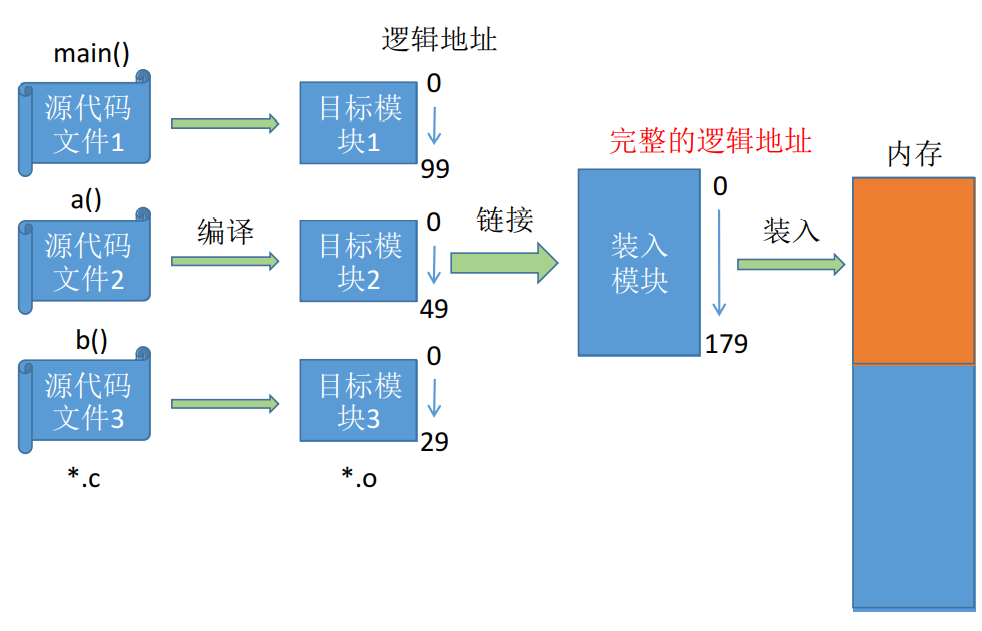</div>
- 装入时动态链接：将用户程序编译后得到目标模块，装入内存是，采用边装入边链接方式
  <div align="left">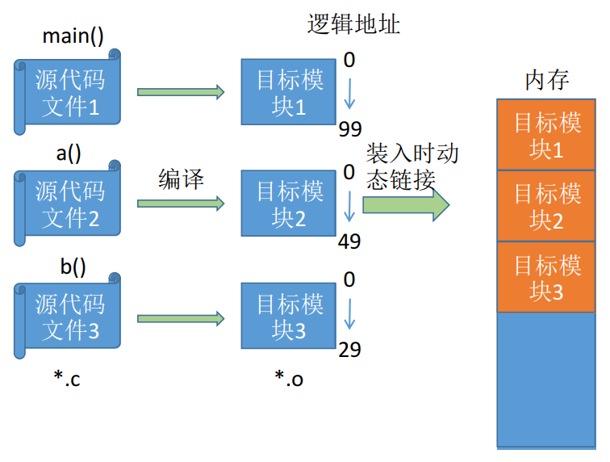</div>
- 运行时动态链接：对于某些目标模块的链接，程序需要时才会对其链接，便于修改和更新，便于实现对目标模块的共享
  <div align="left">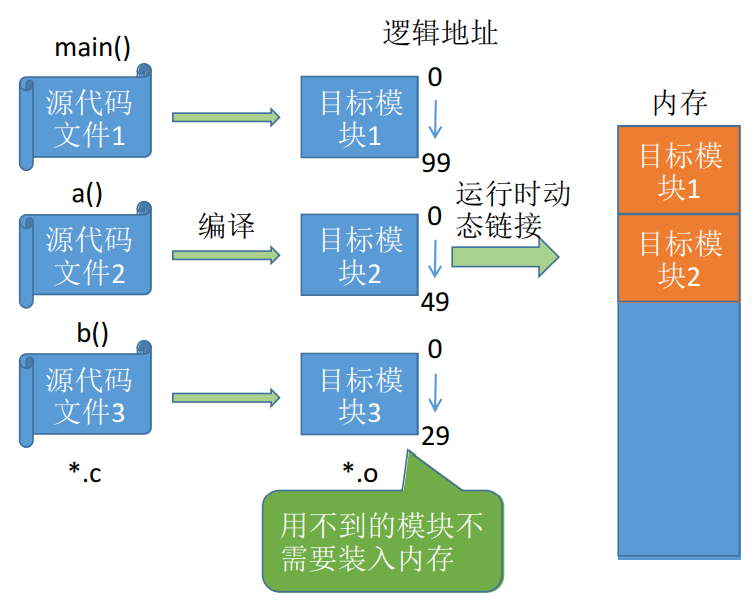</div>

**装入模式**：

| 装入模式                     | 原理                                                                                                                                                                                                                                                    | 特点                                                                                                                                                                                                                                         |
| ---------------------------- | ------------------------------------------------------------------------------------------------------------------------------------------------------------------------------------------------------------------------------------------------------- | -------------------------------------------------------------------------------------------------------------------------------------------------------------------------------------------------------------------------------------------- |
| 绝对装入                     | 装入时按照实际的内存地址，将程序和数据装入内存                                                                                                                                                                                                          | 优点：不需要对程序和数据的地址进行修改 <br> 缺点：只适用于单道程序环境                                                                                                                                                                       |
| 可重定位装入（静态重定位）   | 编译、链接后的装入模块的地址都是从 0 开始的，指令中使用的地址、数据存放的地址都是相对于起始地址而言的逻辑地址。可根据内存的当前情况，将装入模块装入到内存的适当位置。装入时对地址进行“重定位”，将逻辑地址变换为物理地址（地址变换是再装入时一次完成的） | 作业装入必须要一次性全部装入，并且运行中作业不能在内存中移动，也不能再申请内存空间                                                                                                                                                           |
| 动态运行时装入（动态重定位） | 编译、链接后的装入模块的地址都是从 0 开始的。装入程序把装入模块装入内存后，并不立即把装入模块中的逻辑地址转换为物理地址，当程序真正执行时才进行转换                                                                                                     | 需要重定位寄存器（存放装入模块存放的起始位置）。可将程序分配到不连续的存储区中，在程序运行前只需装入它的部分代码即可投入运行，然后在程序运行期间，根据需要动态的申请分配内存，便于程序段的共享，可以向用户提供一个比存储空间大得多的地址空间 |

- 逻辑地址空间：即相对地址，链接程序依次按照各个模块的相对地址构成统一的从 0 号单元开始编址的逻辑地址空间
- 物理地址空间：内存中物理单元的集合，是地址转换的最终地址，进程在运行时执行指令和访问数据，最后都要通过物理地址从主存中存取

## 内存管理的概念

操作系统作为系统资源的管理者，那么对内存的管理内容是？

- 内存空间的分配与回收：操作系统完成主存储器空间的分配和管理
  - 新进程的在内存中放在哪？
  - 操作系统怎么记录哪些内存被分配出去了，哪些还有空闲？
  - 进程结束后，如果将进程占用的内存空间回收？
- 内存空间的扩充：利用虚拟存储技术或者自动覆盖技术，从逻辑上扩充内存
  - 如：某游戏大小 60GB，按理说需要加载 60GB 的数据到内存，但电脑实际内存才 4G，游戏是怎么顺利运行的？（虚拟技术）
- 地址转换：负责程序的逻辑地址转与物理地址的转换
- 内存保护：保护各道作业在各自存储空间运行，互不干扰
  - 保护方法一：CPU 中设置上、下限寄存器，存放用户作业在主存中的下限和上限地址，每当 CPU 要访问一个地址时，分别和两个寄存器的数据比较，判断是否越界
  - 保护方法二：采用重定位寄存器（基址寄存器）和界地址寄存器（限长寄存器），重定位寄存器中存放的是进程的最小物理地址，界地址寄存器存放的是进程的最大逻辑地址  
    地址转换过程：逻辑地址->界地址寄存器->重定位寄存器->物理地址

### 内存空间扩充技术

操作系统的内存空间扩充技术一共有三种：覆盖技术、交换技术、虚拟存储技术

_虚拟存储技术之后再讲_

#### 覆盖技术

早期的计算机内存很小，引入覆盖技术是用来解决“程序大小超过物理内存总和”的问题

思想：将程序分为多个段（多个模块）。常用的段常驻内存，不常用的段在需要时调入内存  
将用户空间分为一个固定区和若干覆盖区，活跃部分放在固定区，调入后就不再调出；不常用的段放在覆盖区，需要用到时调入内存，用不到时调出内存

优点：打破了必须将一个进程的全部信息装入主存后才能运行的限制，内存中能够更新的地方只有覆盖区的段，不在覆盖区的段会常驻内存。必须由程序员声明覆盖结构，操作系统完成自动覆盖  
缺点：对用户不透明，增加了用户编程负担

覆盖技术只用于早期的操作系统中，现已成为历史

#### 交换技术

思想：内存空间紧张时，系统将内存中某些进程暂时换出外存，把外存中某些已具备运行条件的进程换入内存（进程在内存与磁盘间动态调度）  
换出：将处于等待状态的程序从内存中转移到辅存  
换入：把准备好竞争 CPU 运行的程序从辅存转移到内存

1. 应该在外存（磁盘）的什么位置保存被换出的进程？  
   具有对换功能的操作系统中，通常把磁盘空间分为文件区和对换区两部分  
   文件区主要用于存放文件，主要追求存储空间的利用率，因此对文件区空间的管理采用离散分配方式  
   对换区空间只占磁盘空间的小部分，被换出的进程数据就存放在对换区，主要追求换入换出速度，因此通常对换区采用连续分配方式  
   对换区的 IO 速度比文件区更快
2. 什么时候应该交换？  
   交换通常在许多进程运行切内存吃紧时进行，而系统负荷降低就暂停  
   例如：在发现许多进程运行时经常发生缺页，就说明内存紧张，此时可以换出一些进程，如果缺页率明显下降，就可以暂停换出
3. 应该换出那些进程？  
   可优先换出阻塞进程；可优先换出优先级低的进程；为了防止优先级低的进程在被调入内存后很快又被换出，有的系统还会考虑进程在内存的驻留时间

交换存在的问题

- 备份存储，使用快速硬盘，要求存储空间足够大，并且能够对内存映像进行直接访问
- 转移时间和所交换的内存空间成正比
- 只有进程空闲状态才能将进程换出
- 交换空间通常作为磁盘的一整块，且独立于文件系统，因此使用起来会很快
- 交换通常在有许多进程运行且内存吃紧时开始启动，系统负荷降低就暂停
- 普通的交换使用不多，但交换策略的某些变体在许多系统中仍发挥作用

注：PCB 会常驻内存，不会被换出外存

### 内存空间的分配

内存空间的分配方式有连续分配管理方式和非连续分配管理方式

#### 连续分配管理方式

连续分配是指为用户进程分配的必须是一个连续的内存空间

##### 单一连续分配

思想：内存分为系统区和用户区。系统区通常位于内存的低地址部分，用于存放操作操作系统的相关数据；用户区用于存放用户进程相关数据。内存中只能有一道用户程序，用户程序独占整个用户区空间

优点：无须进行内存保护，不会出现越界异常；实现简单，无外部碎片，可采用覆盖技术扩充内存，不需要额外技术支持  
缺点：只适用于单用户，单任务的操作系统；有内部碎片；存储器利用率低  
_分配给某些进程的内存区域中，如果有些部分没有用上，就是“内部碎片”_

##### 固定分区分配

出现多道程序的系统时，为了能在内存中装入多道程序，且这些程序之间又不会相互干扰，于是将整个用户空间划分为若干个固定大小的分区，在每个分区中只装入一道作业，这样就形成了最早的、最简单的一种可运行多道程序的内存管理方式

分区类型：

- 分区大小相等：缺乏灵活性，适用于一台计算机去控制多个相同对象的场合
- 分区大小不等：增加了灵活性，可以满足不同大小的进程需求  
  根据常在系统中运行的作业大小情况进行划分，如划分为多个较小的分区，适量的中等分区和少量大分区

优点：适用于多道程序的存储，无外部碎片  
缺点：程序太大时，无法放入任何一个分区，此时不得不采用覆盖技术来解决，但这又会降低性能；主存利用率低，存在内部碎片；不能实现多进程共享一个主存区

##### 动态分区分配

动态分区分配又称为可变分区分配，这种分配方式不会预先划分内存分区，而是在进程装入内存时，根据进程的大小动态地简历分区，并使分区的大小正好适合进程的需要

动态分区分配需要解决以下问题：

1. 系统要用什么样的数据结构记录内存的使用情况？  
   空闲分区表：每个空闲分区对应一个表项。表项中包含分区号、分区大小、分区起始地址等信息
   <div align="left">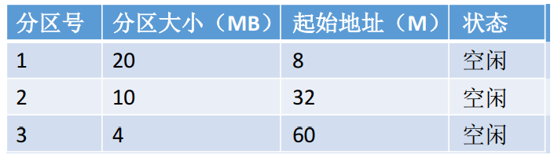</div>  
   空闲分区链：每个分区的起始部分和末尾部分分别设置向前指针和向后指针。起始部分处还可记录分区大小等信息  
   <div align="left"></div>
2. 当很多个空闲分区都能满足需求时，应该选择哪个分区进行分配？  
   把一个新作业装入内存时，须按照一定的动态分区算法，从空闲分区表（或空闲分区链）中选出一个分区分配给该作业（动态分配算法见后续内容）
3. 如何进行分区的分配与回收操作？  
   情况一：回收区的前面或后面有一个相邻的空闲分区。将两个相邻的空闲分区合并为一个  
   情况二：回收区的前、后各有一个相邻的空闲分区。将三个相邻的空闲分区合并为一个  
   情况三：回收区的前、后都没有相邻的空闲分区。需新增一个表项

动态分区分配没有内部碎片，但是有外部碎片  
内部碎片：分配给某进程的内存区域中，没有用上的部分  
外部碎片：是指内存中的某些空间分区由于太小而难以利用

优点：分区大小可以根据进程的实际情况进行分配  
缺点：存在外部碎片，最后导致主存利用率下降；采用紧凑技术可以缓解这种缺陷

动态分配算法：

| 算法                         | 算法思想                                                                                                         | 分区排列顺序                 | 优点                                                                 | 缺点                                                                                   |
| ---------------------------- | ---------------------------------------------------------------------------------------------------------------- | ---------------------------- | -------------------------------------------------------------------- | -------------------------------------------------------------------------------------- |
| 首次适应算法                 | 每次都从低地址开始查找，找到第一个能满足大小的空闲分区                                                           | 空闲分区以地址递增的次序排列 | 综合性能最好。算法开销小，回收分区后一般不需要对空闲分区队列重新排序 |
| 最佳适应算法                 | 优先使用更小的分区，以保留更多大分区                                                                             | 空闲分区以容量递增次序排列   | 会有更多的大分区被保留下来，更能满足大进程需求                       | 会产生很多太小的、难以利用的碎片；算法开销大，回收分区后可能需要对空闲分区队列重新排序 |
| 最坏适应算法（最大适应算法） | 优先使用更大的分区，以防止产生太小的不可用的碎片<br>空闲分区按照容量递减地次序进行查找，第一个满足条件的进行分配 | 空闲分区以容量递减次序排列   | 可以减少难以利用的小碎片                                             | 导致很快没有较大的内存块，性能很差。不利于大进程，算法开销大                           |
| 邻近适应算法                 | 由首次适应演变而来，每次从上次查找结束位置开始查找                                                               | 空闲分区以地址递增次序排列   | 不用每次都从低地址的小分区开始检索，算法开销小                       | 会使高地址的大分区也被用完                                                             |

#### 非连续分配管理方式

非连续分配是指为用户进程分配的可以说一些分散的内存空间

##### 基本分页存储管理方式

- 基本概念  
  将内存空间分为一个个大小相等的分区，每个分区就是一个“页框”（页框=页帧=内存块=物理块=物理页面）。每个页框有一个编号，即“页框号”，页框号从 0 开始  
  将进程的逻辑地址空间也分为与页框大小相等的一个个部分，每个部分称为一个“页”或“页面”。每个页面也有一个编号，即“页号”，页号也是从 0 开始

  操作系统以页框为单位为各个进程分配内存空间。进程的每个页面分别放入一个页框中，也就是说，进程的页面与内存的页框有一一对应关系。每个页面也不必连续存放，可以放到不相邻的页框中

  进程的最后一个页面可能没有一个页框那么大，也就是说，分页存储有可能产生内部碎片，因此页框不能太大，否则可能产生过大的内部碎片  
  分页存储与固定分区技术很像，但是其分页相对分区又很小，分页管理不会产生外部碎片，产生内部碎片也非常的小

- 页表  
  为了能知道进程的每个页面在内存中存放的位置，操作系统要为每个进程建立一张**页表**，页表通常存在 PCB 中
  <div align="left">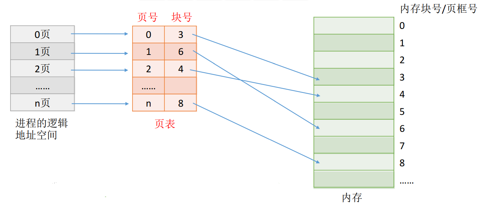</div>  
  特点：

  - 一个进程对应一张页表
  - 进程的每个页面对应一个页表项
  - 每个页表项由“页号”和“块号”组成
  - 页表记录进程页面和实际存放的内存块之间的映射关系
  - 每个页表项的长度是相同的

  为了方便查找页表项，页表一般是放在连续的内存块中

  问题一：每个页表项占多少字节？

  ```txt
  假设某系统物理内存大小为4GB，页面大小为4KB，则每个页表项至少应该为多少字节？

  内存块大小 = 页面大小 = 4KB = 2^12B
  4GB的内存总共会被分为 2^32 / 2^12 = 2^20个内存块
  内存块号的范围应该是 0 ~ (2^20 - 1)
  内存块号至少要用20bit来表示，所以页表的块号至少需要3B（24bit）
  由于页号是隐含的，因此每个页表项占3B，存储整个页表至少需要 3*(n+1)B

  假设页表中的各页表项从内存地址为X的地方开始连续存放，那么第i号页表项存放的地址为 X + 3*i
  因此，页表中的页号是可以隐含的，即页号不占用存储空间
  ```

  理论上，页表项长度为 3B 即可表示内存块号的范围，但是，为了方便页表的查询，常常会让一个页表项占更多的字节，使得每个页面恰好可以装得下整个页表项

  问题二：进行分页后，如何实现逻辑地址到物理地址的转换

  1. 计算出逻辑地址对应的页号 P 和页内偏移量 W
  2. 找到对应页面在内存中的存放位置（查页表）
  3. 物理地址 = P 页面在内存中始址 + 页内偏移量

  页号 P = 逻辑地址 A / 页面长度 L  
  页内偏移量 W = 逻辑地址 A % 页面长度 L  
  页表中页号对应的页表项地址=页表始址 F+页号 P \* 页表项长度，取出该页表项内容 b  
  物理地址 E = b\*L + W

  问题三：为何页面大小要取 2 的整数幂

  - 逻辑地址的拆分更加迅速。如果每个页面大小为$2^k$B，用二进制数表示逻辑地址，则末尾 K 位即为页内偏移量，其余部分就是页号
  - 物理地址的计算更加迅速。根据逻辑地址得到页号，根据也好查询页表从而找到页面存放的内存块号，将二进制表示的内存块号和页内偏移地址拼接起来，就可以得到最终的物理地址

  ```txt
  假设某计算机用32个二进制位表示逻辑地址，页面大小为4KB = 2^12B = 4096B

  0号页的逻辑地址范围应该是0 ~ 4095，二进制表示 00000000000000000000 000000000000 ~ 0000000000000000000 111111111111
  1号页的逻辑地址范围应该是1 ~ 4095，二进制表示 00000000000000000001 000000000000 ~ 0000000000000000000 111111111111

  Eg：逻辑地址4097，用二进制表示应该是00000000000000000001 000000000001
  页号 = 4097 / 4096 = 1 = 00000000000000000001
  页内偏移量 = 4097 % 4096 = 1 = 000000000001
  假设通过页表查询得知1号页面存放的内存块号是9（1001），则9号内存块的起始地址 = 9*4096 = 00000000000000001001 00000000000，
  则逻辑地址4097对应的物理地址 = 页面在内存始址 + 页内偏移量 = 00000000000000001001 000000000001
  ```

  分页管理存在的问题

  - 地址变换过程必须足够宽，否则访存速率会降低
  - 页表不能太大，否则会降低内存利用率

- 基本地址变换机构  
  基本地址变化机构可以借助进程的页表将逻辑地址转换为物理地址  
  通常会在系统中设置一个页表寄存器（PTR），存放页表在内存中的起始地址 F 和页表长度 M  
  进程未执行时，页表的始址和页表长度放在进程控制块 PCB 中，当进程被调度时，操作系统内核会把它们放到 PTR 中
  <div align="left">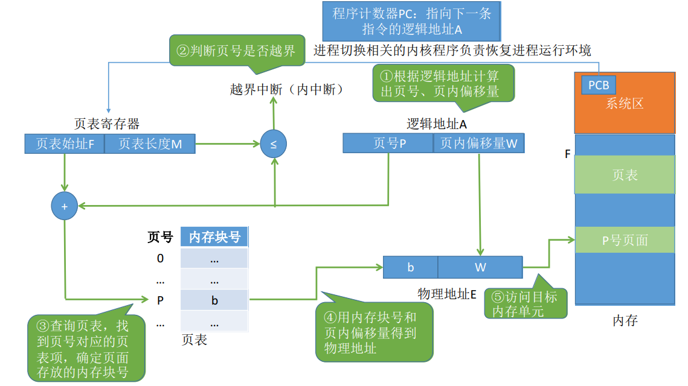</div>

- 具有快表的地址变换机构

  快表：又称联想寄存器（TLB，translation lookaside buffer），是一种访问速度比内存快很多的高速缓存，用来存放最近访问的页表项的副本，可以加速地址变换。内存中的页表常称为慢表

  基本地址变换机构-两次访存  
  具有快表的地址变换结构，快表命中-只需依次访存，快表未命中，需要两次访存

  地址变换过程：

  - CPU 给出逻辑地址后，先查询快表中是否命中
  - 若快表命中，直接从快表中该页对应的页框号，与页内偏移量拼接成物理地址
  - 若快表不命中，再按照正常方式从页表中查询相应页表项，并将该页表项存入快表中（按照一定策略）

  _TLB 和普通 Cache 区别：TLB 只有页表项的副本，而普通的 Cache 中可能会有其他各种数据的副本_

- 两级页表

  单级页表存在问题 1：页表必须连续存放，因此当页表很大时，需要占用很多连续的页框  
  解决方法：把页表再分页并离散存储，然后再建立一张页表记录各个部分的存放位置，称为页目录表，或称外层页表、顶层页表

  单级页表存在问题 2：没有必要让整个页表常驻内存，因为进程在一段时间可能只需要访问某几个特定的页面  
  解决方法：可以在需要访问页面时才把页面调入内存（虚拟存储技术）。可以在页表项中增加一个标志位，用于表示该页面是否已调入内存  
  若想访问的页面不在内存中，则产生缺页中断，然后将目标页面从外存调入内存

  逻辑地址空间格式 = 一级页号 + 二级页号 + 页内偏移量
  <div align="left"></div>

  设计多级页表的时候，最后一定要保证顶级页表一定只有一个  
  建立多级页表的目的在于建立索引，不必浪费主存空间区存储无用的页表项，也不用盲目式的查询页表项

##### 基本分段存储管理方式

分页是从计算机角度考虑设计的，目的是为了内存的利用率，提高计算机性能，分页通过硬件机制实现，对用户完全透明  
分段是从用户和程序员角度提出，满足方便编程，信息保护和共享，动态增长及动态链接等多方面的需要

- 分段  
  进程的地址空间是按照程序自身的逻辑关系划分为若干段，每个段都有一个段名，每段从 0 开始编址  
  内存分配时以段为单位进行分配，每个段在内存中占据连续空间，但各段之间可以不相邻
  <div align="left">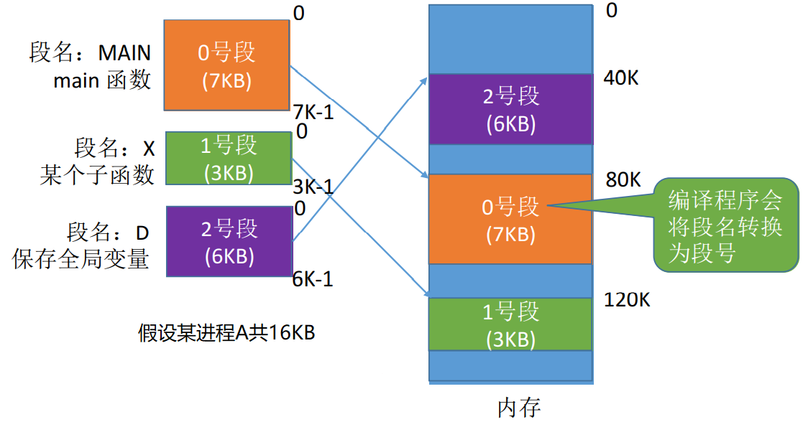</div>

  分段的地址结构 = 段号 S + 段内偏移量 W  
  段号的位数决定了每个进程最多可以分为几段  
  段内地址位数决定了每个段的最大长度是多少

  页式系统中，页号和页内偏移对用户透明；段式系统中，短号和段内便宜必须由用户显示的提供

- 段表  
  程序分为多个段，各段离散地装入内存，为了保证程序能正常运行，就必须能从物理内存中找到各个逻辑段存放的位置。为此，每个进程都建立一张段映射表，简称“段表”  
  每个进程都有一张逻辑空间与内存空间映射的段表，这个段表项对应进程的一段，段表项记录该段在内存中的始址和长度  
  段表内容 = 段号 + 段长 + 本段在主存中的地址
  <div align="left">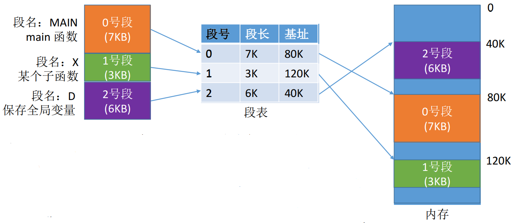</div>

- 地址变换机构

  - 逻辑地址 A 中取出段号 S 和段内偏移量 W
  - 比较段号 S 和段表长度 M，若 S>=M，则产生越界中断，否则继续执行
  - 段号 S 对应的段表项地址=段表始址 F+段号 S\*段表项长度，从该段表项中取出段长 C，比较段内偏移量与 C 的大小判断是否出现越界
  - 取出段表项中该段始址 b，计算 E=b+W，用得到的物理地址 E 去访问内存

- 分段、分页管理的对比

  页是信息的物理单位。分页的主要目的是为了实现离散分配，提高内存利用率。分页仅仅是系统管理上的需要，完全是系统行为，对用户是不可见的  
  段是信息的逻辑单位。分段的主要目的是更好地满足用户需求。一个段通常包含一组属于一个逻辑模块的信息。分段是对用户可见的，用户编程时需要显示地给出段名

  页的大小固定且由系统决定
  段的长度却不固定，决定于用户编写的程序

  分页的用户进程地址空间是一维的，程序员只需给出一个记忆符即可表示一个地址  
  分段的用户进程地址空间是二维的，程序员在标识一个地址时，即要给出段名，也要给出段内地址

  分段比分页更容易实现信息的共享和保护。不能被修改的代码称为纯代码或可重入代码（不属于临界资源），这样的代码是可以共享的。可修改的代码是不能共享的。共享可以通过两个进程的段表中相应表项指向被共享段的同一个物理副本来实现

##### 基本段页式存储管理方式

分页管理有效的提高内存利用率，不会产生外部碎片，只会有少量的页内碎片；但是不方便按照逻辑模块实现信息的共享和保护  
 分段管理能反映程序的逻辑结构并很方便的实现信息的共享和保护；但如果段过长，为其分配很大的连续空间会很不方便，分段管理会产生外部碎片

- 段页式管理思想
  - 作业的地址空间首先被分成若干逻辑段，每段有自己的段号
  - 每个段分成若干大小固定的页
  - 对内存空间的管理仍然和分页存储管理一样
  <div align="left">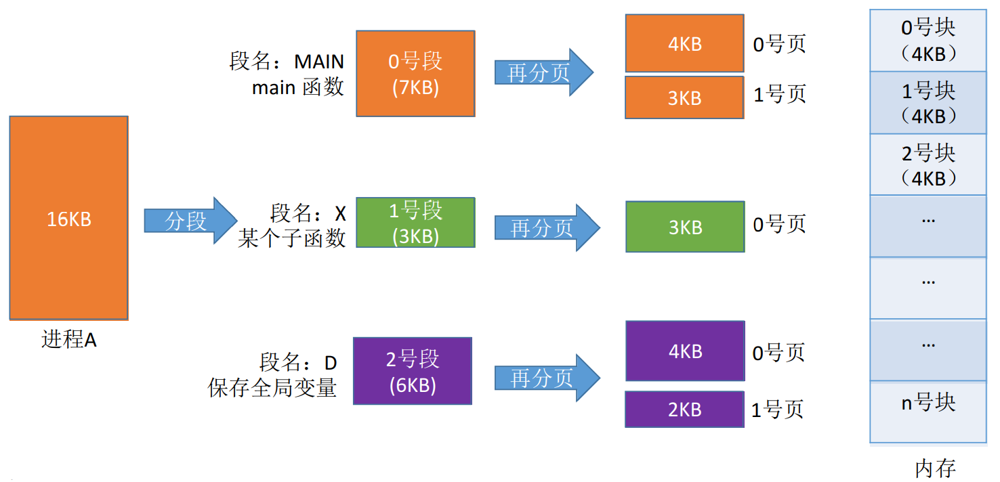</div>
- 地址结构 = 段号 S + 页号 P + 页内偏移量 W
- 为了实现地址变换，系统为每个进程建立了一张段表，每个分段有一个页表，一个进程中，段表只能有一个，页表可以有多个  
  每个段对应一个段表项，每个段表项由段号、页表长度、页表存放块号（页表起始地址）组成。每个段表项长度相等，段号是隐含的  
  每个页面对应一个页表项，每个页表项由页号、页面存放的内存块号组成。每个页表项长度相等，页号是隐含的
  <div align="left">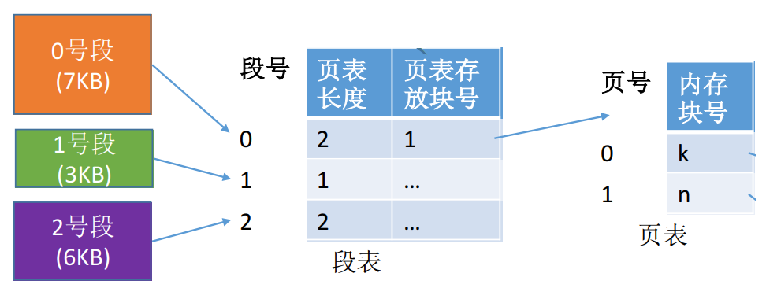</div>
- 地址变化方式
  <div align="left">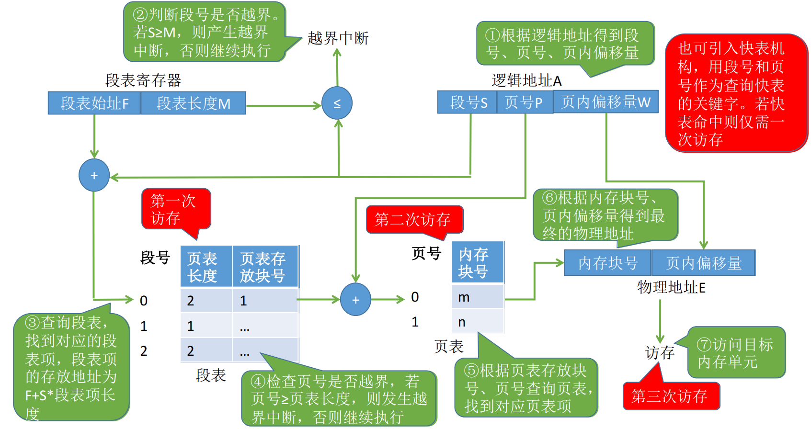</div>
- 访存
  访问一个逻辑地址需要访存次数：查段表一次、查页表一次、访问目标单元一次。共三次  
  可引入快表机构，以段号和页号为关键字查询快表，即可直接找到最终目标页面存放位置。引入快表后（命中）仅需一次访存

## 虚拟内存管理

### 虚拟内存的基本概念

#### 传统存储管理方式的特征

- 一次性：作业必须一次性全部装入内存后，才能开始运行。作业很大无法装入则无法运行；大量作业要求运行时，由于内存不足，只能一部分作业先运行，导致多道程序并发度下降
- 驻留性：作业装入内存后，一直驻留在内存中，任何部分都不会被换出，直至作业运行结束。事实上，在一个时间段内，只需要访问作业的一小部分数据即可正常运行，这就导致了内存中会驻留大量的、暂时用不到的数据，浪费了宝贵的内存资源

#### 局部性原理

- 时间局部性
  - 一条指令执行后，不久之后指令可能被再次执行，数据被访问后，不就后数据可能再次被访问
  - 原因：程序中存在着大量的循环操作
  - 时间局部性通过将最近使用的指令和数据存储在高速缓冲存储器中
- 空间局部性
  - 一旦程序访问了某个存储单元，不久之后附近的存储单元也将被访问
  - 原因：指令通常是顺序存放，顺序执行的，数据一般也是以向量、数组、表等形式簇聚存储的
  - 空间局部性使用较大的高速缓存，将预取机制继承到高速缓存控制逻辑中实现

#### 虚拟存储器的定义和特征

- 定义  
  基于局部性原理，在程序装入时，可以将程序中很快用到的部分装入内存，暂时用不到的部分驻留在外存  
  执行时，当所访问的信息不在内存时，由操作系统负责将所需信息从外存调入内存，然后继续执行  
  若内存空间不够，由操作系统负责将内存中暂时用不到的信息换出到外存  
  在操作系统的管理下，在用户看来似乎有一个比实际内存大得多的内存，这就是虚拟内存
- 特征
  - 多次性：作业在运行时，允许被分成多次调入内存运行
  - 对换性：作业不必一直驻留内存，允许作业在运行过程中进行换入换出
  - 虚拟性：从逻辑上扩充内存容量，使用户看到的内存容量远大于实际的内存容量

虚拟内存的最大容量是由计算机的地址结构（CPU 寻址范围）确定的  
虚拟内存的实际容量 = min(内存和外存容量之和，CPU 寻址范围)

```txt
如：某计算机地址结构为32位，按字节编制，内存大小为512MB，外存大小为2GB
则虚拟内存的最大容量为2^32B = 4G
虚拟内存的实际容量 = min(2^32B, 512MB+2GB)=2GB+512MB
```

### 虚拟内存技术的实现

虚拟内存技术，允许一个作业分多次调入内存。如果采用连续分配方式，不容易实现。因此虚拟内存技术的实现需要建立在传统的非连续分配存储管理方式基础上

传统的非连续分配存储管理：基本分页存储管理、基本分段存储管理、基本段页式存储管理  
虚拟内存的实现：请求分页存储管理、请求分段存储管理、请求段页式存储管理

#### 请求分页存储管理方式

建立在基本分页系统基础之上，为了支持虚拟存储器功能而增加了请求调页功能和页面置换功能

- 请求调页功能：访问的信息不在内存时，由操作系统负责将所需的信息从外存调入内存
- 页面置换功能：内存空间不够时，将内存中暂时用不到的信息换出外存

##### 页表机制

与基本分页管理相比，请求分页管理中，为了实现“请求调页”，操作系统需要知道每个页面是否已经调入内存；如果还没调入，那么也需要知道该页面在外存中存放的位置  
当内存不够时，要实现“页面置换”，操作系统需要通过某些指标来决定到底置换出哪个页面；有的页面没有被修改过，就不用再浪费时间写回外存。有的页面修改过，就需要将外存中的旧数据覆盖，因此操作系统也需要记录各个页面是否被修改过的信息

页表的组成：

- 组成 = 页号（隐含）+ 内存块号 + 状态位 + 访问字段 + 修改位 + 外存地址
- 状态位：当前页是否已经调入内存
- 访问字段：记录本页在一段时间内被访问的次数，或上次访问的时间，供置换算法使用
- 修改位：记录本页是否被修改过
- 外存地址：指出该页在外存上的位置（通常是物理块号）

##### 缺页中断机构

当访问页面不在内存时就会产生缺页中断，然后由操作系统的缺页中断处理程序处理中断  
此时缺页的进程阻塞，放入阻塞队列，调页完成后再将其唤醒，放回就绪队列

如果内存中有空闲块，则为进程分配一个空闲块，将所缺页面装入该块，并修改页表中相应的页表项  
如果内存中没用空闲块，则由页面置换算法选择一个页面淘汰，若该页面在内存期间被修改过，则要将其写回外存。未修改的页面不用写回外存

缺页中断是因为当前的指令想要访问的目标页面未调入内存而产生的，因此属于内中断  
一条指令在执行期间，可能产生多次缺页中断

##### 地址变化机构

检索快表，找到访问页，修改页表项中的访问位，利用页表项中给出的物理块号和页内地址形成物理地址  
没有找到该页的页表项，去内存中寻找页表，看该页是否已经调入内存，没有调入则产生缺页中断，请求从外存把该页调入内存

一些细节：

- 只有“写指令”才需要修改“修改位”，并且，一般来说只需修改快表中的数据，只有要将快表项删除时才需要写回内存中的慢表，这样可以减少访存次数
- 和普通的中断处理一样，缺页中断依然需要保留 CPU 现场
- 需要用某种“页面置换算法”来决定一个换出页面
- 换入/换出页面都需要启动慢速的 I/O 操作，可见，如果换入/换出太频繁，会有很大开销
- 页面调入内存后，需要修改慢表，同时也需要将表项复制到快表中

与基本分页管理相比：

- 找到页表项是需要检查页面是否在内存中，若页面不在内存中，需要请求调页
- 若内存空间不够，还需换出页面
- 页面调入内存后，需要修改相应的页表项

##### 页面置换算法

页面的换入、换出需要磁盘 I/O，会有较大的开销，因此好的页面算法应该追求更少的缺页率

| 算法                          | 算法思想                                                                      | 实现方法                                                                                                                                                                                                                                                                                                                                                             | 优缺点                                                                                                                                                                                                                    |
| ----------------------------- | ----------------------------------------------------------------------------- | -------------------------------------------------------------------------------------------------------------------------------------------------------------------------------------------------------------------------------------------------------------------------------------------------------------------------------------------------------------------- | ------------------------------------------------------------------------------------------------------------------------------------------------------------------------------------------------------------------------- |
| 最佳置换算法（OPT）           | 选择永不使用或最长时间内不再被访问的页面进行淘汰                              | 操作系统无法预知页面访问序列，因此最佳置换算法无法实现                                                                                                                                                                                                                                                                                                               | 优点：缺页率小，性能最好<br>缺点：无法实现                                                                                                                                                                                |
| 先进先出置换算法（FIFO）      | 选择淘汰最早进入内存的页面                                                    | 把调入内存的页面根据调入的先后顺序排成一个队列，需要换出的页面选择队头页面即可。队列的长度取决于系统为进程分配了多少内存块                                                                                                                                                                                                                                           | 优点：实现简单<br>缺点：FIFO 算法会会产生 Belady 异常，且与进程实际运行时的规律不适应，因为先进入的页面也有可能最经常被访问。因此算法性能差 <br><br>Belady 异常：当为进程分配的物理块数增大时，缺页次数不减反增的异常现象 |
| 最近最久未使用置换算法（LRU） | 每次淘汰的页面是最近最久未使用的页面                                          | 赋予每个页面对应的页表项中，用访问字段记录该页面自上次被访问依赖所经历的时间 t。淘汰页面时，选择现有页面中 t 最大的                                                                                                                                                                                                                                                  | 优点：性能好 <br>缺点：实现复杂，需要寄存器和栈硬件支持，LRU 是堆栈类算法                                                                                                                                                 |
| 时钟置换算法（CLOCK）         | 一种性能和开销均衡的算法                                                      | 每个页面设置一个访问位，再将内存中的页面都通过链接指针链接成一个循环队列，遇到没有被使用的页面就会将页面换出，然后将使用位置 0，如果遇到使用的就会将访问位置 0，然后扫描下一个；如果第一轮扫描中所有页面都是 1，则将这些页面的访问位依次置为 0 后，再进行第二轮扫描<br><br>选择一个页面淘汰最多经过两轮扫描                                                          | 优点：性能接近最佳置换算法，实现简单 <br>缺点：未考虑页面是否被修改过                                                                                                                                                     |
| 改进 CLOCK 算法               | 只有被淘汰的页面被修改时，才需要写回外存，未被修改的，不需要 I/O 操作写回外存 | 访问位的基础上增加一个修改位 <br>页面访问位都为 1 时，优先淘汰没被修改过的页面 <br><br> 扫描过程：<br>1. 扫描缓冲区，选择第一个访问位和修改位都为 0 的页面换出<br>2. 第一步失败后，查找访问位为 0，修改位为 1 的进行替换，对于每个跳过的帧，将访问位置 0 <br> 3. 第二步失败后，指针回到初始地点并且访问位均为 0，重复第一步<br><br> 选择一个页面淘汰最多经过四轮扫描 | 优点：相对未改进型，节省了时间                                                                                                                                                                                            |

##### 页面分配策略

- 驻留集：给一个进程分配的物理页框的集合就是这个进程的驻留集  
  在采用虚拟存储技术的系统中，驻留集大小一般小于进程的总大小  
  若驻留集太小，会导致缺页频繁，系统要花大量时间来处理缺页，实际用于进程推进的时间很少  
  若驻留集太大，又会导致多道程序并发度下降，资源利用率低
- 分配策略

  固定分配：每个进程分配固定物理块数，在进程运行期间不再改变。即驻留集大小不变  
  可变分配：先为每个进程分配一定数目的物理块，在进程运行期间，根据情况适当的增加或减少。即驻留集大小可变

  局部置换：发生缺页时只能选自己的物理块进行置换  
  全局置换：可以将操作系统保留的空闲物理块分配给缺页进程，也可以将别的进程持有的物理块置换到外存，再分配给缺页进程
  | 策略 | 策略原理 | 优点 | 缺点 |
  | --- | ----- | ---- | ------|
  | 固定分配局部置换 | 每个进程分配固定物理块数，缺页的时候就进行换页 | | 难以确定每个进程应该分配的物理块数 <br> 太多导致资源利用率下降，太少导致频繁缺页中断 |
  | 可变分配局部置换 | 刚开始会为每个进程分配一定数量的物理块。根据进程缺页情况，对物理块进行动态分配，如果频繁换页，就对其多分配物理块，如果缺页率特别低，就减少物理块 | 保持了系统的多道程序并发能力 | 增大了开销，实现复杂 |
  | 可变分配全局置换 | 进程分配一定物理块，操作系统自生保留一定空闲物理块。若进程缺页，就从空闲物理块中取出一块分配给该进程；若已无空闲物理块，则可选择一个未锁定的页面换出外存，再将该物理块分配给缺页的进程。被选择调出的页可能是系统中任何一个进程中的页，因此会导致这个进程物理块减少，缺页率增加 <br><br>锁定：系统会锁定一些页面，这些页面的内容不能置换出外存（如：重要的内核数据可以设为“锁定”）| 最容易实现，动态调整物理块分配 | 如果盲目分配物理块，就会导致多道程序并发能力下降 |

  全局置换意味着一个进程拥有的物理块数量必然会改变，因此不可能是固定分配

- 调入页面时机
  - 预调页策略  
    根据局部性原理，一次调入若干相邻的页面可能比一次调入一个页面更高效。但如果提前调入的页面中大多数都没被访问过，则又是低效的。因此可以预测不久之后可能访问到的页面，将它们预先调入内存，但目前预测成功率只有 50%左右。所以这种策略主要用于进程的首次调入，由程序员指定先调入哪些部分
  - 请求调页策略  
    当进程发现缺页的时候，再按照一定策略进行调页。每次只能调入一页（要访问的页），调入/调出页面数多会花费过多的 IO 开销
- 从何处调页

  - 系统拥有足够的对换空间：页面的调入、调出都是在内存与对换区之间进行，这样可以保证页面的调入、调出速度很快。在进程运行前，需将进程相关的数据从文件区复制到对换区
  <div align="left">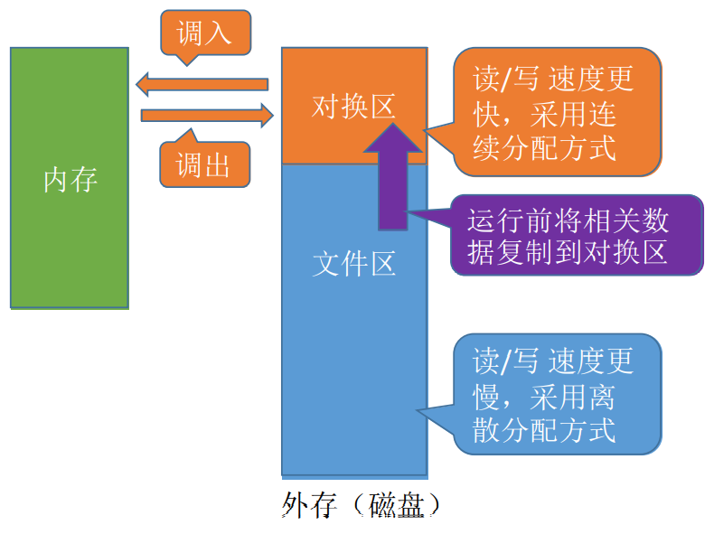</div>

  - 系统缺少足够的对换区空间：不会被修改的数据从文件区调入，由于这些页面不会被修改，因此换出时不必写回磁盘，下次需要时再从文件区调入即可。对于可能被修改的部分，换出时写回磁盘对换区，下次需要时再从对换区调入  
  原理：读速度比写速度快
  <div align="left">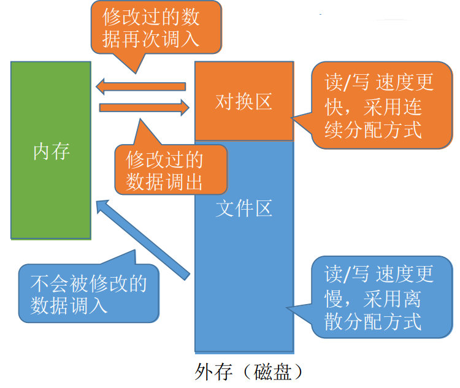</div>

  - UNIX 方式：运行之前进程相关的数据全部放在文件区，没有运行的页面从文件区调入，曾经运行过但又被换出的页面放在对换区
  <div align="left">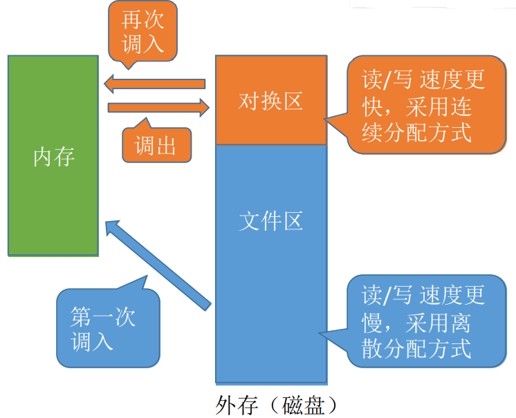</div>

##### 抖动

刚换出的页面又马上要换入内存，刚换入的页面又马上要换出外存，这种频繁的页面调度行为称为抖动

产生抖动的主要原因是进程频繁访问的页面数目高于可勇物理块数（分配给进程的物理块不够）

##### 工作集

工作集指某段时间间隔里，进程实际访问页面的集合

操作系统会根据“窗口尺寸”来算出工作集

```txt
例：某进程的页面访问序列如下，窗口尺寸为4，各时刻的工作及为？
(24, 15, 18, 23), 24, 17, (18, 24, 18, 17), 17, 15
第一个括号时刻的工作集：24,15,18,23
第二个括号时刻的工作集：18,24,17
```

原理：

- 操作系统跟踪每个进程的工作集，并为进程分配大于其工作集的物理块
- 落入工作集的页面需要调入驻留集中，落在工作集外面的页面可以从驻留集中换出
- 若还有空闲物理块，可以再调入一个进程到内存以增加多道程序数
- 若所有进程的工作及之和超过了可用物理块的总数，操作系统就会暂停一个进程，并将页面调出并将其物理块分配给其他进程

#### 请求分段存储管理方式

暂略...

#### 请求段页存储管理方式

暂略...
