# 文件管理

**概览：**

**[:question: 文件的概念](#文件的概念)**  
**[:question: 文件的逻辑结构](#文件的逻辑结构)**  
**[:question: 文件目录](#文件目录)**  
**[:question: 文件的物理结构](#文件的物理结构文件分配方式)**  
**[:question: 文件基本操作](#文件的基本操作)**  
**[:question: 文件的存储管理](#文件的存储管理)**  
**[:question: 文件的共享与保护](#文件的共享与保护)**  
**[:question: 文件系统的层次结构](#文件系统的层次结构)**  
**[:question: 磁盘组织与管理](#磁盘组织与管理)**

## 文件的概念

文件是以计算机硬盘为载体的存储在计算机上的信息集合，文件可以说文本文档、图片、程序等  
系统运行时，计算机以进程为基本单位进行资源的调度和分配，在用户输入输出时，以文件为基本单位  
操作系统的文件系统：用于实现文件的权限访问，修改，查询和保存等功能

### 文件的属性

- 名称：由创建文件的用户决定文件名，主要是为了方便用户找到文件，同一目录下不允许有重名文件
- 标识符：文件的唯一标签，通常为数字，对用户来说毫无可读性，因此标识符只是操作系统用于区分各个文件的一种内部名称
- 类型：被支持的不同类型的文件系统所使用
- 位置：文件存放的路径（提供给用户）、外存中的地址（操作系统适用，对用户不可见）
- 大小：文件当前的大小，包含文件允许的最大值
- 保护信息：对文件进行保护的访问控制信息
- 时间、日期和用户标识：文件创建、修改和上次访问的相关信息，用户保护和跟踪文件使用

## 文件的逻辑结构

逻辑结构是指在用户看来，文件内部的数据应该是如何组织起来的  
物理结构是指在操作系统看来，文件的数据是如何存放在外存中的

按文件是否有结构分为无结构文件和有结构文件

### 无结构文件（流式文件）

文件内部的数据有一系列二进制流或字符流组成，如文本文件

- 最简单的文件组织形式
- 将数据按照顺序组织记录并积累、保存、是有序相关信息项集合
- 由于其没有结构，所以只能采用更穷举搜索
- 管理简单，方便用户对其操作
- 基本信息单位操作不多的文件适合采用字符流的无结构方式

### 有结构文件（记录式文件）

文件由一组相似的记录组成，每条记录由若干数据项组成，如数据库表文件  
一般来说，每条记录有一个数据线可作为关键字。根据各条记录的长度（占用的存储空间）是否相等，又可分为定长记录和可边长记录两种

> 数据项：数据项是文件系统中最低级的数据组织形式
>
> - 基本数据项：用于描述一个对象的某种属性的一个值
> - 组合数据项：多个基本数据项组成
>
> 记录：一组数据项的集合，用于描述一个对象在某方面的属性

根据有结构文件中的各条记录在数据上如何组织，可以分为顺序文件、索引文件、索引顺序文件

#### 顺序文件

文件的记录是一个接一个地顺序排列（逻辑上），记录可以是定长或变长的，各个记录在物理上可以顺序存储或者链式存储

顺序文件的结构有串结构（记录之间的顺序与关键字无关，通常按照存入时间决定顺序）、顺序结构（记录之间的顺序按关键字顺序排列）

假设已经知道文件的起始地址（即第一个记录存放的位置），能否快速找到第 i 个记录对应的地址（能否实现随机存储）？能否快速找到某个关键字对应的记录存放的位置？

- 链式存储：无论是定长/可变长记录，都无法实现随机存取，每次只能从第一个记录开始依次往后找
- 顺序存储
  - 可变长记录：无法实现随机存取。每次只能从第一个记录开始依次往后找
  - 定长记录
    - 可实现随机存取。记录长度为 L，则第 i 个记录存放的相对位置是 i\*L
    - 若采用串结构，无法快速找到某关键字的对应记录
    - 若采用顺序结构，可快速找到某关键字对应的记录

优点：批量处理时，顺序文件的效率是所有逻辑文件中效率最高的
缺点：增删操作比较困难

##### 索引文件

定长记录文件：按照公式 A=i\*L 可以直接得到文件地址（第 i 条记录，L 是文件长度）  
变长记录文件：查找前 i-1 条记录后，才能查找第 i 条记录；通过建立索引表后可以有效提高查找速度

<div align="left">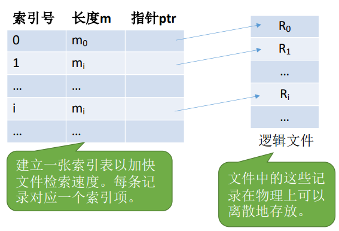</div>

索引表本身是定长记录的顺序文件。因此可以快速找到第 i 个记录对应的索引项  
可将关键字作为索引号内容，若按关键字顺序排列，则还可以支持按照关键字二分查找。每当要增加/删除一个记录时，需要对索引表进行修改

优点：索引文件有很快的检索速度，因此主要用于对信息处理的及时性要求比较高的场合  
缺点：每个记录对应一个索引表项，因此索引表可能会很大。比如文件的每个记录平均只占 8B，而每个索引表项占 32B，那么索引表都要比文件内容本身大 4 倍，这样对存储空间的利用率就太低了

##### 索引顺序文件

索引顺序文件是顺序文件和索引文件两种组织形式的结合  
将顺序文件中的所有记录分成若干组，为顺序文件建立起一张索引表，在索引表中为每组中的第一条记录建立一个索引项，其中含有该记录得关键字值和指向该记录的指针

检索记录先闲顺序查索引表，找到分组，再顺序查找分组。当记录过多时，可建立多级索引

比如按学生姓名开头字母进行分组。每个分组就是一个顺序文件，分组内的记录不需要按关键字排序。索引顺序文件的索引项也不需要按关键字顺序排列，这样可以极大地方便新表项地插入

<div align="left">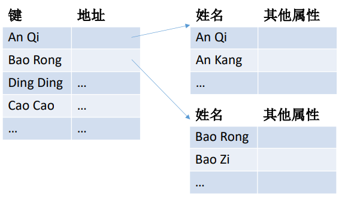</div>

多级顺序索引可以提高检索效率

<div align="left">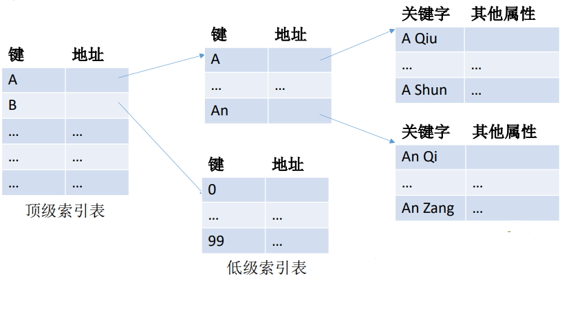</div>

索引顺序文件提高了查找效率，但是索引表也占用了存储空间

## 文件目录

目录本身就是一种有结构的文件，由一条条记录组成。每条记录对应一个在放在该目录下的文件

### 文件控制块（FCB）

目录文件中的一条记录就是一个文件控制块（FCB）  
FCB 的有序集合称为“文件目录”，一个 FCB 就是一个文件目录项  
FCB 实现了文件名和文件之间的映射。使用户程序可以实现“按名存取”

<div align="left">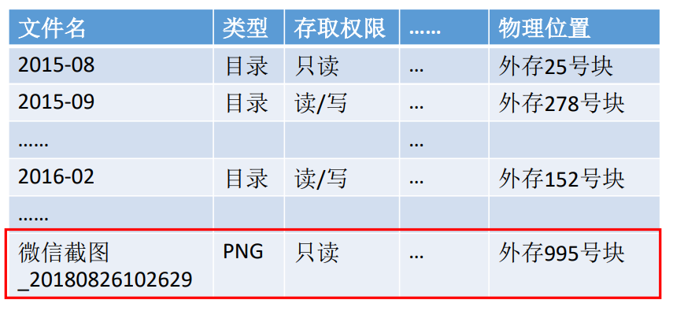</div>

FCB 包含信息：

- 基本信息：文件名，文件的物理位置，逻辑结构、物理结构等
- 存取控制信息：文件存取权限，禁止访问的用户名单等
- 使用信息：文件建立时间、修改时间

### 索引结点

索引结点是 FCB 的改进，除文件名之外的所有信息都被放到索引结点中，每个文件对应一个索引结点

<div align="left">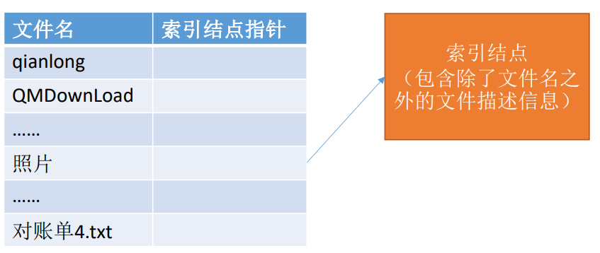</div>

检索目录文件时，只是查找其目录项，找到文件名对应目录项时，才将索引节点调入内存，索引节点中记录了文件的各种信息，包括文件在外存中的存放位置，根据“存放位置”即可找到文件

存放在外存中的索引结点称为“磁盘索引结点”，当索引结点放入内存后称为“内存索引结点”

- 磁盘索引节点
  - 文件主标识符：拥有该文件的个人或小组的标识符
  - 文件类型：普通文件、目录文件、特别文件
  - 文件存取权限：各类用户对该文件的存取权限
  - 文件物理地址：每个索引节点种含有 13 个地址项，直接或间接地方式给出数据文件所在盘块的编号
  - 文件长度：字节为单位
  - 文件链接计数：本文件系统中所有指向该文件名的指针计数
  - 文件存取时间：文件最近被进程存取，修改以及索引节点最近被修改的时间
- 文件打开后内存索引节点增加的内容
  - 索引节点编号：用于标识内存索引节点
  - 状态：指示 i 节点是否被上锁或被修改
  - 访问计数：每当有一个进程要访问此 i 节点时，计数+1，访问结束-1
  - 逻辑设备号：文件所属文件系统的逻辑设备号
  - 链接指针：设置分别指向空闲链表和散列队列的指针

优点：目录项只包含文件名、索引结点指针，因此每个目录项的长度大幅减小。由于目录项长度减小，因此每个磁盘块可以存放更多个目录项，因此检索文件时磁盘 I/O 的次数就减少了很多

### 目录操作

- 搜索：用户使用给一个文件时，需要搜索目录，找到该文件对应的目录项
- 创建文件：创建一个新文件时，需要在目录中增加一个目录项
- 删除文件：删除一个文件时，需要在目录中删除相应的目录项
- 显示目录：用户可以请求显示目录的内容，显示该用户目录中的所有文件以及属性
- 修改目录：某些文件属性保存在目录中，因而这些属性的变化需要改变相应的目录项

### 目录结构

目录结构分为单级目录结构、两级目录结构、多级目录结构、无环图目录结构

#### 单级目录结构

早期操作系统并不支持多级目录，整个文件系统中只建立一张目录表，每个文件占一个目录项

优点：实现了按名存取  
缺点：查找速度慢，不允许重名，不便于文件共享，不适用于多用户的操作系统

<div align="left">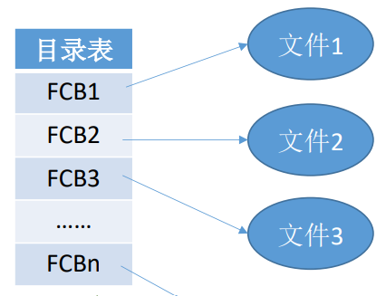</div>

#### 两级目录结构

将文件分为主文件目录（MFD，Master File Directory）和用户文件目录（UFD，User File Directory），主文件目录记录用户名及相应用户文件目录所在的存储位置，用户文件目录记录该用户文件的 FCB 信息

优点：解决了不同用户文件重名问题，在一定程度上保证了文件的安全（实现访问限制：检查此时登录的用户是否匹配）  
缺点：缺乏灵活性，不能对文件分类

<div align="left">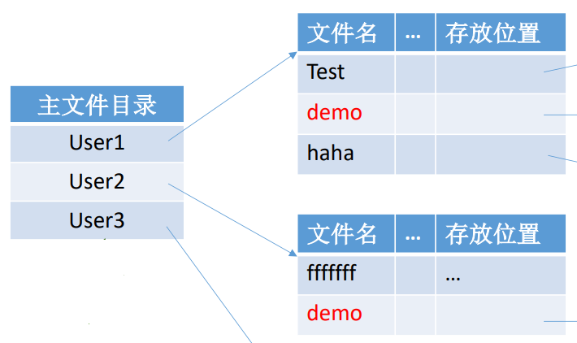</div>

#### 多级目录结构

将两级目录结构的层次关系加以推广，就形成了多级目录结构，即树形目录结构

用户要访问某个文件时要用文件路径名标识文件，文件路径名是个字符串。各级目录之间用“/”隔开  
从根目录出发的路径称为绝对路径  
每次都从根目录开始查找，是很低效的。因此可以设置一个“当前目录”。例如，此时已经打开了“照片”的文件目录，也就是说，这张目录表已调入内存，那么可以把它设置为“当前目录”。当用户要访问某个文件时，可以使用从当前目录出发的“相对路径”

优点：有效的对文件进行分类，文件结构层次清晰，能够有效的进行文件管理和保护
缺点：按照路径名访问中间节点，增加了磁盘访问次数，降低了查询速度，不便于实现文件共享

<div align="left">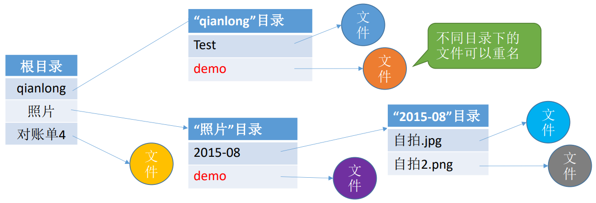</div>

#### 无环图目录结构

在树形目录结构基础上增加了一些指向同一节点的有向边，使整个目录成为一个有向无环图  
更方便地实现多个用户间的文件共享

<div align="left">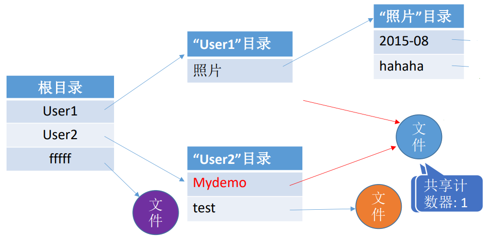</div>

可以用不同的文件名指向同一个文件，甚至可以指向同一个目录（共享同一目录下的所有内容）  
需要为每个共享结点设置一个共享计数器，用于记录此时有多少个地方在共享该结点。用户提出删除结点的请求时，只是删除该用户的 FCB、并使共享计数器减 1，并不会直接删除共享结点。只有共享计数器为 0 时，才删除结点

_注：共享文件不是复制文件，共享文件修改时，所有用户都能看到文件数据的变化_

## 文件的物理结构（文件分配方式）

文件分配方式解决文件数据应该怎样存放在外存中问题，分为连续分配、链接分配、索引分配

类似内存分页，磁盘中的存储单元也会被分为一个个“块/磁盘/物理块”  
内存与磁盘之间的数据交换都是以“块”为单位进行的，即每次读入一块或写出一块  
操作系统为文件分配存储空间都是以块为单位的，用户通过逻辑地址来操作自己的文件，操作系统要负责实现从逻辑地址到物理地址的映射  
文件的逻辑地址可以表示为逻辑块号+块内地址的形式

### 连续分配

每个文件在磁盘上占有一组连续的块，磁盘地址定义了磁盘上的一个线性排序

<div align="left">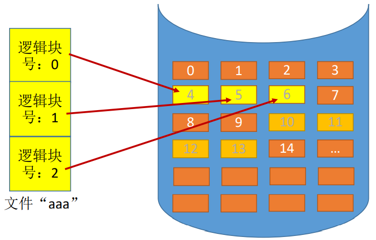</div>

会在文件目录中记录存放的起始块号和长度（总共占几个块）

物理块号 = 起始块号 + 逻辑块号

优点：支持顺序访问和直接访问，访问磁盘需要的寻道数和寻道时间最小（读写磁盘块时，需要移动磁头。访问的两个磁盘块相隔越远，移动磁头所需时间越长）  
缺点：文件长度不宜动态的增加，会产生外部碎片。例如：上图 456 需要扩展一个块，但 7 已经被使用，那么只能重新找其他空间将文件全部迁移

### 链接分配

采用离散分配方式，可以为文件分配离散的磁盘块，提高了磁盘空间利用率，消除了外部碎片

- 隐式链接  
  磁盘块分布在磁盘的任何地方，除最后一个盘块，其他盘块都有指向下一个盘块的指针  
  文件目录中记录存放的起始块号和结束块号

  访问逻辑块号 i 时，总共需要 i+1 次磁盘 I/O

  优点：方便文件扩展，所有空闲磁盘块都可以被利用，不会有碎片问题，外存利用率高  
  缺点：只支持顺序访问，不支持随机访问，查找效率低；指向下一个磁盘块的指针也需要耗费少量存储空间

- 显式链接  
  把用于链接文件各物理块的指针显式地存放在一张表中，即文件分配表（FAT，File Allocation Table）  
  一个磁盘仅设置一张 FAT，开机时，将 FAT 读入内存，并常驻内存。FAT 的各个表项长度相同，因此“物理块号”字段可以是隐含的  
  文件目录中只需记录文件的起始块号
  <div align="left">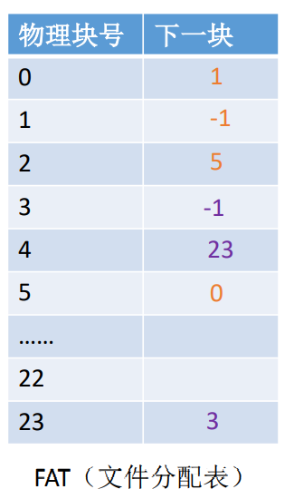</div>
  若要访问逻辑块号i，从目录项找到起始块号，若i>0，则查询内存中的FAT，找到i号逻辑块对应的物理块号。逻辑块号转换成物理块号的过程不需要读磁盘操作

  优点：很方便文件扩展，不会有碎片问题，外存利用率高，并且支持随机访问。相比隐式链接，地址转换时不需要访问磁盘空间，因此文件的访问效率更高  
  缺点：文件分配表的需要占用一定的存储空间

### 索引分配

索引分配允许文件离散地分配在各个磁盘块中，系统会为每个文件建立一张索引表，索引表中记录了文件的各个逻辑块对应的物理块（类似内存管理的页表）  
索引表存放的磁盘块称为索引库，文件数据存放的磁盘块称为数据块

<div align="left">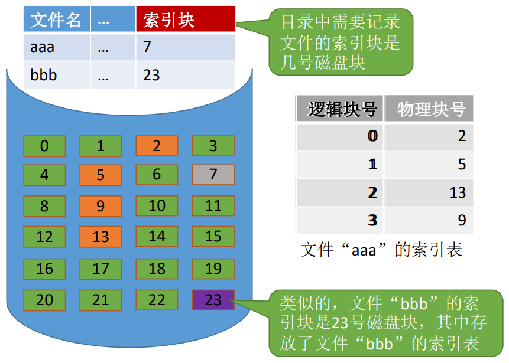</div>

可以用固定的长度表示物理块号（如：假设磁盘总容量为 1TB=$2^{40}$B，磁盘块大小为 1KB，则共有$2^{30}$个磁盘块，则可以用 4B 表示磁盘块好），因此，索引表中的“逻辑块号”可以是隐含的

若要访问逻辑块号 i，从目录项可知索引表的存放位置，将索引表从外存读入内存，并查找索引表即可只 i 号逻辑块在外存中的存放位置

优点：支持随机访问，文件扩展也很容易实现  
缺点：索引表需要占用一定的存储空间

若每个磁盘块 1KB，一个索引表项 4B，则一个磁盘块只能存放 256 个索引项。如果一个文件的大小超过了 256 块，那么一个磁盘块是装不下文件的整张索引表的，如何解决这个问题？

- 链接方案：一个索引库通常为一个磁盘块，为了处理大文件，可以将多个索引块链接起来
- 多层索引：建立多层索引（类似多级页表）。使第一层索引块指向第二层索引块，第二层索引块指向文件块。可根据文件大小要求再建立第三层、第四层索引库
- 混合索引：多种索引分配方式的结合。例如，一个文件的顶级索引中，既包含直接地址索引（直接指向数据块），也包含一级间接索引（指向单层索引表）、还包含两级间接索引（指向两层索引表）
  <div align="left">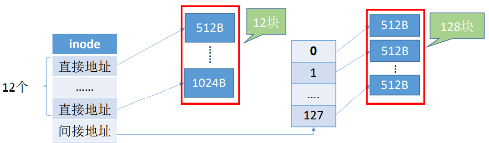</div>

## 文件的基本操作

### 创建文件（create 系统调用）

文件系统为文件找到空间；目录中为文件创建条目，该条目记录文件名称，在文件系统中的位置以及其他可能的信息  
create 需要提供的几个主要参数：所需的外存大小、文件的存放路径、文件名

### 删除文件（delete 系统调用）

搜索目录，找到文件的目录下，使其变为空项，然后回收目标文件占用的存储空间  
delete 需要提供的几个主要参数：文件存放路径、文件名

### 打开文件（open 系统调用）

操作系统处理 open 系统调用时，主要做了几件事：

1. 根据文件存放的路径找到相应的目录文件，从目录中找到文件名对应的目录项，并检查该用户是否有指定的操作权限
2. 将目录复制到内存中的“打开文件表”中，并将对应表目的编号返回给用户。之后用户使用打开文件表的编号来指明要操作的文件。用户对该文件再操作时，就不需要每次都重新查目录了

open 需要提供的几个主要参数：文件存放的路径、文件名、要对文件的操作类型（如：r 只读；rw 读写等）

<div align="left">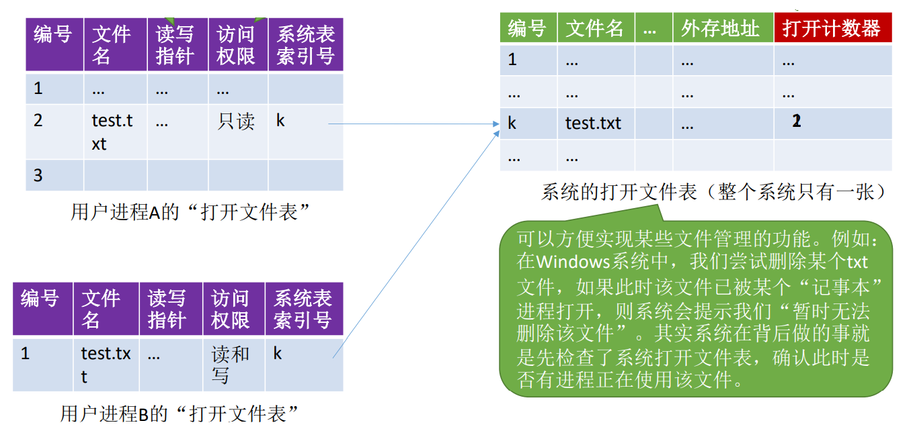</div>

读写指针：记录了该进程对文件的读/写操作进行到的位置  
打开计数器：记录此时有多少个进程打开此文件

### 关闭文件（close 系统调用）

操作系统处理 close 系统调用时，主要做了几件事：

1. 将进程的打开文件表相应表项删除
2. 回收分配给该文件的内存空间资源等
3. 系统打开文件表的计数器 count 减 1，若 count=0，则删除对应表项

### 读文件（read 系统调用）

使用 read 系统调用时，需要指明文件（在支持“打开文件”操作的系统中，只需要提供文件在打开文件表中的索引号即可），还要指明要读入的数据大小以及读入的数据要放在内存的什么位置  
处理 read 系统调用时，会从读指针指向的外存中，将用户指定大小的数据读入用户指定的内存区域中

### 写文件（write 系统调用）

使用 write 系统调用时，需要指明文件（在支持“打开文件”操作的系统中，只需要提供文件在打开文件表中的索引号即可），还要指明要写出的数据大小以及写回外存的数据放在内存的什么位置  
处理 write 系统调用时，会从用户指定的内存区域，将指定大小的数据写回写指针指向的外存，并更新写指针

## 文件的存储管理

文件的存储管理要解决的是对空闲磁盘块的组织和管理，包括空闲块的组织、分配和回收等问题

安装 Windows 操作系统时，一个必经步骤是--为磁盘划区  
存储空间的划分：将物理磁盘划分为一个个文件卷（逻辑卷，逻辑盘）  
一个文件卷分为目录区和文件区。目录区主要存放文件目录信息（FCB）、用于磁盘存储空间管理的信息；文件区用于存放文件数据

文件存储管理的方法有：空闲表法、空闲链表法、位示图法、成组链表法

### 空闲表法

系统为空闲区建立一张空闲块表，每个空闲区第一个盘块号，该区的空闲盘块数等信息

<div align="left">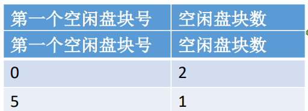</div>

如何分配：与内存管理中的动态分区类似，为一个文件分配连续的存储空间。同样可以采用首次适应、最佳适应、最坏适应等算法来决定要为文件分配哪个区间

如何回收：与内存管理中的动态分区类似，当回收某个存储区时同样有四种情况：

1. 回收区前后都没有相邻空闲区
2. 回收区的前后都是空闲区
3. 回收区前面是空闲区
4. 回收区后面是空闲区

### 空闲链表法

将所有空闲盘区拉成一条空闲链，根据构成链的所有基本元素不同，可以把链表分成两种形式

- 空闲盘块链：将磁盘上所有空闲空间以盘块为单位拉成一条链
- 空闲盘区链：将磁盘上所有空闲盘区拉成一条链

<div align="left">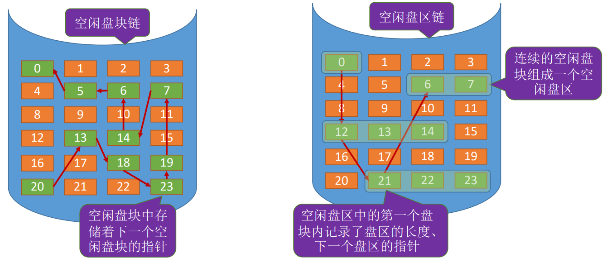</div>

操作系统保存着链头、链尾指针

| 形式       | 分配方法                                                                                                                                                                                                            | 回收方法                                                                                                                   | 适用场景                                                           |
| ---------- | ------------------------------------------------------------------------------------------------------------------------------------------------------------------------------------------------------------------- | -------------------------------------------------------------------------------------------------------------------------- | ------------------------------------------------------------------ |
| 空闲盘块链 | 若某文件申请 K 个盘块，则从链头开始依次摘下 K 个盘块分配，并修改空闲链的链头指针                                                                                                                                    | 回收的盘块依次挂到链尾，并修改空闲链的链尾指针                                                                             | 适用于离散分配的物理结构，为文件分配多个盘块时可能需要重复多次操作 |
| 空闲盘区链 | 若某文件申请 K 个盘块，按照算法规则（首次适应等），从链头开始检索，找到一个大小符合要求空闲盘区，分配给文件。若没有合适的连续块，也可以将不同盘区的盘块分配给一个文件，注意分配后要修改相应的链指针、盘区大小等数据 | 若回收某个空闲区相邻，则需要将回收区合并到空闲盘区中。若回收区没有和任何空闲区相邻，将回收区作为单独的一个空闲盘区挂到链尾 | 离散分配、连续分配都适用。为一个文件分配多个盘块时效率更高         |

### 位示图法

采用二进制的一位来标识一个盘块的使用情况，磁盘上所有的盘块都有一个二进制位与之对应

<div align="left">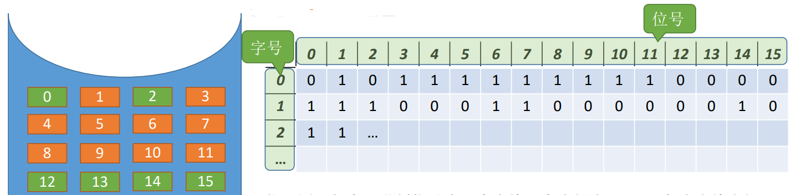</div>

图中，字长是 16 位，字中的每一个位对应一个盘块。可以用（字号、位号）来对应一个盘块，或（行号、列号），如 (0, 0) 为 0 对应磁盘第一行第一列的标识为 0，盘块未使用（假设 0 表示未使用）  
（字号、位号）=（i, j）的二进制位对应的盘块号 b = ni + j

如何分配：若文件需要 K 个块

1. 顺序扫描位示图，找到 K 个相邻或不相邻的 0
2. 根据字号、位号算出对应的盘块号，将相应的盘块分配给文件
3. 将相应位设置为 1

如何回收：

1. 根据回收的盘块号计算出对应的字号、位号 i = (b-1) DIV (n+1)，j = (b-1) MOD (n+1)
2. 将相应二进制位设为 0

### 成组链表法

空闲表法、空闲链表法不适用于大型文件系统，因为空闲表或空闲链表可能过大。UNIX 系统中采用了成组链表法对磁盘空闲块进行管理  
文件卷中目录区中专门用一个磁盘块作为“超级块”，当系统启动时需要将超级块读入内存。并且要保证内存与外存中的“超级块”数据一致

<div align="left">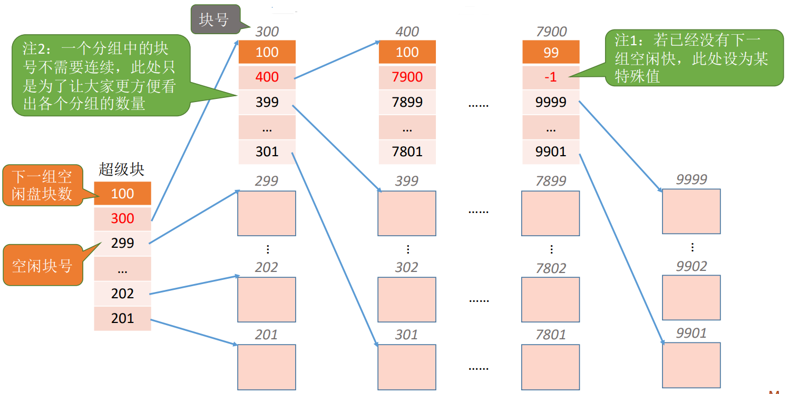</div>

如何分配：假设需要 1 个空闲块。检查第一个分组的块数是否足够，1<100 是足够的；分配第一个分组中的 100 个空闲块，但是由于 300 号块内存放了再下一组的信息，因此 300 号块的数据需要复制到超级块中

如何回收：假设每个分组最多为 100 个空闲块，此时第一个分组已经有 100 个块，还要再回收一块。需要将超级块中的数据复制到新回收的块中，并修改超级块的内容，让新回收的块成为第一个分组

## 文件的共享与保护

### 文件共享

- 基于索引节点的共享方式（硬链接）
  - 文件目录中只设置文件名及相应索引节点的指针，在索引节点中还有一个链接计数 count，用与表示链接到本索引节点（即文件）上的目录项的数目
  - 硬链接是多个指针指向一个索引节点，保证只要还有一个指针指向索引节点，索引节点就不能删除
  - 优点：硬链接的查找速度比软链接快
- 基于符号链的共享方式（软链接）
  - B 用户共享 A 用户的文件 F 时，系统创建一个 LINK 类型的新文件，也取名 F，然后将文件 F 写入用户 B 的目录中，但是新文件中知识含有链接文件 F 的路径名
  - 软链接就是把到达共享文件的路径记录下来，当要访问文件时，根据路径寻找文件，即使软连接指向的共享文件已被删除，LINK 型文件依然存在，只是通过 LINK 型文件中的路径去查找共享文件会失败
  - 优点：网络共享只需要提供该文件所在机器的网络地址及该机器中的文件路径
  - 缺点：由于是根据文件路径查找文件，因此会增加时间开销并且增加了启动磁盘的频率，同时符号链的索引节点也会耗费一定的硬盘空间

### 文件保护

为了防止文件共享给导致被破坏或者未经允许修改文件，文件系统必须控制用户对文件的存取，解决对文件的读、写、执行的许可问题

文件保护的实现方式：口令保护，加密保护，访问控制  
口令和密码都是防止文件被他人存取和窃取，没有控制用户对文件的访问类型

#### 口令保护

为文件设置一个“口令”，用户请求访问该文件时必须提供“口令”  
口令一般存放在文件对应的 FCB 或索引结点中，用户访问文件时会进行对比。

优点：保存口令的空间开销不多，验证口令的时间开销也很小  
缺点：正确的口令存放在系统内部，不够安全

#### 加密保护

使用某个“密码”对文件进行加密，在访问文件时需要提供正确的“密码”才能对文件进行正确的解密

优点：保密性强，不需要在系统中存储“密码”  
缺点：编码/译码，或者说加密/解密要花费一定时间

#### 访问控制

在每个文件的 FCB（或索引结点）中增加一个访问控制列表（Access-Control List，ACL），该表中记录了各个用户可以对该文件执行哪些操作

访问类型有：读、写、执行、删除、添加（将新信息添加到文件结尾部分）、列表清单（列出文件名和属性）  
根据用户身份进行控制，为每个文件和目录增加一个访问控制列表，规定每个用户名及其所允许的访问类型

<div align="left">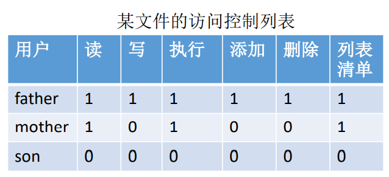</div>

有的计算机可能会有很多个用户，因此访问控制列表可能会很大，可以用精简访问列表解决  
精简访问列表：以“组”为单位，标记各“组”用户可以对文件执行哪些操作。如可分为系统管理员、文件主（创建文件的用户）、文件主的伙伴、其他用户几个分组  
当用户要访问文件时，系统会检查该用户所属的分组是否有相应的访问权限

<div align="left">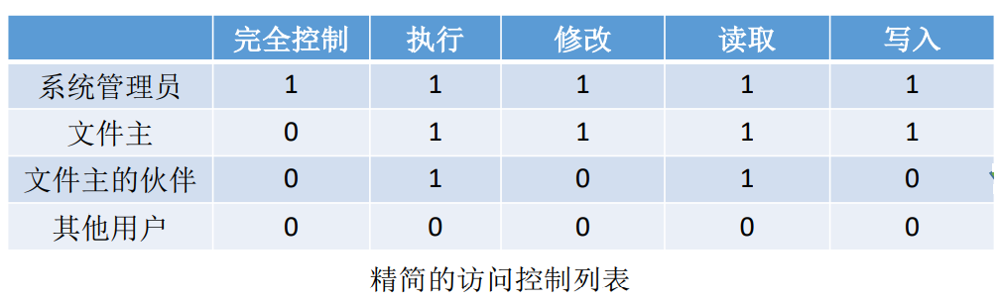</div>

若要让某个用户能够读取文件，只需要把该用户放入“文件主的伙伴”这个分组即可

优点：可以使用复杂的访问方法  
缺点：长度无法预计且可能导致复杂空间管理

## 文件系统的层次结构

<div align="left">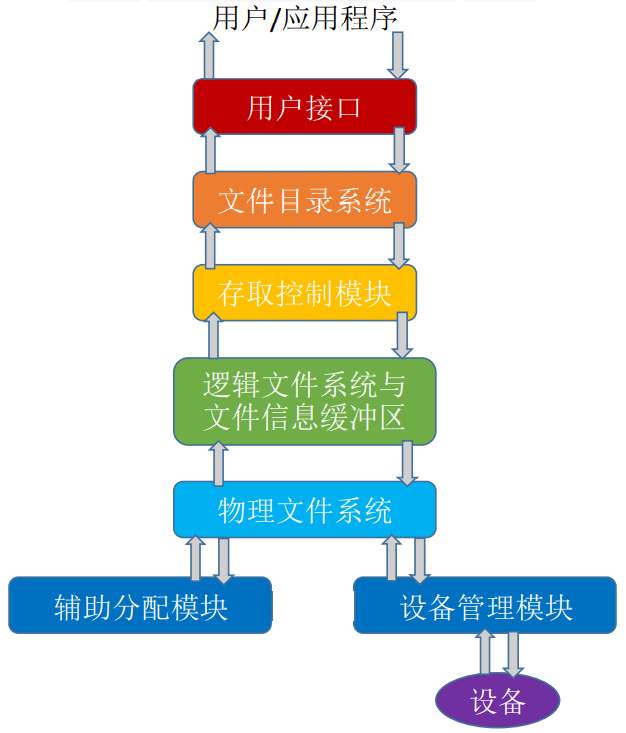</div>

- 用户调用接口：文件系统为用户提供与文件及目录有关的系统调用。如 Read、Write 等
- 文件目录系统：用户是通过文件路径来访问文件的，因此这一层需要根据用户给出的文件路径找到相应的 FCB 或索引结点。所有和目录、目录项相关的管理工作都在本层完成，如管理文件目录，管理活跃文件目录表，管理文件读写状态信息表，管理用户进程的打开文件表，管理与组织存储设备上的文件目录结构。调用下一级存取控制块
- 存取控制模块：实现文件保护，将用户的访问请求与 FCB 中指示的访问控制权限进行比较，以确认访问的合法性
- 逻辑文件系统与文件信息缓冲区：根据文件的逻辑结构将用户要读写的逻辑记录转换成文件逻辑结构内的相应块号（逻辑地址）
- 物理文件系统：把上一层提供的逻辑地址转换成实际的物理地址
- 辅助分配模块：负责文件存储空间的管理，即负责分配和回收辅存空间
- 设备管理程序模块：直接与硬件交互，负责和硬件直接相关的一些管理工作。如分配设备，分配设备读写缓冲区，磁盘调度，启动设备，释放设备读写缓冲区，释放设备

```txt
例如：假设某用户请求删除文件"D:/目录1/a.xlsx"的最后一百条记录

1. 用户需要通过操作系统提供的接口发出上述请求 -- 用户接口
2. 由于用户提供的是文件的存放路径，因此需要操作系统一层一层地查找目录，找到对应地目录项 -- 文件目录系统
3. 不同的用户对文件有不同的操作权限，因此为了保证安全，需要检查用户是否有访问权限 -- 存取控制模块
4. 验证了访问权限后，需要把用户提供的“记录号”转变为对应的逻辑地址 -- 逻辑文件系统与文件信息缓冲区
5. 知道了目标记录对应的逻辑后，还需转换成实际物理地址 -- 物理文件系统
6. 要删除这条记录，必定要对磁盘设备发出请求 -- 设备管理程序模块
7. 删除这些记录后，会有一些盘块空闲，因此要将这些空闲块回收 -- 辅助分配模块
```

## 磁盘组织与管理

### 磁盘的结构

<div align="left">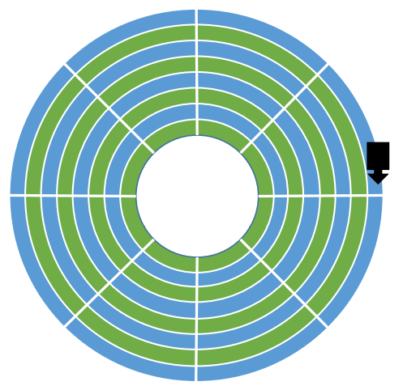</div>

- 磁盘：表面上涂有磁性物质的金属或塑料构成的圆形盘片，可以用这些磁性物质来记录二进制数据，通过一个称为磁头的导体线圈从磁盘读取数据
- 磁道：磁盘盘面上的数据存储在一组同心圆中，称为磁道
- 扇区：一个盘面上有上千个磁道，磁道又划分为几百个扇区，每个扇区固定存储大小，一个扇区就算一个“磁盘块”。最内侧的磁道上的扇区面积最小，因此数据密度最大

<div align="left">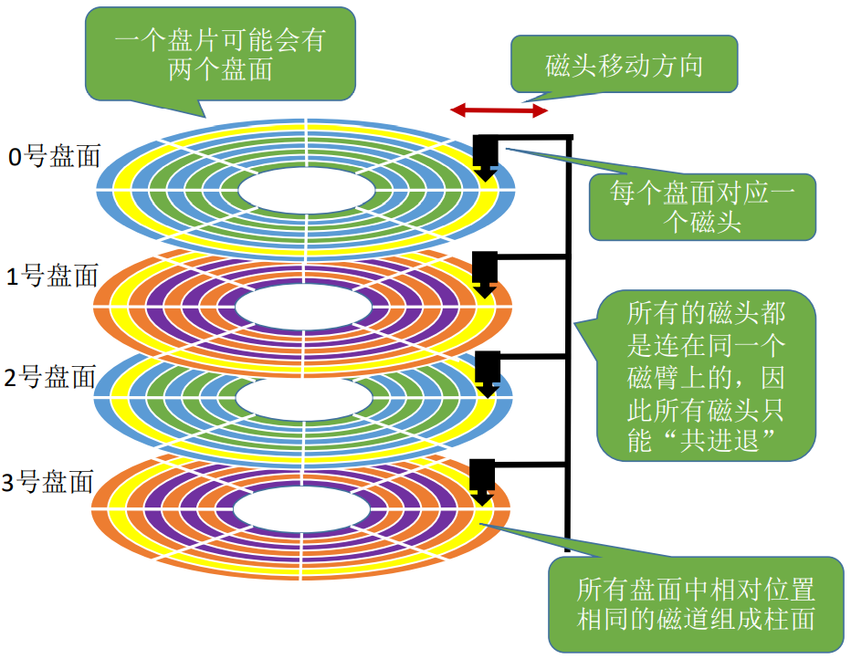</div>

磁盘地址用柱面号 + 盘面号 + 扇区号来表示，文件物理结构中提到的块号就能转换成这样的地址形式  
根据地址读取一个块：

1. 根据柱面号移动磁臂，让磁头指向指定柱面
2. 激活指定盘面对应的磁头
3. 磁盘旋转过程中，指定的扇区会从磁头下面划过，这样就完成了对指定扇区的读写

为什么磁盘的物理地址是（柱面号、盘面号、扇区号）而不是（盘面号、柱面号、扇区号）？  
因为读取地址连续的磁盘时，采用（柱面号、盘面号、扇区号）的地址结构可以减少磁头移动消耗的时间

磁盘分类：

- 固定头磁盘：磁盘每个磁道有一个磁头
- 活动头磁盘：磁臂可以来回伸缩来带动磁头定位磁道
- 固定盘磁盘：盘片不可更换
- 可换盘磁盘：盘片可以更换

### 磁盘调度算法

一次磁盘读写操作的时间组成：

- 寻道时间 Ts：活动头磁盘在读写信息前，将磁头移动到指定磁道所需要的时间  
  启动磁头臂需要时间 s  
  移动磁头也需要时间，假设磁头匀速移动，每跨越一个磁道耗时为 m，总共需要跨越 n 条磁道  
  则 Ts = s + m\*n
- 延迟时间 Tr：磁头定位到某一磁道扇区所需要的时间  
  设磁盘转速为 r（转/秒或转/分），则平均延迟时间 Tr = (1/2) \* (1/r) = 1/2r
- 传输时间 Tt：从磁盘读出或向磁盘写入数据经过时间  
  设磁盘转速为 r，此次读写的字节数为 b，每个磁道上的字节数为 N，则 Tt = (1/r) \* (b/N) = b/(rN)

总的存取时间 T = Ts + 1/2r + b/(rN)

| 磁盘调度算法                 | 原理                                                                                                                                                                  | 优缺点                                                                                                                                                                                         |
| ---------------------------- | --------------------------------------------------------------------------------------------------------------------------------------------------------------------- | ---------------------------------------------------------------------------------------------------------------------------------------------------------------------------------------------- |
| 先来先服务 FCFS              | 按照进程请求访问磁盘的先后顺序进行调度                                                                                                                                | 优点：公平、实现简单<br> <br>缺点：如果大量进程竞争使用磁盘，请求访问的磁道很分散，会导致性能差，寻道时间长                                                                                    |
| 最短寻找时间优先算法（SSTF） | 选择调度处理的磁道是与当前磁头所在磁道距离最近的磁道<br>可以保证每次的寻道时间最短，但是不能保证总的寻道时间最短                                                      | 优点：性能强于先来先服务算法，平均寻道时间短<br><br> 缺点：由于磁头可能在一个小区域内来回地移动，因此容易产生饥饿现象                                                                          |
| 扫描（SCAN）算法             | 在磁头当前移动方向上选择与当前磁头所在的磁道距离最近的请求作为下一次服务对象，即只有磁头移动到最外侧磁道的时候才能往内移动，移动到最内侧磁道的时候才能往外移动        | 优点：寻道性能好，可以避免饥饿现象 <br><br> 缺点：对最近扫描过的区域不公平，访问局部性方面不如 FCFS 和 SSTF 好                                                                                 |
| LOOK 算法                    | SCAN 算法中，只有到达最边上的磁道时才能改变磁头的方向，LOOK 算法 在 SCAN 算法的基础上规定了查看磁头移动方向上是否有请求，如果没有磁头就不会向前移动，而是直接改变方向 | 优点：比起 SCAN 算法来，不需要每次都移动到最外侧或最内侧才改变磁头放心，使寻道时间进一步缩短                                                                                                   |
| 循环扫描算法（C-SCAN）       | SCAN 算法对各个位置磁道的响应频率不平均，C-SCAN 算法规定只有磁头朝某个特定方向移动时才处理磁道访问请求，而返回时直接快速移动至起始段而不处理任何请求                  | 优点：相对 SCAN 来说，对于各个位置磁道的响应频率很平均 <br><br> 缺点：只有到达最边上的磁道时才能改变磁头移动方向，并且磁头返回时不一定需要返回最边缘的磁道上。相对 SCAN 算法，平均寻道时间更长 |
| C-LOOK 算法                  | 在 C-SCAN 算法的基础上规定了如果磁头移动的方向上已经没有磁道访问请求了，就可以立即让磁头返回，并且磁头只需返回到有磁道访问请求的位置即可                              | 优点：比起 SCAN 算法，不需要每次都移动到最外侧或最内侧才改变磁头方向，寻道时间进一步缩短                                                                                                       |

#### 减少延迟时间的方法

##### 交替编号策略

<div align="left">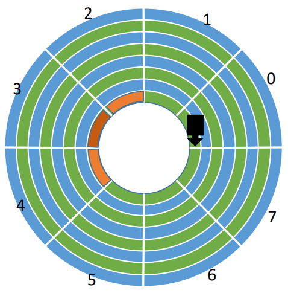</div>

假设要连续读取橙色区域的 2、3、4 扇区，磁头读取一块（一个扇区）的内容后，需要一小段时间处理，而盘片又在不停地旋转。因此如果 2、3 号扇区相邻着排列，则读完 2 号扇区后无法连续不断地读入 2 号扇区，必须等待盘片继续旋转，3 号扇区再次划过磁头时才能完成读入  
结论：磁头读入一个扇区数据后需要一小段时间处理，如果逻辑上相邻地扇区在物理上也相邻，则读入几个连续的逻辑扇区，可能需要很长的“延迟时间”

<div align="left">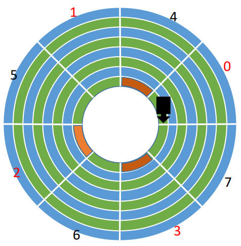</div>

对盘面采用“交替编号”策略，即让逻辑上相邻的扇区在物理上有一定间隔，可以使读取连续的逻辑扇区所需要的延迟时间更小

##### 错位命名策略

<div align="left">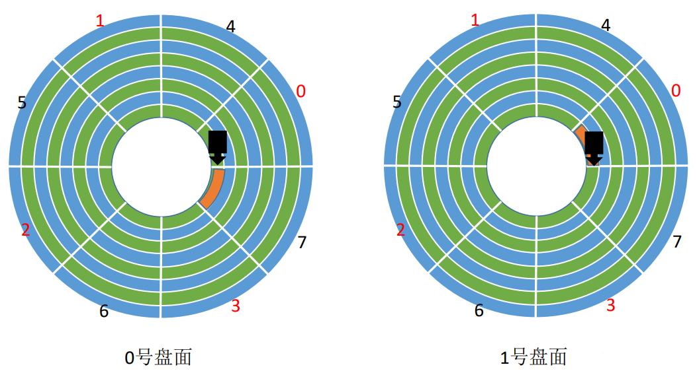</div>

若相邻的盘面相对位置处的扇区编号相同，读完磁盘块（000，00，111）之后，需要短暂的时间处理，而盘面又在不停地转动，因此当（000，01，000）第一次划过 1 号盘面的磁头下方时，并不能读取数据，只能再等该扇区再次划过磁头

<div align="left">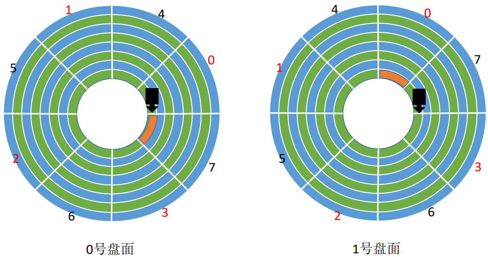</div>

采用错位命名策略，读取（000，00，111）之后，当（000，01，000）第一次划过 1 号盘面的磁头下方时，就可以直接读取数据，从而减少了延迟时间

### 磁盘的管理

- 磁盘初始化
  - Step1：进行低级格式化（物理格式化），将磁盘的各个磁道划分为扇区。一个扇区通常可分为头、数据区域、尾三个部分组成。管理扇区所需要的各种数据结构一般存放在头、尾两个部分，包括扇区校验码（如奇偶校验、CRC 循环冗余校验码等，校验码用于校验扇区中的数据是否发生错误）
  - Step2：将磁盘分区、每个分区由若干柱面组成（如 windows 的 C 盘、D 盘）
  - Step3：进行逻辑格式化，创建文件系统。包括创建文件系统的根目录，初始化存储空间管理所用的数据结构（如位示图、空闲分区表）
- 引导块
  - 计算机启动时运行初始化程序（自举程序），初始化 CPU 寄存器、设备控制器和内存等，然后启动操作系统
  - 自举程序通常保存在 ROM 中，在 ROM 中保留很小的自举块，完整的自举程序保存在磁盘的启动块（即引导块/启动分区上），启动块位于磁盘的固定位置
  - 拥有启动分区的磁盘称为启动磁盘或系统磁盘
  - 开机时计算机先运行“自举装入程序”，通过执行该程序就可找到引导块，并将完整的“自举程序”读入内存，完成初始化
- 坏块
  - 坏了、无法正常使用的扇区就算坏块。这属于硬件故障，操作系统是无法修复的，应该将坏块标记出来，以免错误地使用到它
  - 对于简单的磁盘，可以在逻辑格式化时对整个磁盘进行坏块检查，标明哪些扇区是坏扇区，比如：在 FAT 表上标明。这种方式中，坏块对操作系统不透明
  - 对于复杂的磁盘：控制器维护一个磁盘坏块链表。在磁盘出厂前进行低级格式化（物理格式化）时就将坏块链进行初始化。会保留一些“备用块”，用于替换坏块，这种方案称为扇区备用。这种方式中，坏块对操作系统透明
