# 输入输出管理（IO 管理）

**概览：**

**[:question: IO 设备的基本概念和分类](#io-设备的基本概念和分类)**  
**[:question: IO 控制](#io-控制)**  
**[:question: IO 软件层次结构](#io-软件层次结构)**  
**[:question: IO 核心子系统](#IO核心子系统)**

## IO 设备的基本概念和分类

I/O 设备就是可以将数据输入到计算机，或者可以接受计算机输出数据的设备，属于计算机中的硬件设备  
比如：鼠标、键盘就是典型的输入设备，显示器是典型的输出设备

### 分类

#### 按使用特性分类

- 人机交互的外部设备
  - 用于与计算机用户之间交互设备（打印机、鼠标、键盘）
  - 交换速度相对较慢，以字节为单位进行数据交换
- 存储设备
  - 用户存储程序和数据的设备（磁盘、磁带、光盘）
  - 交换速度较快，以多字节组成的块为基本单位
- 网络通信设备
  - 用于远程设备通信的设备（网络接口、调制解调器）
  - 速度介于前两类之间

#### 按传输速率分类

- 低速设备：传输速率每秒几个字节到数百字节（鼠标、键盘）
- 中速设备：传输速率为每秒数千字节至数万字节（行式打印机、激光打印机）
- 高速设备：传输速率在数百兆字节至千兆字节的一类设备（磁带机、磁盘机、光盘机）

#### 信息交换单位分类

- 块设备
  - 数据传输的基本单位是块（如磁盘）
  - 设备传输速率高，可寻址，即对它可随机地读写任一块
- 字符设备
  - 数据传输的基本单位是字符（如鼠标、键盘）
  - 传输慢，不可寻址，常采用中断驱动方式

## IO 控制

IO 设备由机械部件和电子部件（IO 控制器）组成

IO 设备的机械部件主要用来执行具体的 IO 操作，比如鼠标键盘的按钮；移动硬盘磁盘臂  
IO 设备的电子部件通常是一块插入主板的扩展槽的印刷电路板

### IO 控制器

CPU 无法直接控制 IO 设备的机械部件，因此 IO 设备还要有一个电子部件作为 CPU 和 IO 设备机械部件之间的中介，用于实现 CPU 对设备的控制  
这个电子部件就是 IO 控制器，又称设备控制器，CPU 可控制 IO 控制器，又由 IO 控制器来控制设备的机械部件

#### IO 控制器的功能

- 接受和识别 CPU 发出的命令  
  如 CPU 发来的 read/write 命令，IO 控制器中会有相应的控制寄存器来存放命令和参数
- 向 CPU 报告设备的状态  
  IO 控制器中会有相应的状态寄存器，用于记录 IO 设备的当前状态。如 1 表示空闲，0 表示忙碌
- 数据交换  
  IO 控制器中会设置相应的数据寄存器。输出时，数据寄存器用于暂存 CPU 发来的数据，之后再由控制器传送设备。输入时，数据寄存器用于暂存设备发来的数据，之后 CPU 从数据寄存器中取走数据
- 地址识别  
  类似于内存的地址，为了区分设备控制器中各个寄存器，也需要给各个寄存器设置一个特定的“地址”。IO 控制器通过 CPU 提供的“地址”来判断 CPU 要读写的是哪个寄存器

#### IO 控制器的组成

<div align="left">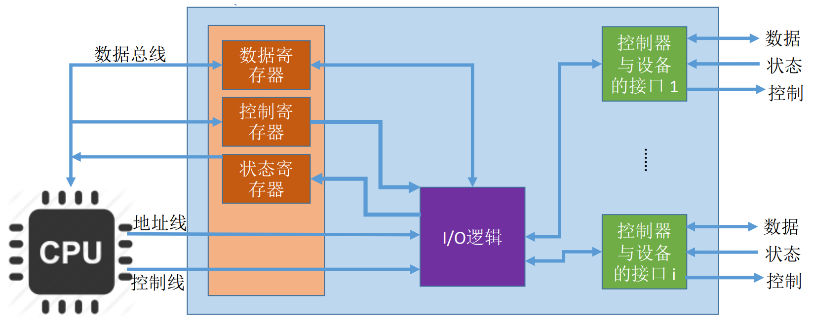</div>

CPU 控制器的接口：用于实现 CPU 与控制器之间的通信。CPU 通过控制线发出命令；通过地址线指明要操作的设备；通过数据线来实现数据交换  
IO 逻辑：负责接收和是识别 CPU 的割在命令（如地址译码），并负责对设备发出命令  
控制器与设备的接口：用于实现控制器与设备之间的通信。通过数据线传输数据；通过状态线反馈设备状态；通过控制器先向设备发出控制信息

一个 IO 控制器可能会对应多个设备  
数据寄存器、控制器寄存器、状态寄存器可能有多个（如：每个控制/状态寄存器对应一个具体的设备），且这些寄存器都要有相应的地址，才能方便 CPU 操作。寄存器编址方式有两种，一是占用内存地址的一部分，称为内存映像 IO；二是采用 IO 专用地址，即寄存器独立编址

<div align="left">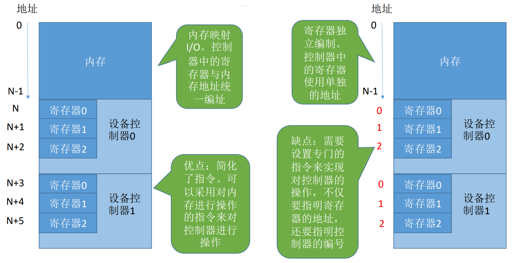</div>

### IO 控制方式

#### 程序直接控制方式

计算机从外部设备读取数据到存储器，每次读一个字的数据，对读入的每个字，CPU 都要对外设状态进行循环检查（检查设备的状态寄存器），直到确定该字已经在 IO 设备控制器的数据寄存器中

读写单位：一个字

优点：容易实现，操作简单  
缺点：CPU 和 IO 设备只能串行工作，CPU 需要一直轮询检查，长期处于“忙等”状态，CPU 利用率低

```txt
以读操作为例：
1. CPU向控制器发出读指令。于是设备启动，并且状态寄存器设为1（未就绪）
2. CPU轮询检查控制器状态（其实就是在不断的地执行程序地循环，若状态为一直是1，
   说明设备还没准备好要输入的数据，于是CPU会不断轮询）
3. 输入设备准备好数据后将数据传给控制器，并报告自身状态
4. 控制器将输入的数据放到数据寄存器中，并将状态改为0（已就绪）
5. CPU发现设备已就绪，即可将数据寄存器中的内容读入CPU的寄存器中，再把CPU寄存器中的内容放入内存
```

#### 中断驱动方式

引入中断机制  
由于 IO 设备速度很慢，因此在 CPU 发出读/写命令后，可将等待 IO 的进程阻塞，先切换到别的进程执行。当 IO 完成后，设备会向 CPU 发出一个中断信号，CPU 检测到中断信号后，会保存当前进程的运行环境信息，转去执行中断处理程序处理该中断。处理中断的过程中，CPU 从 IO 控制器读一个字的数据传送到 CPU 寄存器，再写入主存。接着，CPU 恢复等待 IO 的进程（或其他进程）的运行环境，然后继续执行

读写单位：一个字

优点：与程序直接控制方式相比，IO 控制器会通过中断信号主动报告 IO 已完成，CPU 不再需要不停地轮询。CPU 和 IO 设备可并行工作，CPU 利用来得到明显提升  
缺点：数据的传输必须要经过 CPU，仍然消耗 CPU 的时间，频繁地中断处理也会消耗较多的 CPU 时间

#### DMA 方式

DMA（Direct Memory Access，直接存取器存取）。主要用于块设备的 IO 控制  
与中断驱动方式方式相比，有以下几个改进：

1. 数据的传送单位是块，不再是一个字
2. 数据的流向是从设备直接放入内存，或者从内存直接到设备，不需要 CPU 做中介
3. 仅在传送一个或多个数据块的开始和结束时，才需要 CPU 干预

<div align="left">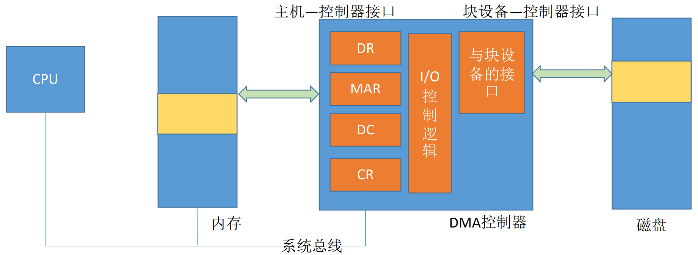</div>

- DR（数据寄存器）：暂存设备到内存，或从内存到设备的数据
- MAR（内存地址寄存器）：输入时，MAR 表示数据应该放到内存中的什么位置；输出时，MAR 表示要输出的数据放在内存中的什么位置
- DC（数据计数器）：表示剩余到读写的字节数
- CR（命令/状态寄存器）：用于存放 CPU 发来的 IO 命令和有关控制信息，或设备的状态信息

读写单位：一个或多个块。每次读写只能是连续的多个块，且这些块读入内存后在内存中也必须是连续的

优点：数据传输以“块”为单位，CPU 介入频率进一步降低。数据的传输不再需要先经过 CPU 再写入内存，数据传输效率进一步增加。CP 和 IO 的并行性得到提升  
缺点：CPU 每发出一条 IO 指令，只能读写一个或多个连续的数据块。如果要读写离散的数据块，CPU 要分别发出多条 IO 指令，进行多次中断处理才能完成

#### 通道控制方式

通道是一种硬件，可理解为“弱化版 CPU”。通道可以识别并执行一系列通道指令  
通道就是设置一个专门负责输入/输出的处理机（DMA 方式的发展），实现对一组数据块的读写以及相关控制和管理

<div align="left">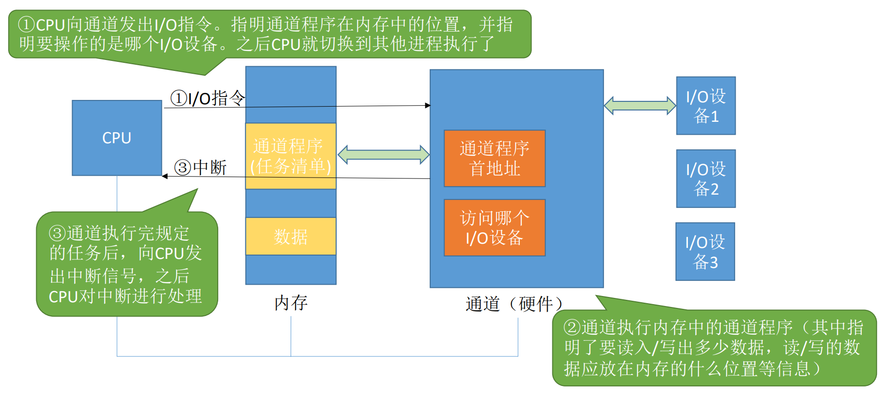</div>

与 CPU 相比，通道可以执行的指令很单一，并且通道程序是放在主机内存中的，也就是说通道与 CPU 共享内存  
通道会根据 CPU 的指示执行相应的通道程序，只有完成一组数据块的读写后才需要发出中断信号，请求 CPU 干预

读写单位：一组块

优点：CPU、通道、IO 设备可并行工作，资源利用率很高  
缺点：实现复杂，需要专门的通道硬件支持

DMA 与通道的区别：

- DMA 需要 CPU 来控制传输的数据块大小、传输的内存位置，而通道方式中这些信息是由通道控制的
- DMA 控制器对应一台设备与内存传递数据，通道可以控制多台设备与内存的数据交换

## IO 软件层次结构

<div align="left">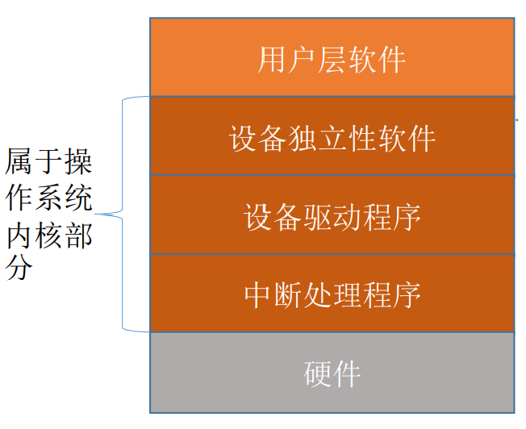</div>

- 用户层软件  
  实现与用户交互的接口，用户可以直接调用在用户层提供的、与 IO 操作有关的库函数，对设备进行操作，如`printf`  
  用户层软件将用户请求翻译成格式化的 IO 请求，并通过系统调用请求操作系统请求操作系统内核的服务。比如`printf("hello")`会被翻译成等价的`write`系统调用
- 设备独立性软件  
  又称设备无关性软件，与设备的硬件特性无关的功能几乎都在这一层实现

  主要实现的功能：

  - 向上层提供统一的系统调用接口（如 read/write 系统调用）
  - 设备的保护  
    原理类似于文件保护，设备被看作是一种特殊的文件，不同用户对各个文件的访问权限是不一样的
  - 差错处理  
    需要对一些设备的错误进行处理
  - 设备的分配与回收
  - 数据缓冲区管理  
    可以通过缓冲技术屏蔽设备之间数据交换单位大小和传输速度的差异
  - 建立逻辑设备名到物理设备名的映射关系；根据设备类型选择调用相应的驱动程序  
    用户层软件发出 IO 操作相关的系统调用时，需要指明此次要操作的 IO 设备的逻辑设备名。如打印时，选择打印机 1、打印机 2 就是逻辑设备名  
    设备独立性软件需要通过逻辑设备表（LUT，Logic Unit Table）来确定逻辑设备对应的物理设备，并找到该设备对应的驱动程序
    <div align="left">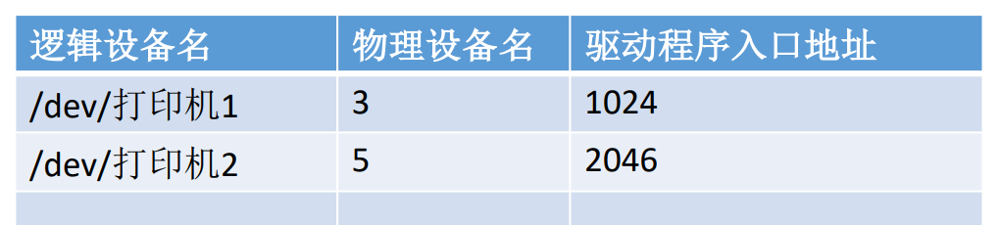</div>
    操作系统可以采用两种方式管理逻辑设备表：

    1. 整个系统只设置一张 LUT，意味着所有用户不能使用相同的逻辑设备名，因此这种方式只适用于单用户操作系统
    2. 为每个用户设置一张 LUT，各个用户使用的逻辑设备名可以重复，适用于多用户操作系统。系统会在用户登录时为其建立一个用户管理进程，而 LUT 就存放在用户管理进程的 PCB 中

- 设备驱动程序  
  负责对硬件设备的具体控制，将上层发出的一系列命令转为特定设备的一系列操作，包括设置设备寄存器；检查设备状态等  
  不同的 IO 设备有不同的硬件特性，因此厂家需要根据设备的硬件特性设计并提供相应的驱动程序
- 中断处理程序  
  当 IO 任务完成时，IO 控制器会发送一个中断信号，系统会根据中断信号类型找到对应的中断处理程序并执行  
  中断处理程序流程如下：从控制器读出设备状态，若 IO 正常结束，则从设备中读入一个字的数据并经由 CPU 放到内存缓冲区中，若 IO 不正常结束，则根据异常原因做相应处理
- 硬件设备：IO 设备通常包括一个机械部件和一个电子部件（见 IO 控制章节）

```txt
用户通过调用用户层软件提供的库函数发出的IO请求
1. 用户层软件通过“系统调用”请求设备独立性软件层的服务
2. 设备独立性软件层根据LUT调用设备对应的驱动程序
3. 驱动程序向IO控制器发出具体命令
4. 等待IO完成的进程应该被阻塞，因此需要进程切换，进程切换必然需要中断处理
```

## IO 核心子系统

IO 软件层次结构中，中间三层（设备独立性软件、设备驱动程序、中断处理程序）属于操作系统的内核部分，即 IO 系统活 IO 核心子系统

IO 核心子系统主要提供假脱机技术（SPOOLING 技术）、IO 调度，设备保护、设备分配与回收，缓冲区管理（缓冲与高速缓存）等功能

### IO 调度概念

- 通过 IO 调度改善系统整体性能，使得进程之间公平共享设备访问，减少 IO 完成所需要的平均等待时间
- 使用主存或磁盘上的存储空间的技术，如缓冲、高速缓存、假脱机等来改善计算机效率

### 假脱机技术（SPOOLING 技术）

手工操作阶段：主机直接从 IO 设备获取数据，由于设备速度慢，主机设备速度很快。人机速度矛盾明显，主机要浪费很多时间来等待设备  
批处理阶段引入了脱机输入/输出技术（用磁带完成）：引入脱机技术后，缓解了 CPU 与慢速 IO 设备的速度矛盾。另一方面，即使 CPU 在忙碌，也可以提前将数据输入到磁带；即使慢速的输出设备正在忙碌，也可以提前将数据输出到磁带

<div align="left">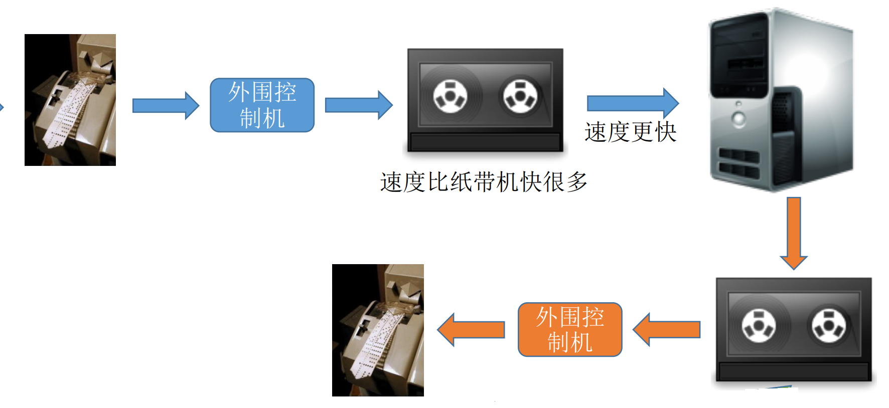</div>

脱机即脱离主机的控制进行的输入输出操作  
假脱机技术又称 SPOOLING 技术，是用软件的方式模拟脱机技术

SPOOLING 技术的目的：缓解 CPU 和 IO 的速度差异矛盾

#### SPOOLING 系统的组成

<div align="left">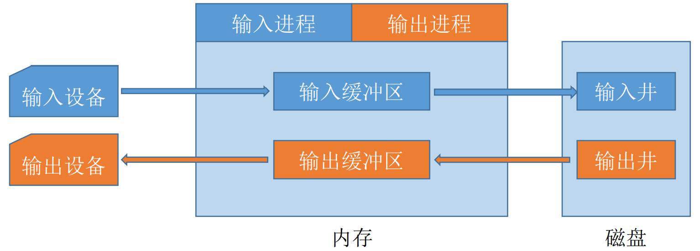</div>

在磁盘上开辟出两个存储区域：

- 输入井：模拟脱机输入时的磁带，用于收容 IO 设备输入的数据
- 输出井：模拟脱机输出时的磁带，用于收容用户进程输出的数据

要实现 SPOOLING 技术，必须要有多道程序技术的支持。系统会建立输入进程和输出进程：

- 输入进程：模拟脱机输入时的外围控制机，将用户要求的数据从输入机通过输入缓冲区送到输入井中，当 CPU 需要数据时，直接将输入井的数据送入内存
- 输出进程：模拟脱机输入时的外围控制机，把用户要求输出的数据先从内存送到输出井中，待输出设备空闲时，再将输出井中的数据经过输出缓冲区送到输出设备

- 输入缓冲区：暂存有输入设备送来的数据，之后再转存到输入井中
- 输出缓冲区：暂存从输出井送来的数据，之后再传送到输出设备上

#### 共享打印机

独占式设备：只允许各个进程串行使用的设备。一段时间内只能满足一个进程的请求  
共享设备：允许多个进程“同时”使用的设备（宏观上同时使用，微观上可能是交替使用）。可以满足多个进程的使用请求

打印机是种“独占式设备”，但是可以用 SPOOLING 技术改造成“共享设备”

当多个用户进程提出输出打印的请求时，系统会答应它们的请求，但是不是真正把打印机分配给它们，而是由假脱机管理进程为每个进程做两件事：

1. 在磁盘输出井中为进程申请一个空闲缓冲区（也就是说，这个缓冲区是在磁盘上的），并将要打印的数据送入其中
2. 为用户进程申请一张空白的打印请求表，并将用户的打印请求填入表中（其实就是用来说明用户的打印数据存放位置等信息的），再将该表挂到假脱机文件队列上  
   当打印机空闲时，输出进程会从文件队列的队头取一张打印机请求表，并根据表中的要求将要打印的数据从输出井传送到输出缓冲区中，再输出到打印机进行打印。用这种方式可以依次完成所有任务

虽然系统只有一台打印机，但每个进程提出打印请求时，系统都会在输出井中为其分配一个存储区（相当于分配了一个逻辑设备），使每个用户进程都觉得自己在独占一台打印机，从而实现对打印机的共享

SPOOLING 技术可以把一台物理设备虚拟成逻辑上的多台设备，可将独占式设备改造成共享设备

#### SPOOLING 技术小结

- 特点
  - 提高了 IO 速度
  - 独占设备变成共享设备
  - 实现了虚拟设备功能
- 通俗来说，如果设备被占用，就先把数据暂存，等到设备空闲再把这些数据输送到设备中

### 设备分配与回收

#### 设备类型分类

- 独占设备：设备只能互斥使用（打印机）
- 共享设备：可同时分配给多个进程使用（如磁盘），各个进程往往是宏观上同时共享使用设备，而微观上交替使用
- 虚拟设备：采用 SPOOLING 技术将独占设备改造成虚拟的共享设备，可同时分配给多个进程使用

#### 设备分配中的安全性

从进程运行的安全性上考虑，设备分配有两种方式：

- 安全分配方式  
  为进程分配一个设备后就将进程阻塞，本次 IO 完成后才将进程唤醒。一个时段内每个进程只能使用一个设备  
  优点：破坏了“请求和保持”条件，不会死锁  
  缺点：对于一个进程来说，CPU 和 IO 设备只能串行工作
- 不安全分配方式  
  进程发出 IO 请求后，系统为其分配 IO 设备，进程可继续执行，之后还可以发出新的 IO 请求。只有某个 IO 请求得不到满足时才将进程阻塞。一个进程可以使用多个设备  
  优点：进程的计算任务和 IO 任务可以并行处理，使进程迅速推进  
  缺点：有可能发生死锁

#### 设备分配管理中的数据结构

<div align="left">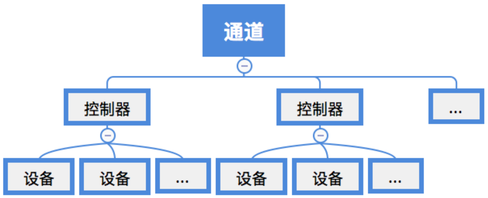</div>

- 设备控制表（DCT）：系统为每个设备配置一张 DCT，用于记录设备情况。其结构如下：
  - 设备类型：如打印机、键盘
  - 设备标识符：即物理设备名，系统中每个设备的物理设备名唯一
  - 设备状态：忙碌、空闲、故障等
  - 指向控制器表的指针：每个设备由一个控制器控制，该指针可找到相应控制器的信息
  - 重复执行次数或时间：当重复执行多次 IO 操作后仍不成功，才认为此次 IO 失败
  - 设备队列的队首指针：指向正在等待该设备的进程队列（由进程 PCB 组成队列）
- 控制器控制表（COCT）：每个设备控制器都会对应一张 COCT。操作系统根据 COCT 的信息对控制器进行操作和管理。其结构如下：
  - 控制器标识符：各个控制器的唯一 ID
  - 控制器状态：忙碌、空闲、故障等
  - 指向通道表的指针：每个控制器由一个通道组成，该指针可找到相应通道的信息
  - 控制器队列的队首指针
  - 控制器队列的队尾指针：队首队尾指针指向正在等待该控制器的进程队列（由进程 PCB 组成队列）
- 通道控制表（CHCT）：每个通道都会对应一张 CHCT。操作系统根据 CHCT 的信息对通道进程操作和管理。其结构如下：
  - 通道标识符：各个通道的唯一 ID
  - 通道状态
  - 与通道连接的控制器表首址：可通过该指针找到该通道管理的所有控制器相关信息（COCT）
  - 通道队列的队首指针
  - 通道队列的队尾指针：队首队尾指针指向正在等待该通道的进程队列（由 PCB 组成）
- 系统设备表（SDT）：记录已经连接到系统中所有物理设备的情况，每个设备对应一个表目
  <div align="left">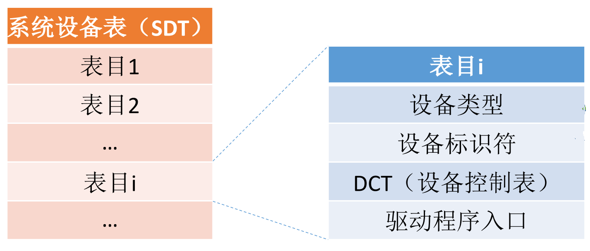</div>

#### 设备分配策略

- 分配原则：充分发挥设备效率，避免进程死锁
- 分配方式
  - 静态
    - 系统一次性的把设备分配给相应作业，直到作业结束
    - 优点：没有死锁问题
    - 缺点：降低了设备使用率
  - 动态
    - 进程指向过程中根据执行需要进行分配
    - 优点：提高了设备利用率
    - 缺点：分配算法不当可能导致死锁
- 设备分配算法
  - 先请求先分配
  - 优先级高者优先
- 独占设备一般使用静态分配，共享设备一般使用动态分配

#### 设备分配的步骤

1. 根据进程请求的物理设备名查找 SDT（物理设备名是进程请求分配时提供的参数）
2. 根据 STD 找到 DCT，若设备忙碌则将进程 PCB 挂到设备等待队列中，不忙碌则将设备分配给进程
3. 根据 DCT 找到 COCT，若控制器忙碌则将进程 PCB 挂到控制器等待队列中，不忙碌则将控制器分配给进程
4. 根据 COCT 找到 CHCT，若通道忙碌则将进程 PCB 挂到通道等待队列中，不忙碌则将通道分配给进程

只有设备、控制器、通道三者都分配成功时，这次设备分配才算成功，之后便可启动 IO 设备进行数据传送

缺点：用户编程时必须使用物理设备名，底层细节对用户不透明，不方便编程；若换了一个物理设备，则程序无法运行；若进程请求的物理设备正在忙碌，即使系统中还有同类型的设备，进程也必须等待  
改进方法：建立逻辑设备名与物理设备名的映射机制，用户编程时只需要提供逻辑设备名

1. 根据进程请求的逻辑设备名查找 SDT
2. 查找 SDT，找到用户指定类型的、且空闲的设备，将其分配给该进程。操作系统在逻辑设备表中新增一个表项，通过逻辑设备表即可知道用户进程实际要使用的是哪个物理设备
3. 根据 DCT 找到 COCT，若控制器忙碌则将进程 PCB 挂到控制器等待队列中，不忙碌则将控制器分配给进程
4. 根据 COCT 找到 CHCT，若通道忙碌则将进程 PCB 挂到通道等待队列中，不忙碌则将通道分配给进程

### 缓冲区管理

缓冲区是一个存储区域，可以由专门的硬件寄存器组成，也可利用内存作为缓冲区  
使用硬件作为缓存区的成本较高，容量也较小，一般仅使用在对速度要求非常高的场合（如存储器管理所用的联想寄存器，由于对页表访问的频率很高，因此使用速度很快的联想寄存器来存放页表项的副本）  
一般情况下，更多的是利用内存作为缓冲区

#### 缓冲区的作用

- 缓和 CPU 和 IO 之间的速度差异矛盾
- 减少 CPU 的中断频率，放宽对 CPU 中断响应时间的限制
- 解决基本数据单元大小不匹配的问题
- 提高 CPU 和 IO 设备之间的并行性

#### 缓冲区的分类

##### 单缓冲

设备和处理机之间设置缓冲区，设备和处理机交换数据时候，先把被交换的数据写入缓冲区，然后需要数据的设备或处理机从缓冲区中取走数据  
注：当缓冲区数据非空，不能往缓冲区冲入数据，只能从缓冲区把数据传出；当缓冲区为空时，可以往缓冲区冲入数据，但必须把缓冲区充满之后，才能从缓冲区把数据传出

##### 双缓冲

设置两个缓冲区，当缓冲区 1 满时，向缓冲区 2 中注入数据，只有缓冲区满才能取出数据  
提高了处理机和输入设备并行操作程度

使用单/双缓冲区在通信时的区别

<div align="left">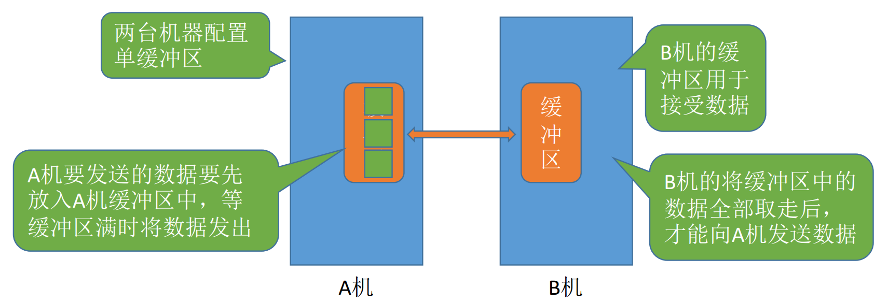</div>

若两个相互通信的机器只设置单缓冲区，任一时刻只能实现数据的单向传输

<div align="left">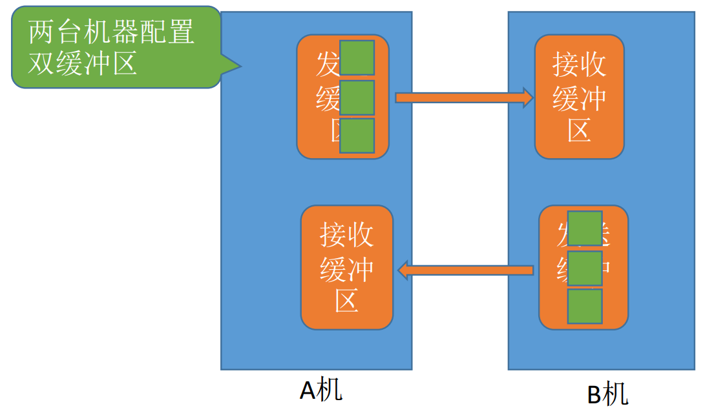</div>

若两个相互通信的机器设置双缓冲区，同一时刻可以实现双向的数据传输

_注：管道通信中的管道就是缓冲区，要实现数据双向传输，需要设置两个管道_

##### 循环缓冲区

将多个大小相等的缓冲区链接成一个循环队列  
in 指针，指向下一个可以冲入数据的空缓冲区  
out 指针，指向下一个可以取出数据的满缓冲区

##### 缓冲池

缓冲池由系统中公用的缓冲区组成  
缓冲区分为三个队列，空缓冲队列，装满输入数据的缓冲队列，装满输出数据的缓冲队列  
根据一个缓冲区在实际中的功能不同，设置了四种工作缓冲区：用于收容输入数据的工作缓冲区（hin）、用于提取输入数据的工作缓冲区（sin）、用于收容输出数据的工作缓冲区（hout）、用于提取输出数据的工作缓冲区（sout）

<div align="left">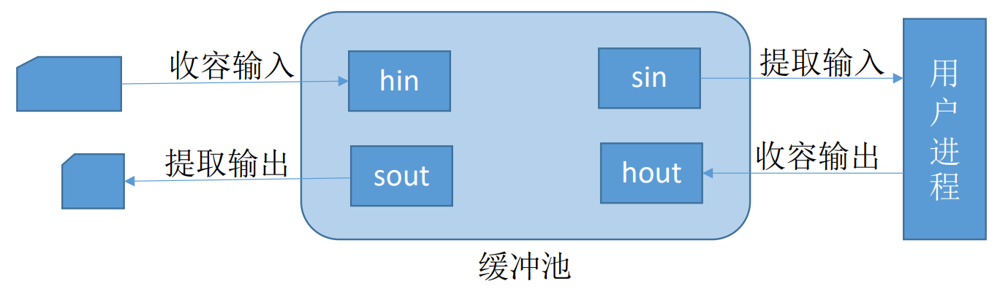</div>

- 输入进程请求输入数据  
  从空缓冲区队列中取一块作为收容输入数据的工作缓冲区。冲满数据后将缓冲区挂到输入队列队尾
- 计算进程想要取得一块输入数据  
  从输入队列中取得一块冲满输入数据的缓冲区作为提取输入数据的工作缓冲区。缓冲区读空后挂到空缓冲区队列
- 计算进程想要将准备好的数据冲入缓冲区  
  从空缓冲区队列中取一块作为收容输出数据的工作缓冲区。数据冲满后将缓冲区挂到输出队列队尾
- 输出进程请求输出数据  
  从输出队列中取得一块冲满输出数据的缓冲区作为提取输出数据的工作缓冲区。缓冲区读空后挂到空缓冲区队列

#### 磁盘高速缓存

- 使用磁盘高速缓存技术可以提高磁盘的 IO 速度，对高速缓存复制的访问要比原始数据访问更有效
- 磁盘高速缓存，逻辑上属于磁盘，物理上属于驻留内存中的盘块
- 在内存中的两种形式
  - 在内存中开辟一个单独的存储空间作为磁盘高速缓存，大小固定
  - 把未利用地内存空间作为一个缓冲池，供请求分页系统和磁盘 IO 时共享

#### 高速缓存与缓冲区对比

- 相同点：都介于高速设备和低速设备之间
- 不同
  - 存放数据
    - 高速缓存：存放的是低速设备上的某些数据的复制数据
    - 缓冲区：存放的是低速设备传给高速设备的数据，这些数据在低速设备中不一定有备份，这些数据再从缓冲区传送到高速设备
  - 目的
    - 高速缓存：高速缓存存放的是高速设备经常要访问的数据，如高速缓存中数据不在，高速设备就要访问低速设备
    - 高速设备和低速设备的通信都要经过缓冲区，高速设备永远不会去直接访问低速设备
