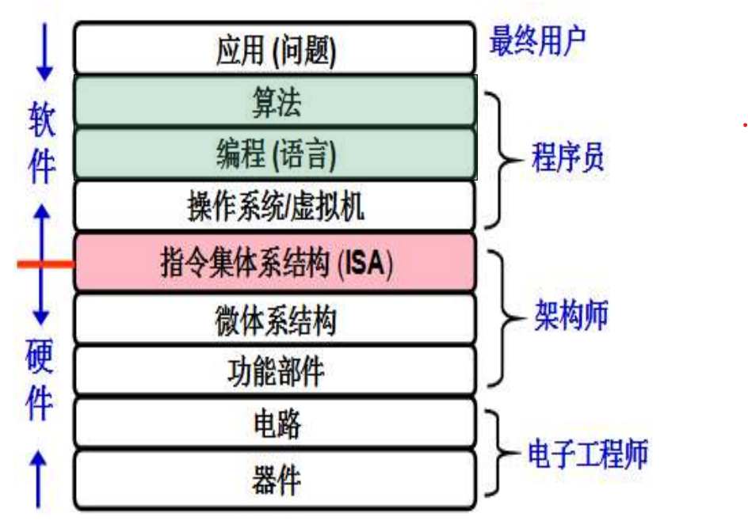
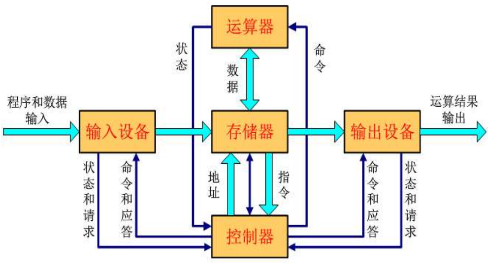
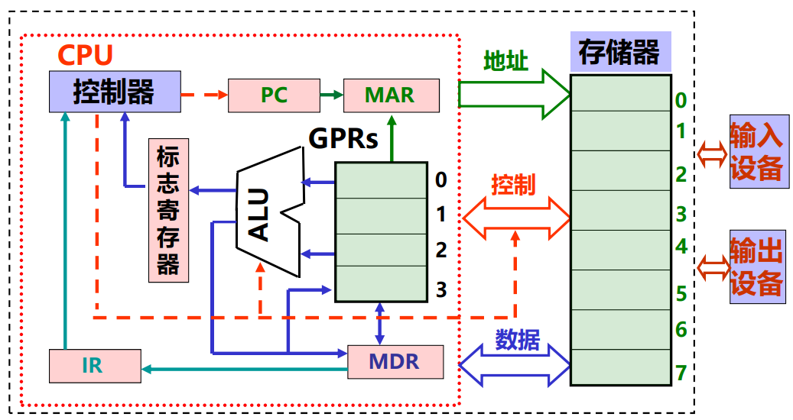
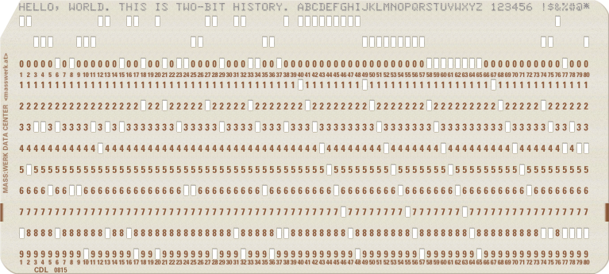
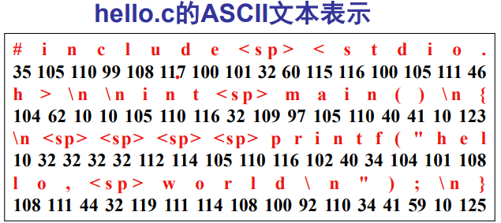

# 计算机系统概述

**概览：**

**[:question: 为什么要学计算机系统基础](#为什么要学计算机系统基础)**  
**[:question: 计算机系统基本组成与基本功能](#计算机系统基本组成与基本功能)**  
**[:question: 程序开发和执行过程](#程序开发和执行过程)**  
**[:question: 计算机系统层次结构](#计算机系统层次结构)**

## 为什么要学计算机系统基础

### 用“系统思维”分析问题

#### 范例 1

```c
printf("-2147483648 < 2147483647 = %d\n", -2147483648 < 2147483647);
int i = -2147483648;
printf("i < 2147483647 = %d\n", i < 2147483647);
printf("-2147483647 - 1 < 2147483647 = %d\n", -2147483647 - 1 < 2147483647);

编译选项：gcc -m32 -std=c90
运行结果：
-2147483648 < 2147483647 = 0
i < 2147483647 = 1
-2147483647 - 1 < 2147483647 = 1

为什么第一个输出false？但是第二个输出true？
```

理解该问题需要：

1. 编译如何处理字面量
2. 高级语言中运算规则
3. 高级语言与指令之间的对应
4. 机器指令的执行过程
5. 机器级数据的表示和运算

#### 范例 2

```c
int sum(int a[], unsigned len)
{
    int i, sum = 0;
    for (i = 0; i < len; ++i)
        sum += a[i];
    return sum;
}

当参数len为0时，返回值应该为0，但是机器执行时，却发生访问异常。当len为int型时，则正常。why？
访问违例地址为何是0xC0000005？
```

理解该问题需要：

1. 高级语言中运算规则
2. 机器指令的含义和执行
3. 计算机内部的运算电路
4. 异常的检测和处理
5. 虚拟地址空间

[详见第六章](./6-IA-32指令类型.md#例子-2)

#### 范例 3

```c
int x, y;
x = 65535;
y = x * x;
printf("y = %d", y);

运行结果：
y = -131071
为什么现实世界中，x^2 >= 0，但计算机世界并不一定成立

对于任何int型变量x和y，(x>y) == (-x<-y)总是成立吗？
当x=-2147483648，y任意（除-2147483648外）时不成立？why？
```

理解该问题需要：

1. 机器级数据的表示
2. 机器指令的执行
3. 计算机内部的运算电路

#### 范例 4

```c
main.c

int d = 100;
int x = 200;

int main(int argc, char** argv)
{
    p1();
    printf("d = %d, x = %d\n", d, x);
    return 0;
}

p1.c
double d;

void p1()
{
    d = 1.0;
}

编译选项：gcc -m32 -std=c90 -Xlinker -zmuldefs main.c p1.c
运行结果：
d = 0, x = 1072693248
```

理解该问题需要：

1. 机器级数据的表示
2. 变量的存储空间分配
3. 数据的大小端存储方式
4. 链接器的符号解析规则

#### 范例 5

```c
/* 复制数组到堆中，count为数组元素个数 */
int copy_array(int *array, int count)
{
    int i;
    int *myarray = (int*)malloc(count*sizeof(int));
    if (myarray == NULL)
        return -1;
    for(i = 0; i < count; ++i)
        myarray[i] = array[i];
    return count;

}

当参数count很大时，则count * sizeof(int)会溢出
如count = 2^30 + 1时，则count * sizeof(int) = 4
此时会导致堆中大量数据被破坏

攻击者可以构造特殊参数来触发整数溢出，
以一段预设信息覆盖一个已分配的堆缓冲区，
造成远程服务器崩溃或改变内存数据并执行任意代码。
```

理解该问题需要：

1. 乘法运算及溢出
2. 虚拟地址空间
3. 存储空间映射

#### 范例 6

```c
void test01()
{
    int a = 0x80000000;
    int b = 1 / -1;
    printf("%d\n", b);  // 运行结果为 -2147483648
}

void test02()
{
    int a = 0x80000000;
    int b = -1;
    int c = a / b;
    printf("%d\n", c);  // 运行结果为"Floating point exception"，显然CPU检测到了溢出异常
}
```

为什么两者结果不同？

```s
编译选项：gcc -c 6.c -o 6.o
反汇编：objdump -S 6.o

00000000 <test01>:
void test01()
{
   0:   55                      push   %ebp
   1:   89 e5                   mov    %esp,%ebp
   3:   83 ec 10                sub    $0x10,%esp
   6:   e8 fc ff ff ff          call   7 <test01+0x7>
   b:   05 01 00 00 00          add    $0x1,%eax
    int a = 0x80000000;
  10:   c7 45 f8 00 00 00 80    movl   $0x80000000,-0x8(%ebp)
    int b = a / -1;
  17:   8b 45 f8                mov    -0x8(%ebp),%eax
  1a:   f7 d8                   neg    %eax
  1c:   89 45 fc                mov    %eax,-0x4(%ebp)
}
a / -1 被优化成了取负指令neg，所以为发生溢出

00000022 <test02>:
void test02()
{
  22:   55                      push   %ebp
  23:   89 e5                   mov    %esp,%ebp
  25:   83 ec 10                sub    $0x10,%esp
  28:   e8 fc ff ff ff          call   29 <test02+0x7>
  2d:   05 01 00 00 00          add    $0x1,%eax
    int a = 0x80000000;
  32:   c7 45 f4 00 00 00 80    movl   $0x80000000,-0xc(%ebp)
    int b = -1;
  39:   c7 45 f8 ff ff ff ff    movl   $0xffffffff,-0x8(%ebp)
    int c = a / b;
  40:   8b 45 f4                mov    -0xc(%ebp),%eax
  43:   99                      cltd
  44:   f7 7d f8                idivl  -0x8(%ebp)
  47:   89 45 fc                mov    %eax,-0x4(%ebp)
}
a / b 用除法指令idiv实现，但它不生成OF标志
判断溢出是因为Linux中对“除法错”异常#DE（类型0）发SIFPE信号
```

理解该问题需要：

1. 编译器如何优化
2. 机器级数据的表示
3. 机器指令的含义和执行
4. 计算机内部的运算电路
5. 除法错异常的处理

#### 范例 7

```c
#include <stdio.h>

int main()
{
    double a = 10;
    printf("a = %d\n", a);
    return 0;
}
/*
在IA-32上运行时，打印结果为 a = 0
在x86-64上运行时，打印结果a是一个不确定的值
*/
```

理解该问题需要：

1. IEEE754 的表示
2. X87 FPU 的体系结构
3. IA-32 和 x86-64 中过程调用的参数传递
4. 计算机内部的运算电路

#### 范例 8

```c
double fun(int i)
{
    volatile double d[1] = {3.14};
    volatile long int a[2];
    a[i] = 1073741824;
    return d[0]
}

int main(int argc, char** argv)
{
    printf("fun(0) = %f\n", fun(0));
    printf("fun(1) = %f\n", fun(1));
    printf("fun(2) = %f\n", fun(2));
    printf("fun(3) = %f\n", fun(3));
    printf("fun(4) = %f\n", fun(4));
    return 0;
}

编译选项：gcc -m32
运行结果：
fun(0) = 3.140000
fun(1) = 3.140000
*** stack smashing detected ***: terminated
zsh: IOT instruction  ./a.out

课程的结果是：
fun(0) = 3.14
fun(1) = 3.14
fun(2) = 3.1399998664856
fun(3) = 2.00000061035156
fun(4) = 3.14，然后存储保护错

这个结果可能是环境原因导致的。学完再回来看看
```

理解该问题需要：

1. 机器级数据的表示
2. 过程调用机制
3. 栈帧中数据的布局

#### 范例 9

```c
#include <stdio.h>
#include <time.h>

void copyij(int src[256][256], int dst[256][256])
{
    int i, j;
    for (i = 0; i < 256; i++)
        for (j = 0; j < 256; j++)
            dst[i][j] = src[i][j];
}

void copyji(int src[256][256], int dst[256][256])
{
    int i, j;
    for (j = 0; j < 256; j++)
        for (i = 0; i < 256; i++)
            dst[i][j] = src[i][j];
}

int main(int argc, char** argv)
{
    int src[256][256] = {0};
    int dst[256][256];

    clock_t start, end;
    double cpu_time;

    start = clock();
    copyij(src, dst);
    copyij(src, dst);
    copyij(src, dst);
    end = clock();
    cpu_time = ((double)(end - start)) / CLOCKS_PER_SEC;
    printf("copyij, time = %.6f\n", cpu_time);

    start = clock();
    copyji(src, dst);
    copyji(src, dst);
    copyji(src, dst);
    end = clock();
    cpu_time = ((double)(end - start)) / CLOCKS_PER_SEC;
    printf("copyji, time = %.6f\n", cpu_time);
    return 0;
}

运行结果：
copyij, time = 0.000760
copyji, time = 0.001914
```

为什么以上两个程序功能完全一样，算法完全一样的函数`copyij`和`copyji`，时间和空间复杂度一样，但执行时间不一样？

理解该问题需要：

1. 数组的存放方式
2. Cache 机制
3. 访问局部性

#### 范例 10

```c
#include <stdio.h>

double f(int x)
{
    return 1.0 / x;
}

void test01()
{
    double a, b;
    int i;
    a = f(10);
    b = f(10);
    i = a == b;
    printf("%d\n", i);
}

void test02()
{
    double a, b, c;
    int i;
    a = f(10);
    b = f(10);
    c = f(10);
    i = a == b;
    printf("%d\n", i);
}

int main(int argc, char** argv)
{
    test01();
    test02();
    return 0;
}
```

使用老版本 gcc -O2 编译时，`test01`输出 0，`test02`输出 1，为什么？  
[详见第六章](./6-IA-32指令类型.md#x87fpu-指令集)

#### 范例 11

```c
#include <stdio.h>

int main(int argc, char** argv)
{
    int a = 10;
    double *p = (double*)&a;
    printf("%f\n", *p);
    printf("%f\n", (double)(a));
    return 0;
}

编译选项：gcc -m32 -std=c90
运行结果：
-0.000000 （实测是任意值）
10.000000
```

为什么两个`printf`的结果不一样？不都是强制类型转换吗？  
关键差别在于一条指令：`fldl`和`fildl`

```c
void test()
{
    int a = 10;
    double *p = (double*)&a;
    double a1 = *p;
    double a2 = (double)(a);
}

编译：gcc -m32 -std=c90 -c
再反汇编：objdump -S

00000000 <test>:
   0:   55                      push   %ebp
   1:   89 e5                   mov    %esp,%ebp
   3:   83 ec 38                sub    $0x38,%esp
   6:   e8 fc ff ff ff          call   7 <test+0x7>
   b:   05 01 00 00 00          add    $0x1,%eax
  10:   65 a1 14 00 00 00       mov    %gs:0x14,%eax
  16:   89 45 f4                mov    %eax,-0xc(%ebp)
  19:   31 c0                   xor    %eax,%eax
  1b:   c7 45 d8 0a 00 00 00    movl   $0xa,-0x28(%ebp)
  22:   8d 45 d8                lea    -0x28(%ebp),%eax
  25:   89 45 dc                mov    %eax,-0x24(%ebp)
  28:   8b 45 dc                mov    -0x24(%ebp),%eax
  2b:   dd 00                   fldl   (%eax)
  2d:   dd 5d e0                fstpl  -0x20(%ebp)
  30:   8b 45 d8                mov    -0x28(%ebp),%eax
  33:   89 45 d4                mov    %eax,-0x2c(%ebp)
  36:   db 45 d4                fildl  -0x2c(%ebp)
  39:   dd 5d e8                fstpl  -0x18(%ebp)
  3c:   90                      nop
  3d:   8b 45 f4                mov    -0xc(%ebp),%eax
  40:   65 2b 05 14 00 00 00    sub    %gs:0x14,%eax
  47:   74 05                   je     4e <test+0x4e>
  49:   e8 fc ff ff ff          call   4a <test+0x4a>
  4e:   c9                      leave
  4f:   c3                      ret
```

理解该问题需要：

1. 数据的表示
2. 编译（程序的转换）
3. 局部变量在栈中的位置

### 系统能力基于“系统思维”

系统思维即：

- 从计算机系统角度出发分析问题和解决问题
- 首选取决于对计算机系统有多了解
  - 高级语言语句都要转换为机器指令才能在计算机上执行
  - 机器指令是一串 0/1 序列，能被机器直接理解并执行
  - 计算机系统是模运算，字长有限，高位被丢弃
  - 运算器不知道参加运算的是带符号数还是无符号数
  - 在计算机世界，x\*x 可能小于 0，(x+y)+z 不一定等于 x+(y+z)
  - 访问内存需几十到几百个时钟，而访问磁盘需要几百万个时钟
  - 进程具有独立的逻辑控制和独立的地址空间
  - 过程调用使用栈存放参数和局部变量等，递归过程有大量额外指令，增加时间开销，并可能发生栈溢出

### 什么是计算机系统

<div align="left"></div>

程序的执行结果不仅取决于算法，还取决于语言处理系统、操作系统、ISA、微体系结构

本课程重点在高级语言以下各抽象层

- C 语言程序设计层
  - 数据的机器级表示、运算
  - 语句和过程调用的机器级表示
- 操作系统、编译和链接的部分内容
- 指令体系结构和汇编层
  - 指令系统、机器代码、汇编语言
- 微体系结构及硬件层
  - CPU 的通用结构
  - 层次结构存储系统

### 总结

为什么要学习计算机系统基础？

- 为了编程时少出错
- 为了在程序出错时很快找到出错位置
- 为了明白程序如何在计算机中执行的
- 为了强化“系统思维”
- 为了更好地理解计算机系统，从而编写出更好的程序
- 为后续课程的学习打下良好基础
- 为了编写出更快的程序
- 为了更好地认识计算机系统

## 计算机系统基本组成与基本功能

### 现代计算机的原型

1946 年，第一台通用电子计算机 ENIAC 诞生（Electronic Numerical Integrator And Computer，电子数字积分计算机）

> - 由电子真空管组成
> - 美国宾夕法尼亚大学研制
> - 用于解决复杂弹道设计
> - 5000 次加法/s
> - 平方、立方、sin、cos 等
> - 采用十进制表示信息并运算
> - 采用手动编程，通过设置开关和插拔电缆来实现

1945 年，冯·诺伊曼发表了全新的“存储程序通用电子计算机方案”。后普林斯顿高等研究院批准让冯·诺依曼建造计算机  
1946 年，普林斯顿高等研究院（IAS）开始设计“存储程序”计算机，被称为 IAS 计算机（1951 年才完成，并不是第一台存储程序计算机，1949 年由应该剑桥大学完成的 EDSAC 才是第一台）

> - “存储程序”结构被称为“冯·诺伊曼”结构
> - 工作方式：任何要计算机完成的工作都要被编写成程序，然后程序和原始数据送入主存并启动执行。一旦程序被启动，计算机应能在不需操作人员干预下，自动完成逐条取出指令和执行指令的任务
> - 冯·诺伊曼结构计算机也称为冯·诺伊曼机器
> - 几乎所有的通用计算机大都采用冯·诺伊曼结构，因此 ISA 计算机是现代计算机的原型

### 冯·诺依曼结构

<div align="left"></div>

早期，各个部件之间用分散方式连接  
现在，部件之间大多用总线方式相连

#### 主要思想

1. 计算机应由运算器、控制器、存储器、输入设备和输出设备五个基本部件组成
2. 各部件的功能
   1. 存储器不仅能存放数据，而且也能存放指令，形式上两者没有区别，但计算机应能区分数据还是指令
   2. 控制器应能自动取出指令来执行
   3. 运算器应用进行加减乘除四种基本运算，并且也能进行一些逻辑运算和附加运算
   4. 操作人员可以通过输入设备、输出设备和主机进行通信
3. 内部以二进制表示指令和数据。每条指令由操作码和地址码两部分组成。操作码指出操作类型，地址码指出操作数的地址。由一串指令组成程序
4. 采用“存储程序”工作方式

### 现代计算机结构模型

<div align="left"></div>

现代计算机结构中，地址、控制、数据的传递均通过总线传递

CPU：中央处理器  
PC：程序计数器  
MAR：存储器地址寄存器  
ALU：算数逻辑单元  
IR：指令寄存器  
MDR：存储器数据寄存器  
GPRs：通用寄存器组（由若干通用寄存器组成，早期就是累加器）

#### 计算机的工作流程

程序执行前

- 数据和指令事先存放在存储器中，每条指令和每个数据都有地址，指令按序存放，指令由 OP、ADDR 字段组成，程序起始地址置 PC

开始执行

- 根据 PC 取指令
- 指令译码
- 取操作数
- 执行指令
- 回写结果
- 修改 PC 的值（获取下一条指令）

#### 指令和数据

- 程序启动前，指令和数据都存放在存储器中，形式上没有差别，都是 0/1 序列
- 采用“存储程序”工作方式：程序由指令组成，程序被启动后，计算机能自动取出一条一条指令执行，在执行过程中无需人工干预
- 执行执行过程中，指令和数据被存储器取到 CPU，存放在 CPU 内的寄存器中，指令在 IR 中，数据在 GPR 中

## 程序开发和执行过程

### 机器语言开发

<div align="left"></div>

最早的程序开发是用机器语言编写程序，并记录在纸带或卡片上。穿孔 0，未穿孔 1  
输入：按钮、开关  
输出：指示灯等

```s
假设：0010是跳转指令
0: 0101 0110
1: 0010 0100 （跳转到0100地址，假设是4位置）
2: ......
3: ......
4: 0110 0111 （跳转到此处）
5: ......

若在第4条指令前加入新指令，则需要重新计算地址码。然后重新打孔。很不灵活
```

### 汇编语言开发

- 用助记符表示操作码
- 用标号表示位置
- 用助记符表示寄存器
- ......

```s
0: 0101 0110    汇编语言: add B   （使用助记符表示操作码和寄存器）
1: 0010 0100             jc L0
2: ......                ......
3: ......                ......
4: 0110 0111           L0: sub C （使用标号，直接跳转到该位置）
5: ......               B: .....
6: ......               C: .....

在第4条指令前加指令时不用改变add、jxx和sub指令中的地址码
```

汇编语言优点：

- 不会因为增减指令而需要修改其他指令
- 不需要记忆指令编码，编写方便
- 可读性比机器语言强

但是，计算机只认 0/1 序列，那么需要用汇编程序将汇编语言转为机器语言

### 机器级语言

机器语言和汇编语言都是面向机器结构的语言，所以统称为机器级语言

- 汇编语言源程序是由汇编指令构成
- 汇编指令是用助记符和标号来表示的指令（与机器指令一一对应）
- 机器指令用二进制表示，汇编指令用标号表示

虽然汇编语言比机器语言好，但是用汇编语言编写复杂程序（如实现排序、矩阵相乘）时，需要描述的细节太多了，程序会很长很长，而且在不同结构的机器上就不能运行

### 高级语言

- 高级语言与具体机器结构无关
- 面向算法描述，比机器级语言描述能力强得多
- 高级语言中一条语句对应几条、几十条甚至几百条指令
- 有“面向对象”和“面向过程”的语言之分
- 处理逻辑分为三种结构：顺序结构、选择结构、循环结构
- 有两种转换方式：编译和解释
  - 编译程序（complier）：将高级语言源程序转为机器级目标程序，执行时只要启动目标程序即可
  - 解释程序（interpreter）：将高级语言语句逐条翻译成机器指令并立即执行，不生成目标文件

一个经典 C 语言例子：

```c
#include <stdio.h>

int main(int argc, char** argv)
{
    printf("hello world\n");
    return 0;
}
```

<div align="left"></div>

使用 GCC 处理过程如下：

1. 预处理（cpp）  
   hello.c 源程序（文本） -> hello.i 源程序（文本）  
   `gcc -E hello.c -o hello.i`
2. 编译（cc1）  
   hello.i -> hello.s 汇编语言源程序（文本）  
   `gcc -S hello.i -o hello.s`
3. 汇编（as）  
   hello.s -> hello.o 可重定位目标程序（二进制）  
   `gcc -c hello.s -o hello.o`
4. 链接（ld）  
   hello.o 通过与 printf.o 链接 -> hello 可执行目标程序（二进制）  
   `gcc -lc hello.o -o hello` （printf.o 是 c 标准库的一部分，所以手动链接时候指定 c 库）

## 计算机系统层次结构

1. 机器语言编程  
   机器语言称为第一代程序设计语言（First generation programming language，1GL）
   <div align="left"></div>
1. 汇编语言编程：2GL
   <div align="left"></div>
1. 高级语言编程  
   3GL：过程式语言，编码时候需要描述实现过程，即“如何做”，如`C/C++, Java`  
   4GL：非过程式语言，编码时只需要说明“做什么”，不需要描述具体的算法实现细节，如`SQL, S`  
   3GL 和 4GL 是相对的概念，没有明确的界限和标准定义，统一叫高级语言即可
   <div align="left"></div>
   语言处理系统包括：各种语言处理程序（如汇编、编译、链接）、运行时系统（如库函数，调试，优化等）  
   操作系统包括人机交互界面，提供服务功能的内核例程

### 指令集体系结构（ISA）

- ISA 指 Instruction Set Architecture，即指令集体系结构，也称指令系统
- ISA 处于软件和硬件的交界面，是对硬件的抽象，所有软件功能都建立在 ISA 之上
- ISA 是一种规约（Specification），它规定了如何使用硬件
  - 可执行的指令的集合，包括指令格式、操作种类以及每种操作对应的操作数的相应规定
  - 指令可以接受操作数的类型
  - 操作数所能存放的寄存器组的结构，包括每个寄存器的名称、编号、长度和用途
  - 操作数所能存放的存储空间的大小和编址方式
  - 操作数在存储空间存放时按照大端还是小端方式
  - 指令获取操作数的方式，即寻址方式
  - 指令执行过程的控制方式，包括程序计数器 PC，条件码定义等
- ISA 是通用计算机系统中必不可少的一个抽象层
  - 没有它，软件无法使用计算机硬件
  - 没有它，一台计算机不能称为“通用计算机”
