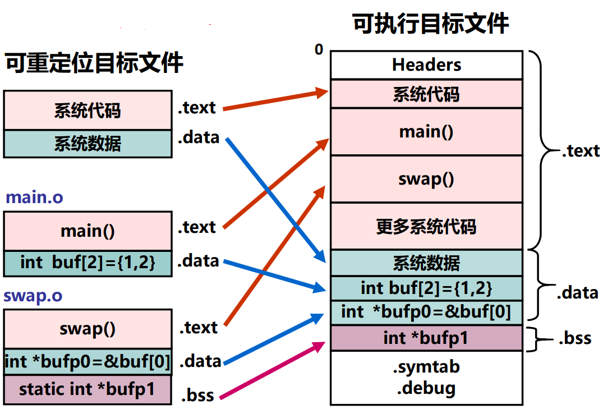
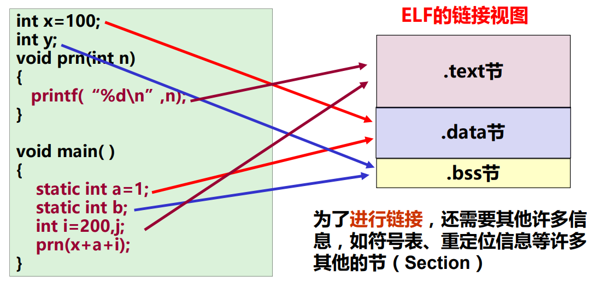
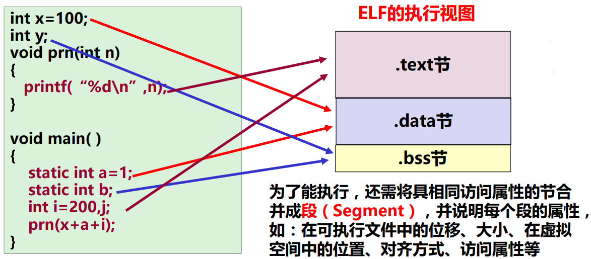
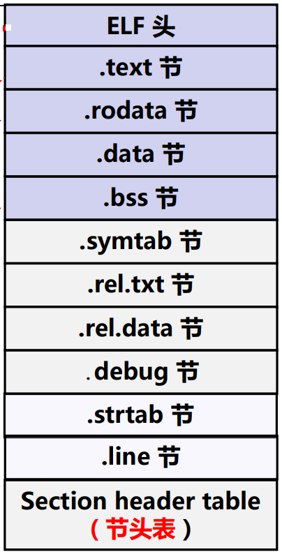
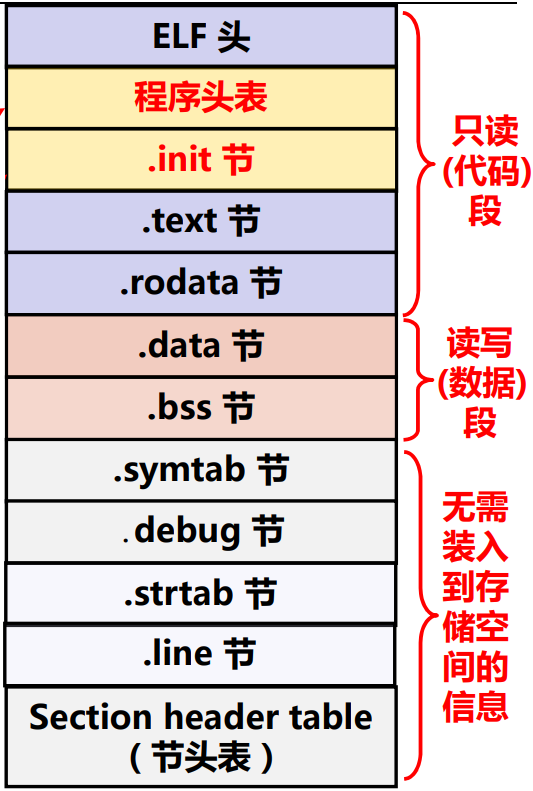
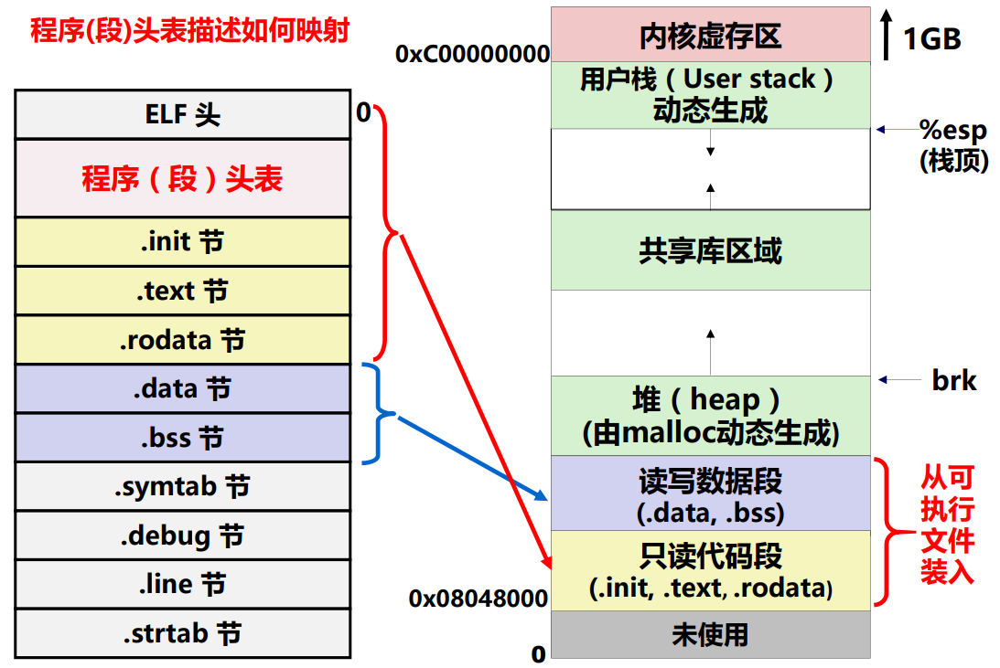

# 链接概述和目标文件格式

**概览：**

**[:question: 可执行文件生成概述](#可执行文件生成概述)**  
**[:question: 目标文件格式概述](#目标文件格式概述)**  
**[:question: ELF 可重定位目标文件](#elf-可重定位目标文件)**  
**[:question: ELF 可执行目标文件](#elf-可执行目标文件)**

## 可执行文件生成概述

一个 C 文件编译处理过程有：预处理、编译、汇编、链接

gcc 命令实际上是具体程序（如 ccp、cc1、as 等）的包装命令，用户通过 gcc 命令来使用具体的预处理程序 ccp、编译程序 cc1 和汇编程序 as 等

### 预处理

- 预处理命令
  - `gcc -E xxx.c -o xxx.i`
  - `ccp xxx.c > xxx.i`
- 处理源文件中以“#”开头的预编译指令，包括：
  - 删除“#define”并展开所定义的宏
  - 处理所有条件预编译指令，如“#if”、“#ifdef”、“endif”等
  - 插入头文件到“#include”处，可以递归方式进行处理
  - 删除所有的注释“//”和“/\* \*/”
  - 添加行号和文件名标识，以便编译时编译器产生调试用的行号信息
  - 保留所有的#pragma 编译指令（编译器要用）
- 经过预编译处理后，得到的是预处理文件，它也是一个可读文本文件，但不包含任何宏定义

```c
// c1.c
#include "global.h"

int f()
{
    return g + 1;
}

// global.h
#ifdef INITIALIZE
    int g = 23;
    static int init = 1;
#else
    int g;
    static int init = 0;
#endif

// 那么经过预处理后，c1.c的代码可能如下
// 1. 定义了INITIALIZE
int g = 23;
static int init = 1;
int f()
{
    return g + 1;
}
// 2.未定义INITIALIZE
int g;
static int init = 0;
int f()
{
    return g + 1;
}
```

### 编译

- 编译过程就是将预处理得到的与处理文件（如 xxx.i）进行词法分析、语法分析、语义分析、优化后，生成汇编代码文件
- 用来进行编译处理的程序称为编译程序（编译器，Compiler）
- 编译命令
  - `gcc -S xxx.i -o xxx.s`
  - `gcc -S xxx.c -o xxx.s`
  - `/usr/lib/gcc/xxxgun/cc1 xxx.c`
- 经过编译后，得到的汇编代码文件还是可读文本文件，CPU 无法理解和执行它

### 汇编

- 汇编代码文件（由汇编指令构成）称为汇编语言源程序
- 汇编程序（汇编器）用来将汇编语言源程序转换为机器指令序列（机器语言程序）
- 汇编指令和机器指令一一对应，前者是后者的符号表示，它们都属于机器级指令，所构成的程序称为机器级代码
- 汇编命令
  - `gcc -c xxx.s -o xxx.o`
  - `gcc -c xxx.c -o xxx.o`
  - `as xxx.s -o xxx.o`
- 汇编结果是一个可重定位目标文件，其中包含的是不可读的二进制代码，必须用相应的工具软件来查看其内容

### 链接

- 预处理、编译和汇编三个阶段针对一个模块（一个*.c 文件）进行处理，得到对应的一个可重定位目标文件（一个*.o 文件）
- 链接过程将多个可重定位目标文件合并以生成可执行目标文件
- 链接命令
  - `gcc -static -o myproc main.o test.o`
  - `ld -static -o myproc main.o test.o`

#### 链接器的由来

- 原始的链接概念早在高级编程语言出现之前就已存在
- 最早的程序员用机器语言编写程序，并记录在指代或卡片上，穿孔表示 0，未穿孔表示 1

```s
假设0010是jmp
0: 0101 0110
1: 0010 0101
2: ...
3: ...
4: ...
5: 0110 0111

若在第五条指令前加入指令，则程序需要重新计算jmp指令的目标地址，然后重新打孔
```

如果用符号表示跳转位置和变量位置，是否简化了问题？所以产生了汇编语言，高级编程语言

- 汇编语言的出现
  - 用助记符表示操作码
  - 用助记符表示寄存器
  - 用**符号**表示位置
  - ......
- 更高级编程语言出现
  - 程序越来越复杂，需要多人开发不同的程序模块
  - 子函数起始地址和变量地址是**符号定义（definition）**
  - 调用子函数和使用变量是**符号的引用（reference）**
  - 一个模块定义的符号可以被另一个模块引用
  - 最后需要链接（合并），合并时候在符号引用处填写定义处的地址

```s
上述代码汇编假设如下
    add B
    jmp L0 --- 这是一个符号的引用
    ......
    ......
L0: sub C  --- L0是符号的定义

链接时候，会确定L0的地址，然后在jmp指令中填入L0的地址
```

#### 使用链接的好处

- 模块化
  - 一个程序可以分成很多源程序文件
  - 可构建公共函数库，如数学库，标准 C 库等  
    代码重用，开发效率高
- 效率高
  - 时间上，可分开编译  
    只需重新编译被修改的源程序文件，然后重新链接
  - 空间上，无需包含共享库的所有代码  
    源文件中无需包含共享库函数的源码，只要直接调用即可。比如直接调用`printf`函数，无需包含其源码  
    可执行文件和运行时的内存中只需包含所调用函数的代码而不需要包含震哥哥共享库

#### 一个 C 例子

```c
// main.c
int buf[2] = {1, 2};
void swap();

int main()
{
    swap();
    return 0;
}
// swap.c
extern int buf[];
int* bufp0 = &buf[0];
static int* bufp1;

void swap()
{
    int temp;
    bufp1 = &buf1[1];
    temp = *bufp0;
    *bufp0 = *bufp1;
    *bufp1 = temp;
}
```

每个模块都有自己的代码、数据（初始化全局变量、未初始化全局变量、静态变量、局部变量）  
局部变量 temp 分配在栈中，不会在过程中被引用，因此不是符号定义

生成可执行文件：`gcc -O2 -g -o p main.c swap.c`，该命令`-O2`是 2 级优化，`-g`生成调试信息，`-o`是指定目标文件名，会分别把`main.c`和`swap.c`经过预处理、编译、汇编后转换为可重定位文件`main.o`和`swap.o`，再使用连接器`ld`生成可执行目标文件

#### 链接过程的本质

链接的本质：合并相同的“节”

<div align="left"></div>

### 链接操作的步骤

1. 符号解析（symbol resolution）

   1. 程序中有定义和引用的符号（包括变量和函数等），如上述[C 例子](#一个-c-例子)中  
      `void swap() {...}` 定义符号`swap`  
      `swap();` 引用符号`swap`  
      `int *xp = &x;` 定义符号`xp`，引用符号`x`
   2. 编译器将定义的符号存放在一个符号表（symbol table）中  
      符号表是一个数组结构  
      每个表项包含符号名、长度和位置等信息
   3. 连接器将每个符号的引用都与一个确定的符号定义建立关联

2. 重定位
   1. 将多个代码段与数据段分别合并成一个单独的代码段和数据段
   2. 计算每个定义的符号在虚拟空间中的绝对地址
   3. 将可执行文件中符号引用处的地址修改为重定位后的地址信息

## 目标文件格式概述

### 三类目标文件

- 可重定位目标文件
  - gcc/clang 是.o，msvc 是.obj
  - 其代码和数据可和其他重定位文件合并成可执行文件  
    每个.o 文件由对应的.c 文件生成  
    每个.o 文件代码和数据地址都从 0 开始
- 可执行文件
  - linux 默认是 a.out，windows 默认是 a.exe
  - 包含的代码和数据可以被直接复制到内存并执行
  - 代码和数据地址为虚拟地址空间中的地址
- 共享目标文件
  - linux 是.so（shared object），windows 是.dll（dynamic link libraries）
  - 特殊的可重定位文件，能在装入或运行时被装入到内存并自动链接

### 目标文件格式

- 目标代码值编译器和汇编器处理源代码后所生成的机器语言目标代码
- 目标文件指包含目标代码的文件
- 最早的目标文件格式是自有格式，非标准的
- 标准的几种目标文件格式如下：
  - DOS 操作系统（最简单）：COM 格式，文件中仅包含代码和数据，且被加载到固定位置
  - System V Unix 早期版本：COFF 格式，文件中不仅包含代码和数据，还包含重定位信息、调试信息、符号表等其他信息，由一组严格定义的数据结构序列组成
  - Windows：PE 格式（COFF 的变种），称为可执行可移植（Portable Executable）
  - Linux 等类 Unix：ELF 格式（COFF 的变种），称为可执行可链接（Executable and Linkable Format）

### ELF

链接视图（被链接）：可重定位目标文件（Relocatable object files）
执行视图（被执行）：可执行目标文件（Executable object files）

#### 链接视图

链接视图由：ELF 头、程序头表（可选）、节（.text 节、.data 节等）、节头表组成  
节（section）是 ELF 文件中具有相同特征的最小可处理单位

- .text 节：代码
- .data 节：数据
- .rodata 节：只读数据
- .bss 节：未初始化数据

<div align="left"></div>

链接视图-可重定位目标文件：

- 可被链接（合并）成可执行文件或共享目标文件
- 静态链接库文件由若干个可重定位目标文件组成
- 包含代码、数据（已初始化的.data 和未初始化的.bss）
- 包含重定位信息（指出哪些符号引用处需要重定位）

#### 执行视图

执行视图由：ELF 头、程序头表、各种段、节头表（可选）组成  
段（segment）描述节如何映射到存储段中，可多个节映射到同一段，如：可合并.data 节和.bss 节，并映射到一个可读可写数据段中  
程序头表用来说明段信息，也称段头表

<div align="left"></div>

执行视图-可执行目标文件

- 包含代码、数据（已初始化的.data 和未初始化的.bss）
- 定义的所有变量和函数已有确定地址（虚拟空间中的地址）
- 符号引用处已被重定位，已指向所引用的定义符号
- 可被 CPU 直接执行，指令地址和指令给出的操作数地址都是虚拟地址

## ELF 可重定位目标文件

### 未初始化变量（.bss 节）

- BSS（Block Started by Symbol）最初是 UA-SAP 汇编程序中所用的一个伪指令，用于为符号预留一块内存空间
- C 语言规定：未初始化的全局变量和局部静态变量的默认初始化指为 0
- 将未初始化变量（.bss 节）与已初始化变量（.data 节）分开的好处：
  - .data 节中存放具体的初始值，需要占磁盘空间
  - .bss 节中无需存放初始值，只要说明.bss 中的每个变量将来在执行时占用几个字节即可，因此，.bss 节实际上不占用磁盘空间，提高了磁盘空间利用率
- 所有未初始化的全局变量和局部静态变量都被汇总到.bss 节中，通过专门的“节头表（section header table）”来说明为.bss 预留多大的空间

### 可重定位目标文件格式

<div align="left"></div>

- ELF 头：包括 16 字节标识信息、文件类型（.o，exec，.so）、机器类型（如 IA-32）、节头表偏移、节头表的表项大小以及表项个数
- .text 节：编译后的代码部分
- .rodata 节：只读数据，如 printf 格式串，swicth 跳转表等

  ```s
  // 如一段swicth-case语句的汇编可能如下
  // 跳转表在只读数据节中，按4字节边界对齐
      .section  .rodata
      .align  4
  .L8
      .long  .L2  10
      .long  .L5  11
      .long  .L3  12
      .long  .L5  13
  ```

- .data 节：已初始化的全局变量
- .bss 节：未初始化全局变量，仅是占位符，不占据任何磁盘空间
- .symtab 节：存放函数和全局（符号表）信息，不包括局部变量
- .rel.text 节：.text 节的重定位信息，用于重新修改代码段的指令中的地址信息
- .debug 节：调试用符号表（gcc -g）
- .strtab 节：包含 symtab 和 debug 节中符号及节名
- Section header table：每个节的节名、偏移和大小

### ELF 头

ELF 头位于 ELF 文件开始，包含文件结构说明信息。分 32 位系统和 64 位系统对应结构

```c
// 32位系统对应的ELF结构
#define EI_NIDENT   16
typedef struct
{
    unsigned char   e_indent[EI_NIDENT];
    Elf32_Half      e_type;
    Elf32_Half      e_machine;
    Elf32_Word      e_version;
    Elf32_Addr      e_entry;
    Elf32_Off       e_phoff;
    Elf32_Off       e_shoff;
    Elf32_Word      e_flags;
    Elf32_Half      e_ehsize;
    Elf32_Half      e_phentsize;
    Elf32_Half      e_phnum;
    Elf32_Half      e_shentsize;
    Elf32_Half      e_shnum;
    Elf32_Half      e_shstrndx;
}Elf32_Ehdr;
```

定义了 ELF 摩数、版本、大小端、操作系统平台、目标文件的类型、机器结构类型、程序执行的入口地址、程序头表（段头表）的起始位置和长度、节头表的起始位置和长度等

魔数：文件开头几个字节通常用来确定文件的类型或格式  
a.out 的魔数：01H 07H  
PE 格式的魔数：4DH 5AH  
加载或读取文件时，可用魔数确认文件类型是否正确

#### ELF 头信息举例

```c
readelf -h main.o

ELF Header:
  Magic:   7f 45 4c 46 01 01 01 00 00 00 00 00 00 00 00 00    // ELF头文件的魔数
  Class:                             ELF32
  Data:                              2's complement, little endian
  Version:                           1 (current)
  OS/ABI:                            UNIX - System V
  ABI Version:                       0
  Type:                              REL (Relocatable file)  // 目标文件类型-可重定位目标文件
  Machine:                           Intel 80386
  Version:                           0x1
  Entry point address:               0x0    // 程序执行入口，0表示没有程序头表
  Start of program headers:          0 (bytes into file)
  Start of section headers:          884 (bytes into file)  // 节头表偏移
  Flags:                             0x0
  Size of this header:               52 (bytes) // ELF头大小
  Size of program headers:           0 (bytes)
  Number of program headers:         0
  Size of section headers:           40 (bytes)  // 每个节头表表项大小
  Number of section headers:         15  // 节头表表项个数
  Section header string table index: 14  // .strtab在节头表中的索引
```

### 节头表

- 除 ELF 头之外，节头表是 ELF 可重定位目标文件中最重要的部分内容
- 描述每个节的节名、在文件中的偏移、大小、访问属性、对齐方式等

```c
// 32位系统对应的节头表数据结构（共40B）
typedef struct
{
    Elf32_Word    sh_name;  // 节名字符串在.strtab中的偏移
    Elf32_Word    sh_type;  // 节类型：无效/代码或数据/符号/字符串..
    Elf32_Word    sh_flags; // 节标志：改节在虚拟空间中的访问属性
    Elf32_Addr    sh_addr;  // 虚拟地址：若可被加载，则对应虚拟地址
    Elf32_Off     sh_offset;  // 在文件中的偏移地址，对.bss节而言无意义
    Elf32_Word    sh_size; // 节在文件中所占的长度
    Elf32_Word    sh_link;
    Elf32_Word    sh_info; // sh_link和sh_info用于链接相关的节（如.rel.text节、.rel.data节、.symtab节等）
    Elf32_Word    sh_addralign;  // 节的对齐要求
    Elf32_Word    sh_entsize;  // 节中每个表项的长度，0表示无固定长度表项
}Elf32_Shdr;
```

#### 节头表信息举例

```c
readelf -S test.o

There are 15 section headers, starting at offset 0x374:

Section Headers:
  [Nr] Name              Type            Addr     Off    Size   ES Flg Lk Inf Al
  [ 0]                   NULL            00000000 000000 000000 00      0   0  0
  [ 1] .group            GROUP           00000000 000034 000008 04     12   5  4
  [ 2] .text             PROGBITS        00000000 00003c 0000bc 00  AX  0   0  1
  [ 3] .rel.text         REL             00000000 00029c 000030 08   I 12   2  4
  [ 4] .data             PROGBITS        00000000 0000f8 000000 00  WA  0   0  1
  [ 5] .bss              NOBITS          00000000 0000f8 000000 00  WA  0   0  1
  [ 6] .text.__x86.[...] PROGBITS        00000000 0000f8 000004 00 AXG  0   0  1
  [ 7] .comment          PROGBITS        00000000 0000fc 00001c 01  MS  0   0  1
  [ 8] .note.GNU-stack   PROGBITS        00000000 000118 000000 00      0   0  1
  [ 9] .note.gnu.pr[...] NOTE            00000000 000118 000028 00   A  0   0  4
  [10] .eh_frame         PROGBITS        00000000 000140 000078 00   A  0   0  4
  [11] .rel.eh_frame     REL             00000000 0002cc 000018 08   I 12  10  4
  [12] .symtab           SYMTAB          00000000 0001b8 000090 10     13   4  4
  [13] .strtab           STRTAB          00000000 000248 000053 00      0   0  1
  [14] .shstrtab         STRTAB          00000000 0002e4 00008d 00      0   0  1
Key to Flags:
  W (write), A (alloc), X (execute), M (merge), S (strings), I (info),
  L (link order), O (extra OS processing required), G (group), T (TLS),
  C (compressed), x (unknown), o (OS specific), E (exclude),
  D (mbind), p (processor specific)
```

可重定位目标文件中，每个可装入节的起始地址总是 0，代码中`Addr`内容

## ELF 可执行目标文件

### 可执行目标文件格式

<div align="left"></div>

与可重定位文件文件不同：

- ELF 头中 e_entry 给出执行程序时第一条指令的地址，而在可重定位文件中，地址为 0
- 多一个程序头表，也称段头表（segment header table），是一个结构数据
- 多一个.init 节，用于定义\_init 函数，该函数用来进行可执行目标文件开始执行时的初始化工作
- 少两个.rel 节（无需重定位）

### ELF 头信息举例

```c
readelf -h main

ELF Header:
  Magic:   7f 45 4c 46 01 01 01 00 00 00 00 00 00 00 00 00
  Class:                             ELF32
  Data:                              2's complement, little endian
  Version:                           1 (current)
  OS/ABI:                            UNIX - System V
  ABI Version:                       0
  Type:                              DYN (Position-Independent Executable file) // 可执行文件
  Machine:                           Intel 80386
  Version:                           0x1
  Entry point address:               0x1040  // 程序的入口地址
  Start of program headers:          52 (bytes into file)  // 程序头表的偏移
  Start of section headers:          13516 (bytes into file) // 节头表的偏移
  Flags:                             0x0
  Size of this header:               52 (bytes)
  Size of program headers:           32 (bytes)  // 每个程序头表表项大小
  Number of program headers:         12          // 程序头表表项数量
  Size of section headers:           40 (bytes)
  Number of section headers:         30
  Section header string table index: 29
```

回顾：可执行文件的存储映像

<div align="left"></div>

### 程序头表

程序头表描述可执行文件中的节与虚拟空间中的存储段之间的映射关系  
一个表项（32B）说明虚拟地址空间中一个连续的段或一个特殊的节

```c
// 32位系统对应程序头表数据结构（共32B）
typede struct
{
    Elf32_Word    p_type;
    Elf32_Off     p_offset;
    Elf32_Addr    p_vaddr;
    Elf32_Addr    p_paddr;
    Elf32_Word    p_filesz;
    Elf32_Word    p_memsz;
    Elf32_Word    p_flags;
    Elf32_Word    p_align;
}Elf32_Phdr;
```

#### 程序头表信息举例

```s
readelf -l main

Elf file type is DYN (Position-Independent Executable file)
Entry point 0x1040
There are 12 program headers, starting at offset 52

Program Headers:
  Type           Offset   VirtAddr   PhysAddr   FileSiz MemSiz  Flg Align
  PHDR           0x000034 0x00000034 0x00000034 0x00180 0x00180 R   0x4
  INTERP         0x0001b4 0x000001b4 0x000001b4 0x00013 0x00013 R   0x1
      [Requesting program interpreter: /lib/ld-linux.so.2]
  LOAD           0x000000 0x00000000 0x00000000 0x00434 0x00434 R   0x1000
  LOAD           0x001000 0x00001000 0x00001000 0x00260 0x00260 R E 0x1000
  LOAD           0x002000 0x00002000 0x00002000 0x0012c 0x0012c R   0x1000
  LOAD           0x002ee4 0x00003ee4 0x00003ee4 0x00128 0x0012c RW  0x1000
  DYNAMIC        0x002eec 0x00003eec 0x00003eec 0x000f0 0x000f0 RW  0x4
  NOTE           0x0001c8 0x000001c8 0x000001c8 0x00078 0x00078 R   0x4
  GNU_PROPERTY   0x0001ec 0x000001ec 0x000001ec 0x00034 0x00034 R   0x4
  GNU_EH_FRAME   0x002008 0x00002008 0x00002008 0x0003c 0x0003c R   0x4
  GNU_STACK      0x000000 0x00000000 0x00000000 0x00000 0x00000 RW  0x10
  GNU_RELRO      0x002ee4 0x00003ee4 0x00003ee4 0x0011c 0x0011c R   0x1

 Section to Segment mapping:
  Segment Sections...
   00
   01     .interp
   02     .interp .note.gnu.build-id .note.gnu.property .note.ABI-tag .gnu.hash
          .dynsym .dynstr .gnu.version .gnu.version_r .rel.dyn .rel.plt
   03     .init .plt .text .fini
   04     .rodata .eh_frame_hdr .eh_frame
   05     .init_array .fini_array .dynamic .got .got.plt .data .bss
   06     .dynamic
   07     .note.gnu.build-id .note.gnu.property .note.ABI-tag
   08     .note.gnu.property
   09     .eh_frame_hdr
   10
   11     .init_array .fini_array .dynamic .got
```

第一可装入段（第一个 LOAD）：将文件的 0x00000~0x00433 字节映射到虚拟地址 0x00000000 开始长度为 0x00434 字节的区域，按 0x1000=4KB 对齐，具有只读（R）属性，通常包括 ELF 头信息和一些只读数据，如：.interp 段和部分.note 段

第二可装入段（第二个 LOAD）：从文件偏移 0x1000 处开始，将 0x260 字节加载到虚拟地址为 0x00001000 位置，具有可读/可执行属性（R E），通常包含代码段，如：.init、.plt 和.text 段

第三可装入段（第三个 LOAD）：从文件偏移 0x2000 处开始，将 0x12c 字节加载到虚拟地址为 0x00002000 位置，具有可读属性（R），通常包含只读数据段，如.rodata 和.ef_frame 段

第四可装入段（第四个 LOAD）：从文件偏移 0x2ee4 处开始，将 0x12c 字节加载到虚拟地址为 0x00003ee4 位置，具有可读/可写属性（R），通常包含可写数据段，如.data、.bss 和动态相关数据段.dynamic
