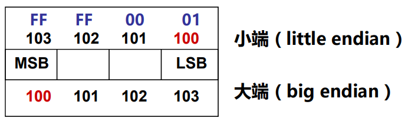

# 数据的表示与存储

**概览：**

**[:question: 数制与编码](#数制与编码)**  
**[:question: 定点数的编码表示](#定点数的编码表示)**  
**[:question: C 语言中的整数](#c-语言中的整数)**  
**[:question: 浮点数的编码表示](#浮点数的编码表示)**  
**[:question: 非数值数据的编码表示](#非数值数据的编码表示)**  
**[:question: 数据宽度和存储容量的单位](#数据宽度和存储容量的单位)**  
**[:question: 数据存储时的字节排列](#数据存储时的字节排列)**

## 数制与编码

### 信息的二进制编码

- 机器级数据分两大类
  - 数值数据：无符号整数、带符号整数、浮点数（实数）
  - 非数值数据：逻辑数（包括位串）、西文字符和汉字
- 计算机内部所有信息都用二进制 0/1 进行编码
- 用二进制编码原因
  - 制造二个稳定态的物理器件容易（电位高/低，脉冲有/无）
  - 二进制编码、计数、运算规则简单
  - 正好与逻辑命题真/假对应，便于逻辑运算
  - 可方便地用逻辑电路实现算术运算
- 真值和机器数

  - 机器数：用 0/1 编码的计算机内部的 0/1 序列
  - 真值：真正的值，即现实中带正负号的数

  ```txt
  例：unsigned short变量x的真值是127，其机器数是多少？
     127 = 2^7 - 1，机器数为 0000 0000 0111 1111
  ```

### 数值数据的表示

- 数值数据表示的三要素（即要确定一个数值数据的值必须先确定这三个要素）
  - 进位计数制
  - 定、浮点表示
  - 如何用二进制编码
- 进位计数制
  - 十进制、二进制、八进制、十六进制数以及其相互转换
- 定/浮点数表示（解决小数点问题）
  - 定点整数、定点小数
  - 浮点数（可用一个定点小数和一个定点整数来表示）
- 定点数的编码（解决正负号问题）
  - 原码、补码、反码、移码

#### 进位计数制

需要了解二进制、八进制、十进制、十六进制的表示以及相互转换（这里略）

日常生活用十进制，计算机中用二进制，八进制和十六进制是为了方便在屏幕或其他设备上表示，缩短了长度

#### 定点数和浮点数

- 计算机中只有 0/1，数值数据中的小数点怎么表示呢  
  计算机中只能通过约定小数点的位置来表示
  - 小数点位置约定在固定位置的数称为定点数
  - 小数点位置约定为可浮动的数称为浮点数
- 定点小数用来表示浮点数的尾数部分
- 定点整数用来表示整数，分带符号整数和无符号整数
- 任何实数：$X = (-1)^S × M × R^E$  
  其中，S 取值 0 或 1，用来决定 X 的符号；M 是一个二进制定点小数，称为 X 的尾数（mantissa）；E 是一个二进制定点整数，称为 X 的阶或指数（exponent）；R 是基数（radix），可以为 2、4、16 等。  
  计算机中只要表示 S、M 和 E 三个信息，就能确定 X 的值，这称为浮点数

## 定点数的编码表示

### 原码

原码由符号位和数值部分组成，0 表示正数、1 表示负数

| Decimal | Binary | Decimal | Binary |
| ------- | ------ | ------- | ------ |
| 0       | 0000   | -0      | 1000   |
| 1       | 0001   | -1      | 1001   |
| 2       | 0010   | -2      | 1010   |
| 3       | 0011   | -3      | 1011   |
| 4       | 0100   | -4      | 1100   |
| 5       | 0101   | -5      | 1101   |
| 6       | 0110   | -6      | 1110   |
| 7       | 0111   | -7      | 1111   |

原码理解方便，但

1. 0 的表示不唯一，不利于编程
2. 加、减运算方式不统一
3. 需要额外对符号位进行处理，不利于硬件设计
4. 特别当 a < b 时，实现 a - b 比较困难

所以 50 年代开始，整数都采用补码表示，但浮点数的尾数用原码定点小数表示

### 补码

补码就是模运算得出来的  
在一个模运算系统中，一个数与它除以“模”后的余数等价

> 时钟就是一种模 12 系统  
> 假设钟表时针指向 10 点，要将它拨向 6 点，有两种方法：
>
> - 倒拨 4 格：10 - 4 = 6
> - 顺拨 8 格：10 + 8 = 18 ≡ 6 （mod 12）
>
> 所以模 12 系统中，10 - 4 = 10 + 8 即 -4 ≡ 8，称 8 是-4 对模 12 的补码

结论 1：一个负数的补码等于模减该负数的绝对值  
结论 2：对于某一确定的模，某数减去小于模的另一个数，总可以用该数加上另一数负数的补码来代替

补码完成了加减法的统一

例 1：“钟表”模 12 运算系统中，假设时针只能顺拨，从 10 点倒拨 4 格后是几点？  
10 - 4 = 10 + (12 - 4) = 10 + 8 = 6 (mod 12)

例 2：“4 位十进制数”模 10^4 运算系统中，假设是算盘，一共 4 档，只能做加法，则在算盘上计算 9828-1928 是多少？  
9828 - 1928 = 9828 + (10^4 - 1928) = 9828 + 8072 = 17900 = 7900(mod 10^4)

#### 补码的表示

运算器只有有限位，假设为 n 位，则运算结果只能保留低 n 位，故可看成个只有 n 档的二进制算盘，因此，其模为$2^n$  
例如：n 为 4 时，共有 16 个机器数 0000~1111，可看出是$2^4$的钟表系统。真值范围是-8 ~ +7

<div align=""></div>

补码定义：假定补码有 $n$ 位，则$[X]_补 = 2^n + X  (-2^{n-1} ≤ X ＜ 2^{n-1}, mod 2^n)$，其中$X$是真值，$[X]_补$是机器数

#### 特殊的补码

1. $[-2^{n-1}]_补 = 2^n - 2^{n-1} = 10...0（n-1个0）$
2. $[-1]_补 = 2^n - 0...01 = 11...1（n个1）$
3. $[+0]_补 = [-0]_补 = 00...0（n个0）$

#### 变形补码

变形补码采用双符号，用于存放可能溢出的中间结果。因为可能会出现值太大，用 n 位补码无法表示，会产生“溢出”，但用变形补码可保留符号位和最高数值位

| Decimal | 补码 | 变形补码 | Decimal | 补码 | 变形补码 |
| ------- | ---- | -------- | ------- | ---- | -------- |
| 0       | 0000 | 00000    | -0      | 0000 | 00000    |
| 1       | 0001 | 00001    | -1      | 1111 | 11111    |
| 2       | 0010 | 00010    | -2      | 1110 | 11110    |
| 3       | 0011 | 00011    | -3      | 1101 | 11101    |
| 4       | 0100 | 00100    | -4      | 1100 | 11100    |
| 5       | 0101 | 00101    | -5      | 1011 | 11011    |
| 6       | 0110 | 00110    | -6      | 1010 | 11010    |
| 7       | 0111 | 00111    | -7      | 1001 | 11001    |
| 8       | 1000 | 01111    | -8      | 1000 | 11000    |

比如 8 溢出，无法用 4 位补码表示，但双符号位可以保留

#### 真值与补码的转换

若真值用原码表示，则

- 符号位为 0，为正数，数值部分相同。即正数的补码是其本身
- 符号位为 1，为负数，数值各位取反，末位加 1。即负数的补码，符号位不变，其余位数取反，末位加 1。

负数还有一种方法是从右向左遇到的第一个 1 的前面各位取反（真值不用原码表示）

```txt
例：设机器数有8位，求123和-123的补码表示

123 = 127 - 4 = 0111 1111B - 0100B = 0111 1011B
-123 = -0111 1011B

[0111 1011B]补 = 2^8 + 0111 1011
               = 1 0000 0000 + 0111 1011
               = 0111 1011B（mod 2^8)，即7BH
[-0111 1011B]补 = 2^8 - 0111 1011B
                = 1 0000 0000 - 0111 1011
                = 1111 1111 - 0111 1011 + 1
                = 1000 0101 + 1 （各位取反，末位+1）
                = 1000 0101B，即85H
-0111 1011 -> 右到左第一个1前面各位取反得 1000 0101
```

补码求真值

- 符号位为 0，为正数，数值部分相同
- 符号位为 1，为负数，数值各位取反，末位加 1

```txt
例：
补码0101 0110的真值
   +101 0110 = 64 + 16 + 4 + 2 = 86
补码1101 0110的真值
   -010 1010 = -(32 + 8 + 2) = -42
   也可以右到左第一个1前面各位取反得 -010 1010
```

### 移码

移码是将每一个数值加上一个偏置常数（bias/excess）

通常，当编码位数为 n 时，bias 取$2^{n-1}$或$2^{n-1}-1$

```txt
如：n=4，bias=2^3=1000B
   -8(+8) ~ 0000B
   -7(+8) ~ 0001B
   ......
   +0(+8) ~ 1000B
   ......
   +7(+8) ~ 1111B
```

- 0 的移码表示唯一
- 当 bias 为$2_{n-1}$时，移码和补码仅第一位不同
- 移码用来表示浮点数的阶（为什么？）  
  这是便于浮点数加减运算时的对阶操作（比较大小）
  > 例如：$1.01 × 2^{-1} + 1.11 × 2^3$  
  > 补码 111(-1) < 011(3)  
  > 采用移码，n=2，bias=$2^n$=4，则有  
  > $1.01 × 2^{-1+4} + 1.11 × 2^{3+4}$  
  > 移码 011(3) < 111(7)

## C 语言中的整数

C 语言支持的基本数据类型（32 位环境下）

| 声明                     | 操作数类型     | 存储长度（位） |
| ------------------------ | -------------- | -------------- |
| (unsigned) char          | 整数/字节      | 8              |
| (unsigned) short         | 整数/字节      | 16             |
| (unsigned) int           | 整数/字节      | 32             |
| (unsigned) long int      | 整数/双字      | 32             |
| (unsigned) long long int | -              | 2 × 32         |
| char\*                   | 整数/双字      | 32             |
| float                    | 单精度浮点数   | 32             |
| double                   | 双精度浮点数   | 64             |
| long double              | 扩展精度浮点数 | 80/96          |

整数类型分：无符号整数和带符号整数

### 无符号整数

- 机器中字的位排列顺序有两种方式：（例：32 位字：0...01011B）
  - 高位到低位从左到右：(MSB)0000 0000 0000 0000 0000 0000 0000 1011(LSB)
  - 高位到低位从右到左：(LSB)1101 0000 0000 0000 0000 0000 0000 0000(MSB)
  - 用 LSB 来表示最低有效位，用 MSB 来表示最高有效位
- 无符号数在编码中没有符号位
- 一般在全部是正数运算且不出现负值的场合下，可使用无符号数表示。例如，地址运算、编号表示等
- 能表示的最大值大于位数相同的带符号数的最大值  
  如：8 位无符号整数最大值是 255(1111 1111)  
   而 8 位带符号整数最大值是 127(0111 1111)

### 带符号数

- MSB 表示数符，0 表示正数，1 表示负数
- 三种定点编码方式
  - 原码：定点小数中，用来表示浮点数的尾数
  - 移码：定点整数中，用来表示浮点数的阶
  - 补码：50 年代依赖，所有计算机都用补码来表示带符号整数（为什么）
    - 补码运算系统是模运算系统，加减运算统一
    - 数 0 的表示唯一，方便使用
    - 比原码多表示一个最小负数

### C 语言程序中的整数

无符号数：unsigned int (short/long)；常在数的后面加一个"u"或"U"表示  
带符号数：int (short/long)

若同时有无符号数和带符号整数，则 C 编译器将带符号整数强制转换成无符号数

以下关系表达式在 32 位用补码表示的机器上执行

| 关系表达式                   | 运算类型 | 结果 | 说明                                       |
| ---------------------------- | -------- | ---- | ------------------------------------------ |
| 0 == 0U                      | 无符号   | 1    | 00...0B = 00...0B                          |
| -1 < 0                       | 带符号   | 1    | 11...1B(-1) < 00...00B(0)                  |
| -1 < 0U                      | 无符号   | 0    | 11...1B($2^{32}-1$) > 00...00B(0)          |
| 2147483647 > -2147483647-1   | 带符号   | 1    | 011...1B($2^{31}-1$) > 100...0B($-2^{31}$) |
| 2147483647U > -2147483647-1  | 无符号   | 0    | 011...1B($2^{31}-1$) < 100...0B($-2^{31}$) |
| 2147483647 > (int)2147483648 | 带符号   | 1    | 011...1B($2^{31}-1$) > 100...0B($-2^{31}$) |
| -1 > -2                      | 带符号   | 1    | 11...1B(-1) > 11...10B(-2)                 |
| unsigned(-1) > -2            | 无符号   | 1    | 11...1B($2^{32}-1$) > 11...10B($2^{32}-2$) |

```c
void test1()
{
    int x = -1;
    unsigned u = 2147483648;

    printf("x = %u = %d\n", x, x);
    printf("u = %u = %d\n", u, u);
}

编译选项：gcc -m32
运行结果：
x = 4294967295 = -1
u = 2147483648 = -2147483648

因为-1的补码是11...1，作为32位无符号解释，值为2^32 - 1 = 4294967296 - 1 = 4294967295

2^31的无符号表示数为10...0，被解释为32位带符号整数时，
其值为最小的负数：-2^(32-1) = -2^31 = -2147483648
```

编译器在处理常量时默认的类型如下

**C90 下：**

| 常量范围               | 类型               |
| ---------------------- | ------------------ |
| $0 \sim 2^{31}-1$      | int                |
| $2^{31} \sim 2^{32}-1$ | unsigned int       |
| $2^{32} \sim 2^{63}-1$ | long long          |
| $2^{63} \sim 2^{64}-1$ | unsigned long long |

**C99 下：**

| 常量范围               | 类型               |
| ---------------------- | ------------------ |
| $0 \sim 2^{31}-1$      | int                |
| $2^{31} \sim 2^{63}-1$ | long long          |
| $2^{63} \sim 2^{64}-1$ | unsigned long long |

学到这里就能解决了概述中的[范例一](./1-计算机系统概述.md#范例-1)，如下：

```c
printf("-2147483648 < 2147483647 = %d\n", -2147483648 < 2147483647);
int i = -2147483648;
printf("i < 2147483647 = %d\n", i < 2147483647);
printf("-2147483647 - 1 < 2147483647 = %d\n", -2147483647 - 1 < 2147483647);
printf("-2147483648 - 1 == 2147483647 = %d\n", -2147483648 - 1 == 2147483647);

编译选项：gcc -m32 -std=c90
运行结果：
-2147483648 < 2147483647 = 0
i < 2147483647 = 1
-2147483647 - 1 < 2147483647 = 1
-2147483648 - 1 == 2147483647 = 1

1. 在ISO C90标准下，2147483648为unsigned int型
   因此"-2147483648 < 2147483647"按无符号数比较，10...0B比01...1B大，结果为false
   若在C99标准下，2147483648为long long型，因此按带符号数比较，结果为true
2. i < 2147483647是按int型，带符号数比较，所以为true
3. C90下，-2147483647是int，所以最后按int比较，结果为true
4. C90下，-2147483648补码是1...0B(2^31)，为unsigned int型
   减1后有01...1B(2^31-1)等于2147483647

编译选项选择C99时：gcc -m32 -std=c99
运行结果：
-2147483648 < 2147483647 = 1
i < 2147483647 = 1
-2147483647 - 1 < 2147483647 = 1
-2147483648 - 1 == 2147483647 = 0
```

## 浮点数的编码表示

实数类型分为：单精度浮点数、双精度浮点数和扩展精度浮点数

科学计数法（十进制）：$6.02 × 10^{21}$，其中

- 尾数（mantissa）：02
- 基（base/radix）：10
- 阶或指数（exponent)：21

规格化（Normalized）：小数点前只有一位非 0 数

> 例：对于数 1/1,000,000,000  
> 规格化：$1.0 × 10^{-9}$ 表示唯一  
> 非规格化：$0.1 × 10^{-8}, 10.0 × 10^{-10}$ 表示不唯一

对于二进制实数：$1.101 × 2^{-10}$，只要对尾数和指数部分分别编码，就可以表示一个浮点数了

### 浮点数的表示

规格化数形式：+/-1.xxxxxx × R^e，为了能表示更多有效数字，通常规定规格化数的小数点前为 1

例如：32-bit 规格化数

 <div align="left"></div>

S 是符号位 - 占 1 位  
Exponent 用移码表示  
Significand 表示 xxxxxx 尾数  
（基可以是 2/4/8/16，约定信息，无需显示表示）

例：画出下图 32 位浮点数格式的规格化数的表示范围

<div align="left"></div>

第 0 位数符 S；第 1~8 位为 8 位的移码表示阶码 E（偏置常数 128）；第 9~31 位为 24 位二进制原码小数表示的尾数 M。规格化尾数的小数点后第一位总是 1，故规定第一位默认的 1 不明显表示出来。这样可以用 23 个数位表示 24 位尾数  
最大正数：$0.1 1...1 × 2^{11...1} = (1 - 2^{-24}) × 2^{127}$  
最小正数：$0.1 0...0 × 2^{00...0} = (1/2) × 2^{-128}$  
因为原码对称，所以表示范围关于原点对称，如下图

<div align="left"></div>

注：  
**机器 0：尾数为 0 或落在下溢区中的数**  
**浮点数范围比定点数大，但数的个数没变多，故数之间更稀疏，且不均匀**

### IEEE754 标准

由于各个机器内部的浮点数表示格式不统一，因而相互不兼容，机器之间传送数据时，带来麻烦。所以 1985 年完成浮点数标准 IEEE754 的制定。现在所有通用计算机都采用 IEEE754 来表示浮点数

规格化数：$+/-1.xxxxxx_{two} × 2^{Exponent}$  
规定：小数点前总是 1，所以隐含表示

单精度浮点数：

<div align="left"></div>

- Sign bit：1 表示负数，0 表示正数
- Exponent：IEEE754 标准中，移码采用$2^{n-1}-1$
  - SP 规格化阶码范围为 0000 0001(-126) ~ 1111 1110(127)
  - 全 0 和全 1 用来表示特殊值
- Significand（部分尾数）
  - 规格化尾数最高位总是 1，所以隐含表示
  - 单精度浮点数可表示 1 + 23bits，共 24 位

```txt
例1：机器数转换为真值
已知float型变量x的机器数为BEE00000H，求x的值是多少

1011 1110 1110 0000 0000 0000 0000 0000
1 011 11101 110 0000 0000 0000 0000 0000

数符1：负数
阶：011 11101B = 125，减去偏移值127 = -2
尾数：110 ... 0B = 1 + 1×2^-1 + 1×2^-2 = 1 + 0.5 + 0.75 = 1.75（1是隐含）
真值：-1.75 × 2^-2 = -0.4375

例2：真值转为机器数
已知float型变量x的值为-12.75，就x的机器数是多少？

-12.75 = -1100.11B = -1.10011B × 2^3
符号S = 1
阶码E = 3 + 127 = 128 + 2 = 1000 0010
尾数：100 1100 0000 0000 0000 0000
x的机器数表示为：1 1000 0010 100 1100 0000 0000 0000 0000
16进制表示：C14C0000H
```

#### 规格化数特殊值

| Exponent | Significand          |                           |
| -------- | -------------------- | ------------------------- |
| 1-254    | 任意，小数点前隐含 1 | 规格化形式                |
| 0 全 0   | 0                    | ±0                        |
| 全 0     | nonzero              | Denorms（非规格化数）     |
| 全 1     | 0                    | ±∞                        |
| 全 1     | nonzero              | Nan（非数，Not a number） |

- 浮点数除 0 的结果是 ±∞，这是为了可以做比较，比如 x/0 > y 可作为有效比较（整数除 0 为异常）  
  如：5.0/0 = +∞；5 - (+∞) = +∞
- Nan：非数  
  如：Sqrt(-4.0) = Nan；0/0 = Nan；∞/∞ = Nan
- Denorms：非规格化数  
  小数点前面隐含的不是 1，而是 0  
  在规格化数能表示和最小值和 0 轴之间是规格化数无法表示的数。（正数为例）  
  比如说规格化数最小值是$1.00...0×2^{-126}$，那么 0 到这个区间无法表示。这样非规格化数表示这个范围就是$0.0...0×{-126}\sim0.1...1×2^{-126}$
  <div align="left"></div>

```cpp
// 浮点数精度的一个例子
#include <ios>
#include <iostream>

int main(int argc, char* argv[])
{
    float heads;
    std::cout.setf(std::ios::fixed, std::ios::floatfield);
    while (1)
    {
        std::cout << "Please Enter a number: ";
        std::cin >> heads;
        std::cout << heads << std::endl;
    }
    return 0;
}

运行结果：
Please Enter a number: 61.419997
61.419998
Please Enter a number: 61.419998
61.419998
Please Enter a number: 61.419999
61.419998
Please Enter a number: 61.42
61.419998
Please Enter a number: 61.420001
61.420002

61.419998和61.420002是两个可表示数，两者之间相差0.000004
当输入数据是一个不可表示数时，机器将其转换为最邻近的可表示数
```

## 非数值数据的编码表示

### 逻辑数据的编码表示

- 何时用到逻辑数据  
  表示逻辑关系表达式中的逻辑值：真/假  
  例如：对于关系表达式：(x>0) 、 (y <= 0)都是逻辑指
- 表示  
  用一位表示。N 位二进制数可表示 N 个逻辑数据
- 运算  
  按位进行。如，按位与/按位或/逻辑左移/逻辑右移等
- 识别  
  逻辑数据和数值数据在形式上无差别，都是一串 0/1 序列。计算机靠指令来识别

### 西文字符的编码表示

- 特点
  - 是一种拼音文字，用有限几个字母可拼写出所有单词
  - 只需对有限个字母和数学符号、标点符号等辅助字符编码
  - 所有字符总数不超过 256 个，使用 7/8 个二进制可表示（一般用 1 字节 8bit，计算机最小存储单位）
- 表示（常用编码为 7 位 ASCII 码）
  - 十进制数据：0~9
  - 英文字母：A-Z，a-z
  - 专用符号：+，-，%，......
  - 控制字符：不可打印或显示

<div align="left"></div>

### 汉字及国际字符的编码表示

- 汉字特点
  - 汉字是表意文字，一个字就算一个方块图像
  - 汉字数量巨大，总数超过 6w 字，给汉字在计算机内部的表示、传输、交换一集汉字的输入输出带来了一系列问题
- 编码形式
  - 有以下几种汉字代码：
    - 输入码：对汉字用相应按键进行编码表示，用于输入
    - 内码：用于在系统中进行存储、查找、传送等处理
    - 字模点阵或轮廓描述：描述汉字字模点阵或轮廓，用于显示/打印

#### GB2312-80 字符集

- 三部分组成
  - 字母、数字和各种符号，包括英文、俄文、日文平假名与片假名、罗马字母、汉语拼音等共 687 个
  - 一级常用汉字，共 3755 个，按汉语拼音排列
  - 二级常用汉字，共 3009 个，不太常用，按偏旁部首排列
- 汉字的区位码
  - 码表有 94 行、94 列组成，行号为区号，列号为位号，各占 7 位
  - 指出汉字在码表中的位置，共 14 位，区号在左、位号在右
- 汉字的国标码
  - 每个汉字的区号和位号各自加上 32（20H），得到其国标码
  - 国标码中区号和位号各占 7 位。在计算机内部，为方便处理和存储，前面都会添加一个 0，构成一个字节

##### 汉字内码

- 至少需要两个字节才能表示一个汉字内码。因为汉字总数超 6w，$2^{16}=65536$
- 可在 GB2312 国标码基础上产生汉字内码  
  为与 ASCII 码区别，将国标码两个字节的第一位置 1 后得到一种汉字内码（也可以有不同的编码方案）

```txt
例：汉字“大”在码表中位于第20行、第83列。
因此区位码为0010100 1010011，在区、位码上各自加上32得到两个字节编码，
即0011 0100 0111 0011B = 3473H
前面的34H和字符4的ASCII码相同，后面的73H与字符s的ASCII码相同
但是将每个字节最高位置1后，得到内码：B4F3H，因此不会与ASCII码混淆
```

## 数据宽度和存储容量的单位

### 数据的基本宽度

- 比特（bit，位）是计算机中处理、存储、传输信息的最小单位
- 二进制信息最基本的计量单位是“字节”（Byte）
  - 现代计算机中，存储器按字节编址
  - 字节是最小的可寻址单位
  - 如果以字节为一个排列单位，则 LSB 表示最低有效字节，MSB 表示最高有效字节
- 字和字长
  - 字长是指数据通路的宽度  
    字长等于 CPU 内部总线的宽度、运算器的位数、通用寄存器的宽度（这些部件的宽度都是一样的）
  - 字表示被处理信息的单位，用来度量数据类型的宽度
  - 字和字长宽度可以一样，也可以不一样  
    例 1：x86 体系结构，不管字长多少，定义字的宽度都是 16 位，而从 386 开始字长就是 32 位了  
    例 2：MIPS 32 体系结构，字和字长都是 32 位

### 数据量的度量单位

- 存储二进制信息时的度量单位要比字节或字节大得多
- 容量经常使用的单位有
  - KB（千兆字节），1KB = $2^{10}$Byte = 1024B
  - MB（兆字节），1MB = $2^{20}$Byte = 1024KB
  - GB（千兆字节），1GB = $2^{30}$Byte = 1024MB
  - TB（兆兆字节），1TB = $2^{40}$Byte = 1024GB
- 通信中的带宽使用的单位有
  - Kb/s（千比特/秒），1Kbps = $10^3$b/s = 1000 bps
  - Mb/s（兆比特/秒），1Mbps = $10^6$b/s = 1000 Kbps
  - Gb/s（千兆比特/秒），1Gbps = $10^9$b/s = 1000 Mbps
  - Tb/s（兆兆比特/秒），1Tbps = $10^3$b/s = 1000 Gbps

_注意 b 表示 bit，B 表示字节。例：10MBps 表示 10 兆字节/秒，也即 80 兆比特/秒_

### 程序中数据类型的宽度

C 语言中数据类型宽度（单位：字节）如下：

| C 声明    | 32 位机器 | 64 位机器 |
| --------- | --------- | --------- |
| char      | 1         | 1         |
| short int | 2         | 2         |
| int       | 4         | 4         |
| long int  | 4         | 8         |
| char\*    | 4         | 8         |
| float     | 4         | 4         |
| double    | 8         | 8         |

不同机器上表示的同一种类型的数据可能宽度不同，其分配的字节数随 ISA、及机器字长和编译器的不同而不同

## 数据存储时的字节排列

几乎通用计算机都采用字节编址  
高级语言中声明的基本数据类型的长度也不同

例如：若 int 型变量 x=-65535，x 的存放地址为 100，其机器数为 FFFF0001H，占 4 个存储单元。则用取数指令访问 100 号单元取出 i 时，需要清楚 i 的 4 个字节是如何存放的  
那么变量的地址是其最大地址还是最小地址？多个字节在存储单元中存放的顺序如何？这就需要了解大端方式/小端方式

<div align="left"></div>

**大端方式**：MSB 所在的地址是数的地址（高位放在低地址，低位放在高地址）（如 MIPS）  
**小端方式**：LSB 所在的地址是数的地址（高位放在高地址，低位放在低地址）（如 X86）

例：检测系统的字节顺序  
利用 union 的存放顺序是所有成员的低地址开始，利用该特性可测试 CPU 的大/小端方式

```c
#include <stdio.h>

void main()
{
    union NUM
    {
        int a;
        char b;
    } num;
    num.a = 0x12345678;
    if (num.b == 0x12)
        printf("Big Endian\n");
    else
        printf("Little Endian\n");
    printf("num.b = 0x%X\n", num.b);
}

地址：100 101 102 103
小端： 78  56  34  12
大端： 12  34  56  78
```

大小端方式举例

```txt
以下是一个由反汇编器生成的一行针对IA-32处理器的机器级代码表示文本：
80483d2: 89 85 a0 fe ff ff  mov %eax, 0xfffffea0(%ebp)
其中，80483d2是十六进制表示的指令地址
     89 85 a0 fe ff ff是机器指令
     mov %eax, 0xfffffea0(%ebp)是对应的汇编指令
     0xfffffea0是立即数
请问：立即数0xfffffea0的值和所存放的地址分别是多少？
     IA-32是大端还是小端方式？

立即数0xfffffea0所存放的地址为0x80483d4（89是d2，85是d3）
立即数0xfffffea0的值为-1011000B = -176
IA-32采用的是小端方式
```

不同的机器存放的方式可能不同，那么程序移植或通信时，是需要做字节交换的
