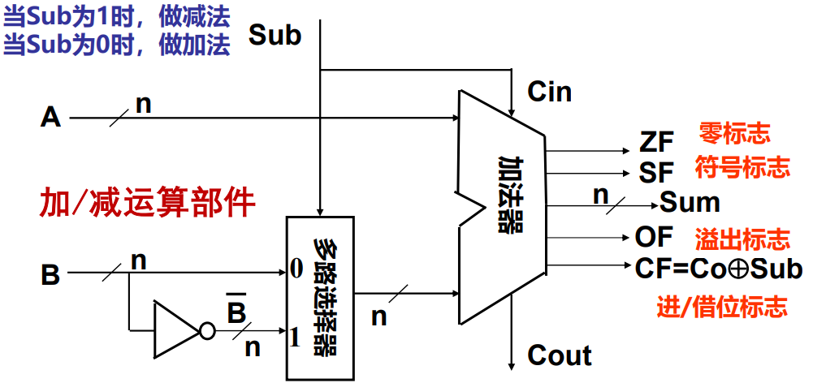

# 运算电路基础

**概览：**

**[:question: 数字逻辑电路基础](#数字逻辑电路基础)**  
**[:question: 从 C 表达式到逻辑电路](#从-c-表达式到逻辑电路)**  
**[:question: C 语言中的各类运算](#c-语言中的各类运算)**  
**[:question: 整数加减运算](#整数加减运算)**

## 数字逻辑电路基础

_本课程介绍过于简略，深入了解需学习《数字电子技术基础》相关知识_

基本门电路：与门、或门、非门

组合逻辑部件：译码器、编码器、多路选择器、加法器等

- 一位加法器（全加器）：两个加数 A 和 B，低位进位 Cin，和为 F，向高位进位为 Cout  
  n 位加法器是由 n 个 1 位全加器组成的  
  n 位加法器无法用于 n 个带符号整数（补码）相加，无法判断溢出  
  程序中经常需要比较大小，可通过（在加法器）做减法得到的标志信息来判断。常用的标志由溢出标志 OF，符号标志 SF，零标志 ZF，进位或借位标志 CF
- 多路选择器：用来做减法控制，因为$[A-B]_补 = [A]_补 + [-B]_补，[-B]_补=\overline{[B]}_补+1$。所以可以用多路选择器根据选择的结果来判断是否需要取反加 1
- 译码器：CPU 寻址时候用，比如 32 位译码器寻址大小是$2^{32}$

CPU 中的 ALU 就是由各种组合逻辑部件组合而成的

## 从 C 表达式到逻辑电路

### C 语言基本数据类型和基本运算类型

#### 基本数据类型

- 无符号数（二进制位串）、带符号整数（补码）
- 浮点数（IEEE 754 标准）
- 位串、字符串（ASCII 码）

#### 基本运算类型

- 算术（+ - \* / % > < >= <= == !=）
- 按位（| & ~ ^）
- 逻辑（|| && !）
- 移位（<< >>）
- 扩展和截断

### 从运算类指令到运算电路

计算机实现高级语言程序中的运算步骤

- 将各类表达式编译转换为指令序列  
  例如：y = (x >> 2) + k 转换为以下指令序列：  
  sarw $2,%eax; (x >> 2)  
  addw %bx,%ax; (x >> 2 + k)
- 计算机直接执行指令来完成运算  
  控制器对指令进行译码，产生控制信号送运算电路
- 操作数在运算电路中运算  
  sarw $2,%ax：将操作数 2 和 R[ax]送移位器运算  
  addw $bx,%ax：将 R[ax]和 R[bx]送整数加法器中运算

## C 语言中的各类运算

### 算术运算

无符号数、带符号整数、浮点数的+、-、\*、/、%等运算

### 按位运算

- 按位或：|
- 按位与：&
- 按位取反：~
- 按位异或：^

### 移位运算

#### 用途

- 提取部分信息
- 扩大或缩小 2、4、8...倍

#### 操作

- 左移：x << k; 右移：x >> k
- 从运算符无法区分逻辑移位还是算术移位，这由 x 的类型确定
- 若 x 为无符号数：逻辑移位  
  高（低）位移出，低（高）位补 0，可能溢出  
  判断溢出：高位移出的是 1，则左移时发生溢出
- 若 x 位带符号数：算术移位  
  左移：高位移出，低位补 0，可能溢出  
  判断溢出：若移出的位不等于新的符号位，则溢出  
  右移：低位溢出，高位补符，可能发生有效数据丢失

```txt
例：某字长为8的机器中，x、y和z都是8位带符号整数，已知x=-81，则y=x/2=？z=2*x=？

-81 = -1010001B，机器数是10101111
y=x/2 -> x >> 1 : 11010111 -> 原码是：10101001 = -41，有效数据丢失
z=2*x -> x << 1 : 01011110 -> 原码是：01011110 = 94，溢出
```

### 逻辑运算

#### 用途

用于关系表达式的运算

#### 操作

- 或运算：||
- 与运算：&&
- 非运算：!

### 位扩展运算和截断运算

#### 用途

类型转换时可能需要数据扩展或截断

#### 操作

- 没有专门的操作运算符，根据类型转换前、后数据长短确定是扩展还是截断
- 扩展：短转长  
  无符号数：0 扩展（前面补 0）  
  带符号整数：符号扩展（前面补符）
- 截断：长转短  
  强行丢弃高位，故可能发生溢出

例 1：扩展操作

```c
short si = -32768;
unsigned short usi = si;
int i = si;
unsigned ui = usi;
在大端机器上输出si, usi, ui的十进制和十六进制的值是什么？

si = -32768   80 00
usi = 32768   80 00
i = -32768    FF FF 80 00 带符号整数：符号扩展
ui = 32768    00 00 80 00 无符号整数：0扩展
```

例 2：截断操作

```c
int i = 32768;
short si = (short)i;
int j = si;
i和j是否相等？

i = 32768       00 00 80 00
si = -32768     80 00 截断时发生了溢出，超出了16位带符号数能表示的最大值
j = -32768      FF FF 80 00
i和b不相等
```

## 整数加减运算

- C 语言程序中的整数有
  - 带符号整数：char、short、int、long 等
  - 无符号整数：unsigned char、unsigned short、unsigned int 等
- 指针、地址等通常被说明为无符号整数，因而在进行指针或地址运算时，需要进行无符号整数的加减运算
- 无符号整数和带符号整数的加、减运算电路完全一样，这个运算电路称为整数加减运算部件，基于带标志加法器实现
- 计算机中的加法器，因为只有 n 位，所以是一种模 $2^n$ 运算系统

### 整数加减运算部件

- 补码加减运算公式  
  $[A+B]_补 = [A]_补 + [B]_补 （mod 2^n）$  
  $[A-B]_补 = [A]_补 + [-B]_补 （mod 2^n）$
- 补码加减运算要点和运算步骤
  - 加减法运算统一采用加法处理
  - 符号位（最高有效位 MSB）和数值位一起参与运算
  - 直接用 Adder 实现两个数的加运算（模运算系统）  
    模是多少？运算结果高位丢弃，保留低 n 位，相等于取模 $2^n$
  - 实现减法的主要工作在于：求 $[-B]_补$ 即 $\overline{B} + 1$

<div align="left"></div>

重要认识 1：计算机中所有运算都基于加法器实现  
重要认识 2：加法器不知道所运算的是带符号数还是无符号数  
重要认识 3：加法器不判断对错，总是取低 n 位作为结果，并生成标志信息

#### 条件标志位

为什么要生成并保存标志？为了在分支指令（条件转移指令）中被用作是否转移执行的条件（if 语句）

- 各个标志含义
  - OF：溢出标志，即 A 与 B 同号，但是 sum 不同号，则 1，否则 0；$OF = C_n \oplus C_{n-1}$（$C_n$是第 n 位进位，$C_{n-1}$ 是第 n-1 位进位）
  - SF：符号标志，即 sum 的符号；$SF = F_{n-1}$（$F_{n-1}$是第 n 位的和）
  - ZF：零标志，sum 为 0 则 1，否则 0
  - CF：进/借位标志，$CF = Cout \oplus sub$
- 条件标志（Flag）在运算电路中产生，被记录到专门的寄存器中
- 存放标志的寄存器通常称为程序/状态字寄存器或标志寄存器。每个标志对应标志寄存器中的一个位。如IA-32中的EFLAGS寄存器

### 例子

#### 根据标记判断溢出

做加法时，判断溢出的条件是

- 无符号加溢出条件：CF = 1
- 带符号加溢出条件：OF = 1

例1：整数加法

```txt
若n = 8，计算107 + 46 = ？
107 =  0110 1011B
46  =  0010 1110B
+     01001 10001B

OF = 1, ZF = 0, SF = 1, CF = 0
对于无符号数：sum = 153，因为CF = 0，无溢出，结果正确
对于带符号数：sum = -103，因为OF = 1，有溢出，结果错误
```

做减法时，判断溢出的条件是

- 无符号溢出：差为负数，即借位CF = 1
- 带符号溢出，满足两个条件
  - 最高位和次高位的进位不同
  - 和的符号和加数的符号位不同

例2：整数减法

```txt
若n = 4，计算-7 - 6 = ？和-3 - 5 = ？
-7  =  1001                         -3  =  1101
-6  =  1010                         -5  =  1011
+   = 10011                         +     11000
OF = 1，ZF = 0                      OF = 0，ZF = 0
SF = 0，CF = 0                      DF = 0，CF = 0
无符号数：-7-6=9-6=3，正确           无符号数：-3-5=13-5=8，正确
带符号数：-7-6=3，溢出，错误          带符号数：-3-5=-8，正确
```

#### 根据结果判断溢出

无符号加公式：

$$
\begin{aligned}
result =
\begin{cases}
  x + y & (x+y \lt 2^n) \\
  x + y - 2^n & (2^n\leq x+y \lt 2^{n+1})
\end{cases}
\end{aligned}
$$

带符号加公式：

$$
\begin{equation}
result =
\begin{cases}
  x + y - 2^n & (2^{n-1} \leq x+y) \quad 正溢出 \\
  x + y  & (-2^{n-1} \leq x+y \lt 2^{n-1}) \quad 正常 \\
  x + y + 2^n & (x + y \lt -2^{n-1}) \quad负溢出
\end{cases}
\end{equation}
$$

无符号减公式：

$$
\begin{aligned}
result =
\begin{cases}
  x - y & (x-y \gt 0) \\
  x - y + 2^n & (x-y \lt 0)
\end{cases}
\end{aligned}
$$

带符号减公式：

$$
\begin{equation}
result =
\begin{cases}
  x - y - 2^n & (2^{n-1} \leq x-y) \quad 正溢出 \\
  x - y  & (-2^{n-1} \leq x-y \le 2^{n-1}) \quad 正常 \\
  x - y + 2^n & (x - y \lt -2^{n-1}) \quad负溢出
\end{cases}
\end{equation}
$$

例3：C语言加减法

```c
unsigned int x = 134;
unsigned int y = 246;
int m = x;
int n = y;

// 减法
unsigned int z1 = x - y;
int k1 = m - n;
// 加法
unsigned int z2 = x + y;
int k2 = m + n;

假定是8位加法器
x和m的机器数一样：1000 0110
y和n的机器数一样：1111 0110

z1和k1的机器数一样：1001 0000，CF=1，OF=0，SF=1
z1的值为144（=134-246+256，x-y<0）
k1的值为-112

z2和k2的机器数一样：0111 1100，CF=1，OF=1，SF=0
z2的值为124（=134+246-256，x+y>256）
k2的值为124（=-122+(-10)+256，m+n=-132<-128，即负溢出）
```

例4：程序判断溢出

```c
// 1. 判断无符号相加是否溢出
int uadd_ok(unsigned x, unsigned y)
{
    unsigned sum = x + y;
    return sum >= x;
}
// 2. 判断带符号相加是否溢出
int tadd_ok(int x, int y)
{
    int sum = x + y;
    int neg_over = x < 0 && y < 0 && sum >= 0;
    int pos_over = x > 0 && y > 0 && sum < 0;
    return !neg_over && !pos_over;
}
```