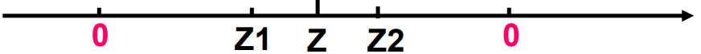

# 乘除运算及浮点数运算

**概览：**

**[:question: 整数乘法运算](#整数乘法运算)**  
**[:question: 整数除法运算](#整数除法运算)**  
**[:question: 浮点数运算](#浮点数运算)**

## 整数乘法运算

通常，高级语言种两个 n 位整数相乘得到的结果通常也是一个 n 位整数，即结果只取 2n 位乘积中的低 n 位  
例如，C 语言中，参加运算的两个操作数类型和结果类型必须一致，如果不一致则会先转换为一致的数据类型再进行计算。两个 int 型相乘，运算电路中得到的乘积是 64 位，但是赋值结果只取其低 32 位

在计算机内部，一定有 $x^2 ≥ 0$ 吗？

- 若 x 是带符号整数，则不一定
- 若 x 是浮点数，则一定

```txt
当 n = 4 时，计算5^2
    0101
  × 0101
    0101
+ 0101
00011001
结果只取低4位，值为-111B=-7，结果溢出
```

### 溢出判断规则

X\*Y 的高 n 位可以用来判断溢出，规则如下：

- 无符号：若高 n 位全为 0，则不溢出，否则溢出
- 带符号：若高 n 位全 0 或全 1 且等于低 n 位的最高位，则不溢出

### 其他要点

- 硬件不判断溢出，仅保留 2n 位乘积，供软件使用（如编译器可以使用 2n 位乘积来判断是否溢出）
- 如果程序不采用防止溢出的措施，且编译器也不生成用于溢出处理的代码，就会发生一些由于整数溢出而带来的问题
- 指令：分无符号数乘指令、带符号数乘指令
- 乘法指令的操作数长度为 n，而乘积长度为 2n，例如：
  - IA-32 中，若指令只给出一个源操作数 SRC，则另一个源操作数隐含在累加器 AL/AX/EAX 中，将 SRC 和累加器内容相乘，结果存放在 AX（16 位时）或 DX-AX（32 位时）或 EDX-EAX（64 位时）中
  - 在 MIPS 处理器中，mult 会将两个 32 位带符号整数相乘，得到的 64 位乘积置于两个 32 位内部寄存器 Hi 和 Lo 中，因此，可以根据 Hi 寄存器中的每一位是否等于 Lo 寄存器中的第一位来进行判断溢出

本节解决了概述中的[范例 5](./1-计算机系统概述.md#范例-5)

### 变量与常数的乘运算

整数乘法运算比移位和加法等运算所用时间长，通常一次乘法运算需要多个时钟周期，而一次移位、加法和减法等运算只要一个或更多的时钟周期，因此，编译器在处理变量和常数相乘时，往往以移位、加法和减法的组合运算来代替乘法

```txt
例如，对表达式x*20，编译器可以利用
20 = 16 + 4 = 2^4 + 2^2，将x*20转换为(x<<4) + x(<<2)
将一次乘法转换成了两次移位和一次加法

（不要以为自己比编译器更聪明，各种乱秀）
```

不管是无符号数还是带符号数的乘法，即使乘积溢出时，利用移位和加减运算组合的方式得到的结果都是和采用直接相乘得到的结果是一样的

## 整数除法运算

- 对于带符号整数，n 位整数除以 n 位整数，除 $-2^{n-1}/-1=2^{n-1}$会发生溢出外，其余情况都不会发生溢出。为什么？  
  因为商的绝对值不可能比除数的绝对值更大，因此不会发生溢出，也就不会像整数乘法那样发生整数溢出的漏洞
- 因为整数除法，其商也是整数，所以，在不能整除时需要进行舍入，通常按照朝 0 方向舍入，即正数商取比自身小的最接近正数（floor），负数商取比自身大的最接近整数  
  7 / 2 = 3， -7 / 2 = -3
- 整数除 0 的结果无法用一个机器数表示  
  整数除法时，除数不能为 0，否则会发生“异常”，此时，需要调出操作系统中的异常处理程序来处理

### 变量与常数的除运算

对于整数除法运算，由于计算机中除法运算比较复杂，且不能用流水线方式实现，所以一次除法运算大致需要 30 个或更多个时钟周期，比乘法指令的时间还要长

为了缩短除法运算的时间，编译器在处理一个变量与一个 2 的幂次形式的整数相除时，常采用右移运算来实现  
无符号：逻辑右移  
带符号：算术右移

除运算结果一定取整数

- 能整除时，直接右移得到结果，移出的为全 0

  ```txt
  例如，
   12/4=3   0000 1100 >> 2 = 0000 0011
  -12/4=-3  1111 0100 >> 2 = 1111 1101
  ```

- 不能整除时，右移移出的位中有非 0，需要进行相应处理。一般采用朝零舍入，即截断方式

  - 无符号数、带符号正整数（floor）：移出的低位直接丢弃
  - 带符号负整数（ceil）：加偏移量 $(2^k-1)$，然后再右移 k 位，低位截断（k 是右移位数）

  ```txt
  例如
  无符号数：14/4=3  0000 1110 >> 2 = 0000 0011
  带符号负整数：-14/4=-3
  若直接截断，则 1111 0010 >> 2 = 1111 1100 = -4 ≠ -3
  应先纠偏，再右移：k = 2, 故(-14 + 2^2 - 1)/4=-11/4
  即：1111 0010 + 0000 0011 = 1111 0101
  1111 0101 >> 2 = 111 1101 = -3
  ```

## 浮点数运算

### 浮点数运算及结果

设两个规格化浮点数分别为 $A = M_a·2^{Ea} \quad B = M_b·^{Eb}$，则：  
$A±B = (M_a±M_b·2^{-(Ea-Eb)})·2^{Ea}$ （假设$Ea ≥ Eb$）  
$A*B = (M_a*M_b)·2^{Ea+Eb}$  
$A/B = (M_a/M_b)·2^{Ea-Eb}$  
上述运算结果可能出现以下几种情况：

- 阶码上溢：一个正指数超过了最大允许值 => +∞/-∞/溢出
- 阶码下溢：一个负指数超过了最小允许值 => +0/-0
- 尾数溢出：最高有效位有进位 => 右规
- 非规格化尾数：数值部分高位为 0 => 左规 （两种尾数溢出，结果不一定溢出）

右规或对阶时，右段有效位丢失 => 尾数舍入（需运算过程中添加保护位）  
IEEE 建议实现时为每种异常情况提供一个自陷允许位。若某异常对应的位为 1，则发生相应异常时，就调用一个特定的异常处理程序执行

### IEEE754 标准规定的五种异常

1. 无效运算（无意义）
   - 运算时有一个数是非有限数，如：∞
   - 结果无效，如：源操作数是 NaN、0/0、x REM 0、∞ REMy 等
2. 除以 0（即无穷大）
3. 数太大（阶上溢）：对于 SP，指阶码 E > 1111 1110 即指数大于 127
4. 数太小（阶下溢）：对于 SP，指阶码 E < 0000 0001 即指数小于-126
5. 结果不精确（舍入时引起），例如 1/3、1/10 等不能精确表示成浮点数

上述情况硬件可以捕捉到，因此这些异常可设定让硬件处理，也可设定让软件处理。让硬件处理时，称为硬件陷阱

对于 2，与整数除以 0 不同，整数除以 0 是异常，而浮点数除以 0 是无穷大

### 浮点数加减运算

引子：十进制科学计数法的加法例子

$$
\begin{aligned}
1.123 × 10^5 + 2.560 × 10^2 &= 1.123 × 10^5 + 0.002560×10^5 \\
                            &= (1.123 + 0.00256)×10^5 \\
                            &= 1.12556 × 10^5 \\
                            &= 1.126 × 10^5（舍入）
\end{aligned}
$$

对阶：目的是使两数阶码相等

- 小阶像大阶对齐，阶小的那个数的尾数右移，右移位数等于两个阶码差的绝对值
- IEEE754 尾数右移时，要将隐含的“1”移到小数部分，高位补 0，移出的低位保留到特定的“附加位”上

那么浮点数加减法步骤是

假设：$Xm、Ym$ 分别是 $X$ 和 $Y$ 的尾数，$Xe$ 和 $Ye$ 分别是 $X、Y$ 的阶码

1. 求阶差：$Δe = Xe - Ye$（若 $Ye > Xe$，则结果的阶码为 $Ye$）
2. 对阶：将 $Xm$ 右移 $Δe$ 位，尾数变成 $Xm*2^{Xe-Ye}$（保留右移部分附加位）
3. 尾数加减：$Xm*2{Xe-Ye}±Ym$
4. 规格化：

   1. 当尾数最高位为 0，需要左规：尾数左移一次，阶码减一，直到 MSB 为 1  
      每次阶码减 1 后要判断阶码是否下溢
   2. 当尾数最高位有进位，需要右规：尾数右移一次，阶码加 1，知道 MSB 为 1  
      每次阶码加 1 后要判断阶码是否上溢

   阶码溢出异常处理：阶码上溢，则结果溢出；阶码下溢，则结果为 0

5. 如果尾数比规定位数长（有附加位），则需考虑舍入（有多种舍入方式）
6. 若运算结果尾数是 0，则需要将阶码也置 0  
   尾数为 0 说明结果应该为 0（阶码和尾数为全 0）

```txt
例：用二进制浮点数形式计算0.5 + (-0.4375) = ？
  0.4375 = 0.25 + 0.0125 + 0.0625 = 0.0111B

解：0.5 = 1.000 × 2^(-1)
   -0.4375 = -1.110 × 2^(-2)

对阶：-1.110 × 2^(-2) -> -0.111 × 2^(-1)
加减：1.000 × 2^(-1) + (-0.111 × 2^(-1)) = 0.001 × 2^(-1)
左规：0.001 × 2^(-1) -> 1.000 × 2^(-4) 
判溢出：无
最后结果：1.000 × 2^(-4) = 0.0001000 = 1/16 = 0.0625
```

问：为什么IEEE754加减运算右规时最多只需一次？  
因为即使是最大的尾数相加，得到的和和尾数也不会达到4，故尾数的整数部分最多有两位，保留一个隐含的“1”后，最多有一位被右移到小数部分

#### 附加位

“浮点数”就像一堆沙，每动一次就会失去一点“沙”，并捡回一点“脏”  
如何才能使失去的“沙”和捡回的“脏”都尽量少呢？在后面加附加位！

IEEE754规定：中间结果须在右边加两个附加位：

- 保护位（Guard）：在significand右边的位
- Round（舍入位）：在保护位右边的位

附加位的作用：用来保护对阶时右移的位运算或运算的中间结果  
附加位的处理：1. 左规时被移到significand中；2. 作为舍入依据

```txt
例：若十进制数最终有效位数为3，采用两位附加位（G、R）
2.34 * 10^2 + 2.53 * 10^0
对阶相加  
  2.34 00 * 10^2 （最后两位是保护位和舍入位）
  0.02 53 * 10^2
= 2.35 53 * 10^2 

如果没有舍入位，采用就近舍入到偶数。则对2.365进行舍入，结果就是2.36
如果有舍入位，则对2.3653舍入，53比中间数50要大，结果是2.37（精度更高）
```

### IEEE754舍入方式说明

<div align="left"></div>

假设Z是最后的运算结果，Z1和Z2是结果Z的最近的可表示的左右两个数，那么舍入后Z是Z1还是Z2呢？

舍入方式：

  1. 就近舍入：舍入为最近可表示的数  
     非中间值：0舍1入  
     中间值：强迫结果为偶数  

     ```txt
     例如：附加位为
     01：舍
     11：入
     10：强迫结果为偶数
     ```

  2. 朝+∞方向舍入（正向舍入）：舍入为Z2
  3. 朝-∞方向舍入（负向舍入）：舍入为Z1
  4. 朝0方向舍入（截断）：正数取Z1，负数取Z2

```txt
例：将同一实数分别赋值给单精度和双精度类型变量，然后打印输出
#include <stdio.h>

main()
{
  float a;
  double b;
  a = 12345.789e4;
  b = 12345.789e4;
  printf("%f\n%f\n", a, b);
}
运行结果如下：
  1234567936.000000
  1234567890.000000

为什么同一实数赋值给float和double，输出结果有所不同
因为float可精确表示7个十进制有效数位，后面的数位是舍入后的结果，舍入后的值可能更大或更小
```

### C语言中的浮点数类型

- C语言中有float和double类型，分别对应IEEE754单精度浮点数和双精度浮点数格式
- long double类型的长度和格式随编译器和处理器类型的不同而有所不同，IA-32中是80位扩展精度格式
- 从int转为float时，不会发生溢出，但可能有数据被舍入
- 从int或float转为double时，因为double的有效位数更多，故能保留精确值
- 从double转换为float和int时，可能发生溢出，此外，由于有效位数变少，故可能被舍入
- 从float或double转换为int时，因为int没有小数部分，所以数据可能会向0方向被截断

_int是31位有效数字，float是24位有效数字，double是52位有效数字_

### IEEE754的范围和精度

#### 单精度和双精度浮点数表示范围多大？

单精度浮点数（float）最大数据是：$+1.11...1×2^{127}$ 大约是 $+3.4×10^{38}$  
双精度浮点数（double）则大约是 $+1.8 × 10^{308}$

#### 判断一下关系表达式是否永真

```c
if (i == (int)((float)i)) printf("true")  // 不永真，float有效数字没有int多
if (i == (int)((double)i)) printf("true")  // 永真

if (f == (float)((int)f)) printf("true")  // 不永真，会被截断
if (f == (double)((int)f)) printf("true")  // 不永真，会被截断
```

#### 浮点数加法结合律是否正确

False!

$x = -1.5 \times 10^{38}，y = 1.5 \times 10^{38}，z = 1.0$  
$(x+y)+z = (-1.5 \times 10^{38} + 1.5 \times 10^{38}) + 1.0 = 1.0$  
$x+(y+z) = -1.5 \times 10^{38} + (1.5 \times 10^{38} + 1.0) = 0.0$