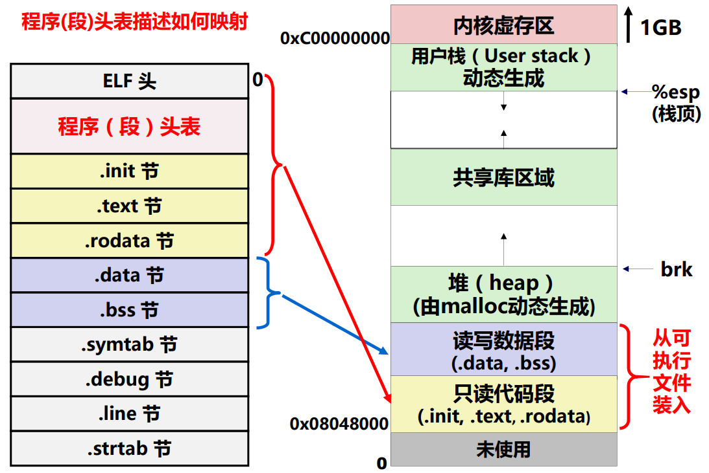
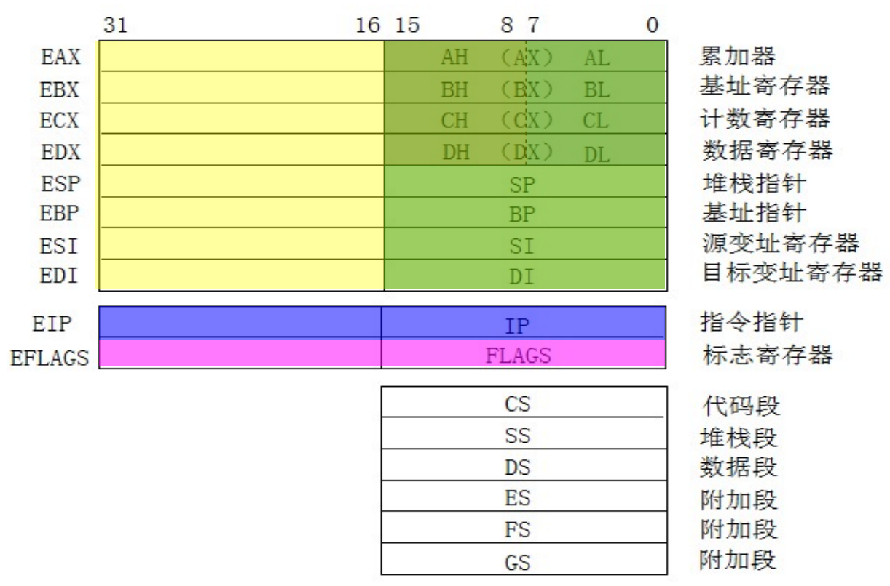
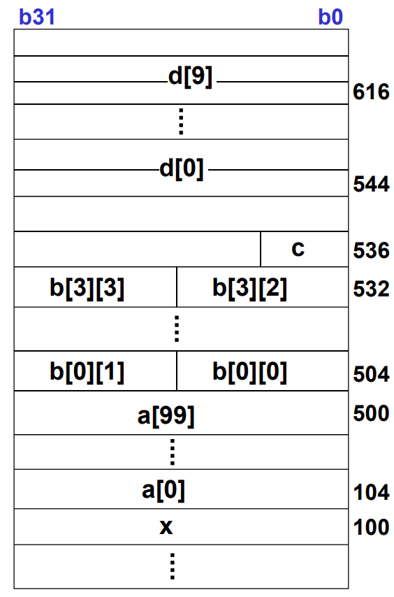

# IA-32 指令系统概述

**概览：**

**[:question: 程序转换概述](#程序转换概述)**  
**[:question: IA-32 体系结构概述](#ia-32-体系结构概述)**

## 程序转换概述

计算机的工作过程是：取指、译码、执行、回写

### “指令”的概念

- 计算机中的指令有微指令、机器指令和伪（宏）指令之分
- 机器指令处于硬件和软件的交界面  
  `相当于一个菜谱指定的一个完整做菜过程`
- 微指令是微程序级命令，属于硬件范畴  
  `相当于洗、切、煮、炒等做菜“微过程”`
- 伪指令是由若干机器指令组成的指令序列，属于软件范畴  
  `相当于由多个菜谱合成一个“大菜”的过程`
- 汇编指令是机器指令的汇编表示形式，即符号表示
- 机器指令和汇编指令一一对应，它们都与具体机器结构有关，都属于机器级指令

### 机器级指令

- 机器指令和汇编指令一一对应，都是机器级指令
- 机器指令是一个 0/1 序列，由若干字段组成  
  如 `10001000 01 001 001 11111010`分别是操作码、寻址方式、寄存器编号、立即数
- 汇编指令是机器指令的符号表示（可能有不同格式）  
  比如 intel 格式 `mov [bx+di-6],cl`  
  AT&T 格式 `movb %cl,-6(%bx,%di)`  
  用寄存于传送语言 RTL 表示该指令功能为 `M[R[bx]+R[di]-6]<-R[cl]`

### GCC 使用举例

[高级语言转为机器代码的过程是：预处理、编译、汇编、链接](./1-计算机系统概述.md#程序开发和执行过程#高级语言)

```c
// test.c
int add(int i, int j)
{
    int x = i + j;
    return x;
}

// main.c
#include "test.c"
void main()
{
    add(1, 2);
}

如需要生成test执行文件，需要main函数，gcc -m32 -O0 main.c test.c -o test
如只生成可重定位目标程序，gcc -m32 -O0 -c test.c -o test.o

objdump -d test后
000011b0 <add>:
    11b0:       55                      push   %ebp
    11b1:       89 e5                   mov    %esp,%ebp
    11b3:       83 ec 10                sub    $0x10,%esp
    11b6:       e8 f1 ff ff ff          call   11ac <__x86.get_pc_thunk.ax>
    11bb:       05 39 2e 00 00          add    $0x2e39,%eax
    11c0:       8b 55 08                mov    0x8(%ebp),%edx
    11c3:       8b 45 0c                mov    0xc(%ebp),%eax
    11c6:       01 d0                   add    %edx,%eax
    11c8:       89 45 fc                mov    %eax,-0x4(%ebp)
    11cb:       8b 45 fc                mov    -0x4(%ebp),%eax
    11ce:       c9                      leave
    11cf:       c3                      ret

objdum -d test.o后
00000000 <add>:
   0:   55                      push   %ebp
   1:   89 e5                   mov    %esp,%ebp
   3:   83 ec 10                sub    $0x10,%esp
   6:   e8 fc ff ff ff          call   7 <add+0x7>
   b:   05 01 00 00 00          add    $0x1,%eax
  10:   8b 55 08                mov    0x8(%ebp),%edx
  13:   8b 45 0c                mov    0xc(%ebp),%eax
  16:   01 d0                   add    %edx,%eax
  18:   89 45 fc                mov    %eax,-0x4(%ebp)
  1b:   8b 45 fc                mov    -0x4(%ebp),%eax
  1e:   c9                      leave
  1f:   c3                      ret

可以看出test.o代码从地址0开始，test中代码从000011b0开始
```

### 可执行文件的存储映像

<div align="left"></div>

## IA-32 体系结构概述

IA-32 体系结构是怎么样的？

- 寄存器个数和功能？
- 寄存器宽度？
- 存储空间大小？
- 编址单位？
- 指令格式？
- 指令条数？
- 指令操作功能？
- 寻址方式？
- 大端/小端？
- 标志寄存器各位含义？
- PC 位数？
- I/O 端口编址方式？
- ......

### 概述

- x86 是 Intel 开发的一类处理器体系结构的泛称
  - 包括 Intel 8086、80286、i386 和 i486 等，因此其架构被称为“x86”
  - 由于数字不能注册为商标，因此，后来使用了可注册的名称，如 Pentium、PentiumPro、Core 2、Core i7 等
  - 现在 Intel 把 32 位 x86 架构的名称 x86-32 改称为 IA-32（IA 是 Intel Architecture）
- 由 AMD 首先提出了一个兼容 IA-32 指令集的 64 位版本
  - 扩充了指令及寄存器长度的个数等，更新了参数传送方式
  - AMD 称其为 AMD64，Intel 称其为 Intl64（不同于 IA64，IA64 是一个不兼容的版本，失败了）
  - 命名为"x86-64"，有时简称为 x64

### 计算机中数据的存储

数据存储一般主要存储在两个地方，CPU 的通用寄存器组中和主存中

指令需要给出的信息：

- 操作性质（操作码）
- 源操作数 1 和/或 源操作数 2 （立即数、寄存器编号、存储地址）
- 目的操作数地址 （寄存器编号、存储地址）

其中存储地址的描述与操作数的数据结构有关

### IA-32 体系结构

IA-32 是典型的 CISC（复杂指令集计算机）风格 ISA

- 8 个通用寄存器（8 位、16 位、32 位）
- 2 个专用寄存器：EIP（PC）、标志寄存器 EFLAGS
- 6 个段寄存器（间接给出段基址）
- 存储器地址空间为 4GB，按字节编址，小端方式
- 寻址方式
  - 立即、寄存器、存储器
  - 相对寻址
- 变长指令字、变长操作码

#### IA-32 支持的数据类型及格式

IA-32 架构由 16 位架构发展而来，因此，虽然字长是 32 位，但一个字为 16 位，长度后缀为 w；32 位为双字，长度后缀为 l

| C 语言声明               | Intel 操作数类型 | 汇编指令长度后缀 | 存储长度（位） |
| ------------------------ | ---------------- | ---------------- | -------------- |
| (unsigned) char          | 整数/字节        | b                | 8              |
| (unsigned) short         | 整数/节          | w                | 16             |
| (unsigned) int           | 整数/双字        | l                | 32             |
| (unsigned) long int      | 整数/双字        | l                | 32             |
| (unsigned) long long int | -                | -                | 2×32           |
| char\*                   | 整数/双字        | l                | 32             |
| float                    | 单精度浮点数     | s                | 32             |
| double                   | 双精度浮点数     | l                | 64             |
| long double              | 双精度浮点数     | t                | 80/96          |

long double 实际长度为 80 位，但分配 96 位=12B，按 4B 对齐

#### IA-32 寄存器组织

<div align="left"></div>

以累加器寄存器为例，8 位寄存器是 AL，扩展到 16 位是 AX，32 位就是 EAX。这反映了体系结构发展的轨迹，字长不断扩充，指令保持兼容

#### IA-32 的寻址方式

- 寻址方式  
  如何根据指令给定信息得到操作数或操作数地址
- 操作数所在位置
  - 指令中：立即寻址
  - 寄存器中：寄存器寻址
  - 存储单元中（属于存储器操作数，按字节编址）：其他寻址方式
- 存储器操作数的寻址方式与微处理器的工作模式有关
  - 两种工作模式：实地址模式和保护模式
- 实地址模式（基本用不到）
  - 为与 8086/8088 兼容而设，加电或复位时
  - 寻址空间为 1MB，20 位地址：(CS) << 4 + (IP)
- 保护模式（重点）
  - 加电后进入，采用虚拟存储管理，多任务情况下隔离、保护
  - 80286 以上微处理器的工作模式
  - 寻址空间为$2^{32}$B，32 位线性地址分段（段基址+段内偏移量）

保护模式下的寻址方式

| 寻址方式             | 说明                          |
| -------------------- | ----------------------------- |
| 立即寻址             | 指令直接给出操作数            |
| 寄存器寻址           | 指定的寄存器 R 的内容为操作数 |
| 位移                 | LA = (SR) + A                 |
| 基址寻址             | LA = (SR) + (B)               |
| 基址加位移           | LA = (SR) + (B) + A           |
| 比例变址加位移       | LA = (SR) + (I)×S + A         |
| 基址加变址加位移     | LA = (SR) + (B) + (I) + A     |
| 基址加比例变址加位移 | LA = (SR) + (B) + (I)×S + A   |
| 相对寻址             | LA = (PC) + A                 |

> - LA：线性地址
> - (X)：X 的内容
> - SR：段寄存器（间接确定操作数所在段的段基址）
> - PC：程序计数器
> - R：寄存器
> - A：指令中给定地址段的位移量
> - B：基址寄存器
> - I：变址寄存器
> - S：比例系数

例子：存储器操作数的寻址方式

linux 中，double 型变量按 4B 边界对齐；windows 系统中，double 型按 8B 边界对齐

```c
int x;
float a[100];
short b[4][4];
char c;
double d[10];
```

问：a[i]，b[i\][j]，d[i]的地址如何计算，应采用什么寻址方式

<div align="left"></div>

a[i]的地址是 104+i×4，当 i=99 时，104+99×4=500  
采用比例变址+位移

b[i\][j]的地址是 504+i×8+j×2，当 i=3、j=2 时，504+24+4=532  
采用基址+比例变址+位移

d[i]的地址是 544+i×8，当 i=9 时，544+9×8=616  
采用比例变址+位移
