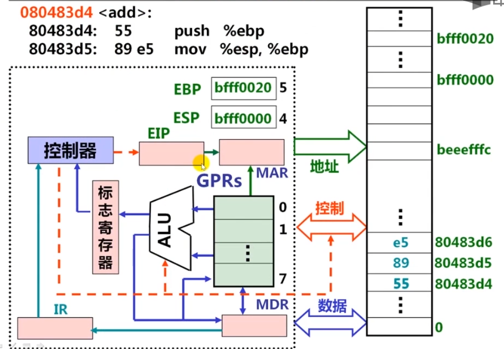
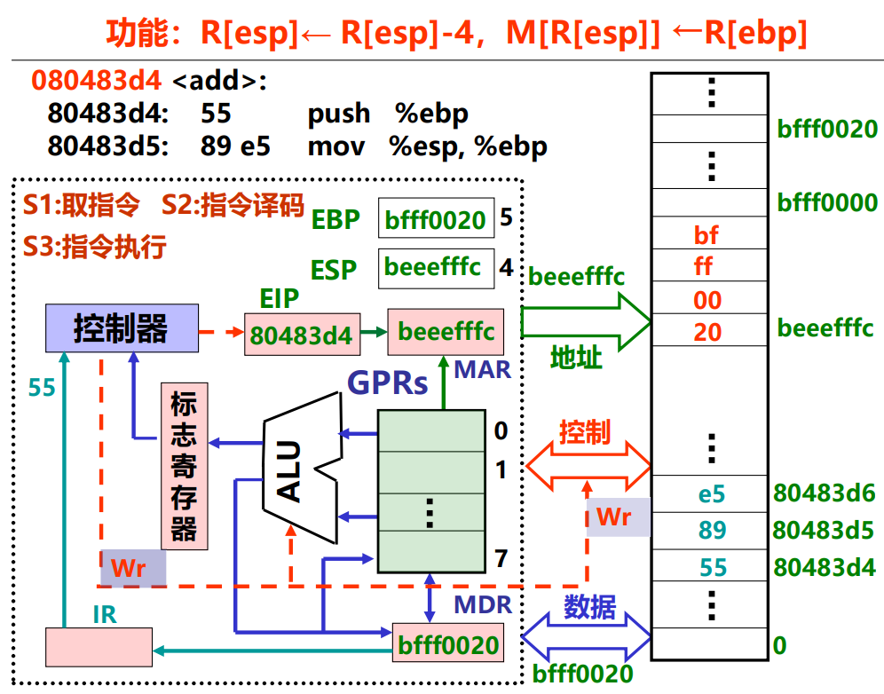

# IA-32 指令类型

**概览：**

**[:question: 传送指令](#传送指令)**  
**[:question: 定点算术运算指令](#定点算术运算指令)**  
**[:question: 按位运算指令](#按位运算指令)**  
**[:question: 控制转移指令](#控制转移指令)**  
**[:question: x87 浮点处理指令](#x87-浮点处理指令)**  
**[:question: MMX 及 SSE 指令集](#mmx-及-sse-指令集)**

## 传送指令

- 通用传送指令
  - MOV：一般传送，包括 movb、movw 和 movl 等
  - MOVS：符号扩展传送，如 movsbw、movswl 等
  - MOVZ：零扩展传送，movzwl、movzbl 等
  - XCHG：数据交换
  - PUSH/POP：入栈/出栈，如 pushl，pushw，popl，popw 等
- 地址传送指令
  - LEA：加载有效地址，如 leal (%exa,%eax), %eax 的功能为  
    R[exa] = R[edx] + R[eax]  
    执行前，若 R[edx] = i，R[eax] = j  
    执行后，R[eax] = i + j
- 输入输出指令
  - IN 和 OUT：I/O 端口与寄存器之间的交换
- 标志传送指令
  - PUSHF、POPF：将 EFLAG 压栈，或将栈顶内容送 EFLAG

### 栈

栈是一种采用“先进后出”方式进行访问一块存储区，用于嵌套过程调用。从高地址向低地址增长  
栈不等于堆栈，堆栈是由堆和栈组成的

栈的操作由入栈（pushw %ax）和出栈（popw %ax）组成  
栈顶指针是 SP  
对于 Intel 架构来说，如果使用 pushw 时，AH 在高地址，AL 在低地址，这是因为采用的小端方式

### 指令执行过程举例

```s
080483d4 <add>:                              RTL描述
80483d4: 55         push %ebp                R[esp]=R[esp]-4, M[R[esp]]=R[ebp]
80483d5: 89 e5      mov %esp, %ebp           R[ebp]=R[esp]
80483d7: 83 ec 10   sub $0x10, %esp
80483da: 8b 45 0c   mov 0xc(%ebp), %eax
80483dd: 8b 55 08   mov 0x8(%ebp), %edx
80483e0: 8d 04 02   lea (%edx,%eax,1), %eax
80483e3: 89 45 fc   mov %eax, -0x4(%ebp)
80483e6: 8b 45 fc   mov -0x4(%ebp), %eax
80483e9: c9         leave
80483ea: c3         ret
```

执行 add 时，起始 EIP=？起始 EIP=080483d4  
假设执行时初始状态如下：

<div align="left"></div>

开始执行，EIP=80483d4，送到 MAR，通过地址总线和控制总线读取该地址内容"5589e583"，再传到 MDR，送入 IR，通过译码后得知命令是 push %ebp，执行该指令后，ESP=beeefffc，内存中该地址的内容变成 R[ebp]即 bfff0020（如下图，小端模式）

<div align="left"></div>

再执行下一条指令 EIP=80483d5，如此反复

### 传送指令举例

将以下 Intel 格式指令转换为 AT&T 格式指令，并说明功能

```s
push    ebp
mov     ebp, esp
mov     edx, DWORD PTR [ebp+8]
mov     bl, 255
mov     ax, WORD PTR [ebp+edx*4+8]
mov     WORD PTR [ebp+20], dx
lea     eax, [ecx+edx*4+8]

pushl   %ebp                // R[esp]=R[esp]-4, M[R[esp]]=R[ebp]，双字
movl    %esp,%sbp           // R[ebp]=R[esp]，双字
movl    8(%ebp),%edx        // R[edx]=M[R[ebp]+8]，双字
movb    $255,%bl            // R[bl]=255，字节
movw    8(%ebp,edx,4),%ax   // R[ax]=M[R[ebp]+R[edx]*4+8]，字
movw    %dx,20(%ebp)        // M[R[ebp]+20]=R[dx]，字
leal    8(%ecx,%edx+4),%eax // R[eax]=R[exc]+R[edx]*4+8，双字
```

## 定点算术运算指令

- 加/减运算（影响标志、不区分无/带符号）
  - ADD：加，包括 addb、addw、addl 等
  - SUB：减，包括 subb、subw、subl 等
- 增 1/减 1 运算（影响除 CF 标志以外的标志、不区分无/带符号）
  - INC：加，包括 incb、incw、incl 等
  - DEC：减，包括 decb、decw、decl 等
- 取负运算（影响标志、若对 0 取负，结果为 0 且 CF 清 0，否则 CF 置 1）
  - NEG：取负，包括 negb、negw、negl 等
- 比较运算（做减法得到标志、不区分无/带符号）
  - CMP：比较，包括 cmpb、cmpw、cmpl 等
- 乘/除运算（不影响标志、区分无/带符号）
  - MUL/IMUL：无符号乘/带符号乘
  - DIV/IDIV：无符号除/带符号除

汇总如下：

| 指令 |   显示操作数   | 影响的常用标志 |  操作数类型   |   AT&T 指令助记符   | 对于 C 运算符 |
| :--: | :------------: | :------------: | :-----------: | :-----------------: | :-----------: |
| ADD  |      2 个      | OF、ZF、SF、CF | 无/带符号整数 |  addb、addw、addl   |       +       |
| SUB  |      2 个      | OF、ZF、SF、CF | 无/带符号整数 |  subb、subw、subl   |       -       |
| INC  |      1 个      |   OF、ZF、SF   | 无/带符号整数 |  incb、incw、incl   |      ++       |
| DEC  |      1 个      |   OF、ZF、SF   | 无/带符号整数 |  decb、decw、decl   |      --       |
| NEG  |      1 个      |   OF、ZF、SF   | 无/带符号整数 |  negb、negw、negl   |       -       |
| CMP  |      1 个      |   OF、ZF、SF   | 无/带符号整数 |  cmpb、cmpw、cmpl   |   <,<=,>,>=   |
| MUL  | 1 个/2 个/3 个 |     OF、CF     |  无符号整数   |  mulb、mulw、mull   |      \*       |
| IMUL | 1 个/2 个/3 个 |     OF、CF     |  带符号整数   | imulb、imulw、imull |      \*       |
| DIV  |      1 个      |       无       |  无符号整数   |  divb、divw、divl   |      /,%      |
| IDIV |      1 个      |       无       |  无符号整数   | idivb、idivw、idivl |      /,%      |

### 整数乘除指令

- 乘法指令：可给出一个、两个或三个操作数
  - 若给出一个操作数 SRC，则另一个源操作数隐含在 AL/AX/EAX 中，将 SRC 和累加器内容相乘，结果存放到 AX（16 位）或 DX-AX（32 位）或 EDX-EAX（64 位）中。DX-AX 表示 32 位乘积高 16 位在 DX，低 16 位在 AX 中。n 位 ×n 位=2n 位
  - 若指令中给出两个操作数 DST 和 SRC，则将 DST 和 SRC 相乘，结果在 DST 中。n 位 ×n 位=n 位
  - 若指令中给出三个操作数 REG、SRC、IMM，则将 SRC 和立即数 IMM 相乘，结果存到 REG 中。n 位 ×n 位=n 位
- 除法指令：只明显给出除数，用 EDX-EAX 中内容除以指定的除数
  - 若为 8 位，则 16 位被除数在 AX 寄存器中，商送回 AL，余数在 AH
  - 若为 16 位，则 32 位被除数在 DX-AX 寄存器中，商送回 AX，余数在 DX
  - 若为 32 位，则 64 位被除数在 EDX-EAX 寄存器中，商送回 EAX，余数在 EDX

### 例子

#### 定点加法举例

```s
假设R[ax]=FFFAH，R[bx]=FFF0H，则执行"addw %bx,%ax"后，
AX、BX的内容是什么？
标志CF、OF、ZF、SF各是什么？
要求分别将操作数作为无符号数和带符号整数解释并验证指令执行结果

指令功能：R[ax] = R[bx] + R[ax]
R[ax] = FFFAH + FFF0H = FFEAH，BX中内容不变
CF = 1, OF = 0, ZF = 0, SF = 1
若是无符号整数运算，CF=1说明结果溢出
验证：FFFA的真值位65535-5=65530，FFF0真值为65515
     FFEA真值为65535-21=65514，溢出
若是带符号整数运算，则OF=0说明结果没有溢出
验证：FFFA的真值是-6，FFF0真值是-16
     FFEA的真值是-22=-6+(-16)，结果正确，无溢出
```

#### 定点乘法举例

```s
假设R[eax]=000000B4H，R[ebx]=00000011H，M[000000F8H]=000000A0H，请问：
（1）执行指令"mulb %bl"后
     哪些寄存器发生变化？
     是否与执行"imulb %bl"指令所发生的变化一样？
（2）指令指令"imull $-16,(%eax,%ebx,4),%eax"后
     哪些寄存器和存储单元发生变化？
     乘积的机器数和真值各是多少

解答：
（1）"mulb %bl"功能为R[ax]=R[al]×R[bl]
     R[ax] = B4H × 11H （无符号数180×17）
     乘积结果为 0000 1011 1111 0100
     R[ax] = 0BF4H，真值为3060=180×17

     "imulb %bl"功能为R[ax]=R[al]×R[bl]
     R[ax] = B4H × 11H （带无符号数-76×17）
     若R[ax] = 0BF4H，真值为3060≠-76×17
     R[al] = F4H，R[ah] = ?
     R[ax] = FAF4H，真值为-1292=-76×17
     对于带符号乘，若乘积只取低n位，则和无符号相同；若取2n位，则采用“布斯”乘法。
     所以al相同，关键是ah

（2）"imull $-16,(%eax,%ebx,4),%eax"功能为R[eax]=(-16)×M[R[eax]+R[ebx]×4]
    R[eax]+R[ebx]×4 = 000000B4H + 00000011H<<2 = 000000F8H
    R[eax] = (-16) × M[000000F8H]
           = (-16) × 000000A0H（带符号乘）
           = 16 × (0000000A0H)
           = FFFFFF60H << 4
           = FFFFF600H
    EAX中的真值为-2560
```

## 按位运算指令

- 逻辑运算
  - NOT：非，包括 notb、notw、notl 等
  - AND：与，包括 andb、andw、andl 等
  - OR：或，包括 orb、orw、orl 等
  - XOR：异或，包括 xorb、xorw、xorl 等
  - TEST：做“与”操作测试，仅影响标志
- 移位运算
  - SHL/SHR：逻辑左/右移，包括 shlb、shrw、shrl 等
  - SAL/SAR：算术左/右移，左移判断溢出，右移高位补符，包括 salb、sarw、sarl 等  
    （移位前后符号位发生变化，则 OF=1）
  - ROL/ROR：循环左/右移，包括 rolb、rorw、rorl 等
  - RCL/RCR：带进位循环左/右移，即 CF 作为操作数一部分循环移位

仅 NOT 不影响标志，其它指令 OF=CF=0，而 ZF 和 SF 则根据结果设置：若全 0，则 ZF=1；若最高位为 1，则 SF=1

### 例子

#### 逻辑运算例子

```s
假设M[0x1000]=00000F89H，M[0x1004]=00001270H，R[eax]=FF000001H，R[ecx]=00001000H
说明一下指令功能
notw %ax              R[ax] = !(0001H) = FFFEH
andl %eax,(%ecx)      M[0x1000] = 00001000H & FF000001H = 00000001H
orb 4(%ecx),%al       R[al] = 01H | 70H = 71H
xorw %ax,4(%ecx)      M[0x1004]  = 1270H ^ 0001H = 1271H
testl %eax,%ecx       不改变寄存器和存储单元内容，因为00001000H & FF000001H = 0，故ZF=1
```

#### 移位运算例子

```s
假设short型变量x被编译器分配在寄存器AX中，R[ax]=FF80H，则以下汇编代码执行后x的机器数和真值
是多少？
movw %ax,%dx        R[dx] = R[ax]
salw $2,%ax         R[ax] = 1111 1111 1000 0000 << 2 算术左移，OF=0
addl %dx,%ax        R[ax] = 1111 1110 0000 0000 + 1111 1111 1000 0000
sarw $1,%ax         R[ax] = 1111 1101 1000 0000 >> 1 = 1111 1110 1100 0000

上述代码高级语言表示是(x<<2+x)>>1即R[ax]=5x/2（左移两位是4倍，右移一位除以2）
由于算术左移前后符号位没有变化，OF=0
最后AX=FEC0H，x作为short型变量，共8位，即C0，其值为-320
验证：x=-128，5x/2=-320。结果一致
```

## 控制转移指令

指令执行可按顺序活跳转到转移目标指令处执行

- 无条件转移指令
  - JMP DST：无条件转移到目标指令 DST 处执行
- 条件转移
  - Jcc DST：cc 为条件码，根据标志（条件码）判断是否满足条件，若满足，则转移到目标指令 DST 处，否则按顺序执行
- 条件设置
  - SETcc DST：按条件码 cc 判断的结果保存到 DST（是一个 8 位寄存器）
- 调用和返回指令（用于过程调用）
  - CALL DST：返回地址 RA 入栈，转到 DST 处执行
  - RET：从栈中取出返回地址 RA,转到 RA 处执行
- 中断指令（详见 7、8 章）

### 利用标志寄存器的转移指令

#### 根据单个标志的值转移

|     指令      | 转移条件 |      说明       |
| :-----------: | :------: | :-------------: |
|   jc label    |  CF = 1  |   有进位/借位   |
|   jnc label   |  CF = 0  |   无进位/借位   |
|  je/jc label  |  ZF = 1  |   相等/等于零   |
| jne/jnz lable |  ZF = 0  | 不相等/不等于 0 |
|   js label    |  SF = 1  |     是负数      |
|   jns label   |  SF = 0  |    是非负数     |
|   jo lable    |  OF = 1  |     有溢出      |
|   jno lable   |  OF = 0  |     无溢出      |

#### 按无符号整数比较转移

|     指令      |     转移条件      |       说明       |
| :-----------: | :---------------: | :--------------: |
| ja/jnbe label | CF = 0 AND ZF = 0 | 无符号整数 A > B |
| jae/anb label | CF = 0 OR ZF = 1  | 无符号整数 A ≥ B |
| jb/jnae label | CF = 1 AND ZF = 0 | 无符号整数 A < B |
| jbe/jna label | CF = 1 OR ZF = 1  | 无符号整数 A ≤ B |

#### 按带符号整数比较转移

|     指令      |      转移条件      |       说明        |
| :-----------: | :----------------: | :---------------: |
| jg/jnle lable | SF = OF AND ZF = 0 | 带符号整数 A > B  |
| jge/jnl lable | SF = OF OR ZF = 1  | 带符号整数 A ≥ B  |
| jl/jnge lable | SF ≠ OF AND ZF = 0 | 带符号整数 A ＜ B |
| jle/jng lable | SF ≠ OF OR ZF = 1  | 带符号整数 A ≤ B  |

### 例子

本节解决了概述中的[范例 2](./1-计算机系统概述.md#范例-2)

```c
int sum(int a[], unsigned len)
{
    int i, sum = 0;
    for (i = 0; i <= len-1; ++i)
        sum += a[i];
    return sum;
}

gcc -S 的部分汇编代码如下
.L3:
  ...
  ...
.L2:
  movl    -4(%ebp), %eax
  movl    -12(%ebp), %edx
  subl    $1, %edx
  cmpl    %edx, %eax
  jbe     .L3

当len = 0 时
cmpl %edx,%eax 执行结果是CF = 1, ZF = 0, OF = 0, SF = 0
说明满足条件，应转移倒.L3
显然，对于每个i都满足条件，因为任何无符号数都比32个1小，因此循环体被不断执行，最终导致数组访问越界而发生存储器访问异常
```

## x87 浮点处理指令

### IA-32 的浮点处理架构

- IA-32 的浮点处理架构有两种
  - x87FPU 指令集（gcc 默认）
  - SSE 指令集（x86-64 架构所用）
- IA-32 中处理的浮点数有三种类型
  - flaot 类型：32 位 IEEE 754 单精度格式
  - double 类型：64 位 IEEE 754 单精度格式
  - long double 类型：80 位双精度扩展格式  
    1 位符号位 s、15 位阶码 e（偏置常数为 16383）、1 位显示首位有效位 j 和 63 位尾数 f  
    它与 IEEE 754 单精度和双精度浮点格式的一个重要区别是：它没用隐藏位，有效位数共 64 位

### x87FPU 指令集

- 早期的浮点处理器是作为 CPU 的外置协处理器出现的
- x87 FPU 特指与 x86 处理器配套的浮点协处理器架构
  - 浮点寄存器采用栈结构  
    深度为 8，宽度为 80 位，即 8 个 80 位寄存器  
    名称为 ST(0)~ST(7)，栈顶为 ST(0)，编号分别为 0~7
  - 所有浮点运算都按 80 位扩展精度进行
  - 浮点数在浮点寄存器和内存之间传送
    - float、doule、long double 型变量在内存分别用 IEEE 754 单精度、双精度和扩展精度表示，分别占 32 位（4B）、64 位（8B）和 96 位（12B，其中高 16 位无意义）
    - float、double、long double 类型变量在浮点寄存器中都用 80 位扩展精度表示
    - 从浮点寄存器到内存：80 位扩展精度转为 32 位或 64 位
    - 从内存到浮点寄存器：32 位或 64 位转为 80 位扩展精度

### x87 FPU 指令

#### 数据传送类

- 装入（转为 80 位扩展精度）
  - FLD：将数据从存储单元装入浮点寄存器栈顶 ST(0)
  - FILD：将数据从 int 型转为浮点格式后，装入浮点寄存器栈顶
- 存储（转为 IEEE 754 单精度或双精度）

  - FSTx：x 为 s/l 是，将栈顶 ST(0)转换为单/双精度格式，然后存入存储单元
  - FSTPx：弹出栈顶元素，并完成与 FSTx 相同的功能
  - FISTx：将栈顶数据从 int 型转换为浮点数格式后，存入存储单元
  - FISTP：弹出栈顶元素，并完成与 FISTx 相同的功能

  带 P 结尾指令表示操作数会出栈，也即 ST(1)变成 ST(0)

- 交换
  - FXCH：交换栈顶和次栈顶两元素
- 常数装载到栈顶
  - FLD1：装入常数 1.0
  - FLDZ：装入常数 0.0
  - FLDPI：装入常数 pi(=3.1415926...)
  - FLDL2E：装入常数 $log_2e$
  - FLDL2T：装入常数 $log_210$
  - FLDLG2：装入常数 $log_{10}2$
  - FLDLN2：装入常数 $log_e2$

#### 算术运算类

- 加法
  - FADD/FADDP：相加/相加后弹出栈
  - FIADD：按 int 类型转换后相加
- 减法

  - FSUB/FSUBP：相减/相减后弹出栈
  - FSUBR/FSUBRP：调换次序相减/相减后弹出栈
  - FISUB：按 int 类型转换后相减
  - FISUBR：按 int 类型转换并调换次序相减

  若指令未带操作数，则默认操作数为 ST(0)、ST(1)  
  带 R 后缀的指令是操作数顺序变反，如：fsub 执行 x-y，则 fsubr 执行 y-x

- 乘法
  - FMUL/FMULP：相乘/相乘后弹出栈
  - FIMUL：按 int 类型转换后相乘
- 除法
  - FDIV/FDIVP：相除/相除后弹出栈
  - FIDV：按 int 类型转换后相除
  - FDIVR/FDIVRP：调换次序相除/相除后弹出栈
  - FIDIVR：按 int 类型转换并调换次序相除

### 例子

本节解决了概述中的[范例 10](./1-计算机系统概述.md#范例-10)  
如下：

```c
#include <stdio.h>

double f(int x)
{
    return 1.0 / x;
}

void test01()
{
    double a, b;
    int i;
    a = f(10);
    b = f(10);
    i = a == b;
    printf("%d\n", i);
}

void test02()
{
    double a, b, c;
    int i;
    a = f(10);
    b = f(10);
    c = f(10);
    i = a == b;
    printf("%d\n", i);
}

int main(int argc, char** argv)
{
    test01();
    test02();
    return 0;
}
```

使用老版本 gcc -O2 编译时，`test01`输出 0，`test02`输出 1，为什么？

```c
double f(int x)
{
  return 1.0 / x;
}

反汇编得
8048328: 55         push %ebp
8048329: 89 e5      mov %esp,%ebp
804832b: d9 e8      fld1
804832d: da 75 08   fidivl 0x8(%ebp)
8048330: c9         leave
8048331: c3         ret

fld1：将常数1.0压入栈顶ST(0)
fidivl：将指定存储单元操作数M[R[ebp]+8]中的int型转为double型，再将ST(0)除以该数，并将结果存入ST(0)中
f(10)=1.0(80位扩展精度)/10(转为double)=0.1
0.1=0.00011[0011]B=0.00011 0011 0011 0011 0011 ...B（无限循环0011）

test01函数反汇编
08048334 <main>:
8048334: 55                     push %ebp
8048335: 89 e5                  mov %esp,%ebp
8048337: 83 ec 08               sub $0x8,%esp
804833a: 83 e4 f0               and $0xfffffff0,%esp
804833d: 83 ec 0c               sub $0xc,%esp
8048340: 6a 0a                  push $0xa
8048342: e8 e1 ff ff ff         call 8048328 <f> //计算a=f(10)
8048347: dd 5d f8               fstpl 0xfffffff8(%ebp) //a存入内存 80位->64位，精度损失
804834a: c7 04 24 0a 00 00 00   movl $0xa,(%esp,1)
8048351: e8 d2 ff ff ff         call 8048328 <f> //计算b=f(10) 后面比较前没有写入内存操作
8048356: dd 45 f8               fldl 0xfffffff8(%ebp) //a入栈顶 64位->80位，已经进行舍入损失精度了
8048359: 58                     pop %eax
804835a: da e9                  fucompp //比较ST(0)a和ST(1)b
804835c: df e0                  fnstsw %ax //把FPU状态字送到AX
804835e: 80 e4 45               and $0x45,%ah
8048361: 80 fc 40               cmp $0x40,%ah
8048364: 0f 94 c0               sete %al
8048367: 5a                     pop %edx
8048368: 0f b6 c0               movzbl %al,%eax
804836b: 50                     push %eax
804836c: 68 d8 83 04 08         push $0x80483d8
8048371: e8 f2 fe ff ff         call 8048268 <_init+0x38>
8048376: c9                     leave
8048377: c3                     ret

0.1是无限循环小数，无法精确表示，比较时，a舍入过而b没有舍入过，故a≠b
简单来说就是a计算之后存入了内存，有舍入，比较时候又load到浮点寄存器中，但b一直在浮点寄存器中等待比较操作

test02函数反汇编
8048342: e8 e1 ff ff ff         call 8048328 <f> //计算a
8048347: dd 5d f8               fstpl 0xfffffff8(%ebp) //把a存回内存
//a产生精度损失
804834a: c7 04 24 0a 00 00 00   movl $0xa,(%esp,1)
8048351: e8 d2 ff ff ff         call 8048328 <f> //计算b
8048356: dd 5d f0               fstpl 0xfffffff0(%ebp) //把b存回内存
//b产生精度损失
8048359: c7 04 24 0a 00 00 00   movl $0xa,(%esp,1)
8048360: e8 c3 ff ff ff         call 8048328 <f> //计算c
8048365: dd d8                  fstp %st(0)
8048367: dd 45 f8               fldl 0xfffffff8(%ebp) //从内存中载入a
804836a: dd 45 f0               fldl 0xfffffff0(%ebp) //从内存中载入b
804836d: d9 c9                  fxch %st(1)
804836f: 58                     pop %eax
8048370: da e9                  fucompp //比较a , b
8048372: df e0                  fnstsw %ax
```

test02 由于 a、b 都写回了内存，舍入结果一样，a = b

只有老版本 gcc 有这个 bug，新版本 gcc 已经没有了

## MMX 及 SSE 指令集

有 MMX 发展而来的 SSE 架构

- MMX 指令使用 8 个 64 位寄存器 MM0~MM7，借用 8 个 80 位寄存器 ST(0)~ST(7)中 64 位尾数所占的位，可同时处理 8 个字节，或 4 个字，或 2 个双字，或一个 64 位的数据
- MMX 指令并没带来 3D 游戏性能的显著提升，故推出 SSE 指令，并陆续推出 SSE2、SSE3、SSSE3 和 SSE4 等采用 SIMD 技术的指令集，这些统称为 SSE 指令集
- SSE 指令集将 80 位浮点寄存器扩充到 128 位多媒体扩展通用寄存器 XMM0~XMM7，可同时处理 16 个字节，或 8 个字，或 4 个双字（32 位整数或单精度浮点数），或两个四字的数据
- 从 SSE2 开始，还支持 128 位整数运算，或同时并行处理两个 64 位双精度浮点数

| 编号 | 8 位寄存器 | 16 位寄存器 | 32 位寄存器 | 64 位寄存器 | 128 位寄存器 |
| :--: | :--------: | :---------: | :---------: | :---------: | :----------: |
| 000  |     AL     |     AX      |     EAX     |  MM0/ST(0)  |     XMM0     |
| 001  |     CL     |     CX      |     ECX     |  MM1/ST(1)  |     XMM1     |
| 010  |     DL     |     DX      |     EDX     |  MM2/ST(2)  |     XMM2     |
| 011  |     BL     |     BX      |     EBX     |  MM3/ST(3)  |     XMM3     |
| 100  |     AH     |     SP      |     ESP     |  MM4/ST(4)  |     XMM4     |
| 101  |     CH     |     BP      |     EBP     |  MM5/ST(5)  |     XMM5     |
| 110  |     DH     |     SI      |     ESI     |  MM6/ST(6)  |     XMM6     |
| 111  |     BH     |     DI      |     EDI     |  MM7/ST(7)  |     XMM7     |

### SSE 指令（SIMD 操作）

SIMD：Single Instruction Multiple Data

```s
假设例子是循环相加，不考虑溢出，循环次数是0x4000000=2^26
// 普通指令写的程序
0484fc:  00 c3   add %al, %bl
80484fe: e2 fc   loop 80484fc <dummy_add+0xc> // 循环
循环2^26次，每次只有一个数（字节）相加，耗时22.643816s

// SMID指令写的程序
8048523: 66 0f 6f 00    movdqa (%eax), %xmm0
8048527: 66 0f 6f 0b    movdqa (%ebx), %xmm1
804852b: 66 0f fc c8    paddb %xmm0, %xmm1
804852f: e2 fc          loop 804852b <dummy_add+sse+0x1b> // 循环
循环2^26次，每次同时有128/8=16个数（字节）相加，耗时1.411588s
```

- paddb 指令（操作数在两个 xmm 寄存器中）
  - 一条指令同时完成 16 个单字节数据相加
  - 类似指令 paddw 同时完成 8 个单字数据相加
  - 类似指令 psubl 同时完成 4 个双字数据相减
- movdqa 指令
  - 将四字（128 位）从源操作数处移到目标操作数处
  - 用于在 xmm 寄存器与 128 位存储单元之间移入/移出双四字，或在两个 xmm 寄存器之间移动
  - 源操作数或目标操作数是存储器操作数时，操作数必须是 16 字节边界对齐，否则将发生一般保护性异常
- movdqu 指令
  - 在未对齐的存储单元中移入/移出双四字

_更多 SSE 指令集内容参考 intel 相关资料_
