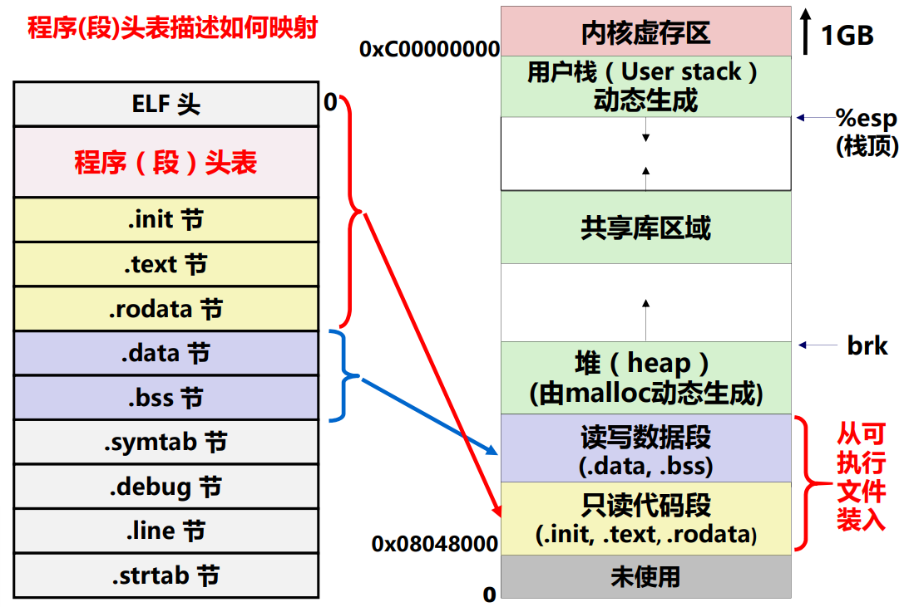

# C 语言语句的机器级表示

**概览：**

**[:question: 过程（函数）调用的机器级表示](#过程函数调用的机器级表示)**  
**[:question: 选择和循环语句的机器级表示](#选择和循环语句的机器级表示)**

## 过程（函数）调用的机器级表示

```c
int add(int x, int y)
{
    return x + y;
}

int main()
{
    int t1 = 125;
    int t2 = 80;
    int sum = add(t1, t2);
    return sum
}

1. 上述过程（函数）的调用对应的机器级代码是什么？
2. 如何将t1(125)，t2(80)分别传递给add中的形式参数x、y？
3. add函数执行的结果如何返回给caller？
```

<div align="left"></div>

参数是通过栈来传递的。栈在哪里？可执行文件的存储器映像中，有一个用户栈区

<div align="left"></div>

### 过程调用的执行步骤

P 为调用者，Q 为被调用者（如，上述例子中，P 是 main，Q 是 add）

1. P 将入口参数（实参）放到 Q 能访问的地方 _（P 过程）_
2. P 保存返回地址，然后将控制转移到 Q；CALL 指令 _（P 过程）_
3. Q 保存 P 的现场，并为自己的非静态局部变量分配空间 _（Q 过程）-准备阶段_
4. 执行 Q 的过程体（函数体）_（Q 过程）-处理阶段_
5. Q 恢复 P 的现场，释放局部变量空间 _（Q 过程）-结束阶段_
6. Q 取出返回地址，将控制转移到 P；RET 指令 _（Q 过程）-结束阶段_

- 什么是现场
  - 通用寄存器的内容
- 为什么要保存现场
  - 因为所有过程共享一套通用寄存器

### 过程调用-IA32 的寄存器使用约定

- 调用者保存寄存器：EAX、ECX、EDX
  - 当过程 P 调用过程 Q 时，Q 可以直接使用这三个寄存器，不用将它们的值保存到栈中。如果 P 在从 Q 返回后还要用这三个寄存器的话，P 应在转到 Q 之前先保存，并在从 Q 返回后恢复它们的值再使用
- 被调用者保存寄存器：EBX、ESI、EDI
  - Q 必须先将它们的值保存到栈中再使用它们，并在返回 P 之前恢复它们的值
- EBP 和 ESP 分别是帧指针寄存器和栈指针寄存器，分别用来指向当前栈帧的底部和顶部

Q：为了减少准备和结束阶段的开销，每个过程应该先使用哪些寄存器？  
EAX、ECX、EDX

### 过程（函数）的结构

一个 C 过程大致结构如下：

- 准备阶段
  - 形成帧底：push 指令和 mov 指令
  - 生成栈帧（如果需要的话）：sub 指令或 and 指令
  - 保存现场（如果有被调用者保存寄存器）：mov 指令
- 过程（函数）体
  - 分配局部变量空间，并赋值
  - 具体处理逻辑，如果遇到函数调用时
    - 准备参数：将实参送栈帧入口参数处
    - CALL 指令：保存返回地址并转到被调用函数
  - 在 EAX 中准备返回参数
- 结束阶段
  - 退栈：leave 指令或 pop 指令
  - 取返回地址返回：ret 指令

例子：

<div align="left"></div>

默认情况下，参数是从右到左入栈  
由图可知，入口参数的位置是 ESP 开始向高地址存入，比如第一个参数就是 ESP 所在的位置，第二个参数是 ESP+4 的位置。入口的参数是在调用者的栈帧里面的  
可以联想到指针传递和值传递，如果参数在被调用者栈帧，那么出栈时候，按指针传递的话，数据就会被破坏

### 例 1

```c
程序1：按指针传递                                程序2：按值传递
#include <stdio.h>                             #include <stdio.h>
void main()                                    void main()
{                                              {
    int a = 15, b = 22;                            int a = 15, b = 22;
    printf("a=%d\tb=%d\n", a, b);                  printf("a=%d\tb=%d\n", a, b);
    swap(&a, &b);                                  swap(a, b);
    printf("a=%d\tb=%d\n", a, b);                  printf("a=%d\tb=%d\n", a, b);
}                                              }

void swap(int* x, int* y)                      void swap(int x, int y)
{                                              {
    int t = *x;                                    int t = x;
    *x = *y;                                       x = y
    *y = t;                                        y = t;
}                                              }

输出：                                          输出：
a=15  b=22                                     a=15  b=22
a=22  b=15                                     a=15  b=22

汇编：
main: ......                                   main: ......
    leal    -8(%ebp),%eax                          movl    -8(%ebp),%eax
    movl    %eax,4(%esp)                           movl    %eax,4(%esp)
    leal    -4(%ebp),%eax                          movl    -4(%ebp),%eax
    movl    %eax,(%esp)                            movl    %eax,(%esp)
    call    swap                                   call    swap
    // leal是装载有效地址                            // movl 是直接取内容
    // 所以栈中其实存的是变量地址                      // 所以栈中其实存的是变量的值
    ...                                            ...
swap:                                          swap:
    pushl   %ebp                                   pushl   %ebp
    movl    %esp,%ebp                              movl    %esp,%ebp
    pushl   %ebx                                   movl    8(%ebp),%edx
    movl    8(%ebp),%edx                           // 实现：R[edx]=15
    movl    (%edx),%eax                            movl    12(%ebp),%eax
    // 以上两句实现：R[ecx]=M(&a)=15                 // 实现：R[eax]=22
    movl    12(%ebp),%eax                          movl    %eax,8(%ebp)
    movl    (%eax),%ebx                            // 实现：M[R[ebp]+8]=R[eax]=22
    // 以上两句实现：R[ebx]=M(&b)=22
    movl    %ebx,(%edx)                            movl    %edx,12(%ebp)
    // 实现：M(&a)=R[ebx]=22                        // 实现：M[R[ebp]+12]=R[edx]=15
    movl    %ecx,(%eax)
    // 实现：M(&b)=R[ecx]=15
```

### 递归函数的栈帧

```c
int nn_sum(int n)
{
    int result;
    if (n <= 0)
        result = 0;
    else
        result = n + nn_sum(n-1);
    return result;
}

nn_sum:
    pushl   %ebp
    movl    %esp,%ebp
    pushl   %ebx
    subl    $4,%esp
    movl    8(%ebp),%ebx
    movl    $0,%eax
    cmpl    $0,%ebx
    jle     .L2
    leal    -1(%ebx),%eax
    movl    %eax,(%esp)
    call    nn_sum
.L2
    addl    $4,%esp
    popl    %ebx
    popl    %ebp
    ret
```

从汇编可以看出每次递归都会增加一个栈帧，所以空间开销很大

<div align="left"></div>

每增加一次过程调用，就要增加许多条包含在准备阶段和结束阶段的额外指令，它们对程序性能的影响很大，应尽量避免不必要的过程调用，特别是递归调用  
递归调用还可能导致爆栈

### 例 2

本节解决了概述中的[范例 8](./1-计算机系统概述.md#范例-8)

```c
double fun(int i)
{
    volatile double d[1] = {3.14};
    volatile long int a[2];
    a[i] = 1073741824;
    return d[0]
}

int main(int argc, char** argv)
{
    printf("fun(0) = %f\n", fun(0));
    printf("fun(1) = %f\n", fun(1));
    printf("fun(2) = %f\n", fun(2));
    printf("fun(3) = %f\n", fun(3));
    printf("fun(4) = %f\n", fun(4));
    return 0;
}

fun(0) = 3.14
fun(1) = 3.14
fun(2) = 3.1399998664856
fun(3) = 2.00000061035156
fun(4) = 3.14，然后存储保护错
不同系统上执行的结果可能不同，比如编译器对局部变量的分配方式可能不同

fun:
    push    %ebp
    mov     %esp,%ebp
    sub     $0x10,%esp
    fldl    0x8048518
    fstpl   -0x8(%sbp)          // 以上两句是写入double值
    mov     0x8(%ebp),%eax
    movl    $0x40000000,-0x10(%ebp,%eax,4)  // 以上两句是写a[i]  0x40000000=1073741824
    fldl    -0x8(%ebp)  // return d[0]
    leave
    ret
```

<div align="left"></div>

当 i=0 或 1 时，正常写入  
当 i=2 时，写的位置是 d3~d0，使 d3~d0=0x40000000，改变了低位部分  
当 i=3 时，写的位置是 d7~d4，使 d7~d4=0x40000000，改变了高位部分  
当 i=4 时，EBP 被改变了

## 选择和循环语句的机器级表示

### 选择结构的机器级表示

### if-else 语句举例

```c
int get_cont(int* p1, int* p2)
{
    if (p1 > p2)
        return *p2;
    else
        return *p1;
}

    movl   8(%ebp),%eax     // R[eax]=M[R[ebp]+8]，即R[eax]=p1
    movl   12(%ebp),%edx    // R[edx]=p2
    cmpl   %edx,%eax        // 比较p1,p2，根据p1-p2的结果设置标志
    jbe    .L1              // 若p1 <= p2，则转L1处执行
    movl   (%edx),%eax      // R[eax]=M[R[edx]]，即R[eax]=M[p2]
    jmp    .L2              // 无条件跳转到L2执行
.L1:
    movl    (%eax),%eax     // R[eax]=M[R[eax]]，即R[eax]=M[p1]
.L2

p1和p2对应实参的存储地址分别为R[ebp]+8、R[ebp]+12，EBP指向当前栈帧底部，结果存放到EAX中
```

### swicth-case 语句举例

```c
int sw_test(int a, int b, int c)            movl    8(%ebp),%eax
{                                           subl    $10,%eax  // R[eax]=a-10
    int result;                             cmpl    $7,%eax   // if (a-10) > 7 转L5
    swicth(a)                               ja      .L5
    {                                       jmp     *.L8(,%eax,4) // 转.L8+4*i处地址
    case 15:                           .L1:  // case 15
        c = b&0x0f;                         movl    12(%ebp),%eax
    case 10:                                addl    $15,%eax
        result = c + 50;                    movl    %eax,16(%ebp)
        break;                         .L2:  // case 10
    case 12:                                movl    16(%ebp),%eax
    case 17:                                addl    $50,%eax
        result = b + 50;                    jmp     .L7
        break;                         .L3:  // case 12 17
    case 14                                 movl    12(%ebp),%eax
        result = b;                         addl    $50,%eax
        break;                              jmp     .L7
    default:                           .L4:  // case 14
        result = a;                         movl    12(%ebp),%eax
    }                                       jmp     .L7
    return result;                     .L5:  // default
}                                           addl    $10,%eax
                                       .L7:

                                        跳转表在目标文件的只读节rodata中，按4字节边界对齐
                                            .section .rodata
                                            .align   4
                                        .L8
                                            .long   .L2     10
                                            .long   .L5     11  // case没有，走default，即.L5
                                            .long   .L3     12
                                            .long   .L5     13  // case没有
                                            .long   .L4     14
                                            .long   .L1     15
                                            .long   .L5     16
                                            .long   .L3     17
可以看出如果swicth的范围相距很大的时候，比如case 10、case 200时不适合采用swcith-case
因为跳转表是连续的，会列出很多跳转项
```

## 循环结构的机器级表示

- do~while 循环的机器级表示

```c
do loop_body_statement
    while (cond_expr);

汇编伪码：
loop:
    loop_body_statement
    c = cond_expr
    if (c) goto loop
```

- while 循环的机器级表示

```c
while (cond_expr)
    loop_body_statement;

汇编伪码：
    c = cond_expr
    if (!c) goto done;
loop:
    loop_body_statement
    c = cond_expr
    if (c) goto loop
```

- for 循环的机器级表示

```c
for (begin_expr; cond_expr; update_expr)
    loop_body_statement;

汇编伪码：
    begin_expr
    c = cond_expr
    if (!c) goto done
loop:
    loop_body_statement
    update_expr
    c = cond_expr
    if (c) goto loop;
done:
```

### 循环结构与递归的比较

递归函数[nn_sum](#递归函数的栈帧)仅为说明原理，实际上可直接用公式，为说明循环的机器级表示，这里使用循环如下

```c
int nn_sum(int n)
{
    int i;
    int result = 0;
    for (i = 1; i <= 0; i++)
        result += i;
    return result;
}

movl   8(%ebp),%ecx
movl   $0,%eax
movl   $1,%edx
cmpl   $ecx,%edx
jg     .L2
addl   %edx,%eax
addl   $1,%edx
jle    .L1
.L2

i和result分别分配在EDX和EAX中
通常复杂局部变量被分配在栈中，这里都是简单变量
```

过程体重没用到被调用过程保存寄存器。因而，该过程栈帧中仅需保留 EBP，即其栈帧仅占了 4 字节空间。若栈帧按 16B 对齐，也仅用 16B，而递归方式则用了 16n 字节，是 n 倍的关系！每次递归调用都要执行 16 条指令，一共多了 n 次过程调用，因而，递归方式比循环方式至少多执行 16n 条指令  
因此，**为了提高程序性能，能用非递归方式执行则最好用非递归方式**
