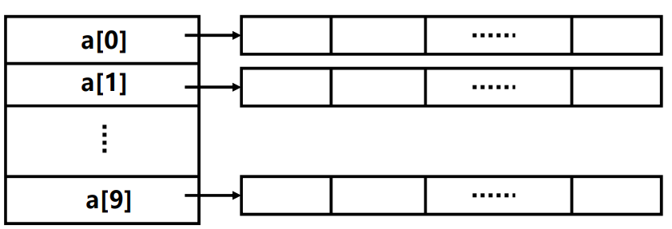
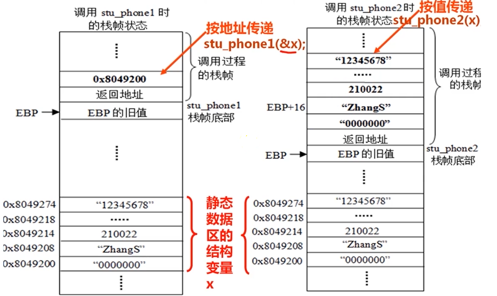
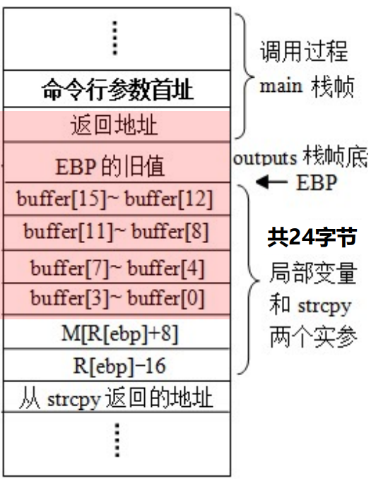

# 复杂数据类型的机器级表示

**概览：**

**[:question: 数组和指针类型的分配和访问](#数组和指针类型的分配和访问)**  
**[:question: 结构和联合数据类型的分配和访问](#结构和联合数据类型的分配和访问)**  
**[:question: 数据的对齐存放](#数据的对齐存放)**  
**[:question: 越界访问和缓冲区溢出](#越界访问和缓冲区溢出)**

## 数组和指针类型的分配和访问

### 数组的分配和访问

例如，定义一个具有 4 个元素的静态存储型 short 数据类型数组 A，可以写成`static short A[4]`  
第 i（0 <= i <= 3）个元素的地址计算公式为&A[0] + 2\*i  
假定数组 A 的首地址存放在 EDX 中，i 存放在 ECX 中，现要将 A[i]取到 AX 中，则所用的汇编指令是`movw (%edx,%ecx,2),%eax`，比例因子是 2，其中 ECX 为变址寄存器

|    数组定义     | 数组名 | 数组元素类型 | 数组元素大小（B） | 数组大小（B） | 起始地址 | 元素 i 地址  |
| :-------------: | :----: | :----------: | :---------------: | :-----------: | :------: | :----------: |
|   char s[10]    |   s    |     char     |         1         |      10       |  &s[0]   |  &s[0] + i   |
|  char\* sa[10]  |   sa   |    char\*    |         4         |      40       |  &sa[0]  | &sa[0]+4\*i  |
|  double d[10]   |   d    |    double    |         8         |      80       |  &d[0]   | &d[0] + 8\*i |
| double\* da[10] |   da   |    double    |         4         |      40       |  &d[0]   | &d[0] + 4\*i |

_32 位系统下，指针是 4B_

#### 分配在静态区的数组的初始化和访问

```c
int buf[2] = {10, 20};

int main()
{
    int i, sum = 0;
    for (i = 0; i < 2; ++i)
        sum += buf[i];
    return 0;
}

buf是在静态区分配数组，链接后，buf在可执行目标文件的数据段中分配了空间，如：
08049080 <buf>:
08049080: 0A 00 00 00 14 00 00 00
此时，buf=&buf[0]=0x08049080
编译器通常将其先存放到寄存器（如EDX）中
假定i被分配在ECX中，sum被分配在EAX中，则sum += buf[i]; 和 i++ 可用什么指令实现
addl buf(,%ecx,4),%eax 或 addl 0(%edx,%exc,4),%eax
addl $1,%ecx
```

### auto 型数组的初始化和访问

```c
int adder()
{
    int buf[2] = {10, 20};  // 局部变量分配在栈中，故首地址通过EBP来定位
    int i, sum = 0;
    for (i = 0; i < 2; ++i)
        sum += buf[i];
    return sum;
}

对buf的初始化指令是什么？
movl   $10,-8(%ebp)     // buf[0]的地址为R[ebp]-8，将10赋给buf[0]
movl   $20,-4(%ebp)     // buf[1]的地址为R[ebp]-4，将10赋给buf[1]
若将buf首地址存放到EDX中，则获得buf首地址的对应指令是什么
leal   -8(%ebp),%edx    // 装载buf[0]首地址到EDX中
```

### 数组与指针

在指针变量目标数据类型与数组类型相同的前提下，指针变量可以指向数组或数组中任意元素

```c
int a[10];
int *ptr = &a[0];

a的值就是其首地址，因而a=ptr，从而有&a[i]=ptr+i=a+i以及a[i]=ptr[i]=*(ptr+i)=*(a+i)
```

假设 A 首地址 SA 在 ECX，i 在 EDX，结果在 EAX

| 序号 |    表达式     | 类型  |   值的计算方式   |         汇编代码          |
| :--: | :-----------: | :---: | :--------------: | :-----------------------: |
|  1   |       A       | int\* |        SA        |     leal (%ecx),%eax      |
|  2   |     A[0]      |  int  |      M[SA]       |     movl (%ecx),%eax      |
|  3   |     A[i]      |  int  |    M[SA+4*i]     |  movl (%ecx,%edx,4),%eax  |
|  4   |     &A[3]     | int\* |      SA+12       |    leal 12(%ecx),%eax     |
|  5   |    &A[i]-A    |  int  | (SA+4\*i-SA)/4=i |      movl %edx,%eax       |
|  6   |    \*(A+i)    |  int  |    M[SA+4*i]     |  movl (%exc,%edx,4),%eax  |
|  7   | \*(&A[0]+i-1) |  int  |   M[SA+4*i-4]    | movl -4(%ecx,%edx,4),%eax |

序号 2、3、6 和 7 对应汇编指令都需要访存，指令中源操作数的寻址方式分别是“基址”、“基址加比例变址”和“基址加比例变址加位移”的方式，因为数组元素的类型为 int 型，故比例因子为 4

### 指针数组和多维数组

- 由若干指向同类目标的指针变量组成的数组称为指针数组
- 一个指针数组可以实现一个二维数组
- 例如：`int* a[10]`定义了一个指针数组 a，它有 10 个元素，每个元素都是一个指向 int 类型数据的指针

<div align="left"></div>

- 多维数组按行优先方式存放数组元素

```c
void test()
{
    static short num[][4] = { {2, 9, -1, 5}, {3, 8, 2, -6} };
    static short *pn[] = {num[0], num[1]};
    static short s[2] = {0, 0};
    for (int i = 0; i < 2; ++i)
        for (int j = 0; i < 4; ++j)
            s[i] += *pn[i]--;
        printf("sum of line %d : %d\n", i+1, s[i]);
}

若num=0x8049300，则num、pn和s在存储区如何存放？
08049300 <num>:
08049300: 02 00 09 00 ffff 0500 03 00 08 00 02 00 faff
08049310 <pn>:
08049310: 00 93 04 08 08 93 04 08
08049318 <s>:
08049318: 00 00 00 00

pn=&p[0]=0x8049310
p[0]=num[0]=0x8049300
p[1]=num[1]=0x8049308

若处理s[i] += *pn[i]--时i在ECX，s[i]在AX，pn[i]在EDX，则对应指令可以是什么？
movl  pn(,%edx,4),%edx
addw  (%edx),%eax
addl  $2,pn(,%edx,4)
```

## 结构和联合数据类型的分配和访问

### 结构体成员在内存中的存放和访问

- 分配在栈中的 auto 结构型变量的首地址由 EBP 或 ESP 来定位
- 分配在静态区的结构型变量首地址是一个确定的静态区地址
- 结构型变量 x 各成员首址可用“基址加偏移量”的寻址方式

```c
struct cont_info
{
    char id[8];
    char name[12];
    unsigned post;
    char address[100];
    char phone[20];
};
若变量x分配在地址0x8049200开始的区域，那么
x = &(x.id) = 0x8049200
&(x.name) = 0x8049200 + 8 = 0x8049208
&(x.post) = 0x8049200 + 8 + 12 = 0x8049214
&(x.address) = 0x8049200 + 8 + 12 + 4 = 0x8049218
&(x.phone) = 0x8049200 + 8 + 12 + 4 + 100 = 0x8049227C

若x在EDX中，则 unsigned xpost = x.post; 对应汇编是 movl 20(%edx),%eax
```

#### 结构体作为入口参数

- 当结构体变量需要作为一个函数的形参时，形参和调用函数中的实参应具有相同的结构
- 有按值传递和按地址传递两种方式
  - 若采用按值传递，则结构成员都要复制到栈中参数区，这既增加时间开销又增加空间开销，且更新后的数据无法在调用过程使用  
    `void stu_phone2(struct conf_info s_info)`
  - 通常按地址传递，即在执行 CALL 指令前，仅需传递指向结构体的指针而不需要复制每个成员到栈中  
    `void stu_phone1(struct conf_info* s_info_ptr)`

假设 x 不是局部变量，初始化为`strcut conf_info x = { "0000000", "ZhangS", 210022, "273 long street", "12345678" };`

<div align="left"></div>

```c
1. 按地址传递，取结构体的name
stu_info->name;

movl   8(%ebp),%edx
leal   8(%edx),%eax

eax中存放的是字符串"ZhangS"在静态存储区内的首地址0x8049208

2. 按值传递，x所有成员值作为实参存到参数区
stu_info.name送到EAX的指令序列为
leal   8(%ebp),%edx
leal   8(%edx),%eax
EAX中存放的是"ZhangS"的栈内参数区首地址

stu_phone1和stu_phone2功能相同，但两者的时、空开销都不一样。
后者开销大，因为它需要对结构体成员整体从静态区复制到栈中，需要很多条mov或其他指令，从而执行时间更长，并占更多栈空间和代码空间
```

### 联合体数据的分配和访问

联合体各成员共享存储空间，按最大长度成员所需大小为目标

```c
union uarea
{
    char c_data;
    short s_data;
    int i_data;
    long l_data;
};
IA-32中编译时，long和int长度一样，故uarea所占空间为4B。而对于与uarea有相同成员的结构型变量来说，
其占用空间大小至少有11个字节，对齐的话则占用更多
```

- 通常用于特殊场合，如，当事先知道某种数据结构中的不同字段的使用时间是互斥的，就可将这些字段声明为联合，以减少空间
- 但有时会得不偿失，可能只会减少少量空间却大大增加处理复杂性
- 还可以实现对相同位序列进行不同数据类型的解释

  ```c
  unsigned float2unsign(float f)
  {
    union
    {
        float f;
        unsigned u;
    }tmp_union;
    tmp_union.f = f;
    return tmp_union.u;
  }
  函数的形参是float型，按值传递参数，因而传递过来的实参是float型数据，赋值给非静态局部变量union的成员
  movl   8(%ebp),%eax
  movl   %eax,-4(%ebp)
  movl   -4(%ebp),%eax
  ```

  从该例中可以看出：机器级代码并不区分所处理对象的数据类型，不管高级语言中说明成 float 还是 int 还是 unsigned 型，都把他当成一个 0/1 序列来处理

## 数据的对齐存放

对齐是要求数据的地址是相应边界的地址

- 目前机器字长为 32/64 位，主存按一个传送单位（32/64/128 位）进行存取，但地址按字节编址
- 指令系统支持对字节、半字、字、双字的运算
- 各种不同长度的数据存放时，有两种处理方式
  - 按边界对齐（若一个字为 32 位）
    - 字地址：4 的倍数（低两位为 0）
    - 半字地址：2 的倍数（低位为 0）
    - 字节地址：任意
  - 不按边界对齐
    - 可能会增加访存次数（学了存储器组织后会理解）

若 1 个字=32 位，主存每次最多存取一个字，按字节编址，则每次只能读写某个字地址开始的 4 个单元中连续的 1、2、3 或 4 字节。比如说 int，4 个字节，地址首址是 00，那么四个字节的地址分别是 00 01 02 03，每次主存读写只能对这连续的 4 个字节中的一个或多个读写

```c
例：int i, short k, double x, char c, short j 按边界对齐和不按边界对齐对比，假设首址为00

按边界对齐：
int i    : 00 01 02 03
short k  : 04 05 XX XX （XX是占位，short按2的边界对齐，04恰好是2的倍数，double按4字节对齐，所以起始应该是08地址
double x : 08 09 10 11
           12 13 14 15 （double占8个字节）
char c   : 16 XX 18 19
short j首地址在17，short按2字节对齐，所以2的倍数，起始地址是18

不按边界对齐：
int i    : 00 01 02 03
short k  : 04 05 06 07 （06是double x的首址）
double x : 08 09 10 11
           12 13 14 15 （14是char c的首址，15是short j的首址）
           16 .. .. ..

当访问x和y时候，按边界对齐访问x，需要两个周期，访问y需要一个周期
不按边界对齐访问x需要三个周期，访问y需要两个周期

由此可见，虽然不按边界对齐节省了空间，但增加了访存次数
```

### 数据对齐策略

- 最简单的对齐策略是：按其数据长度进行对齐
  - windows 采用：int 型地址是 4 的倍数，short 型地址是 2 的倍数，double 和 long long 型是 8 的倍数，float 型是 4 的倍数，char 不对齐
  - linux 采用：short 型地址是 2 的倍数，char 不对齐，其他类型如 int、float、double 和指针都是 4 的倍数
- 结构体首址按 4 字节边界对齐，所以对于结构体数组，每个结构体最末可能需要插空，以使每个数组元素都按 4 字节边界对齐  
  如：`struct SD {char c;};` 声明一个变量`SD x`，首址按 4B 对齐，申明一个数组变量`SD y[10]`，首址按 4B 对齐，其`y[1]`也得按 4B 对齐，这样`y[0]`和`y[1]`之间可能插空 3B

```c
struct S1
{
    int i;
    char c;
    int j;
};
struct S2
{
    int i;
    int j;
    char c;
};

在要求边界对齐情况下，哪种结构声明更好？
s1：需要12字节，i：4个字节，c：1个字节，j：边界对齐后填充3个字节再使用4个字节   00 01 02 03 04 XX XX XX 08 09 10 11
s2：需要9个字节，i：4个字节，j：4个字节，c：1个字节  00 01 02 03 04 05 06 07 08 .. ..
但是对于`struct S2[d4]`，每个元素只分配9个字节不能满足对齐要求，
按结构体首址4B对齐要求来看，每个元素必须是12个字节，末尾三个字节是填充
```

### C 语言中对齐方式的设定

#### #pragma pack(n)

- 为编译器指定结构体或类内部的成员变量的对齐方式
- 当自然边界（如 int 型按 4 字节，short 型按 2 字节，float 型按 4 字节）比 n 大时，按 n 字节对齐
- 缺省或`#pragma pack()`，按自然边界对齐

#### \_\_attribute\_\_((aligned(m)))

- 为编译器指定一个结构体或类或联合体或一个单独变量（对象）的对齐方式
- 按 m 字节对齐（m 必须是 2 的幂次方），且其占用空间大小也是 m 的整数倍，以保证在申请连续存储空间时各元素也按 m 字节对齐

#### \_\_attribute\_\_((packed))

- 不按边界对齐，称为紧凑方式

#### 例 1

```c
#pragma pack(4) // 小于4的按小于的对齐，大于4的按4对齐

typedef struct
{
    uint32_t f1;
    uint8_t  f2;
    uint8_t  f3;
    uint32_t f4;
    uint64_t f5;
}__attribute__((aligned(1024))) ts;

那么sizeof(struct)=1024，按1024字节对齐
假设首址为0
&f1 = 0x0
&f2 = 0x4
&f3 = 0x5
&f4 = 0x8
&f5 = 0xC
```

#### 例 2

```c
// pragma pack(1)
struct test
{
    char x2;
    int x1;
    short x3;
    long long x4;
}__attribute__((packed));

struct test1
{
    char x2;
    int x1;
    short x3;
    long long x4;
};

struct test2
{
    char x2;
    int x1;
    short x3;
    long long x4
}__attribute__((aligned(8)))

各结构体大小如下
sizeof(test) = 15  // 紧凑型
sizeof(test1) = 20 // 按边界对齐
sizeof(test2) = 24 // 结构体按8的倍数对齐，变量20字节，8的倍数就是24

如果设置 pragma pack(1)
sizeof(test) = 15
sizeof(test1) = 15
sizeof(test2) = 16 // 其实也是15字节，但是得按8边界对齐，所以是16

如果设置 pragma pack(2)
sizeof(test) = 15
sizeof(test1) = 16 // 这里x2和x1之间有一个填充，int型4字节大于2，按2对齐
sizeof(test2) = 16
```

## 越界访问和缓冲区溢出

- C 语言程序中对数组的访问可能会有意或无意地超越数组存储区范围而无法发现
- 数组存储区可以看成是一个缓冲区，超越数组存储区范围的写入操作称为缓冲区溢出  
  例如，对于一个`char [10]`，若写一个字符串到找个缓冲区，那么只要写入的字符串多于 9 个字符（结束符`\0`占一个字节），就会发生“写溢出”
- 缓冲区溢出是一种非常普遍、非常危险的漏洞，在各种操作系统、应用软件中广泛存在
- 缓冲区溢出攻击是利用缓冲区溢出漏洞所进行的攻击。利用缓冲区溢出攻击，可能导致程序运行失败、系统关机、重新启动等后果
- 造成缓冲区溢出的原因是：没有对栈中作为缓冲区的数组的访问进行越界检查

```c
举例：利用缓冲区溢出转到自设的程序hacker去执行
void outputs(char* str)
{
    char buffer[16];
    strcpy(buffer, str);
}

void hacker(void) {}

int main(int argc, char* argv[])
{
    outputs(argv[1]);
    return 0;
}

outputs漏洞：当命令行的字符串超过25个字符时，使用strcpy函数就会使缓冲buffer造成写溢出并破坏返回地址

若strcpy复制了25个字符到buffer中，并将hacker首地址置于结束符'\0'前四个字节，则在执行strcpy后，hacker代码首址被置于main栈帧
返回地址处，当执行outputs代码ret指令时，便会转到hacker函数实施攻击
```

<div align="left"></div>
