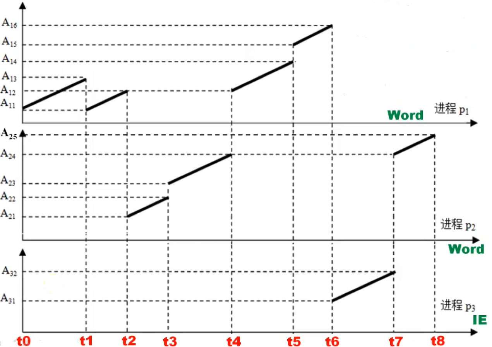
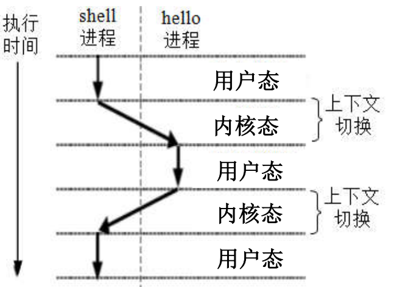
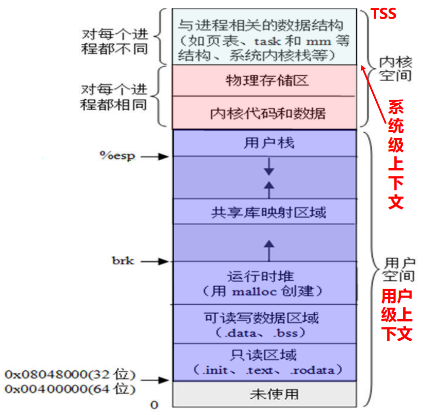
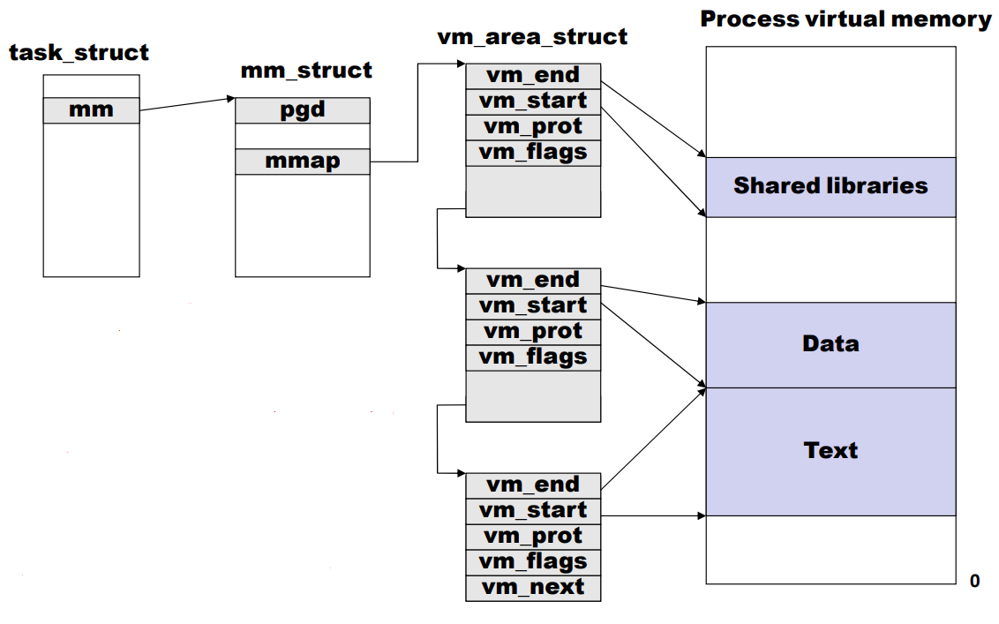
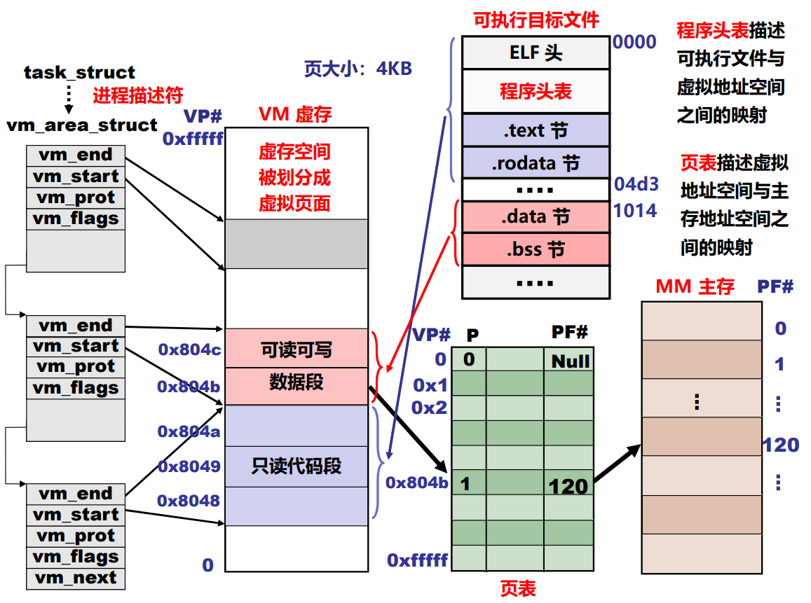
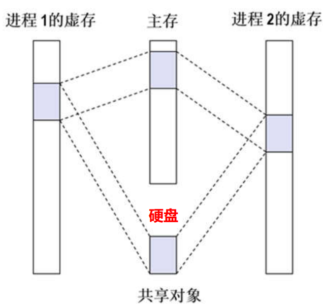
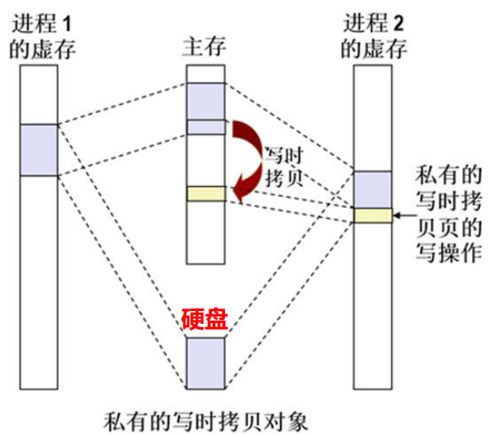

# 进程和进程的上下文切换

**概览：**

**[:question: 异常控制流的概念](#异常控制流的概念)**  
**[:question: 程序和进程](#程序和进程)**  
**[:question: 进程的逻辑控制流](#进程的逻辑控制流)**  
**[:question: 进程的上下文切换](#进程的上下文切换)**  
**[:question: 进程的存储器映射](#进程的存储器映射)**  
**[:question: 共享对象和私有对象的写时拷贝对象](#共享对象和私有对象的写时拷贝对象)**  
**[:question: 用户态和内核态](#用户态和内核态)**  
**[:question: 程序的加载和运行](#程序的加载和运行)**

## 异常控制流的概念

```c
int sum(int a[], unsigned len)
{
    int i, sum = 0;
    for (i = 0; i <= len-1; ++i)
        sum += a[i];
    return sum;
}

sum:
    ...
.L3:
    ...
    movl  -4(%ebp),%eax
    movl  12(%ebp),%edx
    subl  $1,%edx
    cmpl  %edx,%eax
    jbe   .L3
    ...
```

程序的正常执行顺序有两种：按顺序取下一条指令执行；通过 CALL/RET/Jcc/JMP 等指令跳转到转移目标地址处执行  
CPU 所执行的指令的地址序列称为 CPU 的控制流，通过上述两种方式得到的控制流为正常控制流

异常控制流：

- CPU 会因为遇到内部异常或外部中断等原因而打断程序的正常控制流，转去执行操作系统提供的针对这些特殊事件的处理程序
- 由于某些特殊情况引起用户程序的正常执行被打断所形成的意外控制流称为异常控制流
- 异常控制流形成的原因
  - 内部异常（缺页、越权、越级、整除 0、溢出等）（发生在硬件层）
  - 外部中断（Ctrl-C，打印缺纸、DMA 结束等）（发生在硬件层）
  - 进程的上下文切换（发生在操作系统层）
  - 一个进程直接发送信号给另一个进程（发生在应用软件层）

## 程序和进程

- 程序（program）指按某种方式组合形成的代码和数据集合，代码即是机器指令序列，因而程序是一种静态概念
- 进程（ process）指程序的一次运行过程。更确切说，进程是具有独立功能的一个程序关于某个数据集合的一次运行活动，因而进程具有动态含义 。同一个程序处理不同的数据就是不同的进程
  - 进程是 OS 对 CPU 执行的程序的运行过程的一种抽象。进程有自己的生命周期，它由于任务的启动而创建，随着任务的完成（或终止）而消亡，它所占用的资源也随着进程的终止而释放
  - 一个可执行目标文件（即程序）可被加载执行多次，也即，一个程序可能对应多个不同的进程

### 进程

- 操作系统（管理任务）以外的都属于“用户”的任务
- 计算机处理的所有“用户”的任务由进程完成
- 为强调进程完成的是用户的任务，通常将进程称为用户进程
- 计算机系统中的任务通常就是指进程，例如
  - linux 内核中通常把进程称为任务，每个进程主要通过一个称为进程描述符（process description）的结构来描述，其结构类型定义为 task_struct，包含了一个进程的所有信息
  - 所有进程通过一个双向循环链表实现的任务列表（task list）来描述，任务列表中每个元素都是一个进程描述符
  - IA-32 中的任务状态（TSS）、任务门（task gate）等概念中所称的任务，实际上也是指进程
- 进程的引入为应用程序提供了以下两方面的抽象
  - 一个独立的逻辑控制流  
    每个进程拥有一个独立的逻辑控制流，使得程序员以为自己的程序在执行过程中独占处理器
  - 一个私有的的虚拟地址空间  
    每个进程拥有一个私有的虚拟地址空间，使得程序员以为自己的程序在执行过程中独占存储器
- 进程的引入简化了程序员的编程以及语言处理系统的处理，即简化了编程、编译、链接、共享和加载等整个过程

## 进程的逻辑控制流

对于确定的数据集，某进程指令执行地址序列是确定的，称为进程的逻辑控制流  
对于单处理器系统，进程会轮流使用处理器，即处理器的物理控制流由多个逻辑控制流组成的

<div align="left"></div>

p1 的逻辑控制流为 A11~A13、A11~A14、A15~A16。在 A12 处被打断一次  
p2 的逻辑控制流为 A21~A22、A23~A25.在 A24 处被打断一次  
p3 的逻辑控制流仅为 A31~A32

可知：

- 逻辑控制流不会因被其它进程打断而改变，还能回到原被打断的“断点”处继续执行
- 不同进程的逻辑控制流在时间上交错或重叠的情况下称为并发（concurrency）  
  p1 和 p2、p2 和 p3 是并发执行；p1 和 p3 不是并发执行

## 进程的上下文切换

os 通过处理器调度让处理器轮流执行多个进程。实现不同进程中指令交替执行的机制称为进程的上下文切换（context switching）

如：`$./hello`，`$`是 shell 命令行提示符，说明正在运行 shell 进程

<div align="left"></div>

在一个进程的生命周期中，可能会有其他不同进程在处理器上交替运行，所以感觉到的运行时间比真实执行时间要长

处理器调度等事件会引起用户进程正常执行被打断，因而形成异常控制流  
进程的上下文切换机制很好地解决了这类异常控制流，实现了从一个进程安
全切换到另一个进程执行的过程

### 进程的“上下文”

- 进程的物理实体（代码和数据等）和支持进程运行的环境合称为进程的上下文
- 由进程的程序块、数据块、运行时的堆和用户栈（两者通称为用户堆栈）等组成的用户空间信息被称为用户级上下文
- 由进程标识信息、进程现场信息、进程控制信息和系统内核栈等组成的内核空间信息被称为系统及上下文
- 处理中各寄存器的内容被称为寄存器上下文（也称硬件上下文），即进程的现场信息
- 在进行上下文切换时，操作系统把换下的寄存器上下文保存到系统级上下文中的现场信息位置
- 用户级上下文地址空间和系统级上下文地址空间一起构成了一个进程的整个存储器映像

<div align="left"></div>

### 进程的地址空间

IA-32/Linux 平台下，每个（用户）进程具有独立的私有地址空间（虚拟地址空间）  
每个进程的地址空间划分（即存储映像）布局相同（如下图）

<div align="left"></div>

## 进程的存储器映射

存储器映射（memory mapping）是指将进程虚拟地址空间中的一个区域与硬盘上的一个对象建立关联（生成页表项），并初始化一个 vm_area_struct 结构信息

<div align="left"></div>

- task_struct 是某个进程所有相关信息的描述结构（称进程描述符），其中 mm 是其虚拟空间的描述结构
- pgd：全局页目录地址
- vm_prot：访问权限
- vm_flags：映射对象的类型

<div align="left"></div>

可用`mmap()`函数实现存储器映射  
`void *mmap(void *start, size_t length, int prot, int flags, int fd, off_t offset)`  
如何获取 mmap 函数的实参？读取可执行文件中的程序头表而获得实参

- 功能：将指定文件 fd 中偏移量 offset 开始的长度为 length 个字节的一块信息映射到虚拟空间中起始地址为 start、长度为 length 个字节的一块区域，得到 vm_area_struct 结构的信息，并初始化相应的页表项，建立文件地址和区域之间的映射关系
- prot：指定该区域内页面的访问权限位，对应 vm_area_struct 结构中的 vm_prot 字段
  - `PROT_EXE`：页面内容由指令组成
  - `PROT_READ`：区域内页面可读
  - `PROT_WRITE`：区域内页面可写
  - `PROT_NONE`：区域内页面不能被访问
- flags：指定所映射的对象类型，对应 vm_area_struct 结构中的 vm_flags 字段
  - `MAP_PRIVATE`：私有对象，采用写时拷贝技术，对应可执行文件中只读代码区域（.init、.text、.rodata）和已初始化数据区域（.data）
  - `MAP_SHARED`：共享对象，对应共享库文件中的信息
  - `MAP_ANON`：请求 0 的页，对应内核创建的匿名文件，相应页框用 0 初始化并驻留内存
  - `MAP_PRIVATE | MAP_ANON`：未初始化数据（.bss）、堆和用户栈等对应区域

虚页第一次装入内存后，不管是用普通文件还是匿名文件对其进行初始化，以后都是在主页框和硬盘中的交换文件（swap file）之间进行调进调出。交换文件由内核管理和维护，称为交换分区（swap area）或交换空间（swap space）

## 共享对象和私有对象的写时拷贝对象

### 共享库文件中的共享对象

多个进程调用共享库文件中的代码，但共享库代码在内存和硬盘都只需要一个副本

<div align="left"></div>

_注：分配的页框不一定在主存中连续，图为简化示意图_

进程 1 运行过程中，内核为共享对象分配若干页框  
进程 2 运行过程中，内核只需要将进程 2 对应区域内页表项中的页框号直接填上即可

一个进程对共享区域进行的写操作结果，对于所有共享同一个共享对象的进程都是可见的，而且结果也会反映在硬盘上对应的共享对象中

### 私有对象的写时拷贝技术

同一个可执行文件对应不同进程时，只读代码区一样，可读可写数据区开始也一样，但属于私有对象。为节省主存，多采用写时拷贝技术

采用写时拷贝技术：

1. 只读代码区在内存中只有一个副本
2. 可读可写数据区占用尽量少的页框

<div align="left"></div>

进程 1 运行过程中，内核为共享对象分配若干页框，并标记为只读  
进程 2 运行过程中，内核只需要将进程 2 对应区域内页表项中的页框号直接填上，并标记为只读  
若两个进程都只读或执行，则在内存中只有一个副本，节省主存  
若进程 2 进行写操作，则发生访问违例，此时，内核判断异常的原因是进程试图写私有的写时拷贝页，就会分配一个新页框，把内容拷贝到新页框，并修改进程 2 的页表项

## 用户态和内核态

- 为了使 OS 能够起到管理程序执行的目的，在一些时候处理器中必须运行内核代码
- 为了区分处理器运行的是用户代码还是内核代码，必须有一个状态位来标识，这个状态位称为模式位
- 处理器模式分用户模式（用户态）和内核模式（核心态）
- 用户态（也称目态）下，处理器运行用户进程，此时不允许使用特权指令
- 内核态（也称管态、核心态、管理模式、超级用户模式）下处理运行内核代码，允许使用特权指令，如：停机指令、开关中断指令、Cache 冲刷指令等

## 程序的加载和运行

- UNIX/Linux 系统中，可通过调用 execve()函数来启动加载器
- execve()函数的功能是在当前进程上下文中加载并运行一个新程序  
  `int execve(char *filename, char *argv, *envp[]);`  
  `filename`是加载并运行的可执行文件名（如`./hello`），可带参数列表`argv`和环境变量列表`envp`  
  若错误，则返回-1，并将控制权交给调用程序  
  若执行成功，则不返回，最终将控制权传递到可执行目标中的主函数`main`
- 主函数`main()`的原型：  
  `int main(int argc, char *argv[], char *envp[])或int main(int argc, char **argv, char **envp)`  
  `argc`指定参数个数，参数列表中第一个总是命令名  
  如`ld -o test main.o text.o`，`argc=5`

问：hello 程序的加载和运行过程是怎么样的？

1. 在 shell 命令行提示符后输入命令：`$./hello[enter]`
2. shell 命令行构造 argv 和 envp
3. 调用`fork()`函数，创建一个子进程，与父进程 shell 完全相同（只读/共享），包括只读代码段、可读写数据段、堆以及用户栈等
4. 调用`execve()`函数，在当前进程（新创建的子进程）的上下文中加载并运行 hello 程序。将 hello 中的.text 节、data 节、.bss 节等内容加载到当前进程的虚拟地址空间（进修改当前进程上下文中关于存储映像的一些数据结构，不从磁盘拷贝代码、数据等内容）
5. 调用 hello 程序的`main()`函数，hello 程序开始在一个进程的上下文中运行
   和运行
