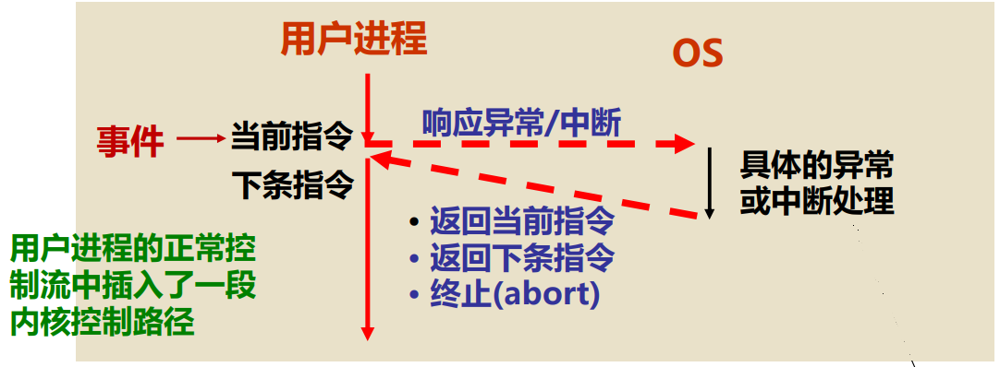

# 异常和中断

**概览：**

**[:question: 异常和中断的基本概念](#异常和中断的基本概念)**  
**[:question: 异常和中断的基本处理过程](#异常和中断的基本处理过程)**  
**[:question: 异常](#异常)**  
**[:question: 中断](#中断)**  
**[:question: 异常/中断的响应过程](#异常中断的响应过程)**

## 异常和中断的基本概念

- 程序执行过程中 CPU 会遇到一些特殊情况，使正在执行的程序被“中断”  
  CPU 中止原来正在执行的程序，转到处理异常情况或特殊事件的程序去执行，结束后再返回到原被中止的程序处（断点）继续执行
- 程序执行被“中断”的事件（在硬件层面）有两类
  - 内部 **“异常”**：在 CPU 内部发生的意外事件或特殊事件  
    按发生原因分为硬故障中断和程序性中断两类
    - 硬故障中断：如电源掉电、硬件线路故障等
    - 程序性故障：执行某条指令时发生的“例外（Exception）”事件，如溢出、缺页、越界、越权、越级、非法指令除数为 0、堆/栈溢出、访问超时、断点设置、单步、系统调用等
  - 外部 **“中断”**：在 CPU 外部发生的特殊事件，通过“中断请求”信号向 CPU 请求处理。如实时钟、控制台、打印机缺纸、外设准备好、采样计时到、DMA 传输结束等

## 异常和中断的基本处理过程

发生异常（exception）和中断（interrupt）事件后，系统将进入 OS 内核态对应事件进行处理，即改变处理器状态（用户态->内核态）

<div align="left"></div>

中断和异常处理的代码不是一个进程，而是“内核控制路径”，它代表异常或中断发生时正在运行的当前进程在内核态执行一个独立的指令序列。内核控制路径比进程更“轻”，其上下文信息比进程上下文信息少得多。而进程上下文切换后 CPU 执行的是另一个用户进程

## 异常

### 异常的分类

“异常”按处理方式分为故障、自陷和终止三类

- 故障（fault）：执行指令引起的异常事件，如溢出、缺页、堆栈溢出、访问超时等
- 陷阱（Trap）：预先安排的事件（“埋地雷”），如单步跟踪、打断点、系统调用（执行访管指令）等。是一种自愿中断
- 终止（abort）：硬故障事件，此时机器将“终止”，调出中断服务程序来重启操作系统

Q1：自陷处理完成后回到哪条指令执行？回到下条指令  
Q2：哪些故障补救后可继续执行？缺页、TLB 缺失等  
Q3：哪些故障只能终止当前进程？溢出、除数为 0、非法指令、内存保护错等

“断点”：异常处理结束后回到原来被“中断”的程序执行时的起始指令  
故障的“断点”为发生故障指令的地址  
自陷的“断点”为自陷指令的下条指令地址  
终止的“断点”随便是什么

### 故障异常

#### 举例-页故障

Q：页故障事件何时发现？如何发现？  
执行每条指令都要访存，在保护模式下，每次访存都要进行逻辑地址到物理地址的转换，在地址转换过程中发现是否发生了“页故障”

Q：页故障是软件发现还是硬件发现的？  
逻辑地址向物理地址的转换由硬件（MMU）实现，故页故障事件由硬件发现  
**所有异常和中断事件都由硬件检测发现**

以下几种情况会发生页故障

- 缺页：页表项有效位为 0（可通过都磁盘恢复故障）
- 地址越界：地址大于最大界限（不可恢复，称为段故障 segmentation fault）
- 访问越级或越权（保护违例）（不可恢复，称为段故障 segmentation fault）
  - 越级：用户进程访问内核数据（CPL=3/DPL=0）
  - 越权：读写权限不相符

```c
// 假设IA-32/linux系统钟一个C语言程序如下
int a[1000];
int x;
int main()
{
    a[10] = 1;
    a[1000] = 3;
    a[10000] = 4;
}
假设编译、汇编和链接后，第5、6和7行源代码对应的指令序列如下：
8048300: c7 05 28 90 04 08 01 00 00 00      movl $0x1, 0x8049028
8048309: c7 05 a0 9f 04 08 03 00 00 00      movl $0x3, 0x8049fa0
8048313: c7 05 40 2c 05 08 04 00 00 00      movl $0x4, 0x8052c40

已知页大小为4KB，若在运行源程序对应的进程时，系统中无其他进程在运行，则：
（1）对于上述三条指令，在取指令时是否可能发生页故障
（2）在数据访问时分别会发生什么
（3）哪些问题是可恢复的，哪些是不可恢复的

答：
（1）三条指令在读指令时，不会发生页故障。
    它们都位于起始地址0x8048000（是一个4KB页面的起始位置）的同一页面，执行这三条指令之前，该页已经调入内存。
    因为没有其他进程在系统中运行，所以不会因为执行其他进程而使得调入主存的页面被调出到磁盘。
（2）a[10] = 1；a[10]（地址0x8049028）的访问是对所在页面（首地址为0x08049000）的第一次访问，
    故不在主存，缺页处理结束后，再回到这条movl指令重新执行，再访问数据就没有问题了
    a[1000] = 3；a[1000]（地址0x8049fa0）的访问是对所在页面（首址为0x8049000）的第二次访问，
    故在主存，不会发生缺页。但a[1000]实际不存在，只不过若编译器不检查数组边界，0x8049fa0处可能
    是x的地址，所以指令执行结果可能是x被赋值为3
    a[10000] = 4；a[10000]地址0x8052c40偏离数组首地址0x8049000已达4×10000+4=40004个单元，
    即偏离了九个页面，可能超出读写控制范围，执行该指令时可能发生保护违例。页故障处理程序发送一个
    “段错误”信号（SIGSEGV）给用户进程，用户进程接收到该信号后就调出一个信号处理程序执行，该信号
    处理程序根据信号类型，在屏幕上显示“段故障（segmentation fault）”信息，并终止用户进程
```

### 陷阱异常

- 陷阱（Trap）也称自陷或陷入，执行陷阱指令时，CPU 调出特点程序进行相应处理，处理结束后返回到陷阱指令的下一条指令执行

<div align="left"></div>

- 陷阱的作用之一是在用户和内核之间提供一个像过程一样的接口，这个接口称为系统调用，用户程序利用这个接口可方便地使用操作系统内核提供的一些服务。操作系统给每个服务编一个号，称为系统调用号。例如，Linux 系统调用 fork、read 和 execve 的调用号分别是 1、3 和 11
- IA-32 处理器中的 int 指令和 sysenter 指令、MIPS 处理器中的 syscall 指令等都属于陷阱指令（相当于“地雷”）
- 陷阱指令异常称为编程异常（programmed exception），这些指令包括 INT n、int 3、into（溢出检查）、bound（地址越界检查）

#### 举例：Opening File

```c
用户程序中调用函数open(filename, options)
open函数执行陷阱指令（即系统调用指令int）
804d082: cd 80      int $0x80
804d084: 5b         pop %ebx

通过执行陷入指令int $0x80，调出OS完成一个具体的“服务”（称为系统调用）
```

#### 单步跟踪、断点设置

单步跟踪、断点设置等调试功能是如何实现的？通过“埋地雷”方式实现

利用陷阱机制可实现程序调试功能，包括设置断点和单步跟踪

- IA-32 中，当 CPU 处于单步跟踪状态（TF=1 切 IF=1）时，每条指令都被设置成了陷阱指令，执行每条指令后，都会发生中断类型号为 1 的“调试”异常，从而转去执行“单步跟踪处理程序”  
  注意：当陷阱指令是转移指令时，不能返回到转移指令的下一条指令执行，而是返回到转移目标指令执行
- IA-32 中，用于程序调试的“断点设置”陷阱指令为 int 3，对应机器码为 CCH。若调试程序在被调试程序某处设置了断点，则调试程序就在该处“加”一条 int 3 指令（该首字节）。执行到该指令时，会暂停被调试程序的运行，并发出“EXCEPTION_BREAKPOINT”异常，以调出调试程序执行，执行结束后回到被调试程序执行。

补充：IA-32 的标志寄存器中，IF（Interrupt Flag）：中断允许标志（仅对外部可屏蔽中断有用）；TF（Trap flag）：陷阱标志（是否是单步跟踪状态）

### 终止异常

硬件检测到致命错误，OS 的终止处理程序进行相应处理，并转入 abort 例程执行，以终止发生故障的进程或重启系统

## 中断

### 概念

- 外设通过中断请求信号线向 CPU 提出中断请求，不由指令引起，故中断也称异步异常
- 事件：Ctrl-C、DMA 传送结束、网络数据到达、打印缺纸等
- 每执行完一条指令，CPU 就查看中断请求引脚，若引脚的信号有效，则进行中断响应：将当前 PC（断点）和当前机器状态保存到栈中，并“关中断”，然后，从数据总线读取中断类型号，根据中断类型号跳转到对应的中断服务程序执行。中断检测及响应过程由硬件完成
- 中断服务程序执行具体的中断处理工作，中断处理完成后，再回到被打断程序的“断点”处继续执行

### 分类

Intel 将中断分成可屏蔽中断（maskable interrupt）和不可屏蔽中断（nonmaskable interrupt，NMI）

- 可屏蔽中断：通过 INTR 向 CPU 请求，可通过设置屏蔽字来屏蔽请求，若中断请求被屏蔽，则不会被送到 CPU
- 不可屏蔽中断：非常紧急的硬件故障，如：电源掉电，硬件线路故障等。通过 NMI 向 CPU 请求。一旦产生，就被立即送 CPU，以便快速处理。这种情况下，中断服务程序会尽快保存系统重要信息，然后在屏幕上显示相应的消息或直接重启系统

## 异常/中断的响应过程

检测到异常或中断时，CPU 须进行以下基本处理：

1. 关中断（“中断允许位” 清 0）：使 CPU 处于“禁止中断”状态，以防止新中断破坏断点（PC）、程序状态（PSW）和现场（通用寄存器）
2. 保护断点和程序状态：将断点和程序状态保存到栈或特殊寄存器中  
   PC→ 栈 或 EPC（专门存放断点的寄存器）  
   PSWR → 栈 或 EPSWR （专门保存程序状态的寄存器）  
   PSW（Program Status Word）：程序状态字  
   PSWR（PSW 寄存器）：如 IA-32 中的的 EFLAGS 寄存器
3. 识别中断事件  
   有软件识别和硬件识别（向量中断）两种不同的方式  
   IA-32 中，响应异常时不关中断，只在响应中断时关中断
   - 软件识别（MIPS 采用）  
     设置一个异常状态寄存器（MIPS 中为 Cause 寄存器），用于记录异常原因。操作系统使用一个统一的异常处理程序，该程序按优先级顺序查询异常状态寄存器，识别出异常事件  
     （例如：MIPS 中位于内核地址 0x8000 0180 处有一个专门的异常处理程序，用于检测异常的具体原因，然后转到内核中相应的异常处理程序段中进行具体的处理）
   - 硬件识别（IA-32 采用）  
     用专门的硬件查询电路按优先级顺序识别异常，得到“中断类型号”，根据此号，到中断向量表中读取对应的中断服务程序的入口地址  
     所有事件都被分配一个“中断类型号”，每个中断都有相应的“中断服务程序”，可根据中断类型号找到中断服务程序的入口地址  
     中断类型号相当于中断向量表的索引，表中存放中断服务程序首地址
