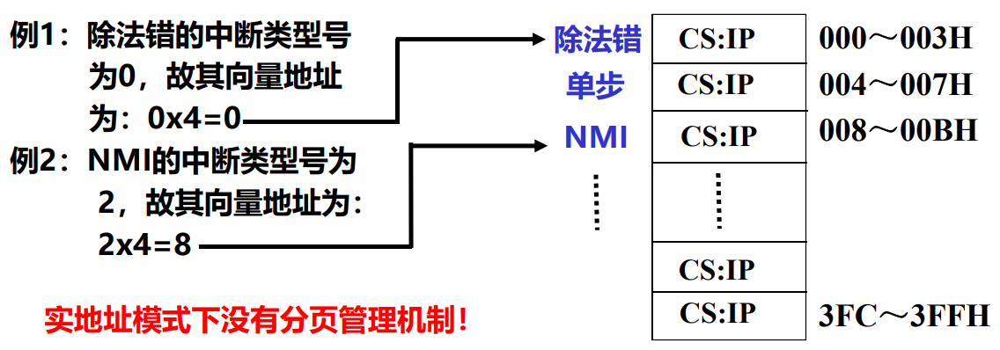
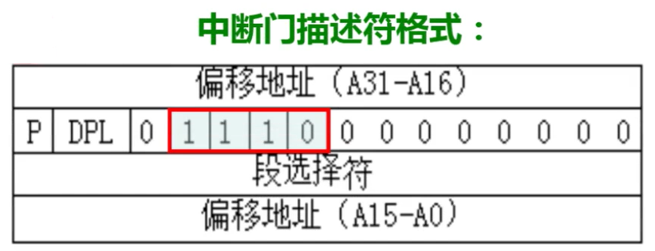

# IA-32 中的异常和中断机制

**概览：**

**[:question: IA-32 的向量中断方式](#ia-32-的向量中断方式)**  
**[:question: x86 实地址模式下异常/中断](#x86-实地址模式下异常中断)**  
**[:question: x86 保护模式下异常/中断](#x86-保护模式下异常中断)**  
**[:question: IA-32 中异常/中断的处理](#ia-32-中异常中断的处理)**  
**[:question: IA-32 中异常/中断响应过程](#ia-32-中异常中断响应过程)**  
**[:question: IA-32 中异常/中断返回过程](#ia-32-中异常中断返回过程)**

## IA-32 的向量中断方式

- 有 256 种不同类型的异常和中断
- 每个异常和中断都有唯一编号，称之为中断类型号（也称向量号）。如类型 0 为“除法错”，类型 2 为“NMI”中断，类型 14 为“缺页”
- 每个异常和中断有与其对应的异常处理程序或中断服务程序，其入口地址放在一个专门的中断向量表或中断描述符表中
- 前 32 个类型（0~31）保留给 CPU 使用，剩余的由用户自行定义（这里的用户指机器硬件的用户，即操作系统）
- 通过执行 INT n（指令第二字节给出中断类型号 n，n=32~255）使 CPU 自动转到 OS 给出的中断服务程序执行
- 实模式下，用中断向量表描述
- 保护模式下，用中断描述符表描述
- 用户自定义类型号为 32~255，部分用于可屏蔽中断，部分用于软中断
  - 可屏蔽中断通过 CPU 的 INTR 引脚向 CPU 发出中断请求
  - 软中断指令 INT n 被设定为一种陷阱指令，例如，linux 通过 int $0x80 指令将 128 号设定为系统调用，而 windows 通过 int $0x2e 指令将 46 号设为系统调用

## x86 实地址模式下异常/中断

实地址模式是 Intel 为 80286 及其之后的处理器提供的一种 8086 兼容模式。寻址空间 1MB，指令地址=CS<<4+IP  
实地址模式下，中断向量表位于 0000H~03FFH，共 256 组，每组占 4 个字节 CS:IP

中断向量表中的每一项是对应中断服务程序或异常处理程序的入口地址，被称为中断向量

- 开机后系统首先在实地址摸下工作（只有 1MB 的寻址空间）
- 开机过程中，需要先准备在实模式下的中断向量表和中断服务程序。通常，由固化在主板上一块 ROM 芯片中的 BIOS 程序完成
- BIOS 程序检测显卡、键盘、内存等，并在 00000H~003FFH 区建立中断向量表，在中断向量所指主存区建立响应的中断服务程序
- BIOS 利用 INT 指令执行特定的中断服务程序把 OS 从磁盘加载到内存中。例如，BIOS 可通过执行 int 0x19 指令来调用中断向量 0x19 对应的中断服务程序，将启动盘上的 0 号磁头对应盘面的 0 号磁道 1 号扇区中的引导程序装入内存
- BIOS（Basic Input/Output System）是基本输入/输出系统的简称，是针对具体主板设计的，与安装的操作系统无关
- BIOS 包含各种基本设备驱动程序，通过执行 BIOS 程序，基本设备驱动程序以中断服务程序的形式被加载到内存，以提供基本 I/O 系统调用
- 一旦进入保护模式，就不再使用 BIOS

## x86 保护模式下异常/中断

- 保护模式下，通过中断描述符表获取异常处理或中断服务程序入口地址
- 中断描述符表（Interrupt Descriptor Table，IDT）是 OS 内核中的一个表，共有 256 个表项，每个表项占 8 个字节，IDT 共占 2KB
- IDTR 中存放 IDT 在内存中的首地址
- 每一个表项是一个中断门描述符、陷阱门描述符或任务门描述符

段选择符用来指示异常处理程序或中断服务程序所在段的段描述符在 GDT 中的位置，其 RPL=0  
偏移地址则给出异常处理程序中中断服务程序第一条指令所在的偏移量  
P：linux 总把 P 置 1  
DPL：访问本段要求的最低特权级。主要用于防止恶意应用通过 INT n 指令模拟非法异常而进入内核态执行破坏性操作  
TYPE：标识门类型。TYPE=1110B：中断门；TYPE=1111B：陷阱门；TYPE=0101B：任务门

## IA-32 中异常中断的处理

- 引导程序被读到内存后，开始执行引导程序，以装入操作系统内核，并对 GDT、IDT 等进行初始化，系统启动后，进入保护模式
- IA-32 中，每条指令执行后，下条指令的逻辑地址（虚拟地址）由 CS 和 EIP 指示
- 每条指令执行过程中，CPU 会根据执行情况判定是否发生了某种内部异常事件，并在每条指令执行结束时判定是否发生了外部中断请求  
  （由此可见，异常事件和中断请求的检测都是在某一条指令执行过程
  中进行的，显然由硬件完成）
- 在 CPU 根据 CS 和 EIP 取下条指令之前，会根据检测的结果判断是否进
  入中断响应阶段  
  （异常和中断的响应也都是在某一条指令执行过程中或执行结束时进行
  的，显然也由硬件完成

## IA-32 中异常中断响应过程

1. 确定中断类型号 i，从 IDTR 指向的 IDT 中取出第 i 个表项 IDTi
2. 根据 IDTi 中段选择符，从 GDTR 指向的 GDT 中取出相应段描述符，得到对应异常或中断处理程序所在段的 DPL、基地址等信息。Linux 下中断门和陷阱门对应的即为内核代码段，所以 DPL 为 0，基地址为 0
3. 若 CPL<DPL 或编程异常 IDTi 的 DPL\<CPL，则发生 13 号异常。Linux 下，前者不会发生。后者用于防止恶意程序模拟 INT n 陷入内核进行破坏性操作
4. 若 CPL≠DPL，则从用户态换至内核态，以使用内核栈。切换栈的步骤：
   1. 读 TR 寄存器，以访问正在运行的用户进程的 TSS 段；
   2. 将 TSS 段中保存的内核栈的段选择符和栈指针分别装入寄存器 SS 和 ESP，然后在内核栈中保存原来用户栈的 SS 和 ESP
5. 若是故障，则将发生故障的指令的逻辑地址写入 CS 和 EIP，以使处理后回到故障指令执行。其他情况下，CS 和 EIP 不变，使处理后回到下条指令执行
6. 在当前栈中保存 EFLAGS、CS 和 EIP 寄存器的内容（断点和程序状态）
7. 若异常产生了一个硬件出错码，则将其保存在内核栈中
8. 将 IDTi 中的段选择符装入 CS，IDTi 中的偏移地址装入 EIP，它们是异常处理程序或中断服务程序第一条指令的逻辑地址（Linux 中段基址=0）
9. 下个时钟周期开始，从 CS:EIP 所指处开始执行异常或中断处理程序

## IA-32 中异常中断返回过程

中断或异常处理程序最后一条指令是 IRET。CPU 在执行 IRET 指令过程中完成以下工作：

1. 从栈中弹出硬件出错码（保存过的话）、EIP、CS 和 EFLAGS
2. 检查当前异常或中断处理程序的 CPL 是否等于 CS 中最低两位，若是则说明异常或中断响应前、后都处于同一个特权级，此时，IRET 指令完成操作；否则，再继续完成下一步工作
3. 从内核栈中弹出 SS 和 ESP，以恢复到异常或中断响应前的特权级进程所使用的栈
4. 检查 DS、ES、FS 和 GS 段寄存器的内容，若其中有某个寄存器的段选择符指向一个段描述符且其 DPL 小于 CPL，则将该段寄存器清 0。这是为了防止恶意应用程序（CPL=3）利用内核以前使用过的段寄存器（DPL=0）来访问内核地址空间

执行完 IRET 指令后，CPU 回到原来发生异常或中断的进程继续执行
