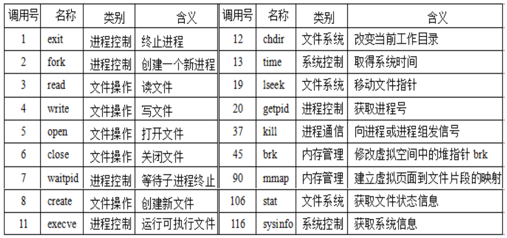

# IA-32+Linux 中异常和中断的处理

**概览：**

**[:question: Linux 中异常和中断处理](#linux-中异常和中断处理)**  
**[:question: Linux 中对中断描述符表的初始化](#linux-中对中断描述符表的初始化)**  
**[:question: Linux 中对异常的处理](#linux-中对异常的处理)**  
**[:question: Linux 中对中断的处理](#linux-中对中断的处理)**  
**[:question: Linux 中的系统调用](#linux-中的系统调用)**  
**[:question: 软中断指令 int 0x80 的执行过程](#软中断指令-int-0x80-的执行过程)**

## Linux 中异常和中断处理

- Linux 利用陷阱门来处理异常，利用中断门来处理中断
- 异常和中断对应处理程序都属于内核代码段，所以，所有中断门和陷阱门的段选择符(0x60)都指向 GDT 中的“内核代码段”描述符
- 通过中断门进入到一个中断服务程序时，CPU 会清除 EFLAGS 寄存器中的 IF 标志，即关中断；通过陷阱门进入一个异常处理程序时，CPU 不会修改 IF 标志。也就是说，外部中断不支持嵌套处理，而内部异常则支持嵌套处理
- 任务门描述符中不包含偏移地址，只包含 TSS 段选择符，这个段选择符指向 GDT 中的一个 TSS 段描述符，CPU 根据 TSS 段中的相关信息装载 SS 和 ESP 等寄存器，从而执行相应的异常处理程序
- Linux 中，将类型号为 8 的双重故障（#DF）用任务门实现，而且是唯一通过任务门实现的异常
- 双重故障 TSS 段描述符在 GDT 中位于索引值为 0x1f 的表项处，即 13 位索引为 0 0000 0001 1111，且其 TI=0（指向 GDT），RPL=00（内核级代码），即任务门描述符中的段选择符为 00F8H

## Linux 中对中断描述符表的初始化

CPU 负责对异常和中断的检测与响应，而操作系统则负责初始化 IDT 以及编制好异常处理程序或中断服务程序。Linux 运用提供的三种门描述符格式，构造了以下 5 种类型的门描述符

1. 中断门：DPL=0，TYPE=1110B。激活所有中断
2. 系统门：DPL=3，TYPE=1111B。激活 4、5 和 128 三个陷阱异常，分别对应指令 into、bound 和 int $0x80 三条指令。因 DPL 为 3，CPL≤DPL，故在用户态下可使用这三条指令
3. 系统中断门：DPL=3，TYPE=1110B。激活 3 号中断（即调试断点），对应指令 int 3。因 DPL 为 3，CPL≤DPL，故用户态下可使用 int 3 指令
4. 陷阱门：DPL=0，TYPE=1111B。激活所有内部异常，并阻止用户程序使用 INT n（n≠128 或 3）指令模拟非法异常来陷入内核态运行
5. 任务门：DPL=0，TYPE=0101B。激活 8 号中断（双重故障）

Linux 内核在启用异常和中断机制之前，先设置好 IDT 的每个表项，并把 IDT 首址存入 IDTR。系统初始化时，Linux 完成对 GDT、GDTR、IDT 和 IDTR 等的设置，以后一旦发生异常或中断，CPU 就可通过异常和中断响应机制调出异常或中断处理程序执行

## Linux 中对异常的处理

- 异常处理程序发送相应的信号给发生异常的当前进程，或者进行故障恢复，然后返回到断点处执行  
  例如，若执行了非法操作，CPU 就产生 6 号异常（#UD），在对应的异常处理程序中，向当前进程发送一个 SIGILL 信号，以通知当前进程中止运行
- 采用向发生异常的进程发送信号的机制实现异常处理，可尽快完成在内核态的异常处理过程，因为异常处理过程越长，嵌套执行异常的可能性越大，而异常嵌套执行会付出较大的代价
- 并不是所有异常处理都只是发送一个信号到发生异常的进程  
  例如，对于 14 号页故障异常（#PF），需要判断是否访问越级、越权或越界等，若发生了这些无法恢复的故障，则页故障处理程序发送 SIGSEGV 信号给发生页故障异常的进程；若只是缺页，则页故障处理程序负责把所缺失页面从磁盘装入主存，然后返回到发生缺页故障的指令继续执行

所有异常处理程序的结构是一致的，都可划分为以下三个部分：

1. 准备阶段  
   在内核栈保存通用寄存器内容（称为现场信息），这部分大多用汇编语言程序实现
2. 处理阶段  
   采用 C 函数进行具体处理。函数名又 do\_前缀和处理程序名组成，如 do_overflow 为溢出处理函数  
   大部分函数的处理方式：保存硬件出错码（如果有的话）和异常类型号，然后，向当前进程发送一个信号。当前进程接收到信号后，若有对应信号处理程序，则转信号处理程序执行；若没有，则调用内核 abort 例程执行，以终止当前进程
3. 恢复阶段  
   恢复保存在内核栈中的各个寄存器的内容，切换到用户态并返回当前进程的断点处继续执行

## Linux 中对中断的处理

- PIC 需对所有外设来的 IRQ 请求按优先级排队，若至少有一个 IRQ 线有请求且未被屏蔽，则 PIC 向 CPU 的 INTR 引脚发中断请求
- CPU 每执行完一条指令都会查询 INTR，若发现有中断请求，则进入中断响应过程（关中断、保护断点和现场、发中断查询信号），调出中断服务程序执行

所有中断服务程序的结构类似，都划分为以下三个阶段

1. 准备阶段  
   在内核栈中保存各通用寄存器的内容（称为现场信息）以及所请求 IRQi 的值等，并给 PIC 回送应答音系，允许其发送新的中断请求
2. 处理阶段  
   执行 IRQi 对应的中断服务例程 ISR （Interrupt Server Routine）。中断类型号为 32+i
3. 恢复阶段  
   恢复保存在内核栈中的各个寄存器的内容，切换到用户态并返回到当前进程的逻辑控制流的断点处继续执行

## Linux 中的系统调用

- 系统调用（陷阱）是特殊异常事件，是 OS 为用户程序提供服务的手段
- Linux 提供了几百种系统调用，主要分为以下几类：  
  进程控制、文件操作、文件系统操作、系统控制、内存管理、网络管理、用户管理、进程通信等
- 系统调用号是系统调用跳转表索引值，跳转表给出系统调用服务例程首地址

  <div align="left"></div>

- 通常，系统调用被封装成用户程序能直接调用的函数，如 exit()、read()和 open()，这些是标准 C 库中系统调用对应的封装函数
- Linux 中系统调用所用参数通过寄存器传递，传递参数的寄存器顺序依次为：EAX（调用号）、EBX、ECX、EDX、ESI、EDI 和 EBP，除调用号以外，最多 6 个参数
- 封装函数对应的机器级代码有一个统一的结构：总是若干条传送指令后跟一条陷阱指令。传送指令用来传递系统调用的参数，陷阱指令（如 int $0x80）用来陷入内核进行处理

```s
例如，若用户程序调用系统调用write(1, "hello, world!\n", 14)，
将 字符串"hello, world!\n"中14个字符显示在标准输出设备文件stdout
上，则其封装函数对应机器级代码（用汇编指令表示）如下：
movl  $4,%eax     // 调用号为4，送EAX
movl  $1,%ebx     // 标准输出设备stdout的文件描述符为1，送EBX
movl  $string,%ecx // 字符串"hello, world!\n" 首址送ECX
movl  $14,%edx    // 字符串长度为14，送EDX
int   $0x80       // 系统调用
```

## 软中断指令 int 0x80 的执行过程

它是陷阱类（编程异常）事件，因此它与异常响应过程一样

1. 将 IDTi（i=128）中段选择符（0x60）所指 GDT 中的内核代码段描述符取出， 其 DPL=0，此时 CPL=3（因为 int $0x80 指令在用户进程中执行），因而 CPL>DPL 且 IDTi 的 DPL=CPL，故未发生 13 号异常
2. 读 TR 寄存器，以访问 TSS，从 TSS 中将内核栈的段寄存器内容和栈指针装入 SS 和 ESP
3. 依次将执行完指令 int $0x80 时的 SS、ESP、EFLAGS、CS、EIP 的内容（即断点和程序状态）保存到内核栈中，即当前 SS∶ESP 所指之处
4. 将 IDTi（i=128）中段选择符（0x60）装入 CS，偏移地址装入 EIP  
   这里，CS:EIP 即是系统调用处理程序 system_call（所有系统调用的入口程序）第一条指令的逻辑地址

执行 int $0x80 需一连串的一致性和安全性检查，因而速度较慢。从 Pentium II 开始，Intel 引入了指令 sysenter 和 sysexit，分别用于从用户态到内核态、从用户态到内核态的快速切换
