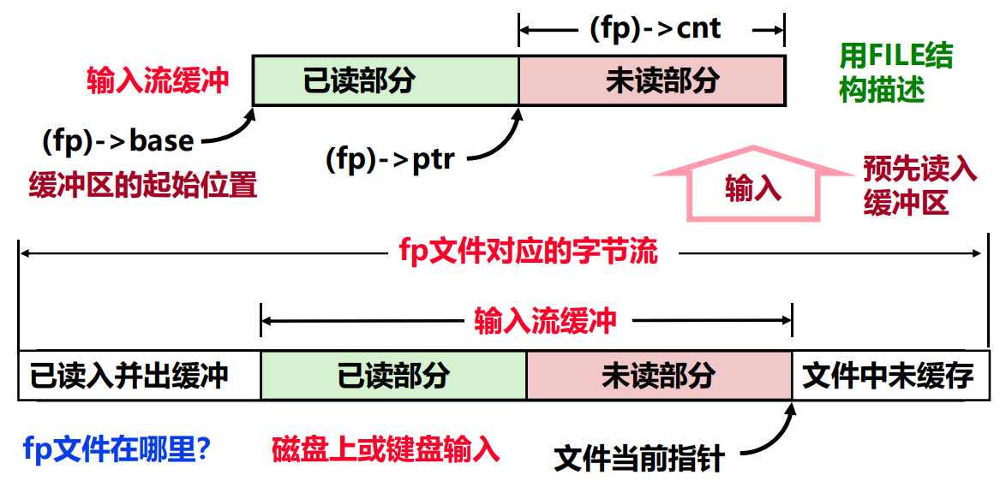

# 用户空间 IO 软件

**概览：**

**[:question: IO 子系统概述](#io-子系统概述)**  
**[:question: 用户 IO 软件与系统调用](#用户-io-软件与系统调用)**  
**[:question: 文件的基本概念](#文件的基本概念)**  
**[:question: 头文件 stdio.h 内容理解](#头文件-stdioh-内容理解)**  
**[:question: 文件操作举例](#文件操作举例)**

## IO 子系统概述

- 所有高级语言的运行时（runtime）都提供了执行 I/O 功能的机制  
  例如，C 语言中提供了包含像`printf`和`scanf`等这样的标准 I/O 库函数
- 从高级冤种通过 I/O 函数或 I/O 操作符提出 I/O 请求，到设备响应并完成 I/O 请求，涉及到多层次 I/O 软件和 I/O 硬件的协作
- I/O 子系统也采用层次结构
  <div align="left"></div>  
  大部分I/O软件都属于操作系统内核程序  
  从用户I/O软件切换到内核I/O软件的唯一办法是“异常机制”：系统调用（自陷）
- 各类用户的 IO 请求需要通过某种方式传给 OS
  - 最终用户：键盘、鼠标通过操作界面传递给 OS
  - 用户程序：通过函数（高级语言）转换为系统调用传递给 OS

## 用户 IO 软件与系统调用

### 用户软件

用户软件可用以下两种方式提出 I/O 请求：

1. 使用高级语言提供的标准 I/O 库函数  
   例如，在 C 语言程序中可以直接使用像 fopen、fread、fwrite 和 fclose 等文件操作函数，或 printf、putc、scanf 和 getc 等控制台 I/O 函数。 程序移植性很好  
   但是，使用标准 I/O 库函数有以下几个方面的不足：
   - 标准 I/O 库函数不能保证文件的安全性（无加/解锁机制）
   - 所有 I/O 都是同步的，程序必须等待 I/O 操作完成后才能继续执行（串行）
   - 有些 I/O 功能不适合甚至无法使用标准 I/O 库函数实现，如，不提供读取文件元数据的函数（元数据包括文件大小和文件创建时间等）
   - 用它进行网络编程会造成易于出现缓冲区溢出等风险
2. 使用 OS 提供的 API 函数或系统调用  
   在 Windows 中直接使用像 CreateFile、ReadFile、WriteFile、CloseHandle 等文件操作 API 函数，或
   ReadConsole、WriteConsole 等控制台 I/O 的 API 函数。对于 Unix 或 Linux 用户程序，则直接使用像 open、read、write、close 等系统调用封装函数

<div align="left"></div>

用户进程请求读磁盘文件操作：

- 用户进程使用标准 C 库函数 fread，或 Windows API 函数 ReadFile，或 Unix/Linux 的系统调用函数 read 等要求读一个磁盘文件块
- 用户程序中涉及 I/O 操作的函数最终会被转换为一组与具体机器架构相关的指令序列，这里我们将其称为 I/O 请求指令序列  
  例如，若用户程序在 IA-32 架构上执行，则 I/O 函数被转换为 IA-32 的指令序列
- 每个指令系统中一定有一类陷阱指令（有些机器也称为软中断指令或系统调用指令），主要功能是为操作系统提供灵活的系统调用机制
- 在 I/O 请求指令序列中，具体 I/O 请求被转换为一条陷阱指令，在陷阱指令前面则是相应的系统调用参数的设置指令

### 系统 IO 软件

OS 在 I/O 子系统中的重要性由 I/O 系统以下三个特性决定：

1. 共享性  
   I/O 系统被多个程序共享，须由 OS 对 I/O 资源统一调度管理，以保证用户程序只能访问自己有权访问的那部分 I/O 设备，并使系统的吞吐率达到最佳。
2. 复杂性  
   I/O 设备控制细节复杂，需 OS 提供专门的驱动程序进行控制，这样可对用户程序屏蔽设备控制的细节
3. 异步性  
   不同设备之间速度相差较大，因而，I/O 设备与主机之间的信息交换使用异步的中断 I/O 方式，中断导致从用户态向内核态转移，因此必须由 OS 提供中断服务程序来处理

### 系统调用和 API

- OS 提供一组系统调用，为用户进程的 I/O 请求进行具体的 I/O 操作
- 应用编程接口（API）与系统调用两者在概念上不完全相同，它们都是系统提供给用户程序使用的编程接口，但前者指的是功能更广泛、抽象程度更高的函数，后者仅指通过软中断（自陷）指令向内核态发出特定服务请求的函数
- 系统调用封装函数是 API 函数中的一种
- API 函数最终通过调用系统调用实现 I/O。一个 API 可能调用多个系统调用，不同 API 可能会调用同一个系统调用。但是，并不是所有 API 都需要调用系统调用
- 从编程者来看，API 和 系统调用之间没有什么差别
- 从内核设计者来看，API 和 系统调用差别很大。API 在用户态执行，系统调用封装函数也在用户态执行，但具体服务例程在内核态执行

#### 系统调用及其参数传递

- 在用户态，当进程调用一个系统调用时，CPU 切换到内核态，并开始执行一个被称为系统调用处理程序的内核函数
- 例如，IA-32 中，可以通过两种方式调用 Linux 的系统调用  
  执行软中断指令 int $0x80
  执行指令 sysenter（老的 x86 不支持该指令）
- 内核实现了许多系统调用，因此，用一个系统调用号（存放在 EAX 中）来标识不同的系统调用
- 除了调用号以外，系统调用还需要其他参数，不同系统调用所需参数的个数和含义不同，输入参数通过通用寄存器传递，若参数个数超出寄存器个数，则将需传递参数块所在内存区首址放在寄存器中传递（除调用号以外，最多 6 个参数）
- 传递参数的寄存器顺序：EAX（系统调用号）、EBX、ECX、EDX、ESI、EDI 和 EBP
- 返回参数为整数值。正数或 0 表示成功，负数表示出错码

### 用户程序、C 库函数和内核

- 用户程序总是通过某种 I/O 函数或 I/O 操作符请求 I/O 操作  
  例如，读一个磁盘文件记录时，可调用 C 标准 I/O 库函数 fread()，也可直接调用系统调用封装函数 read()来提出 I/O 请求。不管是 C 库函数、API 函数还是系统调用封装函数，最终都通过操作系统内核提供的系统调用来实现 I/O

以`printf`函数调用为例：

<div align="left"></div>

<div align="left"></div>

- 某函数调用了 printf()，执行到调用 printf()语句时，便会转到 C 语言 I/O 标准库函数 printf()去执行
- printf()通过一系列函数调用，最终会调用函数 write()
- 调用 write()时，便会通过一系列步骤在内核空间中找到 write 对应的系统调用服务例程 sys_write 来执行
- 在 system_call 中，根据系统调用号转到 sys_write 执行

linux 系统下的`write`封装函数：`ssize_t write(int fd, const void* buf, size_t n);`其中`size_t`和`ssize_t`分别是`unsigned int`和`int`，因为返回值可能是-1

```s
1  write:
2  pushl %ebx           //将EBX入栈（EBX为被调用者保存寄存器）
3  movl $4,%eax         //将系统调用号 4 送EAX
4  movl 8(%esp),%ebx    //将文件描述符 fd 送EBX
5  movl 12(%esp),%ecx   //将所写字符串首址 buf 送ECX
6  movl 16(%esp),%edx   //将所写字符个数 n 送EDX
7  int $0x80            //进入系统调用处理程序system_call执行
8  cmpl $-125,%eax      //检查返回值（所有正数都小于FFFFFF83H）
9  jbe .L1              //若无错误，则跳转至.L1（按无符号数比）
10 negl %eax            //将返回值取负送EAX
11 movl %eax,error      //将EAX的值送error
12 movl $-1, %eax       //将write函数返回值置-1
13 .L1:
14 popl %ebx
15 ret
内核执行write的结果在EAX中返回，正确时为所写字符数（最高位为0），出错时为错误码的负数（最高位为1）
```

## 文件的基本概念

- 所有 I/O 操作通过读写文件实现，所有外设，包括网络、终端设备，都被看成文件（linux 下一切皆文件）  
  如：printf 在哪显示信息？stdout 文件！即终端显示器 TTY
- 所有物理设备抽象成逻辑上统一的“文件”使得用户程序访问物理设备与访问真正的磁盘文件完全一致  
  例如，fprintf/fwrite(主要是磁盘文件) 和 printf (stdout) 都通过统一的 write 函数陷入内核，差别则由内核处理！
- UNIX 系统中，文件就是一个字节序列
- 通常，将键盘和显示器构成的设备称为终端（terminal），对应标准输入、和标准（错误）输出文件；像磁盘、光盘等外存上的文件则是普通文件
- 根据文件的可读性，文件被分成 ASCII 文件和二进制文件两类
- ASCII 文件也称文本文件，可由多个正文行组成，每行以换行符‘\n’ 结束，每个字符占一个字节。标准输入和标准(错误)输出文件是 ASCII 文件
- 普通文件可能是文本文件或二进制文件

### 文件的打开和创建

读写文件前，用户程序须告知将对文件进行何种操作：读、写、添加还是可读可写，通过打开或创建一个文件来实现  
已存在的文件：可直接打开  
不存在的文件：则先创建

- 创建文件：`int creat(char *name, mode_t perms);`
  - 创建新文件时，应指定文件名和访问权限，系统返回一个非负整数，它被称为文件描述符 fd (file descriptor)
  - 文件描述符用于标识被创建的文件，在以后对文件的读写等操作时用文件描述符代表文件
- 打开文件：`int open(char *name, int flags, mode_t perms);`

  - 标准输入(fd=0)、标准输出(fd=1)和标准错误(fd=2)三种文件自动打开，其他文件须用 creat 或 open 函数显式创建或打开后才能读写
  - 参数 perms 用于指定文件的访问权限，通常在 open 函数中该参数总是 0，除非以创建方式打开，此时，参数 flags 中应带有 O_CREAT 标志
  - 参数 flags：O_RDONLY, O_WRONLY|O_APPEND, O_RDWR 等

  例：fd=open(“test.txt”,O_RDONLY, 0)

### 文件的读和写

- 读文件：`ssize_t read(int fd, void *buf, size_t n);`
  - 将 fd 中当前位置 k 开始的 n 个字节读到 buf 中，读后当前位置为 k+n。若文件长度为 m，当 k+n>m 时，则读取字节数为 m-k<\n，读后当前 位置为文件尾。返回实际字节数，当 m=k（EOF）时，返回值为 0
- 写文件：`ssize_t write(int fd, const void \*buf, size_t n);`
  - 将 buf 中 n 字节写到 fd 中，从当前位置 k 处开始写。返回实际写入字节数 m，写后当前位置为 k+m。对于普通文件，实际字节数等于 n
- 对于 read 和 write 系统调用，可以一次读/写任意个字节。显然，按一个物理块大小读/写较好，可减少系统调用次数
- 有些情况下，真正读/写字节数比设定所需字节数少，这并不是一种错误。在读/写磁盘文件时，除非遇到 EOF，否则不会出现这种情况。但当读/写的是终端设备或网络套接字文件、UNIX 管道、Web 服务器等都可能出现这种情况

### 文件的定位和关闭

- 设置读写位置：`long lseek(int fd, long offset, int origin);`
  - offset 指出相对字节数
  - origin 指出基准：开头（0）、当前位置（1）和末尾（2）  
    例：lseek(fd,5L,0)；表示定位到文件开始后的第 5 字节  
    lseek(fd, 0L, 2)；表示定位到文件末尾
  - 返回的是位置值，若发生错误，则返回-1
- 元数据统计：`int stat(const *name, struct stat *buf);`  
   `int fstat(int fd, struct stat *buf);`
  - 文件的所有属性信息，包括：文件描述符、文件名、文件大小、创建时间、当前读写位置等，由内核维护，称为文件的元数据（metadata）
  - 用户程序可通过 stat()或 fstat()函数查看文件元数据
  - stat 第一个参数是文件名，而 fstat 指出的是文件描述符，除第一个参数
    类型不同外，其他全部一样
- 关闭文件：`close(int fd);`

## 头文件 stdio.h 内容理解

<div align="left"></div>

### 带缓冲 I/O 的实现

- 从文件 fp 中读数据时，FILE 中定义的缓冲区为输入流缓冲（在内存）
- 首先要从文件 fp 中读入 1024（缓冲大小 BUFSIZ=1024）个字节数据到缓存，然后，再按需从缓存中读取 1 个（如 getc）或 n 个（如 fread）字节并返回

<div align="left"></div>

- 向文件 fp 中写数据时，FILE 中定义的缓冲区为输出流缓冲
- 先按需不断地向缓存写 1 个（如 putc）或 n 个（如 fwrite）字节，遇到换行符\n 或缓存被写满 1024（缓冲大小 BUFSIZ=1024）个字节，则将缓存内容一次写入文件 fp 中

<div align="left"></div>

### stderr 和 stdout 差别

```c
#include <stdio.h>
int main()
{
    fprintf(stdout, "hello ");
    fprintf(stderr, "world!");
    return 0;
}
输出结果为：
world!hello

#include <stdio.h>
int main()
{
    fprintf(stdout, "hello ");
    fprintf(stderr, "world!\n");
    return 0;
}
输出结果为：
world!
hello
```

stdout 和 stderr 都用于标准输出，但是 stderr 为\_WRITE|\_UNBUF（无缓冲），stdout 为\_WRITE（有缓冲）

### stdio.h 中更多的定义

- 在 stdio.h 中，还有 feof()、ferror()、fileno()、getc()、putc()、getchar()、putchar()等宏定义
- 系统级 I/O 函数对文件的标识是文件描述符，C 标准 I/O 库函数中对文件的标识是指向 FILE 结构的指针，FILE 中定义了 1024 字节的流缓冲区
- 使用流缓冲区可使文件内容缓存在用户缓冲区中，而不是每次都直接读/写文件，从而减少执行系统调用次数

## 文件操作举例

```c
/* 文件复制功能的实现 */

/* 方式一：getc/putc版本 */
void filecopy(FILE *infp, FILE *outfp)
{
    int c;
    while ((c=getc(infp)) != EOF)
        putc(c, outfp);
}
/* 方式二: read/write版本 */
void filecopy(FILE *infp, FILE *outfp)
{
    char c;
    while (read(infp->fd,&c,1) != 0)
        write(outfp->fd,&c,1);
}
```

哪种方式更好？  
方式一更好，因为其系统调用次数少  
对于方式二，若文件长度为 n，则需执行 2n 次系统调用  
对于方式一，若文件长度为 n，则执行系统调用次数约为 n/512

还可以用`fread()`和`fwrite()`、`fgetc()`和`fputc`等实现
