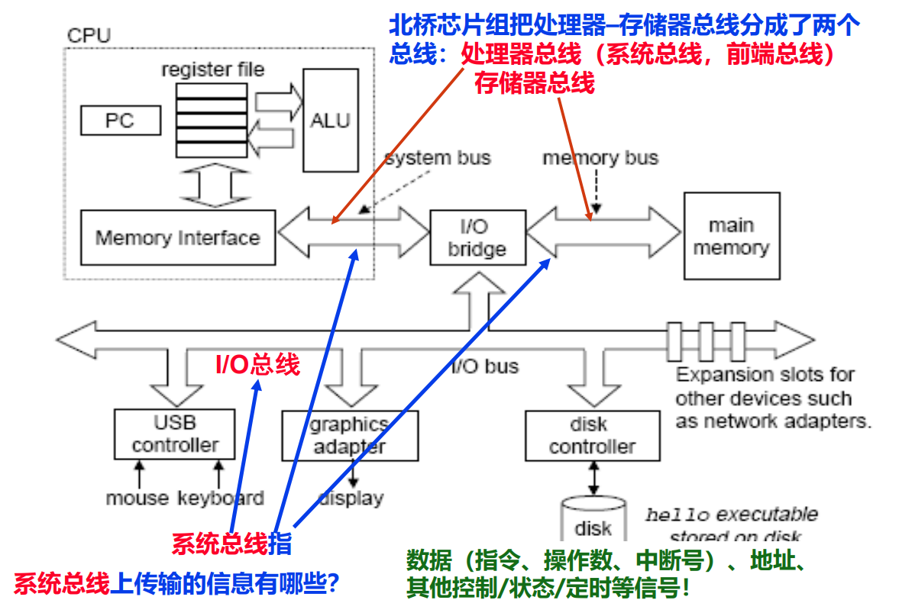
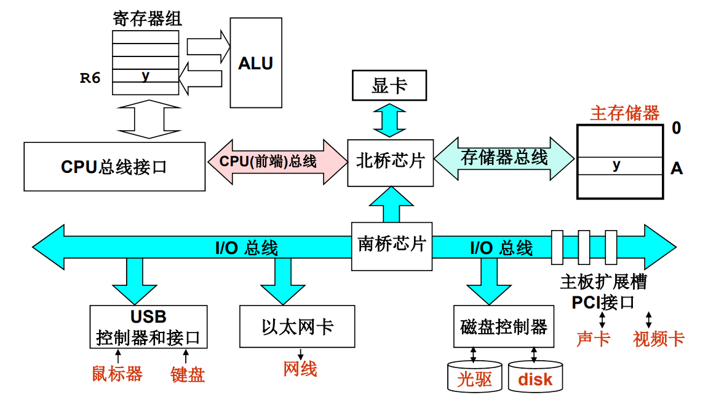
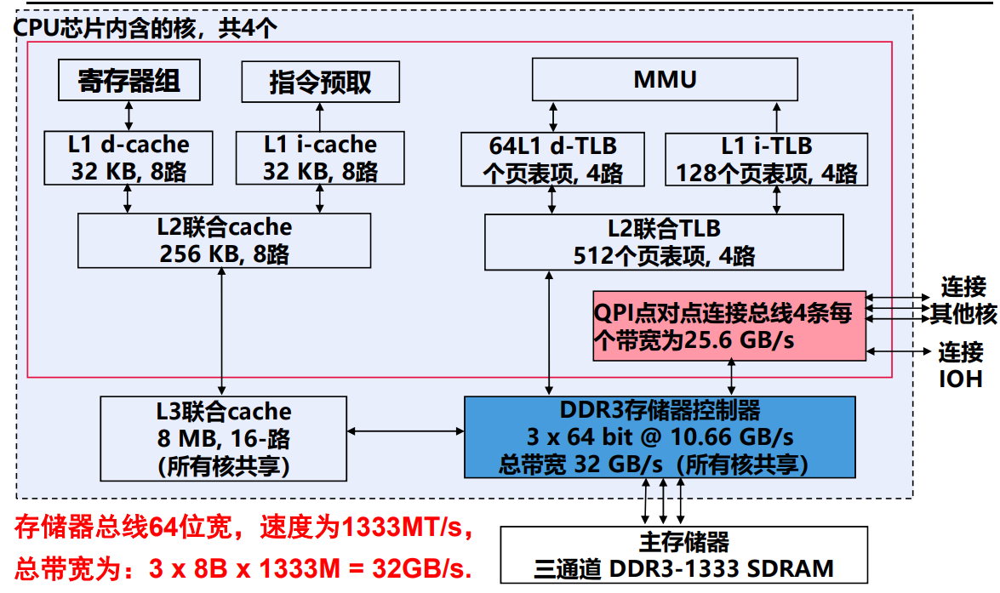
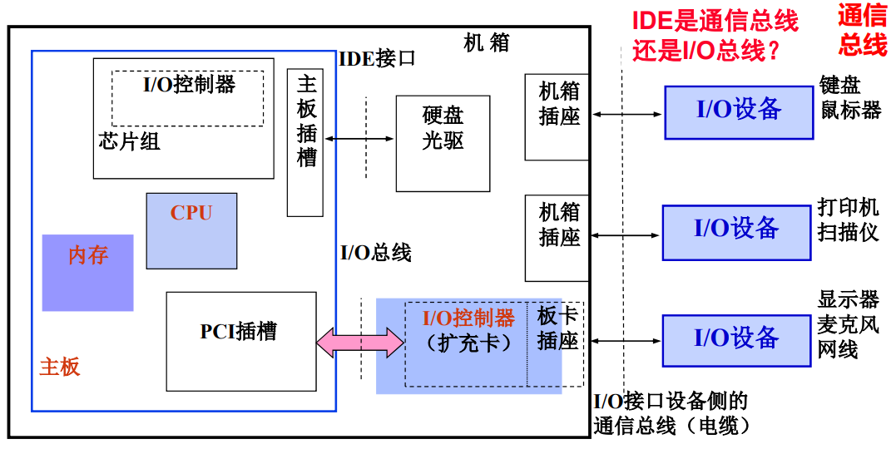
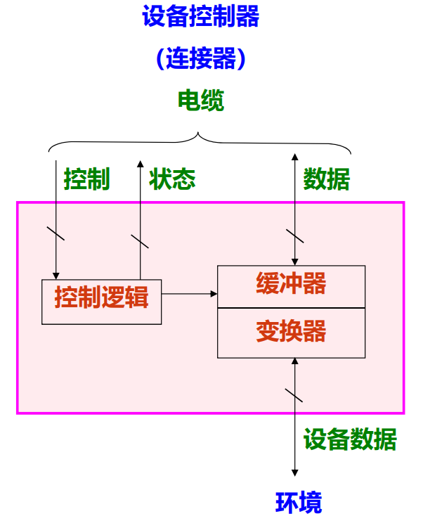
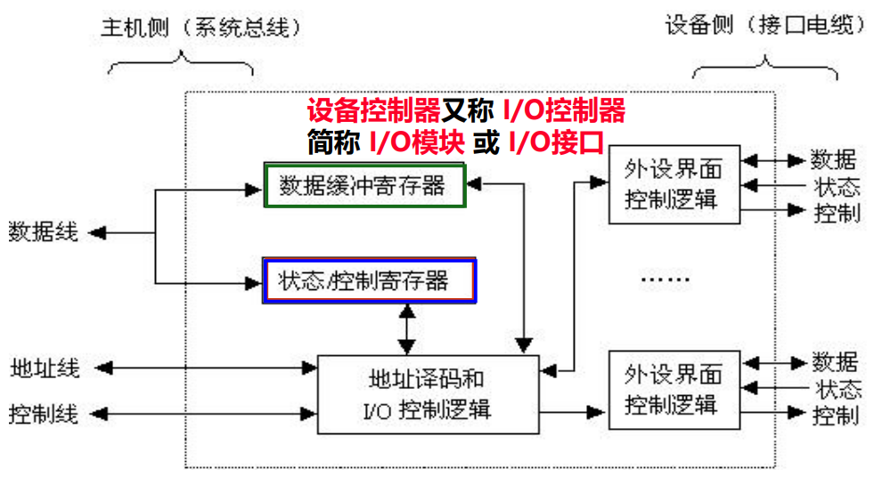

# 系统总线和系统互连

**概览：**

**[:question: 系统总线及互连概述](#系统总线及互连概述)**  
**[:question: 总线的基本概念和性能指标](#总线的基本概念和性能指标)**  
**[:question: 三种系统总线及系统互连](#三种系统总线及系统互连)**  
**[:question: 外设和外设控制器](#外设和外设控制器)**

## 系统总线及互连概述

系统总线通常由一组控制线、一组数据线和一组地址线构成。也有些总线没有单独
的地址线，地址信息通过数据线来传送，这种情况称为数据/地址复用

- 数据线（Data Bus）：承载在源和目部件之间传输的信息。数据线的宽度反映
  一次能传送的数据的位数
- 地址线（Address Bus） ：给出源数据或目的数据所在的主存单元或 I/O 端口
  的地址。地址线的宽度反映最大的寻址空间。
- 控制线（Control Bus） ：控制对数据线和地址线的访问和使用。用来传输定
  时信号和命令信息。典型的控制信号包括：
  - 时钟（Clock）：用于总线同步
  - 复位（Reset）：初始化所有设备
  - 总线请求（Bus Request）：表明发出该请求信号的设备要使用总线
  - 总线允许（Bus Grant）：表明接收到该允许信号的设备可以使用总线
  - 中断请求（Interrupt Request）：表明某个中断正在请求
  - 中断回答（Interrupt Acknowledge） ：表明某个中断请求已被接受
  - 存储器读（memory read）：从指定的主存单元中读数据到数据总线上
  - 存储器写（memory read）：将数据总线上的数据写到指定主存单元中
  - I/O 读（I/O read）：从指定的 I/O 端口中读数据到数据总线上
  - I/O 写（I/O Write） ：将数据总线上的数据写到指定的 I/O 端口中
  - 传输确认（transmission Acknowledge）：数据已被接收或已送总线

## 总线的基本概念和性能指标

### 基本概念

- 总线裁决  
  早期：总线多是共享传输，需确定哪个设备使用总线
  现在：总线多是点对点传输，无需裁决
- 总线定时  
  定义总线事务中的每一步何时开始、何时结束  
  Synchronous (同步)：用时钟信号来确定每个步骤  
  Asynchronous(异步)：用握手信号来定时，前一个信号结束就是下一个信号的开始
  半同步：结合使用时钟信号和握手信号来定时
- 并行/串行传输  
  并行传输：一个方向同时传输多位数据信号，故位与位需同步，慢！
  串行传输：一个方向只传输一位数据信号，无需在位之间同步，快！

现在总线设计的趋势是：点对点、同步、串行

### 性能指标

- 总线宽度：总线中数据线的条数，决定了每次能同时传输的信息位数
- 总线工作频率： 每秒传送次数（MT/s 或 GT/s）  
  早期的总线通常一个时钟传送一次数据，此时，工作频率等于总线时钟频率；现在总线一个时钟周期可传送 2 次或 4 次数据，因此，工作频率是时钟频率的 2 倍或 4 倍
- 总线带宽： 总线的最大数据传输率（一秒钟内传输的数据量）  
  总线带宽计算公式： B=W×F/N  
  W-总线宽度；F-总线时钟频率；N-完成一次数据传送所用时钟周期数  
  F/N 实际上就是总线工作频率
- 总线传送方式
  - 非突发传送：每个总线事务都传送地址，一个地址对应一次数据传送
  - 突发（Burst）传送：即成块数据传送。突发传送总线事务中，先传送一个地址，后传送多次数据，后续数据的地址默认为前面地址自动增量

## 三种系统总线及系统互连

_注：现在的南北桥大部分功能都集中到了 CPU_

三种系统总线是指：处理器总线、存储器总线和 IO 总线

### 处理器总线

- 前端总线（Front Side Bus，FSB）
  - 早期 Intel 架构使用，位于 CPU 芯片与北桥芯片之间互连
  - 从 Pentium Pro 开始，FSB 采用 quad pumped 技术：每个总线时钟周期传送 4 次数据
  - 并行传输、同步定时方式
  - 若工作频率为 1333MHz（实际单位应是 MT/s，表示每秒传送 1333M 次，实际时钟频率为 333MHz），总线宽度为 64 位，则总线带宽为 1333MT/s×8B=10.5GB/s
- QPI（Quick Path Interconnect）总线
  - 目前在 Intel 架构中 CPU 芯片内部核之间、CPU 芯片之间、CPU 芯片与 IOH（I/O Hub）芯片之间，都通过 QPI 总线互连
  - QPI 是基于包交换的串行、高速点对点连接：发送方和接收方各有时钟信号，双方同时传输数据（各有 20 条数据线），每个 QPI 数据包含 80 位，分两个时钟周期传送，每个时钟周期传两次，每次传 20 位（16 位数据+4 位校
    验位），QPI 总线带宽为：每秒传送次数 ×2B×2
  - QPI 总线的速度单位（工作频率）为 GT/s，表示每秒传送多少 G 次。若 QPI 时钟频率为 2.4GHz，则速度为 4.8GT/s，带宽为 4.8G×2B×2=19.2GB/s

### 存储器总线

从 Core i7 开始，北桥在 CPU 芯片内，CPU 通过存储器总线（即内存条插槽，图中为三通道插槽）直接和内存条相连。3 个存控包含在 CPU 芯片内

### IO 总线

- I/O 总线用于为系统中的各种 I/O 设备提供输入输出通路
- I/O 总线在物理上可以是主板上的 I/O 扩展槽，如：
  - 第一代：ISA/EISA 总线、VESA 总线，早被淘汰
  - 第二代：PCI、AGP、PCI-X，被逐渐淘汰
  - 第三代：PCI-Express（串行总线，主流总线）
- PCI-Express 总线
  - 两个 PCI-Express 设备之间以一个链路（link）相连
  - 每个链路包含多条通路（lane），可以是 1,2,4,8,16 或 32 条
  - PCI-Express×n 表示一个具有 n 条通路的 PCI-Express 链路
  - 每条通路可同时发送和接受，每个数据字节被转换为 10 位信息被传输
  - PCI-Express1.0 下，每条通路的发送和接受速率都是 2.5Gb/s，故 PCI-Express×n 的带宽为：2.5Gb/s×2×n/10=0.5GB/s×n
  - PCI-Express1.0 下，PCI-Express×2 的带宽为 1GB/s，PCI-Express×4 的带宽为 2GB/s，PCI-Express×16 的带宽为 8GB/s

I/O 总线，I/O 控制器与 IO 设备的关系

- I/O 设备通常是物理上相互独立的设备，它们一般通过通信总线与 I/O 控制器连接
- I/O 控制器（I/O 接口）在扩展卡或南桥芯片内，通过 I/O 总线连接 CPU 和 MM
- I/O 总线经过北桥与内存、CPU 连接
- I/O 硬件建立了外设与主机之间的“通路”：主机 - 北桥 - I/O 总线 - 南桥（设备控制器）- 电缆 - 外设

## 外设和外设控制器

### 外部设备的通用模型

- 通过电缆与设备控制器（I/O 接口）进行数据、状态和控制信息的传送
- 控制逻辑根据控制信息控制设备的操作，并检测设备状态
- 缓冲器用于保存交换的数据信息
- 变换器用于在电信号形式（内部数据）和其他形式的设备数据之间进行转换

所有设备都可以抽象成该通用模型  
设备所用电缆中有三种信号线：控制信号、状态信号、数据信号

### 设备控制器的结构

- 不同 I/O 模块在复杂性和控制外设的数量上相差很大
- 通过发送命令字到 I/O 控制寄存器来向设备发送命令
- 通过从状态寄存器读取状态字来获取外设或 I/O 控制器的状态信息
- 通过向 I/O 控制器发送或读取数据来和外设进行数据交换
- 将 I/O 控制器中 CPU 能够访问的各类寄存器称为 I/O 端口
- 对外设的访问通过向 I/O 端口发命令、读状态、读/写数据来进行

### I/O 端口的寻址方式

- 对 I/O 端口读写就是向 I/O 设备送出命令或从设备读状态或读/写数据
- 一个 I/O 控制器可能会占有多个端口地址
- I/O 端口必须编号后，CPU 才能访问它
- I/O 设备的寻址方式就是 I/O 端口的编号方式
  - 统一编址方式（内存映射方式）  
    与主存空间统一编址，主存单元和 I/O 端口在同一个地址空间中。（将 I/O 端口映射到某个主存地址区域，故也称“存储器映射方式”）  
    例如，RISC 机器、Motorola 公司的处理器等采用该方案 VRAM（显示存储器）通常也和主存统一编址
  - 独立编址方式（特殊 I/O 指令方式）  
    单独编号，不和主存单元一起编，使成为一个独立的 I/O 地址空间（因为需专门 I/O 指令，故也称为“特殊 I/O 指令方式”）  
    例如，Intel 处理器就是独立编址方式

### 驱动程序与 I/O 指令

- 控制外设进行输入/输出的底层 I/O 软件是驱动程序
- 驱动程序设计者应了解设备控制器及设备的工作原理，包括：设备控制器中有哪些用户可访问的寄存器、控制/状态寄存器中每一位的含义、设备控制器与外设之间的通信协议等，而关于外设的机械特性，程序员则无需了解。驱动程序通过访问 I/O 端口控制外设进行 I/O：
  - 将控制命令送到控制寄存器来启动外设工作
  - 读取状态寄存器了解外设和设备控制器的状态
  - 访问数据缓冲寄存器进行数据的输入和输出
- 对 I/O 端口的访问操作由 I/O 指令完成，它们是一种特权指令
- IA-32 中的 I/O 指令：in、ins、out 和 outs
  - in 和 ins 用于将 I/O 端口的内容取到 CPU 内的通用寄存器中
  - out 和 outs 用于将通用寄存器内容输出到 I/O 端口  
  如 IN AL, DX：DX 中存放 I/O 端口地址，将 I/O 端口中的内容取到 AL 中
