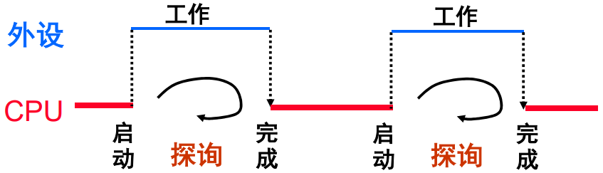
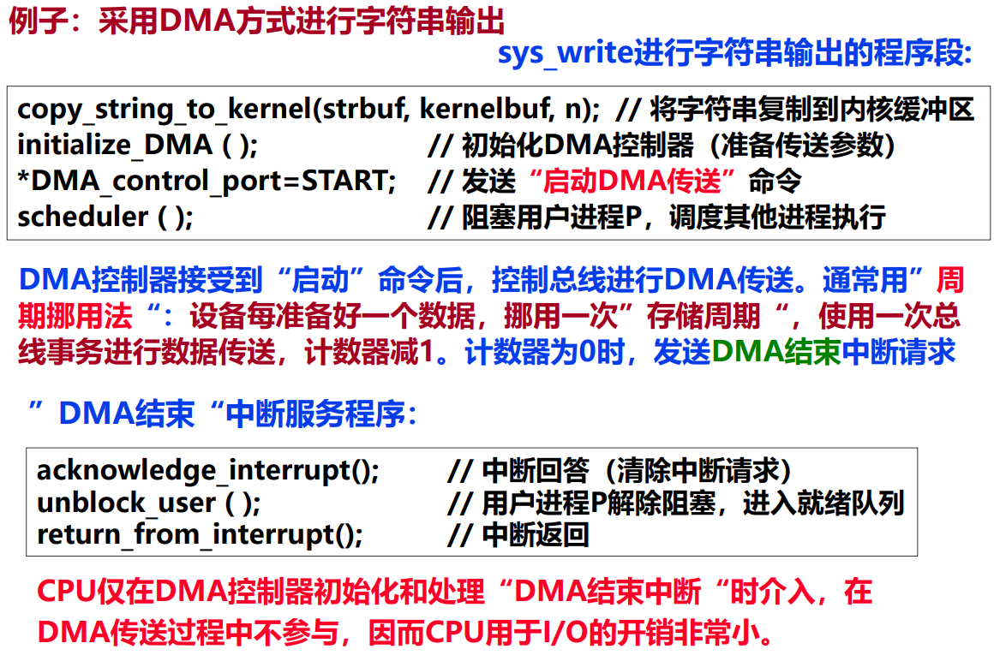

# I/O 方式和内核空间 I/O 软件

**概览：**

**[:question: 三种基本 I/O 方式](#三种基本-io-方式)**  
**[:question: 程序查询方式](#程序查询方式)**  
**[:question: 中断 I/O 方式](#中断-io-方式)**  
**[:question: DMA 方式](#dma-方式)**  
**[:question: 内核空间 I/O 软件](#内核空间-io-软件)**

## 三种基本 I/O 方式

- 程序直接控制方式（最简单的 I/O 方式）
  - 无条件传送：对简单外设定时（同步）进行数据传送
  - 条件传送：CPU 主动查询，也称程序查询或轮询（Polling）方式
- 中断 I/O 方式（I/O Interrupt）: 几乎所有系统都支持中断 I/O 方式
  - 若一个 I/O 设备需要 CPU 干预，它就通过中断请求通知 CPU
  - CPU 中止当前程序的执行，调出 OS（中断处理程序）来执行
  - 处理结束后，再返回到被中止的程序继续执行
- DMA 方式（Direct Memory Access）: 磁盘等高速外设所用的方式
  - 磁盘等高速外设成批地直接和主存进行数据交换
  - 需要专门的 DMA 控制器控制总线，完成数据传送
  - 数据传送过程无需 CPU 参与

## 程序查询方式

- I/O 设备（包括设备控制器）将自己的状态放到状态寄存器中  
  打印缺纸、打印机忙、未就绪等都是状态
- OS 阶段性地查询状态寄存器中的特定状态，以决定下一步动作  
  如：未“就绪”时，则一直“等待”

例如：sys_write 进行字符串打印的程序段大致过程如下：

```c
copy_string_to_kernel ( strbuf, kernelbuf, n); // 将字符串复制到内核缓冲区
for (i=0; i < n; i++) {                        // 对于每个打印字符循环执行
    while ( printer_status != READY);          // 等待直到打印机状态为“就绪”
    *printer_data_port=kernelbuf[i];           // 向数据端口输出一个字符
    *printer_control_port=START;               // 发送“启动打印”命令
}
return_to_user ( );                            // 返回用户态
```

如何判断“就绪”？如何“等待”？  
读取状态寄存器，判断特定位（1-就绪；0-未就绪）是否

```s
// 功能：打印AL寄存器中的字符
PRINT   PROC NEAR
        PUSH AX         保留用到的寄存器
        PUSH DX         保留用到的寄存器
        MOV DX,378H     数据锁存器口地址送DX
        OUT DX,AL       输出要打印的字符到数据锁存器
        MOV DX,379H     状态寄存器口地址送DX
WAIT:   *IN AL,DX        读打印机状态位
        *TEST AL,80H     检查忙位
        *JE WAIT         等待直到打印机不忙
        MOV DX,37AH     命令(控制)寄存器口地址送DX
        MOV AL,0DH      置选通位=1（表示启动打印）
        OUT DX,AL       使命令寄存器中选通位置1
        POP DX
        POP AX          恢复寄存器
        RET
PRINT   ENDP

可以看出查询过程中，执行的是WAIT部分，此时CPU一直在不断执行“IN-TEST-JE”三条指令
```

<div align="left"></div>

在外设工作，CPU 探询的过程称为“踏步”现象。此时 CPU 并不处于停止状态，只是不断执行“IN-TEST-JE”3 条指令，称为“忙等待”  
探询期间，可一直不断查询（独占查询），也可定时查询（需保证数据不丢失）

程序查询方式的特点是：

- 简单、易控制、外围接口控制逻辑少
- CPU 与外设串行工作，效率低，速度慢，适合于慢速设备
- 查询开销极大（CPU 完全在等待“外设完成”）
- 其工作方式是完全串行或部分串行，CPU 用 100%的时间为 I/O 服务

## 中断 I/O 方式

当外设准备好（ready）时，便向 CPU 发中断请求，CPU 响应后，中止现行程序的执行，转入“中断服务程序”进行输入/出操作，以实现主机和外设接口之间的数据传送，并启动外设工作。“中断服务程序”执行完后，返回原被中止的程序断点处继续执行。此时，外设和 CPU 并行工作

## DMA 方式

- DMA 方式的基本思想
  - 在高速外设和主存间直接传送数据
  - 由专门硬件（即：DMA 控制器）控制总线进行传输
- DMA 方式适用场合
  - 高速设备（如：磁盘、光盘等）
  - 成批数据交换，且数据间间隔时间短，一旦启动，数据连续读写
- 采用“请求-响应”方式
  - 每当高速设备准备好数据就进行一次“DMA 请求”，DMA 控制器接受到 DMA 请求后，申请总线使用权
  - DMA 控制器的总线使用优先级比 CPU 高，为什么？
- 与中断控制方式结合使用
  - 在 DMA 控制器控制总线进行数据传送时，CPU 执行其他程序
  - DMA 传送结束时，要通过“DMA 结束中断”告知 CPU

DMA 方式读一个扇区的过程如下：

1. CPU 对 DMA 控制器初始化：将传送方向（读）、传送数据个数、磁盘逻辑块号、主存起始地址等参数送到 DMA 控制器
2. 发送“启动 DMA 传送”命令
3. 磁盘控制器读相应的扇区，并由 DMA 控制器控制总线把数据从磁盘控制器送主存，此时，CPU 执行其他进程
4. 当 DMA 传送结束(计数为 0)，DMA 控制器向 CPU 发出“DMA 结束中断请求”，要求 CPU 进行相应的后处理

<div align="left"></div>

## 内核空间 I/O 软件

- 所有用户程序提出的 I/O 请求，最终都通过系统调用实现
- 通过系统调用封装函数中的陷阱指令转入内核 I/O 软件执行
- 内核空间 I/O 软件实现相应系统调用的服务功能
- 内核空间的 I/O 软件分三个层次
  - 设备无关软件层
  - 设备驱动程序层
  - 中断服务程序层
- 设备驱动程序层、中断服务程序层与 I/O 硬件密切相关

### 设备无关软件层

- 设备驱动程序统一接口
  - 操作系统为所有外设的设备驱动程序规定一个统一接口，这样，新设备的驱动程序只要按统一接口规范来编制，就可在不修改操作系统的情况下，添加新设备驱动程序并使用新的外设进行 I/O
  - 所有设备都抽象成文件，设备名和文件名在形式上没有差别，设备和文件具有统一的接口，不同设备名和文件名被映射到对应设备驱动程序
- 缓冲处理
  - 每个设备的 I/O 都需使用内核缓冲区，因而缓冲区的申请和管理等处理是所有设备公共的，可包含在与设备无关的 I/O 软件部分
- 错误报告
  - I/O 操作在内核态执行时所发生的错误信息，都通过与设备无关的 I/O 软件返回给用户进程，也即：错误处理框架与设备无关
  - 直接返回编程等错误，无需设备驱动程序处理，如，请求了不可能的 I/O 操作；写信息到一个输入设备或从一个输出设备读信息；指定了一个无效缓冲区地址或者参数；指定了不存在的设备等
- 有些错误由设备驱动程序检测出来并处理，若驱动程序无法处理，则将错误信息返回给设备无关 I/O 软件，再由设备无关 I/O 软件返回给用户进程，如写一个已被破坏的磁盘扇区；打印机缺纸；读一个已关闭的设备等
- 打开与关闭文件
  - 对设备或文件进行打开或关闭等 I/O 函数所对应的系统调用，并不涉及具体的 I/O 操作，只要直接对主存中的一些数据结构进行修改即可，这部分工作也由设备无关软件来处理
- 逻辑块大小处理
  - 为了为所有的块设备和所有的字符设备分别提供一个统一的抽象视图，以隐藏不同块设备或不同字符设备之间的差异，与设备无关的 I/O 软件为所有块设备或所有字符设备设置统一的逻辑块大小
  - 对于块设备，不管磁盘扇区和光盘扇区有多大，所有逻辑数据块的大小相同，这样，高层 I/O 软件就只需处理简化的抽象设备，从而在高层软件中简化了数据定位等处理

### 设备驱动程序

- 每个外设具体的 I/O 操作需通过执行设备驱动程序来完成
- 外设种类繁多、其控制接口不一，导致不同外设的设备驱动程序千差万别，因而设备驱动程序与设备相关
- 每个外设或每类外设都有一个设备控制器，其中包含各种 I/O 端口。 CPU 通过执行设备驱动程序中的 I/O 指令访问各种 I/O 端口
- 设备所采用的 I/O 控制方式不同，驱动程序的实现方式也不同
  - 程序直接控制：驱动程序完成用户程序的 I/O 请求后才结束。这种情况下，用户进程在 I/O 过程中不会被阻塞，内核空间的 I/O 软件一直代表用户进程在内核态进行 I/O 处理 。（干等！）
  - 中断控制：驱动程序启动第一次 I/O 操作后，将调出其他进程执行，而当前用户进程被阻塞。在 CPU 执行其他进程的同时，外设进行 I/O 操作，此时，CPU 和外设并行工作。外设完成 I/O 时，向 CPU 发中断请求，然后 CPU 调出相应中断服务程序执行。在中断服务程序中再次启动 I/O 操作
  - DMA 控制：驱动程序对 DMA 控制器初始化后，便发送“启动 DMA 传送”命令，外设开始进行 I/O 操作并在外设和主存间传送数据。同时 CPU 执行处理器调度程序，转其他进程执行，当前用户进程被阻塞。DMA 控制器完成所有 I/O 任务后，向 CPU 发送一个“DMA 完成”中断请求信号

### 中断服务程序

- 中断控制和 DMA 控制两
  种方式下都需进行中断
  处理
  - 中断控制方式：中断服务程序主要进行从数缓器取数或写数据到数缓器，然后启动外设工作
  - DMA 控制方式：中断服务程序进行数据校验等后处理工作
