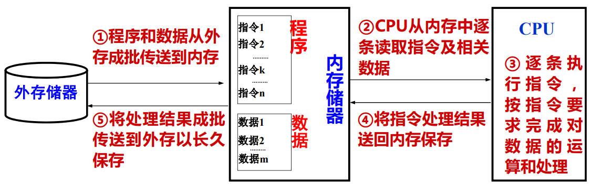
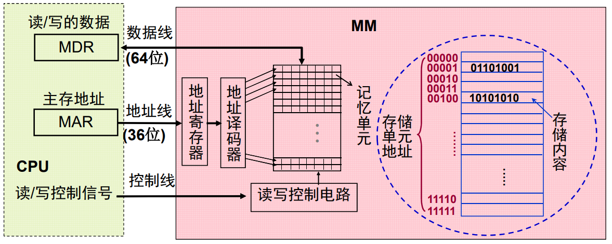

# 主存储器组织

**概览：**

**[:question: 存储器基本概念](#存储器基本概念)**  
**[:question: 主存的基本结构](#主存的基本结构)**  
**[:question: 主存的性能指标](#主存的性能指标)**  
**[:question: 半导体存储器组织](#半导体存储器组织)**  
**[:question: 内存条组织和总线宽度](#内存条组织和总线宽度)**  
**[:question: 主存模块的连接与读写操作](#主存模块的连接与读写操作)**

## 存储器基本概念

### 基本术语

- 记忆单元（存储基元/存储元/位元）（cell）  
  具有两种稳态的能够表示二进制数码的 0 和 1 物理器件
- 存储单元/编址单位（Addressing Unit）  
  具有相同地址的位构成一个存储单元，也称为一个编址单位
- 存储体/存储矩阵/存储阵列（Bank）  
  所有存储单元构成一个存储阵列
- 编制方式（Addressing mode）  
  字节编址、按字编址
- 存储器地址寄存器（Memory Address Register - MAR）  
  用于存放主存单元地址的寄存器
- 存储器数据寄存器（Memory Data Register - MDR）  
  用于存放主存单元中数据的寄存器

### 存储器分类

#### 按工作性质/存取方式分类

- 随机存取存储器（Random Access Memory - RAM）  
  每个单元读写时间一样，且与各单元所在位置无关。如：主存  
  （这里主要强调的是地址译码时间相同，现在的 DRAM 芯片采用行缓冲，因而可能因为位置不同而使访问时间有所差别）
- 顺序存取存储器（Sequential Access Memory - SAM）  
  数据按顺序从存储载体的始端读出或写入，因而存取时间的长短与信息所在位置有关。如：磁带
- 直接存取存储器（Direct Access Memory - DAM）  
  直接定位到读写数据块，在读写数据块时按顺序进行。如：磁盘
- 相联存储器（Associate Memory - AM；Content Addressed Memory - CAM）  
  按内容检索存储位置进行读写。如：快表

#### 按存储介质分类

- 半导体存储器：双极型，静态 MOS 型，动态 MOS 型
- 磁表面存储器：磁盘（Disk）、磁带（Tape）
- 光存储器：CD，CD-ROM，DVD

#### 按信息的可更改性分类

- 读写存储器（Read/Write Memory）：可读可写
- 只读存储器（Read Only Memory）：只能读不能写

#### 按断电后信息的可保存性分类

- 非易失性存储器（Nonvolatile Memory）  
  信息可一直保留，不需电源维持。如：ROM、磁表面存储器、光存储器等
- 易失性存储器（Volatile Memory）  
  电源关闭时信息自动丢失。如：RAM、Cache 等

#### 按功能/容量/速度/所在位置分类

- 寄存器（Register）  
  封装在 CPU 内，用于存放当前正在执行的指令和使用的数据  
  用触发器实现，速度快，容量小（几~几十个）
- 高速缓存（Cache）  
  位于 CPU 内部或附近，用来存放当前要执行的局部程序段和数据  
  用 SRAM 实现，速度可与 CPU 匹配，容量小（几 MB）
- 内存储器 MM（主存储器 Main Memory）  
  位于 CPU 之外，用来存放已被启动的程序以及所用的数据  
  用 DRAM 实现，速度较快，容量较大（几 GB）
- 外存储器 AM（辅助存储器 Auxiliary Storage）  
  位于主机之外，用来存放暂不运行的程序、数据和存档文件  
  用磁盘、SSD 等实现，速度慢，容量大

内存和外存的关系与比较

| 外存储器（外存/辅存）                            | 内存储器（内存/主存）                             |
| ------------------------------------------------ | ------------------------------------------------- |
| 存取速度慢                                       | 存取速度快                                        |
| 成本低、容量大                                   | 成本高、容量相对较小                              |
| 不与 CPU 直接连接，先送到内存，才能被 CPU 使用   | 直接与 CPU 连接，CPU 对内存中可直接进行读、写操作 |
| 非易失性存储器，用于长久存放系统中几乎所有的信息 | 易失性存储器，用于临时存放正在运行的程序和数据    |

## 主存的基本结构

### Q：主存中存放的是什么信息？CPU 何时会访问主存？

主存中存放的是指令和数据  
CPU 执行指令时候需要取指令、取数据、存数据

### Q：地址译码器的输入是什么？输出是什么？可寻址范围是多少？

输入是地址，输出是地址驱动信号（只有一根地址驱动线被选中）  
地址线 36 位时，可寻址范围是$[0,2^{36}-1]$，即主存地址空间为 64GB（按字节编址时）

若是按字节编址，则每次最多可读/写 8 个单元，给出的是首地址

## 主存的性能指标

- 存储容量：所包含的存储单元的总数
- 存取时间 $T_A$：从 CPU 送出内存单元的地址码开始，到主存读出数据并送到 CPU（或者是把 CPU 数据写入主存）所需要的时间，分读取时间和写入时间
- 存储周期 T $T_{MC}$：连续两次访问存储器所需的最小时间间隔，它应等于存取时间加上下一次存取开始前所要求的附加时间。因为存储器由于读出放大器、驱动电路等都有一段稳定恢复时间，所以读出后不能立即进行下一次访问

## 半导体存储器组织

内存由半导体存储芯片组成

### 半导体存储器分类

### 随机存储器 RAM

| 名称            | 特点                                                                                                                                     | 用途         |
| --------------- | ---------------------------------------------------------------------------------------------------------------------------------------- | ------------ |
| 静态存储器 SRAM | - 每个存储单元 cell 由 6 个晶体管组成   - 只要加上电源，信息就能一直保存   - 对电干扰相对很不敏感   - 比 DRAM 更快，但也更贵 | 用作 cell    |
| 动态存储器 DRAM | - 每个存储单元由 1 个电容和 1 个晶体管组成   - 每隔一段时间必须刷新一次   - 对电器干扰比较敏感   - 比 SRAM 慢，但便宜        | 用作主存储器 |

### 只读存储器ROM

- 不可在线改写内容的ROM
- 闪存（Flash ROM）（用作BIOS）

## 内存条组织和总线宽度

略

## 主存模块的连接与读写操作

主存与CPU连接一般通过总线来连接，分为：数据总线、地址总线、控制总线