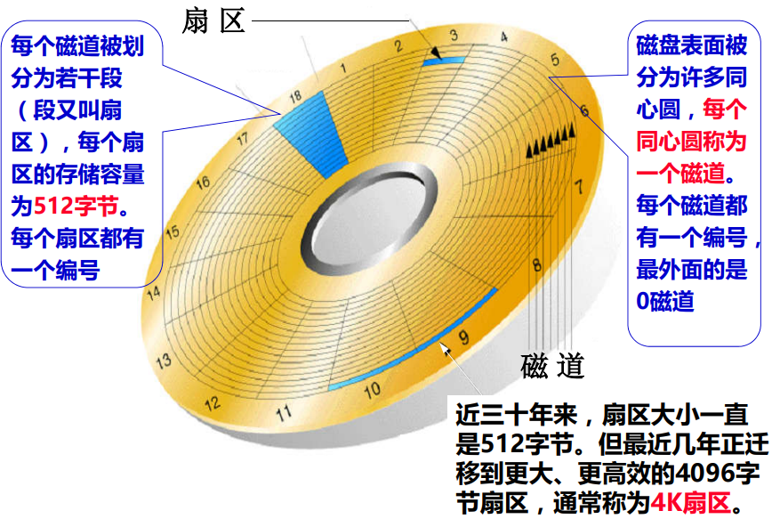
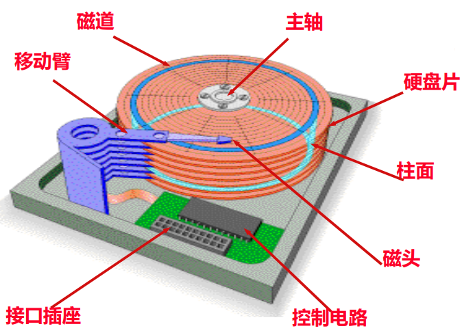

# 磁盘存储器

**概览：**

**[:question: 磁盘存储器的结构](#磁盘存储器的结构)**  
**[:question: 磁盘驱动器以及操作过程](#磁盘驱动器以及操作过程)**  
**[:question: 磁盘存储器的组成](#磁盘存储器的组成)**  
**[:question: 磁盘存储器的连接与操作](#磁盘存储器的连接与操作)**
**[:question: 固态硬盘 SSD](#固态硬盘-ssd)**

## 磁盘存储器的结构

### 磁盘存储器的信息存储原理

<div align="left"></div>

不同的磁化状态被记录在磁盘表面  
写 1：线圈通以正向电流，使呈 N-S 状态  
写 0：线圈通以反向电流，使呈 S-N 状态  
读时：磁头固定不懂，载体运动。因为载体上小的磁化单元外部的磁力线通过磁头铁芯形成闭合回路，在铁芯线圈两端得到感应电压。根据感应电压的不同的极性，可确定读出为 0 或 1

### 磁盘的磁道和扇区

<div align="left"></div>

## 磁盘驱动器以及操作过程

<div align="left"></div>

每个磁盘片都有两个面，每面都有一个磁头  
磁道号就是柱面号、磁头号就是盘面号

磁盘的操作流程：所有磁头同步寻道（由柱面号控制），选择磁头（由磁头号控制），被选中磁头等待扇区到达磁头下方（由扇区号控制），读写该扇区中的数据

### 平均存取时间

磁盘信息以扇区为单位进行读写，平均存取时间为：T = 平均寻道时间 + 平均旋转等待时间 + 数据传输时间（忽略不计）

- 平均寻道时间：磁头寻找到指定磁道所需要的平均时间（约 5ms）
- 平均旋转等待时间：指定扇区旋转到磁头下方所需平均时间（约 4~6ms，与转速有关）
- 数据传输时间：（约 0.01ms/扇区）

```txt
例：假定每个扇区512字节，磁盘转速为5400RPM，声称寻道时间（最大寻道时间的一半）为12ms，
数据传输率为4MB/s，磁盘控制器开销为1ms，不考虑排队时间，则磁盘响应时间为多少？

响应时间 = 排队延迟 + 控制器时间 + 寻道时间 + 旋转等待时间 + 传输时间
        = 0 + 1ms + 12ms + 0.5/5400 RPM + 0.5KB/(4MB/s)
        = 0 + 1ms + 12ms + 0.5/90 RPS + 0.125/1024s
        = 1ms + 12ms + 5.5ms + 0.1ms
        = 18.6ms

如果实际寻道时间只有1/3的话，则总时间变为10.6ms，这样旋转等待时间就占了近50%

为什么实际的寻道时间可能只有1/3？
访问局部性使得每次磁盘访问大多在局部几个磁道，实际寻道时间变少
```

## 磁盘存储器的组成

- 磁盘记录介质：用来保存信息
- 磁盘驱动器：包括读写电路、读写转换开关、磁头与磁头定位伺服系统等
- 磁盘控制器：包括控制逻辑、时序电路、“串并”转换电路等。（用于连接主机和盘驱动器）

磁盘驱动器的逻辑结构如下

<div align="left"></div>

## 磁盘存储器的连接与操作

<div align="left"></div>

磁盘的最小读写单位是扇区，因此，磁盘按成批数据交换方式进行读写，采用直接存储器存取（DMA，Direct Memory Access）方式进行数据输入输出，需要专门的 DMA 接口来控制外设与主存间直接数据交换，数据不通过 CPU。通常把专门用来控制总线进行 DMA 传送的接口硬件称为 DMA 控制器

读一个磁盘扇区步骤如下

- 第一步

<div align="left"></div>

- 第二步

<div align="left"></div>

- 第三步

<div align="left"></div>

## 固态硬盘 SSD

- 固态硬盘（Solid State Disk，简称 SSD）也被称为电子硬盘
- 它斌不是一种磁表面存储器，而是一种使用 NAND 闪存组成的外部存储系统，与 U 盘并没有本质差别，只是容量更大，存取性能更好
- 电信号的控制使得固态硬盘的内部传输速率远远高于常规硬盘
- 其接口规范和定义、功能及使用方法与传统硬盘完全相同，在产品外形和尺寸上也与普通硬盘一致。目前接口标准上使用 USB、SATA 和 IDE，因此 SSD 是通过标准磁盘接口与 I/O 总线互连的
- 在 SSD 中有一个闪存翻译层，它将来自 CPU 的逻辑磁盘块读写请求翻译成对底层 SSD 物理设备的读写控制信号。因此，这个闪存翻译层相当于磁盘控制器
- 闪存的擦写次数有限，所以频繁擦写会降低其写入使用寿命
- 它用闪存颗粒代替了磁盘作为存储介质，利用闪存的特点，以区块写入和抹除的方式进行数据的写入
- 写操作比读操作慢得多。顺序读比顺序写大致快一倍，而随机读比随机写大致快 10 倍。 随机读写延时比硬盘低两个数量级（随机读约为几十微秒，随机写约为几百微秒）
- 一个闪存芯片由若干个区块组成，每个区块由若干页组成。通常，页大小为 512B~4KB，每个区块由 32~128 个页组成，因而区块大小为 16KB~512KB，数据可以按页为单位进行读写
- 当需要写某页信息时，必须先对该页所在的区块进行擦除操作。一旦一个区块被擦除过，区块中的每一页就可以直接再写一次。若某一区块进行了大约 100 000 次重复写之后，就会被磨损而变成坏的区块，不能再被使用。因此，闪存翻译层中有一个专门的均化磨损（wear leveling）逻辑电路，试图将擦除操作平均分布在所有区块上，以最大限度地延长 SSD 的使用寿命。由此可见，对于物理区块的写优化是由 SSD 中的硬件实现的，无需软件进行写
  优化
