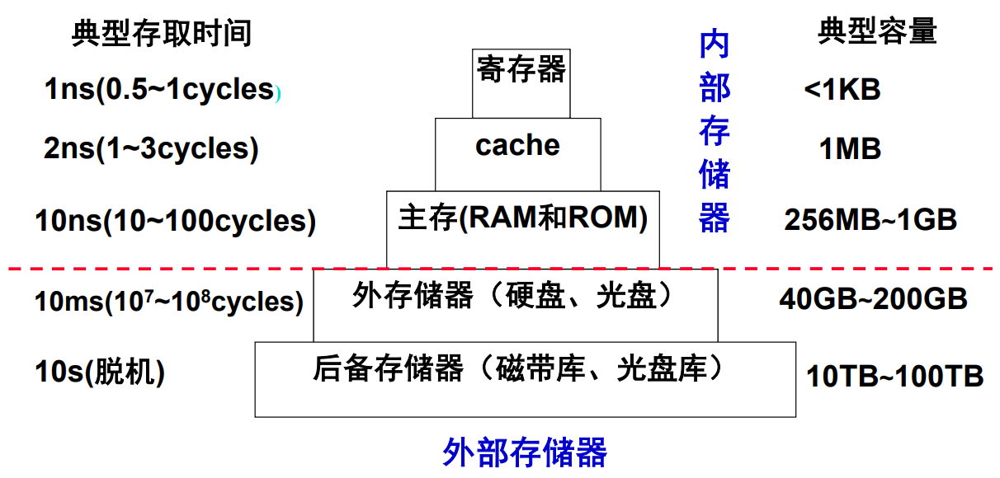
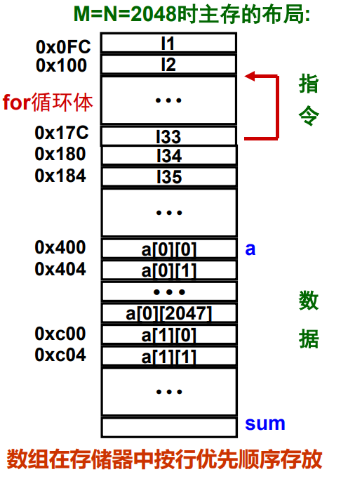
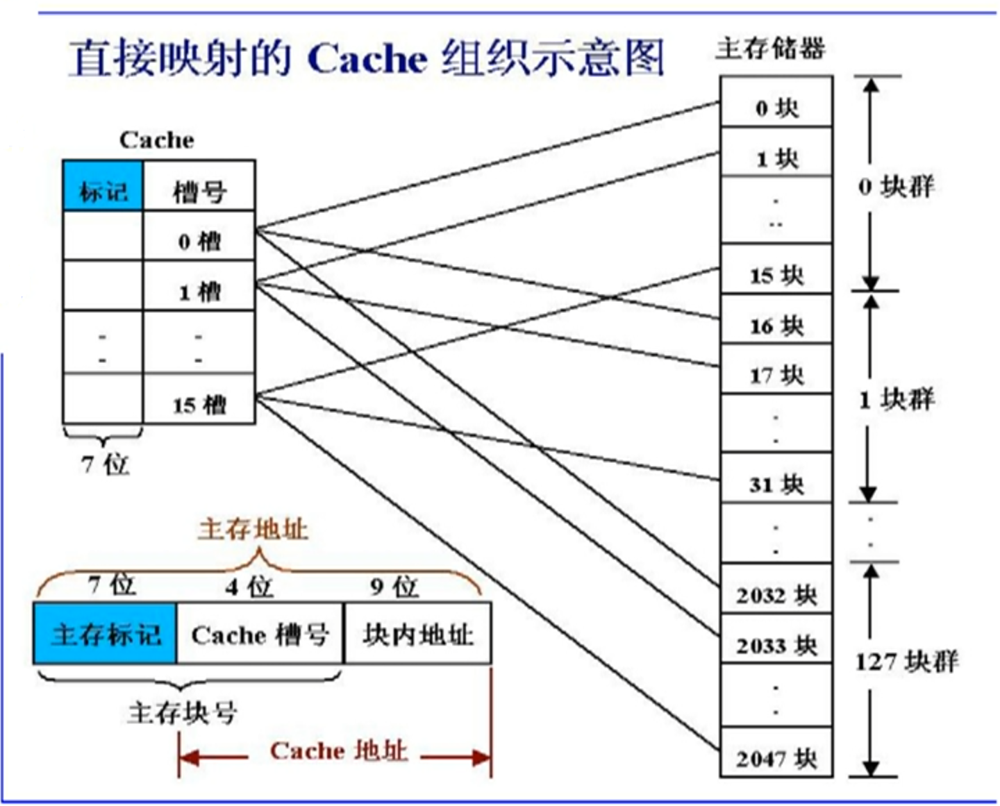
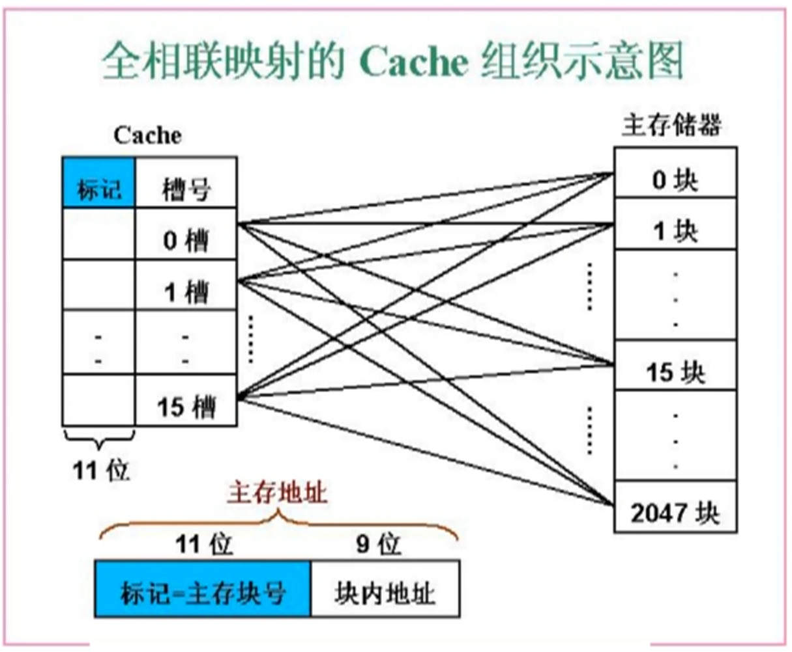
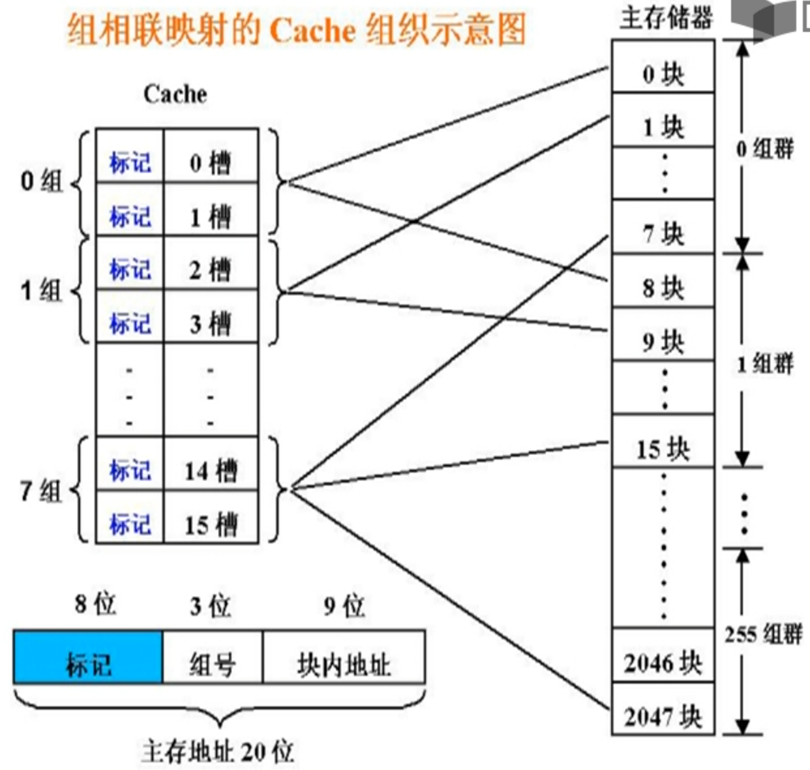

# 高速缓存概述

**概览：**

**[:question: 存储器层次结构概述](#存储器层次结构概述)**  
**[:question: Cache 基本概述](#cache-基本概述)**  
**[:question: Cache 映射方式](#cache-映射方式)**  
**[:question: Cache 命中率和缺失率](#cache-命中率和缺失率)**  
**[:question: Cache 的关联度](#cache-的关联度)**

## 存储器层次结构概述

<div align="left"></div>

数据总是在相邻两层之间复制传送。越上层越靠近 CPU，越下层越远离 CPU  
数据间的传送以块（block）为最小传送单位

为什么这种层次化结构是有效的？  
时间局部性：刚被访问过的单元很可能不久又被访问；这使得最近被访问过的信息保留在靠近 CPU 的存储器中  
空间局部性：刚被访问过的单元的邻近单元很可能不久被访问；这使得刚被访问过的单元的邻近单元调到靠近 CPU 的存储器中

加快访存速度的措施就是在 CPU 和内存之间加入 Cache  
大量典型程序的运行情况分析结果表明：在较短时间间隔内，程序产生的地址往往集中在一个很小范围内。这种现象称为程序访问的局部性：空间局部性、时间局部性

程序具有访问局部性特征的原因：

- 指令：指令按序存放，地址连续，循环程序段或子程序段重复执行
- 数据：连续存放，数组元素重复、按序访问

为什么引入 Cache 会加快访存速度？  
在 CPU 和主存之间设置一个快速小容量的存储器，其中总是存放最活跃（被频繁访问）的程序和数据，由于程序访问的局部性特征，大多数情况下，CPU 能直接从这个高速缓存中取得指令和数据，而不必访问主存

### 局部性例子

```c
程序A
int sumarrayrows(int a[M][N])
{
    int i, j, sum = 0;
    for (i = 0; i < M; i++)
        for (j = 0; j < N; j++)
            sum += a[i][j];
    return sum;
}

程序B
int sumarraycols(int a[M][N])
{
    int i, j, sum = 0;
    for (j = 0; j < N; j++)
        for (i = 0; i < M; i++)
            sum += a[i][j];
    return sum;
}
```

<div align="left"></div>

程序 A 的时间局部性和空间局部性分析

1. 数组 a：访问顺序为 a[0][0],a[0][1],......,a[0][2047];a[1][0]....a[1][2047]，与存放顺序一致，故空间局部性好
2. 变量 sum：单个变量不考虑空间局部性；每次循环都要访问 sum，所以其时间局部性好
3. for 循环体：循环体内指令按序存放，所以空间局部性好。循环体被连续重复执行了 2048×2048 次，所以时间局部性好
4. 实际上，优化的编译器使循环中的 sum 分配在寄存器中，最后才写回存储器

程序 B 的时间局部性和空间局部性分析

1. 数组 a：访问顺序为 a[0][0],a[1][0],......,a[2047][0];a[0][1],......,a[2047][1]......,与存放顺序不一致，每次跳过 2048 个单元，若 cache 交换单位小于 2kb，则没有空间局部性
2. 变量 sum：同程序 A
3. for 循环体：同程序 A

程序 A 的执行

## Cache 基本概述

- cache 是一种小容量高速缓冲存储器，它由 SRAM 组成
- cache 直接制作在 CPU 芯片内，速度几乎与 CPU 一样快
- 程序运行时，CPU 使用的一部分数据/指令会预先成批拷贝在 cache 中，cache 的内容是主存储器中部分内容的映象
- 当 CPU 需要从内存读写数据或指令时，先检查 cache，若有，就直接从 cache 中读取，而不用访问主存储器

### Cache 的操作过程

1. CPU 给出主存地址 AD
2. 判断 AD 所在块是否在 cache 中
   1. 是，从 cache 中取信息送 CPU
   2. 否，从主存取出 AD 单元所在块，在 cache 中找到一个对应的空闲行，将 AD 单元内容送 CPU 且将主存块复制到 cache

若被访问的信息不在 cache 中，称为缺失或失靶（miss）  
若被访问的信息在 cache 中，称为命中（hit）

注意：指令给出的 AD 是虚拟地址，所以还需将虚拟地址转为内存地址

### Cache 的实现

要实现 cache 机制需要解决哪些问题？

- 如何分块？
- 主存块和 cache 之间如何映射
- cache 已满时，怎么办
- 写数据时怎么保证 cache 和 mm 的一致性
- 如何根据主存地址访问到 cache 中的数据

## Cache 映射方式

- 什么是 cache 的映射功能  
  把访问的局部主存区域取到 cache 中时，该放到 cache 的何处  
  cache 行比主存块少，多个主存块映射到一个 cache 行中
- 如何进行映射
  - 主存被分成若干大小相同的块，称为主存块（Block）
  - cache 中存放一个主存块的对应单位称为 cache 行（line）或槽（slot）
- 三种映射方式
  - 直接映射（Direct）：每个主存块映射到 cache 的固定行
  - 全相联映射（Full Associate）：每个主存块映射到 cache 的任一行
  - 组相联（Set Associate）：每个主存块映射到 cache 固定组的任一行

### 直接映射

也称为模映射

- 把主存的每一块映射到一个固定的 cache 行
- 映射关系为：cache 行号 = 主存块号 mod cache 行数  
  例：4=100 mod 16（假设 cache 共 16 行，主存第 100 块映射到 cache 的第 4 行）
- 特点
  - 容易实现，命中时间短
  - 无需考虑替换问题
  - 不够灵活，cache 存储空间得不到充分利用，命中率低  
    例如，需将主存第 0 块与第 16 块同时复制到 cache 中，由于它们都只能复制到 cache 第 0 行，即使 cache 其他行空闲，也有一个主存块不能写入 cache。这样就会频繁的 cache 装入

假定数据在主存和 cache 间的传送单位为 512B，cache 大小 $2^{13}$ =8KB=16 行 ×512B/行，主存大小：$2^{20}$=1024KB=2048 块 ×512B/块。那么如何对 0220CH 单元进行访问？

主存大小共 2048 块，那么 2048/16=128 个块群，可以用 7 位表示；cache 一共 16 行，用 4 位表示；每个主存块 512B，可以用 9 位表示

<div align="left"></div>

所以 0220CH 是 0000 0010 0010 0000 1100B 是第一块群中的 0001 块（即第 17 块）中的第 12 个单元。但是需要判断改 cache 是否为空，需要引入一个有效位 V，那么 cache 的结构就变成了 V+TAG+DATA

1. V 为有效位，为 1 表示信息有效，为 0 表示信息无效
2. 开机或复位时，使所有行的有效位 V=0
3. 某行被替换后使其 V=1，某行装入新块时，使其 V=1
4. 通过使 V=0 来冲刷 cache（例如：进程切换时，DMA 传送时）
5. 通常为操作系统设置“cache 冲刷”指令，因此，cache 对操作系统程序员不是透明的

### 全相联映射

每个主存块可装到 cache 任一行

假定数据在主存和 cache 间的传送单位为 512B，cache 大小 $2^{13}$ =8KB=16 行 ×512B/行，主存大小：$2^{20}$=1024KB=2048 块 ×512B/块

<div align="left"></div>

如何实现按内容访问？直接比较 cache，新增比较器，同时比较所有 cache 项的标志，每一行需要一个比较器  
为什么地址中没有 cache 索引字段？因为可以映射到任意一个 cache 行

如何对 01E0CH 单元进行访问？0000 0001 1110 0000 1100B 是第 15 块中的第 12 个单元

### 组相联映射

- 组相联映射结合直接映射和全相联映射的特点
- 将 cache 所有行分组，把主存块映射到 cache 固定组的任一行。也即：组间模映射、组内全映射  
  cache 组号 = 主存块号 mod cache 组数  
  举例：假定 cache 划分为：8K 字=8 组 ×2 行/组 ×512 字/行
  4=100 mod 8 （主存第 100 块应映射到 cache 的第 4 组的任意行中）
- 特点
  - 结合直接映射和全相联映射的优点。当 cache 组数为 1 时，变为相联映射；当每组只有一个槽时，变为直接映射
  - 每组 2 或 4 行（称为 2-路或 4-路组相联）较常用。通常每组 4 行以上很少用。在较大容量的 L2 cache 和 L3 cache 中使用 4-路以上

假定数据在主存和 cache 间的传送单位为 512B，cache 大小 $2^{13}$ =8KB=16 行 ×512B/行，主存大小：$2^{20}$=1024KB=2048 块 ×512B/块

<div align="left"></div>

如何对 0120CH 单元进行访问？0000 0001 0010 0000 1100B 是第 1 组群中的 001 块（即第 9 块）中第 12 个单元。所以映射到第一组中

## Cache 命中率和缺失率

- 命中（Hit）：要访问的信息在 cache 中
  - 命中率（Hit Rate）：在 cache 中的概率
  - 命中时间（Hit Time）：在 cache 中的访问时间，包括：判断时间 + cache 访问
- 缺失（Miss）：要找的信息不在 cache 中
  - 缺失率（Miss Rate）= 1 - 命中率
  - 缺失损失（Miss penalty）：访问一个主存块所花时间

要提高平均访问速度，必须提高命中率

## Cache 的关联度

- 三种映射方式
  - 直接映射：唯一映射（只有一个可能的位置）
  - 全相联映射：任意映射（每个位置都有可能）
  - N-路组相联映射：N-路映射（有N个可能位置）
- 什么叫关联度  
  一个主存块映射到cache中，可能存放的位置个数
  - 直接映射关联度：关联度最低，为1
  - 全相联映射关联度：关联度最高，为cache行数
  - N-路组相联映射关联度：关联度居中，为N
- 关联度和缺失率有什么关系？和命中时间的关系是？
  - 缺失率：直接映射最高，全相联映射最低
  - 命中时间：直接映射最小，全相联映射最大
