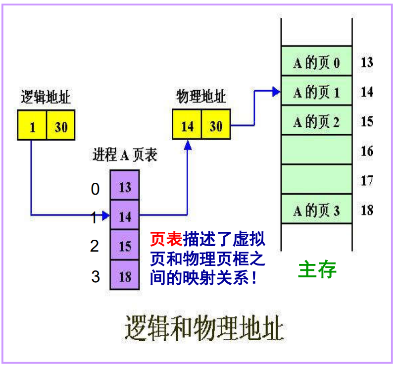
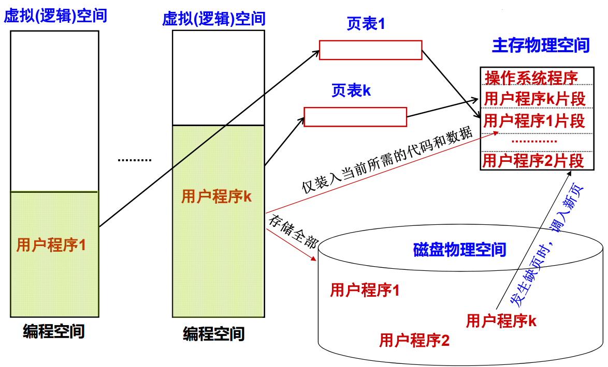
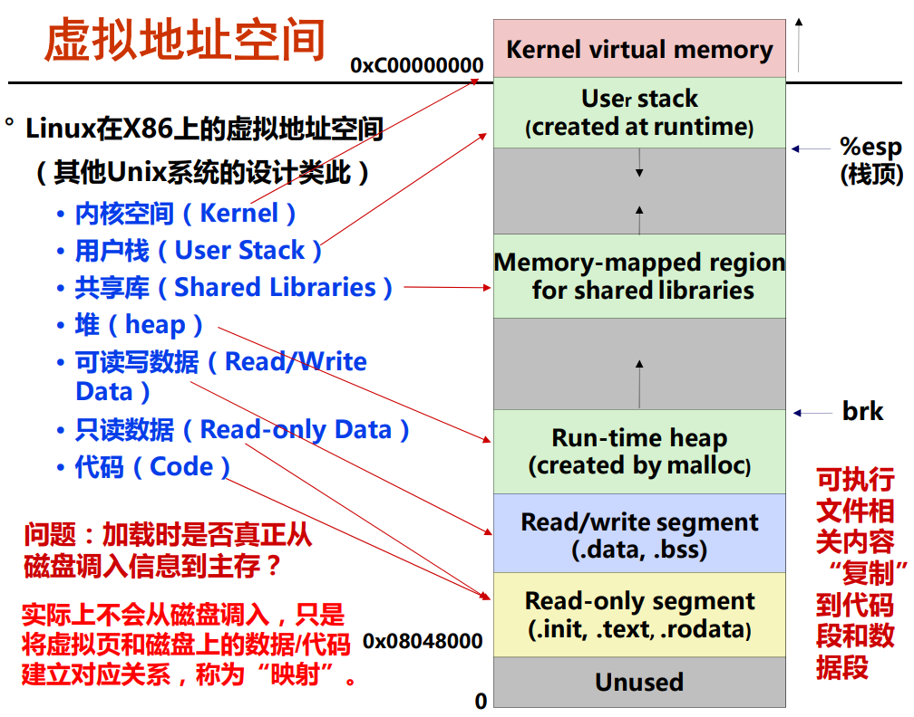
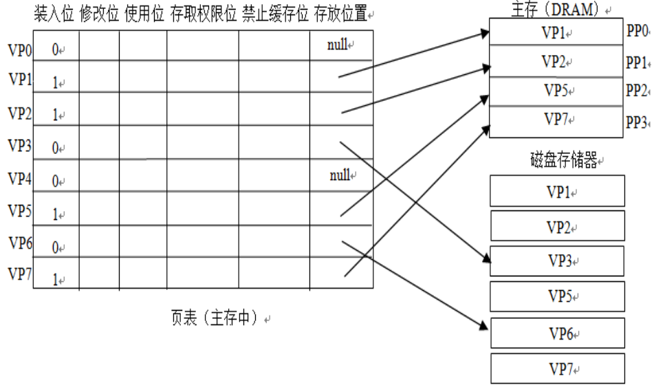
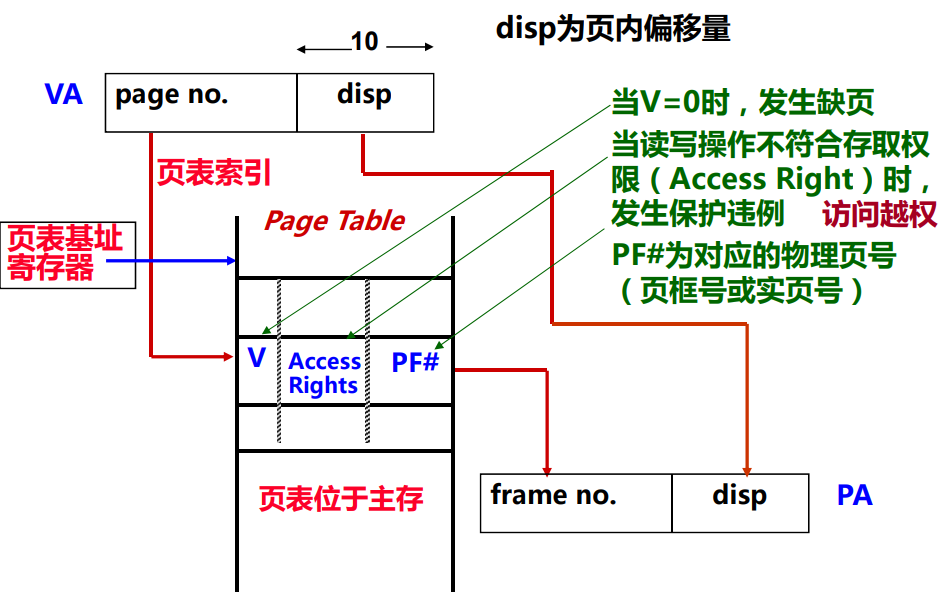
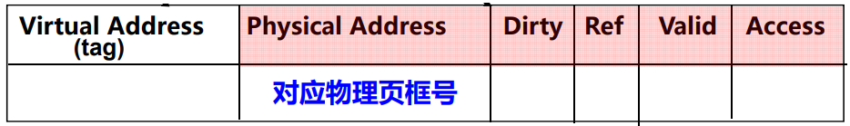
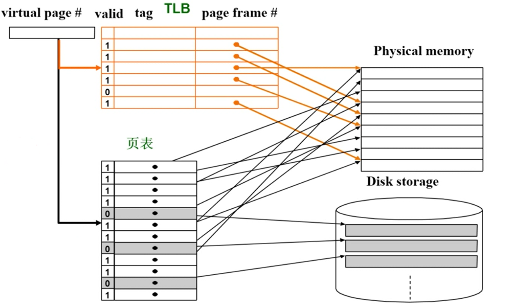
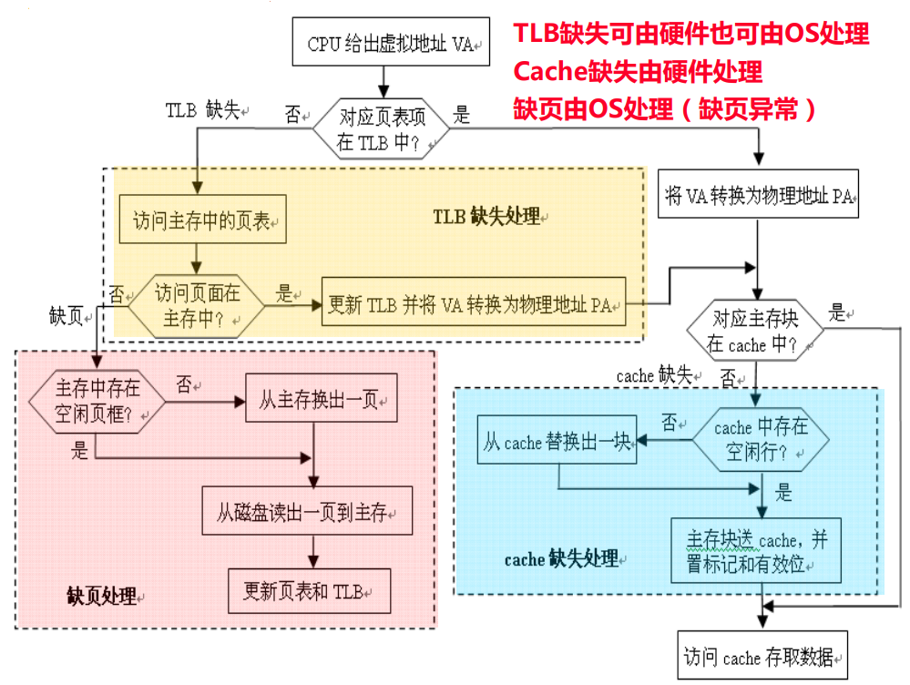
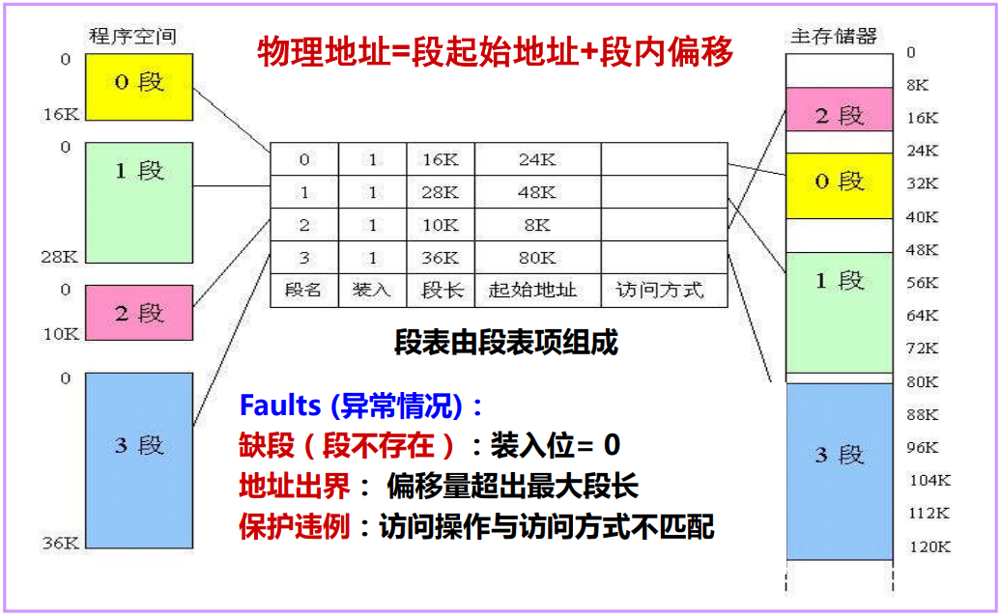

# 虚拟存储器

**概览：**

**[:question: 分页存储管理的基本概念](#分页存储管理的基本概念)**  
**[:question: 虚拟存储器及虚拟地址空间](#虚拟存储器及虚拟地址空间)**  
**[:question: 分页存储管理的实现](#分页存储管理的实现)**  
**[:question: 存储器访问过程](#存储器访问过程)**  
**[:question: 段式和段页式虚拟存储管理](#段式和段页式虚拟存储管理)**  
**[:question: 存储保护](#存储保护)**

## 分页存储管理的基本概念

### 早期分页方式

#### 概念

早期：程序员自己管理主存，通过分解程序并覆盖主存的方式执行程序  
1961 年，英国曼切斯特研究人员提出一种自动执行 overlay 的方式  
动机：把程序员从大量繁琐的存储管理工作中解放出来，使得程序员
编程时不用管主存容量的大小  
基本思想：把地址空间和主存容量的概念区分开来。程序员在地址空间里编写程序，而程序则在真正的内存中运行。由一个专门的机制实现地址空间和实际主存之间的映射。

举例说明：  
例如，当时的一种典型计算机，其指令中给出的主存地址为 16 位，而主存容量只有 4K 字，则指令可寻址范围是多少？  
地址空间为 0、1、2…、65535 组成的地址集合，即地址空间大小为 $2^{16}$。程序员编写程序的空间（地址空间，可寻址空间）比执行程序的空间（主存容量）大得多，怎么自动执行程序呢？

#### 实现

- 将地址空间划分成 4K 大小的区间，装入内存的总是其中的一个区间
- 执行到某个区间时，把该区间的地址自动映射到 0~4095 之间，例如：4096→0, 4097→1, ……, 8191→4095
  - 执行到 4096~8191 之间的程序段时，自动做：
    - 把当前主存内容保存到磁盘上；
    - 在盘上找到 4096~8191 之间的程序段并读入主存
    - 改变地址映射（仅改映射区间号（页号））
    - 程序继续运行
- 程序员在 0~65535 范围内写程序，完全不用管在多大的主存空间上执行，所以，这种方式对程序员来说，是透明的！
- 可寻址的地址空间是一种虚拟内存

后来把区间称为页(page)，主存中存放页的区域称为页框(page frame)  
早期主存只有一个页框！

### 分页

基本思想：

- 内存被分成固定长且比较小的存储块（页框、实页、物理页）
- 每个进程也被划分成固定长的程序块（页、虚页、逻辑页）
- 程序块可装到存储器中可用的存储块中
- 无需用连续页框来存放一个进程
- 操作系统为每个进程生成一个页表
- 通过页表(page table)实现逻辑地址向物理地址转换（Address Mapping）

逻辑地址（Logical Address）： 程序中指令所用地址(进程所在地址空间)，也称为虚拟地址（Virtual Address，简称 VA）  
物理地址（Physical Address，简称 PA）：存放指令或数据的实际内存地址，也称为实地址、主存地址

Q：是否需要将一个进程的全部装入内存？  
A：根据程序访问局部性可知：可把当前活跃的页面调入主存，其余留在磁盘上

采用“按需调页（Demand Paging）”方式分配主存，这就是虚拟存储管理概念

优点：浪费的空间最多是最后一页的部分

## 虚拟存储器及虚拟地址空间

### 虚拟存储技术

虚拟存储技术的引入用来解决一对矛盾：一方面，由于技术和成本等原因，主存容量受到限制；另一方面，系统程序和应用程序要求主存容量越来越大

虚拟存储技术的实质：

- 程序员比实际主存空间大得多的逻辑地址空间中编写程序
- 程序执行时，把当前需要的程序段和相应的数据块调入主存，其它暂不用的部分存放在磁盘上
- 指令执行时，通过硬件将逻辑地址（也称虚拟地址或虚地址）转换为物理地址（也称主存地址或实地址）
- 在发生程序或数据访问失效（缺页）时，由操作系统进行主存和磁盘之间的信息交换

虚拟存储器机制由硬件与操作系统共同协作实现，涉及到操作系统中的许多概念，如进程、进程的上下文切换、存储器分配、虚拟地址空间、缺页处理等

### 虚拟地址空间

### 虚拟存储器管理

实现虚拟存储器管理，需考虑：

- 块大小（在虚拟存储器中“块”被称为“页”）应该多大
- 主存与辅存的空间如何分区管理
- 程序块/存储块之间如何映像
- 逻辑地址和物理地址如何转换，转换速度如何提高
- 主存与辅存之间如何进行替换
- 页表如何实现，页表项中要记录哪些信息
- 如何加快访问页表的速度
- 如果要找的内容不在主存，如何处理
- 如何保护进程各自的存储区不被其它进程访问

有三种虚拟存储器实现方式：分页式、分段式、段页式

与“Cache--主存”层次相比：

- 页大小（2KB~64KB）比 Cache 中的 Block 大得多！Why？采用全相联映射！Why?  
  因为缺页的开销比 Cache 缺失开销大的多！缺页时需要访问磁盘（约几百万个时钟周期），而 cache 缺失时，访问主存仅需几十到几百个时钟周期！因此，页命中率比 cache 命中率更重要！“大页面”和“全相联”可提高页命中率
- 通过软件来处理“缺页”！Why?  
  缺页时需要访问磁盘（约几百万个时钟周期），慢！不能用硬件实现
- 采用 Write Back 写策略！Why?  
  避免频繁的慢速磁盘访问操作
- 地址转换用硬件实现！Why?  
  加快指令执行

## 分页存储管理的实现

### 页表结构

- 每个进程有一个页表，其中有装入位、修改位、替换控制位、访问权限位、禁止缓存位、实页号
- 一个页表的项数由上面决定的？  
  理论上由虚拟地址空间大小决定
- 每个进程的页表大小一样吗？  
  各进程有相同虚拟空间，故理论上一样。实际大小看具体实现方式，如“空洞”页面如何处理等

- 未分配页：进程的虚拟地址空间中“空洞”对应的页（如 VP0、VP4）
- 已分配的缓存页：有内容对应的已装入主存的页（如 VP1、VP2、VP5 等）
- 已分配的未缓存页：有内容对应但未装入主存的页（如 VP3、VP6）

### 地址转换

Q：虚拟页与主存页框之间采用全相联方式进行映射，为何不像全相联 cache 那样（高位地址是 Tag），而高位地址是索引呢？

信息访问中可能出现的异常情况：

1. 缺页（page fault）  
   产生条件：当 valid（装入位/有效位）为 0 时  
   相应处理：从磁盘读到内存，若内存没有空间，则还要从内存选择一页替换到磁盘上，替换算法类似 cache，采用回写法，淘汰时，根据“dirty”位确定是否要写磁盘  
   当前指令执行被阻塞，当前进程被挂起，处理结束回到原指令继续执行
2. 保护违例（protection violation fault）或访问违例  
   产生条件：当 access rights（存取权限）与所指定的具体操作不符时  
   相应处理：屏幕上显示“内存保护错”或“访问违例”信息  
   当前指令的执行被阻塞，当前进程被终止  
   _access rights 有：R=Read-only; R/W=read/write; X=execute only_

### 快表

把经常要查的页表项放到 cache 中，这种在 cache 中的页表项组成的页表称为 Translation Lookaside Buffer 或 TLB（快表）  
引入快表的目的就是减少到内存查页表的次数

TLB 中页表项组成：tag + 主存页表项

cpu 访存时，地址中虚页号被分为 tag+index，tag 用于和 TLB 页表项中的 tag 比较，index 用于定位需要比较的表项  
TLB 全相联时，没有 index，只有 tag，虚页号需与每个 tag 比较  
TLB 组相联时，则虚页号高位为 tag，低位为 index，用作组索引

这里 TLB 采用全相联映射方式，VP#需要和每个 tag 比较

查找过程：先由虚页号到 TLB 中找，若 TLB 中的 valid=0 或 tag≠VA，则到页表中找；若页表中 valid=0，则缺页，到磁盘中找

## 存储器访问过程

三种不同缺失的组合

| TLB  | Page Table | Cache | 说明                                                   |
| ---- | ---------- | ----- | ------------------------------------------------------ |
| hit  | hit        | miss  | 可能，TBL 命中则页表一定命中，但实际上不会询页表       |
| miss | hit        | hit   | 可能，TLB 缺失但页表命中，信息在主存，就可能在 Cache   |
| miss | hit        | miss  | 可能，TLB 缺失但页表命中，信息在主存，但可能不在 Cache |
| miss | miss       | miss  | 可能，此时信息还在磁盘                                 |
| hit  | miss       | miss  | 不可能，页表缺失，信息不在主存，TLB 中一定没有该页表项 |
| hit  | miss       | hit   | 不可能，页表缺失，信息不在主存，TLB 中一定没有该页表项 |
| miss | miss       | hit   | 不可能，页表缺失，信息不在主存，Cache 中一定没有该信息 |

## 段式和段页式虚拟存储管理

### 分段式虚拟存储器

- 程序员或 OS 将程序模块或数据模块分配给不同的主存段，一个大程序有多个代码段和多个数据段组成，是按照程序的逻辑结构划分而成的多个相对独立的部分。（如代码段、只读数据段、可读写数据段等）
- 段通常带有段名或基地址，便于编写程序、编译器优化和操作系统调度管理
- 分段系统将主存空间按实际程序中的段来划分，每个段在主存中的位置记录在段表中，并赋以“段长”项
- 段表由段表现组成，段表本身也是主存中的一个可再定位段

### 段页式虚拟存储器

- 段、页式结合：程序的虚拟地址空间按模块分段、段内再分页，进入主存仍以页为基本单位
- 逻辑地址由段地址、页地址和偏移量三个字段构成
- 用段表和页表（每段一个）进行两级定位管理
- 根据段地址到段表中查询与该段相应的页表首地址，转向页表，然后根据页地址从页表中查到该页在主存中页框地址，由此再访问到业内某数据

## 存储保护

- 什么是存储保护  
  为避免多道程序相互干扰，防止某程序出错而破坏其它程序的正确性或不合法地访问其它程序或数据区，应对每个程序进行存储保护
- 操作系统程序和用户程序都需要保护
- 以下情况会发生存储保护错
  - 地址越界：转换得到的物理地址不属于可访问范围
  - 访问越权：访问操作与所拥有的访问权限不符（页表中设定访问权限）
- 访问属性的设定
  - 数据段可指定 R/W 或 RO；程序段可指定 R/E 或 RO
- 最基本保护措施：规定各道程序只能访问属于自己所在的存储区和共享区
  - 对于数据自己的存储区信息：可读可写，只读/只可执行
  - 对于共享区或已获授权的其它用户信息：可读不可写
  - 对未获授权的信息（如 OS 内核、页表等）：不可访问
