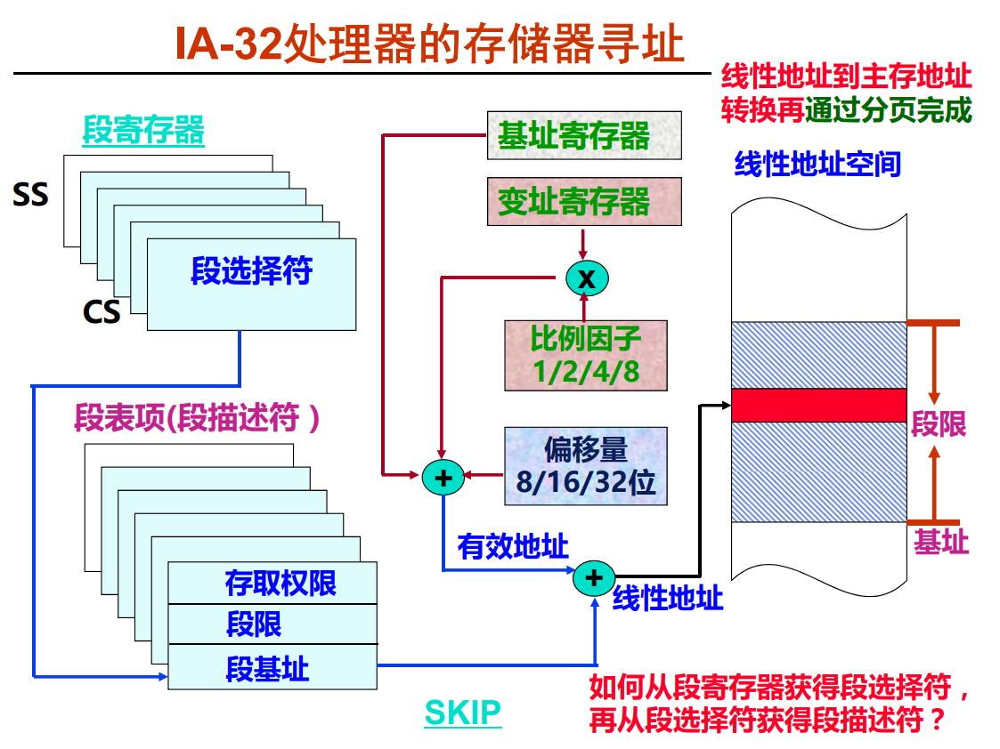

# IA-32+Linux中的地址转换

**概览：**

**[:question: IA-32 的地址转换和寻址方式](#ia-32-的地址转换和寻址方式)**  
**[:question: 段寄存器和段选择符](#段寄存器和段选择符)**  
**[:question: 段描述符和段描述表](#段描述符和段描述表)**  
**[:question: 逻辑地址向线性地址的转换](#逻辑地址向线性地址的转换)**  
**[:question: 线性地址向物理地址的转换](#线性地址向物理地址的转换)**

## IA-32 的地址转换和寻址方式

### 地址转换

- 按字节编址（通用计算机大多是）
- 在保护模式下，IA-32 采用段页式虚拟存储管理方式
- 存储地址采用逻辑地址、线性地址和物理地址来进行描述，其中，逻辑地址和线性地址是虚拟地址的两种不同表示形式，描述的都是 4GB 虚拟地址空间中的一个存储地址
  - 逻辑地址由 48 位组成，包含 16 位段选择符和 32 位段内偏移量（即有效地址）
  - 线性地址 32 位（其位数由虚拟地址空间大小决定）
  - 物理地址 32 位（其位数由存储器总线中的地址线条数决定）
- 分段过程将实现逻辑地址转为线性地址
- 分页过程将实现线性地址转为物理地址

若页大小为 4KB，每个页表项占 4B，因为 $2^{32}/2{12}=2{20}$，故页表大小为 4MB，比页还大。所以会采用多级页表方式  
通常情况下，页内地址为 12 位，每页占 4KB，IA-32 的虚拟地址为 32 位，采用两级页表，Core i7 虚拟地址占 48 位，采用 4 级页表

### 寻址方式

[IA-32 寻址方式](../第一部分-程序的表示、转换与链接/5-IA-32指令系统概述.md#ia-32-的寻址方式)

IA-32 指令：`movw 8(%ebp,%edx,4),%ax    // R[ax]=M[R[ebp]+R[edx]*4+8]`  
该指令需要进行地址转换：逻辑地址 -> 线性地址 -> 物理地址  
该指令信息如下：

- 段寄存器 SR（隐含或显示给出），该指令是隐含
- 8/16/32 位偏移量 A（显示给出），该指令是偏移 8
- 基址寄存器 B（明显给出，任意通用寄存器），该指令是%ebp
- 变址寄存器 I（明显给出，除 ESP 外任意通用寄存器皆可），该指令是%edx

## 段寄存器和段选择符

[IA-32 寄存器组织](../第一部分-程序的表示、转换与链接/5-IA-32指令系统概述.md#ia-32-寄存器组织)

### 段寄存器

段寄存器（16 位），用于存放段选择符

- CS（代码段）：程序代码所在段
- SS（栈段）：栈区所在段
- DS（数据段）：全局静态数据区所在段
- 其它三个段寄存器 ES、GS 和 FS 可指向任意数据段

### 段选择符

- TI=0，选择全局描述符表（GDT）；TI=1，选择局部描述符表（LDT）
- RPL=00，为第 0 级，位于最高级的内核态；RPL=11，为第 3 级，位于最低级的用户态，第 0 级高于第 3 级
- 高 13 位索引用来确定当前使用的段描述符在描述表中的位置

CS 寄存器中的 RPL 字段表示 CPU 的当前特权级 CPL（Current Privilege Level）

## 段描述符和段描述表

### 段描述符

段描述符是一种数据结构，实际上就是段表项，分两类：

- 普通段：用户/内核的代码段和数据段描述符
- 系统控制段描述符，又分两种
  - 特殊系统控制段描述符，包括：局部描述符表（LDT）描述符和任务段（TSS）描述符
  - 控制转移类描述符，包括：调用门描述符、任务门描述符、中断门描述符和陷阱门描述符

- B31~B0：32 位基地址；L19~L0：20 位限界，表示段中最大页号
- G：粒度。G=1 以页（4KB）为单位；G=0 以字节为单位。因为限界为 20 位，故 G=0 时最大的段为 1MB；G=1 时，最大段为 4KB×$2^{30}$=4GB
- D：D=1 表示段内偏移量为 32 位宽，D=0 表示段内偏移量为 16 位宽
- P：P=1 表示存在，P=0 表示不存在。linux 总把 P 置 1，不会以段为单位淘汰
- DPL：访问段时对当前特权级的最低等级要求。因此，只有 CPL 为 0（内核态）时才可访问 DPL 为 0 的段，任何进程都访问 DPL 为 3 的段（0 最高，3 最低）
- S：S=0 系统控制描述符，S=1 普通的代码段或数据段描述符
- TYPE：段的访问权限或控制系统描述符类型
- A：A=1 已被访问过，A=0 未被访问过。（通常 A 包含在 TYPE 字段中）

### 段描述符表

段描述符表实际上就是段表，由段描述符（段表现）组成。有三种类型：

- 全局描述符表 GDT：只有一个，用来存放系统内每个任务共用的描述符，如：内核代码段、内核数据段、用户代码段、用户数据段以及 TSS（任务状态段）等
- 局部描述符表 LDT：存放某任务（即用户进程）专门的描述符
- 中断描述符表 IDT：包含 256 个中断门、陷阱门和任务门描述符

### 用户不可见寄存器

为支持分段机制，CPU 中有多个用户不可访问的内部寄存器，操作系统通过特权指令可对寄存器 TR、LDTR、GDTR 和 IDTR 进行读写

## 逻辑地址向线性地址的转换

被选中的段描述符先被送至描述符 cache，每次从描述符 cache 中取 32 位段基址，与 32 位段内偏移量（有效地址）相加得到线性地址

### Linux 中 IA-32 的分段机制

- 为使能移植到绝大多数流行处理器平台，Linux 简化了分段机制
- RISC 对分段支持非常有限，因此 Linux 仅使用 IA-32 的分页机制，对于分段，则通过在初始化时将所有段描述符的基址设为 0 来简化
- 若把运行在用户态的所有 linux 进程的代码段和数据段分别称为用户代码段和用户数据段；把运行在内核态的内核代码段和数据段分别称为内核代码段和内核数据段，则 linux 初始化时，将上述 4 个段的段描述符中各字段设置成下表中信息：

  | 段         | 基地址      | G   | 限界    | S   | TYPE | DPL | D   | P   |
  | ---------- | ----------- | --- | ------- | --- | ---- | --- | --- | --- |
  | 用户代码段 | 0x0000 0000 | 1   | 0xFFFFF | 1   | 10   | 3   | 1   | 1   |
  | 用户数据段 | 0x0000 0000 | 1   | 0xFFFFF | 1   | 2    | 3   | 1   | 1   |
  | 内核代码段 | 0x0000 0000 | 1   | 0xFFFFF | 1   | 10   | 0   | 1   | 1   |
  | 内核数据段 | 0x0000 0000 | 1   | 0xFFFFF | 1   | 2    | 0   | 1   | 1   |

  初始化时，上述 4 个段描述符被存放在 GDT 中

### IA-32 中的控制寄存器

控制寄存器保存机器的各种控制和状态信息，它们将影响系统所有任务的运行，操作系统进行任务控制或存储管理时使用这些控制和状态信息

- CR0：控制寄存器
  - PE：1 为保护模式。一旦在保护模式，不能再将 PE 清零，只能重启系统以回到实模式
  - PG：1-启用分页；0-禁止分页，此时线性地址被直接作为物理地址使用。若要启用分页机制，则 PE 和 PG 都要置 1
  - 任务切换位 TS：任务切换时将其置 1，切换完毕则清 0，可用 CLTS 指令将其清 0
  - 对齐屏蔽位 AM
  - cache 功能控制位 NW（Not Write-through）和 CD（Cache Disable）。只有当 NW 和 CD 均为 0 时，cache 才能工作
- CR2：页故障（page fault）线性地址寄存器  
  存放引起页故障的线性地址。只有在 CR0 中的 PG=1 时，CR2 才有效
- CR3：页目录基址寄存器
  - 保存页目录表的起始地址。只有当 CR0 中的 PG=1 时，CR3 才有效

## 线性地址向物理地址的转换

线性地址空间划分：4GB=1K 个子空间 \* 1K 个页面 \* 4KB/页

IA-32 采用二级页表方式，页目录项和页表项格式一样，有 32 位（4B）

### IA-32 的页目录项和页表项

- P：1 表示页表或页在主存中；P=0 表示页表或页不在主存，即缺页，此时需要将页故障线性地址保存到 CR2
- R/W：0 表示页表或页只能读不能写；1 表示可读可写
- U/S：0 表示用户进程不能访问；1 表示允许访问
- PWT：控制页表或页的 cache 写策略是全写还是回写
- PCD：控制页表或页能否被缓存到 cache 中
- A：1 表示指定页表或页被访问过，初始化时 OS 将其清 0.利用该标志，OS 可清楚了解哪些页表或页正在使用，一般选择长期未用的页或近来最少使用的页调出主存。由 MMU 在进行地址转换时将该位置 1
- D：修改位（脏位）。页目录项中无意义，只有在页表项中有意义。初始化时将 OS 将其清 0，由 MMU 在进行写操作的地址转换时将该位置 1
- 高 20 位是页表或页在主存中首地址对应的页框号，即首地址的高 20 位。每个页表的起始位置都按 4KB 对其

例子：IA-32 中，指令`movl 8(%ebp),%eax`执行大致过程如下：

1. 若 CPL>DPL 则越级，否则计算有效地址 EA=R[ebp]+0×0+8
2. 通过段寄存器找到段描述符以获得段基址，线性地址 LA=段基址+EA
3. 若 LA>段限，则越界，否则将 LA 转换为主存地址 A
   1. 若访问 TLB 命中则地址转换得到 A；否则处理 TLB 缺失
   2. 若缺页或越权则调出 OS 内核；否则地址转换得到 A
   3. 根据 A 先到 cache 中找，若命中则取出 A 所在 cache 中的副本
   4. 若 cache 不命中，则再到主存取 A 所在主存块送对应的 cache 行
