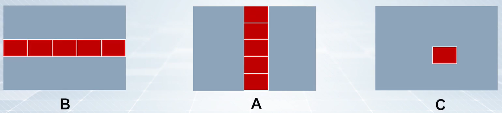

# C 语言编程实践

**概览：**

**[:question: 数据的位运算操作](#数据的位运算操作)**  
**[:question: 浮点数的精度问题](#浮点数的精度问题)**  
**[:question: Cache 友好代码](#cache-友好代码)**  
**[:question: 信号处理函数](#信号处理函数)**

## 数据的位运算操作

位运算的功能

- 特定功能：去特定位、保留特定位、......
- 速度快：左移、右移可用于实现快速的整数乘、除运算
- 其他：原位交、......

### 逻辑运算

|   操作   | C 语言操作符 |     汇编指令     |
| :------: | :----------: | :--------------: |
| 按位取反 |      ~       | notb、notw、notl |
|  按位与  |      &       | andb、andw、andl |
|  按位或  |      \|      |  orb、orw、orl   |
| 按位异或 |      ^       | xorb、xorw、xor  |

### 移位运算

左移右移时，最高/最低位送 CF

|   操作   | C 语言操作符 |     汇编指令     |
| :------: | :----------: | :--------------: |
| 逻辑左移 |      <<      | shlb、shlw、shll |
| 算术左移 |      <<      | salb、salw、sall |
| 逻辑右移 |      >>      |  shrb、shrwshrl  |
| 算术右移 |      >>      | sarb、sarw、sarl |

### 例子

交换变量 a 和 b 的值

```c
// 普通方法
c = a;
a = b;
b = c;

// 位操作交换法
a = a^b;
b = b^a;    // b=b^(a^b)=b^a^b=b^b^a=a
a = a^b;    // a=(a^b)^(b^(a^b))=a^b^b^a^b=b
```

## 浮点数的精度问题

IEEE754 单精度浮点数：表示的数的 10 进制的有效位数只有 7 位

| S    | Exponent | Signficand |
| ---- | -------- | ---------- |
| 1bit | 8bits    | 23bits     |

### 例 1-精度问题

```c
#include <stdio.h>

void test01()
{
    float tem[10];
    float a = 123456789;
    int* ptem;

    ptem = (int*)tem;
    tem[0] = 61.419996;
    tem[1] = 61.419997;
    tem[2] = 61.419998;
    tem[3] = 61.419999;
    tem[4] = 61.420000;
    tem[5] = 61.420001;
    tem[6] = 61.420002;
    tem[7] = 61.420003;
    tem[8] = 61.420004;
    tem[9] = 61.420005;
    for(int i = 0; i < 10; ++i)
        printf("%.6f, 0x%X\n", tem[i], *(ptem+i));
    printf("%f\n", a);
}


int main(int argc, char** argv)
{
    test01();
    return 0;
}

// 运行结果如下
61.419994, 0x4275AE13
61.419998, 0x4275AE14
61.419998, 0x4275AE14
61.419998, 0x4275AE14
61.419998, 0x4275AE14
61.420002, 0x4275AE15
61.420002, 0x4275AE15
61.420002, 0x4275AE15
61.420006, 0x4275AE16
61.420006, 0x4275AE16
123456792.000000

可以看出61.419998和61.420002是两个可表示数，两者之间相差0.000004。
当输入数据是一个不可表示数时，编译器在编译时讲数据就近戒断至机器数能表示的浮点数
再观察对应的机器数0x4275AE13，0x4275AE14，它们之间符号、阶码相同，尾数不同
```

单精度浮点数只能表示 7 位十进制有小数，第 8 位不准确

### 例 2-大数吃小数

```c
#include <stdio.h>

void main()
{
    float sum = 0;
    float a = 10.2, b = 9;
    int i;

    printf("10.2-9=%.10f\n", a - b);

    a = 100000.2;
    printf("100000.2-9=%.10f\n", a - b);

    for (i = 0; i < 4000000; ++i)
        sum += 0.1;
    printf("sum=%f\n", sum);
    return;
}


// 运行结果：
10.2-9=1.1999998093
100000.2-9=99991.2031250000
sum=384524.781250
```

上述例子中 10.2-9 的正确值应该是 1.2，截断误差是-0.0000001907  
100000.2-9=99991.2，截断误差是+0.003125  
截断误差大的原因：

- 根据浮点数的定义，浮点数的值越大，在实数轴上越靠右，相邻的两个能表示的浮点数的间距也越大，这就造成截断误差会越大
- 浮点数进行加减法时，需要对阶，而且是小阶码向大阶码对齐，尾数右移，移出的比特丢弃。这样两个加数的值相差的越大，较小的数的尾数丢弃的比特也就越多，也造成误差越大

上述例子 sum 累加结果不等于 40 万的原因

- IEEE754 单精度浮点数并不能精确地表示 0.1
- 大数吃小数问题存在
  - 问题由来：进行浮点数加减操作时，需要先进行对阶操作
  - 对阶操作：将两个操作数的阶码统一，执行小阶像大阶看起，阶码小的数的尾数右移，右移位数等于两个阶码差的绝对值
  - 导致后果：小数的部分尾数丢失，损失精度

#### KAHAN 累加算法

主要思想：设法计算出每次累加所带来的舍入误差，并将其添加在下一次的加数上，这样就可以获得更为准确的结果  
使用前提：尽量在浮点数数值相近时进行加减计算，才能充分利用有效位数

```c
#include <stdio.h>

void main()
{
    float sum = 0;
    float sum1 = 0;
    float c = 0;  // 累加产生的误差
    float y; // 经过误差修正后的加数
    float t; // 经过本次累加后的和
    for (int i = 0; i < 4000000; ++i)
        sum1 += 0.1;
    for (int i = 0; i < 4000000; ++i)
    {
        y = 0.1 - c;
        t = sum + y;
        c = (t - sum) - y;    // (t-sum) 是本次累加实际加上的加数
        sum = t;
    }
    printf("sum1 = %f\n", sum1);
    printf("sum  = %f\n", sum);
    return;
}

// 运行结果：
sum1 = 384524.781250
sum  = 400000.000000
```

## Cache 友好代码

- 尽可能地重复使用一个数据（时间局部性）
- 尽可能跨距为 1 的访问数据（空间局部性）

```c
// 矩阵相乘
for(i = 0; i < n; i++)
    for(j = 0; j < n; j++)
        for(k = 0; k < n; k++)
            c[i+j*n] += A[i+k*n] * B[k+j*n]

6中循环：ijk,ikj,jik,jki,kij,kji，运行结果是否一致？不一致
```

矩阵的存储如下：

<div align="left"></div>

说明计算机内部，矩阵中的数据是按顺序存储；访问相邻数据时，应当尽可能地遵从空间局部性和时间局部性

顺序是 ijk 的访问：

<div align="left"></div>

矩阵 A 的访问不是顺序的，而是跨越了一行的数据，矩阵过大时，Cache 放不下整个矩阵的数据，矩阵的访问就会很慢

顺序是 ikj 的访问：

<div align="left"></div>

对矩阵 B 和矩阵 C 的访问都不是顺序的，因而速度很慢

顺序是 jik 的访问：

<div align="left"></div>

矩阵 A 的访问不是顺序的，而是跨越了一行的数据，矩阵过大时，Cache 放不下整个矩阵的数据，矩阵的访问就会很慢

顺序是 jki 的访问

<div align="left"></div>

矩阵 A、C 的访问是顺序的，对 Cache 的利用最好，因此 jki 的运行速度最快

### 分块矩阵

对于顺序是 ijk 的访问来说，矩阵 A 的的时间局部性很差，A 中的某一列会在不同的事件被多次读取  
引入分块矩阵：不再以行和列为单位来计算，将矩阵分成若干同样大小的若干块，以块为单位进行计算，提升矩阵 A 的时间局部性

<div align="left"></div>

## 信号处理函数

IA32 异常处理程序的结构

- 硬件
  - 异常检测
  - 保护现场
  - 跳转到中断服务程序
  - 恢复现场
- 软件
  - 中断服务程序
  - 异常处理程序
  - 信号处理程序

异常处理程序的过程

1. 准备阶段：在内核栈保存通用寄存器内容
2. 处理阶段：保存硬件出错码和异常类型号，然后向当前进程发送一个信号
3. 恢复阶段：恢复保存在内核栈中的各个寄存器的内容，切换到用户态并返回到当前进程的断点处继续执行

<div align="left"></div>

- 异常处理机制： 异常处理程序发送相应的信号给发生异常的当前进程，或者进行故障恢复，然后返回到断点处执行
- 异常处理目的：可以尽快完成在内核态的异常处理过程，因为异常处理过程越长，嵌套执行异常的可能性越大，而异常嵌套执行会付出较大的代价
- 异常处理说明：不是所有异常处理都只是发送一个信号到发生异常的进程

### linux 信号处理函数

- linux 对于每个信号名都有一个默认的处理函数
- 也可以自定义一个处理函数，将其与某个信号绑定

<div align="left"></div>

默认流程：除零错误发送 SIGFPE 信号，触发 SIGFPE 信号处理函数，函数打印浮点出错信息，并终止当前进程  
自定义流程：自定义一个新的 SIGFPE 信号处理函数，让程序即使发生除零错误，也可以继续执行

```c
// 自定义SIGFPE信号处理函数

#include <stdio.h>
#include <setjmp.h>
#include <signal.h>

sigjmp_buf buf;

void FLPhandler(int sig)
{
    printf("I am in FLPhandler....\n");
    siglongjmp(buf, 1);
}

int main(int argc, char** argv)
{
    int a, t;
    signal(SIGFPE, FLPhandler);
    if (!sigsetjmp(buf, 1))
    {
        printf("starting\n");
        a = 100;
        t = 0;
        a = a / t;
    }
    printf("I am still alive......\n");
    return 0;
}

// 运行结果：
starting
I am in FLPhandler....
I am still alive......
```

非本地跳转（nolocal jump）：C 语言提供了一种用户级一场控制流的形式，将控制权直接从一个函数转移到当前执行的另一个函数，而无需执行正常的调用和返回序列。由`setjmp`和`longjmp`函数提供

- `setjmp(env)`函数：将程序中的上下文存储在 env 中，包括程序计数器、栈帧、通用寄存器等
- `longjmp(env,status)`函数：env 指代 setjmp 所保存的函数执行状态的变量，status 用于让 setjmp 函数返回的值
- `setjmp`调用一次，返回多次；`longjmp`调用一次，从不返回

```c
#include <setjmp.h>
#include <stdio.h>

jmp_buf buf;

int error1 = 0;
int error2 = 1;

void func2(void)
{
    if (error2)
        longjmp(buf, 2);
    printf("Ready to return to func1!\n");
}

void func1(void)
{
    printf("We are in func1 now!\n");
    if (error1)
        longjmp(buf, 1);
    func2();
    printf("After return from func2!\n");
}

int main(int argc, char** argv)
{
    int rc;
    rc = setjmp(buf);
    if (rc == 0)
        func1();
    else if (rc == 1)
        printf("detected an error1 condition in func1\n");
    else if (rc == 2)
        printf("detected an error2 condition in func2\n");
    else
        printf("Unknown error condition\n");
    return 0;
}

// 运行结果：
We are in func1 now!
detected an error2 condition in func2

第一次setjmp(buf)，成功则返回0，执行func1
func1中error1=0，执行func2
func2中error2=1，执行longjmp(buf,2)，此时回到main中的rc，rc=2，执行rc=2的判断
其他的地方跳过不执行了
```
