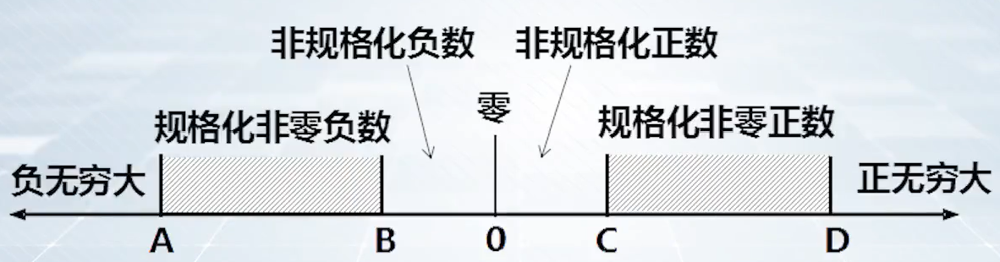

# 程序调试实践：数据的存储与运算

**概览：**

**[:question: 真值与机器数](#真值与机器数)**  
**[:question: 数据的宽度与存储](#数据的宽度与存储)**  
**[:question: 数据类型的转换](#数据类型的转换)**  
**[:question: 整数加减运算](#整数加减运算)**  
**[:question: 浮点数的表示和运算](#浮点数的表示和运算)**

## 真值与机器数

- 真值：数据在现实世界中的表示
- 机器数：数据在计算机内部的二进制表示

### 整数的编码

带符号整数：char、short、int、long  
无符号整数：unsigned char、unsigned short、unsigned int

```c
#include <stdio.h>

int main(int argc, char** argv)
{
    int ai = 100, bi = 2147483648, ci = -100;
    unsigned au = 100, bu = 2147483648, cu = -100;
    printf("ai = %d, bi = %d, ci = %d\n", ai, bi, ci);
    printf("au = %u, bu = %u, cu = %u\n", au, bu, cu);
    return 0;
}

// 运行结果
ai = 100, bi = -2147483648, ci = -100
au = 100, bu = 2147483648, cu = 4294967196

objdump -S 后部分汇编如下

int ai = 100, bi = 2147483648, ci = -100;
119a:   c7 45 e0 64 00 00 00    movl   $0x64,-0x20(%ebp)
11a1:   c7 45 e4 00 00 00 80    movl   $0x80000000,-0x1c(%ebp)
11a8:   c7 45 e8 9c ff ff ff    movl   $0xffffff9c,-0x18(%ebp)
unsigned au = 100, bu = 2147483648, cu = -100;
11af:   c7 45 ec 64 00 00 00    movl   $0x64,-0x14(%ebp)
11b6:   c7 45 f0 00 00 00 80    movl   $0x80000000,-0x10(%ebp)
11bd:   c7 45 f4 9c ff ff ff    movl   $0xffffff9c,-0xc(%ebp)
```

对于带符号整数：采用补码表示  
对于无符号整数：二进制编码

### 浮点数的编码

浮点数的编码采用的是 IEEE754 标准

IA-32 中寄存器、指令类型和浮点处理架构关系：

|                  | 定点寄存器组 | 浮点寄存器栈               | 多媒体扩展寄存器组 |
| ---------------- | ------------ | -------------------------- | ------------------ |
| **指令类型**     | x86 指令     | x87 浮点处理指令、MMX 指令 | SSE 指令           |
| **浮点处理架构** |              | x87 架构                   | SSE 架构           |

```c
#include "stdio.h"

int main(int argc, char** argv)
{
    int ai = 100, bi = -100;
    float af = 100, bf = -100;
    printf("ai = %d, bi = %d\n", ai, bi);
    printf("af = %f, bf = %f\n", af, bf);
    return 0;
}

objdump -S 后部分汇编如下
int ai = 100, bi = -100;
119a:       c7 45 e8 64 00 00 00    movl   $0x64,-0x18(%ebp)
11a1:       c7 45 ec 9c ff ff ff    movl   $0xffffff9c,-0x14(%ebp)
float af = 100, bf = -100;
11a8:       d9 83 38 e0 ff ff       flds   -0x1fc8(%ebx)
11ae:       d9 5d f0                fstps  -0x10(%ebp)
11b1:       d9 83 3c e0 ff ff       flds   -0x1fc4(%ebx)
11b7:       d9 5d f4                fstps  -0xc(%ebp)

可以看出编译器对浮点数和整数的处理是不同的
案例中，采用的是x87浮点处理指令，使用浮点寄存器栈
```

观测上述的`ai, bi`和`af, bf`可知：

- 整数补码的特点：对于两个相反数，它们机器数的 01 序列满足“按位取反，末位加 1”
- 浮点数编码的特点：对于两个相反数，它们机器数的 01 序列中，正数的符号位为 0，复数的符号位为 1，阶码和尾数相同

## 数据的宽度与存储

```c
#include "stdio.h"

int main(int argc, char* argv[])
{
    char a = 100;
    short b = 100;
    int c = 100;
    int d = 0x12345678;
    printf("a = %0xH, b = %0xH, c = %0xH, d = %0xH", a, b, c, d);
    return 0;
}

1. [数据存储的宽度] a、b、c三个变量在存储器中是否占用相同的存储空间
2. [数据存储的排列方式] 一个变量有多个字节时，多个字节在存储器中是按什么顺序排列存放的
3. [数据存储的对齐方式] 变量a、b、c是否可以存放在存储器中任意开始的地址

objdump -S 后部分汇编如下
char a = 100;
1199:       c6 45 ed 64             movb   $0x64,-0x13(%ebp)
short b = 100;
119d:       66 c7 45 ee 64 00       movw   $0x64,-0x12(%ebp)
int c = 100;
11a3:       c7 45 f0 64 00 00 00    movl   $0x64,-0x10(%ebp)
int d = 0x12345678;
11aa:       c7 45 f4 78 56 34 12    movl   $0x12345678,-0xc(%ebp)

可以看出使用的指令不同，%ebp每次的偏移量也不同
对于short b = 100，存放的是64 00，这是因为小端存储
```

```c
int main(int argc, char** argv)
{
    struct record
    {
        char a;
        int b;
        short c;
        char d;
    }R[2];
    R[0].a = 1; R[0].b = 2; R[0].c = 3; R[0].d = 4;
    R[1].a = 5; R[1].b = 6; R[1].c = 7; R[1].d = 8;
    return 0;
}

问：变量在存储器中分配存储单元时，会不会分配在连续的地址单元

// objdump -S 后部分汇编如下

R[0].a = 1; R[0].b = 2; R[0].c = 3; R[0].d = 4;
1193:       c6 44 24 14 01          movb   $0x1,0x14(%esp)
1198:       c7 44 24 18 02 00 00    movl   $0x2,0x18(%esp)
119f:       00
11a0:       66 c7 44 24 1c 03 00    movw   $0x3,0x1c(%esp)
11a7:       c6 44 24 1e 04          movb   $0x4,0x1e(%esp)
R[1].a = 5; R[1].b = 6; R[1].c = 7; R[1].d = 8;
11ac:       c6 44 24 20 05          movb   $0x5,0x20(%esp)
11b1:       c7 44 24 24 06 00 00    movl   $0x6,0x24(%esp)
11b8:       00
11b9:       66 c7 44 24 28 07 00    movw   $0x7,0x28(%esp)
11c0:       c6 44 24 2a 08          movb   $0x8,0x2a(%esp)
```

<div align="left"></div>

不难看出 R[0].a 是 0xffffd640 的 0x01，空三个字节后，R[0].b 是 0x02 0x00 0x00 0x00，R[1].c 是 0x00 0x03，空一个字节后，R[1].d 是 0x04  
R[1]的起始地址则为 0xffffd650

### 数据存储的宽度

| C 声明    | 典型 32 位机器 |
| --------- | :------------: |
| char      |       1        |
| short int |       2        |
| int       |       4        |
| long int  |       4        |
| char\*    |       4        |
| float     |       4        |

### 数据存储的排列方式

```c
例如，数据d=0x12345678，存储在0xffffd2bc地址单元中

0xffffd2bc      0xffffd2bd      0xffffd2be      0xffffd2bf
0x12            0x34            0x56            0x78        小端方式
0x78            0x56            0x34            0x12        小端方式
```

大端方式：最高有效字节存放在低地址单元中，最低有效字节存放在高地址单元中  
小端方式：最高有效字节存放在高地址单元中，最低有效字节存放在低地址单元中

### 数据存储的对齐方式

存储单元中的数据之间为什么不连续存放，要空着一些单元？  
在 IA-32 中，存储机制限制每次访存最多只能读写 64 位，即 8 个字节  
如果不按边界对齐，可能会读写数据时候需要访存两次

#### 基本数据类型对齐策略

| 基本类型  | Windows         | Linux           |
| --------- | --------------- | --------------- |
| char      | 任意地址        | 任意地址        |
| short     | 地址是 2 的倍数 | 地址是 2 的倍数 |
| int       | 地址是 4 的倍数 | 地址是 4 的倍数 |
| long long | 地址是 8 的倍数 | 地址是 4 的倍数 |
| float     | 地址是 4 的倍数 | 地址是 4 的倍数 |
| double    | 地址是 8 的倍数 | 地址是 4 的倍数 |

#### 结构体对齐策略

结构体数据的首地址是 4 的倍数，成员变量按基本数据类型对齐

## 数据类型的转换

### 整数之间的数据类型转换

```c
#include "stdio.h"

int main(int argc, char** argv)
{
    short si = 100;
    unsigned short usi = si;
    int i = usi;
    unsigned ui = usi;
    int i1 = si;
    unsigned ui1 = si;
    int i2 = 0x12348765;
    short si2 = i2;
    unsigned short usi2 = i2;
    int i3 = si2;
    int i4 = 4294967296;
    printf("si = %d, usi = %u, i = %d, ui = %u, i1 = %d, ui1 = %u\n", si, usi, i, ui, i, ui1);
    printf("i2 = %d, si2 = %d, usi2 = %u, i3 = %d, i4 = %d\n", i2, si2, usi2, i3, i4);
    return 0;
}

// 输出结果
si = 100, usi = 100, i = 100, ui = 100, i1 = 100, ui1 = 100
i2 = 305432421, si2 = -30875, usi2 = 34661, i3 = -30875, i4 = 0

// objdump -S 后部分反汇编
short si = 100;
119a:   66 c7 45 d4 64 00       movw   $0x64,-0x2c(%ebp)
unsigned short usi = si;
11a0:   0f b7 45 d4             movzwl -0x2c(%ebp),%eax
11a4:   66 89 45 d6             mov    %ax,-0x2a(%ebp)
int i = usi;
11a8:   0f b7 45 d6             movzwl -0x2a(%ebp),%eax
11ac:   89 45 dc                mov    %eax,-0x24(%ebp)
unsigned ui = usi;
11af:   0f b7 45 d6             movzwl -0x2a(%ebp),%eax
11b3:   89 45 e0                mov    %eax,-0x20(%ebp)
int i1 = si;
11b6:   0f bf 45 d4             movswl -0x2c(%ebp),%eax
11ba:   89 45 e4                mov    %eax,-0x1c(%ebp)
unsigned ui1 = si;
11bd:   0f bf 45 d4             movswl -0x2c(%ebp),%eax
11c1:   89 45 e8                mov    %eax,-0x18(%ebp)
int i2 = 0x12348765;
11c4:   c7 45 ec 65 87 34 12    movl   $0x12348765,-0x14(%ebp)
short si2 = i2;
11cb:   8b 45 ec                mov    -0x14(%ebp),%eax
11ce:   66 89 45 d8             mov    %ax,-0x28(%ebp)
unsigned short usi2 = i2;
11d2:   8b 45 ec                mov    -0x14(%ebp),%eax
11d5:   66 89 45 da             mov    %ax,-0x26(%ebp)
int i3 = si2;
11d9:   0f bf 45 d8             movswl -0x28(%ebp),%eax
11dd:   89 45 f0                mov    %eax,-0x10(%ebp)
int i4 = 4294967296;
11e0:   c7 45 f4 00 00 00 00    movl   $0x0,-0xc(%ebp)
```

C 语言中，整数的赋值不是发生在真值上的赋值，而是机器数上的赋值

对赋值语句`b = a;`，有以下几种情况

- 相同宽度的两个整型数据之间的赋值  
  a 和 b 的机器数相同，真值不一定相同，取决于 a 和 b 的数据类型
- 将一个短的数据类型赋值给一个长的数据类型  
  把 a 的 n 位 01 序列复制在 b 的低 n 位，b 的高 m-n 为由 a 的数据类型决定
  - a 为 n 位无符号整数：零扩展
  - a 为 n 位带符号整数：符号扩展
- 将一个长的数据类型赋值给一个短的数据类型  
  将 a 的低 m 位的 01 序列赋值给 b，丢弃 a 的高位部分

### 整数和浮点数之间的转换

- 整数与浮点数之间的转换，是在编码格式上的转换
- int 与 float 转换中，可能会有精度损失、溢出、小数丢弃等问题导致数据不一致
- 不同编译系统采用的编译优化有差异，同一程序在不同系统上运行，得到的结果可能不一样

```c
#include "stdio.h"

int main(int argc, char** argv)
{
    int i1 = 0x7fffffff, i2, itemp;
    float f1 = 0x987654321, f2, ftemp;
    ftemp = i1;
    i2 = ftemp;     // i2 = (int)(float)i1;
    itemp = f1;
    f2 = itemp;     // f2 = (float)(int)f1;
    printf("i1 = %d, i2 = %d, f1 = %f, f2 = %f\n", i1, i2, f1, f2);
    return 0;
}

1. 代码运行过程中，i1和i2的机器数分别是什么？
2. i1和i2的值相同吗，为什么？

// 运行结果
i1 = 2147483647, i2 = -2147483648, f1 = 40926265344.000000, f2 = -2147483648.000000

// objdump -S 反汇编后部分代码如下
int i1 = 0x7fffffff, i2, itemp;
1199:       c7 45 e0 ff ff ff 7f    movl   $0x7fffffff,-0x20(%ebp)
float f1 = 0x987654321, f2, ftemp;
11a0:       d9 80 38 e0 ff ff       flds   -0x1fc8(%eax)
11a6:       d9 5d e4                fstps  -0x1c(%ebp)
ftemp = i1;
11a9:       db 45 e0                fildl  -0x20(%ebp)
11ac:       d9 5d e8                fstps  -0x18(%ebp)
i2 = ftemp;     // i2 = (int)(float)i1;
11af:       f3 0f 10 45 e8          movss  -0x18(%ebp),%xmm0
11b4:       f3 0f 2c d0             cvttss2si %xmm0,%edx
11b8:       89 55 ec                mov    %edx,-0x14(%ebp)
itemp = f1;
11bb:       f3 0f 10 45 e4          movss  -0x1c(%ebp),%xmm0
11c0:       f3 0f 2c d0             cvttss2si %xmm0,%edx
11c4:       89 55 f0                mov    %edx,-0x10(%ebp)
f2 = itemp;     // f2 = (float)(int)f1;
11c7:       db 45 f0                fildl  -0x10(%ebp)
11ca:       d9 5d f4                fstps  -0xc(%ebp)
```

<div align="left"></div>

<div align="left"></div>

### C 语言中自动类型转换

一个运算表达式中有不同数据类型时，C 语言会自动进行类型转换

```c
int f1(unsigned int n)
{
    int sum = 1, power = 1;
    int i;
    for (i = 0; i <= n-1; ++i)
    {
        power *= 2;
        sum += power;
    }
    return sum;
}

int main(int argc, char** argv)
{
    int sum;
    sum = f1(0);
    return 0;
}

1. 执行f1(0)时，为什么会出现死循环
2. 为了得到正确的值，应该如何修改函数f1

// objdump -S 后部分反汇编代码如下
int sum = 1, power = 1;
117d:       c7 45 f4 01 00 00 00    movl   $0x1,-0xc(%ebp)
1184:       c7 45 f8 01 00 00 00    movl   $0x1,-0x8(%ebp)
int i;
for (i = 0; i <= n-1; ++i)
118b:       c7 45 fc 00 00 00 00    movl   $0x0,-0x4(%ebp)
1192:       eb 0d                   jmp    11a1 <f1+0x34>
{
    power *= 2;
1194:       d1 65 f8                shll   $1,-0x8(%ebp)
    sum += power;
1197:       8b 45 f8                mov    -0x8(%ebp),%eax
119a:       01 45 f4                add    %eax,-0xc(%ebp)
for (i = 0; i <= n-1; ++i)
119d:       83 45 fc 01             addl   $0x1,-0x4(%ebp)
11a1:       8b 45 08                mov    0x8(%ebp),%eax
11a4:       8d 50 ff                lea    -0x1(%eax),%edx
11a7:       8b 45 fc                mov    -0x4(%ebp),%eax
11aa:       39 c2                   cmp    %eax,%edx
11ac:       73 e6                   jae    1194 <f1+0x27>  // 无符号整数比较
}
```

<div align="left"></div>

通过`si`逐机器指令调试后，`i r eip`查看下一条指令，定位到上面汇编中的`11ac`，此时查看`edx eax`的值，无符号数比较时`i <= 0xffffffff`永远成立，所以陷入了死循环

将`f1(unsigned int n)`参数类型修改为`f1(int n)`

```s
// 修改后汇编如下：
int sum = 1, power = 1;
117d:       c7 45 f4 01 00 00 00    movl   $0x1,-0xc(%ebp)
1184:       c7 45 f8 01 00 00 00    movl   $0x1,-0x8(%ebp)
int i;
for (i = 0; i <= n-1; ++i)
118b:       c7 45 fc 00 00 00 00    movl   $0x0,-0x4(%ebp)
1192:       eb 0d                   jmp    11a1 <f1+0x34>
{
    power *= 2;
1194:       d1 65 f8                shll   $1,-0x8(%ebp)
    sum += power;
1197:       8b 45 f8                mov    -0x8(%ebp),%eax
119a:       01 45 f4                add    %eax,-0xc(%ebp)
for (i = 0; i <= n-1; ++i)
119d:       83 45 fc 01             addl   $0x1,-0x4(%ebp)
11a1:       8b 45 08                mov    0x8(%ebp),%eax
11a4:       3b 45 fc                cmp    -0x4(%ebp),%eax
11a7:       7f eb                   jg     1194 <f1+0x27>   // jg 带符号整数比较
}
```

## 整数加减运算

- C 语言源程序中的整数加减运算在机器级是如何实现的？
- 实现的电路有什么特点？
- 整数加减运算除了得到结果和差结果，还生成什么信息？
- 计算机计算出来的和差结果都正确吗？怎么判断结果是否正确？

补码加减运算

- 加法：$[x+y]_补 = [x]_补 + [y]_补（mod 2^n）$
- 减法：$[x-y]_补 = [x]_补 + [-y]_补（mod 2^n）$

补码加法运算中，不需要区分数据的符号和数值位，符号位和数值位遵守一样的加法运算规则，结果的符号位在加法运算的过程中直接产生

<div align="left"></div>

- 加法器：执行两个 01 序列的加运算，没有符号的概念
- 带符号整数加减运算：电路输入和 X 和 Y 就是两个运算数据的补码
- 无符号整数加减运算：电路输入的 X 和 Y 就是两个运算数据的无符号整数表示
- OF：检验带符号整数的结果是否超出整型数据表示范围的一个标志位，超出带符号整数表示范围时，输出 OF 值为 1，否则 OF 值为 0
- ZF：sum 是否为 0
- SF：sum 的最高有效位
- OF：进/借位标志

对无符号整数  
用 CF 标记加减运算后输出的结果是否正确  
加法运算：CF 表示结果是否有进位  
减法运算：CF 表示结果是否有借位  
OF 状态位的值无意义

对带符号整数  
用 OF 状态来判断加减运算后输出的结果是否正确  
CF 状态位的值无意义

```c
#include "stdio.h"

int main(int argc, char** argv)
{
    int a = 0x98765432, b = 0x87654321, c, d;
    unsigned int ua = 0x98765432, ub = 0x87654321, uc, ud;
    c = a + b; uc = ua + ub;
    d = a - b; ud = ua - ub;
    printf("%d + (%d) = %d\n", a, b ,c);
    printf("%u + (%u) = %u\n", ua, ub ,uc);
    printf("%d - (%d) = %d\n", a, b ,d);
    printf("%u - (%u) = %u\n", ua, ub ,ud);
    return 0;
}

// objdump -S 后部分汇编如下
int a = 0x98765432, b = 0x87654321, c, d;
119a:       c7 45 d8 32 54 76 98    movl   $0x98765432,-0x28(%ebp)
11a1:       c7 45 dc 21 43 65 87    movl   $0x87654321,-0x24(%ebp)
unsigned int ua = 0x98765432, ub = 0x87654321, uc, ud;
11a8:       c7 45 e0 32 54 76 98    movl   $0x98765432,-0x20(%ebp)
11af:       c7 45 e4 21 43 65 87    movl   $0x87654321,-0x1c(%ebp)
c = a + b; uc = ua + ub;
11b6:       8b 55 d8                mov    -0x28(%ebp),%edx
11b9:       8b 45 dc                mov    -0x24(%ebp),%eax
11bc:       01 d0                   add    %edx,%eax
11be:       89 45 e8                mov    %eax,-0x18(%ebp)
11c1:       8b 55 e0                mov    -0x20(%ebp),%edx
11c4:       8b 45 e4                mov    -0x1c(%ebp),%eax
11c7:       01 d0                   add    %edx,%eax
11c9:       89 45 ec                mov    %eax,-0x14(%ebp)
d = a - b; ud = ua - ub;
11cc:       8b 45 d8                mov    -0x28(%ebp),%eax
11cf:       2b 45 dc                sub    -0x24(%ebp),%eax
11d2:       89 45 f0                mov    %eax,-0x10(%ebp)
11d5:       8b 45 e0                mov    -0x20(%ebp),%eax
11d8:       2b 45 e4                sub    -0x1c(%ebp),%eax
11db:       89 45 f4                mov    %eax,-0xc(%ebp)

// 可以看出IA-32中，对无符号和带符号的加减运算都是同样的指令
```

<div align="left"></div>

执行完指令后，可以查看标志寄存器

## 浮点数的表示和运算

### IEEE754 浮点数标准

- float 型：32 位单精度浮点格式  
  符号位 1 位 + 8 位阶码 + 23 位尾数
- double 型：64 位双精度浮点格式  
  符号位 1 位 + 11 位阶码 + 52 位尾数

IEEE754 标准中的数据按值分类：

<div align="left"></div>

| 类型       | 说明                                                                                  | 表示（float 型为例）                          |
| ---------- | ------------------------------------------------------------------------------------- | --------------------------------------------- |
| 零         | 正零和负零                                                                            | 符号位：0/1 <br/>阶码：全 0 <br/> 尾数：0     |
| 非规格化数 | 非常接近零点的很小很小的小数                                                          | 符号位：0/1 <br/>阶码：全 0 <br/> 尾数：非 0  |
| 规格化数   | 常规范围的数据                                                                        | 符号位：0/1 <br/>阶码：1-254 <br/> 尾数：任意 |
| 无穷大     | 超出表示范围的浮点数                                                                  | 符号位：0/1 <br/>阶码：255 <br/> 尾数：0      |
| 无定义数   | 一类没有定义的数 <br/> 引入无定义数可以给变量作为非初始化数，也可以用于表示一些异常值 | 符号位：0/1 <br/>阶码：255 <br/> 尾数：非 0   |

#### 规格化数的真值与机器数的对应关系（float 型）

##### 真值->机器数

真值：+/-1.xxxxxxxx \* $2^{E}$  
机器数：0/1 (1bit) E+127 (8bit) xxxxxxxx (23bit)

举例：  
真值：5.0=1.01B\*$2^2$ &nbsp;&nbsp;&nbsp;阶码：2+127=1000 0001B  
机器数：0 1000 0001 010 0000 0000 0000 0000 0000B = 40A0 0000H

##### 机器数->真值

机器数：S (1bit) + Exponent (8bit) + Significand (23bit)  
真值：$(-1)^s$ x (1+Significand) \* $2^{E-127}$

举例：  
机器数：40A0 0000H = 0 1000 0001 010 0000 0000 0000 0000 0000B  
真值：符号位 0，阶码 1000 0001 - 127 = 2，即 1.01\*$2^2$

#### 非规格化数的真值与机器数的对应关系（float 型）

##### 真值->机器数

真值：+/-0.xxxxxxxx \* $2^{-126}$  
机器数：0/1(1bit) 00000000(8bit) xxxxxxxx(23bit)

举例：  
真值：1e-40=$10^{-40}$≈0.000 0001 0001 0110 1100 0010B \* $2^{-126}$  
机器数：0 0000 0000 000 0001 0001 0110 1100 0010B = 0001 16C2H

##### 机器数->真值

机器数：S (1bit) + 00000000 (8bit) + Significand (23bit)  
真值：$(-1)^s$ x Significand \* $2^{126}$

举例：  
机器数：0001 16C2H = 0 0000 0000 000 0001 0001 0110 1100 0010B  
真值：0.000 0001 0001 0110 1100 0010B \* $2^{-126}$

#### 案例

```c
#include <stdio.h>

int main(int argc, char** argv)
{
    float finf1 = 4e38, finf2 = 5e38, finf3 = 6e38;  // 正无穷大
    float fninf1 = -4e38, fninf2 = -5e38, fninf3 = -6e38;  // 负无穷大
    float fzero = 0, fnzero = -fzero;  // 0,-0
    float fnormal1 = 5.0, fnormal2 = 0.1, fnnormal1 = -5, fnnormal2 = -0.1; // 规格化数
    float ffrac = 1e-40, fnfrac = -1e-40;    // 非规格化数
    float fnan1 = finf1 + fninf1, fnan2 = -fnan1; // 无定义数
    float finf4 = fnormal1 / fzero;  // 除以0无穷大

    printf("%f %f %f\n", finf1, finf2, finf3);
    printf("%f %f %f\n", fninf1, fninf2, fninf3);
    printf("%f %f\n", fzero, fnzero);
    printf("%f %.20f\n%f %.20f\n", fnormal1, fnormal2, fnnormal1, fnnormal2);
    printf("%.50f\n%0.50f\n", ffrac, fnfrac);
    printf("%f %f\n", fnan1, fnan2);
    printf("%f\n", finf4);
    return 0;
}

// 输出结果
inf inf inf
-inf -inf -inf
0.000000 -0.000000
5.000000 0.10000000149011611938
-5.000000 -0.10000000149011611938
0.00000000000000000000000000000000000000009999946101
-0.00000000000000000000000000000000000000009999946101
-nan nan
inf

// 反汇编后部分代码如下
float finf1 = 4e38, finf2 = 5e38, finf3 = 6e38;  // 正无穷大
119a:       d9 83 4c e0 ff ff       flds   -0x1fb4(%ebx)
11a0:       d9 5d b4                fstps  -0x4c(%ebp)
11a3:       d9 83 4c e0 ff ff       flds   -0x1fb4(%ebx)
11a9:       d9 5d b8                fstps  -0x48(%ebp)
11ac:       d9 83 4c e0 ff ff       flds   -0x1fb4(%ebx)
11b2:       d9 5d bc                fstps  -0x44(%ebp)
float fninf1 = -4e38, fninf2 = -5e38, fninf3 = -6e38;  // 负无穷大
11b5:       d9 83 50 e0 ff ff       flds   -0x1fb0(%ebx)
11bb:       d9 5d c0                fstps  -0x40(%ebp)
11be:       d9 83 50 e0 ff ff       flds   -0x1fb0(%ebx)
11c4:       d9 5d c4                fstps  -0x3c(%ebp)
11c7:       d9 83 50 e0 ff ff       flds   -0x1fb0(%ebx)
11cd:       d9 5d c8                fstps  -0x38(%ebp)
float fzero = 0, fnzero = -fzero;  // 0,-0
11d0:       d9 ee                   fldz
11d2:       d9 5d cc                fstps  -0x34(%ebp)
11d5:       d9 45 cc                flds   -0x34(%ebp)
11d8:       d9 e0                   fchs
11da:       d9 5d d0                fstps  -0x30(%ebp)
float fnormal1 = 5.0, fnormal2 = 0.1, fnnormal1 = -5, fnnormal2 = -0.1; // 规格化数
11dd:       d9 83 54 e0 ff ff       flds   -0x1fac(%ebx)
11e3:       d9 5d d4                fstps  -0x2c(%ebp)
11e6:       d9 83 58 e0 ff ff       flds   -0x1fa8(%ebx)
11ec:       d9 5d d8                fstps  -0x28(%ebp)
11ef:       d9 83 5c e0 ff ff       flds   -0x1fa4(%ebx)
11f5:       d9 5d dc                fstps  -0x24(%ebp)
11f8:       d9 83 60 e0 ff ff       flds   -0x1fa0(%ebx)
11fe:       d9 5d e0                fstps  -0x20(%ebp)
float ffrac = 1e-40, fnfrac = -1e-40;    // 非规格化数
1201:       d9 83 64 e0 ff ff       flds   -0x1f9c(%ebx)
1207:       d9 5d e4                fstps  -0x1c(%ebp)
120a:       d9 83 68 e0 ff ff       flds   -0x1f98(%ebx)
1210:       d9 5d e8                fstps  -0x18(%ebp)
float fnan1 = finf1 + fninf1, fnan2 = -fnan1; // 无定义数
1213:       d9 45 b4                flds   -0x4c(%ebp)
1216:       d8 45 c0                fadds  -0x40(%ebp)
1219:       d9 5d ec                fstps  -0x14(%ebp)
121c:       d9 45 ec                flds   -0x14(%ebp)
121f:       d9 e0                   fchs
1221:       d9 5d f0                fstps  -0x10(%ebp)
float finf4 = fnormal1 / fzero;
1224:       d9 45 d4                flds   -0x2c(%ebp)
1227:       d8 75 cc                fdivs  -0x34(%ebp)
122a:       d9 5d f4                fstps  -0xc(%ebp)
```

<div align="left"></div>

```s
float finf1 = 4e38, finf2 = 5e38, finf3 = 6e38;  // 正无穷大
119a:       d9 83 4c e0 ff ff       flds   -0x1fb4(%ebx)
11a0:       d9 5d b4                fstps  -0x4c(%ebp)

以finf1 = 4e38为例，此时调用fstps装载指令，-0x4c(%ebp)=0xffffd678-0x4c=0xffffd62c
对应gdb调试内容中的0x7f800000
不难对应其余变量的机器数
```

### 尾数的舍入处理

上述的例子`float fnormal2 = 0.1`输出的时候，结果并不是 0.1，而是一个接近 0.1 的数 0.10000000149011611938

原因：

- 对于浮点数而言：阶码的位数反映浮点格式表示数据的范围；尾数的位数反映浮点格式表示数据的精度
- 对于 float 类型而言，数据的真值超过 24 位精度时，对尾数进行舍入处理；舍入处理后的机器数是对真值的近似表示
- 十进制小数转换成二进制编码时候，未必能精确转换  
  _(0.1=0.000 1100 1100 1100 1100 ... B 无限循环)_  
  所以用浮点数编码 0.1 时候必定有舍入处理，导致精度损失，输出 0.1 时候看到的就不是 0.1，而是一个接近 0.1 的数据

IEEE754 标准提供四种舍入模式

- 就近舍入（中间值舍入到偶数）
- 朝 +∞ 方向舍入
- 朝 -∞ 方向舍入
- 朝 0 方向舍入

<div align="left"></div>

a、b：两个连续的浮点数格式可表示的数据  
x、y、z：需要浮点编码的数据，只能用 a 或 b 近似表示，z=(a+b)/2

1. 就近舍入：x≈a，y≈b，z≈？
2. 朝 +∞ 方向舍入：x≈b，y≈b，z≈b
3. 朝 -∞ 方向舍入：x≈a，y≈a，z≈a
4. 朝 0 方向舍入：x≈a，y≈a，z≈a

#### 就近舍入（float 为例）

<div align="left"></div>

<div align="left"></div>

```c
#include "stdio.h"

int main(int argc, char** argv)
{
    float a1 = 0x8000000, a2 = 0x8000001, a3 = 0x8000014, a4 = 0x8000010;
    float b1 = 0x8000019, b2 = 0x800000c, b3 = 0x800000d;
    float c1 = 0x8000008, c2 = 0x8000018;
    float g = 0.1;

    printf("a1=%xH,  a2=%xH,  a3=%xH,  a4=%xH\n", (int)a1, (int)a2, (int)a3, (int)a4);
    printf("b1=%xH,  b2=%xH\n", (int)b1, (int)b2);
    printf("c1=%xH,  c2=%xH\n", (int)c1, (int)c2);
    printf("g=%.20f\n", g);
    return 0;
}

// gcc —O0 -m32 -g
a1=8000000H,  a2=8000000H,  a3=8000010H,  a4=8000010H
b1=8000020H,  b2=8000010H
c1=8000000H,  c2=8000020H
g=0.10000000149011611938

a1-a4：进行舍操作
b1-b: 进行入操作
c1: 舍操作
c2: 入操作
g: 输出值>0.1，0.1用机器数不可精确表示，入操作

可用gdb调试，查看相关栈帧的内容
```

### 浮点数的基本运算

#### 浮点运算部件

20 世纪 80 年代，有浮点协处理器芯片（FPU）：8087、80287，配套 8086/8088、80286/80386 等 CPU 一起使用  
20 世纪 90 年代后，浮点运算部件集成到了 CPU 中，CPU 含有了定点运算部件和浮点运算部件，两者的寄存器和运算逻辑是分开的。例如 x86 中的数据寄存器是 32 位，而 x87 中的浮点寄存器是 80 位

#### 基本运算

设两个规格化浮点数分别为 $A=M_a·2^{Ea}, B=M_b·2^{Eb}$

- $A±B=(M_a±M_b·2^{-(Ea-Eb)})·2^{Ea}$（假设 $Ea>=Eb$）  
  对阶、尾数加减、结果规格化处理、舍入处理、溢出判断
- $A*B=(M_a*M_b)2^{Ea+Eb}$  
  $A/B=(M_a/M_b)2^{Ea-Eb}$  
  操作数需要判 0 处理，尾数乘除运算，阶码加减运算，结果需要规格化、舍入和判断溢出
