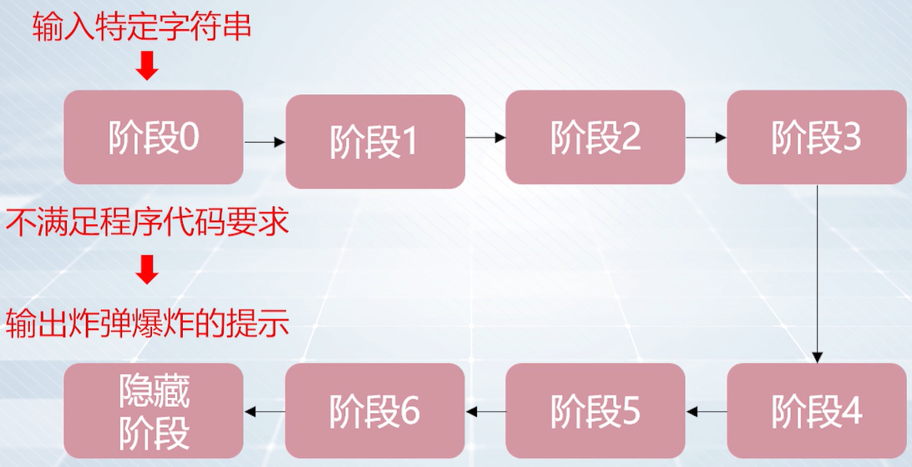
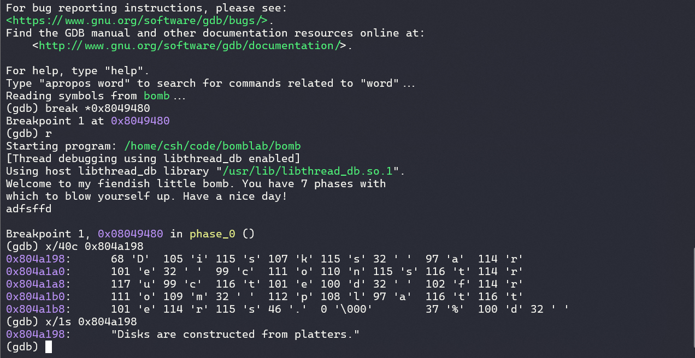
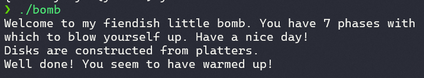
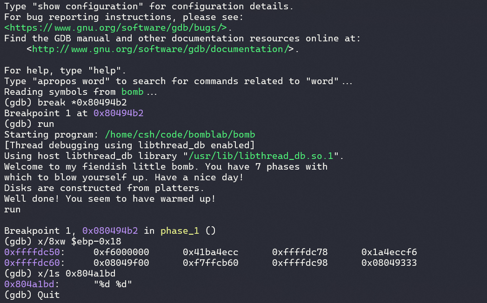

# 程序调试实践：二进制炸弹实验

**[:question: 概述](#概述)**  
**[:question: 字符串比较](#字符串比较)**  
**[:question: 浮点数表示](#浮点数表示)**  
**[:question: 课后实验](#课后实验)**

## 概述

### 实验目的

通过对一个称为“二进制炸弹”的二进制可执行程序的理解和逆向工程，加深对程序的机器级表示、汇编与反汇编、二进制程序调试和逆向工程等方面知识的理解和掌握

### 实验环境

OS: Arch Linux on Windows 10 x86_64  
Kernel: 5.15.153.1-microsoft-standard-WSL2  
C 语言/汇编语言

### 实验内容

作为实验目标的二进制炸弹“binary bombs”可执行程序包含了 7 个阶段以及 1 个隐藏阶段，各截断分别考察了对二进制程序表示各方面知识的理解和掌握

阶段 0：字符串比较  
阶段 1：浮点数表示  
阶段 2：循环控制结构  
阶段 3：switch 条件分支控制结构  
阶段 4：过程调用和栈帧结构组成  
阶段 5：数组、指针  
阶段 6：结构、链表、指针  
隐藏阶段：只有在阶段 4 的拆解字符串后再附加一特定字符串后才会出现

<div align="left"></div>

实现的目的是拆除尽可能多的炸弹关卡-分析获得尽可能多的正确拆解字符串

### 实验数据

下载本实验相关的 tar 文件，[下载链接](https://cs.nju.edu.cn/sufeng/course/mooc/0809NJU064_bomblab.tar)  
解压`tar xvf 0809NJU064_bomblab.tar`，包含`bomb`可执行文件和`bomb.c`bomb 程序中 main 函数的 C 语言程序框架

运行二进制炸弹可执行程序 bomb 需要指定 0 或 1 个命令行参数（详见 bomb.c 源文件中
的 main()函数）：

- 如果运行时不指定参数，则程序打印出欢迎信息后，期望你按行输入每一阶段用来拆除炸弹的字符串，程序根据输入字符串决定是通过相应阶段还是引爆炸弹导致该阶段任务失败
- 也可将拆除每一炸弹阶段的字符串按行（一行一个字符串）记录在一个文本文件（必需采用 Unix/Linux 换行格式）中（即实验结果提交文件的形式），然后将该文件作为运行二进制炸弹程序时的唯一命令行参数，程序将依次检查对应每一阶段的字符串来决定炸弹拆除成败

注意：如果拆解字符串（来自命令行输入或文本文件）不正确导致相应炸弹阶段被引爆， 程序在输出炸弹爆炸的提示文字 “BOOM!!!” 后，将进入下一阶段的字符串检查（等待命令行输入或读取文件下一行）而不会终止程序的运行。因此，如果暂时未能正确获得某阶段的拆解字符串，可用任意非空字符串（即不同于空格、制表、换行的一个以上字符）临时作为拆解字符串，从而在引爆相应炸弹阶段后，跳到以后阶段继续开展实验

### 实验工具

为完成二进制炸弹拆除任务，可使用 objdump 工具程序反汇编可执行炸弹程序，并使用 gdb 工具程序单步跟踪每一阶段的机器指令，从中理解每一指令的行为和作用，进而推断拆除炸弹所需的目标字符串的内容组成。例如，可在每一阶段的起始指令前和引爆炸弹的函数调用指令前设置断点

GDB：为从二进制炸弹可执行程序”bomb“中找出触发炸弹爆炸的条件，可使用 GDB 程序帮助
对程序的分析  
objdump：`–t`选项：打印指定二进制程序的符号表，其中包含了程序中的函数、全局变量的名称和存
储地址；`–d`选项：对二进制程序中的机器指令代码进行反汇编。通过分析汇编源代码可以发现 bomb 程序是如何运行的  
strings：该命令显示二进制程序中的所有可打印字符串

## 字符串比较

该阶段要求输入与程序中内置的某一特定字符串相匹配的字节序列，如果不匹配，将引爆该阶段的炸弹，输出阶段失败的相应提示

### 实验步骤

1. 对二进制炸弹程序进行反汇编 `objdump -d bomb > bomb.s`
2. 对本阶段函数的汇编指令代码进行分析
3. 定位并获取内置字符串的指，并相应构造输入字符串

```s
0804946f <phase_0>:
 804946f:   55                      push   %ebp
 8049470:   89 e5                   mov    %esp,%ebp
 8049472:   83 ec 08                sub    $0x8,%esp
 8049475:   83 ec 08                sub    $0x8,%esp
 8049478:   68 98 a1 04 08          push   $0x804a198   // 将函数的第二个参数压入栈中（固定字符串）
 804947d:   ff 75 08                push   0x8(%ebp)    // 将函数的第一个参数压入栈中（用户输入的拆解字符串）
 8049480:   e8 52 07 00 00          call   8049bd7 <strings_not_equal>
                                    // 比较两个字符串的内容，将比较结果返回值存入eax寄存器
 8049485:   83 c4 10                add    $0x10,%esp
 8049488:   85 c0                   test   %eax,%eax    // 测试eax寄存器的值，根据结果设置标志寄存器
 804948a:   74 0c                   je     8049498 <phase_0+0x29> // je跳转指令
 804948c:   e8 ae 09 00 00          call   8049e3f <explode_bomb>
 8049491:   b8 00 00 00 00          mov    $0x0,%eax
 8049496:   eb 05                   jmp    804949d <phase_0+0x2e>
 8049498:   b8 01 00 00 00          mov    $0x1,%eax
 804949d:   c9                      leave
 804949e:   c3                      ret
要使二进制炸弹程序不被引爆，需要使strings_not_equal函数返回值为0，
即输入的拆解字符串内容要与0x8049594这个地址上程序内置的字符串内容要一致

如果输入的两个字符串参数内容相同，strings_not_equal函数将返回0，则在实力汇编代码中，
test指令测试时，将使得je指令跳转到程序的正常结束位置
如果输入的两个字符串参数内容不相同，将调用explode_bomb函数引爆炸弹
```

再使用 gdb 工具，将断点设置在 call<strings_not_equal>地址 0x9049480，查看对应的固定字符串(0x804a198)内容

<div align="left"></div>

再运行第一阶段程序进行测试：Disks are constructed from platters.

<div align="left"></div>

_若提示权限问题，使用 sudo gdb_

## 浮点数表示

该阶段要求输入对应浮点（float 或 double）数值表示的一对整数（short 或 int）

### 实验步骤

1. 对本阶段函数的反汇编结果进行总体分析
2. 找到浮点数常量的值，获得其 IEEE-754 表示
3. 分析程序的输入要求和比较逻辑
4. 基于上述结果，构造输入字符串

```s
0804949f <phase_1>:
 804949f:   55                      push   %ebp
 80494a0:   89 e5                   mov    %esp,%ebp
 80494a2:   83 ec 28                sub    $0x28,%esp
 80494a5:   c7 45 f4 f6 cc 4e 1a    movl   $0x1a4eccf6,-0xc(%ebp) // 将一个整型数值传送到地址位0xc(%ebp)存储单元中
 80494ac:   db 45 f4                fildl  -0xc(%ebp)  // 将其中的值加载到浮点寄存器栈顶
 80494af:   dd 5d e8                fstpl  -0x18(%ebp) // 从浮点栈顶将值存储到地址为-0x18(%ebp)的存储单元内容
 以上，将整型值0x1a4eccf6通过浮点占转为双精度浮点表示，并传送到本阶段函数栈帧地址为-0xc(%ebp)处开始连续存放
 整数型0x1a4eccf6的双精度IEEE 754十六进制表示：0x41 ba 4e cc f6 00 00 00

 80494b2:   8d 45 e0                lea    -0x20(%ebp),%eax
 80494b5:   50                      push   %eax
 80494b6:   8d 45 e4                lea    -0x1c(%ebp),%eax
 80494b9:   50                      push   %eax
 80494ba:   68 bd a1 04 08          push   $0x804a1bd // 将函数的第二个参数压入栈中
 80494bf:   ff 75 08                push   0x8(%ebp)  // 将函数的第一个参数压入栈中

 80494c2:   e8 09 fc ff ff          call   80490d0 <__isoc99_sscanf@plt>
 80494c7:   83 c4 10                add    $0x10,%esp
 80494ca:   83 f8 02                cmp    $0x2,%eax
 80494cd:   74 0c                   je     80494db <phase_1+0x3c>
 80494cf:   e8 6b 09 00 00          call   8049e3f <explode_bomb>
 80494d4:   b8 00 00 00 00          mov    $0x0,%eax
 // 以上是对sscanf函数返回时存储于eax寄存器中的返回值进行检查

 80494d9:   eb 2c                   jmp    8049507 <phase_1+0x68>
 80494db:   8d 45 e8                lea    -0x18(%ebp),%eax // 浮点数
 80494de:   8b 10                   mov    (%eax),%edx // 这两句是将放在-0x18(%ebp)处的浮点数的低4个字节，传送到edx
 80494e0:   8b 45 e4                mov    -0x1c(%ebp),%eax // 第一个输入整数传送到eax寄存器
 80494e3:   39 c2                   cmp    %eax,%edx // 比较第一个输入整数和浮点数低4位内容
 80494e5:   75 0f                   jne    80494f6 <phase_1+0x57>
 80494e7:   8d 45 e8                lea    -0x18(%ebp),%eax
 80494ea:   83 c0 04                add    $0x4,%eax
 80494ed:   8b 10                   mov    (%eax),%edx // 这两句是将放在(-0x18+0x4)(%ebp)的浮点数高4个字节内容传送到edx
 80494ef:   8b 45 e0                mov    -0x20(%ebp),%eax // 第二个输入整数传送到eax寄存器
 80494f2:   39 c2                   cmp    %eax,%edx // 比较第二个输入整数和浮点数高4位内容
 80494f4:   74 0c                   je     8049502 <phase_1+0x63>
 80494f6:   e8 44 09 00 00          call   8049e3f <explode_bomb>
 80494fb:   b8 00 00 00 00          mov    $0x0,%eax
 8049500:   eb 05                   jmp    8049507 <phase_1+0x68>
 8049502:   b8 01 00 00 00          mov    $0x1,%eax
 8049507:   c9                      leave
 8049508:   c3                      ret

整数型0x1a4eccf6的双精度IEEE 754十六进制表示：0x41 ba 4e cc f6 00 00 00
低32位：f6 00 00 00 = 4127195136
高32位：41 ba 4e cc = 1102728908
```

<div align="left"></div>

## 课后实验

其余阶段自行完成

这里介绍隐藏阶段：secret_phase

```s
080499b2 <secret_phase>:
 80499b2:   55                      push   %ebp
 80499b3:   89 e5                   mov    %esp,%ebp
 80499b5:   83 ec 18                sub    $0x18,%esp
 80499b8:   e8 3f 03 00 00          call   8049cfc <read_line>
 80499bd:   89 45 f4                mov    %eax,-0xc(%ebp)
 80499c0:   83 ec 0c                sub    $0xc,%esp
 80499c3:   ff 75 f4                push   -0xc(%ebp)
 80499c6:   e8 35 f7 ff ff          call   8049100 <atoi@plt>
 80499cb:   83 c4 10                add    $0x10,%esp
 80499ce:   89 45 f0                mov    %eax,-0x10(%ebp)
 80499d1:   83 7d f0 00             cmpl   $0x0,-0x10(%ebp)
 80499d5:   7e 09                   jle    80499e0 <secret_phase+0x2e>
 80499d7:   81 7d f0 e9 03 00 00    cmpl   $0x3e9,-0x10(%ebp)
 80499de:   7e 0c                   jle    80499ec <secret_phase+0x3a>
 80499e0:   e8 5a 04 00 00          call   8049e3f <explode_bomb>
 80499e5:   b8 00 00 00 00          mov    $0x0,%eax
 80499ea:   eb 42                   jmp    8049a2e <secret_phase+0x7c>
 80499ec:   83 ec 08                sub    $0x8,%esp
 80499ef:   ff 75 f0                push   -0x10(%ebp)
 80499f2:   68 d0 c1 04 08          push   $0x804c1d0
 80499f7:   e8 53 ff ff ff          call   804994f <fun7>
 80499fc:   83 c4 10                add    $0x10,%esp
 80499ff:   89 45 ec                mov    %eax,-0x14(%ebp)
 8049a02:   83 7d ec 01             cmpl   $0x1,-0x14(%ebp)
 8049a06:   74 0c                   je     8049a14 <secret_phase+0x62>
 8049a08:   e8 32 04 00 00          call   8049e3f <explode_bomb>
 8049a0d:   b8 00 00 00 00          mov    $0x0,%eax
 8049a12:   eb 1a                   jmp    8049a2e <secret_phase+0x7c>
 8049a14:   83 ec 0c                sub    $0xc,%esp
 8049a17:   68 ec a1 04 08          push   $0x804a1ec
 8049a1c:   e8 6f f6 ff ff          call   8049090 <puts@plt>
 8049a21:   83 c4 10                add    $0x10,%esp
 8049a24:   e8 3f 04 00 00          call   8049e68 <phase_defused>
 8049a29:   b8 01 00 00 00          mov    $0x1,%eax
 8049a2e:   c9                      leave
 8049a2f:   c3                      ret

再继续查找哪里调用了<secret_phase>，发现在<phase_defused>
08049e68 <phase_defused>:
 8049e68:   55                      push   %ebp
 8049e69:   89 e5                   mov    %esp,%ebp
 8049e6b:   83 ec 68                sub    $0x68,%esp
 8049e6e:   a1 2c c2 04 08          mov    0x804c22c,%eax
 8049e73:   83 f8 07                cmp    $0x7,%eax
 8049e76:   75 77                   jne    8049eef <phase_defused+0x87>
 8049e78:   83 ec 0c                sub    $0xc,%esp
 8049e7b:   8d 45 a4                lea    -0x5c(%ebp),%eax
 8049e7e:   50                      push   %eax
 8049e7f:   8d 45 9c                lea    -0x64(%ebp),%eax
 8049e82:   50                      push   %eax
 8049e83:   8d 45 a0                lea    -0x60(%ebp),%eax
 8049e86:   50                      push   %eax
 8049e87:   68 ea a2 04 08          push   $0x804a2ea
 8049e8c:   68 80 c3 04 08          push   $0x804c380
 8049e91:   e8 3a f2 ff ff          call   80490d0 <__isoc99_sscanf@plt>
 8049e96:   83 c4 20                add    $0x20,%esp
 8049e99:   89 45 f4                mov    %eax,-0xc(%ebp)
 8049e9c:   83 7d f4 03             cmpl   $0x3,-0xc(%ebp)
 8049ea0:   75 3d                   jne    8049edf <phase_defused+0x77>
 8049ea2:   83 ec 08                sub    $0x8,%esp
 8049ea5:   68 f3 a2 04 08          push   $0x804a2f3
 8049eaa:   8d 45 a4                lea    -0x5c(%ebp),%eax
 8049ead:   50                      push   %eax
 8049eae:   e8 24 fd ff ff          call   8049bd7 <strings_not_equal>
 8049eb3:   83 c4 10                add    $0x10,%esp
 8049eb6:   85 c0                   test   %eax,%eax
 8049eb8:   75 25                   jne    8049edf <phase_defused+0x77>
 8049eba:   83 ec 0c                sub    $0xc,%esp
 8049ebd:   68 fc a2 04 08          push   $0x804a2fc
 8049ec2:   e8 c9 f1 ff ff          call   8049090 <puts@plt>
 8049ec7:   83 c4 10                add    $0x10,%esp
 8049eca:   83 ec 0c                sub    $0xc,%esp
 8049ecd:   68 24 a3 04 08          push   $0x804a324
 8049ed2:   e8 b9 f1 ff ff          call   8049090 <puts@plt>
 8049ed7:   83 c4 10                add    $0x10,%esp
 8049eda:   e8 d3 fa ff ff          call   80499b2 <secret_phase>
 8049edf:   83 ec 0c                sub    $0xc,%esp
 8049ee2:   68 5c a3 04 08          push   $0x804a35c
 8049ee7:   e8 a4 f1 ff ff          call   8049090 <puts@plt>
 8049eec:   83 c4 10                add    $0x10,%esp
 8049eef:   90                      nop
 8049ef0:   c9                      leave
 8049ef1:   c3                      ret
 8049ef2:   66 90                   xchg   %ax,%ax
 8049ef4:   66 90                   xchg   %ax,%ax
 8049ef6:   66 90                   xchg   %ax,%ax
 8049ef8:   66 90                   xchg   %ax,%ax
 8049efa:   66 90                   xchg   %ax,%ax
 8049efc:   66 90                   xchg   %ax,%ax
 8049efe:   66 90                   xchg   %ax,%ax
```
