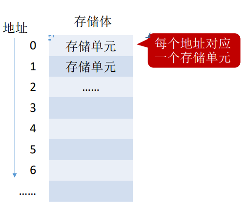

# 计算机系统概述

**概览：**

**[:question: 计算机发展历程](#计算机发展历程)**  
**[:question: 计算机硬件的组成](#计算机硬件的组成)**  
**[:question: 计算机性能指标](#计算机性能指标)**

## 计算机发展历程

什么是计算机系统？  
计算机系统 = 硬件 + 软件

硬件：计算机的实体，如主机、外设等  
软件：由具有各类特殊功能的程序组成；软件又分为系统软件和应用软件

- 系统软件：用来管理整个计算机系统，如操作系统、数据库管理系统、标准程序库、语言处理程序等
- 应用软件：按任务需要编制成的各种程序，如迅雷、抖音等

### 硬件的发展

| 
发展阶段 | 时间      | 逻辑元件         | 速度（次/秒） | 内存           | 外存                           | 特点                                                                                                                              |
| -------------------------------- | --------- | ---------------- | ------------- | -------------- | ------------------------------ | --------------------------------------------------------------------------------------------------------------------------------- |
| 第一代                           | 1946-1957 | 电子管           | 几千-几万     | 汞延迟线、磁鼓 | 穿孔卡片、纸带                 | 体积超大、耗电量超大   使用机器语言编程                                                                                        |
| 第二代                           | 1958-1964 | 晶体管           | 几万-几十万   | 磁芯存储器     | 磁带                           | 体积功耗降低   出现了面向过程的程序设计语言：FORTRAN   有了操作系统的雏形                                                   |
| 第三代                           | 1964-1971 | 中小规模集成电路 | 几十万-几百万 | 半导体存储器   | 磁带、磁盘                     | 高级语言迅速发展   开始有了分时操作系统                                                                                        |
| 第四代                           | 1972-现在 | 大规模集成电路   | 上千万-万亿   | 半导体存储器   | 磁盘、磁带、光盘、半导体存储器 | 微处理器出现   微型计算机和个人计算机（PC）萌芽；出现了操作系统：Windows、Linux...   并行、流水线、高速缓存、虚拟存储器出现 |

### 软件的发展

机器语言、汇编语言 -> FORTRAN -> PASCAL -> C++/Java  
DOS -> Windows -> IOS

## 计算机硬件的组成

### 早期冯诺依曼结构

各部件功能：

- 输入设备：将信息转换成机器能识别的形式
- 输出设备：将结果转换成人们熟悉的形式
- 主存储器：存放数据和程序
- 运算器：算数运算、逻辑运算
- 控制器：指挥各部件，使程序运行

特点：

- 计算机由五大部件组成
- 指令和数据以同等的地位存于存储器，可按地址寻访
- 指令和数据用二进制表示
- 指令由操作码和地址码组成
- 首次提出“存储程序”的概念  
  存储程序：将指令以二进制代码的形式事先输入计算机的主存储器，然后按其在存储器中的首地址执行程序的第一条指令，以后就按该程序的规定顺序执行其他指令，直至程序结束
- 以运算器为中心（输入/输出设备与存储器之间的数据传送通过运算器完成）

### 现代计算机结构

现代的计算机结构变成了以存储器为中心

- 硬件 = 主机 + I/O 设备
- 主机 = CPU + 主存
- I/O 设备 = 输入设备 + 输出设备
- CPU = 运算器 + 控制器
- 存储器 = 主存 + 辅存

特点：

- 以存储器为中心
- I/O 操作尽可能地绕开 CPU，实现 I/O 设备与存储器直接完成，从而提高运行效率

### 各个硬件的基本组成

#### 主存储器

主存主要有`存储体`和`MAR`、`MDR`组成（注：存储器中不一定有`MAR`和`MDR`，也可能集成在 CPU 中）

- 存储体：数据在存储体内按地址存储
  

  
  

  - 存储元：存储二进制的电子元件，每个存储元可存 1bit。工作原理：开关控制读写，把电容的数据读出或者写入数据到电容
  - 存储单元：多个存储元的集合，可以存放一个独立意义的二进制代码
  - 存储字：存储单元中二进制代码的组合
  - 存储字长：存储单元中二进制代码的位数
  - 存储体的存储单元是用译码器来访问的，n 位地址可访问 $2^n$ 个存储单元
  - 存储体总容量 = 存储单元个数 × 存储字长

- MAR：Memory Address Register 地址寄存器  
  MAR = 4 位 => 总共有 $2^4$ 个存储单元  
  MAR 访问存储单元用的是译码器
- MDR：Memory Data Register 数据寄存器  
  与存储单元字长相等  
  MDR = 16 位 => 每个存储单元可存放 16bit。一个字 = 16bit

#### 运算器

运算器用于实现算数运算（如：加减乘除）、逻辑运算（如：与或非）的部件

运算器的组成：

- ACC：累加器，用于存放操作数或运算结果
- MQ：乘商寄存器，在乘除运算时，用于存放操作数或运算结果
- X：通用操作数寄存器，用于存放操作数
- ALU：算数逻辑单元，通过内部复杂电路实现算数运算、逻辑运算
- PSW：程序状态字

#### 控制器

控制器主要由控制单元、指令寄存器、程序计数器组成

- 控制单元 CU（Control Unit）：分析指令，给出控制信号
- 指令寄存器 IR（Instruction Register）：存放当前执行的指令
- 程序计数器 PC（Program Counter）：存放下一条指令地址，有自动加 1 功能

### 计算机工作过程

简单来说是：取指 -> 译码 -> 执行

为了方便接下来使用，做以下约定：

> M：主存中某存储单元  
> ACC、MQ、X、MAR、MDR...：相应寄存器  
> M(MAR)：取存储单元中的数据（这里取 MAR 地址指向的存储单元的数据）  
> (ACC)：取相应寄存器中的数据（这里取 ACC）  
> 指令 = 操作码 + 地址码  
> OP(IR)：取操作码  
> Ad(IR)：取地址码

取指 -> 译码 -> 执行

> (PC) -> MAR  
> M(MAR) -> MDR  
> (MDR) -> IR  
> 取址结束 (PC) + 1 -> PC  
> OP(IR) -> CU  
> 分析指令结束  
> Ad(IR) -> MAR
> M(MAR) -> MDR  
> (MDR) -> ACC  
> 执行结束

注 1：不同的指令具体执行步骤不同  
注 2：CPU 区分指令和数据的依据：根据指令周期的不同阶段

### 计算机系统的层次结构

| 层次（从高到低）                 |                                          |
| -------------------------------- | ---------------------------------------- |
| M4：虚拟机器（高级语言机器）     | 用编译程序翻译成汇编语言程序             |
| M3：虚拟机器（汇编语言机器）     | 用汇编程序翻译成机器语言程序             |
| M2：虚拟机器（操作系统机器）     | 向上提供“广义指令”（系统调用）           |
| M1：传统机器（用机器语言的机器） | 执行二进制指令                           |
| M0：微程序机器（微指令系统）     | 由硬件执行执行微指令，微指令 1、微指令 2 |

- 编译程序：将高级语言一次全部翻译为汇编语言或直接翻译为机器语言，只需翻译一次
- 汇编程序：将汇编语言翻译成机器语言
- 解释程序：将高级语言翻译为机器语言（翻译一句执行一句），程序每次执行都需要翻译

## 计算机性能指标

- 存储器总容量  
  容量 = 存储单元个数 × 存储字长 bit
- CPU

  - 机器字长：计算机进行一次整数运算所能处理的二进制数据的位数  
    受到 CPU 寄存器位数、加法器影响  
    一般情况下机器字长等于内部寄存器大小  
    字长越长，表示范围越大，精度越高
  - CPU 时钟周期：节拍脉冲或 T 周期，CPU 的最小时间单位，每个动作至少需要一个时钟周期

    

  - CPU 主频（时钟频率） = 1 / CPU 时钟周期
  - CPI（Clock cycle Per Instruction）：执行一条指令所需的时钟周期数
  - 执行一条指令的耗时 = CPI × CPU 时钟周期
  - CPU 执行时间 = CPU 时钟周期数 / 主频 = （指令条数 \* CPI） / 主频
  - IPS（Instruction Per Second）：每秒执行多少条指令
  - MIPS：每秒执行多少百万条指令
  - FLOPS（Floating-point Operations Per Second）：每秒执行多少次浮点运算
  - MFOPS：每秒执行多少百万次浮点运算
  - GFLOPS/TFLOPS（十亿次，万亿次）

- 其他
  - 数据通路宽度：数据总线一次所能并行传送信息的位数
  - 吞吐量：指系统在单位时间内处理请求的数量。它取决于信息能多快的输入内存，CPU 能多快地取指令，数据能多快地从内存取出或存入，以及所得结果能多快地从内存送给一台外部设备。这些步骤中的每一步都关系到主存，因此，系统吞吐量主要取决于主存的存取周期
  - 响应时间：指从用户向计算机发送一个请求，到系统对该请求做出响应并获得它所需要的结果的等待时间。通常包括 CPU 时间（运行一个程序所花费时间）与等待时间（用于磁盘访问、存储器访问、I/O 操作、操作系统开销等时间）
