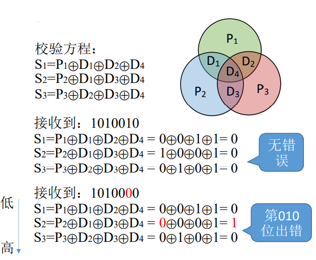

# 数据的表示与运算

**概览：**

**[:question: 数制与编码](#数制与编码)**  
**[:question: 定点数的表示](#定点数的表示)**  
**[:question: 定点数的运算](#定点数的运算)**  
**[:question: 数据的存储和排列](#数据的存储和排列)**  
**[:question: 浮点数的表示](#浮点数的表示)**  

## 数制与编码

### 进位计数制及其转换

#### 进制

- 二进制：0,1 （前缀：0b/0B，后缀：b/B。如 0010B）
- 八进制：0,1,2,3,4,5,6,7 （前缀：0，后缀：o/O）
- 十进制：0,1,2,3,4,5,6,7,8,9 （前缀：无，后缀：d/D）
- 十六进制：0,1,2,3,4,5,6,7,8,9,A,B,C,D,E,F （前缀：0x/0X，后缀：h/H）

#### 进制的转换

- 任意进制转为十进制  
  $r$ 进制：$K_n×r^n + K_{n-1}×r^{n-1}+...+K_2×r^2+K_1×r^1+K_0×r^0+K_{-1}×r^{-1}+K_{-2}×r^{-2}+...+K_{-m}×r^{-m}$
  > $(10.110)_2 : 1×2^1+0×2^0+1×2^{-1}+1×2^{-2}=2.75$  
  > $(5.4)_8 : 5×8^0+4×8^{-1} = 1.5$
- 十进制转为任意进制
  > $\frac{K_n×r^n + K_{n-1}×r^{n-1}+...+K_2×r^2+K_1×r^1+K_0×r^0+K_{-1}×r^{-1}+K_{-2}×r^{-2}+...+K_{-m}×r^{-m}}{r} = K_n×r^{n-1}+K_{n-1}×r^{n-2}+...+K_2×r^1+K_1×r^0 余k_0$
  >
  > <div align="left"></div>
  >
  > <div align="left"></div>
  >
  > <div align="left"></div>
  >
  > 十进制转非二进制其他进制时，比如八进制、十六进制，可以先转成二进制再进行转换
- 二进制转八进制、十六进制

  ```txt
  如：1111000010.01101

  1. 二进制 -> 八进制  ： 3位一组，每组转换成对应的八进制符号
  001 111 000 010 . 011 010
   1   7   0   2  .  3   2  八进制 1702.32O

  2. 八进制 -> 二进制 ： 每位八进制对应3位二进制
  251.5O -> 010 101 001.101B

  3. 二进制 -> 十六进制 ： 4位一组，每组转换成对应的十六进制符号
  0011 1100 0010 . 0110 1000
   3    C    2   .  6    8  十六进制 3C2.68H

  4. 十六进制 -> 二进制 ： 每位十六进制对应4位二进制
  AE86.1H -> 1010 1110 0110.0001B
  ```

#### 真值和机器数

真值：符合人类习惯的数字，如-1, 0, 1 等  
机器数：数字实际上存到机器的形式，常用最高位 0 表示正，1 表示负

### BCD 码

BCD : Binary-Coded Decimal，用二进制编码的十进制

**8421 码**：4 个二进制有 16 种不同的状态，8421BCD 码使用其中 10 种
| 0 | 1 | 2 | 3 | 4 | 5 | 6 | 7 | 8 | 9 |
| - | - | - | - | - | - | - | - | - | - |
| 0000 | 0001 | 0010 | 0011 | 0100 | 0101 | 0110 | 0111 | 1000 | 1001 |

**余三码**：8421 码 + 0011B
| 0 | 1 | 2 | 3 | 4 | 5 | 6 | 7 | 8 | 9 |
| - | - | - | - | - | - | - | - | - | - |
| 0011 | 0100 | 0101 | 0110 | 0111 | 1000 | 1001 | 1010 | 1011 | 1100 |

**2421 码**：改变权值定义，并且大于 5 的最高位为 1
| 0 | 1 | 2 | 3 | 4 | 5 | 6 | 7 | 8 | 9 |
| - | - | - | - | - | - | - | - | - | - |
| 0000 | 0001 | 0010 | 0011 | 0100 | 1011 | 1100 | 1101 | 1110 | 1111 |

### 字符与字符串

#### ASCII 码

ASCII 一共 128 个字符，用 7 位二进制编码，但为了存入计算机，通常最高位补 0，凑足 1Byte

可印刷字符：32 ~ 126，其余为控制、通信字符  
数字：48 ~ 57  
大写字母：65 ~ 90  
小写字母：97 ~ 122

#### 汉字的表示和编码

每个汉字的编码用两个字节来表示

#### 字符的表示

普遍采用 8 位 二进制的 ASCII 码表示（包括数字、字母、符号）

#### 字符串的表示

1. 从低地址到高地址逐个字符存储，常采用'\0'作为结尾标志
2. 对于多字节的数据（如汉字），可采用大/小端存储模式
3. 大端模式：将数据的最高有效字节存放在低地址单元中
4. 小端模式：将数据的最高有效字节存放在高地址单元中

```txt
例：某计算机按字节编址，从地址为 2 的单元开始，存储字符串“abc 啊”
各字符的ASCII编码
a: 0110 0001 = 61H
b: 0110 0010 = 62H
c: 0110 0011 = 63H
啊：机内码 = B0 A1H
\0: 0000 0000 = 00H
```

  <div align="left"></div>

### 校验码

概念：能够发现或自动纠错的数据编码  
原理：通过添加一些冗余码，实现检验或者纠错原理

校验原理：  
由若干位代码组成的一个字叫码字  
将两个码字逐位进行对比，具有不同的位的个数称为两个码字间的距离  
一种编码方案可能由若干合法码字，各合法码字间的最小距离称为“码距”  
当码距=1 时，无检错能力；当码距=2 时，有检错能力；当码距 ≥3 时，若设计合理，可能具有检错、纠错力

```txt
编码：
A：100
B：001
C：010
D：111
任意两个编码比较，如100和001发现有两个位不一样，码距为2
```

常用的校验码有：`奇偶校验码`、`海明码`、`CRC(循环冗余码)`

#### 奇偶校验码

##### 校验码

奇校验码：整个校验码（有效信息位和校验位）中的“1”的个数为奇数  
偶校验码：整个校验码（有效信息位和校验位）中的“1”的个数为偶数

```txt
例：给出两个编码 1001101 和 101011 的奇校验码和偶校验码
设最高位为校验位，余 7 位是信息位，则对应的奇偶校验码分别为：
奇校验： 11001101  0101011
偶校验： 01001101  1101011
```

<div align="left"></div>

奇偶校验码只有一个校验位，只能表示两种状态（对/错），也就是说只能确定有没有错误，但是无法确定是哪一位出错

#### 海明码

海明码：在有效信息位中添加几个校验码形成海明码。海明码不仅可以发现错位，还可以对错位进行纠错

##### 海明码设计思路

设计思路：将信息位分组进行校验 -> 多个校验位 -> 多个校验位标注出错位置

需要多少个校验位?  
假设信息位有 n 个，校验位有 k 个（共 $2^k$ 种状态）。那么信息位+校验位=n+k 位。那么需要$2^k≥n+k+1$（n+k 位中任何一个位都可能出错，1 表示一种正确状态）

海明码求解步骤：

- 确定校验位数量
- 确定校验位的分布
- 求校验位的值
- 检错纠错

例：信息位 1010，求海明码

1. 确定海明码的位数：$2^k$ >= n + k + 1
   n = 4 -> k = 3
   设信息位 $D_4D_3D_2D_1(1010)$，共 4 位，校验位$P_3P_2P_1$，共三位，对应的海明码为 $H_7H_6H_5H_4H_3H_2H_1$

2. 确定校验位的分布  
   校验位 $P_i$ 放在海明位号为$2^{i-1}$的位置上，信息位按顺序放到其余位置  
   | H7 | H6 | H5 | H4 | H3 | H2 | H1 |
   | --- | --- | --- | --- | --- | --- | --- |
   | D4 | D3 | D2 | P3 | D1 | P2 | P1 |
   | 1 | 0 | 1 | | 0 | | |

3. 求校验位的值  
   H3 : 3 -> 011  
   H5 : 5 -> 101  
   H6 : 6 -> 110  
   H7 : 7 -> 111

   P1、P2、P3 为上述的第一位对应的信息位异或，如 P1：1101，只有 H3H5H7 为 1，则只用把 D1D2D4 的信息位异或即可  
   P1 = H3 ⊕ H5 ⊕ H7 = D1 ⊕ D2 ⊕ D4 = 0 ⊕ 1 ⊕ 1 = 0  
   P2 = H3 ⊕ H6 ⊕ H7 = D1 ⊕ D3 ⊕ D4 = 0 ⊕ 0 ⊕ 1 = 1  
   P3 = H5 ⊕ H6 ⊕ H7 = D2 ⊕ D3 ⊕ D4 = 1 ⊕ 0 ⊕ 1 = 0

4. 纠错  
   所以最后海明码为
   | H7 | H6 | H5 | H4 | H3 | H2 | H1 |
   | --- | --- | --- | --- | --- | --- | --- |
   | D4 | D3 | D2 | P3 | D1 | P2 | P1 |
   | 1 | 0 | 1 | 0 | 0 | 1 | 0 |

   <div align="left"></div>

### 循环冗余校验码

常用于大量的数据传送时的校验  
接收到循环冗余码后，对生成多项式做模 2 除法，余数为 0 则无错误  
具有检错、纠错能力

- 可检测出所有奇数个错误
- 可检测出有双比特的错误
- 可检测出所有小于等于校验位长度的连续错误
- 若选择合适的生成多项式，且$2^R ≥ K + R + 1$，则可纠正单比特错

## 定点数的表示

定点数分为无符号数和有符号数

### 无符号数的表示

无符号数：整个机器字长的全部二进制位均为数值位，没有符号位，相当于数的绝对值（通常只有无符号整数，而没有无符号小数）

n 位无符号数的表示范围：0 ~ $2^n - 1$

### 有符号数的表示

有符号数应固定好小数点的位置

<div align="left"></div>

注：可用原码、反码、补码三种方式来表示定点整数和定点小数，还可以用移码表示定点整数

### 机器数表示方法

#### 原码

定义：最高位为符号位，其余各位为表示数的绝对值（0 表示正，1 表示负）

```txt
如：
x=+1110 的原码是 0,1110（用逗号将符号位和数值部分隔开）
x=-0.1101 的原码是 1-(-0.1101)=1.1101
```

若字长为 n+1，则原码整数的表示范围 $-(2^n-1) ≤ x ≤ 2^n-1$（关于原点对称），原码小数的表示范围是 $-(1-2^{-n}) ≤ X ≤ 1-2^{-n}$

原码特点：简单直观，但是使用原码作加法时，会出现如下问题

```txt
要求    数1    数2  |  实际操作  结果符号 |
加法    正     正   |  加       正      |
加法    正     负   |  减       可正可负 |
加法    正     正   |  减       可正可负 |
加法    正     正   |  加       正      |
```

只做加法时候实际操作有加有减，这样不好处理。能否找到一个与负数等价的整数，来代替这个负数，从而把加减法都变成加法（就是补码）

#### 反码

定义：若符号位为 0，则反码与原码相同；若符号位为 1，则数值位全部取反

#### 补码

正数的补码 = 原码  
负数的补码 = 反码末位 + 1（负数补码转回原码也是取反 + 1）

定点整数补码 $[x]_补 = 1,0000000$ 表示 $x=-2^7$。若机器字长 n+1 位，补码整数的表示范围：$-2^n \leq x \leq 2^n-1$ （比原码多一个$-2^n$）  
定点小数补码 $[x]_补 = 1.0000000$ 表示 $x=-1$。若机器字长 n+1 位，补码小数的表示范围：$-1 \leq x \leq 1-2^{-n}$ （比原码多表示一个$-1$）

#### 移码

定义：补码的基础上将符号位取反。注意：移码只能用于表示整数

若机器字长 n+1 位，移码整数的表示范围：$-2^n≤x≤2^n-1$

$[+0]_补 = [-0]_补 = 00000000$  
$[+0]_移 = [-0]_移 = 10000000$

用移码表示的整数很方便对比大小，移码大的真值大，移码小的真值小

```txt
例子：
x=+19D    原码：0,0010011
          反码：0,0010011
          补码：0,0010011
          移码：1,0010011

x=-0.75D  原码：1.1100000
          反码：1.0011111
          补码：1.0100000
          移码：0,0100000
```

## 定点数的运算

### 算数移位

移位：通过改变各个数码位和小数点的相对位置，从而改变各数码位的位权。可用移位运算实现乘法、除法

| <div style="width:35px" > 类型 | 说明                                                                                                                                                                                                                                                                                                                                              |
| ------------------------------ | ------------------------------------------------------------------------------------------------------------------------------------------------------------------------------------------------------------------------------------------------------------------------------------------------------------------------------------------------- |
| 原码                           | 符号位保持不变，仅对数值位进行移位 <br>右移：高位补 0，低位舍弃。若舍弃的位=0，则相当于 ÷2；若舍弃的位 ≠0，则会丢失精度 <br>左移：低位补 0，高位舍弃。若舍弃的位=0，则相当于 ×2；若舍弃的位 ≠0，则会出现严重误差                                                                                                                                  |
| 反码                           | 正数的反码与原码相同，因此对正数反码的移位运算也和原码相同 <br><br> 负数的反码数值位与原码相反，因此负数反码的移位运算规则如下：<br>右移：高位补 1，低位舍弃 <br>左移：低位补 1，高位丢弃                                                                                                                                                         |
| 补码                           | 正数的补码与原码相同，因此对正数补码的移位运算也和原码相同 <br><br> 负数补码 = 反码末位+1 导致反码最右边几个连续的 1 都因进位而变为 0，直到进位碰到第一个 0 为止。规律：负数补码中，最右边的 1 及其右边同原码，最右边的 1 和左边同反码。负数补码的算数移位规则如下：<br>右移（同反码）：高位补 1，低位舍弃 <br>左移（同原码）：低位补 0，高位舍弃 |

### 逻辑移位

逻辑右移：高位补 0，低位舍弃  
逻辑左移：低位补 0，高位舍弃

### 循环移位

<div align="left"></div>

### 加减运算和溢出判断

#### 原码的加减运算

<div align="left"></div>

##### 加法

- 正 + 正 ：绝对值做加法，结果为正，可能会溢出
- 负 + 负 ：绝对值做加法，结果为负，可能会溢出
- 正 + 负 ：绝对值大的减绝对值小的，符号同绝对值大的数
- 负 + 正 ：绝对值大的减绝对值小的，符号同绝对值大的数

##### 减法：“减数”符号取反，转变为加法

- 正 - 负 ：正 + 正
- 负 - 正 ：负 + 负
- 正 - 正 ：正 + 负
- 负 + 正 ：负 - 负

#### 补码的加减运算

对于补码来说，无论加法还是减法，最后都会转变成加法，由加法器实现运算，符号位也参与运算

```txt
例：设机器字长为8位（含1位符号位），A=15，B=-24，求[A+B]的补码和[A-B]的补码

A = +1111    原码：0,0001111    补码：0,0001111
B = -11000   原码：1,0011000    补码：1,1101000
[A+B]补 = [A]补 + [B]补 = 0,0001111 + 1,1101000 = 1,1110111   其原码：1,0001001  真值：-9
[A-B]补 = [A]补 + [-B]补 = 0,0001111 + 0,0011000 = 0,0100111  其原码：0,0100111  真值：39
[-B]补：[B]补连同符号位一起取反加1
```

#### 溢出判断

“正数 + 正数” 才会产生上溢 -- 正 + 正 = 负  
“负数 + 负数” 才会产生下溢 -- 负 + 负 = 正

_注：以下判断方法会涉及到一些数电真值表和逻辑表达式简化知识_

- 判断溢出方法 1：采用一位符号位，设 $A$ 的符号位为$A_s$，$B$ 的符号位为$B_s$，运算结果的符号为$S_s$，则溢出逻辑表达式为 $V=A_sB_s\overline{S_s} + \overline{A_s}·\overline{B_s}S_S$。若 $V=0$，表示无溢出，若 $V=1$，表示有溢出
- 判断溢出方法 2：采用一位符号位，根据数据位进位情况判断溢出符号位的进位$C_s$，最高数值位的进位$C_1$，得出 $V = C_s \oplus C_1$
- 判断移除方法 3：采用双符号位：正数符号 00，负数符号 11。记两个符号位为$S_{s1}S_{s2}$，则$V=S_{s1} \oplus S_{s2}$。  
  _注：实际存储时只存储 1 个符号位，运算时会复制一个符号位_

```txt
例：设机器字长为8位，A=15，B=-24，C=124，求[A+C]补和[B-C]补
[A+C]补 = 0,0001111 + 0,1111100 = 1,0001011    真值-117
[B-C]补 = 1,1101000 + 1,0000100 = 0,1101100    真值+108

方法1：
[A+C]补 : V = 0·0·0 + 1·1·1 = 1 溢出
[B-C]补 : V = 1·1·1 + 0·0·0 = 1 溢出
方法2
[A+C]补 : Cs = 0  C1 = 1   V = 0⊕1 = 1  溢出
[B-C]补 : Cs = 1  C1 = 0   V = 1⊕0 = 1  溢出
方法3
[A+C]补 : 00,0001111 + 00,1111100 = 01,0001011  V=0⊕1=1  01表示上溢
[B-C]补 : 11,1101000 + 11,0000100 = 10,1101100  V=1⊕0=1  10表示下溢
方法二和方法三其实只是表述方法不一样
```

#### 符号扩展

int -> long，短数据 -> 长数据。多出来的那些位应该怎么填补

<div align="left"></div>

定点整数的符号扩展：在原符号位和数值位中间添加新位，正数都添 0；负数原码添 0，负数反、补码添 1  
定点小数的符号扩展：在原符号位和数值位后面添加新位，正数都添 0；负数原、补码添 0，负数反码添 1

### 乘除运算

太复杂了，略

## 数据的存储和排列

### 大小端模式

多字节数据在内存里一定是占连续的几个字节，存在内存中主要分为两种方式

- 大端方式：数据的高字节部分保存在低地址，数据的低字节部分保存在高地址
- 小端方式：数据的高字节部分保存在高地址，数据的低字节部分保存在低地址

如：4 字节 int : 01 23 45 67H

<div align="left"></div>

### 边界对齐

现代计算机通常是按字节编址，即每个字节对应 1 个地址  
通常也支持按字、按半字、按字节寻址  
假设存储字长为 32 位，则 1 个字=32bit，半字=16bit。每次访存只能读/写 1 个字

<div align="left"></div>

## 浮点数的表示

### 浮点数表示

普通计数法：$+302657264526$  
科学计数法：$+3.026 * 10^{11}$

科学计数法只用记录两个值，+11 和 +3.026。+11 是阶码，+3.026 是尾数

<div align="left"></div>

阶码：常用补码或移码表示的定点整数  
尾数：常用原码或补码表示的定点小数

浮点数的真值：$N = r^E × M$  
r 是阶码的底，通常为 2  
阶码 E 反映浮点数的表示范围及小数点的实际位置  
尾数 M 的数值部分的位数 n 反应浮点数的精度

```txt
例：阶码、尾数均用补码表示，求a、b的真值
a = 0,01;1.1001
b = 0,10;0.01001

a: 阶码0,01对应真值+1，尾数1.1001对应真值-0.0111，a的真值=2×(-0.0111)=-0.111 (乘2相当于左移一位)
b: 阶码0,10对应真值+2，尾数0.01001对应真值+0.01001，b的真值=2^2×(+0.01001)=+1.001
```

### 浮点数尾数的规格化

$+302657264526=+3.026×10^{11}$ 可记为：+11 +3.026 也可记为+14 + 0.003。（尾数的最高位是无效值会丧失精度）

规格化浮点数：规定尾数的最高数值位必须是一个有效值

- 左规：当浮点数运算的结果为非规格化时要进行规格化处理，将尾数算数左移一位，阶码减 1
- 右规：当浮点数运算的结果尾数出现溢出（双符号位为 01 或 10）时，将尾数算数右移一位，阶码加 1。_注：采用“双符号位”，当溢出发生时，可以挽救。更高的符号位是正确的符号位_

```txt
例：a = 010;00.1100，b = 010;00.1000  求a+b（这里采用双符号位）

a = 2^2×00.1100, b = 2^2×00.1000
a+b = 2^2×(00.1100 + 00.1000)
    = 2^2×01.0100(右规)
    = 2^3×00.1010
```

特点：

- 用原码表示的尾数进行规格化，规格化的原码尾数，最高数值位一定是 1
  - 正数为 0.1XX...X 的形式，其最大值表示为 0.11...1，最小值表示为 0.10...0。表示范围 $\frac{1}{2} \le M \le (1-2^{-n})$
  - 负数为 1.1XX...X 的形式，其最大值表示为 1.10...0，最小值表示为 1.11...1。表示范围$-(1-2^{-n}) \le M \le -\frac{1}{2}$
- 用补码表示的尾数进行规格化，规格化的补码尾数，符号位与最高数值位一定相反
  - 正数为 0.1XX...X 的形式，其最大值表示为 0.11...1，最小值表示为 0.10...0。表示范围 $\frac{1}{2} \le M \le (1-2^{-n})$
  - 负数为 1.0XX...X 的形式，其最大值表示为 1.01...0，最小值表示为 1.00...0。表示范围$-1 \le M \le -(\frac{1}{2} + 2^{-n})$

### IEEE 754 标准

<div align="left"></div>

| 类型                   | 数符 | 阶码 | 尾数数值 | 总位数 | 偏置值-十六进制 | 偏置值-十进制 |
| ---------------------- | ---- | ---- | -------- | ------ | --------------- | ------------- |
| float 短浮点数         | 1    | 8    | 23       | 32     | 7FH             | 127           |
| double 长浮点数        | 1    | 11   | 52       | 64     | 3FFH            | 1023          |
| long double 临时浮点数 | 1    | 15   | 64       | 80     | 3FFFH           | 16383         |

规格化的短浮点数的真值为：$(-1)^s×1.M×2^{E-127}$  
规格化的长浮点数的真值为：$(-1)^s×1.M×2^{E-1023}$

阶码真值 = 移码 - 偏置值

```txt
例：将-0.75D转换为IEEE754的单精度浮点数格式表示

-0.75D = -0.11B = -1.1B×2^(-1)
数符 = 1
尾数部分 = .1000000.... （隐含最高位1）
阶码真值 = -1
单精度浮点型偏移量 = 127D
移码 = 阶码真值 + 偏移量 = -1 + 1111111 = 0111 1110（共8位）
单精度格式结果：1 01111110 10000000000000000000000
```

### 浮点数的运算

#### 加减运算

步骤：

1. 对阶
2. 尾数加减
3. 规格化
4. 舍入
5. 判断溢出

```txt
例：9.85211×10^12 + 9.96007×10^10

1.对阶：9.85211×10^12 + 0.0996007×10^12
2.尾数加减：9.9517107×10^12
3.规格化：如果尾数加减出现类似 0.0099517×10^12，需要“左规”；如果尾数加减出现类似 99.517107×10^12时，需要“右规”
4.舍入，可以有不同的舍入规则：若规定只能保留6位有效尾数，
  则9.9517107×10^12 -> 9.95171×10^12（多余部分直接砍掉）；
  或者，9.95172×10^12（若砍掉部分非0，则入1）；
  或者，四舍五入原则，当舍弃位≥5，高位入1
5.判溢出：若规定阶码不能超过两位，则运算后阶码超出范围，则溢出
  如：9.85211×10^99 + 9.96007×10^99 = 19.81218×10^99，规格化且用四舍五入原则保留6位尾数，得1.98122×10^100
  阶码超过两位，发出溢出（注：尾数溢出未必导致整体溢出，也许可以通过3、4两步来拯救）
```

##### 浮点数的加减运算-舍入方法

- “0”舍“1”入法：类似于十进制数运算中的“四舍五入”法，即在尾数右移时，被移去的最高数值为 0，则舍去；被移去的最高位数值位为 1，则在尾数的末位加 1.这样做可能会使尾数又溢出，此时需要再做一次右规
- 恒置“1”法：尾数右移时，不论丢掉的最高数值位是“1”还是“0”，都使右移后的尾数末位恒置“1”。这种方法同样有使尾数变大和变小的两种可能

#### 强制类型转换

范围、精度从小到大，转换过程没有损失，比如 char ->int -> long -> double 或 float -> double

int -> float : 可能损失精度  
float -> int : 可能溢出，也可能损失精度（如小数转整数）
