# 存储系统

**概览：**

**[:question: 存储系统基本概念](#存储系统基本概念)**  
**[:question: 主存储器的基本组成](#主存储器的基本组成)**  
**[:question: 主存储器与 CPU 的连接](#主存储器与-cpu-的连接)**  
**[:question: SRAM 和 DRAM](#sram-和-dram)**  
**[:question: 双口 RAM 和多模块存储器](#双口-ram-和多模块存储器)**  
**[:question: Cache](#cache)**  
**[:question: 虚拟存储器](#虚拟存储器)**

## 存储系统基本概念

### 存储器的层次结构

<div align="left">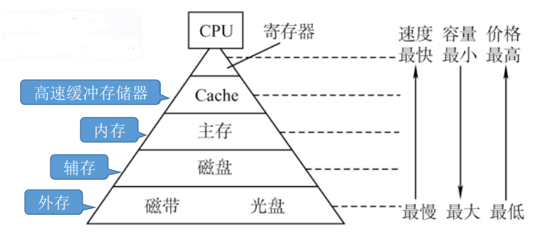</div>

主存-辅存：实现虚拟存储系统，解决了主存容量不够的问题  
主存-Cache：解决了主存与 CPU 速度不匹配问题

_注：越往上成本越高_

### 存储器的分类

| 分类类别         | 分类细目                                                                                                                                                                                                                                                                                                                                                                                |
| ---------------- | --------------------------------------------------------------------------------------------------------------------------------------------------------------------------------------------------------------------------------------------------------------------------------------------------------------------------------------------------------------------------------------- |
| 按层次           | 1. 高速缓存（Cache）<br> 2. 主存储器（内存）<br> 3. 辅助存储器（辅存、外存）                                                                                                                                                                                                                                                                                                            |
| 按存储介质       | 1. 半导体存储器：以半导体器件存储信息，如主存、Cache<br> 2. 磁表面存储器：以磁性材料存储信息，如磁盘、磁带<br> 3. 光存储器：以光介质存储信息，如光盘                                                                                                                                                                                                                                    |
| 按存取方式       | 1. 相联存储器(CAM)：即可以按内容访问的存储器，可以按照内容检索到存储位置进行读写，“快表”就是一种相联存储器<br> 2. 随机存储器(RAM)：读写任何一个存储单元所需时间都相同，与存储单元所在的物理位置无关<br> 3. 顺序存储器(SAM)：读写一个存储单元所需时间取决于存储单元所在的物理位置<br> 4. 直接存储器(DAM)：既有随机存取特性，也有顺序存取特性。先直接选取信息所在区域，然后按顺序方式存取 |
| 按信息的可更改性 | 1. 读写存储器：即可读、也可写（如：磁盘、内存、Cache）<br> 2. 只读存储器：只能读，不能写（如：实体音乐专辑通常采用 CD-ROM，实体电影采用蓝光光碟，BIOS 通常卸载 ROM 中）<br>                                                                                                                                                                                                             |
| 按信息的可保存性 | 断电后信息是否消失： <br>1. 易失性存储器：断电后，存储信息消失的存储器，如主存、Cache<br> 2. 非易失性存储器：断电后，存储信息依然保持的存储器，如磁盘、光盘 <br><br> 信息读出后，原信息是否被破坏：<br> 1. 破环性读出：信息读出后，原存储信息被破坏（如 DRAM 芯片，读出数据后要进行重写）<br> 2. 非破坏性读出：信息读出后，原存储信息不被破坏（如 SRAM 芯片、磁盘、光盘）               |

### 存储器的性能指标

- **存储容量**：存储字数 × 字长（如 1M × 8 位）（MDR 的位数反应存储字长）

- **单位成本**：每位价格 = 总成本 / 总容量

- **存储速度**：数据传输率 = 数据的宽度 / 存储周期 （数据的宽度即存储字长）

  <div align="left">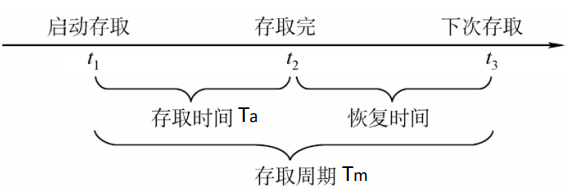</div>

  存取时间：存取时间是指从启动一次存储器操作到完成该操作所经历的时间，分为读出时间和写入时间  
  存取周期：存取周期又称为读写周期或访问周期。它是指存储器进行一次完整读写操作所需的全部时间，即连续两次独立地访问存储器操作之间所需要的最小时间间隔

- **主存带宽**(Bm)：主存带宽又称数据传输率，表示每秒从主存进出信息的最大数量，单位为字/秒、字节/秒（B/s），或位/秒（b/s）

## 主存储器的基本组成

主存储器：

<div align="left">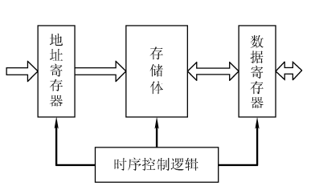</div>

主存储器的简单模型：

<div align="left">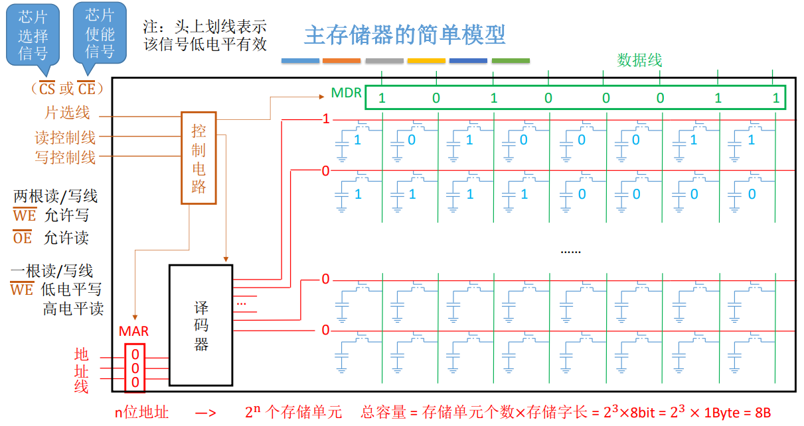</div>

- 寻址：现代计算机通常按字节编址，即每个字节对应一个地址

```txt
例如：假设存储字长 4B，总容量为 1KB，地址线 10 根，则
  按字节寻址：1K 个单元，每个单元 1B
  按字寻址：256 个单元，每个单元 4B
  按半字寻址：512 个单元，每个单元 2B
  按双字寻址：128 个单元，每个单元 8B
```

## SRAM 和 DRAM

|                    | SRAM <br> (Satic Random Access Memory) | DRAM <br> (Dynamic Random Access Memory) |
| ------------------ | -------------------------------------- | ---------------------------------------- |
| 存储元             | 使用双稳态触发器存储信息               | 使用栅极电容存储信息                     |
| 破坏性读出         | 非                                     | 是                                       |
| 读出后是否需要重写 | 不用                                   | 需要                                     |
| 运行速度           | 快                                     | 慢                                       |
| 集成度             | 低                                     | 高                                       |
| 发热量             | 大                                     | 小                                       |
| 存储成本           | 高                                     | 低                                       |
| 是否是易失性存储器 | 是                                     | 是                                       |
| 是否需要“刷新”     | 不需要                                 | 需要（电容电荷只能维持 2ms）             |
| 送行列地址         | 同时送                                 | 分两次送(地址线复用技术)                 |
| 常用于             | Cache                                  | 主存                                     |

<div align="left">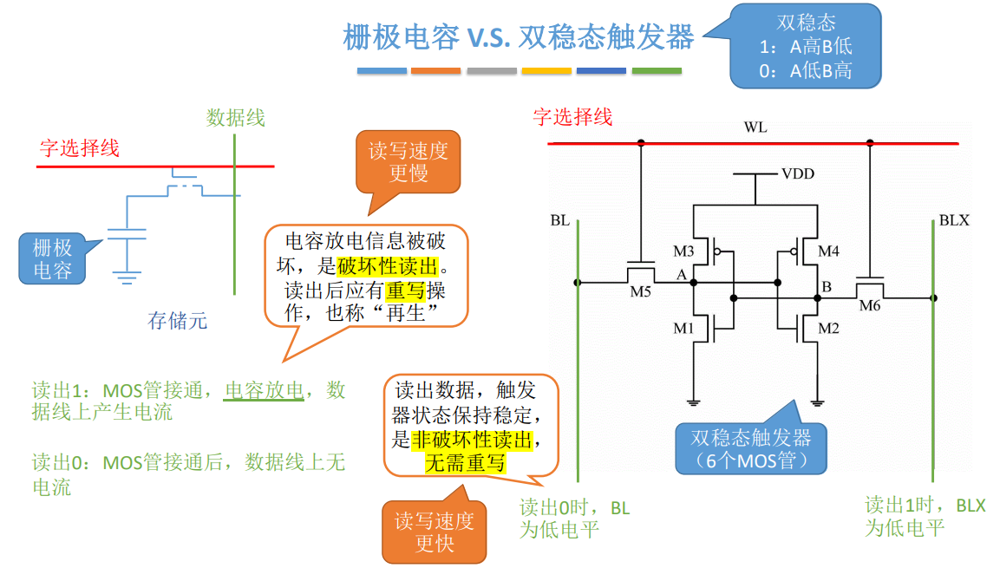</div>

### DRAM 的刷新

- 多久需要刷新一次？  
  刷新周期一般为 2ms
- 每次刷新多少存储单元？  
  以行为单位，每次刷新一行存储单元
- 如何刷新？  
  有硬件支持，读出一行的信息后重新写入，占用一个读写周期
- 在什么时刻刷新？
  <div align="left">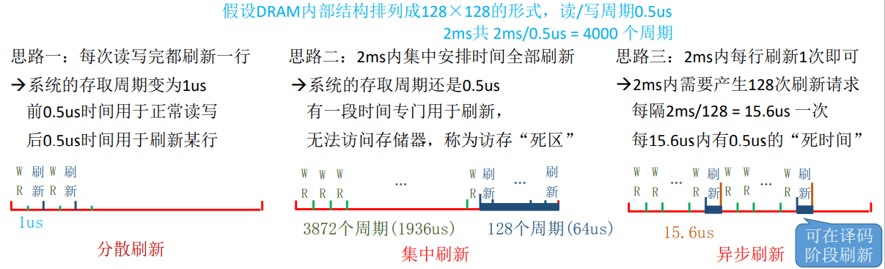</div>

DRAM 在取地址时候采用行列地址，这样可以减少选通线的数量，另外通过 DRAM 地址复用技术，将行列地址分两次送，可使地址线更少，芯片引脚更少

<div align="left">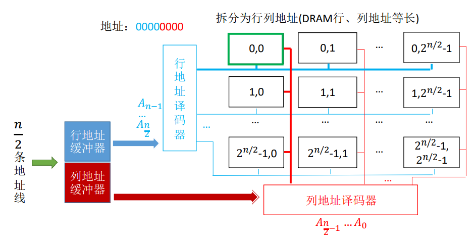</div>

### 只读存储器 ROM

| 种类         | 说明                                                                                                                                                                                                                |
| ------------ | ------------------------------------------------------------------------------------------------------------------------------------------------------------------------------------------------------------------- |
| MROM         | 掩模式只读存储器，厂家按照客户需求，在芯片生产过程中直接写入信息，之后任何人不可重写（只能读出）                                                                                                                    |
| PROM         | 可编程只读存储器，用户可用专门的 PROM 写入器写入信息，写一次之后就不可更改                                                                                                                                          |
| EPROM        | 可擦除可编程只读存储器，允许用户写入信息，之后用某种方法擦除数据，可进行多次重写 <br> UVEPROM：用紫外线照射 8-20 分钟，擦除所有信息 <br> EEPROM：可用“电擦除”的方式，擦除特定的字                                   |
| Flash Memory | 闪速存储器，U 盘、SD 卡就是闪存，每个存储单元只需要单个 MOS 管，位密度比 RAM 高 <br> 在 EEPROM 基础上发展而来，断电后也能保存信息，且可进行多次快速擦除重写。由于闪存需要先擦除再写入，因此闪存的“写”比“读”速度更慢 |
| SSD          | 固态硬盘。由控制单元+存储单元构成。与闪存核心区别在于控制单元不一样，但存储介质类似，可进行多次快速擦除重写                                                                                                         |

## 主存储器与 CPU 的连接

主存与 CPU 通过地址总线、数据总线、控制总线相连接

现在的计算机中 MAR、MDR 通常集成在 CPU 内部。存储芯片内只需一个普通的寄存器（暂存输入、输出数据）  
一般来说，主存中包含多块存储芯片，那么需要把这些存储芯片与 CPU 连接起来（比如多个内存条），这就涉及到主存容量扩展的方式

### 主存容量扩展的方式

### 位扩展 - 增加主存的存储字长

多个存储芯片并联

<div align="left">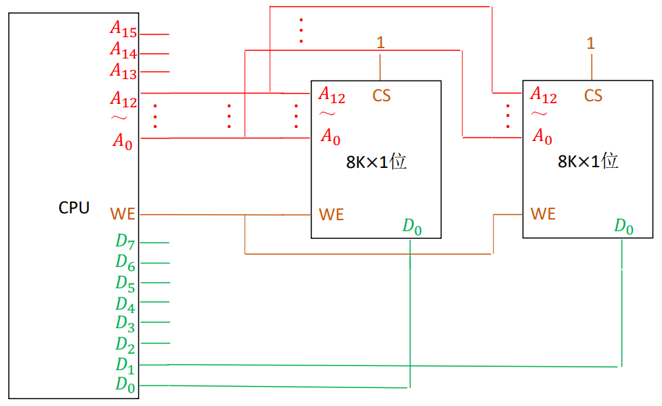</div>

地址选择线仍然是 A0-A12，地址范围是 8K  
8 片 8K×1 位的存储芯片可扩展成 1 个 8K×8 位的存储器，容量 8KB

### 字扩展 - 增加主存的存储字数

多个存储芯片串联

<div align="left">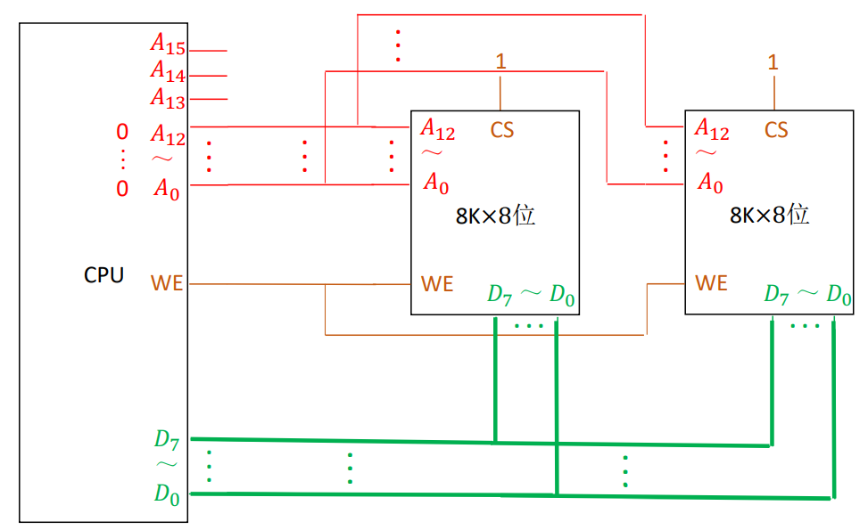</div>

图中可以看出，数据总线宽度无需扩展，而地址总线宽度需要扩展，剩下 A13、A14、A15 未使用，有两种扩展方式`线选法`和`译码片选法`

#### 线选法

通过地址线直接对芯片进行选择  
n 条线有 n 个选片信号

<div align="left">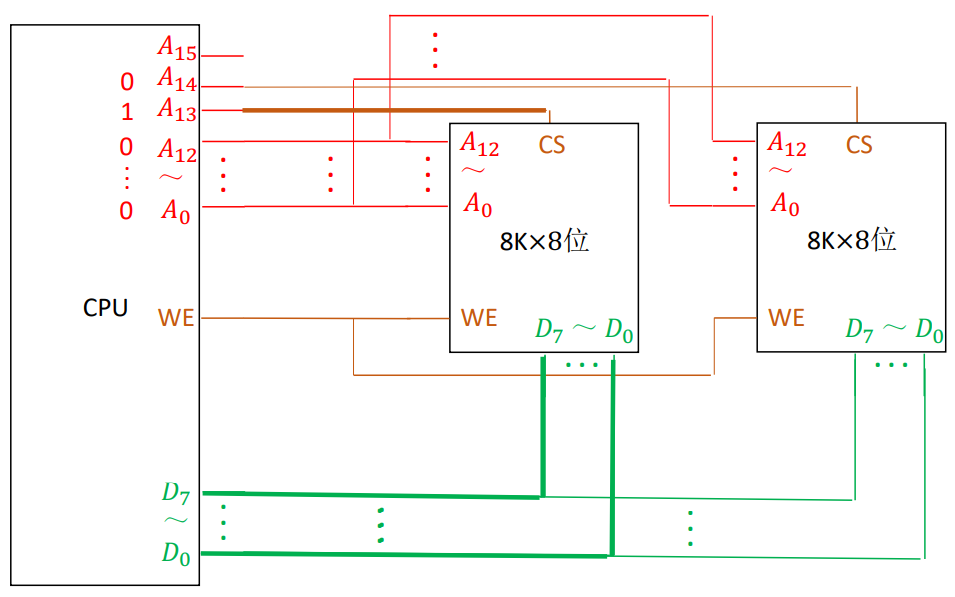</div>

A13、A14、A15 只能有一个有效，从而选择哪块存储芯片处理数据，那只能有三种情况 100、010、001，这会导致地址范围是只能是`001x xxxx xxxx xxxx`、`010x xxxx xxxx xxxx`、`100x xxxx xxxx xxxx`，地址空间不连续

- 优点：不需要地址译码器，线路简单
- 缺点：地址空间不连续，不能重复利用系统存储空间，造成地址资源的浪费

#### 译码片选法

通过使用地址译码器对芯片进行选择

<div align="left">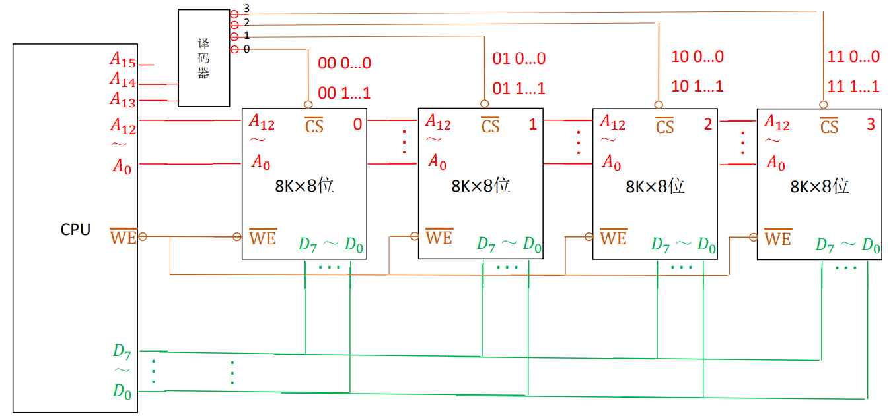</div>

A13、A14、A15 可用 3-8 译码器扩展出 8 个选择信号`000-111`，这样地址空间是连续的`000x xxxx xxxx xxxx - 111x xxxx xxxx xxxx`

8 片 8K×8 位的存储芯片可扩展成 1 个 64K×8 位的存储器，容量 64KB

- 优点：每片芯片的地址范围是唯一确定的，而且是连续的，也便于扩展
- 缺点：对译码电路要求过高

### 字位同时扩展

并联与串联结合在一起，增加存储字数、增加存储字长

<div align="left">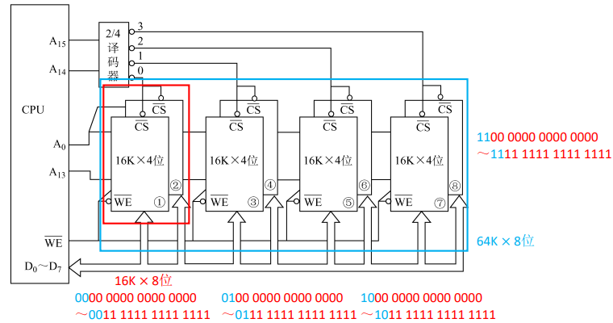</div>

## 双口 RAM 和多模块存储器

DRAM 芯片的恢复时间比较长，有可能是存取时间的几倍（SRAM 的恢复时间较短）。多核 CPU 都要访存，怎么办？CPU 的读写速度比主存快很多，主存恢复时间太长怎么办？为了提升主存速度，有两种方法`双口RAM`和`多模块存储器`

### 双口 RAM

<div align="left">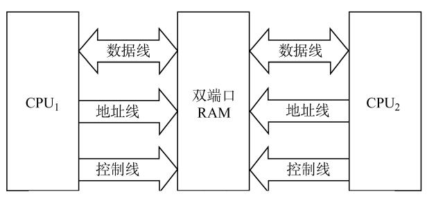</div>

双口 RAM 作用：优化多核 CPU 访问一根内存条的速度，但是需要有两组完全独立的数据线、地址线、控制线。CPU、RAM 中也要用复杂的控制电路

两个端口对同一主存操作有以下 4 种情况：

1. 两个端口同时对不同的地址单元存取数据
2. 两个端口同时对同一地址单元读出数据
3. 两个端口同时对同一地址单元写入数据（写入错误）
4. 两个端口同时对同一地址单元，一个写数据，一个读数据（读出错误）

解决上述错误的方法：置“忙”信号为 0，由判断逻辑决定暂时关闭一个端口（即被延时），未关闭的端口正常访问，被关闭的端口延长一个很短的时间段后再访问

### 多模块存储器

普通存储器：每行为 1 个存储单元  
单体多字存储器：一个存储体中每个存储单元存储 m 个字  
多体并行存储器：每个模块都有相同的容量和存取速度，各模块都有独立的读写控制电路、地址寄存器和数据寄存器

<div align="left">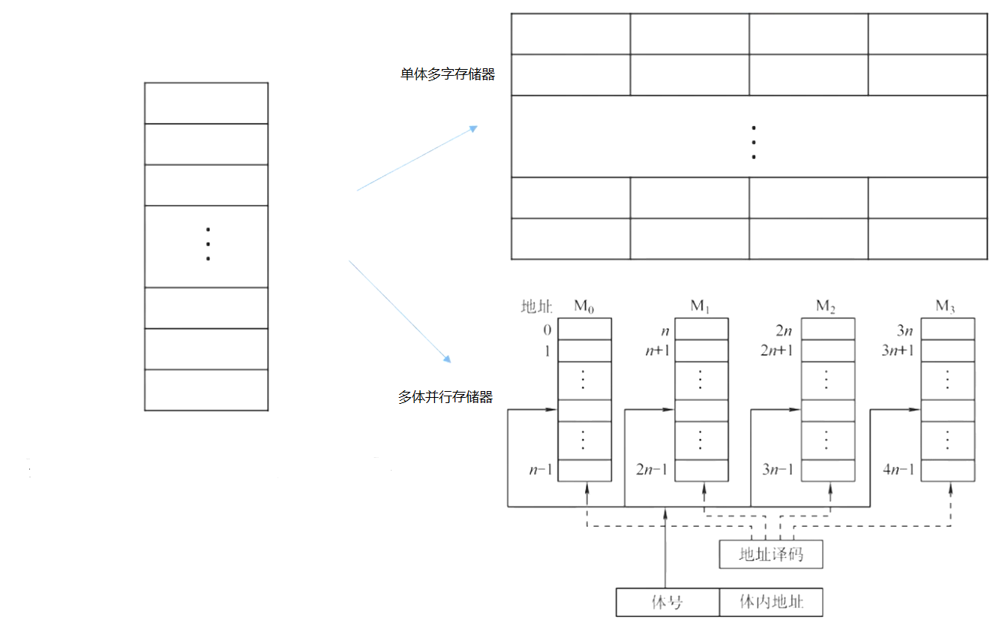</div>

#### 单体多字存储器

每个存储单元存储 m 个字  
总线宽度也为 m 个字  
一次并行读出 m 个字

每次只能同时取 m 个字，不能单独取其中某个字

#### 多体并行存储器

多体并行存储器编址方式有两种：`高位交叉编址`和`低位交叉编址`

- 高位交叉编址：地址的高位是体号，低位是体内地址
- 低位交叉编址：地址的低位是体号，高位是体内地址

<div align="left">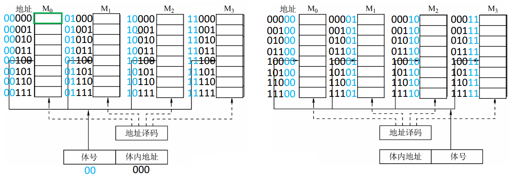</div>

那这两种编址方式对取值有什么影响呢？假设每个存储体的存取周期为 T，存取时间为 r，T=4r，当连续访问 `00000`、`00001`、`00010`、`00011`、`00100` 几个地址时，两种编址方式的时空图如下：

<div align="left">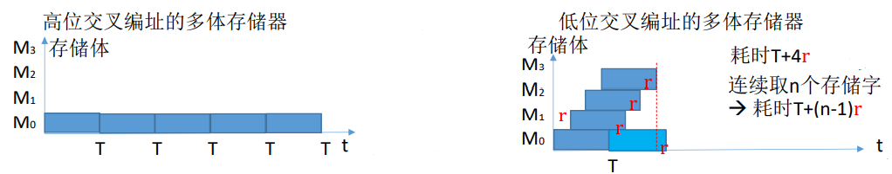</div>

一般来说指令和数据在主存内是连续存放的，采用低位交叉编址方式取值时可以大大减少时间

_tips: 买内存条时，可挑选相同主频、相同容量的两根来组成双通道。_

## Cache

双端口 RAM、多模块存储器提高了存储器的工作速度，但是仍于 CPU 差距很大。于是在 CPU 和存储器之间引入了速度更快的存储器 Cache（用 SRAM 实现），但价格更高，所以容量一般较小

**局部性原理：**

- 空间局部性：在最近的未来要用到的信息（指令和数据），很可能与现在正在使用的信息在存储空间上是相邻的
- 时间局部性：在最近的未来要用到的信息，很可能是现在正在使用的信息

命中率：CPU 欲访问的信息已在 Cache 中的比率

设$t_c$为访问一次 Cache 所需时间，$t_m$为访问一次主存所需时间，命中率为 H，则 CPU 的平均访问时间$t=Ht_c + (1-H)(t_c+t_m)$

基于局部性原理，不难想到，可以把 CPU 目前访问的地址“周围”的部分数据放到 Cache 中。如何界定“周围”？  
将主存的存储空间“分块”，如每 1KB 为一块。主存和 Cahce 之间以“块”为单位进行数据交换。操作系统中，通常将主存中的“一个块”也称为“一个页/页面/页框”。假设主存大小为$2^{22}=4M$，则整个主存被分为$4M/1K=4*1024KB/1KB=4096$块

引入如下问题：

- 如何区分 Cache 和主存的数据块对应关系？ `Cahce和主存的映射方式`
- Cache 很小，主存很大。如果 Cahce 满了怎么办？ `替换算法`
- CPU 修改了 Cache 中的数据副本，如何确保主存中数据母本的一致性？`Cache写策略`

### Cache-主存 映射方式

映射方式主要有三种：`全相联映射`、`直接映射`、`组相联映射`

假设某个计算机的主存地址空间大小为 256MB，按字节编址，其数据 Cache 有 8 个 Cache 行，行长为 64B  
则$256M=2^{28}$，主存地址共 28 位，那么主存块号占 22 位，块内地址占 6 位（对应 Cache 的 64B）

<div align="left">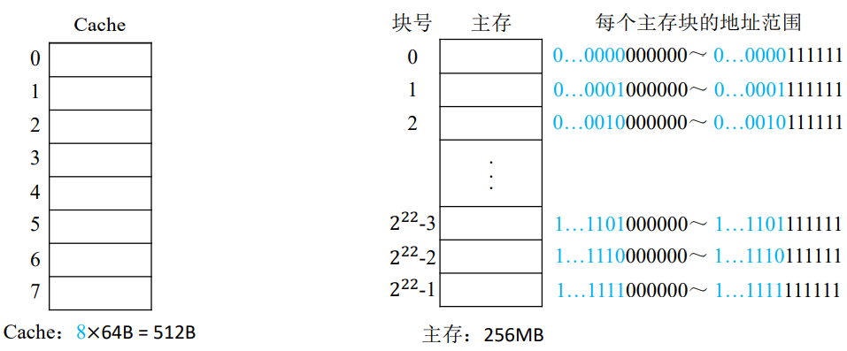</div>

#### 全相联映射

主存块可以放在 Cache 的任意位置

<div align="left">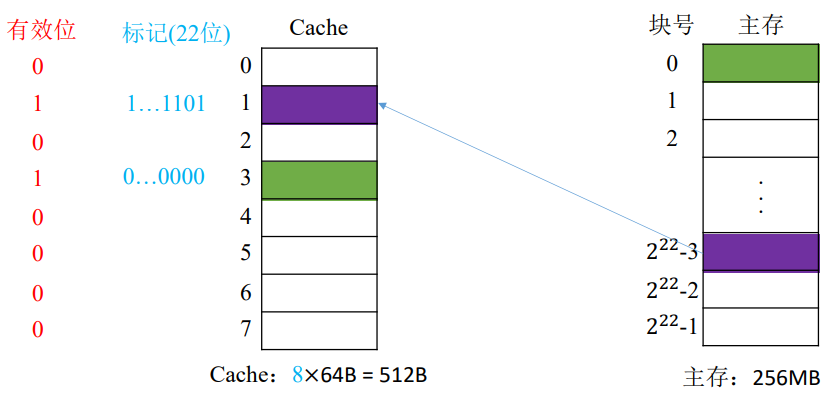</div>

如图，需要 1 位有效位和 22 位标记位，将任意的主存块号放到 Cache 任意位置，有效位置 1，标记位为块号。

```txt
例如：CPU 访问主存地址 1...1101 001110：
1. 主存地址的前 22 位，对比 Cache 中所有块的标记
2. 若标记匹配且有效位=1，则 Cache 命中，访问块的地址位 001110 的单元
3. 若未命中或有效位=0，则正常访问主存
```

优点：Cahce 空间利用充分  
缺点：查找“标记”最慢，有可能需要对比所有行的标记

#### 直接映射

主存块只能放到一个特定的位置：Cahce 块号 = 主存块号 % Cache 总块数

<div align="left">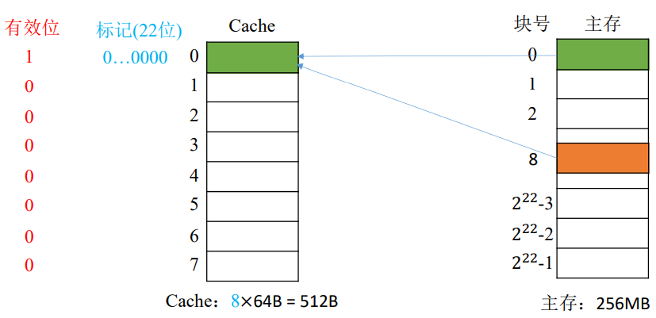</div>
当0号和8号映射都是Cache的0行，这样其他地方有空闲的Cache块，但是8号主存块不能使用。

是否能优化标记位？由于主存块号%$2^3$，相当于留下主存块号末尾 3 为直接反映它在 Cache 中的位置。将其余 19 位作为标记位即可

<div align="left">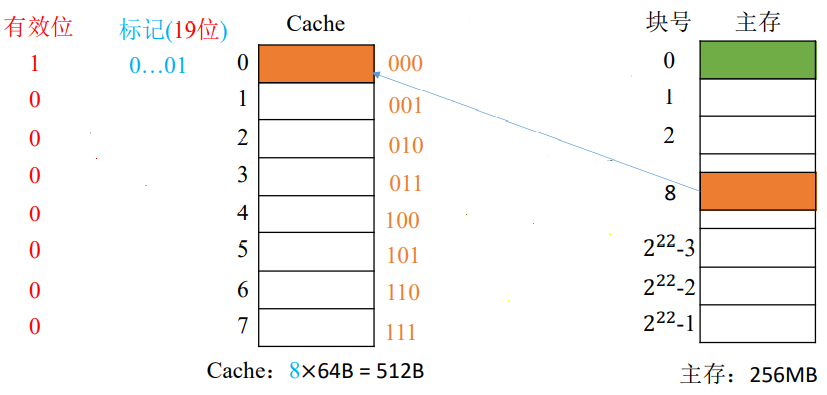</div>

```txt
例如：CPU 访问主存地址 0...01 000 001110：

1. 根据主存块号的后 3 位确定 Cache 行
2. 若主存块号的前 19 位与 Cache 标记匹配且有效位=1，则 Cache 命中，访问块内地址为 001110 的单元
3. 若未命中或有效位=0，则正常访问主存
```

优点：对于任意一个地址，只需对比一个“标记”，速度最快  
缺点：Cache 存储空间利用不充分，命中率低

#### 组相联映射

Cache 块分为若干组，每个主存块可放到特定分组中的任意一个位置：组号 = 主存块号 % 分组数

n 路组相联映射：每 n 个 Cache 行为一组

<div align="left">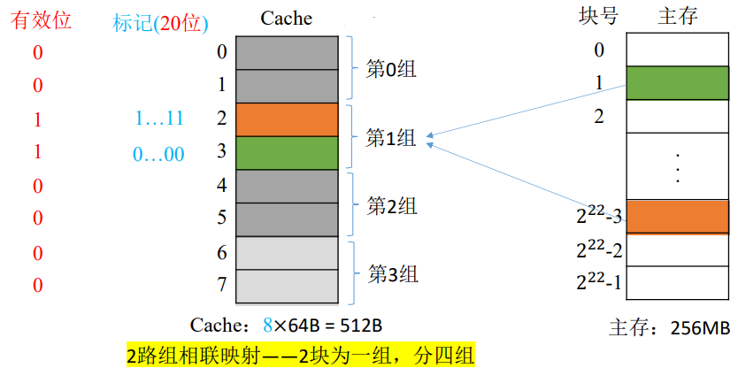</div>

标记 20 位是因为分组数$2^2$，相等于留下了最后两位

```txt
例如：CPU 访问主存地址 1...11 01 001110：

1. 根据主存块号的后 2 位确定所属分组号
2. 若主存块号的前 20 位与分组内的某个标记匹配且有效位=1，则 Cache 命中，访问块内地址为 001110 的单元
3. 若未命中或有效位=0，则正常访问主存
```

优点：上述两种方式的折中，综合效果最好

### Cache 替换算法

| 算法                    | 原理                                                                                                        | 特点                                                                                                                                                                                                                                                                                                                                                                |                                                                                                                                                                                                                                           |
| ----------------------- | ----------------------------------------------------------------------------------------------------------- | ------------------------------------------------------------------------------------------------------------------------------------------------------------------------------------------------------------------------------------------------------------------------------------------------------------------------------------------------------------------- | ----------------------------------------------------------------------------------------------------------------------------------------------------------------------------------------------------------------------------------------- |
| 随机算法（RAND）        | 若 Cache 已满，则随机选择一块替换                                                                           | 实现简单，但完全没有考虑局部性原理，命中率低，实际效果很不稳定                                                                                                                                                                                                                                                                                                      |
| 先进先出算法（FIFO）    | 若 Cache 已满，则替换最先被调入的 Cache 块                                                                  | 实现简单，依然没有考虑局部性原理，最先调入的 Cache 的块也有可能是最被频繁访问的                                                                                                                                                                                                                                                                                     |
| 近期最少使用算法（LRU） | 为每一个 Cache 块设置一个“计数器”，用于记录每个 Cache 块已经多久没被访问了。当 Cache 满后替换“计数器”最大的 | 基于“局部性原理”，近期被访问过的主存块，在不久的将来也很有可能被再次访问，因此淘汰最久没被访问过的块是合理的。LRU 算法的实际运行效果优秀，Cache 命中率高。若被频繁访问的主存块数量大于 Cache 行的数量，则可能发生抖动现象。比如共有 4 个 Cache 块，依次访问主存块{1,2,3,4,5,1,2,3,4,5,1,2...} <br><br> _抖动现象：刚被替换的块很快又被调入而导致的频繁换入换出现象_ | 1. 命中时，所命中的行的计数器清零，比其低的计数器加 1，其余不变 <br> 2. 未命中且无空闲行时，计数值最大的行的信息的信息块被淘汰，新装行的块的计数器置 0，其余全加 1 <br> 3. 未命中且有空闲行时，新装入的行的计数器置 0，其余非空闲行全加 1 |
| 最不经常使用算法（LFU） | 为每一个 Cache 块设置一个“计数器”，用于记录每个 Cache 块被访问过几次。当 Cache 满后替换“计数器”最小的       | 曾经被访问的主存块在未来不一定会用到，LFU 实际运行的效果并不好                                                                                                                                                                                                                                                                                                      | 新调入块的计数器=0，之后每被访问一次计数器+1。需要替换时，选择计数器最小的一行                                                                                                                                                            |

### Cache 写策略

读操作并不会导致 Cache 和主存的数据不一致，所以只讨论写策略

- 写命中
  - 写回法（write-back）：当 CPU 对 Cache 写命中时，只修改 Cache 的内容，而不立即写入主存。只有当此块被换出时才写回主存。需要在 Cache 存储体中再加入一个修改为用来表示是否被修改过，被替换时未被修改的块不必写回。全写法减少了访存次数，但存在数据不一致的隐患
  - 全写法（write-through，也称写直通法）：当 CPU 对 Cache 写命中时，必须把数据同时写入 Cache 和主存，一般写入主存时会使用写缓冲（write buffer），写缓存再把内容写入主存。访存次数增加，速度变慢，但更能保证数据一致性。使用写缓冲，CPU 写的速度很快，若写操作不频繁，则效果很好。若写操作很频繁，可能会因为写缓冲饱和而发生阻塞
- 写不命中
  - 写分配法（write-allocate）：当 CPU 对 Cache 写不命中时，把主存中的块调入 Cache，在 Cahce 中修改，通常搭配写回法使用
  - 非写分配法（not-write-allocate）：当 CPU 对 Cache 写不命中时，只写入主存，不调入 Cache。搭配全写法使用

### 多级 Cache

现代计算机通常采用多级 Cache 结构  
离 CPU 越近速度越快，容量越小；离 CPU 越远速度越慢，容量越大  
各级 Cache 间常采用“全写法+非写分配法”，Cache 和主存之间常才采用“写回法+写分配法”

<div align="left">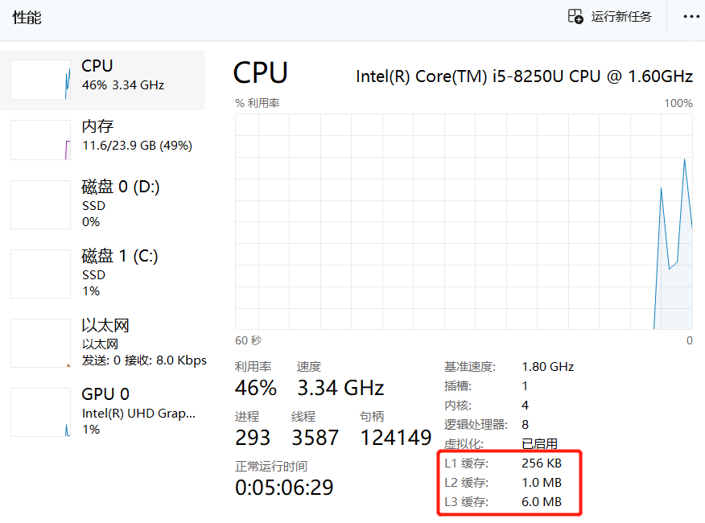</div>

## 虚拟存储器

虚拟存储器：在操作系统的管理下，只把当前需要的部分数据调入内存，暂不需要的部分留在辅存中。在用户看来，似乎获得了一个超大的主存（虚拟性）

虚拟存储器是一个逻辑模型  
功能：用户给出一个地址，叫做虚地址或者逻辑地址，虚拟存储器要给出该地址对应的数据  
实现：由辅助硬件将虚地址映射到主存当中的某个单元，主存单元地址称为实地址或物理地址

### 页式虚拟存储器

定义：以页为基本单位的虚拟存储器称为页式虚拟存储器

一个程序在逻辑上被分为若干大小相等的“页面”，“页面”大小与“主存块（Cache 块）”大小相同。每个页面可以离散地放入不同的主存块中。比如 4K 的程序，块的大小是 1K，那么该程序被分为 4 个“页”  
虚拟空间与主存空间都被划分成同样大小的页，主存的页称为实页，虚存的页称为虚页  
CPU 在执行的机器指令中，使用的是逻辑地址，因此需要通过“页表”将逻辑地址转为物理地址。页表的作用：记录了每个逻辑页面存放在哪个主存块中

逻辑地址 = 逻辑页号 + 页内地址（虚地址 = 虚页号 + 页内地址）  
物理地址 = 主存块号 + 页内地址（实地址 = 实页号 + 页内地址）

如：取变量 x 至 ACC 寄存器，机器指令是`000001 0010000000011`，则 x 的逻辑地址是 `001000000011`（一个程序的地址从 0 开始，实际上就是逻辑地址）

操作系统将 4k 程序放入主存块中，并在页表建立对应关系，如下图知变量 x 的物理地址是：`000000000010 1000000011`

<div align="left">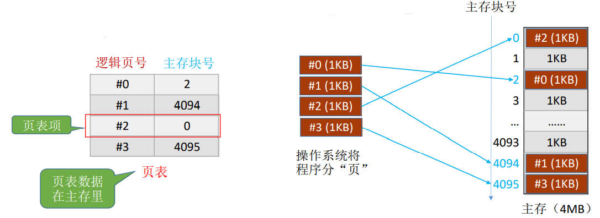</div>  
<div align="left"></div>

由于页表（也称慢表）是存储在主存中的，每次查询慢表相当于一次访存，于是引入快表 TLB，快表是一种“相联存储器”，可以按内容寻访  
快表中存储的是页表项的副本，类比 Cache 中存储的是主存块的副本

<div align="left">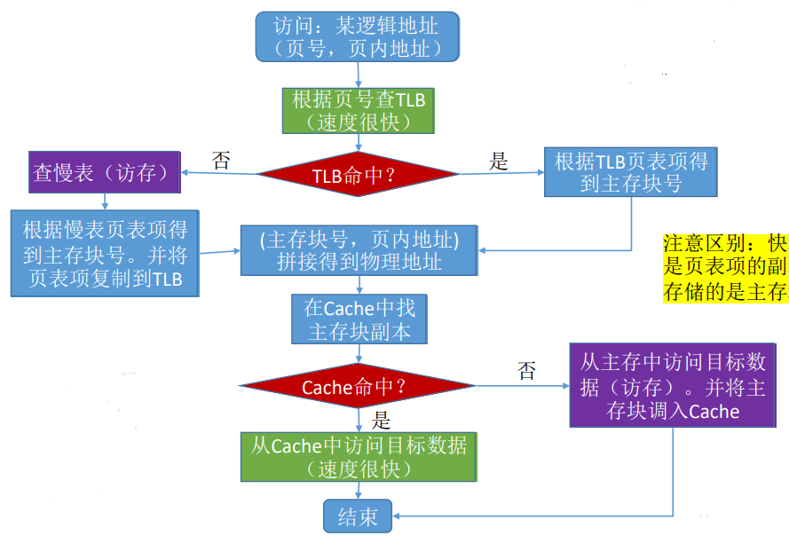</div>

<div align="left">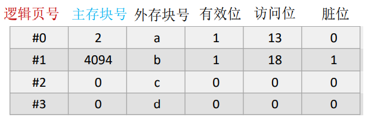</div>

有效位：这个页面是否已调入主存  
访问位：用于“页面置换算法”，比如，可以用来统计这个页面被访问过多少次  
脏位：这个页面是否被修改过

优缺点：

- 优点：页面长度固定，调入方便
- 缺点：零头浪费，对页的处理、保护、共享不是特别方便

### 段式虚拟存储器

段式虚拟存储器中的段是按程序的逻辑结构划分的，各个段的长度因程序而异变（如#0 段自己代码，#1 段是库函数代码）  
虚拟地址分为：段号+段内地址  
段表：每一行记录了某个段对应的段号、装入为、段起点和段长等信息。由于段的长度可变，所以段表中要给出隔断的起始地址与段的长度

优缺点：

- 优点：段分界与程序分界相对应，易于编译
- 缺点：段长分配不变，存在段间碎片

### 段页式虚拟存储器

把程序按逻辑结构分段，每段再划分为固定大小的页，段长必须是页的整数倍  
程序对主存的调入、调出仍以页为基本传送单位。每个程序对应一个段表，每段对应一个页表  
虚拟地址：段号+段内页号+页内地址

优缺点：

- 优点：可以按段实现共享和保护，同时也有着页的调用方便
- 缺点：地址变化需要两次查表，开销较大

**小结：**

主存-辅存：实现虚拟存储系统，解决了主存容量不够问题。由操作系统决定，哪些页面调入主存  
Cache-主存：解决了主存与 CPU 速度不匹配问题。由硬件决定，哪些主存块调入 Cache
