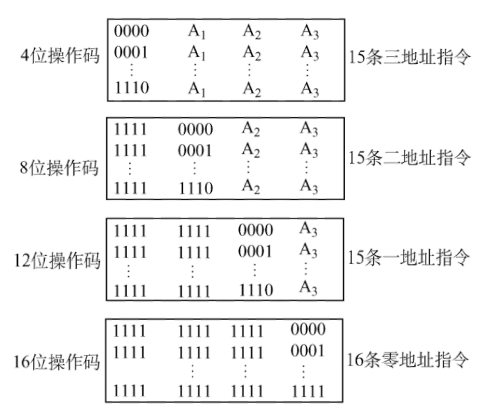

# 指令系统

**概览：**

**[:question: 指令格式](#指令格式)**  
**[:question: 指令寻址方式](#指令寻址方式)**  
**[:question: CISC 和 RISC 概念](#cisc-和-risc-概念)**

## 指令格式

### 基本概念

指令：又称机器指令，是指计算机执行某种操作的命令，是计算机运行的最小功能单位（一组有意义的二进制代码）。一台计算机的所有指令的集合构成该机的指令系统，也称为指令集  
如：x86 指令集、ARM 指令集

指令字长：一条指令的总长度（一般取字节的整数倍）  
机器字长：CPU 进行一次整数运算所能处理的二进制数据的位数（通常和 ALU 直接相关）  
存储字长：一个存储单元中的二进制代码位数（通常和 MDR 位数相同）

- 半字长指令：指令字长等于半个机器字长
- 单字长指令：指令字长等于机器字长
- 双字长指令：指令字长等于两倍机器字长

指令字长会影响取指令所需时间。如：机器字长=存储字长=16bit，则取一条双字长指令需要两次访存

### 指令的基本格式

基本格式 = 操作码（OP） + 地址码（A）  
操作码：指出指令中应该执行什么性质的操作和具有何种功能  
地址码：给出被操作的信息（指令或数据）的地址

### 指令的分类

#### 按指令长度

- 定长指令字结构：指令系统中所有指令的长度都相等  
- 变长指令字结构：指令系统中各种指令的长度不等

#### 按地址数目

| 
分类 | 
指令格式 | 说明                                                                                                                                                                                                                                                                                                                        |
| ---------------------------- | -------------------------------- | --------------------------------------------------------------------------------------------------------------------------------------------------------------------------------------------------------------------------------------------------------------------------------------------------------------------------- |
| 四地址指令                   | OP+A1+A2+A3+A4                   | (A1)OP(A2)->A3   OP、A1、A2、A3 与三地址指令含义一样，A4 是下一条要执行指令的地址   完成一条指令需要 4 次访存：取指->读 A1->读 A2->写 A3                                                                                                                                                                              |
| 三地址指令                   | OP+A1+A2+A3                      | (A1)OP(A2)->A3   `A1：目的操作数`   `A2：源操作数`   `A3：结果`  常用于需要两个操作数的算数运算、逻辑运算相关指令   完成一条指令需要 4 次访存：取指->读 A1->读 A2->写 A3                                                                                                                                     |
| 二地址指令                   | OP+A1+A2                         | (A1)OP(A2)->A1   `A1：目的操作数`   `A2：源操作数`   常用于需要两个操作数的算数运算、逻辑运算相关指令   完成一条指令需 4 次访存：取指->读 A1->读 A2->写 A1                                                                                                                                                      |
| 一地址指令                   | OP+A1                            | 1. OP(A1) -> A1  只需要单操作数，如加 1、减 1、取反、求补等   完成一条指令需三次访存：取指->读 A1->对 A1 进行 OP 操作后写回 A1    2.(ACC)OP(A1) -> ACC  需要两个操作数，但其中一个操作数隐含在某个寄存器（如 ACC）中 完成一条指令需要两次访存：取值->读 A1 （A1 和内容与 ACC 内容进行 OP 操作后写回 ACC） |
| 零地址指令                   | OP                               | 1. 不需要操作数，如空操作、停机、关中断等指令   2. 零地址的运算类指令仅使用在堆栈计算机中，如数据结构中的“后缀表达式”                                                                                                                                                                                                    |

#### 按操作码长度

| 分类         | 含义                                                         | 优缺点                                                                                                                 |
| ------------ | ------------------------------------------------------------ | ---------------------------------------------------------------------------------------------------------------------- |
| 定长操作码   | 指令系统中所有指令的操作码长度都相同，n 位有$2^n$条指令      | 对于简化计算机硬件设计，提高指令译码和识别速度很有利   指令属性增加时会占用更多固定位，留给表示操作数地址的位数受限 |
| 可变长操作码 | 指令的操作码字段的位数不固定，且分散地放在指令字的不同位置上 | 虽然丰富了指令的种类，但是增加了指令译码和分析难度，控制器设计变得复杂                                                 |

##### 扩展操作码

最常见的变长操作码是扩展操作码，使操作码的长度随地址码的减少而增加，不同地址数的指令可以具有不同长度的操作码，从而在满足需要的前提下，有效地缩短指令字长

扩展操作码指令格式 = 定长指令字结构 + 可变长操作码

> 举例：指令字长为 16 位，每个地址码占 4 位，前 4 位为基本操作字段 OP，另有 3 个 4 位长的地址字段 A1、A2 和 A3
>
> - 4 位基本操作码若全部用于三地址指令，则有 16 条，但至少必须将 1111 留作扩展操作码之用，即三地址指令为 15 条
> - 再将 1111 1111 留作扩展操作，二地址指令为 15 条
> - 再将 1111 1111 1111 留作扩展操作码之用，一地址指令为 15 条
> - 最后 零地址指令为 16 条
>
> 

> 注：1111只是例子使用的，也可换成其他编码（如0001等）作为扩展的标记

在设计扩展操作吗指令格式时，必须注意一下两点：

1. 不允许短码是长码的前缀，即短操作码不能与长操作码的前面部分代码相同
2. 各指令的操作码一定不能重复

通常情况下，对使用频率较高的指令，分配较短的操作码；对使用频率较低的指令，分配较长的操作码，从而尽可能减少指令译码和分析的时间

#### 按操作类型

| 操作类型               | 举例                                                                                                                                |
| ---------------------- | ----------------------------------------------------------------------------------------------------------------------------------- |
| 数据传送               | 1. LOAD 指令：把存储器中的数据放到寄存器中   2. STORE 指令：把寄存器中的数据放到存储器中                                         |
| 算术逻辑操作（运算类） | 算数：加、减、乘、除、增 1、减 1、求补、浮点运算、十进制运算   逻辑：与、或、非、异或、位操作、位测试、位清除、位求反            |
| 移位操作               | 算术移位、逻辑移位、循环移位（带进位和不带进位）                                                                                    |
| 转移操作               | 无条件转移 JMP   条件转移 JZ：结果为 0；JO：结果溢出；JC：结果有进位   调用和返回：CALL 和 RETURN   陷阱（Trap）与陷阱指令 |
| 输入输出操作           | CPU 寄存器与 IO 端口之间的数据传送（端口即 IPO 接口中的寄存器）                                                                     |

## 指令寻址方式

指令寻址方式分为指令寻址和数据寻址

### 指令寻址

指令寻址：确定下一条要执行的指令的存放地址。由程序计数器 PC 指明

指令寻址分为顺序寻址和跳跃寻址

- 顺序寻址：PC = PC + 1，此处 1 理解为一个指令字长。每次取指令结束后，一定会 PC + 1
- 跳跃寻址：执行转移类指令导致的 PC 值改变

### 数据寻址

数据寻址：在指令中表示一个操作数的地址，结构：操作码 + 寻址特征 + 形式地址 A（一地址指令结构）  
通过寻址特征和形式地址 A 求出操作数的真实地址（也叫有效地址 EA）

| 
 寻址方式 | 原理                                                                                                                                                                                                                                                               | 特点                                                                                                                                                                                                                                                                                                                                                                                                                                           |
| ---------------------------------- | ------------------------------------------------------------------------------------------------------------------------------------------------------------------------------------------------------------------------------------------------------------------ | ---------------------------------------------------------------------------------------------------------------------------------------------------------------------------------------------------------------------------------------------------------------------------------------------------------------------------------------------------------------------------------------------------------------------------------------------- |
| 直接寻址                           | 指令中的形式地址 A 就是操作数的真实地址 EA，即 EA = A   一条指令执行需访存 2 次：取指 + 执行（读 A）                                                                                                                                                            | 优点：简单，指令执行阶段仅访问一次主存，不需要专门计算操作数的地址   缺点：A 的位数决定了该指令操作数的寻址范围。操作数的地址不易修改                                                                                                                                                                                                                                                                                                       |
| 间接寻址                           | 指令的地址字段给出的形式地址不是操作数的真正地址，而是操作数有效地址所在的存储单元的地址，也就是操作数地址的地址，即 EA=(A)   间接寻址可以有一次间址，也可以有多次间址                                                                                       | 优点：可扩大寻址范围（有效地址 EA 的位数大于形式地址 A 的位数）。便于程序编制（用间接寻址可以方便地完成子程序返回   缺点：指令在执行阶段要多次访存（一次间址需要两次访存，多次间址需根据存储字地最高位确定几次访存）                                                                                                                                                                                                                        |
| 寄存器寻址                         | 在指令字中直接给出操作数所在地寄存器编号，即 EA = R，其操作数在由 R 所指的寄存器内   一条指令执行需访存 1 次：取指                                                                                                                                              | 优点：指令在执行阶段不访问主存，只访问寄存器。指令字短且执行速度快，支持向量/矩阵运算  缺点：寄存器价格昂贵，计算机中寄存器个数有限                                                                                                                                                                                                                                                                                                         |
| 寄存器间接寻址                     | 寄存器 R 中给出的不是一个操作数，而是操作数所在的主存单元地址，即 EA = (R)   一条指令执行需访存 2 次：取指 + 取(R 所在主存地址)                                                                                                                                 | 优点：与一般间接寻址相比速度更快   缺点：指令的执行阶段需要访问主存（因为操作数在主存中）                                                                                                                                                                                                                                                                                                                                                   |
| 隐含寻址                           | 不是明显地给出操作数的地址，而是在指令中隐含着操作数的地址                                                                                                                                                                                                         | 优点：有利于缩短指令字长   缺点：需增加存储操作数或隐含地址的硬件                                                                                                                                                                                                                                                                                                                                                                           |
| 立即寻址                           | 形式地址 A 就是操作数本身，又称为立即数，一般采用补码形式                                                                                                                                                                                                          | 优点：指令执行阶段不访问主存，指令执行时间最短   缺点：A 的位数限制了立即数的范围，如 A 的位数为 n，且立即数采用补码时，可表示的数据范围为$-2^{n-1} ~ 2^{n-1}-1$                                                                                                                                                                                                                                                                            |
| 基址寻址                           | 以程序的起始存放地址作为“起点”   将 CPU 中基址寄存器（BR）的内容加上指令格式中形式地址 A，而形成操作数的有效地址，即 EA=(BR)+A   1. 采用专用寄存器 BR 作为基址寄存器   2. 采用通用寄存器作为基址寄存器，需要在指令中指定要将哪个通用寄存器作为基址寄存器使用，结构：操作码 + 寻址特征 + R + A | 优点：可扩大寻址范围（基址寄存器的位数大于形式地址 A 的位数）；用户不必考虑自己的程序存于内存的哪一块空间区域，故有利于多道程序设计，以及可用于编制浮动程序（整个程序在内存里边的浮动）  注：基址寄存器是面向操作系统的，其内容由操作系统或管理程序确定。在程序执行过程中，基址寄存器的内容不变（作为基地址），形式地址可变（作为偏移量）。当采用通用寄存器作为基址寄存器时，可由用户决定哪个寄存器作为基址寄存器，但其内容仍由操作系统确定 |
| 变址寻址                           | 程序员自己决定从哪里作为“起点”   有效地址 EA 等于指令字中的形式地址 A 与变址寄存器 IX 的内容相加之和，即 EA=(IX)+A，其中 IX 可为变址寄存器（专用），也可用通用寄存器作为变址寄存器                                                                                                                  | 变址寄存器是面向用户的，在程序执行过程中，变址寄存器的内容可由用户改变，IX 作为偏移量，形式地址 A 不变（作为基地址）  优点：在数组处理过程中，可设定 A 为数组的首地址，不断改变变址寄存器 IX 的内容，便可很容易形成数组中任一数据的地址，特别适合编址循环程序                                                                                                                                                                               |
| 相对寻址                           | 以程序计数器PC所指的地址作为“起点”   把 PC 的内容加上指令格式中的形式地址 A 而形成操作数的有效地址，即 EA=(PC)+A，其中 A 是相对 PC 所指地址的位移量，可正可负，用补码表示                                                                                                                               | 优点：操作数的地址不是固定的，它随着 PC 值得变化而变化，并且与指令地址之间总是相差一个固定值，因此便于程序浮动（一段代码在程序内部的浮动）。广泛用于转移指令  注意：取出当前指令后，PC 会指向下一条指令，相对寻址是相对于下一条指令的偏移                                                                                                                                                                                                                               |
| 堆栈寻址                           | 操作数存放在堆栈中，隐含使用堆栈指针 SP 作为操作数地址   堆栈是存储器（或专用寄存器组）中一块特定的 LIFO 管理存储区，该存储区中被读/写单元的地址是用一个特定的寄存器给出的，该寄存器称为堆栈指针 SP                                                             |

## CISC 和 RISC 概念

CISC：Complex Instruction Set Computer  
RISC：Reduced Instruction Set Computer

| 类别                 | CISC                                                                                                                                                            | RISC                                                                                                                      |
| -------------------- | --------------------------------------------------------------------------------------------------------------------------------------------------------------- | ------------------------------------------------------------------------------------------------------------------------- |
| 设计思路         | 一条指令完成一个复杂的基本功能  比如说实现整数、矩阵的加减乘运算的指令集，除了提供整数的加减乘指令之外，还提供矩阵的加法指令、矩阵的减法指令、矩阵的乘法指令 | 一条指令完成一个基本“动作”；多条指令组合完成一个复杂的基本功能  如只需提供整数的加减乘运算，矩阵的加减乘通过组合来完成 |
| 指令系统         | 复杂、庞大                                                                                                                                                      | 简单、精简                                                                                                                |
| 指令数目         | 一般大于 200 条                                                                                                                                                 | 一般小于 100 条                                                                                                           |
| 指令字长         | 不固定                                                                                                                                                          | 定长                                                                                                                      |
| 可访存指令       | 不加限制                                                                                                                                                        | 只有 LOAD/STORE 指令                                                                                                      |
| 各种指令执行时间 | 相差较大                                                                                                                                                        | 绝大多数在一个周期内完成                                                                                                  |
| 各种指令使用频度 | 相差较大                                                                                                                                                        | 都比较常用                                                                                                                |
| 通用寄存器数量   | 较少                                                                                                                                                            | 多                                                                                                                        |
| 目标代码         | 难以用优化编译生成高效的目标代码程序                                                                                                                            | 采用优化编译的程序，生成代码较为高效                                                                                      |
| 控制方式         | 绝大多数为微程序控制                                                                                                                                            | 绝大多数为组合逻辑控制                                                                                                    |
| 指令流水线       | 可以通过一定方式实现                                                                                                                                            | 必须实现                                                                                                                  |
| 代表架构         | x86                                                                                                                                                             | ARM                                                                                                                       |
