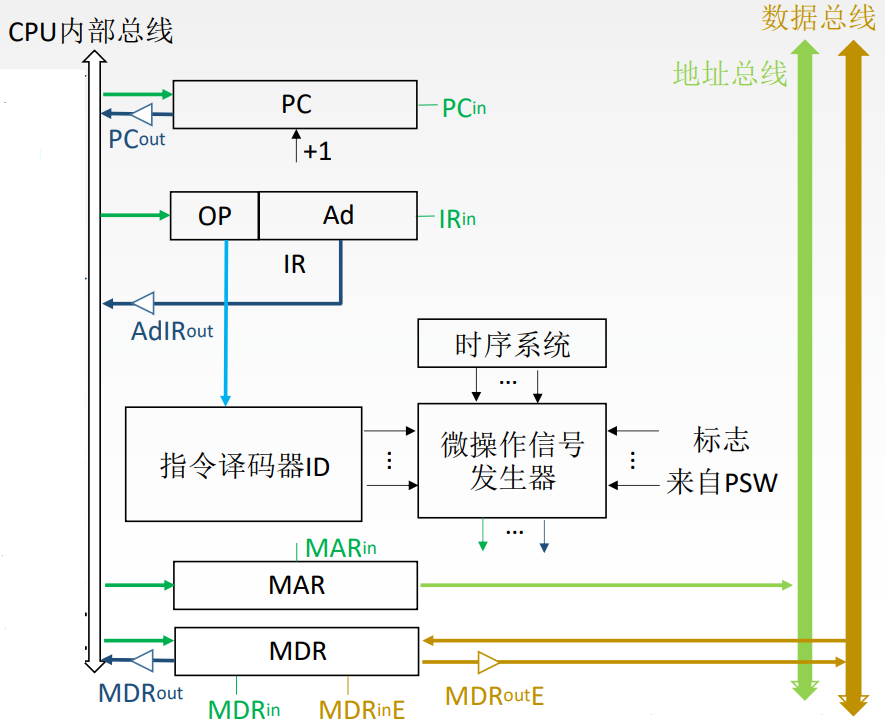
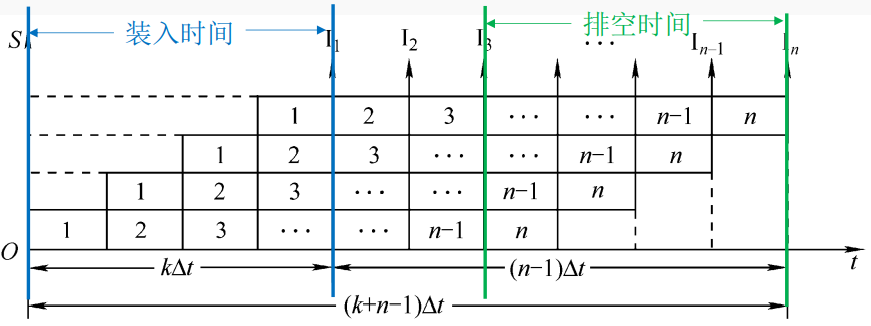

# 中央处理器

**概览：**

**[:question: CPU 的功能和结构](#cpu-的功能和结构)**  
**[:question: 指令执行过程](#指令执行过程)**  
**[:question: 数据通路的功能和基本结构](#数据通路的功能和基本结构)**  
**[:question: 控制器的功能和工作原理](#控制器的功能和工作原理)**  
**[:question: 指令流水线](#指令流水线)**

## CPU 的功能和结构

CPU 主要是由运算器和控制器组成

CPU 的功能：

- 指令控制：完成取指令、分析指令和执行指令的操作，即程序的顺序控制
- 操作控制：一条指令的功能往往是由若干操作信号的组合来实现的。CPU 管理并产生由内存取出的每条指令的操作信号，把各种操作信号送往相应的部件，从而控制这些部件按指令的要求进行动作
- 时间控制：对各种操作加以时间上的控制。时间控制要为每条指令按时间顺序提供应有的控制信号
- 数据加工：对数据进行算数和逻辑运算
- 中断处理：对计算机运行过程中出现的异常情况和特殊请求进行处理

运算器的功能：对数据进行加工

控制器的功能：协调并控制计算机各部件执行程序的指令序列，基本功能包括取指令、分析指令、执行指令

- 取指令：自动形成指令地址；自动发出取指令的命令
- 分析指令：操作码译码（分析本条指令要完成什么操作）；产生操作数的有效地址
- 执行指令：根据分析指令得到得“操作命令”和“操作数地址”，形成操作信号控制序列，控制运算器、存储器以及 IO 设备完成相应的操作
- 中断处理：管理总线以及输入输出；处理异常情况（如掉电）和特殊请求（如打印机请求打印一行字符）

### 运算器的基本结构

1. 算数逻辑单元 ALU：主要功能是进行算术/逻辑运算
2. 通用寄存器组：如 AX、BX、CX、DX、SP 等，用于存放操作数（包括源操作数、目的操作数及中间结果）和各种地址信息等。SP 是堆栈指针，用于指示栈顶的地址
3. 暂存寄存器：用于暂存从主存读来的数据，这个数据不能存放在通用寄存器中，否则会破坏其原有内容
4. 累加寄存器（ACC）：它是一个通用寄存器，用于暂时存放 ALU 运算结果信息，用于实现加法运算
5. 程序状态字寄存器（PSW）：保留由算术逻辑运算指令或测试指令的结果而建立的各种状态信息，如溢出标志（OP）、符号标志（SF）、零标志（ZF）、进位标志（CF）等。PSW 种这些位参与并决定微操作的形成
6. 移位器：对运算结果进行移位运算
7. 计数器：控制乘除运算的操作步数

那么 ALU 和寄存器组是怎么连接的？  
现在采用的是 CPU 内部单总线方式：将所有寄存器的输入端和输出端都连到一条公共的通路上

<div align="left"></div>

### 控制器的基本结构

1. 程序计数器 PC：用于指出下一条指令在主存中存放地址。CPU 就是根据 PC 的内容去主存中取指令的。因程序中指令（通常是顺序执行的），所以 PC 有自增功能
2. 指令寄存器 IR：用于保存当前正在执行的那条指令
3. 指令译码器：仅对操作码仅对操作码字段进行译码，向控制器提供特定的操作信号
4. 微操做信号发生器：根据 IR 的内容，PSW 的内容以及时序信号，产生控制整个计算机系统所需的各种控制信号，其结构有组合逻辑型和存储逻辑型两种
5. 时序系统：用于产生各种时序信号，它们都是由统一时钟（CLOCK）分频得到的
6. 存储器地址寄存器（MAR）：用于存放所要访问的主存单元
7. 存储器数据寄存器（MDR）：用于存放向主存写入的信息或从主存中读出的信息

<div align="left"></div>

### CPU 的基本结构

CPU 的基本结构大致可划分为四大部分：ALU、寄存器、中断系统、CU

<div align="left"></div>

用户可见的寄存器：通用寄存器组、程序状态字寄存器 PSW、程序计数器 PC  
用户不可见的寄存器：MAR、MDR、IR、暂存寄存器

## 指令执行过程

指令周期：CPU 从主存中每取出并执行一条指令所需的全部时间  
指令周期常常用若干机器周期来表示，机器周期又叫 CPU 周期。一个周期又包含若干时钟周期（也称为节拍、T 周期或 CPU 时钟周期，它是 CPU 操作的最基本单位）

<div align="left"></div>

每个指令周期内周期数可以不等，每个机器周期内的节拍数也可以不等，比如：

- 空指令 NOP：指令周期 = 取指周期
- 加法指令 ADD：指令周期 = 取指周期 + 执行周期
- 乘法指令：指令周期 = 取指周期 + 执行周期（乘法指令执行周期较长）
- 具有间接寻址的指令：指令周期 = 取指周期 + 间址周期 + 执行周期
- 带有中断周期的指令：指令周期 = 取指周期 + 间址周期 + 执行周期 + 中断周期

### 指令周期流程

指令周期主要分为：取指周期、间址周期、执行周期、中断周期

<div align="left"></div>

中断：暂停当前任务去完成其他任务。为了能够恢复当前任务，需要保存断点。一般使用堆栈来保存断点，这里用 SP 表示栈顶地址，假设 SP 指向栈顶元素，进栈操作是先修改指针，后存入数据

| <div style="width:70px"> 指令周期 | 功能         | 数据流                                                                                                                                                                                                                                                                                                                                               |
| --------------------------------- | ------------ | ---------------------------------------------------------------------------------------------------------------------------------------------------------------------------------------------------------------------------------------------------------------------------------------------------------------------------------------------------- |
| 取指周期                          | 取指令       | 1. 当前指令地址送至存储器地址寄存器，记做：(PC) -> MAR <br> 2. CU 发出控制信号，经控制总线传到主存，这里是发出读信号，记做：1 -> R <br> 3. 将 MAR 所指主存中的内容经数据总线送入 MDR，记做：M(MAR) -> MDR <br> 4. 将 MDR 中的内容（此时是指令）送入 IR，记做：(MDR) -> IR <br> 5. CU 发出控制信号，形成下一条指令地址，记做：(PC) + 1 -> PC          |
| 间址周期                          | 取有效地址   | 1. 将指令的地址码送入 MAR，记做 Ad(IR) -> MAR 或 Ad(MDR) -> MAR <br> 2. CU 发出控制信号，启动主存做读操作，记做：1->R <br> 3. 将 MAR 所指主存中的内容经数据总线送入 MDR，记做：M(MAR) -> MDR <br>4. 将有效地址送至指令的地址码字段，记做：(MDR) -> Ad(IR)                                                                                            |
| 执行周期                          | 取操作数     | 执行周期的任务是根据 IR 中的指令字的操作码和操作数通过 ALU 操作产生执行结果。不同指令的执行周期操作不同，因此没有统一的数据流向                                                                                                                                                                                                                      |
| 中断周期                          | 保存程序断点 | 1. CU 控制 SP 减 1，修改后的地址送入 MAR，记做：(SP)-1 -> SP，(SP) -> MAR。本质上是将断点存入某个存储单元，假设其地址为 a，故可记做：a -> MAR <br> 2. CU 发出控制信号，启动主存做写操作，记做：1 -> W <br> 3. 将断点（PC 内容）送入 MDR，记做：(PC) -> MDR 4. CU 控制将终端服务程序的入口地址（由向量地址形成部件产生）送入 PC，记做：向量地址 -> PC |

### 指令执行方案

一个指令周期通常要包括几个时间段（执行步骤），每个步骤完成指令的一部分功能，几个一次执行的步骤完成这条指令的全部功能

| 方案       | 说明                                                                                                                                                                                                     |
| ---------- | -------------------------------------------------------------------------------------------------------------------------------------------------------------------------------------------------------- |
| 单指令周期 | 对所有指令都选用相同的执行时间来完成 <br> 指令之间串行执行，指令周期取决于执行时间最长的指令的执行时间 <br> 对于那些本来可以在更短时间内完成的指令，要使用这个较长的周期来完成，会降低整个系统的运行速度 |
| 多指令周期 | 对不同类型的指令选用不同的执行步骤来完成 <br> 指令之间串行执行，可选用不同个数的时钟周期来完成不同指令的执行过程 <br> 需要更复杂的硬件设计                                                               |
| 流水线     | 在每一个时钟周期启动一条指令，尽量让多条指令同时运行，但各自处在不同的执行步骤中 <br> 指令之间并行执行                                                                                                   |

## 数据通路的功能和基本结构

数据通路是数据在功能部件之间传送的路径。其功能是实现 CPU 内部的运算器与寄存器之间的数据交换

数据通路的基本结构有以下三种：

- CPU 内部单总线方式
- CPU 内部多总线方式
- 专用数据通路方式

内部总线：是值指同一部件，如 CPU 内部连接各寄存器及运算部件之间的总线  
系统总线：是值同一台计算机系统的各部件，如 CPU、内存、通道和各类 I/O 接口之间互相连接的总线

### CPU 内部单总线方式

将所有寄存器的输入输出端连接在同一条公共通路上

<div align="left"></div>

1. 寄存器之间数据传送  
   比如把 PC 内容送至 MAR，实现传送操作的流程和控制信号为：  
   (PC) -> Bus，PCout 有效，PC 内容送至总线  
   Bus -> MAR，MARin 有效，总线内容送 MAR
2. 主存与 CPU 之间的数据传送  
   比如 CPU 从主存读取指令，实现传送操作的流程和控制信号为：  
   (PC) -> Bus -> MAR，PCout 和 MARin 有效，现行指令地址 -> MAR  
   1 -> R，CU 发出读命令（通过控制总线发出）  
   MEM(MAR) -> MDR，MDRin 有效  
   MDR -> Bus -> IR，MDRout 和 IRin 有效，现行指令 -> IR
3. 执行算数逻辑运算  
   比如一条加法指令，微操作序列以及控制信号为：  
   Ad(IR) -> Bus -> MAR，MDRout 和 MARin 有效  
   1 -> R，CU 发出读命令  
   MEM(MAR) -> MDR，MDRin 有效  
   MDR -> Bus -> Y，MDRout 和 Yin 有效，操作数 -> Y  
   (ACC) + (Y) -> Z，ACCout 和 ALUin 有效，CU 向 ALU 发出加命令  
   Z -> ACC，Zout 和 ACCin 有效，结果 -> ACC

优缺点：

- 优点：结构简单
- 缺点：存在冲突现象，性能较低

### CPU 内部多总线方式

将所有的寄存器的输入输出端连接在多个公共通路上

优缺点：

- 优点：执行效率高
- 缺点：实现复杂

### 专用数据通路方式

减少使用共享线路，专线专用

优缺点：

- 优点：性能高
- 缺点：实现复杂，硬件量大

## 控制器的功能和工作原理

### 控制器的结构和功能

<div align="left"></div>

#### 结构

- 运算器部件通过数据总线与内存储器、输入设备和输出设备传送数据
- 输入、输出设备通过接口电路与总线相连
- 内存储器、输入设备和输出设备从地址总线接收地址信号，从控制总线得到控制信号，数据总线与其他部件传送数据

#### 功能

- 主存中取出指令，产生下一条指令在主存中的地址
- 对指令进行译码或测试，产生相应的操作控制信号，以便启动规定的动作
- 指挥并控制 CPU、主存、输入和输出设备之间的数据流动方向

### 控制器分类

根据产生微操做信号的方式不同，存在硬布线控制器和微程序控制器

几个基本概念：

- 微操作：完成一条机器指令是通过完成一个微操作序列实现的，这些微操作是计算机中最基本、不可再分解的操作。比如取指周期中，将程序计数器 PC 的内容送入 MAR：(PC)->MAR
- 微命令：微命令是微操作的控制信号，每一个微操作都需要在对应的微命令控制下完成。所以微命令和微操作是一一对应的
- 指令：是对程序执行步骤的描述
- 微指令：是对指令执行步骤的描述。指令是微指令功能的封装。微指令是若干微命令的集合，一条微指令信息通常至少包含两大部分信息：

  - 操作控制字段：该字段显示了这条微指令是由哪些微命令构成的
  - 顺序控制字段：用于控制产生下一条将要执行的微命令的地址

  微命令又分为：

  - 相容性微命令：可以并行完成的微命令
  - 互斥性微命令：不允许并行完成的微命令

- 程序：由指令序列组成
- 微程序：由微指令序列组成，每一种指令对应一个微程序，一条机器指令的功能由一段微程序实现

```txt
例如：
一条指令A中的取指周期：
T0: 微操作1、微操作2
T1: 微操作3
T2: 微操作4
生成微指令：
微指令a: 完成微操作1、2
微指令b: 完成微操作3
微指令c: 完成微操作4

继续完善间址周期、执行周期、中断周期后，一共产生了n条微指令。那么指令A就对应一个微程序
```

#### 硬布线控制器

工作原理：微操作控制信号由组合逻辑电路根据当前的指令码、状态和时序即时产生

##### 控制单元 CU 信号来源

- 指令译码器产生的信息
- 时序系统产生的机器周期信号和节拍信号
- 来自执行单元的反馈标志
- 来自系统总线的控制信号：中断请求、DMA 请求

##### 硬布线控制器的时序系统及微操作

- 时钟周期：用时钟信号控制节拍发生器，每个节拍内机器可以完成一个或几个需要同时执行的操作
- 机器周期：机器周期可视为所有指令执行过程中的一个基准时间  
  通常我们以存取周期作为基准时间，即从内存中读取一个指令字的最短时间作为机器周期  
  在存储字长等于指令字长的前提下，取指周期可以作为机器周期
- 指令周期：取指周期、间址周期、执行周期、中断周期
- 微操作命令分析：控制单元发出各种操作序列，这些命令必须按照一定的次序才使得机器有序的工作

##### CPU 控制方式

1. 同步控制方式  
   整个系统所有的控制信号均来自一个统一的时钟信号  
   同步控制方式的优点是控制电路简单，缺点是运行速度慢
2. 异步控制方式  
   异步控制方式不存在基准时钟信号  
   各部件按自身固有的速度工作，通过应答方式进行联络  
   异步控制方式的优点是运行速度快，缺点是控制电路比较复杂
3. 联合控制方式
   对各种不同的指令的微操作实行大部分采用同步控制、小部分采用异步控制的办法

##### 硬布线控制器设计步骤

1. 分析每个阶段的微操作序列
2. 选择 CPU 的控制方式
3. 安排微操作时序
4. 电路设计

##### 优缺点和应用

- 优点：速度快
- 缺点：不够灵活
- 应用：RISC CPU

#### 微程序控制器

工作原理：事先把微操作信号存储在一个专门的存储器（控制存储器）中，将每一条机器指令编写成一个微程序，这些微程序可以存到一个控制存贮器中，用寻址用户程序机器指令的办法来寻址每个为程序中的微指令

##### 基本结构

<div align="left"></div>

##### 微指令格式

- 水平型微指令：一条微指令能定义多个可并行的微命令  
  基本格式：操作控制 + 顺序控制  
  优点：微程序短执行速度快  
  缺点：微指令长，编写微程序麻烦
- 垂直型微指令：一条微指令只能定义一个微命令，由操作码字段规定具体功能  
  基本格式：微操作码 uOP + 目的地址 Rd + 源地址 Rs  
  优点：微指令短、简单、规整，便于编写微程序  
  缺点：微程序长，执行速度慢，工作效率低
- 混合型微指令：在垂直型的基础上增加一些不太复杂的并行操作  
  优点：微指令较短，仍便于编写；微程序也不长，执行速度加快

##### 微指令编码方式

1. 直接编码方式  
   在微指令的操作控制字段中，每一位代表一个微操作命令。某位为 1 表示该控制信号有效  
   优点：简单、只管，执行速度快，操作并行好  
   缺点：微指令字长过长，n 个微命令就要求微指令的操作字段有 n 位，造成控存容量极大
   <div align="left"></div>
2. 字段直接编码方式  
   将微指令的控制字段分成若干“段”，每段经译码后发出控制信号  
   微命令字段分段的原则:

   - 互斥性微命令分在同一段内，相容性微命令分在不同段内
   - 每个小段中包含的信息位不能太多，否则将增加译码线路的复杂性和译码时间
   - 一般每个小段还要留出一个状态，表示本字段不发出任何微命令。因此，当某字段的长度为 3 时，最多只能表示 7 个互斥的微命令，通常用 000 表示不操作

   优点：可以缩短微指令字长  
   缺点：要通过译码电路后再发出微命令，因此比直接编码方式慢
   <div align="left"></div>

3. 字段间接编码方式  
   一个字段的某些微命令由另一个字段中的某些微命令来解释，由于不是靠字段直接译码发出的微命令，故称为字段间接编码或隐式编码  
   优点：可进一步缩短微指令字长  
   缺点：削弱了微指令的并行控制能力，故通常作为字段直接编码方式的一种辅助手段
   <div align="left"></div>

##### 微指令的地址形成方式

1. 由微指令的下地址字段指出  
   微指令格式中设置一个下地址字段，由微命令的下地址字段直接指出后继微指令的地址，这种方式也称为断定方式
2. 根据机器指令的操作码形成  
   当机器指令取至指令寄存器后，微指令的地址由操作码经微地址形成部件形成
3. 增量计数器法  
   (CMAR) + -> CMAR
4. 分支转移  
   结构：操作控制字段 + 转移方式 + 转移地址  
   转移方式：指明判别条件；转移地址：指明转移成功后的去向
5. 通过测试网络
6. 由硬件产生微程序入口地址  
   第一条微指令地址，由专门硬件产生（用专门的硬件记录取指周期微程序首地址）  
   中断周期，由硬件产生中断周期微程序首地址（用专门的硬件记录）

##### 微程序控制单元的设计

设计步骤：

1. 分析每个阶段的微操作序列
2. 写出对应机器指令的微操作命令及节拍安排
3. 确定微操作指令格式
4. 编码微指令码点

## 指令流水线

概念：把一个重复的过程分解成若干个子过程，每个子过程可以与其他子过程并行执行

### 指令流水

一条指令的执行过程可以分成多个阶段（或过程），一般情况下分为：取指、分析、执行三个阶段

设取指、分析、执行 3 个阶段的时间都相等，用 t 表示，按以下几种执行方式分析 n 条指令的执行时间：

1. 顺序执行方式
   <div align="left"></div>  
   传统冯诺曼机采用顺序执行方式，又称串行执行方式

   总耗时 T = n × 3t = 3nt  
   优点：控制简单、硬件代价小  
   缺点：执行指令的速度较慢，在任何时刻，处理机只有一条指令在执行，各功能部件的利用率很低

2. 一次重叠执行
   <div align="left"></div>

   总耗时 T = 3t + (n-1)×2t = (2n+1)t  
   优点：程序执行时间缩短了 1/3，各功能部件的利用率明显提高  
   缺点：需要付出硬件上较大开销的代价，控制过程也比顺序执行复杂了

3. 二次重叠执行
   <div align="left"></div>

   总耗时 T = 3t + (n-1)t = (n+2)t  
   优点：与顺序执行相比，指令的执行时间缩短近 2/3。这是一种理想的执行方式，正常情况下，处理机中同时有 3 条指令在执行  
   缺点：硬件开销更大了，控制过程更加复杂了

### 流水线的特点

- 一个任务分解成多个子任务
- 每个功能部件后面都要有一个缓冲寄存器（称为锁存器），其作用是保存本流水线段的执行结果，提供给下一流水段使用
- 流水线的各功能段的时间应尽量相等，否则将会堵塞、断流
- 流水线需要装入时间和排空时间
  - 装入时间：第一个任务进入流水线到输出流水线的时间
  - 排空时间：最后一个任务进入流水线到输出流水线的时间

### 流水线的性能指标

理想情况下，流水线的时空图如下：

<div align="left"></div>

一条指令的执行分为 k 个阶段，每个阶段耗时$\Delta t$，一般取$\Delta t$ = 一个时钟周期

#### 吞吐率

吞吐率是指在单位时间内流水线所完成的任务数量，或是输出结果的数量

设任务数为 n，处理完成 n 个任务所用时间为$T_k$，则计算流水线吞吐率 TP 的最基本公式是$TP=\frac{n}{T_k}$，其中$T_k = (k+n-1)\Delta t$，所以流水线吞吐率为$TP=\frac{n}{(k+n-1)\Delta t}$

#### 加速比

完成同样一批任务，不使用流水线所用的时间与使用流水线所用的时间之比

设$T_0$表示不使用流水线时的执行时间，即顺序执行所需时间；$T_k$表示使用流水线时的执行时间，则计算流水线的加速比 S 的基本公式为$S=\frac{T_0}{T_k}$。单独完成一个任务耗时$k\Delta t$，则顺序完成 n 个任务耗时$T_0=nk\Delta t$。则加速比$S=\frac{kn\Delta t}{(k+n-1)\Delta t} = \frac{kn}{k+n-1}$

#### 效率

流水线设备利用率称为流水线的效率

在时空图上，流水线的效率定义为完成 n 个任务占用的时空区有效面积与 n 个任务所用的时间与 k 个流水线段所围成的时空区总面积之比。则流水线效率 E 的一般公式为 E = n 个任务占用 k 时空区有效面积 / n 个任务所用的时间与 k 个流水线段所围成的时空区总面积 = $\frac{T_0}{kT_k}$

### 影响流水线的因素

影响流水线的因素主要分为：结构相关（资源冲突）、数据相关（数据冲突）、控制相关（控制冲突）

#### 结构相关

由于多条指令在同一时刻争用同一资源而形成的冲突称为结构相关

解决方法：

1. 冲突的指令之间，插入暂停周期
2. 单独设置数据存储器和指令存储器，但是增加了资源消耗

#### 数据相关

数据相关指在一个程序中，存在必须等前一条指令执行完才能执行后一条指令的情况，则这两条指令即为数据相关

解决方法：

1. 把遇到数据相关的指令及其后续指令都暂停一至几个时钟周期，直到数据相关问题消失后再继续执行。可分为硬件阻塞（stall）和软件插入 NOP 指令两种方法
2. 数据旁路技术
3. 编译优化：通过编译器调整指令顺序来解决数据相关

#### 控制相关

当流水线遇到转移指令和其他改变 PC 指的指令而造成断流时，会引起控制相关

解决方法：

1. 尽早判别转移是否发生，尽早生成转移目标地址
2. 预取转移成功和不成功两个控制流方向上的目标指令
3. 加快和提前形成条件码
4. 提高转移方向的猜准率

### 流水线的分类

#### 按流水线使用级别

- 部件功能级流水线  
  将复杂的逻辑运算组成流水线的工作方式。例如，可将浮点加法操作分成求阶差、对阶、尾数相加以及结果规格化等 4 个子过程
- 处理机级流水线  
  把一条指令解释过程分成多个子过程。例如，分为取指、译码、执行、访存和写回 5 个子过程
- 处理机间流水线  
  是一种宏流水，其中每一个处理机完成某一专门任务，各个处理机所得到的结果需存放在与下一个处理机所共享的存储器中

#### 按功能分类

- 单功能流水线  
  只能实现一种固定的专门功能的流水线
- 多功能流水线  
  通过各段间的不同连接方式可以同时或不同时地实现多种功能地流水线

#### 按同一时间各段之间的连接方式

- 静态流水线  
  在同一时间内，流水线的各段只能按同一种功能的连接方式工作
- 动态流水线  
  在同一时间内，当某些段正在实现某种运算时，另一些段却正在进行另一种运算。这样对提高流水线的效率很有好处，但会使流水线控制变得很复杂

#### 按各个功能段之间是否有反馈信号

- 线性流水线  
  从输入到输出，每个功能段只允许经过一次，不存在反馈回路
- 非线性流水线  
  存在反馈回路，从输入到输出过程中，某些功能段将无数次通过流水线，这种流水线适合线性递归的运算

### 流水线的多发技术

#### 超标量技术

每个时钟周期内可并发多条独立指令，需要要配置多个功能部件

不能调整指令的执行顺序  
通过编译优化技术，把可并行执行的指令搭配起来

#### 超流水技术

在一个时钟周期内再分段，在一个时钟周期内一个功能部件使用多次

不能调整指令的执行顺序  
靠编译程序解决优化问题

#### 超长指令字

使用多个功能部件，利用编译程序挖掘出指令间的潜在并行性，将多条能并行操作的指令组成超长指令字（可达几百位）
