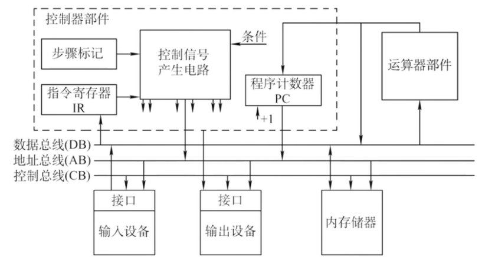
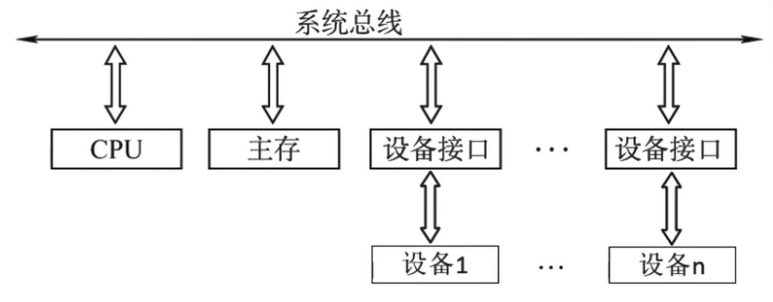
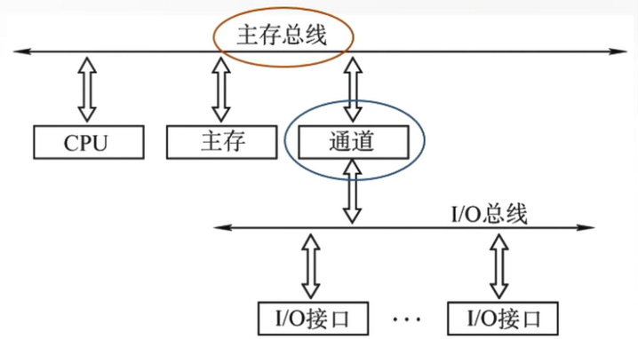
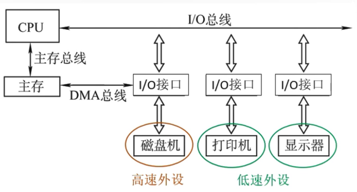
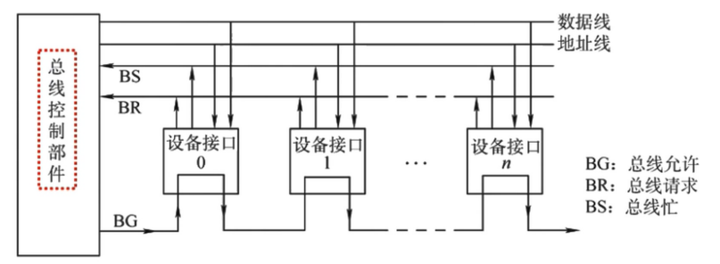
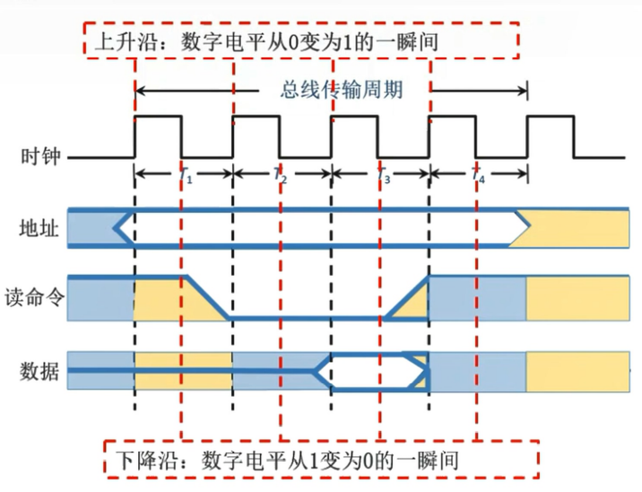

# 总线

**概览：**

**[:question: 总线概述](#总线概述)**  
**[:question: 总线仲裁](#总线仲裁)**  
**[:question: 总线操作与定时](#总线操作与定时)**  
**[:question: 总线标准](#总线标准)**

## 总线概述

总线是一组能为多个部件`分时共享`的公共信息传送路线  
共享：是指总线上可以挂接多个部件，各个部件之间相互交换的信息都可以通过这组线路分时共享  
分时：是指同一时刻只允许一个部件向总线发送信息，如果系统中有多个部件，则它们只能分时地向总线发送信息

为什么要用总线？  
早期计算机外部设备太少时大多采用分散连接方式，不易实现随时增减外部设备。为了更好地解决 I/O 设备和主机之间连接的灵活性问题，计算机的结构从分散连接发展为总线连接

### 总线的特性

1. 机器特性：尺寸、形状、管脚数、排列顺序
2. 电气特性：传输方向和有效的电平范围
3. 功能特性：每根传输线的功能（地址、数据、控制）
4. 时间特性：信号的时序关系

### 总线的分类

#### 按数据传输格式

| 分类     | 说明                                                               | 优点                                                                                   | 缺点                                                                                                                                                         |
| -------- | ------------------------------------------------------------------ | -------------------------------------------------------------------------------------- | ------------------------------------------------------------------------------------------------------------------------------------------------------------ |
| 串行总线 | 数据传送是一个 bit 一个 bit 传输                                   | 只需要一条传输线，成本低廉，广泛应用于长距离传输；应用于计算机内部时，可以节省布线空间 | 在数据发送和接收的时候要进行拆卸和装配，要考虑串行-并行转换的问题                                                                                            |
| 并行总线 | 数据同时传送 n 个 bit，比如传送 1011，有四根信号线时，一次传送即可 | 总线的逻辑时序比较简单，电路实现起来比较容易                                           | 信号线数量多，占用更多的布线空间；远距离传输成本高昂；由于工作频率较高时，并行的信号线之间会产生严重干扰，对每条线登场的要求也越高，所以无法持续提升工作频率 |

工作频率相同时，串行总线传输速度比并行总线慢  
并行总线的工作频率可以通过不断提高工作频率来提高传输速度，最终超过并行总线

#### 按总线功能分

| 分类     | 说明                                                                                                                                                                                                                                                                                                                                                                                                                                                                                          |
| -------- | --------------------------------------------------------------------------------------------------------------------------------------------------------------------------------------------------------------------------------------------------------------------------------------------------------------------------------------------------------------------------------------------------------------------------------------------------------------------------------------------- |
| 片内总线 | 片内总线是芯片内部的总线。它是 CPU 芯片内部寄存器与寄存器之间、寄存器与 ALU 之间的公共连线                                                                                                                                                                                                                                                                                                                                                                                                    |
| 系统总线 | 系统总线是计算机系统内各功能部件（CPU、主存、I/O 接口）之间相互连接的总线   按系统总线传输信息内容的不同，又可分为 3 类： **1. 数据总线**：用来传输个功能部件之间的数据信息，它是双向传输总线，其位数与机器字长、存储字长有关  **2. 地址总线**：用来指出数据总线上的源数据或目的数据所在的主存单元或 I/O 端口的地址，它是单向传输总线，地址总线的位熟与主存地址空间的大小有关  **3. 控制总线**：传送的是控制信息，包括 CPU 送出的控制命令和主存（或外设）返回 CPU 的反馈信号   |
| 通信总线 | 通信总线是用于计算机系统之间或计算机系统与其他系统（如远程通信设备、测试设备）之间信息传送的总线，通信总线也称为外部总线                                                                                                                                                                                                                                                                                                                                                                      |

### 系统总线结构

#### 单总线结构

- 结构：CPU、主存、IO 设备（通过 IO 接口）都连接在一组总线上，允许 IO 设备之间、IO 设备和 CPU 之间或 IO 设备与主存之间直接交换信息
- 优点：结构简单、成本低，易于接入新的设备
- 缺点：带宽低、负载重，多个不见只能争用唯一的总线，且不支持并发传送操作

_注：单总线并不是指只有一根信号线，系统总线按传送信息的不同可以分为地址总线、数据总线和控制总线_

#### 双总线结构

支持突发（猝发）传送：送出一个地址，收到多个地址连续的数据  
通道是具有特殊功能的处理器，能对 IO 设备进行统一管理。通道程序放在主存中

- 结构：双总线结构有两条总线，一条是主存总线，用于 CPU、主存和通道之间进行数据传送；另一条是 IO 总线，用于多个外部设备与通道之间进行数据传送
- 优点：将较低速的 IO 设备从单总线上分离出来，实现存储器总线和 IO 总线分离
- 缺点：需要增加通道等硬件设备

#### 三总线结构

DMA：Direct Memory Access，直接内存访问

- 结构：三总线结构是在计算系统各部件之间采用 3 条各自独立的总线来构成信息通路，这三条总线分别为主存总线、IO 总线和直接内存访问 DMA 总线
- 优点：提高了 IO 设备的性能，使其更快地响应命令，提高系统吞吐量
- 缺点：系统工作效率较低

### 总线的性能指标

#### 总线的传输周期（总线周期）

一次总线操作所需的时间（包括申请阶段、寻址阶段、传输阶段和结束阶段），通常由若干个总线时钟周期构成

#### 总线时钟周期

即机器的时钟周期。计算器有一个统一的时钟，以控制整个计算机的各个部件，总线也要受此时钟的控制

#### 总线的工作频率

总线上各种操作的频率，为总线周期的倒数  
若总线周期 = N 个时钟周期，则总线的工作频率 = 时钟频率/N  
实际上指一秒内传送几次数据

#### 总线的时钟频率

即机器的时钟频率，为时钟周期的倒数  
若时钟周期为 T，则时钟频率为 1/T  
实际上是指一秒内有多少个时钟周期

#### 总线的宽度

又称为总线位宽，它是总线上同时能够传输的数据位数，通常是指数据总线的根数，如 32 根称为 32 位总线

#### 总线带宽

总线的数据传输率，即单位时间内总线上可传输数据的位数，通常用每秒钟传送信息的字节数来衡量，单位可用字节/秒（B/s）表示  
总线带宽 = 总线工作频率 × 总线宽度（bit/s）= 总线宽度 / 总线周期（bit/s）

总线带宽是指总线本身所能达到的最高传输率。在计算实际的有效数据传输率时，要用实际传输的数据量除以耗时

工作频率相同时，串行总线传输速度比并行总线慢  
并行总线的工作频率无法持续提高（因为信号线之间会产生严重干扰），而串行总线可以通过不断提高工作频率来提高传输速度，最终超过并行总线

#### 总线复用

总线复用是指一种信号线在不同的时间传输不同的信息。可以使用较少的线传输更多的信息，从而节省了空间和成本

#### 信号线数

地址总线、数据总线和控制总线三种总线数的总和称为信号线数

## 总线仲裁

同一时刻只能有一个设备控制总线传输操作，可以有一个或多个设备从总线接收数据

将总线上所连接的各类设备按其对总线有无控制功能分为：

- 主设备：获得总线控制权的设备
- 从设备：被主设备访问的设备，只能响应从主设备发来的各种命令总线

定义：总线作为一种共享设备，不可避免地会出现同一时刻有多个主设备竞争设备控制权的问题。多个主设备同时竞争总线控制权时，以某种方式选择一个主设备优先获得总线控制权称为总线仲裁

总线总裁一般分为**集中仲裁方式**和**分布式仲裁方式**

### 集中仲裁方式

工作流程：

1. 主设备发出请求信号
2. 若多个主设备同时要使用总线，则由总线控制器的判优、仲裁逻辑按一定的优先等级顺序确定哪个主设备能使用总线
3. 获得总线使用权的主设备开始传送数据

确定主设备能使用总线的方式分为：**链式查询方式**、**计数器查询方式**、**独立请求方式**

#### 链式查询方式

“总线忙”信号的建立者是获得总线控制权的设备

链式查询就是控制器通过总线允许线逐一查询设备并确定设备是否能使用总线。这会导致离总线控制器越近的部件，其优先级越高；离总线控制器越远的部件，其优先级越低

优点：链式查询方式优先级固定。只需很少几根控制线就能按一定优先次序实现总线控制，结构简单，扩充容易  
缺点：对硬件电路的故障敏感，并且优先级不能改变。当优先级高的部件频繁请求使用总线时，会使优先级较低的不见长期不能使用总线

#### 计数器查询方式

结构特点：用一个计数器控制总线使用权，相对链式查询方式多了一组设备的地址线，少了一根总线响应线 BG；但仍共用一根总线请求线

当总线控制器收到总线请求信号，判断总线空闲时，计数器开始计数，计数值通过设备地址线发向各个部件。当地址上的计数值与请求设备使用总线设备的地址一致时，该设备获得总线控制权，同时，终止计数器的计数及查询

优点：

1. 计数器初始值可以改变优先次序  
   计数每次从 0 开始，设备的优先级就按顺序排列，固定不变（就等同于了链式查询）  
   计数从上一次的终点开始，此时设备使用总线的优先级相等  
   计数器的初值还可以由程序设置
2. 对电路的故障没有链式敏感

缺点：

1. 增加了控制线数，若设备有 n 个，则需$\left \lceil log_2n \right \rceil + 2$条控制线
2. 控制相对比链式查询相对复杂

#### 独立请求方式

结构特点：每个设备均有一对总线请求线 BR 和总线允许先 BG，总线忙 BS 还是共用一条

当总线控制器按一定的优先次序决定批准某个部件的请求时，则给该部件发送总线响应信号  
当总线上的部件需要使用总线时，经各自的总线请求线发送总线请求信号，在总线控制器中排队

优点：

1. 响应速度快，总线允许信号 BG 直接从控制器发送到有关设备，不必在设备间传递或查询
2. 对优先次序的控制相当灵活

缺点：

1. 控制线数量多，若设备有 n 个，则需要 2n+1 控制线，其中+1 为 BS 线
2. 总线的控制逻辑更加复杂

### 分布式仲裁

不需要中央仲裁器，每个潜在的主模块都有自己的仲裁器和仲裁号，多个仲裁器竞争使用总线

仲裁步骤：

1. 当设备有总线请求时，他们就把各自唯一的仲裁号发送到共享的仲裁总线上
2. 每个仲裁器将从仲裁总线上得到仲裁号与自己的仲裁号进行比较
3. 如果仲裁总线上的号优先级高，则它的总线请求不予响应，并撤掉它的仲裁号
4. 获胜者的仲裁号保留在仲裁总线上

## 总线操作与定时

总线周期有四个阶段

1. 申请分配阶段：由需要使用总线的主模块（或主设备）提出申请，经总线仲裁机构决定将下一传输的总线使用权授予某一申请者。也可将此阶段细分为传输请求和总线仲裁两个阶段
2. 寻址阶段：获得使用权的主模块通过总线发出本次要访问的从模块的地址及有关命令，启动参与本次传输的从模块
3. 传输阶段：主模块和从模块进行数据交换，可单向或双向进行数据传送
4. 结束阶段：主模块的有关信息均从系统总线上撤除，让出总线使用权

总线定时：是指总线在双方交换数据的过程中需要时间上配合关系的控制，这种控制称为总线定时，它的实质是一种协议或规则

总线定时有四种方式：同步通信（同步定时方式）、异步通信（异步定时方式）、半同步通信、分离式通信

### 同步通信

概念：系统采用一个统一的时钟信号来协调发送和接收双方的传送定时关系

例如读命令的步骤如下：

1. CPU 在 T1 时刻的上升沿给出地址信息
2. 在 T2 的上升沿给出读命令（低电平有效），与地址信息相符合的输入设备按命令进行一系列的内部操作，且必须在 T3 的上升沿来之间将 CPU 所需的数据送到数据总线上
3. CPU 在 T3 时钟周期内，将数据线上的信息传送到其内部寄存器中
4. CPU 在 T4 的上升沿撤销读命令，输入设备不再向数据总线上传送数据，撤销它对数据总线的驱动

特点：

- 时钟产生相等的时间间隔，每个间隔构成一个总线周期
- 在一个总线周期中，发送方和接收方可进行一次数据传送
- 因为采用统一的时钟，每个部件和设备发送或接收信息都在固定的总线传送周期中，一个总线的传送周期结束后，下一个总线传送周期开始

优点：传送速度块，具有较高的传输速率；总线控制逻辑简单  
缺点：主从设备属于强制性同步；不能及时进行数据通信的有效性检验，可靠性较差

同步通信适用于总线长度较短及总线所连接部件的存取时间比较接近的系统

### 异步通信

在异步定时方式中，没有统一的时钟，也没有固定的时间间隔，完全依靠传送双方相互制约的“握手”信号来实现定时控制  
主设备提出交换信息的“请求”信号，经接口传送到从设备；从设备接到主设备请求后，通过接口向主设备发出“回答”信号

1. 不互锁方式：速度最快，可靠性差  
   主设备发出“请求”信号后，不必等到接到从设备的“回答”信号，而是经过一段时间，便撤销“请求”信号  
   而从设备在接到“请求”信号后，发出“回答”信号，并经过一段时间，自动撤掉“回答”信号。双方不存在互锁关系
2. 半互锁方式  
   主设备发出“请求”信号后，必须待接到从设备的“回答”信号后，才撤销“请求”信号，有互锁关系  
   而从设备在接到“请求”信号后，发出“回答”信号，但不必等待获知主设备的“请求”信号已经撤销，而是隔一段时间后自动撤销“回答”信号，不存在互锁关系
3. 全互锁方式：最可靠，速度最慢  
   主设备发出“请求”信号后，必须待从设备“回答”后，才撤销“请求”信号  
   从设备发出“回答”信号，必须待获知主设备“请求”信号已撤销后，再撤销其“回答”信号。双方存在互锁关系

### 半同步通信

统一时钟的基础上，增加一个“等待”响应信号 WAIT

### 分离式通信

分离式通信的一个总线传输周期

- 子周期 1：主模块申请占用总线，使用完后放弃总线的使用权
- 子周期 2：从模块申请占用总线，将各种信息送至总线上

特点：

- 各模块均有权申请占用总线
- 采用同步方式通信，不等对方回答
- 各模块准备数据时，不占用总线
- 总线利用率提高

## 总线标准

总线标准是国际上公布或推荐的互连各个模块的标准，它是把各种不同的模块组成计算机系统时必须遵守的规范。按总线标准设计的接口可视为通用接口，在接口的两端，任何一方只需根据总线标准的要求完成自身方面的功能要求，而无须了解对方接口的要求

即插即用（Plug-and-Play）的作用是自动配置（低层）计算机中的办卡和其他设备，然后告诉对应的设备都做了说明。把物理设备和软件（设备驱动程序）相配合，并操作设备，在每个设备和它的驱动程序之间建立通信信道

热插拔（Hot-Plugging 或 Hot Swap）即带电插拔，热插拔功能就是允许用户在不关闭系统，不切断电源的情况下取出和更换损坏的硬盘、电源或板卡等部件，从而提高了系统对灾难的及时恢复能力、扩展性和灵活性等

系统总线标准：ISA、EISA、VESA、PCI、PCI-Express 等  
设备总线标准：IDE、AGP、RS-232C、USB、SATA、SCSI、PCMCIA 等  
局部总线标准：在 ISA 总线和 CPU 总线之间增加的一级总线或管理层，如 PCI、PIC-E、VESA、AGP 等，可以节省系统的总带宽

| 总线标准                                                       | 工作频率 | 数据线 | 最大速度                     | 特点           | 说明                                                                                            |
| -------------------------------------------------------------- | -------- | ------ | ---------------------------- | -------------- | ----------------------------------------------------------------------------------------------- |
| ISA (Industry Standard Architecture)                             | 8MHz     | 8/16   | 8MB/s                        | 系统总线       | 最早出现的微型计算机总线                                                                        |
| EISA (Extended ISA)                                              | 8MHz     | 32     | 32MB/s                       | 系统总线       | ISA 的扩展形式                                                                                  |
| PCI (Peripheral Component Interconnect)                          | 33MHz    | 32     | 133MB/s                      | 局部总线       | 为外围设备使用的总线，即插即用，桥连接                                                          |
| AGP (Accelerated Graphics Port)                                  | -        | -      | X1: 266MB/s   X8: 2.1GB/s | 局部总线       | 视频接口标准，用于连接主存和图形存储器                                                          |
| VESA (Video Electronics Standard Architecture)                   | 33MHz    | 32     | 132MB/s                      | 局部总线       | 针对系统高速传送活动头像的大量数据的局部总线                                                    |
| PCI-E (PCI-Express（3GIO）)                                      | -        | -      | 10GB/s 以上                  | 串行           | 最新的总线和接口标准，用于取代 PCI 和 AGP                                                       |
| USB (Universal Serial Bus)                                       | -        | -      | 1280MB/s                     | 设备总线、串行 | 连接外部设备的 I/O 总线   即插即用、热插拔、串行传输   具有很强的连接能力和很好的可扩充性 |
| RS-232C (Recommend Standard)                                     | -        | -      | 20Kbps                       | 串行通信总线   | 应用于串行二进制交换的数据终端设备（DTE）和数据通信设备（DCE）|
| IDE (Integrated Drive Electronics)                        | -        | -      | 100MB/s                      | 硬盘光驱接口   | 集成设备电路，又称ATA，是一种IDE接口磁盘驱动器接口类型 |
| SATA (Serial Advanced Technology Attachment)                     | -        | -      | 600MB/s                      | 串行硬盘接口   | 一种基于行业标准的串行硬件驱动器接口 |
| PCMCIA (Personal Computer Memory Card International Association) | -        | -      | 90Mbps                       | 便携设备接口   | 用于扩展功能的小型插槽，即插即用 |
| SCSI (Small Computer System Interface)                           | -        | -      | 640MB/s                      | 智能通用接口   | 用于计算机和智能设备之间系统级接口的独立处理器标准，是一种智能的通用接口标准 |
