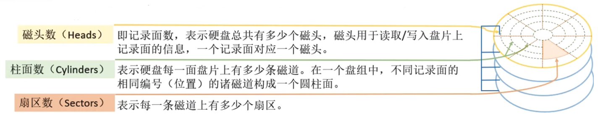
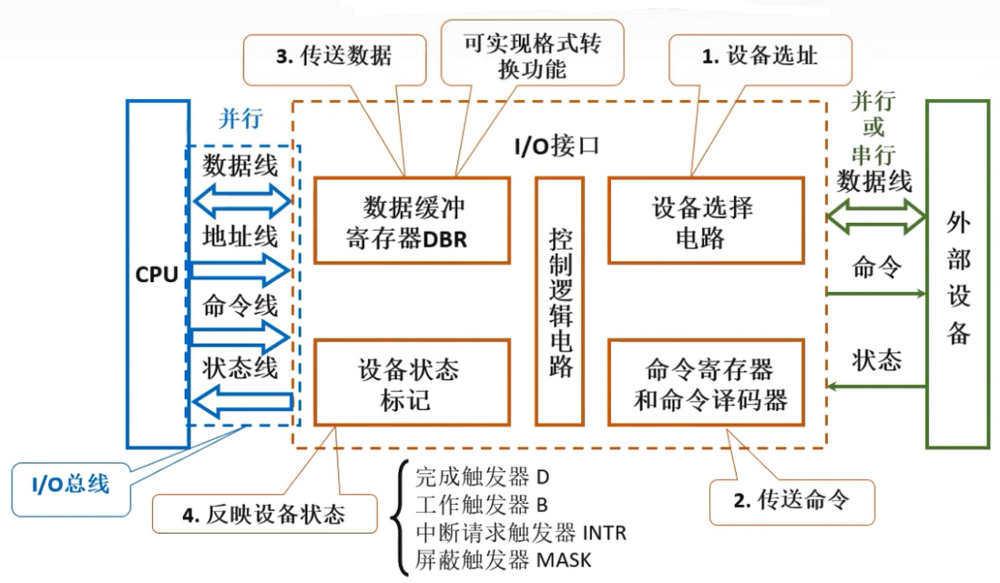
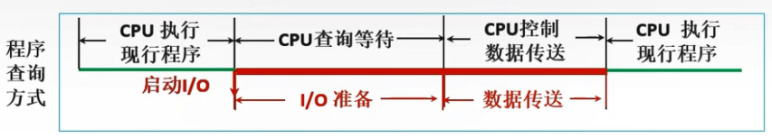
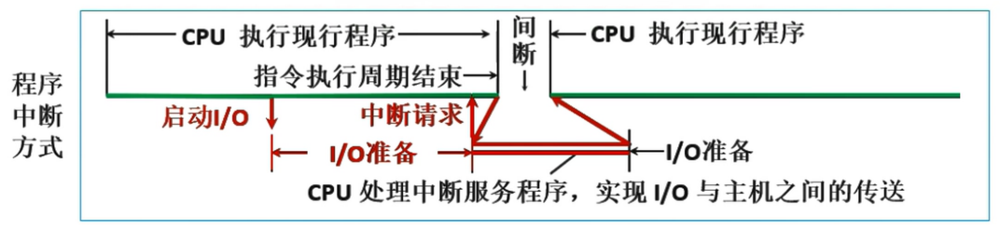
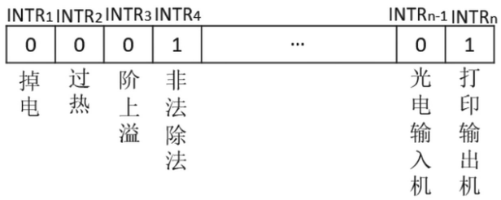
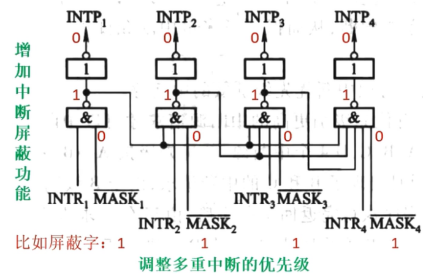
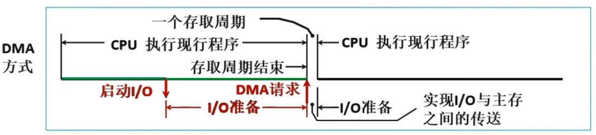
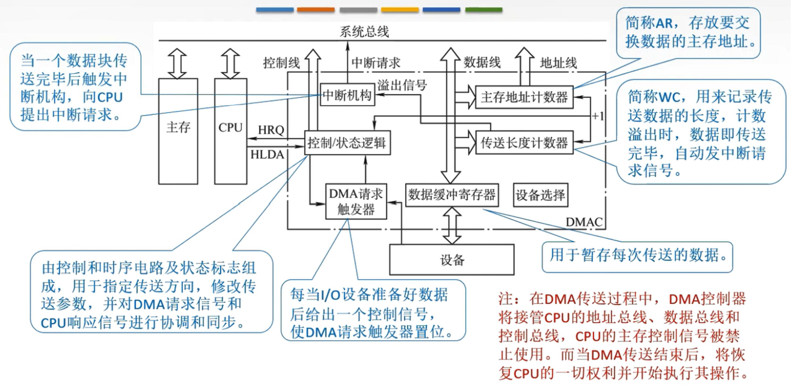
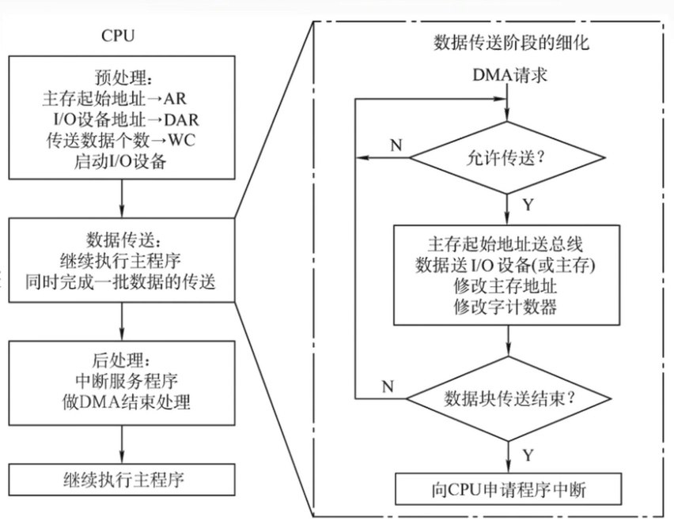

# 输入输出系统

**概览：**

**[:question: 基本概念](#基本概念)**  
**[:question: 外部设备](#外部设备)**  
**[:question: I/O 接口](#io-接口)**  
**[:question: I/O 方式](#io-方式)**

## 基本概念

### I/O 系统基本组成

一般来说 I/O 系统由 I/O 软件和 I/O 硬件两部分构成

#### I/O 软件

包括驱动程序、用户程序、管理程序、升级补丁等  
通常采用 I/O 指令和通道指令实现 CPU 和 I/O 设备的信息交换

- I/O 指令：CPU 指令的一部分，构成是`操作码 + 命令码 + 设备码`
- 通道指令：通道自身的指令
  - 指出数据的首地址、传送字数、操作命令
  - 通道指令放在主存中
  - 由 CPU 执行启动 I/O 设备的指令，由通道代替 CPU 对 I/O 设备进行管理

#### I/O 硬件

包括外部设备、设备控制器和接口、I/O 总线等  
接口可以看作是两个部件之间的交接部分

## 外部设备

外部设备也称为外围设备，是除了主机以外的、能直接或间接与计算机交换信息的装置，分为输入设备、输出设备、外存设备

### 输入设备

用于向计算机系统输入命令和文本、数据等信息的部件。键盘和鼠标是最基本的输入设备

#### 键盘

键盘是最常用的输入设备，通过它可发出命令或输入数据。键盘通常以矩阵的形式排列按键，每个键用符号标明它的含义和作用。每个键相当于一个开关，当按下键时，电信号连通；当松开键时，弹簧把键弹起，电信号断开

键盘输入信息可分为三个步骤：

- 查出按下的是哪个键
- 将该键翻译成能被主机接收的编码，如 ASCII 码
- 将编码传送给主机

#### 鼠标

鼠标是常用的定位输入设备，它把用户的操作与计算机屏幕上的位置信息相联系。常用的鼠标有机械式和光电式两种  
 工作原理：当鼠标在平面上移动时，其底部传感器把运动的放心和距离检测出来，从而控制光标做相应运动

### 输出设备

用于将计算机系统种的信息输出到计算机外部进行显示、交换等的部件。显示器和打印机是最基本的输出设备

#### 显示器

- 屏幕大小：以对角线长度表示，常用的有 12~29 英寸等
- 分辨率：所能表示的像素个数，屏幕上的每一个光点就是一个像素，以宽、高的像素的乘积表示，例如，800×600、1024×768 等
- 灰度级：灰度级是指黑白显示器中所能显示的像素点的亮暗差别，在彩色显示其中则表现为颜色的不同，灰度级越多，图像层次越清楚逼真，典型的有 8 位（256 级）、16 位等
- 刷新：光点只能保持极短的时间便会消失，为此必须在光点消失之前在重新扫描显示一遍，这个过程称为刷新。刷新频率：单位时间内扫描整个屏幕内容的次数，按照人的视觉生理，刷新频率大于 30Hz 时才不会感到闪烁，通常显示器刷新频率在 60~120Hz
- 显示存储器（VRAM）：也称刷新存储器，为了不断提高刷新图像的信号，必须把一帧图像信息存储在刷新存储器中。其存储容量由图像分辨率和灰度级决定，分辨率越高，灰度级越多，刷新存储器容量越大  
  VRAM 容量：分辨率 × 灰度级位数

#### 打印机

打印机是计算机的输出设备之一，用于将计算机处理结果打印在相关介质上

### 外存设备

是指计算机内存及 CPU 缓存等以外的存储器。硬磁盘、光盘等是最基本的外存设备

#### 磁盘存储器

##### 磁盘设备的组成

1. 存储区域  
   一块硬盘含有若干个记录面，每个记录面划分为若干条磁道，而每条磁道又划分为若干个扇区，扇区（也称块）是磁盘读写的最小单位，也就是说磁盘按块存取

   <div align="left"></div>

2. 硬盘存储器  
   硬盘存储器由磁盘驱动器、磁盘控制器和盘片组成  
   磁盘驱动器：核心部件是磁头组件和盘片组件，温彻斯特盘是一种可移动头固定盘片的硬盘存储器  
   磁盘控制器：是硬盘存储器和主机的接口，主流的标准由 IDE、SCSI、SATA

##### 磁盘的性能指标

1. 磁盘的容量：一个磁盘所能存储的字节总数称为磁盘容量。磁盘容量由非格式化容量和格式化容量之分  
   非格式化容量是指磁记录表面可以利用的磁化单元总数  
   格式化容量是指按照某种特定的记录格式所能存储信息的总量
2. 记录密度是指盘片单位面积上记录的二进制的信息量，通常以道密度、位密度和面密度表示  
   道密度：沿磁盘半径方向单位长度上的磁道数  
   位密度：磁道单位长度上能记录的二进制代码位数  
   面密度：位密度和道密度的乘积  
   注意：磁盘所有磁道记录的信息量一定是相等的，并不是圆越大信息越多，故每个磁道位密度都不同
3. 平均存取时间  
   平均存取时间 = 寻道时间（磁头移动到目的磁道）+ 旋转延迟时间（磁头定位到所在扇区）+ 传输时间（传输数据所花费的时间）
4. 数据传输率：磁盘存储器在单位时间内向主机传送数据的字节数，称为数据传输率  
   假设磁盘转数为 r（转/秒），每条磁道容量为 N 个字节，则数据传输率为 D=rN

##### 磁盘地址

主机向磁盘控制器发送寻址信息，磁盘的地址一般如图所示：驱动器号 + 柱面号 + 盘面号 + 扇区号

若系统中有 4 个驱动器号，每个驱动器带一个磁盘，每个磁盘 256 个磁道、16 个盘面，每个盘面划分为 16 个扇区，则每个扇区地址要 18 位二进制代码  
驱动器号（2bit）+ 柱面号（8bit）+ 盘面号（4bit）+ 扇区号（4bit）

##### 硬盘的工作过程

硬盘的主要操作是寻址、读写、写盘。每个操作都对应一个控制字，硬盘工作时，第一步是取控制字，第二步是执行控制字  
硬盘属于机械式部件，其读写操作是串行的，不可能在同一时刻既读又写，也不可能在同一时刻读两组数据或写两组数据

#### 磁盘阵列

RAID 是将多个独立的物理磁盘组成一个独立的逻辑盘，数据在多个物理盘上分割交叉存储、并行访问，具有更好的存储性能、可靠性和安全性

RAID 分级：

- RAID0：无冗余和无校验的磁盘阵列
- RAID1：镜像磁盘阵列
- RAID2：采用纠错的海明码磁盘阵列
- RAID3：位交叉奇偶校验的磁盘阵列
- RAID4：块交叉奇偶校验的磁盘阵列
- RAID5：无独立校验的奇偶校验磁盘阵列

#### 光盘存储器

光盘存储器是利用光学原理读/写信息的存储装置，它采用聚焦激光束对盘式介质以非接触的方式记录信息

光盘存储器特点：存储密度高、携带方便、成本低、容量大、存储期限长、容易保存等

类型：

- CD-ROM：只读型光盘，只能读出其中内容，不能写入或修改
- CD-R：只可写入一次信息，之后不可修改
- CD-RW：可读可写光盘，可以重复读写
- DVD-ROM：高容量的 CD-ROM，DVD 表示通用数字化多功能光盘

#### 固态硬盘

在微小型高档笔记本电脑中，采用高性能 Flash Memory 作为硬盘来记录数据，这种硬盘称为固态硬盘

## I/O 接口

I/O 接口是主机和外设之间的交接界面，通过接口可以实现主机和外设之间的信息交换

接口的要解决的问题

- 实现主机和外设的通信联络控制
- 进行地址译码和设备选择
- 实现数据缓冲
- 信号格式的转换
- 传送控制命令和状态信息

接口具体操作

- 设备选址
- 传送命令
- 传送数据
- 反应 I/O 设备的工作状态

<div align="left"></div>

内部接口：内部接口与系统总线相连，实质上是与内存、CPU 相连。数据的传输方式只能是并行传输  
外部接口：外部接口通过接口电缆与外设相连，外部接口的数据传输可能是串行方式，因此 I/O 接口需要具有串并转换功能

CPU 同外设之间的信息传送实质是对接口中的某些寄存器（即端口）进行读或写。如传送数据是对数据端口 DBR 进行读写操作

```txt
接口工作方式，以控制外设输入为例：
1. CPU通过地址线选择设备
2. 设备选择电路判断是否是该设备
3. CPU通过状态线反馈设备状态
4. 若设备已就绪，发送控制命令
5. 命令寄存器和命令译码器暂存命令并转换为外设的控制信号
6. 通过命令线向外设发送控制命令
7. 外设通过数据线输入数据
8. 外设状态线状态为完成输入
9. CPU通过CPU状态线反馈输入完成（中断请求）
10. CPU通过命令线发出中断响应
11. 判断中断类型号
12. CPU通过数据线取走数据
```

### 接口与端口

接口一般包括：

- 端口
  - 数据端口：读&写
  - 控制端口：写
  - 状态端口：读
- 控制逻辑

I/O 端口是指接口电路中可以被 CPU 直接访问的寄存器  
I/O 端口想要能够被 CPU 访问，必须要有端口地址，每一个端口都对应着一个端口地址

### I/O 端口的编址

#### 1. 统一编址

把 I/O 端口当作存储器的单元进行地址分配，用统一的访存指令就可以访问 I/O 端口，又称为存储器映射方式  
靠不同的地址码区分内存和 I/O 设备，I/O 地址要求相对固定在地址的某部分

```txt
如：系统总线中地址线共 10 根，则可以访问的存储单元个数为2^10=1024个，假设要给 10 个 I/O 端口编址：
1. 0~9 表示 I/O 地址，10~1023 为主存单元地址
2. 0~1013 表示主存单元地址，1014~1023 为 I/O 地址
3. 10~19 表示 I/O 地址，0~9、10~1023 为主存单元地址
```

优点：不需要专门的输入/输出指令，可使 CPU 访问 I/O 的操作更灵活、更方便，还可使端口有较大的编址空间  
缺点：端口占用了存储器地址，使内存容量变小，而且利用存储器编址的 I/O 设备进行数据输入输出操作，执行速度较慢

#### 2. 独立编址

I/O 端口地址与存储器地址无关，独立编址 CPU 需要设置专门的输入输出指令访问端口，又称 I/O 映射方式  
靠不同的指令区分内存和 I/O 设备

优点：输入输出指令与存储器指令有明显区别，程序编制清晰，便于理解  
缺点：输入输出指令少，一般只能对端口进行传送操作，尤其需要 CPU 提供存储器读写、I/O 设备读写两组控制信号，增加了控制的复杂性

### I/O 接口的类型

按数据传送给方式可分为（这里说的数据传送方式指的是外设和接口一侧的传送方式，而在主机和接口一侧，数据总是并行传送的。接口要完成数据格式转换）

- 并行接口：一个字节或一个字所有位同时传送
- 串行接口：一位一位地传送

按主机访问 I/O 设备地控制方式可分为：程序查询接口、中断接口、DMA 接口

按功能选择地灵活性可分为：可编程接口、不可编程接口

## I/O 方式

### 程序查询方式

<div align="left"></div>

CPU 一旦启动 I/O，必须停止现行程序的运行，并在现行程序中插入一段程序  
主要特点：CPU 有“踏步”等待现象，CPU 与 I/O 串行工作

- 优点：接口设计简单、设备量少
- 缺点：CPU 在信息传送过程中要花费很多时间用于查询和等待，而且在一段时间内只能和一台外设交换信息，效率大大降低

### 程序中断方式

<div align="left"></div>

程序中断是指计算机执行现行程序的过程中，出现某些急需处理的异常情况或特殊请求，CPU 暂时中止现行程序，而转去对这些异常情况或特殊请求进行处理，在处理完毕后 CPU 又自动返回到现行程序的断点处，继续执行原程序

#### 工作流程

1. 中断请求  
   中断源向 CPU 发送中断请求信号
2. 中断响应  
   响应中断的条件  
   中断判优：多个中断源同时提出请求
3. 中断处理
   中断隐指令  
   中断服务程序

#### 中断请求

##### 内/外中断

- 内中断：中断源来自 CPU 的内部，与当前执行的指令有关  
  也称异常，主要是指在处理器和内存内部产生的中断，包括程序运算引起的各种错误，如地址非法、校验错等
  - 陷进、陷入（trap）：是一种主动中断，如系统调用
  - 故障（fault）：由错误条件引起的，可能被故障处理程序修复，如缺页
  - 终止（abort）：不可恢复的致命错误造成的结果，终止处理程序不再将控制返回给引发终止的应用程序，如整数除 0
- 外中断：中断源来自 CPU 的外部，与当前执行的指令无关
  - I/O 请求：I/O 操作完成发出的中断信号
  - 人工干预：用户强行终止一个进程

##### 硬件中断和软件中断

- 硬件中断：通过外部的硬件产生的中断，属于外中断
- 软件中断：通过某条指令产生的中断，这种中断是可以编程实现的，属于内中断

##### 非屏蔽中断和可屏蔽中断

- 非屏蔽中断：硬件中断，不受中断标志位 IF 的影响，即使在关中断（IF = 0）的情况下也会被响应
- 可屏蔽中断：硬件中断，受中断标志位 IF 的影响，在关中断情况下不接受中断请求

##### 中断请求标记

每个中断源向 CPU 发出中断请求的时间是随机的  
为了记录中断事件并区分不同的中断源，中断系统需对每个中断源设置中断请求标记触发器 INTR，当其状态为“1”时，表示中断源有请求  
这些触发器可组成中断请求标记寄存器，该寄存器可集中在 CPU 中，也可分散在各个中断源中

<div align="left"></div>

对于外中断，CPU 是在统一的时刻即每条指令执行结束阶段结束前向接口发出中断查询信号，以获取 I/O 的中断请求，也就是是说，CPU 响应中断的时间是在每条指令执行阶段的结束时刻  
对于执行时间很长的指令，可在执行过程中设置若干个“查询断点”

CPU 响应中断必须满足 3 个条件：

1. 中断源有中断请求
2. CPU 允许中断即开中断
3. 一条指令执行完毕，且没有更紧迫的任务

#### 中断判优

通过中断判优逻辑确定响应的是哪个中断源的请求

硬件实现：硬件实现是通过硬件排队器实现的，它既可以设置在 CPU 中，又可以分散在各个中断源中  
软件实现：软件实现是通过查询程序实现的

一般来说：

- 硬件故障中断属于最高级，其次是软件中断
- 非屏蔽中断优于可屏蔽中断
- DMA 请求优于 I/O 设备传送的中断请求
- 高速设备优于低速设备
- 输入设备优于输出设备
- 实时设备优于普通设备

#### 中断处理

##### 中断隐指令

CPU 响应中断后，经过某些操作，转去执行中断服务程序

主要任务：

1. 关中断  
   在中断服务程序中，为了保护中断现场（即 CPU 主要寄存器中的内容）期间不被新的中断所打断，必须关中断，从而保证被中断的程序在中断服务程序执行完毕后能接着正确的执行下去
2. 保存断点  
   为了保证在中断服务程序执行完毕后能正确地返回到原来的程序，必须将原来的程序断点（PC 的内容）保存起来。可以引入堆栈，也可以存入指定单元
3. 引出中断服务程序（送中断向量）  
   引出中断服务程序的实质是取出中断服务程序的入口地址并传送给程序计数器 PC

##### 中断服务程序

中断服务程序的入口地址的方法可分为软件查询法和硬件向量法  
硬件向量法：由硬件产生的向量地址，再由向量地址找到入口地址  
中断向量：中断服务程序的入口地址

主要任务：

1. 保护现场  
   一是保存程序断点（PC），已由中断隐指令完成  
   二是保存通用寄存器和状态寄存器的内容，由中断服务程序完成  
   可以使用堆栈，也可以使用特定存储单元
2. 中断服务
   主体部分，如通过程序控制需要打印的字符代码送入打印机的缓冲存储器中
3. 恢复现场
   通过出栈指令或取数指令把之前保存饿信息送回寄存器中
4. 中断返回
   通过中断返回指令回到原程序断点处

##### 中断处理过程

1. 关中断
2. 保存断点
3. 引出中断服务程序
4. 保存现场和屏蔽字
5. 开中断
6. 执行中断服务程序
7. 关中断
8. 恢复现场和屏蔽字
9. 开中断、中断返回

#### 多重中断

单重中断：执行中断服务程序时不响应新的中断请求  
多重中断：又称中断嵌套，执行中断服务程序时可响应新的中断请求

中断屏蔽技术主要用于多重中断，CPU 要具备多重中断功能，必须满足下列条件：

- 在中断服务程序中提前设备开中断指令
- 优先级别高的中断源有权中断优先级别低的中断源

每个中断源都有一个屏蔽触发器，1 表示屏蔽该中断源的请求，0 表示可以正常申请，所有屏蔽触发器组合在一起，便构成了一个屏蔽字寄存器，屏蔽字寄存器的内容称为屏蔽字

<div align="left"></div>

#### 中断系统作用

- 实现 CPU 和 I/O 并行工作
- 处理硬件故障和软件错误
- 实现人机交互，用于干预机器需要用到中断系统
- 实现多道程序、分时操作，多道程序的切换需借助于中断系统
- 实时处理需要借助中断系统来实现快速响应
- 实现应用程序和系统（管态程序）的切换，称为“软中断”
- 多处理系统中各处理器之间的信息交流和任务切换

屏蔽字设置规律：

1. 一般用 1 表示屏蔽，0 表示可以正常申请
2. 每个中断源对应一个屏蔽字（在处理该中断源服务程序时，屏蔽寄存器中的内容为该中断源对应的屏蔽字）
3. 屏蔽字中 1 越多，优先级越高。每个屏蔽字中至少有一个 1（至少要能屏蔽自生的中断）

### DMA 方式

<div align="left"></div>

如果使用程序中断方式来传送数据，每准备好一个数据都要中断 CPU，由 CPU 运行中断服务程序来完成一次传送。那么磁盘及、磁带机等高速设备需要大批量的数据传送，会导致 CPU 大量时间用于中断服务  
DMA 方式是一种完全由硬件进行组成信息传送的控制方式，DMA 方式在外设与内存之间开辟了一条“直接数据通道”，实现控制大批量的数据传送

在 DMA 方式中，当 I/O 设备需要进行数据传送时，通过 DMA 控制器（DMA 接口）向 CPU 提出 DMA 传送请求，CPU 响应之后将让出系统总线，由 DMA 控制器接管总线进行数据传送

#### DMA 方式的特点

- 它使主存与 CPU 的固定联系脱钩，主存既可被 CPU 访问，又可被外设访问
- 在数据块传送时，主存地址的确定、传送的计数等都由硬件电路直接实现
- 主存中要开辟专用缓冲区，即使共给和接收外设的数据
- DMA 传送速度快，CPU 和外设并行工作，提高了系统效率
- DMA 在传送开始前要通过程序进行预处理，结束后要通过中断方式进行后处理

#### DMA 控制器的组成

<div align="left"></div>

#### DMA 传送过程

<div align="left"></div>

DMA 的数据传输可以以单字节（或字）为基本单位，也可以以数据块为基本单位，数据传送阶段完全由 DMA（硬件）控制

#### DMA 传送方式

主存和 DMA 控制器之间有一条数据通路，因此主存和 I/O 设备之间交换信息时，不通过 CPU。但当 I/O 设备和 CPU 同时访问主存时，可能发生冲突，为了有效的使用主存，DMA 控制器与 CPU 通常采用以下 3 种方法使用主存

| 传送方式             | 原理                                                                                                                                                                                                                                    | 特点                                                                          |
| -------------------- | --------------------------------------------------------------------------------------------------------------------------------------------------------------------------------------------------------------------------------------- | ----------------------------------------------------------------------------- |
| 停止 CPU 访问主存    | CPU 放弃地址线、数据线和有关控制线的使用圈，DMA 接口获得总线控制权                                                                                                                                                                      | 控制简单 <cr> CPU 处于不工作状态或保持状态 <br> 未充分发挥 CPU 对主存的利用率 |
| DMA 与 CPU 交替访问  | 一个周期分为两个子周期，一个专供 DMA，另一个专供 CPU                                                                                                                                                                                    | 不需要总线使用权的申请、建立、和归还过程 <br> 硬件逻辑更为复杂                |
| 周期挪用（周期窃取） | 1. CPU 不在访存，I/O 的访存请求与 CPU 未发生冲突 <br> 2. CPU 正在访存，此时必须待存取周期结束后，CPU 再将总线占有权让出 <br> 3. I/O 和 CPU 同时请求访存，出现访存冲突，此时 CPU 要暂时放弃总线占有权，由 I/O 设备挪用一个或几个存取周期 |

### DMA 方式和中断方式

|              | 中断                                      | DMA                                               |
| ------------ | ----------------------------------------- | ------------------------------------------------- |
| **数据传送** | 程序控制<br> 程序的切换 -> 保存和恢复现场 | 硬件控制 <br> CPU 只需进行预处理和后处理          |
| **中断请求** | 传送数据                                  | 后处理                                            |
| **响应**     | 指令执行周期结束后响应中断                | 每个机器周期结束均可，总线空闲时即可响应 DMA 请求 |
| **场景**     | CPU 控制，低速设备                        | DMA 控制器控制，高速设备                          |
| **优先级**   | 优先级低于 DMA                            | 优先级高于中断                                    |
| **异常处理** | 能处理异常事件                            | 仅传送数据                                        |
