# 概述

**概览：**

**[:question: 计算机网络的定义](#计算机网络的定义)**  
**[:question: 计算机网络的发展](#计算机网络的发展)**  
**[:question: 计算机网络的组成](#计算机网络的组成)**  
**[:question: 计算机网络的功能](#计算机网络的功能)**  
**[:question: 计算机网络的分类](#计算机网络的分类)**  
**[:question: 计算机网络的标准化及相关组织](#计算机网络的标准化及相关组织)**  
**[:question: 计算机网络的性能指标](#计算机网络的性能指标)**  
**[:question: 计算机网络的分层结构](#计算机网络的分层结构)**  
**[:question: 计算机网络的参考模型](#计算机网络的参考模型)**  
**[:question: 计算机网络的信息传输过程](#计算机网络的信息传输过程)**

## 计算机网络的定义

**定义一**：是一个将分散的、具有独立功能的计算机系统，通过通信设备与线路连接起来，由功能完善的软件实现资源共享和信息传递的系统

**定义二**：计算机网络是互连的、自治的计算机系统的集合

- 互连：通过通信链路互联互通->计算机之间可以通过有线或无线方式进行数据通信
- 自治：无主从关系->独立的计算机，它有自己的硬件和软件，可以单独运行使用

### 网络、互联网和因特网

- 网络（Network）是由若干结点（Node）和连接这些结点的链路（Link）组成
  
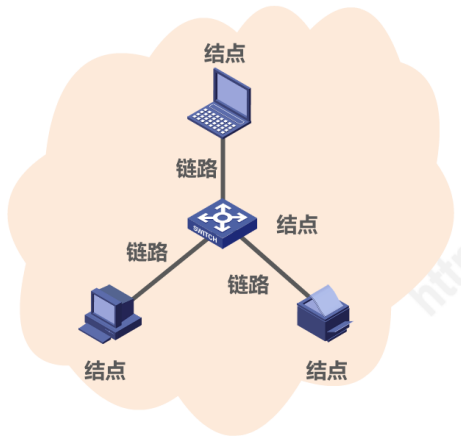

- 互联网（互连网 internet）：多个网络还可以通过路由器互连起来，这样就构成了一个范围更大的网络。互连网是“网络的网络（Network of Networks）”
  
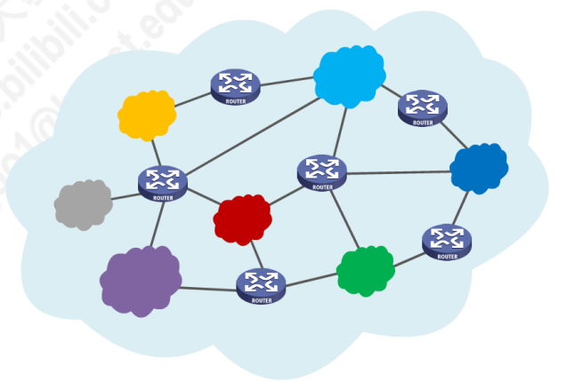

- 因特网（Internet）：世界上最大的互联网络
  
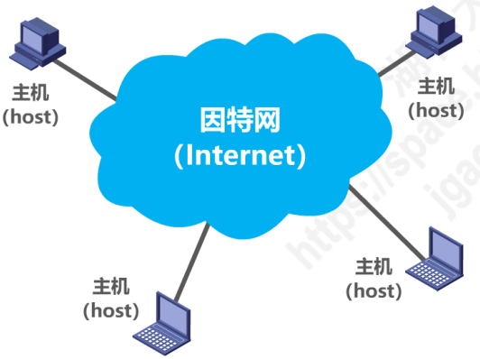

internet 和 Internet 的区别：

- internet（互联网或互连网）是一个通用名词，它泛指由多个计算机网络互联而成的网络。在这些网络之间的通信协议可以是任意的
- Internet（因特网）是一个专用名词，它指当前全球最大的、开放的、由众多网络相互连接而成的特定计算机网络，它采用 TCP/IP 协议族作为通信的规则

## 计算机网络的发展

### 第一阶段（1969）- 从单个网络 ARPANET 向互联网发展

1969 年，第一个分组交换网**ARPANET**  
70 年代中期，研究多种网络之间的互连  
1983 年，**TCP/IP**协议成为 ARPANET 的标准协议（因特网诞生时间）

### 第二阶段（1985）- 逐步建成三级结构的因特网

1985 年，NSF 围绕六个大型计算中心建设 NSFNET（主干网、地区网和校园网）  
1990 年，ARPANET 任务完成、正式关闭  
1991 年，美国政府将因特网主干网交给私人公司经营，并开始对接入因特网的单位收费

### 第三阶段（1993）- 逐步形成多层次 ISP 结构的因特网

1993 年，NSFNET 逐渐被若干个商用因特网主干网替代；政府机构不在负责因特网运营，让各种**ISP**来运营；

> ISP(Internet Service Provider)：因特网服务提供者，是一个向广大用户综合提供互联网接入业务、信息业务和增值业务的公司。如：中国电信、中国移动
>
> 
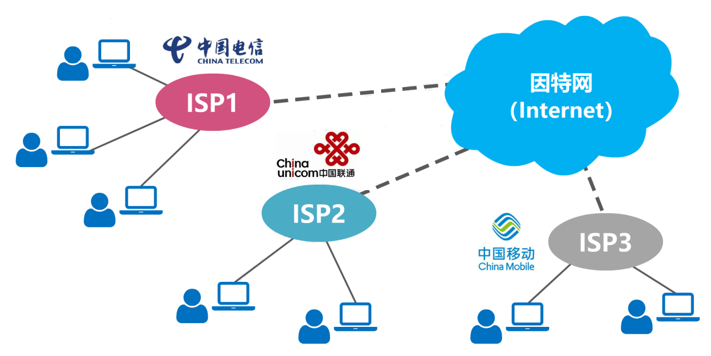

1994 年，万维网 WWW 技术促使因特网迅猛发展；  
1995 年，NSFNET 停止运作，因特网彻底商业化

## 计算机网络的组成

可从三个角度进行分析

- 组成部分角度
  - 硬件：主机（端系统）、通信链路（双绞线、光纤）、交换设备（路由器、交换机）以及通信处理机（网卡等）
  - 软件：实现资源共享的软件以及方便用户使用的各种工具软件（聊天程序、FTP 程序）
  - 协议：规定了网络传输数据遵循的规定，是计算机网络的核心
- 工作角度
  - 边缘部分：由所有连接到因特网上、供用户直接使用的主机组成。用来进行通信（传送数据、音频或视频）和资源共享
  - 核心部分：由大量网络和连接这些网络的路由器组成，为边缘部分提供连通性和交换服务
  

- 功能组成角度
  - 通信子网：传输介质、通信设备、相应的网络协议。使得网络具有传输、交换、控制和存储的能力，实现联网计算机之间的数据通信
  - 资源子网：实现资源共享功能以及软件的集合，向网络用户提供共享其它计算机硬件、软件和数据的服务
  
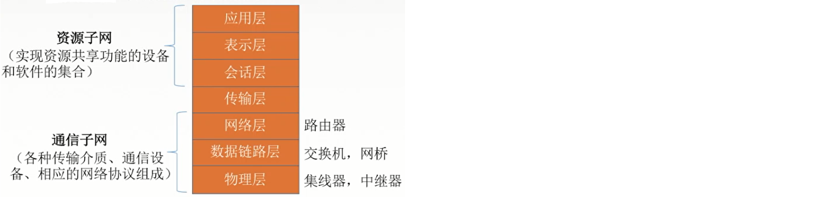

## 计算机网络的功能

- 数据通信  
  **最基本最重要**的功能，实现联网计算机之间的信息传输，将分散的计算机联系起来
- 资源共享  
  实现软件、硬件、数据的共享，使得计算机网络中的资源互通有无、分工协作、提高硬件、软件和数据资源的利用率
- 分布式处理  
  将某个计算机负载过重的任务分散到多台计算机上，提高整个系统的利用率
- 提高可靠性  
  各台计算机可以通过网络互为替代机
- 负载均衡  
  将工作任务均衡的分配给计算机网络中的各台计算机

## 计算机网络的分类

- 按分布范围分：广域网、城域网、局域网、个人区域网
  - 广域网(WAN)
    > 范围：提供长距离通信，运送主机发送的数据  
    > 距离：几十千米到几千千米  
    > 地位：广域网是因特网的核心部分，连接广域网的各节点交换机的链路一般是高速链路，具有较大的通信容量，采用交换技术
  - 城域网(MAN)
    > 范围：跨越几个街区甚至几个城市  
    > 距离：5~50km  
    > 地位：多采用以太网技术
  - 局域网(LAN)
    > 范围：微机或工作站通过高速线路相连，覆盖范围小  
    > 距离：几十米到几千米  
    > 地位：对计算机配置数量没有太多限制，采用广播技术
  - 个人区域网(PAN)
    > 范围：个人工作的地方将电子设备用无线技术链接起来的网络  
    > 距离：区域直径为 10m
- 按使用者分：公用网、专用网
  - 公用网：公众使用的网络
  - 专用网：为满足某个部门特殊业务建立的网络（军队、电力）
- 按交换技术分：电路交换、报文交换、分组交换
- 按拓扑结构分：总线型、星型、环型、网状型
  - 总线型
    > 用单根传输线把计算机连接起来  
    > 优点：建网容易，增减节点方便，节省线路  
    > 缺点：重负载时通信效率不高，总线任意处对故障敏感
  - 星型
    > 每个终端或计算机都以单独的线路与中央设备相连  
    > 优点：便于集中控制和管理  
    > 缺点：成本高，中心节点对故障敏感
  - 环型
    > 所有计算机接口设备连接成一个环
  - 网状型
    > 每个节点至少两条链路与其它节点相连，形成一个网状结构  
    > 优点：可靠性高  
    > 缺点：成本高、控制复杂
    
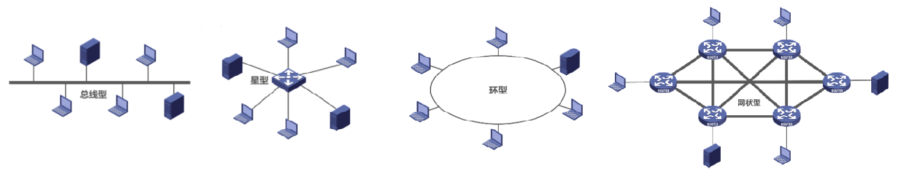

- 按传输技术分：广播式网络、点对点网络
  - 广播式网络
    > 所有联网计算机共享一个公共通信信道  
    > 一台计算机发送报文分组，其它计算机也能收听到这个分组（根据报文目的地址进行接收）  
    > 采用广播通信技术
  - 点对点网络
    > 每个物理线路连接一对计算机  
    > 计算机通过直接或中间节点对分组进行接收、存储和转发直到目的地  
    > 采用分组转发机制

## 计算机网络的标准化及相关组织

生成 RFC 的过程：因特网草案 -> 建议标准 -> 草案标准 -> 因特网标准

国际组织：国际标准化组织(ISO)：OSI 参考模型、HDLC；国际电信联盟(ITU)：远程通信标准；国际电气电子工程师协会(IEEE)：802 标准

## 计算机网络的性能指标

- **速率**：连接到计算机网络主机上数字信道上传送数据的速率（数据率或比特率），最高的数据率即为带宽  
  单位：比特/每秒(b/s, bps)、(kb/s=10^3 b/s)、(Mb/s=10^3 kb/s)等  
  如：发送端 1s 内发送 0101010101，则速率是 10b/s
- **带宽**：计算机网络中，带宽表示网络在通信线路中传送数据的能力，通常是指单位时间内从网络中的某一点到另一点所能通过的"最高数据率"  
  单位：比特/每秒(b/s)、(kb/s)、(Mb/s)等  
  _带宽原指某个信号具有的频带宽度，即最高频率与最低频率之差，单位是 HZ_
  
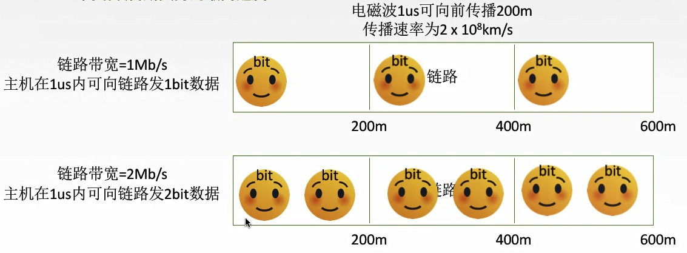

- **吞吐量**：单位时间内，通过某个网络的数据量。（受到网络带宽或网络额定速率的限制）
- **时延**：数据从网络的一端传送到另一端所需要的总时间  
  时延=发送时延+传播时延+排队时延+处理时延
  - 发送时延：发送分组的第一个比特开始，到最后一个比特发送结束的时间  
    $发送时延=\frac{分组长度}{信道带宽}$
  - 传播时延：一个比特从链路一端到另一端需要的时间  
    $传播时延=\frac{信道长度}{电磁波在信道上的传播速率}$
  - 处理时延：数据在交换节点为存储转发而进行的一些必要的处理所花费的时间，如：分析分组的首部、从分组中提取数据部分、差错检验、寻找适当的路由器
  - 排队时延：分组在进入路由器后，像排队一样等待被转发的时间
- **时延带宽积**：发送端连续发送数据且发送的第一个比特即将到达终点时，发送端已发出的比特数，即"某段链路现在有多少比特"  
  时延带宽积=传播时延\*信道带宽
- **往返时延 RTT(Round-Trip Time)**：从发送数据到接收到接收端的确认所经历的延时  
  RTT = 往返传播时延(传播时延\*2) + 末端处理时间
- **利用率**
  - 信道利用率：$\frac{有数据通过时间}{（有+无）数据通过时间}$
  - 网络利用率：信道利用率加权平均值
- **丢包率**：丢包率即分组丢失率，是指一定的时间范围内，传输过程中丢失的分组数量与总分组数量的比率
  - 丢包率可分为接口丢包率、结点丢包率、链路丢包率、路径丢包率、网络丢包率等
  - 分组丢失主要有两种情况
    - 分组在传输过程中出现误码，被结点丢弃
    - 分组到达一台队列已满的分组交换机时被丢弃；在通信量较大时就可能造成网络堵塞
  - 丢包率反应了网络的拥堵情况
    - 无拥塞时路径丢包率为0
    - 轻度拥塞时路径丢包率为1%~4%
    - 严重拥塞时路径丢包率为5%~15%

## 计算机网络的分层结构

为什么要分层？  
数据在主机之间的传输是一个复杂的过程，在对网络分层以后可以将问题细化，使得问题更加容易分析

- 采用什么样的传输媒介
- 采用怎么样的物理接口
- 使用怎样的信号表示比特0和比特1
- 如何标识网络中的各主机（主机编址问题，例如MAC地址）
- 如何从信号所表示的一连串比特流中区分出地址和数据
- 如何协调各主机争用总线
- 如何标识各网络以及网络中的各主机（网络和主机的共同编址问题，例如IP地址）
- 路由器如何转发分组，如何进行路由选择
- 如何解决进程之间基于网络的通信问题
- 出现传输错误时，如何处理
- 通过应用进程间的交互来完成特定的网络应用

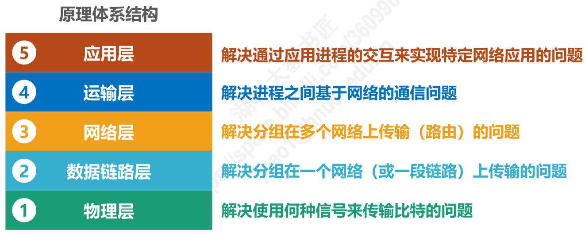

### 分层的原则

- 每层实现一种相对独立的功能，降低系统的复杂度
- 各层之间界面清晰，容易理解，相互交流尽可能少
- 各层功能的精确定义独立于具体的实现方法，可以采用最合适的技术来实现
- 保持下层对上层的独立性，上层单向使用下层提供的服务
- 整个分层结构应能促使标准化工作

### 分层的结构

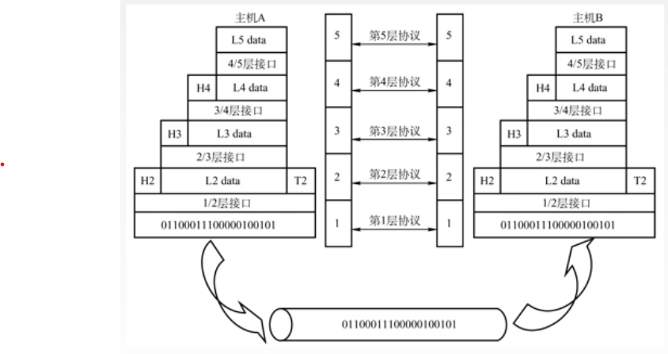

#### 实体：任何可以发送或接受信息的硬件或者软件进程，如图中主机 A 第五层

不同机器上的同一层称为对等层，同一层的实体叫对等实体，如主机 A 第五层和主机 B 第五层  
n 层实体实现的服务为 n+1 层所利用，如第 4 层为第 5 层提供服务

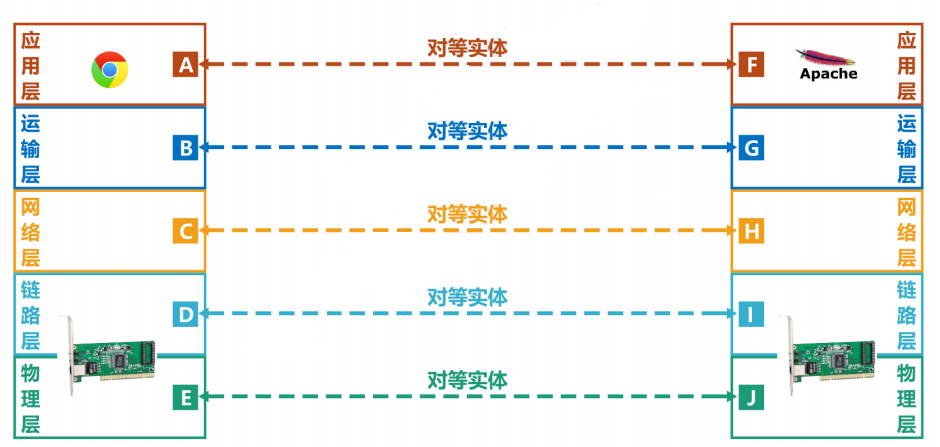

服务数据单元（SDU）：同一系统内，层与层之间交换的数据包，目的是完成用户所要求的功能而传送的数据，第 n 层为 n-SDU  
协议控制信息（PCI）：控制层协议操作的信息，n-PCI  
协议数据单元（PDU）：对等层次之间传送的数据单元称为该层的 PDU

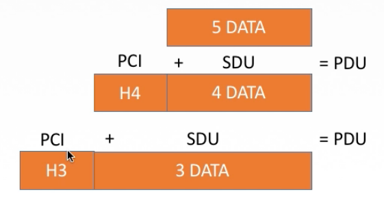

#### 协议：控制两个或多个对等实体进行通信的规则合集

- 协议的组成：
  - 语法：规定了传输数据的格式
  - 语义：规定了要完成的功能
  - 同步：规定了执行各种操作的条件、时序关系

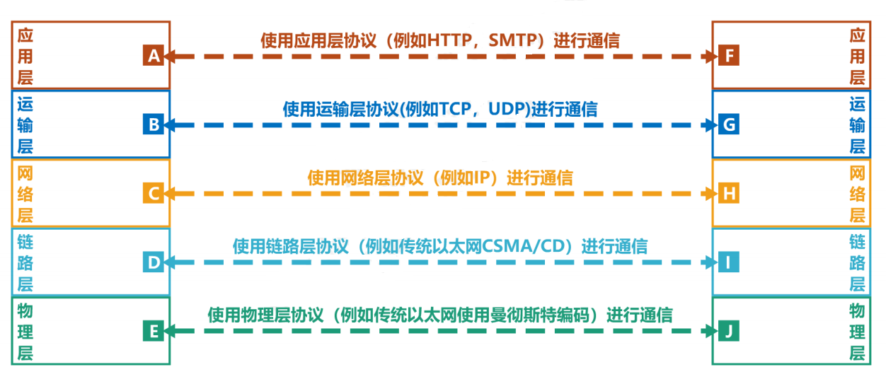

#### 接口：上层使用下层服务的入口

同一节点内相邻两层间交换信息的连接点，是一个系统内部的规定  
每层只能为紧邻的层次之间定义接口，不能跨层定义接口

#### 服务：下层为紧邻的上层提供的功能调用

只有本层的协议的实现才能保证向上一层提供服务，本层的服务用户只能看见服务，而无法看见下面的协议

- 服务原语
  - 由服务用户发往服务提供者，请求完成某项任务
  - 由服务提供者发往服务用户，指示用户做某件事
  - 由服务用户发往服务提供者，作为对指示的响应
- 服务的分类
  - 面向连接服务和无连接服务
    - 面向连接服务  
      通信双方必须建立连接，分配相应资源，结束后释放连接与资源（可靠服务）  
      阶段：建立连接->数据传输->连接释放  
      代表协议：TCP 协议
    - 无连接服务  
      通信双方不需要建立连接，直接发送数据（不可靠服务）  
      代表协议：UDP 协议、IP 协议
  - 可靠服务和不可靠服务
    - 可靠服务  
      网络具有纠错、检错、应答机制，保证数据正确可靠的传送到目的地
    - 不可靠服务  
      网络尽可能正确、可靠的传输，不能保证数据的正确，可靠的传送到目的地。可靠性由应用或用户来保障
  - 有应答服务和无应答服务
    - 有应答服务  
      接收方在收到数据后向发送方发出相应的应答，传输系统自动实现
    - 无应答服务  
      接收方收到收据后不会自动给出应答，如果需要应答就由高层实现

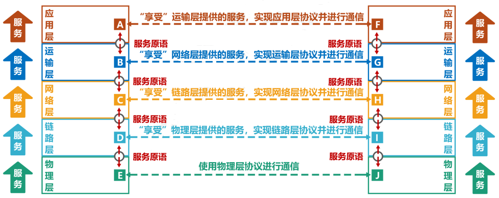

## 计算机网络的参考模型

计算机网络参考模型主要有：OSI 七层参考模型和 TCP/IP 四层参考模型

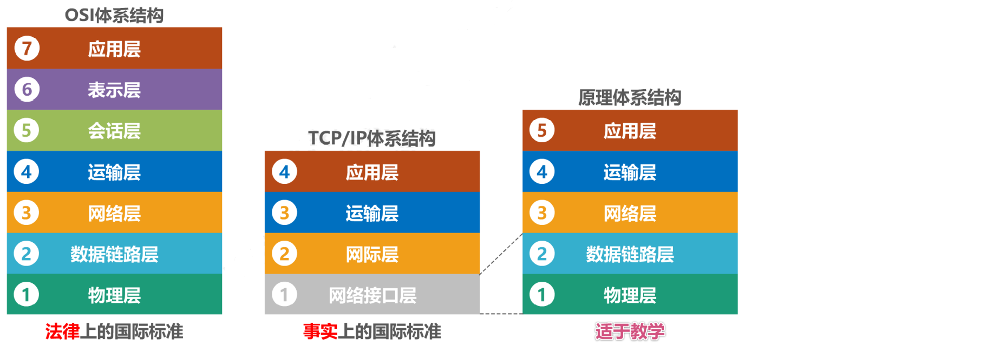

### OSI 参考模型(7 层)

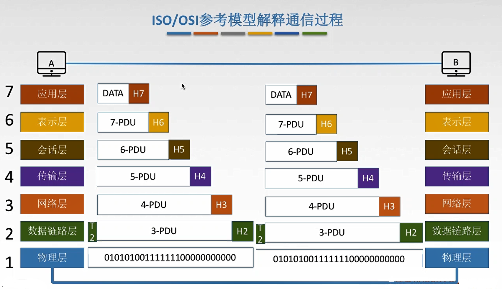

#### 应用层

- 用户与网络的界面，为特定类型的网络应用提供访问 OSI 环境的手段
- 典型协议：FTP、SMTP、HTTP

#### 表示层

- 任务：处理两个通信系统中交换信息的表示方式
- 功能：数据压缩、加密和解密、数据表示变换

#### 会话层

- 任务：允许不同主机上的各个进程进行通话
- 功能：建立会话同步、管理主机间的会话进程（建立、管理及终止）、使用校验点恢复通信，实现数据同步

#### 传输层

- 传输单位：报文段（TCP）或者用户数据段（UDP）
- 任务：主机之间两个进程相互通信
- 功能：端到端传输、流量控制、差错控制、服务质量、数据传输管理等
- 典型协议：TCP、UDP

#### 网络层

- 传输单位：数据报
- 任务：把网络层的协议数据单位（分组）从源端传到目的端，为分组交换网上的不同主机提供通信服务
- 功能：流量控制、拥塞控制、差错控制、网际互联
  > 拥塞控制：对网络中因为来不及接收导致大量丢失的情况，网络层采取一定的措施对拥塞进行缓解  
  > 网际互连：将大量异构网络通过路由器相互连接起来

#### 数据链路层

- 传输单位：帧
- 任务：将网络层传来的 IP 数据报组装成帧
- 功能：成帧、差错控制、流量控制、传输管理
  > 差错控制：对传输中受到干扰的信号进行检错，并对其丢弃  
  > 流量控制：控制发送方的速度
- 典型协议：SDLC、HDLC、PPP、STP

#### 物理层

- 传输单位：比特流
- 任务：透明传输的比特流
- 功能：物理媒体上为数据端设备透明的传输原始比特流  
  定义数据终端设备和数据通信设备的物理与逻辑连接方法，接口的机械形状和尺寸，交换电路的数量和排列
- 接口协议：EIA-232C、EIA/TIA RS-449 等

### TCP/IP 参考模型(4 层)

#### 应用层

对应 OSI 的会话层、表示层和应用层  
包含所有高层协议（Telnet、FTP、DNS、SMTP、HTTP）

#### 传输层

对应 OSI 的传输层  
实现发送端和目的端主机上的对等实体进行会话  
传输控制协议（TCP）：面向连接（可靠交付）；数据传输的基本单位是报文段  
用户数据报协议（UDP）：无连接的（不可靠交付）；传输基本单位是用户数据报（尽最大努力交付）

#### 网际层

对应 OSI 的网络层  
将分组发送到任何网络上，选择合适的路由  
不能保证有序到达，有序交付给高层负责  
定义了 IP 协议，IPV4、IPV6

#### 网络接口层

对应 OSI 的数据链路层和物理层  
指出主机必须使用某种协议与网络连接  
作用：从主机或者节点接收 IP 分组，并把他们发送到指定的物理网络上

### OSI 模型与 TCP/IP 的比较

相同点：

- 都采用分层结构
- 都是基于独立的协议栈的概念
- 都可以解决异构网络的互联，实现不同厂家的计算机的相互通信

不同点：

- OSI 精确的定义了服务、接口和协议；TCP/IP 没有明确区分
- OSI 通用性良好；TCP/IP 协议是对已有协议的描述，但是不适用于其它非 TCP/IP 的协议栈
- OSI 没有考虑多种异构网络的互联问题
- 网络层中，OSI 中支持无连接和面向连接；TCP/IP 只有无连接
- 传输层中，OSI 支持面向连接的通信；TCP/IP 支持面向连接和无连接的通信

## 计算机网络的信息传输过程

1. 用户发送数据报
2. 应用层将自然语言转为通信数据
3. 然后开始每层都会加上 SDU 和 PCI 进行包裹包装
4. 到达目的主机又会进行包裹拆包，将 SDU 和 PCI 一层层拆开，最终获得数据
