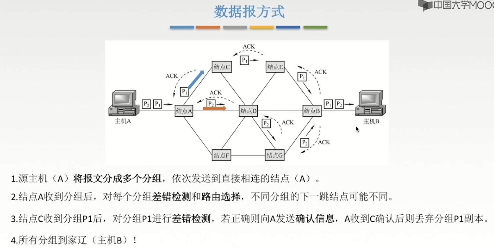

# 物理层

**概览：**

**[:question: 物理层基本概念](#物理层基本概念)**  
**[:question: 通信的一些相关术语](#通信的一些相关术语)**  
**[:question: 奈奎斯特定理与香农定理](#奈奎斯特定理与香农定理)**  
**[:question: 编码与调制](#编码与调制)**  
**[:question: 三种交换技术](#三种交换技术)**  
**[:question: 传输媒体与传输设备](#传输媒体与传输设备)**

## 物理层基本概念

物理层解决如何在连接各种计算机的传输媒体上传输数据比特流，而不是指具体的传输媒体  
物理层为数据链路层屏蔽了各种传输媒体的差异，使数据链路层只需要考虑如何完成本层的协议和服务，而不必考虑网络具体的传输媒体是什么  
物理层主要任务：确定与传输媒体接口有关的一些特性。（定义标准）

### 物理层接口特性

- 机械特性：定义物理连接的特性，规定物理连接时所采用的规格、接口形状、引线数目、引脚数量和排列情况

- 电器特性：规定传输二进制位时，线路上信号的电压范围、阻抗匹配、传输速率和距离限制等
- 功能特性：指明某条线上出现的某一电平的电压表示何种意义，接口部件的信号线（数据线、控制线、定时线等）的用途
- 规程特性：定义各条物理线路的工作规程和时序关系
- 接口标准：EIA RS-232-C、ADSL、SONET/SDH

## 通信的一些相关术语

- 数据：传送信息的实体，通常是有意义的符号序列
- 信号：数据的电气或电磁表现，是数据在传输过程中的存在形式。分为数字信号和模拟信号
- 信源：产生和发送数据的源头
- 信宿：接收数据的终点
- 信道：发送端信源发送的信息经过变换成合适的信号后在信道上传输到信宿，是信号的传输媒介。一般用来表示向某一个方向传送信息的介质，因此一条通信线路往往包含一条发送信道和一条接收信道
  - 按传输形式分为：传送模拟信号的模拟信道、传输数字信号的数字信道
  - 按传输媒体分为：无线信道、有线信道
- 通信交互方式：单工通信、半双工通信、全双工通信  
  | 单工通信 | 半双工通信 | 全双工通信 |
  | ------- | --------- | --------- |
  | 只有一个方向的通信，没有反方向的交互（无线电广播、电视广播）（只需一条信道）| 半双工通信：通信双方都可以发送或者接收信息，但是任何一方不能同时发送和接收信息（需要两条信道）| 全双工通信：通信双方可以同时发送和接收信息（需要两条信道）|
- 传输方式：串行传输、并行传输  
  | 方式 | 概念 | 特点 |
  | ---- | --- | ---- |
  | 串行传输 &emsp;&emsp;&emsp;&emsp; | 将表示一个字符的 8 位二进制数按由低位到高位的顺序依次发送 | 速度慢，费用低，适合远距离 |
  |并行传输 | 将表示一个字符的 8 位二进制数通过 8 条信道发送 | 速度快，费用高，适合近距离，适用于用户计算机内部数据传输 |
- 传输模式：同步传输、异步传输  
  | 模式 | 概念 | 特点 |
  | --- | ---- | ---- |
  | 同步传输 &emsp;&emsp;&emsp;&emsp; | 数据的传送是以一个数据区块为单位，因此同步传输又称为区块传输 | 在传送数据时，需先送出 1 个或多个同步字符，再送出整批的数据 |
  | 异步传输 | 将比特分成小组传送，小组可以说 8 位的 1 个字符或更长。发送方可以在任何时刻发送这些比特分组，而接收方不知道它们会在什么时候到达 | 传送数据时，加一个字符起始位和一个字符终止位 |
  

- 码元：一个固定时长的信号波形（数字脉冲）表示一个 K 进制数字，代表不同离散数值的基本波形，这个时长内的信号称为 K 进制码元，该时长成为码元宽度
  > 1 码元可以携带多个比特的信息量  
  > 如，使用二进制编码时，只有两种不同的码元，一种代表 0 状态，一种代表 1 状态  
  > 再如，4 进制码元，离散状态有 4 个，4 种高低不同的信号波形（00、01、10、11），需要两个比特就能表示 4 进制码元
- 速率：数据的传输速率，单位时间内传输的数据量。可以用码元传输速率和信息传输速率表示
  <table>
    <tr>
      <th>&emsp;&emsp;码元传输速率 （码元速率、波形速率）</th>
      <th>&emsp;&emsp;信息传输速率 （信息速率、比特率）</th>
    </tr>
    <tr>
    <td>单位时间内数字通信系统所传输的码元个数，单位是波特（Baud） 1 波特表示数字通信系统每秒传输一个码元</td>
    <td>表示单位时间内数字通信系统传输的二进制码元个数（比特数），单位是比特/秒</td>
    </tr>
    <tr>
    <td colspan="2">二者关系：若一个码元携带 n 比特的信息量，则 M 波特的码元传输速率对应的信息传输速率为 M×n(bit/s)</td>
    </tr>
  </table>

  > 例题：某一数字通信系统传输的是四进制码元，4s 传输了 8000 个码元，求系统的码元传输速率是？信息传输速率是？若另一通信系统传输的是十六进制码元，6s 传输了 7200 个码元，求它的码元传输速率是？信息传输速率是？哪个系统传输速率更快？  
  > 四进制：  
  > 码元传输速率：8000/4=2000Baud，信息传输速率：2000*$log_{2}{4}$=4000b/s  
  > 十六进制：  
  > 码元传输速率：7200/6=1200Baud，信息传输速率：1200*$log_{2}{16}$=4800b/s  
  > 十六进制更快

- 带宽
  - 模拟信号系统中：当输入的信号频率高或低到一定程度，使得系统的输出功率称为输入功率的一半时（即-3dB），最高频率和最低频率间的差值就代表了系统的同频带宽，单位为赫兹（HZ)
  - 数字设备中：表示单位时间内从网络中某一点到另一点所能通过的"最高数据率"/单位时间内通过链路的数量，常用来表示网络的通信线路所能传输数据的能力。单位是比特/秒（bps）

## 奈奎斯特定理与香农定理

### 奈奎斯特定理

  
影响失真的因素：

1. 码元传输速率
2. 信号传输距离
3. 噪声干扰
4. 传输媒体质量

失真的一种现象-码间串扰  
码间串扰：接收端收到的信号波形失去了码元之间清晰界限的现象

200HZ 无法通过是因为振动频率太低，传输过程信号衰减掉了  
4000HZ 无法通过是因为振动频率太快，接收端无法识别波形之间的差异。（码间串扰）

**奈奎斯特定理：**  
理想低通（没有噪声，带宽有限）的信道中，为了避免码间串扰，极限码元的传输速率为 2W 波特（W 是理想低通信道的带宽，单位 HZ)  
理想低通信道下的极限数据传输速率=$2Wlog_{2}{V}$单位是 b/s（V 是码元的离散电平数目/几种码元）

结论：

- 任何信道中，码元的传输速率是有上限的
- 信道的频带越宽（即能通过的信号高频分量越多），就可以用更高的速率进行码元的有效传输
- 奈氏准则给出了码元传输速率的限制，但是没有给出信息传输速率的限制（即一个码元可以对应多少个二进制位给出的限制）
- 由于码元的传输速率受奈式准则的制约，所以要提高数据的传输速率，就必须设法使每个码元能携带更多个比特的信息量，这就需要采用多元制的调制方法
- 只要采用更好的调制方法，让码元可以携带更多的比特，岂不是可以无限制地提高信息地传输速率？
  - 错。因为信道的极限信息传输速率还要受限于实际的信号在信道中传输时的信噪比

例题：在无噪声的情况下，若某通信链路的带宽为 3kHZ，采用 4 个相位，每个相位具有 4 种振幅的 QAM 调制技术，则该通信链路的最大传输速率是多少？  
信号有 4*4=16 中变化  
最大传输速率=$2*3k\*log\_{2}{16}$=24kb/s

### 香农定理

噪声存在于所有电子设备和通信信道中。由于噪声随机产生，那么它的瞬时值有时会很大，因此噪声会使接收端对码元的判决产生错误。但是噪声的影响是相对的，若信号较强，那么噪声影响相对较小。因此，信噪比就很重要。  
信噪比=信号的平均功率/噪声的平均功率，常记为 S/N，度量单位是分贝（dB）：  
信噪比(dB)=$10log_{10}{S/N}$

香农定理：  
带宽受限且高斯白噪声干扰的信道的极限数据传输率  
信道的极限传输速率=$Wlog_{2}{(1+S/N)}$，单位为 b/s

> W 为信道的带宽；S 为信道所传输信号的平均功率；N 为信道内部的高斯噪声功率  
> S/N 为信号的平均功率和噪声的平均功率之比

结论：

- 信道的带宽或者信道中的信噪比越大，信息的极限传输速率越高
- 对一定的传输带宽和一定的信噪比，信息传输速率上限是确定的
- 只要信息的传输速率低于信道的极限传输速率，就能找到某种方法来实现无差错的传输
- 香农定理得出的极限信息传输速率，实际信道的传输速率要比他低很多

想要提高数据率：
对于奈式准则，就要提高带宽或采用更好的编码技术  
对于香农定理，就要提高带宽或信噪比

例题：二进制信号在信噪比为 127:1 的 4kHZ 的信道上传输，最大数据率可达多少？  
奈式准则：$2*4000*log_{2}{2}=8000b/s$
香农定理：$4000*log_{1+127}=28000/s$  
所以最大数据率为 8000b/s

## 编码与调制

### 概念

调制：数据变换为模拟信号的过程  
编码：数据变化为数字信号的过程

### 数字编码为数字信号

数字数据编码用于基带传输中，在不改变数字信号频率的情况下，直接传输数字信号

- 非归零编码
  - 用两个电压表示两个二进制数字，低电平为 0，高电平为 1
  - 优点：容易实现
  - 缺点：无法使得双方同步，没有检错功能
- 反向不归零编码
  - 信号电平反转表示 0，信号电平不变表示 1
- 归零编码
  - 信号电平在一个码元之内都要恢复到零
- 曼彻斯特编码
  - 将一个码元分为两个相等的间隔，前一个间隔为高电平后一个间隔为低电平表示 1，码元 0 的方向相反
  - 特点：在每个码元的中间出现电平跳变，位中间的跳变既做时钟信号（可用于同步），又做数据信号，但它所占的频带宽度是原始的基带宽度的两倍。每一个码元都被调成两个电平，所以数据传输率只有调制速率的 1/2
  - 优点：可以尽心双方的同步
  - 缺点：占用的频带宽度是原始基带宽度的两倍
  - 以太网使用的就是曼彻斯特编码
- 差分曼彻斯特编码
  - 若码元为 1，前半个码元的电平与上一个码元的后半个码元的电平相同；若码元为 0 则相反
  - 特点：在每个码元的中间，都有一次电平的跳转，可以实现自同步，且抗扰性强于曼彻斯特编码
  - 优点：可以实现自同步，抗干扰性好
  - 主要只用在局域网传输
- 4B/5B 编码
  - 将发送的数据量每 4 位作为一组，然后按照 4B/5B 编码规则将其转换为相应的 5 位码，即用 5 个比特来编码 4 个比特的数据
  - 5 位码共有 32 种组合，但是只是其中的 16 种对应 16 种不同的 4 位码，其他的 16 种作为控制码（帧的开始和结束，线路的状态信息等）或保留

### 数字数据调制为模拟信号

数字数据调制技术在发送端将数字信号转化为模拟信号，而在接收端将模拟信号还原为数字信号，分别对应于调制解调器的调制和解调过程

- 幅移键控（ASK）
  - 通过改变载波信号的振幅来表示数字信号 1 和 0，载波的频率和相位不发生变化
  - 比较容易实现，抗干扰能力强
- 频移键控（FSK）
  - 通过改变载波信号的频率来表示数字信号 1 和 0，载波的振幅和相位不发生变化
  - 容易实现，抗干扰能力强，应用广泛
- 相移键控（PSK)
  - 通过改变载波信号的相位来表示数字信号 1 和 0，载波的振幅和频率不发生改变
  - 有分为绝对调相和相对调相
- 正交振幅调制（QAM）
  - 频率相同的前提下，将 ASK 与 PSK 结合起来，形成叠加信号
  - 设波特率位 B，采用 m 个相位，每个相位有 n 种振幅，该 QAM 技术的数据传输率 R 为？R=B*$log\_{2}{m*n}$

### 模拟数据编码为数字信号

计算机内部处理的是二进制数据，处理的都是数字音频，所以需要将模拟音频通过采样、量化转换成有限个数字表示的离散序列（即实现音频数字化）

- 采样
  - 对模拟信号进行周期性扫描，把时间上连续的信号变成时间上离散的信号
  - 为了使所得的离散信号能无失真地代表被抽样地模拟数据，采样频率大于等于模拟数据的频带带宽（最高变化率）的两倍，即$f_{采样频率}≥2f_{信号最高频率}$
- 量化
  - 把采用取得的电平幅值按照一定的分级标度，转化为对应的数字值并取整数，这样就把连续的电平幅值转化为离散的数字量
  - 采样和量化的实质就是分割和转换
- 编码
  - 把量化的结果转化为与之对应的二进制编码

### 模拟数据调制为模拟信号

- 为了实现传输地有效性，需要较高的频率
- 使用频分复用技术，充分利用带宽资源
- 电话局和本地局交换机采用模拟信号传输模拟数据的编码方式
- 模拟的声音数据是加载到模拟的载波信号中传输的

## 三种交换技术

### 电路交换

- 数据传输前，先建立起一条专用（双方独占）的物理通信路径
- 直通方式传输数据
- 电路交换技术的三个阶段
  - 建立连接
  - 数据传输
  - 释放连接

| 电路交换优点                                             | 电路交换缺点                                                         |
| -------------------------------------------------------- | -------------------------------------------------------------------- |
| 通信时延小 通信线路双方专用，传输时延非常小           | 建立连接时间长：电路交换的平均连接建立时间对计算机通信来说时间较长   |
| 有序传输：双方通信时按发送顺序发送数据，不存在失序问题   | 线路独占：使用效率较低，只能供通信双方使用                           |
| 实时性强：双方的物理通路一旦建立，双方就可以随时通信     | 灵活性差：只要通信双方的任何一点出现故障，就必须重新建立连接         |
| 适用范围广：可以传输模拟信号，也可以传输数字信号         | 难以规格化：数据的不同类型，不同规格，不同速率的终端很难相互进行通信 |
| 没有冲突：不同的通信双方有着不同的信道                   | 无数据存储能力，难以平滑通信量                                       |
| 控制简单：电路交换的交换设备（交换机等）及控制均比较简单 | 无法发现与纠正传输差错，难以在通信过程中进行差错控制                 |

### 报文交换

- 报文是网络中交换与传输的数据单元，即站点一次性要发送的数据块。报文包含了将要发送的完整的数据信息（如源地址、目的地址），其长短很不一致，长度不限且可变
- 报文交换的时候使用存储转发方式

| 报文交换优点                                                                                                                   | 报文交换缺点                                                                                                                                           |
| ------------------------------------------------------------------------------------------------------------------------------ | ------------------------------------------------------------------------------------------------------------------------------------------------------ |
| 无需建立连接：不需要建立专用线路，随时可以发送报文，不存在建立时延                                                             | 数据进入交换节点后要经过存储、转发，所以存在转发时延（包括接收报文，校验正确性，排队，发送时间等）                                                     |
| 动态分配线路：当发送方把报文交给交换设备时，交换设备先存储整个报文，然后选择一条合适的空闲线路，将报文发送出去                 | 只适用于数字信号                                                                                                                                       |
| 提高线路的可靠性：如果某条传输路径发生故障，那么可重新选择另一条路径传输数据，因此提高了传输的可靠性                           | 报文交换对报文的大小没有限制，所以网络结点要有较大的缓存空间；为了降低成本，减少结点的缓存容量，有时要把等待转发的报文存在磁盘上，进一步增加了传送时延 |
| 提供多目标服务：一个报文可以同时发送给多个目的地址                                                                             |                                                                                                                                                        |
| 提高线路利用率，通信双方在不同的时间一段一段地部分占有这条物理通路，多个报文可共享信道                                         |
| 在存储转发中容易实现代码转换和速率匹配，甚至收发双方可以不同时处于可用状态。这样就便于类型、规格和速度不同地计算机之间进行通信 |

### 分组交换

- 采用存储转发方式，限制了每次传送的数据块的大小上限，把大的数据块划分为合理的小数据块，再加上一些必要的控制信息（源地址、目的地址、编号信息），构成分组
- 原理：分组交换和报文交换的工作方式基本相同，都采用存储转发方式，形式上的主要差别在于，分组交换网中要限制所传输的数据单位的长度，一般选 128B.发送结点首先对终端设备送来的数据报文进行接收、存储，然后将报文划分成一定长度的分组，并以分组为单位进行传输和交换。接收结点将收到分组组装成信息或报文
- 网络结点根据控制信息把分组送到下一结点，下一结点收到分组后暂时保存并排队等待传输，根据分组控制信息选择它的下一个结点，直到目的结点

| 分组交换优点                                                                                                                                                                                                               | 分组交换缺点                                                                                                                                                         |
| -------------------------------------------------------------------------------------------------------------------------------------------------------------------------------------------------------------------------- | -------------------------------------------------------------------------------------------------------------------------------------------------------------------- |
| 没有建立时延：不需要为通信双方预先建立一条专用的通信线路，不存在连接建立时延，用户可随时发送分组                                                                                                                           | 尽管分组交换比报文交换的传输时延少，但仍存在存储转发时延，而且其结点交换机必须具有更强的处理能力                                                                     |
| 线路利用率高：通信双方不是固定占有一条通信线路，而是在不同的时间一段一段地部分占有这条物理通路                                                                                                                             | 需要额外的信息量：每个小数据块都要加上源地址、目的地址和分组编号信息，一定程度上降低了通信效率，增加了处理时间                                                       |
| 简化了存储管理（相对于报文交换）：因为分组的长度固定，相应的缓冲区大小也固定，在交换结点中存储器的管理通常被简化为对缓冲区的管理，相对比较容易                                                                             | 当分组交换采用数据包服务时，会出现失序，丢失或重复分组，到达目的地后要对分组进行排序工作；若采用虚电路服务，虽无失序问题，但有呼叫建立、数据传输和虚电路释放三个过程 |
| 加速传输：分组是逐个传输的，可以使后一个分组的存储操作与前一个分组的转发操作并行，这种流水线方式减少了报文的传输时间；传输一个分组所需的缓冲区比传输一次报文所需的缓冲区小，这样因缓冲区不足而等待发送的概率以及时间也会少 |
| 减少了出错概率和重发数据量：分组较短，出错概率较小，重发的数据量也就减少，提高了可靠性，也减少了传输时延                                                                                                                   |

- 传送数据量大，且传送时间远大于呼叫时，选择电路交换。电路交换的传输时延最小
- 当端到端的通路有很多段的链路组成时，采用分组交换传送数据比较合适
- 从信道利用率上看，报文交换和分组交换优于电路交换，其中分组交换比报文交换的时延小，尤其适合于计算机之间的突发式的数据通信

分组交换有两种方式：数据包方式和虚电路方式

#### 数据报方式

- 数据包方式为网络层提供无连接服务。发送方可随时发送分组，网络中的结点可随时接收分组
- 同一报文的不同分组达到目的结点是可能发生乱序、重复与丢失
- 每个分组在传输过程中都必须携带源地址和目的地址，以及分组号
- 每个分组独立的进行路由选择和转发
- 不保证可靠通信，可靠性由用户来保证
- 出故障的节点丢失分组，其他分组路径选择不发生变化可以正常传输
- 由用户主机进行流量控制，不保证数据报的可靠性
- 分组在交换节点存储转发时，需要排队等候处理，这会带来一定的时延。当通过交换结点的通信量较大或网络发生拥塞时，这种时延会大大增加，交换结点还可以根据情况丢弃部分分组
- 网络具有冗余路径，当某一交换结点或一段链路出现故障时，可相应地更新转发表，寻找另一条路径转发分组，对故障的适应能力强
- 适用于突发性通信，不利于长报文、会话式通信

#### 虚电路方式

- 虚电路方式为网络层提供连接服务。源结点和目的结点之间建立一条逻辑连接，而非实际物理连接
- 一次通信的所有分组都通过虚电路顺序传送，分组不需携带源地址、目的地址等信息，使用长度较短的虚电路号，相对数据包方式开销小，同一报文的不同分组到达目的结点时不会乱序、重复或丢失
- 分组通过虚电路上的每个结点时，结点只进行差错检测，不需进行路由选择，即属于同一条虚电路的分组按照同一个路由转发
- 每个结点可能与多个结点之间建立多条虚电路，每条虚电路支持特定的两个端系统之间的数据传输，可以对两个数据端点的流量进行控制，两个端系统之间也可以有多条虚电路为不同的进程服务
- 致命弱点：当网络中的某个结点或某条链路出故障而彻底失效时，则所有经过该结点或该链路的虚电路将遭破坏

## 传输媒体与传输设备

### 传输媒体

传输媒体也称传输媒体/传输媒介，它就是数据传输系统中发送设备和接收设备之间得物理通路  
传输媒体并不是物理层。传输媒体在物理层的下面，因为物理层是体系结构的第一层，因此有时称传输媒体为 0 层。在传输媒体中传输的是信号，但传输媒体并不知道所传输的信号代表什么意思。但物理层规定了电器特性，因此能够识别所传送的比特流

#### 物理接口的特性

- 机械特性：主要定义物理连接的边界点，即插接装置。规定物理连接时所采用的规格、引线的数目、引脚的数量和排列情况等
- 电气特性：规定传输二进制位时，线路上信号的电压高地、阻抗匹配、传输速率和距离限制等
- 功能特性：指明某条线上出现的某一电平的电压表示何种意义，接口部件的信号线（数据线、控制线、定时线等）的用途
- 规程特性：主要定义各物理线路的工作规程和时序关系
- 接口标准：EIA RS-232-C、ADSL、SONET/SDH

#### 传输媒体

传输媒体分为：

- 导向型传输媒体：电磁波被导向沿着固体媒介（铜线/光纤）传播
- 非导向性传输媒体：自由空间，介质可以是空气、真空、海水等

##### 导向型传输媒体

- 双绞线
  

  
  

  - 最常用的古老传输媒体，由两根采用一定规则并排绞合的相互绝缘的铜导线组成，绞合可以减少对相邻导线的电磁干扰
  - 屏蔽双绞线（STP）：在双绞线的外面加上一个由金属丝编织成的屏蔽层
  - 非屏蔽双绞线（UTP）：无屏蔽层
  - 优点：价格便宜、使用范围广
  - 使用范围：局域网、传统电话网、模拟传输和数字传输
  - 传输距离：几千米到数十千米
  - 距离过大：模拟传输使用放大器放大衰减信号、数字传输使用中继器将失真的信号整形

- 同轴电缆
  

  - 由内导体、绝缘层、网状编织屏蔽层和塑料外层构成
  - 按特性阻抗数组的不同，通常将同轴电缆分成两类
    - 50Ω 同轴电缆：主要传输基带数字信号
    - 75Ω 同轴电缆：主要传送宽带信号、主要用于有限电视系统
  - 优点：良好的抗干扰特性、广泛用于传输较高速率的数据、传输距离更远
  - 缺点：价格相对双绞线贵

- 光纤
  

  - 利用光导纤维传递光脉冲，有光脉冲表示 1，无光脉冲表示 0.而可见光的频率大约是 10^8MHZ，因此光纤通信系统的带宽远远大于目前其他各种传输媒体的带宽
  - 利用光的全反射原理在光纤中不断的传输
  

  - 多模光纤：从不同入射的多束光线在一条光纤中传输
  - 单模光纤：光纤的直径减小到仅一个光波长度时，光纤就像一根波导那样，可使光线一直向前传播，而不会产生多次反射
  - 优点：
    - 传输损耗小，中继距离长，对远距离传输特别经济
    - 抗雷电和电磁干扰性能好
    - 无串音干扰，保密性好，也不易被窃听或截取数据
    - 体积小，重量轻

##### 非导向性传输媒体

- 无线传输媒体
  - 无线电波（信号所有方向传播）
    - 无线电波具有较强得穿透能力，可以传输很长距离，所以它被广泛应用于通信领域
    - 无线电波信号像所有方向散播，因此有效距离范围内得接收设备无需对准某个方向，就可与无线电波发射者进行通信连接，简化了通信连接
  - 微波、红外线和激光（信号固定方向传播）
    - 相同点：需要发送方和接收方之间存在一条视线通路，具有很强得方向性，都沿直线传播，有时统称三者位视线介质
    - 不同点
      - 红外通信和激光通信要把传输的信号分别转换为各自得信号格式，即红外光信号和激光信号，再直接在空间中传播
      - 微波通信得频率高，频段范围宽，载波频率通常位 2~40GHZ，因而通信信道容量大
      - 微波通信得信号是沿直线传播的，因此在地面的传播距离有限，超过一定距离后就要用中继站来接力
    - 微博分为地面微博接力通信和卫星通信
      - 卫星通信
        - 卫星通信利用地球同步卫星作为中继来转发微波信号，可以克服地面微波通信距离得限制
        - 优点：通信容量大、距离远、覆盖广、广播通信和多址通信
        - 缺点：端到端传播时延长，一般为 250~270ms、受气候影响大（如强风、太阳黑子爆发）、误码率较高、成本高

### 传输设备

#### 中继器

诞生原因：由于存在损耗，在线路上传输的信号功率会逐渐衰减，衰减到一定程度时将造成信号失真，因此会导致接收错误

- 功能：对信号进行再生和还原，对衰减的信号进行放大，保持与原数据相同，以增加信号传输的距离，延长网络中的长度
- 中继器的两端：两端的网络部分是网段，而不是子网，适用于完全相同的两类网络的互连，且两个网段速率要相同  
  中继器只将任何电缆段上的数据发送到另一段电缆上，他仅作用于信号的电气部分，并不管数据中是否有错误或不适于网段的数据  
  两端可连相同媒体，也可连不同媒体  
  中继器两端的网段一定要是同一个协议
- 优点：局域网环境下扩大网络规模最简单、最廉价的互联设备
- 缺点：
  - 不能够连接具有两个不同速率的局域网
  - 中继器出现故障，相邻的两个网段都会产生影响
- 限制：5-4-3 规则，互相串联的中继器的个数不能超过 4 个，4 个中继器串联的 5 段通信介质中只有 3 段可以挂接计算机，其余两段只能用作扩展通信范围的链路段
- 与放大器对比：1.放大器放大的是模拟信号；2.原理是将衰减信号放大而不是再生

#### 集线器（HUB）

- 功能：实质是一个多端口的中继器，可以对信号进行整形再生；收到信号后，就将信号从其他端口发出；如果有多端口输入，输出时就会发生冲突，数据都无效
- 优点：扩大网络的传输范围
- 缺点：
  - 不具有定向传输能力
  - 只能工作在半双工状态下
  - Hub 每个端口连接的网络部分是同一个网络的不同网段
  - 不能分割冲突域
  - 多台主机同时交互时，会使其工作效率降低
