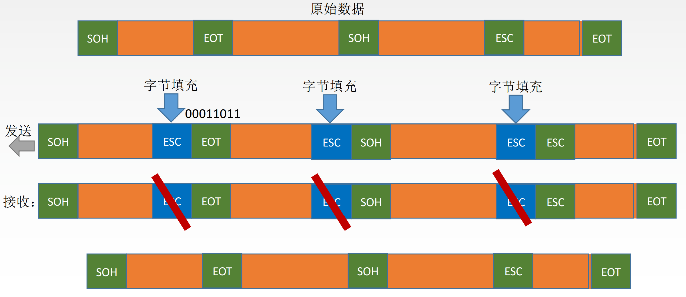

# 数据链路层

**概览：**

**[:question: 数据链路层基本概念](#数据链路层基本概念)**  
**[:question: 数据链路层的功能](#数据链路层的功能)**  
**[:question: 组帧](#组帧)**  
**[:question: 差错控制](#差错控制)**  
**[:question: 流量控制与可靠传输](#流量控制与可靠传输)**  
**[:question: 介质访问控制](#介质访问控制)**  
**[:question: 局域网](#局域网)**  
**[:question: 广域网](#广域网)**  
**[:question: 链路层设备](#链路层设备)**

## 数据链路层基本概念

数据链路层在物理层提供服务的基础上向网络层提供服务，其主要作用是加强物理传输原始比特流的功能，将物理层提供的可能出错的物理连接改造成无差错的数据链路，使之对网络层表现为一条无差错的链路

## 数据链路层的功能

- 为网络层提供服务
- 链路管理
- 组帧、帧定界、帧同步与透明传输
- 流量控制
- 差错控制

### 为网络层提供服务

| 服务类型             | 特点                                                                                                                                                    | 使用范围                                     |
| -------------------- | ------------------------------------------------------------------------------------------------------------------------------------------------------- | -------------------------------------------- |
| 无确认的无连接服务   | 源机器发送数据帧时不需要先建立链路连接，目的机器收到数据帧时不需要发回确认，对丢失的帧，数据链路层不负责重发而交给上层处理                              | 适用于实时通信或误码率较低的通信信道--以太网 |
| 有确认的无连接服务   | 源机器发送数据帧时不需要先建立数据链路，但目的机器收到数据帧时必须发回确认。  源机器所规定的时间内未收到确定信号，就重传丢失的帧，以提高传输的可靠性 | 适用于误码率较高的通信信道无线通信--无线通信 |
| 有确认的面向连接服务 | 帧传输过程分为三个阶段：建立数据链路、传输帧、释放数据链路。目的机器对收到的每一帧都给出确认，源机器收到确认后才能发送下一帧                            | 适用于通信要求（可靠性、实时性）较高的场合   |

### 链路管理

- 概述：链路层连接的建立、维持和释放过程称为链路管理，它主要用于面向连接服务
- 实现过程
  - 首先确认对方已处于就绪状态
  - 交换一些必要的信息以对帧序号初始化
  - 建立连接，在传输过程中则要维持连接，而在传输完毕后要释放连接

### 帧定界、帧同步与透明传输

- 组帧：两个工作站之间传输信息时，必须将网络层得分组封装成帧，以帧得格式进行传送
- 帧定界：将一段数据得前后分别添加首部和尾部身就构成了帧。首部和尾部中含有很多控制信息，其作用是确定帧的界限
- 帧同步：接收方应能从接收到的二进制比特流中区分出帧的起始与终止
- 透明传输：值不管所传送数据是什么样的比特组合，都应当能够在链路上传送。因此链路层就“看不见”有什么妨碍数据传输的东西。  
    当所传送数据中的比特组合恰巧与某一个控制信息完全一样时，就必须采取适当的措施，使收方不会将这样的数据误认为是某种控制信息。这样才能保证数据链路层的传输是透明的

### 流量控制

- 概述：接收双方各种的工作速率和缓存空间的差异，出现发送方的发送能力大于接收方的接收能力的现象，如不对其进行流量控制就会导致数据丢失
- 实现：通过控制发送方的发送速度，从而实现流量控制

### 差错控制

- 使发送方确定接收方是否正确收到由其发送的数据的方法
  - 位错：数据中的某些位出现错误
  - 帧错：帧的丢失、重复或失序等错误
- 解决方法
  - 解决位错：CRC 循环冗余码
  - 解决帧错：自动重传请求（ARQ）

## 组帧

### 功能实现

为了使接收方能正确地接收并检查所传输的帧，发送方必须依据一定的规则把网络层递交的分组封装成帧

解决问题：帧定界、帧同步、透明传输等

### 字符计数法

实现方法：在帧的头部使用一个计数字段来标明帧内的字符数  
缺点：如果计数字段出错，接收双方将失去同步而导致错误

### 字符填充的首位定界符法

- 当传送的帧是由文本文件组成时（文本文件的字符都是从键盘上输入的，都是ASCII码）。不管从键盘上输入什么字符都可以放在帧里传过去，即透明传输
- 当传送的帧是由非ASCII码的文本文件组成时（二进制代码的程序或图像时），就要采用字符填充方法实现透明传输

实现方法：使用一些特定的字符来定界一帧的开始（DLE &nbsp; STX）与结束（DLE &nbsp; STX）

### 零比特填充的首位标志法

实现方法：使用一个特定的比特模式，即 01111110 来标志一帧的开始和结束  
在发送信息时，遇到 5 个连续的 1 就自动在后面加 0  
当接收信息时，遇到 5 个连续的 1 就自动在后面减 0

优点：零比特填充发很容易由硬件实现，性能优于字符填充法

### 违规编码法

- 使用条件
  - 在物理层进行比特编码时，通常采用违规编码法
  - 违规编码法只适用于采用冗余编码的特殊编码环境
- 实现方法
  - 正常情况下：曼彻斯特编码中比特"1"编码成"高-低"电平，比特"0"编码成"低-高"电平
  - 违规编码：曼彻斯特编码中比特"1"编码成"高-高"电平，比特"0"编码成"低-低"电平

_借用这些违规编码序列来定界帧的起始和终止_

## 差错控制

### 概要

影响因素：信道固有噪声干扰；解决方法：提高信噪比  
但外界的冲击噪声是产生差错的重要原因，没有办法通过提高信号幅度来降低干扰

### 利用编码技术进行差错控制

- 自动重传请求 ARQ：接收端检测出差错时，就设法通知发送端重发，直到接收到正确的码字为止
- 向前纠错 FEC：接收端不但能发现差错，而且能确定比特串的错误位置，从而加以纠正

### 检错编码

- 奇偶校验码：n-1 位数据和 1 位校验位组成，校验位用于调节发送信息中的 1 的个数是奇数还是偶数
- 循环冗余码：任何一个由二进制数位串组成的代码都可以与一个只含有 0 和 1 两个系数的多项式建立一一对应关系
  - 计算步骤 1：假设一个帧有 m 位，其对应的多项式为 M(x)
  - 计算步骤 2：加 0：假设 G(x)的阶为 r，在帧的低位端加上 r 个 0
  - 计算步骤 3：模 2 除，利用模 2 除法，用 G(x)对应的数据串除去 1 步骤中计算出的数据串，即得到的余数即为冗余码（共 r 位，前面的 0 不可省略）

### 纠错编码

海明码

- 原理：当有效信息为中加入几个校验位形成海明码，并把海明码的每个二进制位分配到几个奇偶校验码中，当某一位出错后，就会引起有关的几个校验位的值发生变化，这不但可以发现错位，而且能指出错位的位置
- 计算步骤
  1. 设 n 为有效信息的位数，k 为校验位的位数，则信息为 n 和校验位 k 应满足
  2. 确定校验位的分布，规定校验位在海明位号为位置上，其余各位为信息位
  3. 分组形成校验关系，被校验数据位的海明位号等于校验该数位的各校验位海明位号之和
  4. 校验位取值，校验位的值为对应组的所有位求异或

## 流量控制与可靠传输

### 流量控制、可靠传输与滑动窗口机制

流量控制涉及对路上的帧的发送速率的控制，以使接收方有足够的缓冲空间来接收每个帧

#### 停止-等待流量控制

基本原理：每次只允许发送一帧，然后就陷入等待接收方确认信息的过程，因而传输效率很低。如果接收方不反馈应答信号，那么传送方一直等待

#### 滑动窗口流量控制

基本原理：

- 发送方都维持一组连续的允许发送的帧的序号，称为发送窗口。（发送窗口用来进行流量控制）
- 接收方也维持一组连续的允许接收帧的序号，称为接收窗口
- 发送方：发送窗口的大小代表在还未收到对方确认信息的情况下发送方最多还可以发送多少个数据帧
- 接收方：接收窗口是为了控制可以接收哪些数据帧和不可接收哪些帧

_帧的序号落入接收窗口之内，将该数据帧收下_  
_帧的序号落在接收窗口之外，则将其丢弃_

机制特点

- 只有接收窗口向前滑动（同时接收方发送了确认帧）时，发送窗口才有可能（只有发送方收到确认帧后才一定）向前滑动
- 接收窗口的大小为 1 时，可保证帧的有序接收
- 数据链路层的滑动窗口协议中，窗口的大小在传输过程中是固定的

#### 可靠传输机制

通常使用确认和超时重传两种机制

基本概念

- 确认帧：是一种无数据的控制帧，这种控制帧使得接收方可以让发送方知道哪些内容被正确接收
- 稍待确认：为了提高传输效率，将确认捎带在一个回复帧中
- 超时重传：发送方在发送某个数据帧后就开启一个计时器，一定时间内如果没有得到发送的数据帧的确认帧，那么就重新发送该数据帧，直到发送成功为止
- 自动重传请求：接收方请求发送方重传出错的数据帧来恢复出错的帧，是通信中用于处理信道所带来差多的方法。（停止等待 ARQ、后退 N 帧 ARQ、选择性重传 ARQ）

### 单帧滑动窗口与停止-等待协议

从滑动窗口机制角度看，停止-等待协议相当于发送窗口和接收窗口大小均为 1 的滑动窗口协议  
在停止-等待协议中，除了数据帧丢失外，还有其他两种差错  
1.到达目的站的帧可能已遭破坏；解决方案：装备计时器，计时器计满时仍未收到确认，那么再次发送相同的帧，直到该数据帧无错误地到达为止  
2.数据帧正确而确认帧被破坏；解决方案：发送方重传已被接收的数据帧，接收方收到同样的数据帧时丢弃该帧，并重传一个对该帧对应的确认帧

帧缓冲区  
目的：为了超时重发和预判重复帧的需要  
实现方法：发送端在发完数据帧时，必须在其发送缓存中保留此数据帧的副本，这样才能在出差错时进行重传。只有在收到对方发来的确认帧 ACK 时，方可清除此副本

### 多帧滑动窗口与后退 N 帧协议（GBN）

- 后退 N 帧式 ARQ
  - 发送方连续发送帧，当接收方检测出失序的信息帧后，要求发送方重发最后一个正确接收的信息帧之后的所有未被确认的帧（累计确认）
  - 优点：连续发送数据帧而提高了信道的利用率
  - 缺点：若信道的传输质量很差导致误码率较大时，后退 N 帧协议不一定有优于停止-等待协议
- 窗口大小：n 比特编号
- GBN 协议重点总结
  - 累积确认（偶尔捎带确认）
  - 接收方只按顺序接收帧，无序无情丢弃
  - 确认序列号最大的、按序到达的帧
  - 发送窗口最大为，接收窗口大小为 1

### 多帧滑动窗口与选择重传协议（SR）

选择重传

- 每个发送缓冲区对应一个计时器，当计时器超时时，缓冲区的帧就会重传
- 一旦接收方怀疑帧出错，就会发一个否定帧 NAK 给发送方，要求发送方对 NAK 中指定的帧进行重传
- 接收端要设置具有相当容量的缓冲区来暂存那些未按序正确收到的帧
- 优点：提高了信道的利用率
- 缺点：需要开辟缓存空间来存储数据

窗口大小：n 比特编号

## 介质访问控制

### 概述

主要任务：为使用介质的每个结点隔离来自同一信道上其他结点所传送的信号，以协调活动结点的传输  
介质访问控制子层：用来决定广播信道中信道分配  
常见的介质访问访问控制方法：

- 信道划分介质访问控制（静态划分信道）
- 随机访问介质访问控制（动态分配信道）
- 轮询访问介质访问控制（动态分配信道）

### 信道划分介质访问控制

信道划分介质访问控制将使用介质的每个设备与来自同一通信信道上的其他设备的通信隔离开来，把时域和频域资源合理地分配给网络上的设备

多路复用技术：多个信号组合在一条物理信道上进行传输，使多个计算机或终端设备共享信道资源；优点：提高了信道的利用率

信道划分介质访问控制分类

- 频分多路复用（FDM）
  - 将多路基带信号调制到不同频率的载波上，再叠加成一个复合信号
  - 优点：充分利用传输介质的带宽，系统效率高
  - 缺点：需要在相邻信道之间加入保护频带防止子信道相互干扰
- 时分多路复用（TDM）
  - 时分多路复用是一条将物理信道按时间分成若干时间片，轮流地分配给多个信号使用
  - 缺点：由于计算机数据的突发性，对于子信道的利用率不高
  - 优化：统计时分多路复用（STDM，异步时分多路复用）
    - 采用 STDM 帧，STDM 帧不固定分配时隙，而按需动态地分配时隙
    - 提高线路的利用率
- 波分多路复用（WDM）
  - 在一根光纤中传输多种不同波长（频率）的光信号，由于波长（频率）不同，各路光信号互不干扰，最后再用波长分解复用器将各路波长分解出来
- 码分多路复用（CDM）
  - 采用不同的编码来区分各路原始信号的一种复用方式。与 FDM 和 TDM 不同，它即恭喜信道的频率，又共享时间
  - 码分多址（Code Division Multiple Access.CDMA）
    - 每比特时间被分成 N 个更短的时间槽，称为码片（Chip）
    - 发送 1 时，站点发送码片序列，发送 0 时，站点发送码片序列的反码
    - 多个站点发送数据：各个站点的码片序列相互正交，从而从信道中分离出各路信号

### 随机访问介质访问控制

不采用集中控制方式解决发送信息的次序问题，所有用户能根据自己的意愿随机地发送信息，占信道全部速率

#### ALOHA 协议

- 纯 ALOHA 协议
  - 思想：当网络中地任何一个站点需要发送数据时，可以不进行任何检测就发送数据，在一段时间内未收到确认，那么该站点就认为传输过程中发生了冲突。发送站点需要等待一段时间后再发送数据，直至发送成功
  - 缺点：数据碰撞地概率很大，所以网络地吞吐量很低
- 时隙 ALOHA 协议
  - 思想：所有各站在时间上同步起来，并将时间划分为一段段等长地时隙，规定只能在每个时隙开始时才发送一个帧
  - 优点：避免了用户发送数据的随意性；减少了数据产生冲突的可能性；提高了信道的利用率
  - 缺点：每个用户都是想发就发，碰撞概率还是很大

#### CSMA 协议

- 1-坚持 CSMA
  - 思想：一个结点要发送数据时，首先侦听信道
    - 如果信道空闲，那么立即发送数据
    - 如果信道忙，那么等待，同事继续侦听直至信道空间
    - 如果发生冲突，那么随机等待一段时间后，再重新开始侦听信道
  - 缺陷：传播时延对协议的性能影响较大；存在碰撞现象
- 非坚持 CSMA
  - 思想：一个结点要发送数据时，首先侦听信道
    - 如果信道空闲，那么立即发送数据
    - 如果信道忙，那么放弃侦听，等待一个随机的时间后再重复该过程
  - 优点：降低了多个结点等待信道空闲后同时发生数据导致冲突的概率
  - 缺点：增加数据在网络中的延迟时间
- p-坚持 CSMA
  - 思想：一个结点要发送数据时，首先侦听信道
    - 如果信道忙，就持续侦听，直至信道空闲
    - 如果信道空闲，那么以概率 p 发送数据，以 1-p 概率推迟到下一个时隙（依次循环）
  - 优点：降低了冲突概率；减少了时间延迟

#### CSMA/CD协议

适用于总线形成网络或半双工网络环境  
思想：发送数据时先广播告知其他结点，让其他结点在某段时间内不要发送数据，以免出现碰撞  
基本概念：

- 载波侦听多路访问/碰撞检测协议是CSMA协议的改进方案
- 载波侦听：发送前先侦听，即每个站在发送数据之前要检测一下总线上是否又其他站点正在发送数据，若有则暂时不发生数据，等待信道变为空闲时再发送
- 碰撞检测：就是边发送边侦听，即适配器边发送边检测信道上信号电压的变化情况，以便判断自己在发送数据时其他站点是否也在发送数据
- 最小帧长=总线传播时延×数据传输率×2
- 争用期：以太网端到端的往返时间，只有度过了争用期才能确定本次传输不会发生冲突

二进制指数退避算法解决碰撞

- 基本概念：定义参数K作为第几次重传；取其中一个数为r（r*争用期）所得数值即为退避等待时间；重传16次不成功，则认为此帧永远无法发出，丢弃此帧，并向高层报告
- 优点：重传需要推迟的平均时间随重传次数的增大而增大，降低发生碰撞的概率，有利于整个系统的稳定

#### CSMA/CA协议

- 适用于总线型网络或半双工网络环境
- 思想：发送前侦听，边发送边侦听，一旦出现碰撞马上停止发送
- 注意：无线网络不能使用该协议
  - 接收信号的强度往往会远小于发送信号的强度，且在无线介质上信号强度的动态变化范围内很大
  - 并非所有的站点都能听见对方，存在“隐蔽站”问题
- 采用二进制指数退避算法
- 实现碰撞避免机制
  - 预约信道：发送方在发送数据的同时向其他站点通知自己传输数据需要的时间长度，让其他站点在这段时间内不发送数据，避免碰撞
  - ACK帧：所有站点在正确接收到发给自己的数据帧（除了广播帧和组播帧）后，都需要像发送方发回一个ACK帧
    - 接收失败，那么不采取任何行动
    - 在规定的时间内如果未收到ACK帧，那么认为发送失败，此时进行该数据帧的重发，直到收到ACK帧或达到规定重发次数为止
  - RTS/CTS帧：可选的碰撞避免机制，主要用于解决无线网中的隐蔽站问题

#### CSMA/CD与CSMA/CA区别

- CSMA/CD可以检测冲突，但无法避免；CSMA/CA发送包的同时不能检测到信道上有无冲突
- CSMA/CD用于总线形成以太网，CSMA/CA用于无线局域网802.1.la/b/g/n等
- CSMA/CD通过电缆中的电压变化来检测；而CSMA/CA采用能量检测、载波检测和能量载波混合检测三种检测信道空闲的方式

#### 轮询访问介质访问控制

令牌传递协议：

- 通过一个集中控制的监控站，以循环方式轮询每个结点，再决定信号的分配
- 令牌在固定次序中转圈，拿到令牌就可以发送数据
- 适用于负载很高的广播信道

## 局域网

### 基本概念

- 在一个较小的地理范围（如一所学校）内，将各种计算机、外部设备和数据库系统等通过双绞线、同轴电缆等连接介质互相连接起来，组成资源和信息共享的计算机互联网络
- 特点
  - 为一个单位所拥有，且地理范围和站点数目均有限
  - 所有站点共享较高的总带宽（即较高的数据传输率）
  - 较低的时延和较低的误码率
  - 各站为了平等关系而非主从关系
  - 能进行广播和组播
- 局域网的特性主要由三个要素决定：拓扑结构、传输介质、介质访问控制方式，最重要的是介质访问控制方式，它决定着局域网的技术特性
- 常见的局域网拓扑结构
  - 星形结构
  - 环形结构
  - 总线型结构
  - 星形和总线型结合的复合型结构
- 传输介质：双绞线（主流）、铜缆、光纤
- 介质访问控制方法
  - CSMA/CD-总线型局域网
  - 令牌总线-总线型局域网
  - 令牌环-环形局域网
- 局域网拓扑实现
  - 以太网：逻辑拓扑是总线形结构，物理拓扑是星形或拓展星形结构
  - 令牌环：逻辑拓扑是环形结构，物理拓扑是星形结构
  - FDDI：逻辑拓扑是环形结构，物理拓扑是双环结构
- 逻辑链路控制（LLC）子层：向网络层提供无确认无连接、面向连接、带确认无连接、告诉传送4种不同的连接服务类型
- 媒体接入控制（MAC）子层：向上屏蔽对物理层访问的各种差异，提供对物理层的统一访问接口，主要功能包括：组帧和拆卸帧、比特传输差错检测、透明传输

### 以太网与IEEE802.3

- 采用总线形拓扑结构
- 简化通信
  - 采用无连接的工作方式（尽最大努力交付）
  - 差错的纠正由高层完成
- 传输介质的使用情况
  | 参数 | 10BASE5 | 10BASE2 | 10BASE-T | 10BASE-FL |
  | --- | ------- | -------- | -------- | --------- |
  | 传输媒体 | 基带同轴电缆（粗缆） | 非屏蔽双绞线 | 光纤对（850nm）|
  | 编码 | 曼彻斯特编码 | 曼彻斯特编码 | 曼彻斯特编码 | 曼彻斯特编码 |
  | 拓扑结构 | 总线形 | 总线形 | 星形 | 点对点 |
  | 最大段长 | 500m | 185m | 100m | 2000m |
  | 最多结点数目 | 100 | 30 | 2 | 2 |
- 网卡
  - 局域网中连接计算机和传输介质的接口
  - 功能
    - 实现与局域网传输介质之间的物理连接和电信号匹配
    - 实现帧的发送与接收、帧的封装与拆封、介质访问控制、数据的编码与解码及数据缓存功能
- 介质访问控制（MAC）地址
  - 网卡在出厂时都有一个唯一的代码
  - 用于控制主机在网络上的数据通信
- 以太网的MAC帧
  - 网卡从网络上每收到一个MAC帧，首先要用硬件检查MAC帧中的MAC地址。如果是发往本站的帧，那么就收下，否则丢弃
  - 结构组成
    - 地址：通常使用6字节（48bit）地址
    - 类型：2字节，指出数据域中携带的数据应交给哪个协议实体处理
    - 数据：46~1500字节，包含高层的协议消息。由于CSMA/CD算法的限制，以太网帧必须满足最小长度要求64字节，数据较少时必须加以填充（0-46字节）
    - 填充：0~46字节，当帧长太短时填充帧，使之达到64字节的最小长度
    - 校验码（FCS）：采用CRC循环冗余码

### 高速以太网

- 100BASE-T以太网
  - 在双绞线上传送100Mb/s基带信号的星形拓扑机构以太网
  - 使用CSMA/CD协议（半双工）
  - 支持全双工方式，支持半双工方式
- 吉比特以太网
  - 在1Gb/s下用全双工和半双工两种工作方式
  - 半双工方式下使用CSMA/CD协议
- 10吉比特以太网
  - 使用光纤作为传输媒体
  - 只工作在全双工方式，因此没有争用问题，也不使用CSMA/CD协议

### IEEE 802.11

- IEEE 802.11是无线局域网的一系列协议标准，包括802.11a和802.11b。他它们制定了MAC层协议，运行在多个物理层标准上
- 有固定基础设施无线局域网
  - 802.11标准规定无线局域网的最小构建是基本服务集（BSS）
  - 组成：一个基本服务集包括一个基站和若干移动站
  - 所有的站在本BSS内都可以直接通信，但在与本BSS外的站通信时都要通过本BSS的基站
- 无固定基础设施无线局域网自组织网络
  - 由一些平等状态移动站相互通信组成的临时网络，各结点之间地位平等，中间结点都为转发结点，这些结点都具有路由器功能
  - 移动自组织网络把移动性扩展到无线领域中的自治系统，具有自己特定的路由选择协议，并且可以不和因特网相连

### 令牌环网的基本原理

- 令牌环网的每一站通过与环接口干线耦合器（TCU）相连。TCU的主要作用是，传递所有经过的帧，为接入站发送和接收数据提供接口
- 控制机制
  - 分布式控制模式的循环方法
  - 拿到令牌就可以占有信道发送数据
- 物理上采用星形拓扑结构，但逻辑上仍是环形拓扑结构

## 广域网

### 广域网的基本概念

通常是覆盖范围很广的长距离网络  
广域网由节点交换机以及连接这些交换机的链路组成。结点交换机用来分组存储和转发

### 广域网与局域网对比

| 名称 | 覆盖范围 | 连接方式 | OSI层次 | 着重点 |
| --- | ------ | -------- | -------- | ----- |
| 广域网 | 很广，通常跨区域 | 点到点连接 | 物理层、数据链路层、网络层 | 强调资源共享 |
| 局域网 | 较小，通常在一个区域内 | 多点接入 | 物理层、数据链路层 | 强调数据传输 |

### PPP协议

- 概要：使用串行线路通信的面向字节的协议，该协议应用在直接连接两个结点的链路上
- 目的：主要是用来通过拨号或专线方式建立点对点连接发送数据
- PPP协议是在SLIP协议的基础上发展而来的，它既可以在异步线路上传输，又可在同步线路上使用；不仅用于Moderm链路，也用于租用的路由器到路由器的线路
- 背景：SLIP主要完成数据包的传送，但没有寻址、数据检验、分组类型识别和数据压缩等功能，只能传送IP分组
- 组成部分
  - 链路控制协议（LCP）：一种扩展链路控制协议，用于建立、配置、测试和管理数据链路
  - 网络控制协议（NCP）：PPP协议允许同时采用多种网络层协议，每个不同的网络层协议要用一个相应的NCP来配置，为网络层协议建立和配置逻辑连接
  - 一个将IP数据报封装到串行链路得方法：IP数据报在PPP帧中就是其信息部分，这个信息部分得长度受最大传送单位（MTU）的限制
  - 注意
    - PPP提供差错检测但不提供纠错功能，只保证无差错接收（通过硬件进行CRC校验）。它是不可靠的传输协议，因此也不使用序号的确认机制
    - 它仅支持点对点的链路通信，不支持多点线路
    - PPP只支持全双工链路
    - PPP的两端可以运行不同的网络层协议，但仍可使用同一个PPP进行通信
    - PPP是面向字节的，当信息字段出现和标志字段一致的比特组合时
      - PPP用在异步线路（默认），则采用字节填充法
      - PP用在SONET/SDH等同步线路，则协议规定采用硬件来完成比特填充（和HDLC的做法一样）

### HDLC协议

- 概要
  - 数据报文可透明传输，用于实现透明传输的0比特插入法易于硬件实现
  - 全双工通信，有较高的数据链路传输效率
  - 传输控制功能与处理功能分离，具有较大的灵活性
  - 所有帧采用CRC检验，对信息帧进行顺序编号，可防止漏收或重发，传输可靠性高
- 两种配置方式
  - 非平衡配置的特点是由一个主站控制整个链路的工作
  - 平衡配置的特点是链路两端的两个站都是复合站，每个复合站都可以平等地发起数据传输，而不需要得到对方复合站的允许
- 站类型
  - 主站：负责控制链路的操作，主站发出的帧称为命令帧
  - 从站：受控于主站，按主站的命令进行操作，发出的帧称为响应帧
  - 复合站：可以发出命令帧和响应帧
- 数据操作方式
  - 常响应方式：这是一种非平衡结构操作方式，即主站向从站传输数据，从站响应传输，但从站只有在收到主站许可后，才进行响应
  - 异步平衡方式：这是一种平衡结构操作方式，在这种方式中，每个复合站都可以进行对另一站的数据传输
  - 异步响应方式：这是一种非平衡结构操作方式，在这种方式中，从站即使未受到主站的允许，也可进行传输
- HDLC帧
  - 信息帧（D）：第1位为0，用来传输数据信息，或使用捎带技术对数据进行确认
  - 监督帧（S）：第1、2位分别为1、0，用于流量控制和差错控制，执行对信息帧的确认、请求重发和请求暂停发送等功能
  - 无编号帧（U）：第1、2位均为L用于提供对链路的建立、拆除等多种控制功能

## 数据链路层设备

### 网桥的概念及其基本原理

- 概念：两个或多个以太网通过网桥连接后，就成为一个覆盖范围更大的以太网，而原来的每个以太网就称为一个网段。网桥工作在链路层的MAC子层，可以使用以太网各网段称为隔离开的碰撞域
- 基本特点
  - 具备寻址和路径选择能力，可以确定帧的传输方向
  - 从源网络接收帧，以目的网络的介质访问控制协议向目的网络转发该帧
  - 网桥在不同或相同类型的LAN之间存储并转发帧，必要时还进行链路层上的协议转换
  - 网桥对接受的帧不做任何修改，或只对帧的封装格式做得很少的修改
  - 可以把原协议的信息段的内容作为另一种协议的信息部分封装在帧中
  - 有足够大的缓冲空间
- 优点
  - 能过滤通信量
  - 扩大了物理范围
  - 可使用不同的物理层
  - 可互联不同类型的局域网
  - 提高了可靠性
  - 性能得到改善
- 缺点
  - 增大了时延
  - 只适用于用户数不多的和通信量不大的网络
  - 没有流量控制功能
  - 不同MAC子层的网段桥接在一起需要进行帧格式转换

### 路径选择算法

#### 透明网桥（选择的不是最佳路由）

建立转发表，采用自学习算法处理收到的帧

工作原理：

- 如果源LAN和目的LAN相同，那么丢弃该帧
- 如果源LAN和目的LAN不同，那么转发该帧
- 如果目的LAN未知，那么扩散该帧

#### 源路由网桥（选择的是最佳路由）

路由选择由发送数据帧的源站负责，网桥只根据数据真正的路由信息对帧进行接收和转发，源站以广播方式向目的站发送一个发现帧作为探测之用，然后根据经过的结点生成最佳路径

缺陷：如果发现帧过多，会导致网络出现阻塞

### 局域网交换机及其工作原理

#### 局域网交换机

局域网交换机又称以太网交换机，从本质上说，以太网交换机是一个多端口的网桥，能经济地将网络分成小的冲突域，为每个工作站提供更高的带宽

优点：

- 对工作站是透明的，管理开销低廉
- 简化了网络结点的增加、移动和网络变化的操作
- 方便地实现虚拟局域网（VLAN），VLAN可以隔离冲突域，而且可以隔离广播域

#### 原理

检测从以太端口来的数据帧的源和目的地的MAC（介质访问层）地址，然后与系统内部的动态查找表进行比较，若数据帧的MAC地址不在查找表中，则将该地址加入查找表，并将数据帧发送给相应的目的端口

#### 特点

- 工作在全双工方式
- 碰撞地传输数据
- 转发表也是通过自学习算法自动地逐渐建立起来的
- 使用了专用的交换结构芯片，因此交换速率较高
- 独占传输媒体地带宽

#### 两种交换模式

- 直通式交换机：只检查帧的目的地址，数据帧可以马上就被传输出去
  - 优点：速度快
  - 缺点：缺乏智能性和安全性，也无法支持具有不同速率地端口的交换
- 存储转发式交换机：先将接收到的帧缓存，然后检查数据是否正确，正确就发送，发现帧错，那么就将其丢弃
  - 优点：可靠性高，并能支持不同速率端口间的转换
  - 缺点：延迟较大
