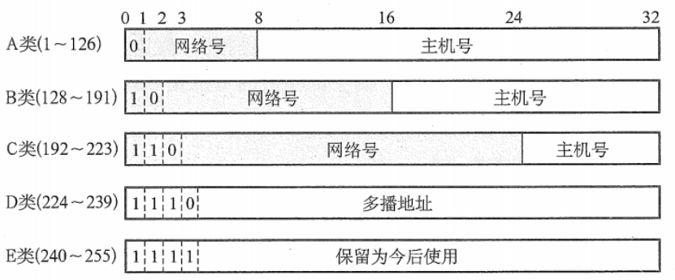

# 网络层

**概览：**

**[:question: 网络层的功能](#网络层的功能)**  
**[:question: 路由算法](#路由算法)**  
**[:question: IPV4](#ipv4)**  
**[:question: IPV6](#ipv6)**  
**[:question: 路由协议](#路由协议)**  
**[:question: IP 组播](#ip-组播)**  
**[:question: 移动 IP](#移动-ip)**  
**[:question: 网络层设备](#网络层设备)**

## 网络层的功能

网络层的功能主要包括异构网络互联、路由与转发、拥塞控制

### 异构网络互联

- 异构网络：不同的寻址方案、不同的网络接入机制、不同的差错处理方法、不同的路由选择机制等
- 网络互联：将两个以上的计算机网络，通过一定的方法，用一种或多种通信处理设备（即中间设备）相互连接起来，以构成更大的网络系统
- 中继系统
  - 物理层中继系统：中继器、集线器
  - 数据链路层中继系统：网桥或交换机
  - 网络层中继系统：路由器、TCP/IP 体系在网络互联上采用的做法是在网络层（即 IP 层）采用标准化协议，相互连接的网络可以是异构的
  - 网络层上中继系统：网关
  - _使用物理层或数据链层中继系统时，只是把一个网络扩大了，从网络层角度看，它仍然是同一个网络，但一般并不称之为网络互联_
- 虚拟互联网络：也就是逻辑互联网络，即互联起来的各种物理网络的异构性本来是客观存在的，但是通过使用 IP 就可以使这些性能各异的网络在网络层上看起来好像是一个统一的网络
  - 优点：互联网上的主机进行通信时，就好像在一个网络上通信医药，而看不见互联的具体的网络异构细节（如具体的编址方案、路由选择协议等）

### 路由与转发

#### 路由选择 - 确定哪一条路径

根据特定的路由选择协议构造出路由表，同时经常或定期地和相邻路由交换路由信息而不断地更新和维护路由表。按照复杂地分布式算法，根据从各相邻路由器所得到地关于整个网络拓扑地变化情况，动态地改变所选择地路由

#### 分组转发 - 当一个分组到达时所采取的动作

处理通过路由器的数据流，关键操作是转发表查询、转发以及相关的队列管理和任务调度等

路由器根据转发表将用户 IP 数据报从合适的端口转发出去

### 拥塞控制

- 通信子网中，因出现过量的分组而引起网络性能下降的现象称为拥塞
- 判断拥塞状态方法
  - 轻度拥塞：随着网络负载的增加，网络的吞吐量明显小于正常的吞吐量
  - 拥塞状态：网络的吞吐量随着网络的负载的增大而下降
  - 死锁状态：网络的负载继续增大，而网络的吞吐量下降到零
- 避免拥塞现象：获取网络中发生拥塞的信息，从而利用这些信息进行控制，以避免由于阻塞而出现分组的丢失，以及严重阻塞而产生网络死锁的现象
- 作用：确保子网能够承载所达到的流量
- 实现方法
  - 合理优化主机、路由器及路由器内部的转发处理过程
  - 单一地增加资源并不能解决拥塞
- 流量控制和拥塞控制的区别
  - 流量控制所要作的是抑制发送端发送数据的速率，以便使接收端来得及接受
  - 拥塞控制必须确保通信子网能够传送待传送的数据，是一个全局性的问题，涉及网络中所有的主句、路由器及导致网络传输能力下降的所有因素
- 拥塞控制方法

|      | 开环控制                                                           | 闭环控制                                                                                                   |
| ---- | ------------------------------------------------------------------ | ---------------------------------------------------------------------------------------------------------- |
|      | 设计网络时事先将有关阻塞的因素考虑周到，力求网络在工作时不产生阻塞 | 实现不考虑发生阻塞的各种因素，采用监测网络系统去监视，及时检查哪里发生了拥塞，然后将拥塞信息传到合适的地方 |
| 优点 | 一种静态的预防方法，一旦系统启动运行，中途就不再需要修改           | 基于反馈环路的概念，是一种动态的方法                                                                       |

## 路由算法

### 静态路由与动态路由

|          | 静态路由算法（又称非自适应路由算法）                                                                                       | 动态路由算法（又称自适应路由算法）                                                                                                                                      |
| -------- | -------------------------------------------------------------------------------------------------------------------------- | ----------------------------------------------------------------------------------------------------------------------------------------------------------------------- |
| 概念     | 由网络管理员手工配置的路由信息，当网络的拓扑结构或链路的状态发生变化时，网络管理员需要手工去修改路由表中相关的静态路由信息 | 路由器上的路由表项是通过相互连接的路由之间彼此交换信息，然后按照一定的算法优化出来的  路由信息会在一定时间间隙不断更新，以适应不断变化的网络，随时获得最优的寻路效果 |
| 优点     | 简单、可靠，在负荷稳定和拓扑变化不大的网络中运行效果很好                                                                   | 改善网络性能并有助于流量控制                                                                                                                                            |
| 缺点     | 大型和复杂的网络环境不宜采用 管理员难以全面了解网络拓扑结构 发生变化后需要大范围修改和调整路由信息                   | 算法复杂，会增加网络负担 对动态变化的反应太快而引起振荡，或反应太慢而影响网络路由的一致性                                                                            |
| 使用范围 | 广泛用于高度安全的军事系统和较小的商业网络                                                                                 |                                                                                                                                                                         |

### 动态路由算法

#### 距离-向量路由算法

- 原理：所有结点都定期地将它们的整个路由选择表传送所有与之直接相邻的结点
- 路由表选择内容：每条路径的目的地（另一个结点）、路径的代价（也称距离）
- 更新路由表的条件
  - 被通告一条新的路由，该路由在本结点的路由表中不存在，此时本地系统加入这条新的路由
  - 来的路由信息中有一条到达某个目的地的路由，该路由与当前使用的路由相比，有较短的距离（较小的代价）
- 缺点：容易出现路由环路问题
- 最常见的算法是 RIP 算法，它采用"跳数"作为距离的度量

#### 链路状态路由算法

- 原理：链路状态路由算法要求每个参与该算法的结点都具有完全的网络拓扑信息；主动测试所有的相邻结点状态；定期地将链路状态传播给所有其他结点（或路由结点）
- 特点
  - 使用泛洪法向相邻地路由器发送信息，然后相邻路由器又向其他相邻路由器发送信息
  - 发送的信息是与路由器相邻地所有路由器地链路状态，但这只是路由器所知道地部分信息
  - 只有当链路状态发生变化时，路由器才向所有路由器发送此信息
- 适用范围：用于大型的或路由信息变化聚敛地互联网环境
- 优点
  - 每个路由结点都是用同样地原始状态数据独立地计算路径，而不依赖中间结点的计算
  - 链路状态报文不加改变地传播，因此采用该算法易于查找故障
  - 当一个结点从所有其他结点接收报文时，它可以在本地立即计算正确的通路，保证一步汇聚
  - 链路状态算法比距离-向量算法有更好的规模可伸展性
- 典型的算法是 OSPF 算法

### 层次路由

- 背景：当网络规模扩大时，路由器的路由表成比例地增大，这不仅会小号越来越多的路由器缓冲区空间，而且需要更多 CPU 时间来扫描路由表，用更多的带宽来交换路由状态信息
- 路由选择协议
  - 内部网关协议(IGP)：自治系统内部所使用的路由器选择协议；RIP；OSPF
  - 外部网关协议(EGP)：不同自治系统的路由器之间交换路由信息，并负责为分组在不同自治系统之间选择最优的路径；BGP
- 特点
  - 每个路由器都知道在本区域内如何把分组路由到目的地的细节，但不用知道其他区域的内部结构
  - 是交换信息的种类增多，但也会使 OSPF 协议更加复杂

## IPV4

### 概述

- IPV4 即现在普遍使用的 IP（版本 4）
- IP 定义数据传送的基本单元-IP 分组及其确切的数据格式
- IP 也包括一套规则，指明分组如何处理、错误怎样控制
- 包含非可靠投递的思想，以及与此关联的分组路由选择的思想

### IPV4 分组

#### IPV4 分组格式

- 版本：指 IP 版本，目前广泛使用的版本号是 4
- 首部长度：占 4 位。基本单位为 4B，最大值为 60B（15\*4B），最常用的首部长度是 20B
- 总长度：占 16 位。基本单位为 1B，指首部与数据之和的长度，最大长度 65535B
- 标识：占 16 位。是一个计数器，用于保证数据报片能够正确组装称为原来的数据报
- 标志：占 3 位。最低位 MF=1 代表分片，中间为 DF=0 代表可以分片
- 片偏移：占 13 位。基本单位为 8B，指出分片后，某片在原分组中的相对位置
- 首部校验和：占 16 位。IP 数据报的首部校验和只校验分组的首部，而不校验数据报部分
- 生存时间 TTL：占 8 位。保证分组不会在网络中循环，每次路由转发 TTL-1，当 TTL 为 0 时丢弃该分组
- 协议：占 8 位。指出该分组使用的协议（6 为 TCP 协议 17 为 UDP 协议）
- 源地址字段：占 4B。标识发送发的 IP 地址
- 目的地址字段：占 4B。标识接收方的 IP 地址

#### IP 数据报分片

- 最大传送单元（MTU）：一个链路层数据报能承载的最大数据量
- MTU：以太网 1500B；广域网一般不超过 576B
- 分片：当数据报长度大于链路 MTU 时，就要对其进行分片传输
- 分片会在目的地进行组装，不会在中间路由处进行组装

#### 网络层转发分组的流程

- 提取目的主机的 IP 地址
- 直接交付或者根据路由表进行转发交付
- 若找不到目标路由就发送给默认路由
- 如果最后没有成功转发，就报告分组出错

### IPV4 地址

- IP 地址：连接到因特网上的每台主机（或路由器）都分配一个 32 比特的全球唯一的标识符
- 分类
  

- 特殊含义地址
  - 主机号全为 1 表示本网络的广播地址，又称直接广播地址，如 202.98.174.255
  - 主机号全为 0 表示网络本身，如 202.98.174.0
  - 127.0.0.0 保留为环路自检（Loopback Test）地址，此地址表示任意主机本身，目的地址为环回的 IP 数据报永远不会出现在任何网络上
  - 32 位全为 1，即 255.255.255.255 表示整个 TCP/IP 网络的广播地址，又称受限广播地址
  - 32 位全为 0，即 0.0.0.0 表示本网络上的本主机
  - 实际使用中，由于路由器对广播域的隔离，255.255.255.255 等效为本网络的广播地址

### 网络地址转换(NAT)

- 概述：通过将专用网络地址（如 Intranet）转换为公共地址（如 Internet），从而对外隐藏内部管理的 IP 地址
- 优点
  - 只需要一个全球 IP 地址就能与因特网连通，由于专用网本地 IP 地址是可重用的，所以 NAT 大大节省了 IP 地址的消耗
  - 隐藏了内部网络结构，从而降低了内部网络受到攻击的风险
- 具体实现：本地地址的主机和外界通信时，NAT 路由器使用 NAT 转换表将本地地址转换成全球地址，或将全球地址转换成本地地址
- 注意
  - 普通路由器在转发 IP 数据报时，不改变其源 IP 和目的 IP 地址
  - NAT 路由器在转发 IP 数据报时，一定要更换其 IP 地址
  - 普通路由器仅工作在网络层
  - NAT 路由器转发数据报时需要查看和转换传输层的端口号

### 子网划分与子网掩码、CIDR

#### 子网划分

- 背景：两级 IP 地址的缺点：IP 地址空间的利用率有时很低；两级的 IP 地址不够灵活、会使路由表变得太大而使网络性能变坏
- 概述：两级 IP 地址变成了三级 IP 地址
- 划分思路
  - 子网划分纯属一个单位内部的事情。单位对外仍然表现为没有划分子网的网络
  - 从主机号借用若干比特作为子网号，当然主机号也就相应减少了相同的比特
  - IP 地址={<网络号>,<子网号>,<主机号>}
  - 先找到连接到本单位网络上的路由器。然后该路由器在收到 IP 收据报后，按目的的网络号和子网号找到目的子网。最后把 IP 数据报直接交付给目的主机
- 注意：
  - 子网号全为 0 和全为 1 的不能作为主机号
  - 全为 0 为本网络号，全为 1 为子网的广播地址

#### 子网掩码

- 使用子网掩码来表达对原网络中主机号的借位
- 分类
  - A 类：255.0.0.0
  - B 类：255.255.0.0
  - C 类：255.255.255.0
- 使用子网掩码情况
  - 一台主机在设置 IP 地址的同时必须设置子网掩码
  - 同属一个子网的所有主机及路由器的相应端口，必须设置相同的子网掩码
  - 路由表中必须包含有目的网络地址，子网掩码，下一跳地址

#### 无分类域间路由选择（CIDR）

- 概述：无分类域间路由选择是在变长子网掩码的基础上提出的一种消除传统 A、B、C 类网络划分，并且可以在软件的支持下实现超网构造对的一种 IP 地址的划分方法
- 特点
  - 消除了传统 A、B、C 类地址以及划分子网的概念，因而可以更有效地分配 IPv4 地地址空间
  - IP={<网络前缀>,<主机号>}
  - 将网络前缀都相同地连续 IP 地址组成 CIDR 地址块，这种地址地聚合称为路由聚合，或称构成超网
  - 网络前缀越长，其地址块就越小，路由就越具体
- 优点
  - 有利于减少路由器之间地路由器选择信息地交换，提高网络性能
  - 网络前缀长度具有灵活性
- 查找路由表使用地数据结构方法-二叉线索树

### IP 地址与硬件地址

- 概述
  - IP 地址是网络层使用的地址，它是分层次等级的
  - 硬件地址是数据链路层使用的地址（如 MAC 地址），它是平面式的
  - 在网络层及网络层之上使用 IP 地址，IP 地址放在 IP 数据报的首部，而 MAC 地址放在 MAC 帧的首部
- 具体关系：在网络层中路由器相互传输时使用 IP 地址，当到达目的网络后，使用 MAC 地址擦护照目标物理主机
- 路由器
  - 拥有多个 IP 地址
  - 拥有多个硬件地址

### 地址解析协议（ARP）

- 作用：实现 IP 地址到 MAC 地址的映射
- ARP 表：每台主机都设有一个 ARP 高速缓存，用来存放本局域网上各主机和路由器的 IP 地址到 MAC 地址的映射表
- 可能出现的情况
  - 发送方是主机时，要把 IP 数据报发送到本网络上的另一台主机，这时用到 ARP 找到目的主机的硬件地址
  - 发送方是主机时，要把数据报发送到另一个网络上的一台主机，这时用 ARP 找到本网络上的一个路由器硬件地址，剩下的工作由这个路由器完成
  - 发送方是路由器时，要把 IP 数据报转发到本网络上的一台主机，这时用 ARP 找到目的主机硬件地址

### 动态主机配置协议（DHCP）

- 概述
  - 常用于给主机动态分配 IP 地址
  - 提供了即插即用联网的机制，这种机制允许一天计算机加入新的网络和获取 IP 地址，而不用手工参与
  - DHCP 是应用层协议，它是基于 UDP 的
- 实现过程
  - DHCP 客户机广播“DHCP 发现”消息，然后试图找到网络中的 DHCP 服务器
  - DHCP 服务器收到“DHCP 发现”消息后，向网络中广播“DHCP 提供”消息，其中包括提供 DHCP 客户机的 IP 地址和相关配置信息
  - DHCP 客户机收到“DHCP 提供”消息后，如果接收 DHCP 服务器所提供的相关参数，那么通过广播“DHCP”请求信息向 DHCP 服务器请求提供 IP 地址
  - DHCP 服务器广播“DHCP 确认”消息，将 IP 地址分配给 DHCP 客户机
- 注意
  - DHCP 服务器分配给 DHCP 客户的 IP 地址是临时的，因此 DHCP 客户只能在一段有限的时间内使用这个分配到的 IP 地址
  - DHCP 的客户端和服务器需要通过广播方式来进行交互

### 网际控制报文协议（ICMP）

- 目的：为了提高 IP 数据报交付成功的机会，在网络层使用了网际控制报文协议（ICMP）来让主机或路由器报告差错和异常情况
- 种类
  - ICMP 差错报告报文
    - 终点不可达：当路由器或主机不能交付数据报时，就向源点发送终点不可达报文
    - 源点抑制：当路由器或主机由于拥塞而丢弃数据报时，就像源点发送源点抑制报文，使源点知道应当把数据报的发送速率放慢
    - 时间超过：当路由器收到生存时间（TTL）为零的数据报时，除丢弃该数据报外，还要向源点发送时间超过报文
    - 参数问题：当路由器或目的主机收到的数据报的首部中有的字段的值不正确时，就丢弃该数据报，并向源点发送参数问题报文
    - 改变路由（重定向）：路由器把改变路由报文发送给主机，让主机知道下次应将数据报发给另外的路由器（可通过更好的路由）
  - ICMP 询问报文
    - 回送请求和回答报文
    - 时间戳请求和回答报文
    - 掩码地址请求和回答报文
    - 路由器询问和通告报文
  - 不应发送 ICMP 差错报告报文
    - 对 ICMP 差错报告报文不再发送 ICMP 差错报告报文
    - 对第一个分片的数据报片的所有后续数据报片都不发送 ICMP 差错报告报文
    - 对具有组播地址的数据报都不发送 ICMP 差错报告报文
    - 对具有特殊地址（如 127.0.0.1 或 0.0.0.0）的数据报不发送 ICMP 差错报文报告
- ICMP 的应用
  - 分组网间探测 PING
    - 测试两台主机之间的连通性
    - 使用了 ICMP 回送请求和回答报文
  - Traceroute
    - 用来跟踪分组经过的路由
    - 使用了 ICMP 时间超过报文

## IPV6

### IPV6 是解决 IP 地址耗尽得最根本方法，缓解方法是超网聚合 NAT 等

### IPV6 的主要特点

- 更大的地址空间 IPV6 将地址从 IPV4 的 32 位增大到了 128 位
- 扩展的地址层次结构
- 灵活的首部格式
- 改进的选项
- 允许协议继续扩充
- 支持即插即用（即自动配置）
- 支持资源的预分配
- IPV6 只有在包的源节点才能分片，是端到端的，传输路径中的路由器不能分片
- IPV6 首部长度必须是 8B 的整数倍，而 IPV4 首部是 4B 的整数倍
- 增大了安全性。身份验证和保密功能是 IPV6 的关键特征

### IPV6 地址

- 基本地址类型
  - 单播：传统的点对点通信
  - 多播：多播是一点对多点的通信，分组被交付到一组计算机的每台计算机
  - 任播：这是 IPV6 增加的一种类型。任播的目的站是一组计算机，但数据报在交付时只交付其中的一台计算机，通常是距离最近的一台计算机
- IPV6 地址缩写
  - 当 16 位域的开头有一些 0 时，可以采用一种缩写表示法，但在域中必须至少有一个数字
  - 当有相继的 0 值域时，还可以进一步缩写。这些域可以用双冒号缩写(::)

### IPV4 向 IPV6 过渡

- 双栈协议：双栈协议技术是指在一台设备上，同时装有 IPV4 和 IPV6 栈协议，那么这台设备既能和 IPV4 网络通信，也能和 IPV6 网络通信
- 隧道协议：将整个 IPV6 数据报封装到 IPV4 数据报的数据部分，使得 IPV6 数据报可以在 IPV4 网络的隧道中传输

## 路由协议

### 自治系统（AS）

单一技术管理下的一组路由器，这些路由器使用一种 AS 内部的路由选择协议和共同的度量来确定分组在该 AS 内的路由，同时还使用一种 AS 之间的路由选择协议来确定分组在 AS 之间的路由

### 域内路由与域间路由

#### 内部网关协议（IGP，域内路由选择）

在一个自治系统内部使用的路由选择协议

目前该路由选择协议使用最多，如 RIP 和 OSPF

#### 外部网关协议（EGP，域间路由选择）

源站和目的站处在不同的自治系统中，当数据报传到一个自治系统边界时（两个自治系统可能使用不同的 IGP）需要使用一种协议将路由选择信息传递到另一个自治系统中

目前使用最多的的外部网关协议是 BGP-4

### 路由信息协议（RIP）

#### 简介

内部网关协议（IGP）中最先得到广泛应用的协议，是一种分布式的基于距离向量的路由选择协议，其最大优点就是简单

#### 实现

- 路由信息在相邻路由之间交换
- 距离基本单位为“跳”，每到达一个路由器为一跳
- 最多允许 15 跳，超过 15 跳即为不可达
- 每 30s 广播一次 RIP 路由更新信息，建立并维护路由表（动态路由表）
- RIP 协议中没割网络的子网掩码必须相同

#### 特点

- 仅和相邻路由器交换信息
- 路由器交换的信息是当前路由器所知道的全部信息，即自己的路由表
- 按固定的时间间隔交换路由信息，如每隔 30s

#### 缺陷

- RIP 限制了网络的规模，它能使用的最大距离为 15（16 表示不可达）
- 路由器之间交换的是路由器中的完整路由表，因此网络规模越大，开销也就越大
- 网络出现故障时，会出现慢收敛现象（即需要较长时间
- 才能将此信息传送到所有路由器），俗称坏消息传得慢与使更新过程的收敛时间长

#### 优点

实现简单、开销小、收敛过程较快

### 开放最短路径优先（OSPF）协议

#### 简介

使用分布式链路状态路由算法的典型代表，也是内部网关协议（IGP）的一种

#### 实现

- OSPF 向本自治系统中的所有路由器发送信息，这里使用的方法是洪泛法
- 发送的信息是与本路由器相邻的所有路由器的链路状态
- 只有当链路状态发生变化时，路由器才用洪泛法向所有路由器发送此信息，并且更新过程收敛很快
- OSPF 是网络层协议，他不使用 UDP 或 TCP，而直接用 IP 数据报传送

#### 特点

- OSPF 对不同的链路可根据 IP 分组的不同服务类型（TOS）而设置成不同的代价
- OSPF 对于不同类型的业务可计算出不同的路由，十分灵活
- 负载平衡：如果到同一个目的网络有多条相同代价的路径，那么可以将通信量分配给这几条路径
- 所有在 OSPF 路由器之间交换的分组都具有鉴别功能，因而保证了仅在可信赖的路由器之间交换链路状态信息
- 支持可变长度的子网划分和无分类编址 CIDR
- 每个链路状态都带上一个 32 位的序号，序号越大，状态就越新
- 使用迪杰斯特拉算法
- 使用洪泛法，就像水波一样，相互交换路由表信息

#### 分组类型

- 问候分组，用来发现和维持相邻站的可达性
- 数据库描述分组，向临站给出自己的链路状态数据库中的所有链路状态项目的摘要信息
- 数据状态请求分组，向对方请求发送某些链路状态项目的详细信息
- 链路状态更新分组，用洪泛法对全网更新链路状态
- 链路状态确认分组，对链路更新分组的确认

### 边界网关协议（BGP）

#### 简介

- 是不同自治系统的路由器之间交换路由信息的协议，是一种外部网关协议
- 边界网关协议常用于互联网的网关之间
- BGP 采用的是路径向量路由选择协议
- 应用层协议，基于 TCP

#### 工作原理

- 每个自治系统的管理员要选择至少一个路由作为该自治系统的“BGP 发言人”
- 一个 BGP 发言人与其他自治系统中的 BGP 发言人要交换路由信息，先建立 TCP 连接，再利用 BGP 会话交换路由信息
- 所有 BGP 发言人都相互交换网络可达性的信息后，各 BGP 发言人就可找出到达各个自治系统的较好路由

#### 特点

- BGP 交换路由信息的结点数量级是自治系统的数量级，要比这些自治系统中的网络数少很多
- 每个自治系统中 BGP 发言人（或边界路由器）的数据是很少的
- BGP 支持 CIDR
- 在 BGP 刚运行时，BGP 的邻站交换整个 BGP 路由表，但以后只需在发生变化时更新有变化的部分

#### 报文类型

- 打开（Open）报文：用来与相邻的另一个 BGP 发言人建立关系
- 更新（Update）报文：用来发送某一路由的信息，以及列出要撤销的多条路由
- 保活（Keepalive）报文：用来确认打开报文并周期性地证实邻站关系
- 通知（Notification）报文：用来发送检测到的差错

### 总结-路由协议比较

| 协议     | RIP                                        | OSPF                                 | BGP                                        |
| -------- | ------------------------------------------ | ------------------------------------ | ------------------------------------------ |
| 类型     | 内部                                       | 内部                                 | 外部                                       |
| 路由算法 | 距离-向量                                  | 链路状态                             | 路径-向量                                  |
| 传递协议 | UPD                                        | IP                                   | TCP                                        |
| 路径选择 | 跳数最少                                   | 代价最低                             | 较好，非最佳                               |
| 交换结点 | 和本结点相邻的路由器                       | 网络中的所有路由器                   | 和本结点相邻的路由器                       |
| 交换内容 | 当前本路由器知道的全部信息，即自己的路由表 | 与本路由器相邻的所有路由器的链路状态 | 首次：整个路由表   非首次：有变化的部分 |

## IP 组播

### 组播的概念

- 概述
  - 组播机制是让源计算机一次发送的单个分组可以抵达用一个组地址标识的若干目标主机，并被他们正确接收，组播仅应用于 UDP
  - 因特网中的 IP 组播也使用组播组的概念，每个组都有一个特别分配的地址，要给该组发送的计算机将使用这个地址作为分组的目标地址
- 实现过程
  - 主机使用一个称为 IGMP（因特网组管理协议）的协议加入组播组
  - 使用该协议通知本地网络上的路由器关于要接收发送给某个播组的分组的愿望
  - 通过扩展路由器的路由选择和转发功能，可以在许多路由器互连的支持硬件组播的网络上面实现因特网组播
- 优点：数据只需发送一次就可以发送到所有接收者，大大减轻了网络的负载和发送者的负担
- 注意：组播需要路由器的支持才能实现，能够运行组播协议的路由器称为组播路由器

### IP 组播地址

- 结构：IP 组播使用 D 类地址格式
- 组播数据报和一般 IP 数据报的区别
  - 组播数据报也是“尽最大努力交付”，不提供可靠交付
  - 组播地址只能用于目的地址，而不能用于源地址
  - 对组播数据报不产生 ICMP 差错报文，因此，若在 PING 命令后面键入组播地址，将永远不会收到响应
  - 并非所有的 D 类地址都可作为组播地址
- 分类
  - 只在本局域网上进行硬件组播
  - 在因特网的范围内进行组播（在因特网进行组播的最后阶段，还是要把组播数据报在局域网上用硬件组播交付给组播组的所有成员）
- 硬件地址的映射关系不是唯一的，因此收到组播数据报的主机，还要在 IP 层利用软件进行过滤，把不是本主机要接收的数据报丢弃

### IGMP 与组播路由算法

- 用途：利用因特网组管理协议（IGMP）要使用路由器知道组播组成员信息
- 特点：IGMP 是 TCP/IP 的一部分
- 工作阶段：
  - 第一阶段
    - 主机加入新的组播组时，该主机向组播组的组播地址发送一个 IGMP 报文，声明要成为该组的成员
    - 本地的组播路由器收到 IGMP 报文后，将组成员关系转发给因特网上的其他组播路由器
  - 第二阶段
    - 本地组播路由器周期性地探询本地局域网上地主机，以便知道这些主机是否仍继续是组的成员
    - 响应结果：只要对某个组有一台主机响应，那么组播路由器就认为这个组是活跃的；一个组经过几次探询后仍然没有一台主机响应时，则不再将该组的成员关系转发给其他组播路由器
- 实现因特网组播的路由算法
  - 基于链路状态的路由选择
  - 基于距离-向量的路由选择
  - 协议无关的组播（PIM）（可以建立在任何路由器协议之上）

## 移动 IP

### 移动 IP 的概念

- 支持移动性的因特网体系结构与协议共称为移 IP，它是为了满足移动节点（计算机、服务器、网段）等在移动中保持连接性而设计的
- 三种功能实体
  - 移动结点：具有永久 IP 地址的移动结点
  - 本地代理：在一个网络环境中，一个移动结点的永久“居所”被称为归属网络，在归属网络中代表移动结点执行移动管理功能的实体称为归属代理（本地代理），它根据移动用户的转交地址，采用隧道技术转交移动结点的数据包
  - 外部代理：在外部网络中帮助移动结点完成移动管理功能的实体称为外部代理
- 移动 IP 与动态 IP
  - 移动 IP：移动结点以固定的网络 IP 地址实现跨越不同网段的漫游功能，并保证基于网络 IP 的网络权限在漫游过程中不发生任何改变
  - 动态 IP；局域网中计算机可以通过网络中的 DHCP 服务器动态地获得一个 IP 地址

### 移动 IP 通信过程

- 移动结点在本地网时，按传统的 TCP/IP 方式进行通信（在本地网中有固有的地址）
- 移动结点到一个外地网络时，移动结点向本地代理注册当前的位置地址，即转交地址
- 转交地址的注册后，本地地址会将截获的信息通过隧道发送给转交地址
- 到达转交地址，恢复成原来数据，发送给移动结点
- 移动结点在外网通过外网的路由器或外部代理向通信端发送 IP 数据包
- 移动结点来到另有一个外围时，只需要向本地代理更新注册的转交地址，就可继续通信
- 移动结点回到本地网时，移动结点向本地代理注销转交地址，这时移动结点又将使用传统的 TCP/IP 方式进行通信

## 网络层设备

### 路由器的组成和功能

- 基本描述：路由器是一种具有多个输入/输出端口的专用计算机
- 任务：连接不同的网络（连接异构网络）并完成路由转发
- 功能：可以隔离广播域
- 工作过程
  - 源主机和目的主机在同一个网络上，那么直接交付而无须通过路由器
  - 源主机和目的主机不在同一个网络上，路由器按照转发表支持的路由器将数据报转发给下一个路由器，即间接交付
- 功能组成
  - 路由选择部分（控制部分）
    - 核心构建：路由选择处理机
    - 任务：根据选定的路由器选择协议构造出路由表；和其他相邻路由器交换路由信息然后更新和维护路由表
  - 分组转发部分
    - 交换结构：根据转发表对分组进行处理，将从输入口进入的分组从一个合适的输出端口转发出去
      - 交换方法：通过存储器进行交换、通过总线进行交换、通过互联网络进行交换
  - 一组输入端口：从物理层接收到的比特流中提取出链路层帧，进而从帧中提取出网络层数据报
  - 一组输出端口：将数据包变为比特流发送到物理层
- 如果一个存储转发设备实现了某个层次的功能，那么它就可以互联两个在该层次上使用不同协议的网段
- 功能
  - 分组转发：处理通过路由器的数据流；转发表查询、转发即相关队列管理和任务调度等
  - 路由计算：通过和其他路由器进行基于路由协议的交互，完成路由表的计算
- 路由器和网桥区别
  - 网桥与搞错协议无关
  - 路由器是面向协议的，依据网络地址进行操作，并进行路径选择、分段、帧格式转换、对数据报的生存时间和流量进行控制等
  - 支持协议：OSI、TCP/IP、IPX 等

### 路由表与路由转发

- 路由表功能：实现路由选择
- 路由表结构
  - 目的网络 IP 地址
  - 子网掩码
  - 下一跳 IP 地址
  - 接口
- 转发：路由器根据转发表把收到的 IP 数据报从合适的端口转发出去，进涉及一个路由器
- 路由选择：涉及很多路由器，路由表是许多路由器协调工作的结果
- 默认路由（路由表中）目的：减少转发表的重复项目，使用一个默认路由代替所有具有相同“下一跳”的项目
