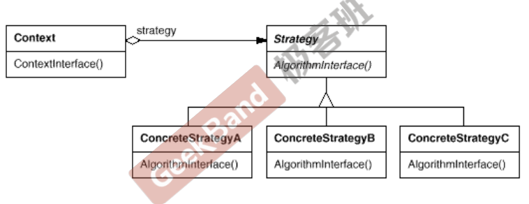

# 策略模式 Strategy

## 动机

- 在软件构建过程中，某些对象使用的算法可能多种多样，经常改变，如果将这些算法都编码到对象中，将会使对象变得异常复杂；而且有时候支持不使用的算法也是一个性能负担
- 如何在运行时根据需要透明地更改对象的算法？将算法与对象本身解耦，从而避免上述问题？

## 模式的定义

- 定义一系列算法，把它们一个个封装起来，并且使用它们可互相替换（变化）。该模式使得算法可独立于使用它的客户程序（稳定）而变化（扩展、子类化）

<div align="center"></div>

## 案例

普通情况下：

```cpp
enum TaxBase
{
    CN_TAX;
    US_TAX;
    RE_TAX;
    FR_TAX;  // 新增一个枚举时，对应代码要增加一个if
};

class SalesOrder
{
    TaxBase tax;
public:
    double CalculateTax()
    {
        if (tax == CN_TAX){ ... }
        else if (tax == US_TAX) { ... }
        else if (tax == DE_TAX) { ... }
        else if (tax == FR_TAX) { /* 新增部分 */ }
    }
};
```

可以看出

- 每新增一个枚举成员，还需要在程序中新增一个if判断句，对该成员进行处理。若成员越来越多，那么判断代码也要变得很多很难维护
- 可考虑使用继承方式，重写基类虚函数即可

改进：

```cpp
class TaxStrategy
{
public:
    // Context表示计算需要的参数
    virtual double Calculate(const Context& context) = 0;
    virtual ~TaxStrategy(){}
};

class CNTax : public TaxStrategy
{
public:
    virtual double Calculate(const Context& context) {}
};

// 需要扩展时只需要继承基类，重写虚函数即可
class USTax : public TaxStrategy
{
public:
    virtual double Calculate(const Context& context) {}
};


class SalesOrder
{
private:
    TaxStrategy* strategy;
public:
    // 这里用到工厂模式创建对应的具体实现类
    SalesOrder(StrategyFactory* strategyFactory): strategy(strategyFactory->newStrategy()){}
    ~SalesOrder() { delete this->strategy; }

    double CalculateTax()
    {
        Context context();
        double val = strategy->Calculate(context); // 多态调用
    }
}
```

## 总结

- Strategy及其子类为组件提供了一系列可重用的算法，从而使得类型在运行时方便地根据需要在各个算法之间进行切换
- Strategy模式提供了用条件判断语句以外的另一种选择，消除条件判断语句，就是在解耦合。含有许多条件判断语句的代码通常都需要Strategy模式
- 如果Strategy对象没有实例变量，那么各个上下文可以共享一个Strategy对象，从而节省对象开销
