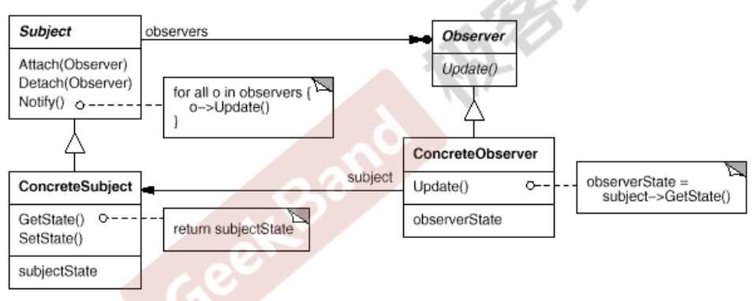

# 装饰器模式 Decorator

"单一职责模式"：在软件组件的设计中，如果责任划分得不清晰，使用继承得到的结果往往是随着需求的变化，子类急剧膨胀，同时充斥着重复代码，这时候的关键是划清责任

- 典型模式
  - Decorator
  - Bridge

## 动机

- 在我们情况我们可能会“过度地使用继承来扩展对象的功能”，由于继承为类型引入的静态特质，使得这种扩展方式缺乏灵活性；并且随着子类的增多（扩展功能的增多），各种子类的组合（扩展功能的组合）会导致更多子类的膨胀
- 如何使“对象功能的扩展”能够根据需要来动态地实现？同时避免“扩展功能的增多”带来的子类膨胀问题？从而使得任何“功能扩展变化”所导致的影响降为最低？

## 模式定义

动态（组合）地给一个对象增加额外地职责。就增加功能而言，Decorator模式比生成子类（继承）更为灵活（消除重复代码&减少子类个数）

<div align="center"></div>

## 例子

需求：流操作，比如IO流，文件流，网络流等，有时候还需要对特定的流进行加密操作

```cpp
// 基类
class Stream
{
public:
    virtual char Read(int number) = 0;
    virtual void Seek(int position) = 0;
    virtual void Write(char data) = 0;

    virtual ~Stream() = 0;
};

// 文件流
class FileStream: public Stream
{
public:
    virtual char Read(int number)
    {
        // 读文件流
    }
    virtual void Seek(int position)
    {
        // 定位文件流
    }
    virtual void Write(char data)
    {
        // 写文件流
    }
};

// 网络流
class NetworkStram: public Stream
{
public:
    virtual char Read(int number)
    {
        // 读网络流
    }
    virtual void Seek(int position)
    {
        // 定位网络流
    }
    virtual void Write(char data)
    {
        // 写网络流
    }
};

// 内存流
class MemoryStream: public Stream
{
public:
    virtual char Read(int number) { }
    virtual void Seek(int position) { }
    virtual void Write(char data) { }
};


// 现在要对文件流、网络流、内存流进行加密操作
class CryptoFileStream: public FileStream
{
public:
    virtual char Read(int number)
    {
        // 额外加密操作
        // ...
        FileStream::Read(number); // 读文件流
    }
    virtual void Seek(int position)
    {
        // 额外加密操作
        // ...
        FileStream::Seek(position);
        // 额外加密操作
        // ...
    }
    virtual void Write(char data)
    {
        // 额外加密操作
        // ...
        FileStream::Write(position);
        // 额外加密操作
        // ...
    }
};
class CryptoNetworkStream: public NetworkStream
{
public:
    virtual char Read(int number)
    {
        // 额外加密操作
        // ...
        NetworkStream::Read(number); // 读文件流
    }
    virtual void Seek(int position)
    {
        // 额外加密操作
        // ...
        NetworkStream::Seek(position);
        // 额外加密操作
        // ...
    }
    virtual void Write(char data)
    {
        // 额外加密操作
        // ...
        NetworkStream::Write(position);
        // 额外加密操作
        // ...
    }
};
class CryptoMemoryStream: public MemoryStream
{
public:
    virtual char Read(int number)
    {
        // 额外加密操作
        // ...
        MemoryStream::Read(number); // 读文件流
    }
    virtual void Seek(int position)
    {
        // 额外加密操作
        // ...
        MemoryStream::Seek(position);
        // 额外加密操作
        // ...
    }
    virtual void Write(char data)
    {
        // 额外加密操作
        // ...
        MemoryStream::Write(position);
        // 额外加密操作
        // ...
    }
};
```

## 要点总结

- 通过采用组合而非继承的手法，Decorator模式实现了在运行时动态扩展对象功能的能力，而且可以根据需要扩展多个功能。避免了使用继承带来的“灵活性差”和“多子类衍生问题”
- Decorator类在接口上表现为is-a Component的继承关系，即Decorator类继承了Component类所具有的接口。但在实现上又表现为has-a Component的组合关系，即Decorator类又使用了另外一个Component类
- Decorator模式的目的并非解决“多子类衍生的多继承”问题，Decorator模式应用的要点在于解决“主体类在多个方向上的扩展功能” -- 是为“装饰”的含义
