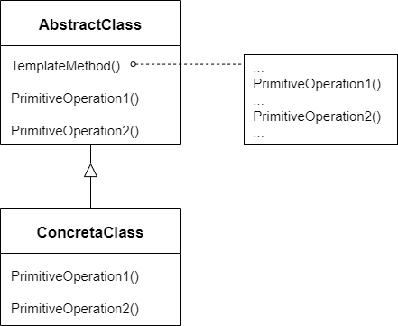

# 模板方法 Template Method

## 动机

在软件构建过程中，对于某一项任务，他常常有稳定的整体操作结构，但各个子步骤却有很多改变的需求，或者由于固有的原因（比如框架与应用之间的关系）而无法和任务的整体结构同时实现

:question: 如何在确定操作结构的前提下，来灵活应对各个子步骤的变化或者晚期实现需求

## 模式的定义

定义一个操作中的算法和骨架（稳定），而将一些步骤延迟（变化）到子类中。Template Method 使得子类可以不改变（复用）一个算法的结构即可重定义（override 重写）该算法的某些步骤

<div align="center"></div>

## 案例

普通情况下：

```cpp
// library.h
// 程序库开发程序员代码如下
class Library
{
public:
    void Step1();
    void Step3();
    void Step5();
};

// app.cpp
// 应用程序开发程序员
class Application
{
public:
    bool Step2();
    void Step4();
};

int main()
{
    Library lib();
    Application app();

    lib.Step1();
    if (app.Step2())
        lib.Step3();

    for (int i = 0;i < 4; ++i)
        app.Step4();

    lib.Step5();
}
```

可以看出：

- Application 和 Library 是紧耦合关系
- 应用程序开发程序员需要在 main 里面自己组织执行的流程，实际上该流程是固定的，Step1->Step5
- 所以可以考虑使用继承，并把调用的流程交给基类去做

改进：

```cpp
// library.h
class Library
{
public:
    ~virtual Library(){}
    void Run()
    {
        Step1();
        if (Step2())
            Step3();

        for (int i = 0;i < 4; ++i)
            Step4();

        Step5();
    }
protected:
    // Step1,Step3,Step5均是稳定的部分
    void Step1(){}
    void Step3(){}
    void Step5(){}

    // Step2,Step4是变化部分，采用虚函数
    virtual bool Step2() = 0;
    virtual void Step4() = 0;
}

// app.cpp
class Application : public Library
{
protected:
    // 子类重写虚函数即可
    virtual bool Step2() {}
    virtual void Step4() {}
}

int main()
{
    Library* lib = new Application();
    lib->run();
    delete lib;
}
```

## 总结

- Template Method 模式是一种非常基础性的设计模式，在面向对象系统中有着大量的应用。它用最简洁的机制（虚函数的多态性）为很多应用程序框架提供了灵活的扩展点，是代码复用方面的基本实现结构
- 除了可以灵活应对子步骤变化外，“不要调用我，让我来调用你”的反向控制结构是 Template Method 的典型应用
- 在具体实现方面，被 Template Method 调用的虚方法可以具有实现，也可以没有任何实现（抽象方法、纯虚方法），但一般推荐将他们设置为 protected 方法
