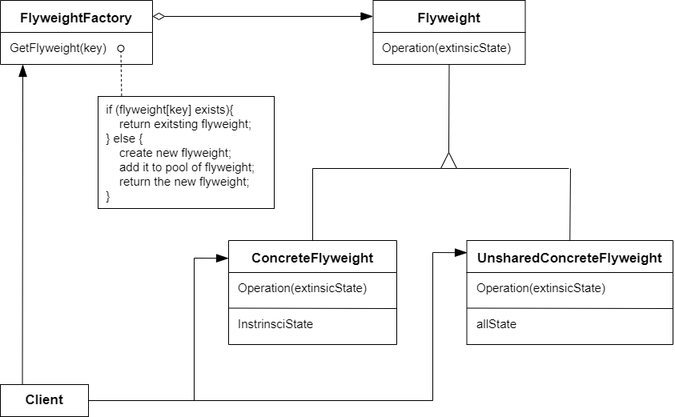

# 享元模式 Flyweight/Cache

## 动机

在软件系统采用纯粹对象方案的问题在于大量细粒度的对象会很快充斥在系统中，从而带来很高的运行代价 -- 主要指内存需求方面

:question: 如何在避免大量细粒度对象问题的同时，让外部客户程序仍然能够透明地使用面向对象的方式来进行操作？

## 模式定义

享元模式是一种结构型设计模式，它摒弃了在每个对象中保存所有数据的方式，通过共享多个对象所共有的相同状态，让你能在有限的内存容量中载入更多对象

运用共享技术有效地支持大量细粒度的对象

<div align="center"></div>

## 例子

### 例 1

```cpp
class Font
{
private:
    string key;
public:
    Font(const string& key) {}
};

class FontFactory
{
private:
    map<string, Font*> fontPool;
public:
    Font* GetFont(const string& key)
    {
        map<string, Font*>::iterator item = fontPool.find(key);

        if (item != footPool.end())
            return fontPool[key];
        else
        {
            Font* font = new Font(key);
            fontPool[key] = font;
            return font;
        }
    }
};
```

### 例 2

```cpp
#include <iostream>
#include <string>
#include <unordered_map>
#include <utility>

class SharedState
{
public:
    SharedState(const std::string& brand, const std::string& model, const std::string& color) :
        brand_(brand), model_(model), color_(color) {}

    friend std::ostream& operator<<(std::ostream& os, const SharedState& ss)
    {
        return os << "[ " << ss.brand_ << " , " << ss.model_ << ", " << ss.color_ << " ]";
    }

    std::string brand_;
    std::string model_;
    std::string color_;
};

class UniqueState
{
public:
    UniqueState(const std::string& owner, const std::string& plates) :
        owner_(owner), plates_(plates) {}

    friend std::ostream& operator<<(std::ostream& os, const UniqueState& us)
    {
        return os << "[ " << us.owner_ << " , " << us.plates_ << " ]";
    }

    std::string owner_;
    std::string plates_;
};

class Flyweight
{
public:
    Flyweight(const SharedState* shared_state_) :
        shared_state_(new SharedState(*shared_state_)) {}
    Flyweight(const Flyweight& other) :
        shared_state_(new SharedState(*other.shared_state_)) {}
    ~Flyweight() {}

    SharedState* GetSharedState() const
    {
        return shared_state_;
    }
    void Operation(const UniqueState& uinque_state) const
    {
        std::cout << "Flyweight: Displaying shared (" << *shared_state_ << ") and unique (" << uinque_state << ") state.\n";
    }

private:
    SharedState* shared_state_;
};

class FlyweightFactory
{
private:
    std::unordered_map<std::string, Flyweight> flyweights_;

    std::string GetKey(const SharedState& ss) const
    {
        return ss.brand_ + "_" + ss.model_ + "_" + ss.color_;
    }

public:
    FlyweightFactory(std::initializer_list<SharedState> shared_states)
    {
        for (const SharedState& ss : shared_states)
            flyweights_.insert(std::make_pair(GetKey(ss), Flyweight(&ss)));
    }

    Flyweight GetFlyweight(const SharedState& shared_state)
    {
        std::string key = GetKey(shared_state);
        if (flyweights_.find(key) == flyweights_.end())
        {
            std::cout << "FlyweightFactory: Can't find a flyweight, creating new one.\n";
            flyweights_.insert(make_pair(key, Flyweight(&shared_state)));
        }
        else
        {
            std::cout << "FlyweightFactory: Reusing existing flyweight.\n";
        }
        return flyweights_.at(key);
    }

    void ListFlyweight() const
    {
        size_t count = flyweights_.size();
        std::cout << "\nFlyweightFactory: I have " << count << " flyweights:\n";
        for (const auto& pair : flyweights_)
            std::cout << pair.first << "\n";
    }
};

void AddCarToPoliceDataBase(FlyweightFactory& ff, const std::string& plates, const std::string& owner, const std::string& brand, const std::string& model, const std::string& color)
{
    std::cout << "\nClient: Adding a car to database.\n";
    const Flyweight& flyweight = ff.GetFlyweight(SharedState(brand, model, color));
    flyweight.Operation(UniqueState(owner, plates));
}

int main(int argc, char* argv[])
{
    FlyweightFactory* factory = new FlyweightFactory({ { "Chevrolet", "Camaro2018", "pink" }, { "Mercedes Benz", "C300", "black" }, { "Mercedes Benz", "C500", "red" }, { "BMW", "M5", "red" }, { "BMW", "X6", "white" } });
    factory->ListFlyweight();

    AddCarToPoliceDataBase(*factory, "CL234IR", "James Doe", "BMW", "M5", "red");
    AddCarToPoliceDataBase(*factory, "CL234IR", "James Doe", "BMW", "x1", "red");
    factory->ListFlyweight();
    delete factory;

    return 0;
}
```

## 应用场景

- 仅在程序必须支持大量对象且没有足够的内存容量时使用享元模式  
  应用该模式所获的收益大小取决于使用它的方式和情景。 它在下列情况中最有效：
  - 程序需要生成数量巨大的相似对象
  - 这将耗尽目标设备的所有内存
  - 对象中包含可抽取且能在多个对象间共享的重复状态

## 优缺点

| <div style="width:150px">优点</div>               | 缺点                                                                                                               |
| ------------------------------------------------- | ------------------------------------------------------------------------------------------------------------------ |
| 1. 如果程序中有很多相似对象，那么可以节省大量内存 | 1. 可能需要牺牲执行速度来换取内存，因为他人每次调用享元方法时都需要重新计算部分情景数据 <br> 2. 代码会变得更加复杂 |

## 要点总结

- 面向对象很好地解决了抽象性的问题，但是作为一个运行在机器中的程序实体，我们需要考虑对象的代价问题。Flyweight 主要解决面向对象的代价问题，一般不触及面向对象的抽象性问题
- Flyweight 采用对象共享的做法来降低系统中对象的个数，从而降低细粒度对象给系统带来的内存压力。在具体实现方面，要注意对象状态的处理
- 对象的数量太大从而导致对象内存开销加大--什么样的数量才算大？这需要我们仔细的根据具体应用情况进行评估，而不能凭空臆断

## 与其他模式的关系

- `享元模式`展示了如何生成大量的小型对象，`门面模式`则展示了如何用一个对象来代表整个子系统
- 可以使用`享元模式`实现`组合模式`树的共享叶节点以节省内存
- 如果能够将对象的所有共享状态简化为一个享元对象，那么`享元模式`就和`单例模式`类似了，但是这两个模式有根本性的不同
  - 只会有一个单例实体，但是享元类可以有多个实体，各实体的内在状态也不同
  - 单例对象是可变的，享元对象是不可变的
