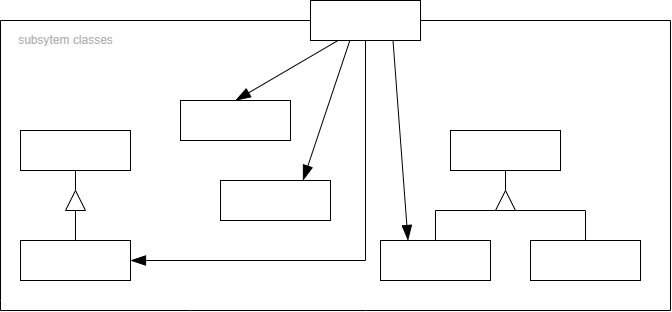

# 门面模式 Facade

## 动机

<div align="center"></div>

- 上述 A 方案的问题在于组件的客户和组件中各种复杂的子系统有了过多的耦合，随着外部客户程序和各子系统的烟花，这种过多的耦合面临很多变化的挑战
- 如何简化外部客户程序和系统间的交互接口？如何将外部客户程序的演化和内部子系统的变化之间的依赖相互解耦？

## 模式定义

外观模式是一种结构型设计模式，能为程序库、框架或其他复杂类提供一个简单的接口

为子系统中的一组接口提供一个一致（稳定）的界面，Facade 模式定义了一个高层接口，这个接口使得这一子系统更加容易使用（复用）

<div align="center"></div>

## 例子

### 例 1

```cpp
#include <string>
#include <iostream>

class Subsystem1
{
public:
    std::string Operation() const
    {
        return "Subsystem1: Ready!\n";
    }
    std::string OperationN() const
    {
        return "Subsystem1: Go!\n";
    }
};

class Subsystem2
{
public:
    std::string Operation() const
    {
        return "Subsystem2: Get ready!\n";
    }
    std::string OperationZ() const
    {
        return "Subsystem2: Fire!\n";
    }
};

class Facade
{
protected:
    Subsystem1* subsystem1_;
    Subsystem2* subsystem2_;

public:
    Facade(Subsystem1* subsystem1 = nullptr, Subsystem2* subsystem2 = nullptr)
    {
        subsystem1_ = subsystem1;
        subsystem2_ = subsystem2;
    }
    ~Facade()
    {
        delete subsystem1_;
        delete subsystem2_;
    }

    std::string Operation()
    {
        std::string result = "Facade initializes subsystems:\n";
        result += subsystem1_->Operation();
        result += subsystem2_->Operation();
        result += "Facade orders subsystems to perform the action:\n";
        result += subsystem1_->OperationN();
        result += subsystem2_->OperationZ();
        return result;
    }
};

void ClientCode(Facade* facade)
{
    std::cout << facade->Operation();
}

int main(int argc, char* argv[])
{
    Subsystem1* subsystem1 = new Subsystem1;
    Subsystem2* subsystem2 = new Subsystem2;
    Facade* facade = new Facade(subsystem1, subsystem2);
    ClientCode(facade);
    delete facade;
    return 0;
}
```

## 应用场景

- 如果你需要一个指向复杂子系统的直接接口，且该接口的功能有限，则可以使用外观模式  
  子系统通常会随着时间的推进变得越来越复杂。即便是应用了设计模式，通常你也会创建更多的类。尽管在多种情形中子系统可能是更灵活或易于复用的，但其所需的配置和样板代码数量将会增长得更快。为了解决这个问题，外观将会提供指向子系统中最常用功能的快捷方式，能够满足客户端的大部分需求

- 如果需要将子系统组织为多层结构，可以使用外观  
  创建外观来定义子系统中各层次的入口。 你可以要求子系统仅使用外观来进行交互， 以减少子系统之间的耦合。

## 优缺点

| <div style="width:150px">优点</div>   | 缺点                                          |
| ------------------------------------- | --------------------------------------------- |
| 1. 你可以让自己的代码独立于复杂子系统 | 1. 外观可能成为与程序中所有类都耦合的上帝对象 |

## 与其他模式的关系

- `门面模式`为现有对象定义了一个新接口，`适配器模式`会试图运用已有的接口。`适配器`通常只封装一个对象，`门面`通常会用于整个对象子系统上
- 当只需对客户端代码隐藏子系统创建对象的方式时，你可以使用`抽象工厂`来代替`门面模式`
- `享元模式`展示了如何生成大量的小型对象，`门面模式`则展示了如何用一个对象来代表整个子系统
- `门面模式`和`中介者模式`的职责类似：它们都尝试在大量紧密耦合的类中组织起合作  
  `门面`为子系统中的所有对象定义了一个简单接口，但是它不提供任何新功能。子系统本身不会意识到外观的存在。子系统中的对象可以直接进行交流  
  `中介者`将系统中组件的沟通行为中心化。各组件只知道中介者对象，无法直接相互交流
- `门面`类通常可以转换为`单例`类，因为在大部分情况下一个外观对象就足够了
- `门面`与`代理模式`的相似之处在于它们都缓存了一个复杂实体并自行对其进行初始化。代理与其服务对象遵循同一接口，使得自己和服务对象可以互换，在这一点上它与外观不同

## 要点总结

- 从客户程序的角度来看，Facade 模式简化了整个组件系统的接口，对于组件内部与外部客户程序来说，达到了一种“解耦”的效果--内部子系统的任何变化不会影响到 Facade 接口的变化
- Facade 设计模式更注重从架构的层次去看整个系统，而不是单个类的层次。Facade 很多时候更是一种架构设计模式
- Facade 设计模式并非一个集装箱，可以任意地放进任何多个对象。Facade 模式中组件的内部应该是“相互耦合关系比较大的一系列组件”，而不是一个简单的功能集合
