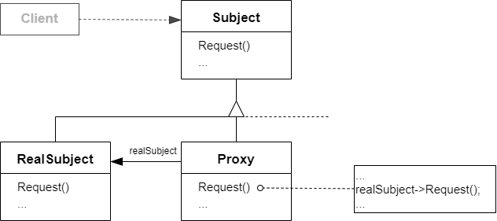

# 代理模式 Proxy

## 动机

在面向对象系统中，有些对象由于某种原因（比如对象创建的开销很大，或者某些操作需要安全控制，或者需要进程外的访问等），直接访问会给使用者、或者系统结构带来很多麻烦

:question: 如何在不失去透明操作对象的同时来管理/控制这些对象特有的复杂性？增加一层间接层是软件开发中常见的解决方式

## 模式定义

代理模式是一种结构型设计模式，让你能够提供对象的替代品或其占位符。代理控制着对于原对象的访问，并允许在将请求提交给对象前后进行一些处理

为其他对象提供一种代理以控制（隔离，使用接口）对这个对象的访问

<div align="center"></div>

## 例子

### 例 1

```cpp
class ISubject
{
public:
    virtual void process() = 0;
};

class RealSubject : public ISubject
{
public:
    virtual void process() {}
};

class ClientApp
{
    ISubject* subject;
public:
    CilentApp()
    {
        subject = new RealSubject();
    }
    void DoTask()
    {
        subject->process();
    }
};
```

以上代码不是很好，可能由于性能、权限等原因无法 new 出 RealSubject 对象

```cpp
class ISubject
{
public:
    virtual void process() = 0;
};

class RealSubject : public ISubject
{
public:
    virtual void process() {}
};

class SubjectProxy : public ISubject
{
    RealSubject realSubject;
public:
    virtual void process()
    {
        // 对RealSubject的一种间接访问
        // ...
    }
}

class ClientApp
{
    ISubject* subject;
public:
    CilentApp()
    {
        subject = new SubjectProxy();
    }
    void DoTask()
    {
        subject->process();
    }
};
```

### 例 2

```cpp
#include <iostream>

class Subject
{
public:
    virtual void Request() const = 0;
};

class RealSubject : public Subject
{
public:
    void Request() const override
    {
        std::cout << "RealSubject: Handling request.\n";
    }
};

class Proxy : public Subject
{
private:
    RealSubject* real_subject_;

    bool CheckAccess() const
    {
        std::cout << "Proxy: Checking access prior to firing a real request.\n";
        return true;
    }
    void LogAccess() const
    {
        std::cout << "Proxy: Logging the time of request.\n";
    }

public:
    Proxy(RealSubject* real_subject) :
        real_subject_(new RealSubject(*real_subject)) {}
    ~Proxy() { delete real_subject_; }

    void Request() const override
    {
        if (CheckAccess())
        {
            real_subject_->Request();
            LogAccess();
        }
    }
};

void ClientCode(const Subject& subject)
{
    subject.Request();
}

int main(int argc, char* argv[])
{
    std::cout << "Client: Executing the client code with a real subject:\n";
    RealSubject* real_subject = new RealSubject;
    ClientCode(*real_subject);
    std::cout << "\n";
    std::cout << "Client: Executing the same client code with a proxy:\n";
    Proxy* proxy = new Proxy(real_subject);
    ClientCode(*proxy);

    delete real_subject;
    delete proxy;
    return 0;
}
```

## 应用场景

- 延迟初始化（虚拟代理）。如果你有一个偶尔使用的重量级服务对象，一直保持该对象运行会消耗系统资源时，可使用代理模式  
  你无需在程序启动时就创建该对象，可将对象的初始化延迟到真正有需要的时候
- 访问控制（保护代理）。如果你只希望特定客户端使用服务对象，这里的对象可以是操作系统中非常重要的部分，而客户端则是各种已启动的程序（包括恶意程序），此时可使用代理模式  
  代理可仅在客户端凭据满足要求时将请求传递给服务对象
- 本地执行远程服务（远程代理）。适用于服务对象位于远程服务器上的情形  
  在这种情形中，代理通过网络传递客户端请求，负责处理所有与网络相关的复杂细节
- 记录日志请求（日志记录代理）。适用于当你需要保存对于服务对象的请求历史记录时  
  代理可以在向服务传递请求前进行记录
- 缓存请求结果（缓存代理）。适用于需要缓存客户请求结果并对缓存生命周期进行管理时，特别是当返回结果的体积非常大时  
  代理可对重复请求所需的相同结果进行缓存，还可使用请求参数作为索引缓存的键值
- 智能引用。可在没有客户端使用某个重量级对象时立即销毁该对象  
  代理会将所有获取了指向服务对象或其结果的客户端记录在案。代理会时不时地遍历各个客户端，检查它们是否仍在运行。如果相应的客户端列表为空，代理就会销毁该服务对象，释放底层系统资源  
  代理还可以记录客户端是否修改了服务对象。其他客户端还可以复用未修改的对象

## 优缺点

| <div style="width:150px">优点</div>                                                                                                                                                                                                                | 缺点                                                                 |
| -------------------------------------------------------------------------------------------------------------------------------------------------------------------------------------------------------------------------------------------------- | -------------------------------------------------------------------- |
| 1. 可以在客户端毫无察觉的情况下控制服务对象 <br> 2. 如果客户端对服务对象的生命周期没有要求，你可以对生命周期进行管理 <br> 3. 即使服务对象还未准备好或不存在，代理也可以正常工作 <br> 4. 开闭原则。可以在不对服务或客户端做出修改的情况下创建新代理 | 1. 代码可能会变得复杂，因为需要新建许多类 <br> 2. 服务响应可能会延迟 |

## 要点总结

- “增加一层间接层”是软件系统中对许多复杂问题的一种常见解决方法。在面向对象系统中，直接使用某些对象会带来很多问题，作为间接层的 proxy 对象便是解决这一问题的常用手段
- 具体 proxy 设计模式的实现方法、实现粒度都相差很大，有些可能对单个对象做细粒度的控制，如 copy-on-write 技术，有些可能对组件模块提供抽象代理层，在架构层次对对象做 proxy
- proxy 并不一定要求保持接口完整的一致性，只要能够实现间接控制，有时候损及一些透明性是可以接受的

## 与其他模式的关系

- `适配器模式`能为被封装对象提供不同的接口，`代理模式`能为对象提供相同的接口，`装饰器模式`则能为对象提供加强的接口
- `门面`与`代理模式`的相似之处在于它们都缓存了一个复杂实体并自行对其进行初始化。代理与其服务对象遵循同一接口，使得自己和服务对象可以互换，在这一点上它与外观不同
- `装饰`和`代理`有着相似的结构，但是其意图却非常不同。这两个模式的构建都是基于组合原则，也就是说一个对象应该将部分工作委派给另一个对象。两者之间的不同之处在于`代理`通常自行管理其服务对象的生命周期，而`装饰`的生成则总是由客户端进行控制
