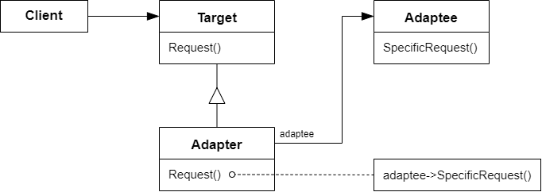

# 适配器 Adapter

## 动机

在软件系统中，由于应用环境的变化，常常需要将“一些现存的对象”放在新的环境中应用，但是新环境要求的接口是这些现存对象所不满足的

:question: 如何应对这种“迁移的变化”？如何既能利用现有对象的良好实现，同时又能满足新的应用环境所要求的接口？

## 模式定义

将一个类的接口转换成客户希望的另一个接口。Adapter 模式使得原本由于接口不兼容而不能一起工作的那些类可以一起工作

<div align="center"></div>

## 例子

```cpp
// 目标结构（新接口）
class ITarget
{
public:
    virtual void process() = 0;
};

// 遗留接口（老接口）
class IAdaptee
{
public:
    virtual void foo(int data) = 0;
    virtual int bar() = 0;
};

// 遗留类型
class OldClass : public IAdaptee { }

// 对象适配器
class Adapter : public ITarget
{
protected:
    IAdaptee* pAdaptee;  // 组合对象 - 所以叫对象适配器
public:
    Adatpter(IAdaptee* pAdaptee)
    { this->pAdaptee = pAdaptee; }
    virtual void process()
    {
        // 伪码表示转换过程
        int data = pAdaptee->bar();
        pAdaptee->foo(data);
    }
};

// 类适配器
class Adapter: public ITarget, protected OldClass
{
    // 多继承方式 - 称为类适配器
    // 不具灵活性，因为OldClass固定死了，不能用IAdaptee是因为IAdaptee是抽象基类，这里不能重写虚函数，不然没有适配器的意义了
}

// 使用方式
int main()
{
    IAdaptee* pAdaptee = new OldClass();

    // 用一个旧接口的类套入新接口中
    ITarget* pTarget = new Adapter(pAdaptee);
    pTarget->process();    I
}

```

注：C++ STL 里面的 stack 和 queue 都是含有一个 deque 的容器，从而实现了一个老接口转向新接口的实现，这就是适配器模式

## 要点总结

- Adapter 模式主要应用于“希望复用一些现存的类，但是接口又与复用环境要求不一致的情况”，在遗留代码复用、类库迁移等方面非常有用
- GoF 23 定义了两种 Adapter 模式的实现结构：对象适配器和类适配器。但类适配器采用“多继承”的实现方式，一般不推荐使用。对象适配器采用“对象组合”的方式，更符合松耦合精神
- Adapter 模式可以实现的非常灵活，不必拘泥于 Gof23 中定义的两种结构。例如，完全可以将 Adapter 模式中的“现存对象”作为新的接口方法参数，来达到适配的目的
