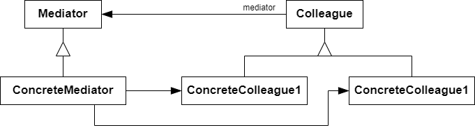

# 中介者 Meiator

## 动机

在对象构建过程中，经常会出现多个对象互相关联交互的情况，对象之间常常会维持一种复杂的引用关系，如果遇到一些需求的更改，这种直接的引用关系将面临不断的变化

:question: 在这种情况下，我们可使用一个“中介对象”来管理对象间的关联关系，避免相互交互的对象之间的紧耦合引用关系，从而更好地抵御变化

## 模式定义

中介者模式是一种行为设计模式，能让你减少对象之间混乱无序的依赖关系。该模式会限制对象之间的直接交互，迫使它们通过一个中介者对象进行合作

用一个中介对象来封装（封装变化）一系列的对象交互。中介者使各对象不需要显示的相互引用（编译时依赖->运行时依赖），从而使其耦合松散（管理变化），而且可以独立地改变他们之间的交互

<div align="center"></div>

## 例子

### 例 1

```cpp
#include <iostream>
#include <string>

class BaseComponent;
class Mediator
{
public:
    virtual void Notify(BaseComponent* sender, std::string event) const = 0;
};

class BaseComponent
{
protected:
    Mediator* mediator_;

public:
    BaseComponent(Mediator* mediator = nullptr) :
        mediator_(mediator) {}
    void SetMediator(Mediator* mediator)
    {
        mediator_ = mediator;
    }
};

class Component1 : public BaseComponent
{
public:
    void DoA()
    {
        std::cout << "Component 1 dose A.\n";
        mediator_->Notify(this, "A");
    }
    void DoB()
    {
        std::cout << "Component 1 dose B.\n";
        mediator_->Notify(this, "B");
    }
};
class Component2 : public BaseComponent
{
public:
    void DoC()
    {
        std::cout << "Component 2 dose C.\n";
        mediator_->Notify(this, "C");
    }
    void DoD()
    {
        std::cout << "Component 2 dose D.\n";
        mediator_->Notify(this, "D");
    }
};

class ConcreteMediator : public Mediator
{
private:
    Component1* component1_;
    Component2* component2_;

public:
    ConcreteMediator(Component1* c1, Component2* c2) :
        component1_(c1), component2_(c2)
    {
        component1_->SetMediator(this);
        component2_->SetMediator(this);
    }
    void Notify(BaseComponent* sender, std::string event) const override
    {
        if (event == "A")
        {
            std::cout << "Mediator reacts on A and triggers following operations:\n";
            component2_->DoC();
        }
        if (event == "C")
        {
            std::cout << "Mediator reacts on D and triggers following operations:\n";
            component1_->DoB();
            component2_->DoC();
        }
    }
};

void ClientCode()
{
    Component1* c1 = new Component1;
    Component2* c2 = new Component2;
    ConcreteMediator* mediator = new ConcreteMediator(c1, c2);
    std::cout << "Client triggers operations A.\n";
    c1->DoA();
    std::cout << "\n";
    std::cout << "Client triggers operations D.\n";
    c2->DoD();

    delete c1;
    delete c2;
    delete mediator;
}

int main(int argc, char* argv[])
{
    ClientCode();
    return 0;
}
```

## 优缺点

| <div style="width:150px">优点</div>                                                                                                                                                                          | 缺点                                      |
| ------------------------------------------------------------------------------------------------------------------------------------------------------------------------------------------------------------ | ----------------------------------------- |
| 1. 单一职责原则。可以将多个组件间的交流抽取到同一位置，使其更易于理解和维护 <br> 2. 开闭原则。无需修改实际组件就能增加新的中介者 <br> 3. 可以减轻应用中多个组件间的耦合情况 <br> 4. 可以更方便地复用各个组件 | 1. 一段时间后，中介者可能演化成为上帝对象 |

## 要点总结

- 将多个对象间复杂的关联关系解耦，Meiator 模式将多个对象间的控制逻辑进行集中管理，变“多个对象互相关联”为“多个对象和一个中介者关联”，简化了系统的维护，抵御了可能的变化
- 随着控制逻辑的复杂化，Mediator 具体对象的实现可能相当复杂。这时候可以对 Mediator 对象进行分解处理
- Facade 模式是解耦系统间（单向）的对象关联关系；Meditor 模式是解耦系统内各个对象之间（双向）的关联关系

## 与其他模式的关系

- `职责链模式`、`命令模式`、`中介者模式`和`观察者模式`用于请求发送者和接收者之间的不同连接方式：
  - `职责链`按照顺序将请求动态地传递给一系列的潜在接收者，直至其中一名接收者对请求进行处理
  - `命令`在发送者和请求者之间建立单向连接
  - `中介者`清除了发送者和请求者之间的直接连接，强制它们通过一个中介对象进行间接沟通
  - `观察者`运行接收者动态地订阅或取消接收请求
- `门面模式`和`中介者模式`的职责类似：它们都尝试在大量紧密耦合的类中组织起合作  
  `门面`为子系统中的所有对象定义了一个简单接口，但是它不提供任何新功能。子系统本身不会意识到外观的存在。子系统中的对象可以直接进行交流  
  `中介者`将系统中组件的沟通行为中心化。各组件只知道中介者对象，无法直接相互交流
- `中介者`和`观察者`之间的区别往往很难记住。在大部分情况下，你可以使用其中一种模式，而有时可以同时使用。让我们来看看如何做到这一点  
  `中介者`的主要目标是消除一系列系统组件之间的相互依赖。这些组件将依赖于同一个中介者对象。`观察者`的目标是在对象之间建立动态的单向连接，使得部分对象可作为其他对象的附属发挥作用  
  有一种流行的`中介者模式`实现方式依赖于`观察者`。中介者对象担当发布者的角色，其他组件则作为订阅者，可以订阅中介者的事件或取消订阅。当中介者以这种方式实现时，它可能看上去与观察者非常相似  
  当你感到疑惑时，记住可以采用其他方式来实现中介者。例如，你可永久性地将所有组件链接到同一个中介者对象。这种实现方式和观察者并不相同，但这仍是一种中介者模式  
  假设有一个程序，其所有的组件都变成了发布者，它们之间可以相互建立动态连接。这样程序中就没有中心化的中介者对象，而只有一些分布式的观察者
